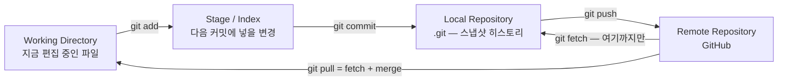
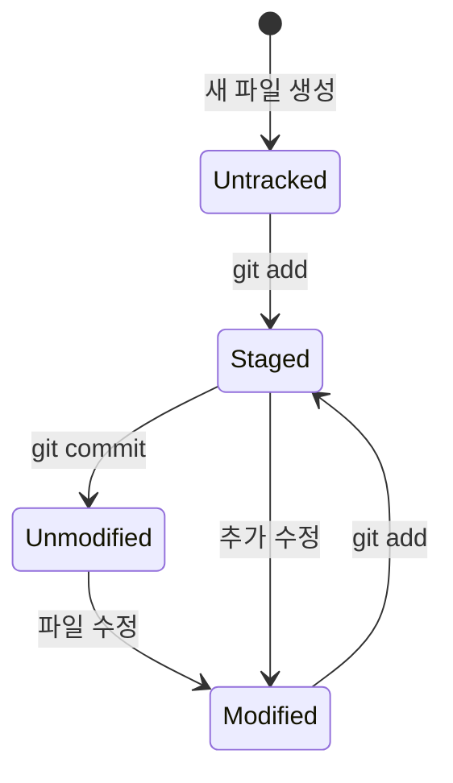
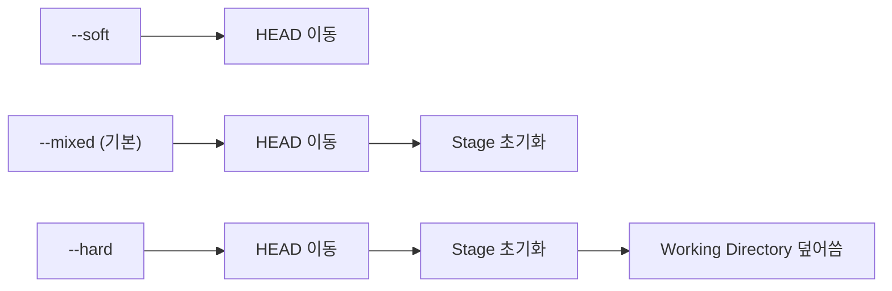

「원격 최신으로 맞춰 주세요」라는 한 문장이 팀 안에서 세 가지 명령으로 실행된다. 하나는 확인만 하고, 하나는 합치고, 하나는 아직 커밋하지 않은 작업물을 지운다. 셋을 가르는 것은 Git 숙련도가 아니라 **무엇이 어디에 저장되어 있는지를 아는가**다.

[편1 — 사람 손에서 뗀 배포를 무엇으로 멈추는가](/blog/backend-engineering/cicd-pipeline-fundamentals/)는 CI/CD가 두 전제 위에 서 있다고 정리했다. 형상관리와 재현 가능한 실행 단위다. 이 편이 앞의 것을 맡는다. 자동화가 형상관리를 전제하는 이유는 「요즘 다 Git을 쓰니까」가 아니다. CI/CD 파이프라인이 하는 일은 결국 **어느 시점의 코드를 집어 어느 시점의 산출물로 바꾸는 것**이고, 실패했을 때 하는 일은 **직전 시점으로 되돌리는 것**이다. 「시점」이 이름으로 지목되지 않으면 두 문장 모두 성립하지 않는다.

그래서 이 편은 둘을 순서대로 정리한다. 먼저 CD가 사람 손을 어디까지 뗄 수 있는지 — 편1이 도식에 조건을 달아 두고 여기로 넘긴 경계다. 그다음이 본론인 Git의 세 영역이고, 「되돌린다」가 왜 한 가지 명령이 아닌지가 거기서 답을 받는다.

## CD가 손을 떼는 지점은 도메인이 정한다

CI와 CD가 각각 무엇을 자동화하는지, 애자일이 왜 이 전부의 방아쇠였는지는 편1이 이미 그렸다. 다시 쓰지 않고 한 칸 안쪽만 본다 — **CD라는 두 글자 안에 서로 다른 것 둘이 들어 있다.**

| 구분 | CI (Continuous Integration) | CD (Continuous Delivery) | CD (Continuous Deployment) |
| --- | --- | --- | --- |
| 목적 | 변경을 자주 통합하고 자동 검증 | 언제든 릴리즈 가능한 상태 유지 | 검증 통과분을 운영까지 자동 반영 |
| 자동화 범위 | 빌드 · 단위/통합 테스트 · 정적 분석 | 스테이징 배포와 릴리즈 아티팩트 생성까지 | 운영 배포까지 |
| 사람 개입 | 코드 리뷰 · PR 승인 | **운영 배포 시 수동 승인이 있다** | 원칙적으로 없다 |
| 안 하면 생기는 일 | 말일 대량 머지 충돌, 결함 발견 지연 | 릴리즈 때마다 준비 작업을 재발명 | 배포 리드타임 증가, 수동 실수 |
| PG · 금융 도메인 | 필수 | **여기까지가 현실적 목표** | 감독·승인 요건 때문에 그대로 적용하기 어렵다 |

셋째 열의 「원칙적으로 없다」는 조직이 고른 값이 아니라 **Continuous Deployment라는 낱말의 정의**다. **운영 반영 앞에** 사람이 누르는 자리가 남아 있으면 그것은 정의상 Deployment가 아니라 Delivery다. 그리고 마지막 행이 그 정의를 실무로 옮길 때 무슨 일이 생기는지 보여 준다.

「CD가 무엇인가」에 Deployment만 답하면 절반이다. Delivery는 **언제든 배포할 수 있는 상태를 항상 유지한다**이고, Deployment는 **사람 승인 없이 운영까지 나간다**다. 결제·금융처럼 승인 절차가 법이나 내규로 강제되는 도메인에서는 Delivery까지를 자동화하고 **마지막 전환 하나만 승인 게이트로 남기는** 형태가 일반적이다.

편1의 도식이 승인 게이트에 「규제 도메인은 사람이 누른다」는 조건을 달아 놓은 것이 이 때문이다. 조건을 떼고 「CD는 사람이 개입하지 않는다」로 읽으면 편1이 세운 **멈출 자리 셋** 중 가운데가 통째로 사라진다. 게이트가 남아 있는 것은 자동화의 실패가 아니라, 그 도메인에서 자동화가 닿을 수 있는 지점이 거기까지라는 뜻이다.

반대쪽 끝도 오독이 아니다. 규제가 걸리지 않는 조직은 이 자리를 실제로 없애고 멈출 자리를 둘로 줄인다. 셋과 둘의 차이는 자동화 성숙도가 아니라 **규제 축의 양 끝**이고, 편1이 「그 경계가 어디인지가 편2의 주제다」로 넘긴 것이 이 축이다.

여기서 「게이트」는 편1이 갈라 둔 두 뜻 중 사람이 누르는 쪽이고, 기계가 수치로 판정하는 Quality Gate는 편6이 맡는다.

리더가 이 표에서 가져갈 것은 한 줄이다. **어느 열을 목표로 삼을지는 팀의 자동화 성숙도가 아니라 감사 요건이 정한다.** 성숙도가 충분해도 규제가 셋째 열을 막으면 둘째 열이 그 조직의 최종 상태이고, 그때 「우리는 아직 CD를 못 한다」는 진단은 틀린 것이다. 파이프라인 설계에서 도구보다 먼저 확인할 것이 이 경계다.

### DevOps는 이 자동화를 누가 맡느냐의 답이다

| 관점 | 정의 |
| --- | --- |
| 사전적 | Development와 Operations의 합성어. 개발부터 배포·운영·모니터링까지 전 생명주기를 관리하며, 릴리즈 주기를 줄이고 문제 해결을 빠르게 하는 것이 목적이다 |
| 실무적 | 클라우드 인프라·모니터링·배포 담당. 서버(VM) 준비와 이중화, 클라우드 리소스 관리, 컨테이너화, 자동화 시스템(CI/CD·알림) 개발, 네트워크 구성 |
| 한 줄 | 시스템 엔지니어링 + 네트워크 엔지니어링 + 자동화 시스템 개발·운영 |

그런데 이 역할의 실제 범위는 조직도가 정한다.

| 조직 상황 | DevOps가 실제로 하는 일 |
| --- | --- |
| 인프라팀이 없다 | 클라우드 서비스만으로 서비스를 운영한다. 인프라 구축과 개발자 지원에 초점이 간다 |
| 인프라팀이 있다 | Dev와 Ops 사이에서 개발팀이 개발에 집중하게 만든다. 컨테이너화·이중화 같은 인프라 업무는 인프라팀 소관이다 |

원본의 결론은 「DevOps는 서포터」다. 기업 규모와 비즈니스 성격에 따라 업무 범위가 달라지지만, 다른 사람이 주인공이 되게 하려면 반드시 필요한 자리라는 점은 변하지 않는다는 것이다. 리더 관점에서 위 두 행은 채용 공고를 쓰기 전의 질문 하나로 읽힌다 — **DevOps를 별도 조직으로 둘 것인가, 백엔드 개발자의 부전공으로 둘 것인가.** 답을 정하는 것은 기술 수준이 아니라 조직 규모다.

## 형상관리를 하는 이유 셋은 같은 것을 요구한다

| 이유 | 내용 |
| --- | --- |
| 시간 여행 | 코드의 변천사를 확인하고 특정 시점으로 되돌린다(Rollback) |
| 협업 | 같은 소스를 여럿이 고칠 때 나는 충돌을 규칙 있게 해결한다 |
| 안정성 확보 | 장애가 나면 직전 정상 버전으로 즉시 복귀한다 |

세 줄 모두 「특정 시점」·「직전 정상 버전」처럼 **시점을 이름으로 지목한다.** 형상관리가 CI/CD 파이프라인의 전제인 이유가 여기 있다 — 자동화는 시점을 지목할 수 없으면 아무것도 못 한다. 무엇을 배포할지도, 어디로 되돌릴지도 「그것」을 부를 이름이 있어야 성립한다.

둘째 행만 성격이 조금 다르다. 시점을 지목한다는 점은 같지만, 여러 줄기가 동시에 자라고 있는 상태를 전제로 깔고 있다. 그 줄기를 언제 어떤 규칙으로 합칠지가 브랜치 전략이고, 이 편은 거기까지 가지 않는다 — 편3이 컨테이너와 나란히 맡는다. 여기서는 줄기 하나 안에서 시점이 어떻게 쌓이고 어떻게 되감기는지만 본다.

한 가지는 층위를 갈라 둔다. Git과 GitHub는 같은 자리에 놓고 말할 수 있는 것이 아니다. Git은 형상관리를 수행하는 VCS이고, GitHub는 Git 저장소를 원격에 두고 협업 부가기능(PR·리뷰·Actions·권한)을 얹은 **서비스**다. 뒤의 편들이 「저장소 이벤트가 파이프라인을 트리거한다」고 말할 때 그 이벤트를 만들어 내보내는 쪽은 Git이 아니라 GitHub다.

## Git의 세 트리 — 이 편의 핵심 모델

Git이 파일을 두는 곳은 셋이다. 낱말부터 못 박는다.

- **WD (Working Directory, 작업 디렉터리)** — 지금 에디터로 열어 놓고 고치는 실제 파일이다. 디스크에 보이는 그대로다.
- **Stage (Index, 스테이지·인덱스)** — `git add`로 올린, 다음 커밋에 포함시킬 변경을 모아 두는 대기 장소다. 이 시리즈에서 `Stage`는 셋을 가리키는데 **이 편에서 쓰는 것은 Git의 Index 뜻**이다. 편3의 Docker 멀티스테이지 빌드, 편5·편6의 Jenkins `stage()` 블록과는 다른 것이다. [편1의 낱말 구분표](/blog/backend-engineering/cicd-pipeline-fundamentals/#시리즈-안에서-갈리는-넷)가 셋을 나란히 놓고 갈라 둔다.
- **Local Repository (`.git`)** — 커밋 스냅샷과 브랜치, 원격 주소가 들어 있는 히스토리 전체다.

세 곳은 담는 것도 다르고, 잃었을 때 사라지는 것도 다르다.

| 트리 | 무엇을 담는가 | 잃으면 |
| --- | --- | --- |
| Working Directory | 지금 편집 중인 실제 파일 | 커밋하지 않은 작업물이 사라진다. **어디에도 사본이 없다** |
| Stage (Index) | 다음 커밋에 포함할 변경 목록 | 커밋 구성을 다시 지정하면 된다 |
| Local Repository (`.git`) | 커밋 스냅샷·브랜치·원격 주소 등 히스토리 전체 | 로컬 히스토리 전부. 원격에 밀어 둔 데까지는 복구된다 |

오른쪽 열이 이 글에 남은 모든 판단의 기준이다. **위험한 명령이 따로 있는 것이 아니라, 사본 없는 트리를 건드리는 명령이 위험한 것이다.** 아래 두 행은 각각 재작업과 원격이 받쳐 주지만 첫 행은 받쳐 주는 것이 없다.

### 파일이 지나가는 상태

- `Untracked` — Git이 변경을 추적하지 않는 상태다. 새로 만든 파일이 여기 있다
- `Tracked`는 다시 셋으로 갈린다 — `Unmodified`(수정 없음) · `Modified`(수정함) · `Staged`(스테이지에 올림)
- 커밋하면 스테이지가 비고 모든 파일이 `Unmodified`로 돌아간다. 수정 없이는 커밋할 수 없다

`Modified → Staged`와 `Staged → Modified`가 둘 다 그려져 있는 것이 요점이다. 스테이지에 올린 뒤에 같은 파일을 또 고치면 **한 파일이 두 상태에 동시에 걸린다.** 커밋에 들어가는 것은 `add`한 시점의 내용이고 그 뒤의 수정분은 남는다. `git status`가 같은 파일 이름을 위아래 두 칸에 겹쳐 보여 주는 상황이 이것이다.

### HEAD — 지금 어느 시점에 서 있는가

세 트리가 「무엇이 어디에 있는가」라면 **HEAD**는 「지금 어느 시점에 서 있는가」다. **현재 체크아웃된 브랜치 또는 커밋을 가리키는 포인터**이고, 앞의 세 트리와 달리 내용을 담지 않고 위치만 가리킨다.

| 개념 | 내용 |
| --- | --- |
| HEAD | 현재 브랜치 또는 커밋을 가리키는 포인터. 브랜치 이동, 과거 커밋으로의 시간여행, 지금 로드된 코드 식별에 쓴다 |
| Detached HEAD | HEAD가 브랜치가 참조하는 커밋이 아니라 그보다 과거의 커밋을 직접 가리키는 상태 |
| 위험 | 이 상태에서 커밋하면 어떤 브랜치도 그 커밋을 참조하지 않아 사실상 유실된다. `reflog`로만 추적된다 |
| 대응 | 과거 커밋에서 작업을 이어가려면 즉시 새 브랜치를 만든다 |

Detached HEAD가 위험한 이유는 커밋이 지워져서가 아니라 **이름이 없어서**다. 객체는 저장소에 그대로 남지만 아무 브랜치도 그것을 가리키지 않으므로 부를 방법이 사라진다. 앞에서 「시점을 이름으로 지목할 수 있어야 자동화가 성립한다」고 한 것의 가장 작은 반례가 이것이다.

## fetch와 pull — 가져오는 것과 합치는 것

| 주제 | `git fetch` | `git pull` |
| --- | --- | --- |
| 동작 | 원격의 변경을 로컬 저장소로만 가져온다. 병합하지 않는다 | 원격 변경을 가져와 현재 작업 디렉터리에 병합한다(fetch + merge) |
| 갱신 대상 | `.git` 디렉터리의 저장소 데이터 | 작업 디렉터리가 직접 갱신된다 |
| 충돌 가능성 | 없다 | 같은 곳을 양쪽에서 고쳤다면 충돌한다 |
| 용도 | 병합 전에 무엇이 바뀌었는지 먼저 확인할 때 | 원격 최신 상태로 소스를 맞출 때 |

둘의 차이는 「빠른가」가 아니라 **몇 번째 트리까지 가는가**다. `fetch`는 Local Repository에서 멈추고 `pull`은 Working Directory까지 간다. 충돌이 `fetch`에서 나지 않는 이유도 여기서 나온다 — 합치지 않으면 충돌할 자리가 없다.

## 원본 도입부의 세 질문

원본이 첫머리에 던진 질문 셋이다. 셋 다 같은 방식으로 답한다 — **어느 트리를 어디까지 건드리는가.**

명령은 원본이 적은 그대로 옮긴다. 저장소가 실제로 가진 ref 이름은 고치면 돌아가지 않기 때문이다. 기본 브랜치를 `main`으로 두는 저장소라면 아래 `origin/master`는 `origin/main`으로 읽으면 된다.

| 명령 | 하는 일 | 건드리는 트리 | 위험도 |
| --- | --- | --- | --- |
| `git fetch --all` | 등록된 **모든 원격(remote)** 의 브랜치·태그 메타데이터와 객체를 로컬 저장소로 내려받는다. 작업 디렉터리는 그대로다 | Local Repository만 | 안전 |
| `git reset --hard origin/master` | 현재 브랜치 포인터를 그 커밋으로 옮기고 **Stage와 Working Directory까지 그 시점으로 강제로 덮어쓴다** | 세 트리 전부 | 매우 위험 — 커밋하지 않은 로컬 변경은 복구할 수 없다 |
| `git pull origin master` | 원격의 그 브랜치를 fetch한 뒤 현재 브랜치에 merge한다. 충돌이 나면 해결해야 한다 | Local Repository + Working Directory | 중간 — 충돌과 의도치 않은 병합 커밋 |

왜 이 셋을 붙여서 묻는가. 실무에서 **「원격 최신으로 맞춰 주세요」라는 한 문장이 이 셋 중 무엇으로 실행되느냐에 따라 결과가 전혀 다르기 때문이다.** `fetch --all`은 확인만 하고, `pull`은 합치고, `reset --hard`는 지운다. 앞의 둘은 되돌릴 수 있지만 셋째는 커밋되지 않은 변경을 되돌릴 수 없다.

이 구분이 CI/CD 파이프라인으로 그대로 넘어온다. 배포 스크립트나 파이프라인 스크립트 안에 `reset --hard`를 넣을 때는 **그 워크스페이스가 순수한 CI 작업 공간인가, 사람이 쓰는 디렉터리인가**를 먼저 갈라야 한다. 앞이면 매 실행이 깨끗한 시점에서 시작한다는 뜻이라 오히려 재현성 장치가 되고, 뒤면 남의 작업물을 지우는 명령이다. 같은 한 줄이 어느 쪽에 놓이느냐로 안전장치가 되기도 하고 사고가 되기도 한다.

## reset 세 모드 — 어디까지 되돌릴 것인가

원본에는 `reset` 상세가 없지만 위 질문에 답하려면 필요하다. 세 모드의 차이는 옵션 이름이 아니라 **세 트리 중 어디까지 손대는가**로 읽으면 한 번에 정리된다.

| 모드 | HEAD(브랜치 포인터) | Stage (Index) | Working Directory | 쓰는 자리 |
| --- | --- | --- | --- | --- |
| `--soft` | 이동 | 유지 | 유지 | 여러 커밋을 하나로 다시 묶을 때. 변경 내용이 스테이지에 그대로 남는다 |
| `--mixed` (기본) | 이동 | 초기화 | 유지 | 커밋만 취소하고 변경은 남겨 `add`부터 다시 할 때 |
| `--hard` | 이동 | 초기화 | **덮어쓴다** | 로컬 상태를 특정 커밋과 완전히 같게 만들 때. 유실을 감수한다 |

위에서 아래로 갈수록 미치는 범위가 한 트리씩 넓어진다. 세 모드는 서로 다른 일을 하는 것이 아니라 **같은 일을 어디에서 멈추느냐**만 다르다.

앞의 「잃으면」 표와 겹쳐 읽으면 `--hard`만 유독 위험한 이유가 나온다 — 세 줄 중 그것만이 사본 없는 트리까지 간다.

`reset`과 `revert`도 같은 축에서 갈린다. **`reset`은 히스토리를 되감고, `revert`는 되돌리는 새 커밋을 추가한다.** 이미 push한 커밋을 `reset`으로 되돌리면 강제 푸시가 필요하고 그것은 동료의 히스토리를 깨뜨린다. 그래서 **공유 브랜치에서는 `revert`가 원칙이다.**

「되돌린다」가 한 가지 일이 아니라는 이 편의 제목이 여기서 두 번 갈린 셈이다. 한 번은 **어느 트리까지 되돌리는가**로(`--soft` · `--mixed` · `--hard`), 또 한 번은 **히스토리를 지울 것인가 덧붙일 것인가**로(`reset` · `revert`). 앞의 갈림은 내 로컬에서 끝나지만 뒤의 갈림은 남의 저장소까지 간다.

## 기초 명령이 어디에 걸리는지

| 명령 | 역할 | 유의점 |
| --- | --- | --- |
| `git init` | 로컬 저장소를 만들고 초기화한다(`.git` 생성) | 프로젝트 루트에서 실행한다 |
| `git status` | 추적 여부와 변경 여부를 확인한다 | 커밋 전에 항상 확인한다 |
| `git add` | 변경을 스테이지에 올린다. Untracked를 Tracked로 바꾼다 | `add .`은 의도치 않은 파일이 딸려 들어갈 위험이 있다 |
| `git commit` | 스테이지 기준으로 새 스냅샷을 만든다 | 수정된 파일이 스테이지에 있어야 가능하다 |
| `git log` | 커밋 히스토리와 브랜치 참조를 본다 | HEAD 위치 파악에 쓴다 |
| `git remote add` | 로컬 저장소와 원격 저장소를 연결한다 | `git remote -v`로 확인한다 |
| `git push origin <branch>` | 로컬 커밋을 원격 브랜치에 반영한다 | `--set-upstream`으로 추적 브랜치를 건다 |
| `git fetch` / `git pull` | 원격 변경을 가져온다 / 가져와 병합한다 | 위의 fetch·pull 표 참조 |
| `git tag` | 특정 커밋에 버전 꼬리표(`v1.0.0`)를 붙인다 | 아래 절이 이 한 줄을 위한 것이다 |

## 배포의 기준은 브랜치가 아니라 태그다

이 편에서 뒤의 네 편으로 그대로 넘어가는 결론이 하나 있다.

`main` 브랜치를 그대로 배포하면 「지금 운영에 무엇이 올라가 있나」를 커밋 ID로 설명해야 한다. 40자리 해시이거나 잘라 쓴 일곱 자리이고, 어느 쪽이든 사람이 기억하거나 회의에서 부를 수 있는 이름이 아니다. 게다가 브랜치는 움직인다 — 어제 배포한 `main`과 오늘의 `main`은 같은 이름이 다른 커밋을 가리키므로, 「`main`을 배포했다」는 문장은 애초에 시점을 지목하지 못한다.

태그를 붙이면 그 자리에 버전명 하나가 들어간다. `v1.4.2`는 움직이지 않고, 릴리즈 범위와 변경 내역을 그 이름 하나로 지목할 수 있다. 앞에서 형상관리의 이유 셋이 전부 「특정 시점을 지목한다」로 모였고 Detached HEAD가 위험한 이유가 「이름이 없어서」였던 것과 같은 이야기다. **태그는 배포에 이름을 주는 장치다.**

그래서 뒤의 편들이 태그를 배포 단위로 놓는다. 편3이 브랜치 전략을 다루면서 릴리즈 단위를 어디서 끊는지 정하고, 편7이 「브랜치를 그대로 배포하면 무엇이 안 되는가」를 질문 하나로 다시 정면에서 묻는다. 뒤에서 태그가 근거 없이 튀어나온 것처럼 보인다면 이 절을 떠올리면 된다.

## 정리

- **CD는 한 낱말이 아니다.** Delivery와 Deployment가 갈리는 자리에 사람 손이 있고, 그 손을 뗄 수 있는지는 기술 수준이 아니라 도메인 규제가 정한다. 규제 도메인에서 승인 게이트가 남는 것은 자동화의 미완성이 아니다.
- **Git은 파일을 세 곳에 나눠 둔다.** 위험한 명령이 따로 정해져 있는 것이 아니라, 사본 없는 트리를 건드리는 명령이 위험한 것이다. `reset --hard`도 `pull`도 이 기준으로 줄을 세울 수 있다.
- **「되돌린다」는 두 번 갈린다.** 어느 트리까지 되돌리는가, 그리고 히스토리를 지울 것인가 덧붙일 것인가.
- **시점을 이름으로 지목할 수 없으면 자동화는 아무것도 못 한다.** 태그가 그 이름이다.

[편1](/blog/backend-engineering/cicd-pipeline-fundamentals/)은 자동화의 값을 「**멈출 자리를 세 군데 남긴 채** 빨라진 것」으로 정리했다. 그 문장은 절반이다. 멈춘 다음에 되돌릴 수 있어야 값이 완성되고, 되돌리려면 어디로 되돌릴지를 부를 이름이 있어야 한다. 이 편이 다룬 세 트리와 태그가 그 좌표계다.

다음 편은 남은 전제를 연다. 무엇을 단위로 합치고(브랜치 전략) 무엇을 단위로 나르는가(컨테이너 이미지)다. 이 편이 「어느 시점인가」를 정했다면 편3은 「어느 덩어리인가」를 정한다.
