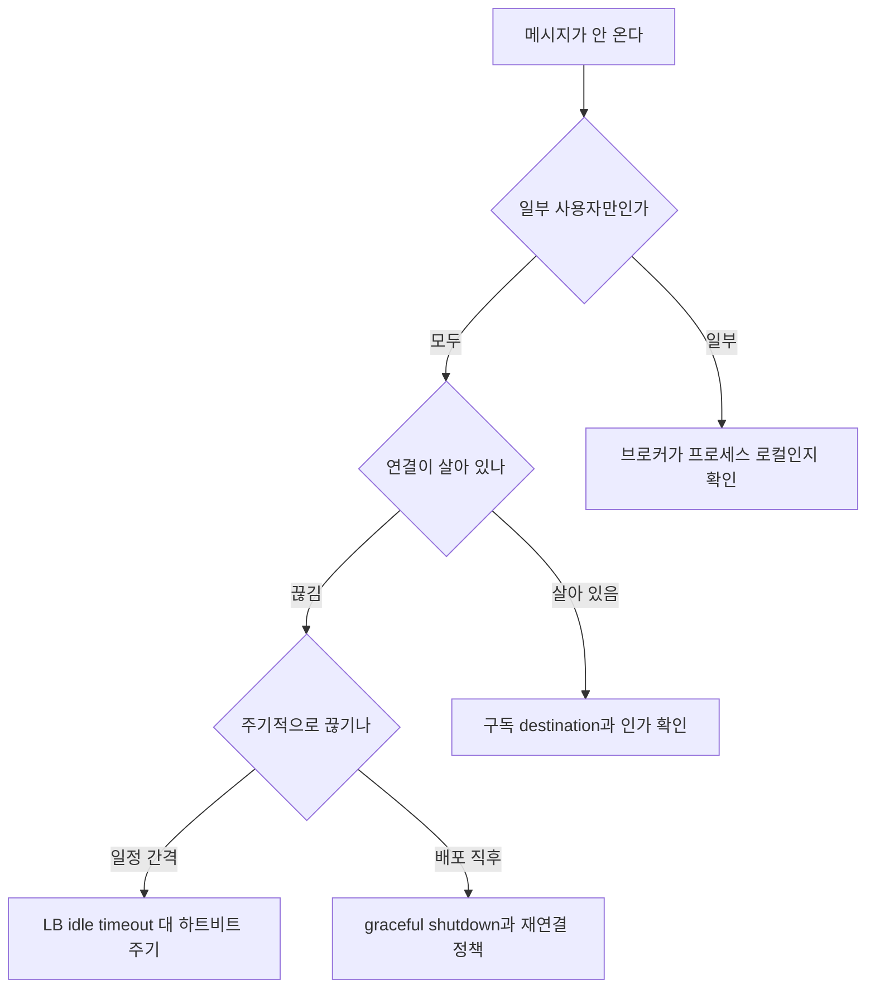

앞 네 편은 각각 하나의 질문에 답했다. 이 글은 그 답들을 한자리에 모아 **고를 때 쓰는 표 · 터졌을 때 쓰는 표 · 설명해야 할 때 쓰는 문답** 세 벌로 다시 짠다.

쓰임새가 갈린다. 아직 아무것도 정하지 않았다면 첫 표부터 보면 되고, 이미 돌아가는 채팅에서 메시지가 안 온다거나 연결이 자꾸 끊긴다면 두 번째 표의 증상 열에서 출발하는 편이 빠르다. 문답은 남에게 근거를 대야 할 때 쓴다.

| 편 | 그 편이 세운 축 | 이 글에서 받는 묶음 |
|---|---|---|
| [1. 전송 방식과 WebSocket 프로토콜](/blog/backend-engineering/realtime-transport-and-websocket/) | 양방향이 필요한가 | 전송과 프로토콜 5문답 |
| [2. STOMP와 Spring의 WebSocket 지원](/blog/backend-engineering/stomp-and-spring-websocket/) | 연결 위에 무엇을 얹는가 | 규약과 라우팅 3문답 |
| [3. OAuth2 로그인과 채팅 도메인](/blog/backend-engineering/oauth2-login-and-chat-domain/) | 보낸 사람을 어떻게 아는가 | 인증 5문답 · 도메인 2문답 |
| [4. 스케일아웃과 세션](/blog/backend-engineering/realtime-scaleout-and-session/) | 서버를 늘리면 무엇이 깨지는가 | 확장 5문답 · 데이터베이스 5문답 |

## 선택지 7개 — 무엇을 얻고 무엇을 내주는가

| 선택지 | 장점 | 단점 | 언제 쓰나 |
|---|---|---|---|
| 생 WebSocket Handler | 완전한 제어, 의존성 최소 | 라우팅·구독을 직접 구현 | 프로토콜이 단순하고 방 개념이 없을 때 |
| STOMP + SimpleBroker | 빠른 구현, 표준 규약 | 단일 서버 한정 | MVP·사내 도구 |
| STOMP + 외부 브로커 | 다중 서버, ACK·영속성 | 브로커 운영·SPOF 관리 | 실서비스 다중 인스턴스 |
| Sticky Session | 코드 변경 없음 | 서버 장애 = 세션 소멸, 배포마다 유실 | 임시 방편 |
| Redis Session | 무상태 서버, 무중단 배포 | 직렬화 계약, Redis 의존 | 실서비스 기본값 |
| JWT | 저장소 불필요 | 즉시 무효화 곤란 | 외부 API·모바일 |
| SSE | 인프라 재사용, 자동 재연결 | 단방향 | 알림 전용 |

표를 위에서 아래로 읽으면 **제어를 내주고 표준을 얻는 순서**로 배열돼 있다. 맨 위는 전부 직접 만들고 전부 통제하며, 아래로 갈수록 규약과 인프라에 맡기는 대신 그 규약이 정한 방식을 따르게 된다. 맨 아래 줄만 성격이 다르다 — SSE는 이 사다리의 어느 단계도 아니고, **애초에 사다리를 오르지 않는 선택**이다.

## 실패 모드 10가지 — 증상에서 대응으로

| 장애 | 증상 | 원인 | 대응 |
|---|---|---|---|
| 스케일아웃 후 메시지 누락 | 어떤 사용자에겐 오고 어떤 사용자에겐 안 옴. **에러 없음** | SimpleBroker가 프로세스 로컬 | 외부 브로커(Relay) 또는 Redis Pub/Sub 도입 |
| 로그인 직후 예외 | `NotSerializableException` | 세션 외부화 후 인증 객체 미직렬화 | `Serializable` 구현. 세션엔 식별자만 담기 |
| 배포 후 간헐적 로그아웃 | 일부 요청만 세션 인식 실패 | 구·신 버전 간 직렬화 스키마 불일치 | JSON 직렬화 고정, 필드 변경 시 세션 무효화 배포 |
| 60초마다 연결 끊김 | 주기적 재접속 반복 | LB·프록시 idle timeout | 하트비트 주기를 timeout보다 짧게 설정 |
| 서버 재시작 시 접속 폭주 | CPU 스파이크, 연쇄 장애 | 전 클라이언트 동시 재연결 | 지수 백오프 + 지터, 신규 연결 rate limit |
| 방금 보낸 메시지가 목록에 없음 | 새로고침하면 나타남 | 복제 지연 | 쓰기 직후 조회는 원본으로 강제 |
| 읽기 부하가 복제본으로 안 감 | 원본 CPU만 상승 | `@Transactional(readOnly = true)` 누락 또는 `LazyConnectionDataSourceProxy` 미적용 | 프록시 적용 확인, 읽기 메서드 규약화 |
| 과거 메시지 스크롤이 점점 느림 | 오래된 대화 조회 지연 | Offset 페이징 | 커서 페이징 + `(room_id, id DESC)` 복합 인덱스 |
| 남의 방 메시지 열람 | 권한 없는 대화 노출 | 구독 시 참여자 검증 누락 | `ChannelInterceptor`에서 SUBSCRIBE destination 인가 |
| 서버 메모리 지속 증가 | OOM으로 재시작 | 죽은 세션이 맵에 잔류 | ping/pong 기반 세션 정리, 연결 종료 이벤트 훅 |

**첫 행이 가장 위험하다.** 나머지 아홉은 예외나 지표로 드러나지만, 이것만은 시스템이 정상이라고 보고한다. 보낸 쪽에서는 성공했고 로그도 깨끗하며, 같은 서버에 붙은 사용자들에게는 실제로 도착한다. 사용자 신고로만 발견되는 유형이다.

### 증상에서 출발하면 순서가 있다

위 표는 원인별로 묶여 있지만 실무에서는 증상이 먼저 온다. "메시지가 안 온다"는 신고 하나에 위 표의 여러 행이 후보로 걸리므로, 갈라내는 순서를 정해 두는 편이 빠르다.

**첫 분기가 가장 많은 것을 가른다.** 전원이 못 받으면 전파 경로가 아니라 연결이나 구독의 문제이고, 일부만 못 받으면 그 일부가 어느 서버에 붙어 있는지부터 본다. 서버별로 갈리면 브로커, 사용자별로 갈리면 인가다.

## 전송과 프로토콜 5문답

| # | 질문 | 답변 뼈대 |
|---|---|---|
| 1 | WebSocket과 HTTP의 차이는 | HTTP는 무상태 요청·응답이고 서버가 먼저 보낼 수 없다. WS는 1회 핸드셰이크 후 지속 연결·양방향이며 프레임 헤더가 2~14바이트다 |
| 2 | 핸드셰이크 과정을 설명하라 | `Upgrade: websocket` + `Sec-WebSocket-Key` 요청 → 서버가 Key+GUID의 SHA-1을 base64로 담아 **101 Switching Protocols** 응답 → 이후 프레임 교환 |
| 3 | Polling·Long Polling·SSE·WebSocket을 언제 각각 쓰나 | 단방향이면 SSE(인프라 재사용·자동 재연결), 양방향·저지연이면 WS, 레거시 호환이면 롱폴링. **양방향이 필요 없으면 WS를 안 쓰는 게 낫다** |
| 4 | 프레임에서 마스킹은 왜 하나 | 클라이언트→서버는 필수. 중간 프록시가 프레임을 HTTP로 오인해 캐시를 오염시키는 공격을 막는다. 브라우저에서 나가는 쪽만 페이로드를 공격자가 정할 수 있어 그 방향에만 요구된다 |
| 5 | 하트비트는 왜 필요한가 | TCP는 상대의 조용한 종료를 즉시 알리지 않는다. 죽은 세션 정리와 NAT·LB idle timeout 회피가 목적. WS ping/pong과 STOMP heart-beat는 다른 계층이다 |

1번부터 3번까지가 하나의 판단으로 이어진다. HTTP와의 차이를 아는 것은 **무엇을 얻는가**이고, 다섯 방식을 가르는 것은 **무엇을 치르는가**다. 3번의 답이 "양방향이 아니면 쓰지 않는다"로 끝나는 이유는, 얻는 것이 지연 감소인데 치르는 것은 인프라 전반의 제약이기 때문이다.

## 규약과 라우팅 3문답

| # | 질문 | 답변 뼈대 |
|---|---|---|
| 6 | STOMP를 왜 쓰나. 없으면 뭐가 문제인가 | WS는 바이트 스트림만 보장한다. 구독·라우팅·1:1 전달을 직접 구현해야 하고, STOMP는 이를 표준 명령어로 제공한다 |
| 7 | `/app`과 `/topic`의 차이는 | `/app`은 `@MessageMapping` 컨트롤러를 경유하고(저장·검증), `/topic`은 브로커로 직행한다. **저장·인가가 필요하면 반드시 `/app`** |
| 8 | SimpleBroker와 외부 브로커의 차이 | SimpleBroker는 인메모리·프로세스 로컬이라 다중 서버에서 메시지가 조용히 유실된다. 외부 브로커는 서버 간 전파·ACK·영속성을 제공한다 |

7번은 인가 우회로 이어진다. `/topic`으로 직접 보낼 수 있으면 방 참여 여부 검사가 통째로 건너뛰어진다. **접두사 분리는 코드 정리가 아니라 보안 경계**라는 것이 2편의 결론이었다.

## 인증 5문답

| # | 질문 | 답변 뼈대 |
|---|---|---|
| 9 | WebSocket에서 인증은 어디서 하나 | ① 핸드셰이크(HTTP라 쿠키·세션 사용 가능, 1회) ② `clientInboundChannel`의 `ChannelInterceptor`(STOMP CONNECT·SUBSCRIBE마다) |
| 10 | 브라우저 WS는 커스텀 헤더를 못 붙이는데 JWT를 어떻게 전달하나 | 쿠키 / 쿼리 파라미터 / STOMP CONNECT 프레임 헤더. 권장은 CONNECT 헤더 — URL과 로그에 토큰이 남지 않는다 |
| 11 | 핸드셰이크에서만 인증하면 안 되는 이유 | 연결이 장시간 유지되는 동안 토큰 만료·권한 회수가 반영되지 않는다. 주기적 재검증이나 서버발 강제 종료 경로가 필요하다 |
| 12 | OAuth2 Authorization Code Grant를 설명하라 | 인가 서버로 리다이렉트 → 로그인 → code 발급 → **서버 대 서버로 code와 secret을 토큰과 교환** → 자원 접근. 토큰이 브라우저를 지나가지 않게 하는 구조다 |
| 13 | 폼 로그인과 OAuth2 로그인의 구조 차이 | 필터·프로바이더·유저서비스·유저객체가 1:1 대칭이다. 그래서 공급자 추가가 설정과 매핑 분기로 끝난다 |

9번과 11번은 짝으로 읽어야 한다. 앞의 검사는 문을 잠그고 뒤의 검사는 안에 들어온 사람을 계속 확인하는데, **어느 하나만 두면 나머지 하나가 막던 것이 그대로 열린다.** 10번에서 쿠키를 고른 경우에는 조건이 하나 더 붙는다 — WebSocket 핸드셰이크에 동일 출처 정책이 걸리지 않으므로 `Origin`을 직접 확인해야 한다.

## 도메인 2문답

| # | 질문 | 답변 뼈대 |
|---|---|---|
| 14 | 채팅 메시지 페이징을 어떻게 설계하나 | 커서(keyset) 페이징. `WHERE id < :lastId ORDER BY id DESC LIMIT n`에 `(room_id, id DESC)` 인덱스. offset은 깊어질수록 느리고 실시간 삽입에 경계가 흔들린다 |
| 15 | 안 읽은 메시지 알림을 어떻게 구현하나 | 참여자 엔티티에 마지막 읽음 메시지 id를 보관하고 최신 id와의 차이로 센다. 방을 전부 구독하는 대신 `/user/queue/notify` 단일 채널을 쓴다 |

15번의 전제가 3편에서 다룬 중간 엔티티다. 중간 테이블 생성을 JPA에 맡겨 버리면 읽음 지점을 적어 둘 컬럼을 붙일 곳이 사라지고, 그러면 이 기능 자체가 서지 않는다.

## 확장 5문답

| # | 질문 | 답변 뼈대 |
|---|---|---|
| 16 | 서버를 2대로 늘렸더니 메시지가 일부만 간다. 원인은 | SimpleBroker가 프로세스 로컬이고 상대 소켓이 다른 서버에 붙어 있다. 브로커 Pub/Sub 도입이 답이다 |
| 17 | 스티키 세션의 문제는 | 서버 장애 시 세션이 전부 소멸하고, 부하 재분배가 불가능하며, 롤링 배포마다 유실된다. 세션 외부화로 간다 |
| 18 | 세션을 Redis로 옮길 때 주의점 | 세션 객체 전부가 직렬화 대상이 된다. 스키마 변경 시 구·신 버전 호환 문제가 생기므로 엔티티 대신 식별자만 넣고 포맷은 JSON을 권장한다 |
| 19 | 세션 외부화하면 WebSocket 확장이 다 해결되나 | 아니다. **연결 자체는 외부화가 불가능하다.** 세션은 Redis로, 메시지 전파는 브로커로, 연결 유실은 클라이언트 재연결로 — 세 축이 따로 필요하다 |
| 25 | WebSocket 서비스의 무중단 배포는 어떻게 하나 | graceful shutdown(신규 차단 후 소진) + 클라이언트 지수 백오프 재연결 + LB 신규 연결 rate limit. **재연결 폭주가 진짜 위험**이다 |

19번이 이 시리즈에서 가장 자주 오해되는 지점이다. 세션을 꺼냈다고 서버가 완전히 가벼워진 것은 아니다 — 소켓은 그대로 남는다.

## 데이터베이스 5문답

| # | 질문 | 답변 뼈대 |
|---|---|---|
| 20 | 읽기/쓰기 분리에서 `LazyConnectionDataSourceProxy`가 왜 필요한가 | 프록시가 없으면 트랜잭션 시작 시점(읽기 전용 플래그 세팅 전)에 커넥션이 잡혀 항상 원본으로 간다. 프록시가 실제 쿼리까지 획득을 지연시킨다 |
| 21 | 복제 지연으로 생기는 문제와 대응 | 쓰기 직후 읽기에서 데이터가 조회되지 않는다. 쓰기 직후 조회는 원본으로 강제하거나 클라이언트에서 낙관적으로 먼저 렌더한다 |
| 22 | 파티셔닝과 샤딩의 차이 | 파티셔닝은 한 DB 안의 논리적 분할, 샤딩은 여러 인스턴스로의 물리적 분산이다. 샤딩은 조인과 분산 트랜잭션을 포기하는 대가를 치른다 |
| 23 | 채팅에서 샤드 키를 무엇으로 잡겠나 | `room_id`. 한 방의 대화가 한 샤드에 모여 단일 샤드 조회로 끝난다. `user_id`면 방 하나를 읽는 데 여러 샤드를 훑어야 한다 |
| 24 | 채팅 메시지에 NoSQL이 맞는 이유 | 쓰기 편중·수정 거의 없음·조인 불필요·방 단위 시계열 조회. RDB의 강점을 거의 쓰지 않는다. 회원과 방은 RDB, 메시지만 분리하는 하이브리드가 현실적이다 |

22번과 24번의 일반적인 형태는 [파티셔닝 전략과 샤딩](/blog/backend-engineering/partitioning-strategies-and-sharding/)과 [관계형 데이터베이스와 NoSQL](/blog/backend-engineering/rdbms-and-nosql-fundamentals/)에 있다. 여기서 달라지는 것은 23번이다 — **접근 패턴이 방 단위로 고정돼 있다는 성질이 샤드 키를 거의 자동으로 정해 준다.** 대부분의 서비스에서 샤드 키 선정이 어려운 이유가 접근 패턴이 여럿이기 때문인데, 채팅에는 그 문제가 없다.

## Q. 3대로 늘렸더니 같은 방인데 어떤 사용자에게만 메시지가 간다. 에러 로그도 없다

원인은 Spring 내장 SimpleBroker가 **자기 프로세스 메모리 안의 구독자만 알고 있기** 때문이다.

WebSocket 연결은 TCP 소켓이라 특정 서버 프로세스에 물리적으로 묶여 있다. 사용자 A가 1번 서버에, 사용자 B가 3번 서버에 붙어 있으면 1번 서버의 브로커는 B의 구독을 아예 모른다. 그래서 "전달 실패"가 아니라 **애초에 전달 대상으로 인식되지 않아** 에러가 남지 않는다. 로그로는 잡히지 않고 사용자 신고로만 드러나는 유형이다.

해결은 서버 간 메시지 전파 경로를 만드는 것이다. Spring이라면 `enableSimpleBroker()`를 `enableStompBrokerRelay()`로 바꿔 외부 STOMP 브로커에 중계하면 된다. 모든 서버가 같은 브로커를 구독하므로 어느 서버로 들어온 메시지든 옳은 서버로 배달된다. 규모가 작다면 Redis Pub/Sub으로도 된다. 다만 Redis Pub/Sub은 전달 보장이 없어 구독자가 순간적으로 없으면 메시지가 사라진다는 점을 감수해야 한다.

여기서 함께 짚어야 할 것은, 브로커를 넣어도 **연결의 서버 종속성 자체는 사라지지 않는다**는 점이다. 브로커는 배달 문제만 푼다. 서버가 죽으면 그 서버에 붙어 있던 연결은 전부 끊기므로, 클라이언트 측 자동 재연결과 재연결 시 미수신 메시지 복구가 짝으로 필요하다. 복구는 마지막 수신 메시지 id를 기준으로 다시 조회하는 방식이 단순하고 확실하다.

## Q. 세션을 Redis로 외부화하면 무상태 서버가 된다는데, 실제로는 무엇을 겪게 되나

세 가지가 순서대로 온다.

첫째는 **직렬화 계약**이다. 세션을 프로세스 밖에 두기로 한 순간, 거기 담아 둔 것들은 전부 바이트로 바뀌었다 돌아올 수 있어야 한다. 인증 주체는 물론 그것이 참조하는 회원 엔티티까지 `Serializable`이어야 하고, JPA 엔티티라면 지연 로딩 프록시가 함께 직렬화되려다 터지기도 한다. 그래서 세션에는 식별자와 권한만 넣고 나머지는 필요할 때 조회하는 쪽이 안전하다.

둘째는 **버전 호환성**이다. 세션 객체에 필드를 하나 추가하고 롤링 배포하면 구버전 인스턴스가 신버전이 쓴 세션을 역직렬화하지 못한다. 증상은 "가끔 로그아웃된다"로 나타나 원인 추적이 오래 걸린다. Java 기본 직렬화 대신 JSON으로 고정하면 이 문제가 크게 완화된다.

셋째는 **Redis가 새로운 단일 장애점이 된다**는 점이다. 모든 요청이 세션을 읽으므로 Redis가 멈추면 전 서비스가 인증 불가 상태가 된다. 센티넬이나 클러스터 구성, 그리고 Redis 장애 시의 성능 저하 시나리오를 미리 정해 둬야 한다.

가장 중요한 오해 하나를 덧붙이면, 세션 외부화는 **HTTP 요청의 무상태화**를 해결할 뿐 WebSocket 연결 문제는 손대지 못한다. 연결은 여전히 특정 서버에 묶여 있다.

## Q. `@Transactional(readOnly = true)`만 붙였는데 모든 쿼리가 원본으로 간다

`AbstractRoutingDataSource`의 `determineCurrentLookupKey()`가 호출되는 시점이 문제다.

Spring의 트랜잭션 매니저는 트랜잭션을 시작할 때 커넥션을 먼저 획득한다. 그런데 읽기 전용 플래그가 `TransactionSynchronizationManager`에 세팅되는 것은 그 직후다. 즉 라우팅 키를 평가하는 순간에는 아직 플래그가 거짓이라 항상 기본값인 원본이 선택된다.

해결책이 `LazyConnectionDataSourceProxy`다. 이 프록시로 라우팅 데이터소스를 감싸면 커넥션 획득이 **실제로 첫 쿼리가 나가는 시점까지 지연**된다. 그때는 플래그가 이미 세팅돼 있으므로 복제본으로 정상 라우팅된다.

프록시를 붙였다고 끝나지 않는다. 이 구조는 애너테이션 하나를 빠뜨리면 조용히 무너지는데, 빠뜨린 쪽이 느려지는 것이 아니라 원본이 조금씩 더 바빠질 뿐이라 눈에 띄지 않는다. 그래서 검토 항목으로 명시해 두는 편이 낫다. 남은 하나는 지연이다 — 보낸 직후 목록을 다시 그리는 화면이라면 복제본이 아직 그 행을 못 받았을 수 있어, 그 조회만 예외로 원본에 보낸다.

## Q. 실시간 알림 기능을 만들어 달라는 요구가 왔다. WebSocket으로 할 것인가

요구가 정말 알림 단방향이라면 SSE를 먼저 검토하는 편이 낫다.

이유는 비용 구조에 있다. WebSocket은 프로토콜이 HTTP를 떠나는 순간부터 기존 인프라와 어긋나기 시작한다. 로드밸런서의 `Upgrade` 통과 설정, idle timeout과 하트비트 조율, 인증 필터 체인 재구성, 배포 시 연결 유실과 재연결 폭주 — 이 비용이 전부 따라온다.

SSE는 그냥 HTTP다. 기존 인증·프록시·모니터링을 그대로 쓴다. 재연결과 마지막 이벤트 ID 기반 복구가 프로토콜에 들어 있어 클라이언트 코드도 적다.

WebSocket을 선택하는 기준은 **클라이언트도 빈번하게 서버에 말을 거는가**다. 채팅, 협업 편집, 게임처럼 양방향 저지연이 본질인 경우다. 알림은 대부분 그렇지 않다.

다만 이미 채팅용 WebSocket 인프라가 서 있는 조직이라면 판단이 달라진다. 그때는 알림을 별도 SSE로 두는 것보다 기존 연결에 얹는 편이 운영 대상을 하나로 줄여 유리할 수 있다. **판단의 기준은 프로토콜의 우열이 아니라 이미 무엇을 운영하고 있는가**다.

## 정리

이 시리즈가 내린 판단을 네 줄로 줄이면 이렇다.

- **듣기만 하면 되는 기능에 양방향 채널을 열지 않는다.** 열어 둔 연결의 값은 한 번 치르고 끝나지 않는다. 위 실패 모드 표의 절반이 그 청구서다.
- **`/app`과 `/topic`의 구분은 보안 경계다.** 브로커가 직접 받는 접두사는 서버 로직을 거치지 않아도 되는 목적지라는 선언이다.
- **인증은 두 지점에 걸어야 한다.** 핸드셰이크는 연결을 막을 수 있지만 한 번뿐이고, 채널 인터셉터는 매번 검사하지만 연결은 이미 열린 뒤다.
- **연결은 외부화할 수 없다.** 세션도 브로커도 밖으로 꺼낼 수 있지만 TCP 연결만은 그럴 수 없고, 그래서 클라이언트 재연결이 설계의 일부가 된다.
