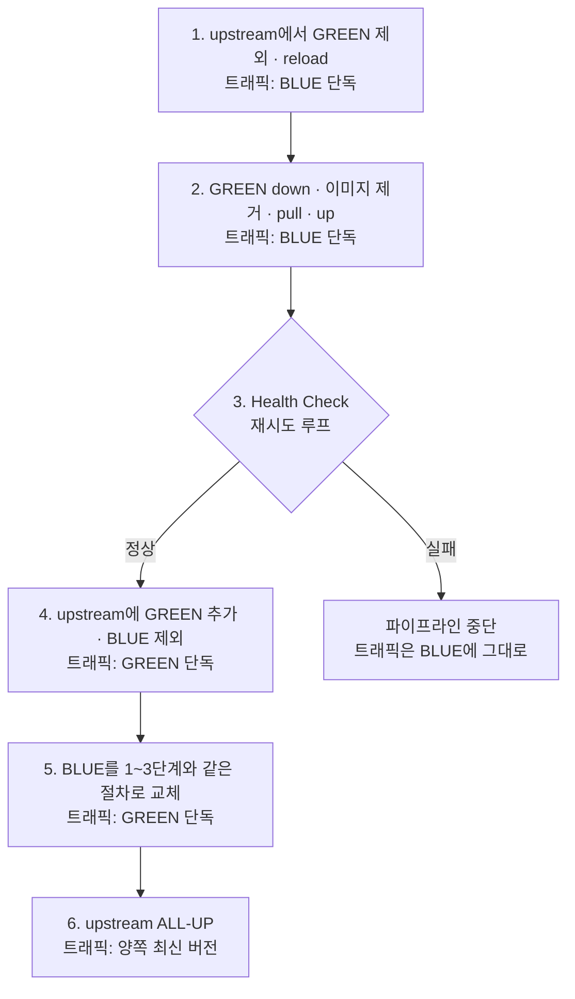

배포 파이프라인 한가운데에 이런 스크립트가 놓여 있다.

```bash
for retry_count in $(seq 5); do
    if curl -s "http://localhost:8082/health" > /dev/null; then
        echo "Health Check Successful"; break
    fi
    if [ $retry_count -eq 10 ]; then echo "Health Check Failed"; exit 1; fi
    echo "Retry After 10 Secs"; sleep 10
done
```

새로 띄운 서버가 살아났는지 확인하고, 안 살아났으면 배포를 멈추라고 넣은 코드다. 그런데 멈추지 않는다. 루프는 `seq 5`로 다섯 번 도는데 실패 판정은 `retry_count`가 `10`일 때를 본다. 다섯 번 모두 실패해도 `exit 1`에 닿지 못한 채 루프가 끝나고 다음 단계인 트래픽 전환이 실행된다. **빌드는 초록색이고 사용자는 죽은 서버를 받는다.**

관문을 안 단 것이 아니라 단 관문이 안 닫힌 경우다. 이런 종류가 [에러 없이 실패하는 배포](/blog/agentic-coding/agentic-coding-qna-governance/)다 — 아무것도 터지지 않았기 때문에 아무도 보지 않는다.

이 시리즈가 첫 편에서 세운 문제는 두 도막이었다. 사람이 손으로 하던 통합·배포를 어떻게 기계에 옮기고, **그 기계를 어떻게 멈출 수 있게 만드는가.** 앞의 다섯 편이 앞 도막을 나눠 맡았고 이 편은 뒤 도막을 맡는다.

맡을 자리도 지목되어 있다. [편4](/blog/backend-engineering/github-actions-pipeline/)는 프로세스를 죽인 직후 재기동까지 서비스가 떠 있지 않은 구간을 짚었고, [편5](/blog/backend-engineering/jenkins-pipeline-and-agents/)는 같은 자리를 `docker-compose down`과 `up` 사이의 구간이라고 불렀다. 도구가 달라도 공백은 한 군데였고, 그 공백은 없어지지 않는다 — **트래픽이 지나가지 않는 쪽으로 옮겨질 뿐이다.**

순서는 셋이다. 두 도구를 축별로 한 장에 놓고, 서비스를 내리지 않고 바꾸는 방법을 보고, 잘못됐을 때 멈추는 관문들을 본다.

## 두 갈래를 한 장에 놓으면

편4와 편5가 한 편씩 맡은 두 도구는 같은 일을 하지만 같은 질문에 다르게 답한다. 답이 갈리는 축은 이렇다.

| 축 | GitHub Actions | Jenkins |
|---|---|---|
| 실행 모델 | 저장소 이벤트 → 워크플로 (SaaS) | 서버가 상주하며 작업 큐 소비 (Self-managed) |
| 설치·운영 | GitHub가 제공. self-hosted runner 설치도 간단 | War / Docker 이미지. **서버·플러그인·백업을 직접 운영** |
| 설정 위치 | `.github/workflows/*.yml` — 앱 저장소에 동거 | Jenkinsfile(별도 저장소 가능) 또는 UI 설정 |
| 구조 단위 | Workflow → Job → Step → Action | Job/Pipeline → Stage → Step |
| 실행 노드 | Runner(hosted / self-hosted). Job당 1개, Job 간 완전 격리 | Controller + Agent, Executor 수만큼 동시 실행 |
| 병렬 기본값 | Job 기본 병렬, `needs`로 순차화 | 기본 직렬, 옵션/`parallel`로 병렬화 |
| 확장 방식 | Marketplace Actions + Composite Action | Plugin (기본 제공 기능이 사실상 없음) |
| 학습 곡선 | 완만 | 가파름 — "무에서 유를 창조" |
| 자유도 | 제한적. 대표 미지원 예: **브랜치 목록 동적 조회** | 매우 높음. Groovy로 임의 로직 작성 가능 |
| 자격증명 | Repository/Environment Secrets | Credentials Store + `credentials()` 헬퍼, 플러그인 |
| 승인 게이트 | Environment protection rules | `input` 스텝 (승인자 검증까지 코드로) |
| 비용 | Public 무료, Private는 분당 과금 | 소프트웨어 무료, **서버·운영 인건비가 실비용** |
| 사내망 접근 | self-hosted runner 필요 | 사내 설치라 자연스럽게 가능 |
| 감사·이력 | GitHub 로그에 통합 | 빌드 ID별 콘솔 로그. 플러그인으로 보강 |
| 적합 상황 | GitHub 기반 신규 프로젝트, 표준적 빌드·배포 | 복잡한 다단계 배포, 사내망·규제 환경, 레거시 |

축 열다섯 개가 실은 한 가지 차이의 파생이다 — 편1이 [빌려 쓰는 쪽과 직접 가지는 쪽](/blog/backend-engineering/cicd-pipeline-fundamentals/#도구가-두-갈래인-이유)으로 줄여 둔 그 차이다. 설치·운영이 없는 대신 자유도가 제한되고, 서버를 직접 세우는 대신 사내망 접근과 임의 로직이 열린다. 다만 요금 정책과 마켓플레이스 구성은 계속 바뀌는 값이라 **2026년 7월 기준 Public 저장소 무료, Private 저장소 분당 과금**으로, 「확장 방식」 행의 Marketplace Actions도 같은 기준일로 읽어야 한다.

「구조 단위」 행은 [편1이 층의 높이를 못 박아 둔 자리](/blog/backend-engineering/cicd-pipeline-fundamentals/#낱말이-갈리는-자리)를 표로 옮긴 것이고, 「자격증명」·「승인 게이트」 두 행도 편5가 문법까지 보여 준 자리다.

한 낱말만 짚어 둔다. 「실행 노드」 행의 「Job 간 완전 격리」는 다음 절 표에 「장애 격리」로 다시 나오는데 **방향이 반대다.** 앞은 하나가 다른 하나에 영향을 주지 못하도록 **나누는** 것이고, 뒤는 하나가 죽어도 나머지가 **대신 사는** 것이다. 둘 다 원본 표의 낱말이라 그대로 두되, 같은 편 안에서 반대쪽을 가리킨다는 것만 적어 둔다.

어느 쪽이 낫다는 결론은 이 표에서 나오지 않는다.

## 서비스를 내리지 않으려면 먼저 여러 벌이어야 한다

무중단 배포는 배포 기법이기 전에 **구성의 결과**다. 서버가 한 대뿐이면 어떤 기법을 써도 그 한 대를 바꾸는 동안 서비스가 없다.

| 필요성 | 설명 |
|---|---|
| 장애 격리 | 한 서버에 문제가 생겨도 서비스 영향 없이 제공 → 고객 이탈 감소 |
| 부하 분산 | 대량 트래픽을 한 서버로 감당 불가. N중화로 분산해 안정성 확보 |

두 행은 이중화의 이유가 배포와 무관하게 이미 둘이라는 뜻이다. 무중단 배포는 세 번째 이유로 얹힐 뿐이다.

이중화·삼중화한 구성을 HA(High Availability, 고가용성)라고 부른다. 서버가 여러 대가 되면 클라이언트가 어느 대에 붙어야 하는지가 문제가 되므로 앞단에 **대표 대리자**가 필요하다. 전통적으로 그 자리는 L4 스위치가 맡았다. L4는 전송 계층이라 IP와 포트만 보고 뒤로 넘기는 로드 밸런싱(Load Balancing)을 하고, 요청 내용을 읽어 대신 받아 주는 리버스 프록시(Reverse Proxy)는 그 위 계층의 일이다.

클라이언트는 뒤에 몇 대가 있는지 모른 채 대표 주소 하나만 안다.

이 자리는 전용 장비가 아니어도 된다. 애플리케이션 계층(L7)에서 도는 Nginx가 둘을 한 번에 맡는다 — 요청 내용을 읽을 수 있어서 리버스 프록시까지 된다.

| Nginx 기능 | 내용 |
|---|---|
| Web Server | 정적 리소스(HTML/CSS/JS/이미지) 응답, 동적 요청은 WAS로 전달 |
| Reverse Proxy | 클라이언트 요청을 대신 받아 웹 서버에 전달하고 응답을 중개 |
| Load Balancing | 라운드 로빈 방식으로 요청을 서버에 분배 |

배포 관점에서 결정적인 것은 **분배 대상 목록을 설정 파일이 들고 있다는 점**이다. 목록을 고치고 다시 읽히면 트래픽이 가는 곳이 바뀌고, 뒤에 나올 전환과 되돌리기가 전부 이 성질 위에 서 있다.

## 세 전략이 무엇을 대가로 무엇을 얻는가

| 전략 | 방식 | 인프라 비용 | 롤백 속도 | 리스크 노출 | 언제 쓰나 |
|---|---|---|---|---|---|
| **재기동(다운타임)** | 프로세스 종료 후 새 버전 기동 | 최소 | 재배포 필요 | 전면 중단 | 내부 도구, 사내 배치 |
| **Rolling** | 서버 그룹을 하나씩 순차 교체, 정상 확인 후 다음 진행 | 추가 없음(순간 용량 감소) | 느림(순차 되돌림) | 신·구 버전 공존 구간 존재 | 인스턴스 수가 많고 여유 용량이 있을 때 |
| **Blue-Green** | Blue(현행)/Green(신규) 두 환경 구성, LB·프록시 설정으로 트래픽 전환 | **2배** | **가장 빠름(설정 되돌림)** | 전환 순간 전량 이동 | 롤백 속도가 중요한 결제·핵심 서비스 |
| **Canary** | 일부 트래픽만 신버전에 노출 → 지표 확인 후 비중 확대 | 소폭 증가 | 빠름(비중 0으로) | 최소 — 영향 범위를 통제 | 사용자 영향 측정이 필요한 기능, 대규모 트래픽 |

네 행 중 첫 행은 무중단 전략이 아니라 **대조군**이다. 편4가 짚은 그 자리가 이 행이고, 아래 셋이 무엇을 사는지는 이 행과의 차액으로 보인다.

가운데 세 열이 교환 조건이다. **Rolling은 여유 용량을 낸다.** 서버를 하나씩 빼서 교체하므로 추가 장비가 없는 대신 교체 중 전체 용량이 줄고, 되돌릴 때도 뺐던 순서를 다시 밟아야 해서 느리다. **Blue-Green은 돈을 낸다.** 앞 절이 이미 둘로 만들어 둔 것 위에 다시 두 벌이라 비용이 2배지만 되돌리는 조작이 설정을 원래대로 돌리는 것뿐이라 가장 빠르다. **Canary는 시간을 낸다.** 비중을 조금씩 올리며 지표를 보므로 영향 범위가 가장 작은 대신 배포 한 번에 걸리는 시간이 가장 길고, 판단 근거가 될 지표가 미리 있어야 한다.

Blue-Green의 「2배」에는 전제가 붙어 있다 — 편1이 [갈리는 것은 두 벌로 두는 대상이라고 정리해 둔](/blog/backend-engineering/cicd-pipeline-fundamentals/#낱말이-갈리는-자리) 그 전제다. 대상이 상태를 가지지 않는 애플리케이션 서버라서 2배에서 그치고, 데이터를 들고 있으면 드는 값이 달라진다.

**Rolling과 Canary는 신·구 버전이 동시에 트래픽을 받는데**, 위험의 실체는 트래픽이 아니라 **두 버전이 공유하는 것**이다. DB 스키마 변경은 하위 호환이어야 하고 — 컬럼을 먼저 추가하고, 코드를 배포하고, 쓰기 시작하고, 제거는 한참 뒤에 한다 — 세션과 캐시의 직렬화 포맷도 양방향으로 읽혀야 한다. 이걸 놓치면 배포 중에만 나고 끝나면 사라지는 에러가 생긴다.

## Blue-Green의 실제 흐름

Nginx와 Docker Compose와 Jenkins로 구현한 순서다. 단계마다 **그 순간 트래픽을 받는 쪽**을 같이 보면 이 전략이 지키는 것이 드러난다.



트래픽 표기를 세로로 읽으면 여섯 단계 내내 **비어 있는 칸이 없다.** 도입부에서 말한 편4·편5의 공백은 2단계에 그대로 있다. `down`·`pull`·`up`에 걸리는 시간은 줄지 않았고, 달라진 것은 그 구간이 **트래픽 경로 밖에서 일어난다**는 것뿐이다. 그러려면 1단계가 2단계보다 먼저여야 한다 — 순서를 바꾸면 같은 코드가 그냥 재기동이 된다.

1단계의 Jenkins Stage 구현이 이 전략의 요체다. **Nginx 설정 파일을 갈아 끼우고 다시 읽히는 것**이 전부다.

```groovy
stage('Change UpStream Conf: all-up to green-down') {
    steps {
        sshagent(credentials: ['controller-ssh-private-key']) {
            sh '''
            ssh -o StrictHostKeyChecking=no ubuntu@${TARGET_HOST} '
            docker exec api-gateway cp ${NGINX_CONF_PATH}/green-shutdown.conf ${NGINX_CONF_PATH}/app-cicd.conf
            RELOAD_RESULT=`docker exec api-gateway service nginx reload`
            if [[ "$RELOAD_RESULT" == "Reloading nginx: nginx." ]]; then
                docker-compose -f docker-compose-app.yml down app-green
                docker pull ${DOCKERHUB_REPOSITORY}
                docker-compose -f docker-compose-app.yml up app-green -d
            fi
            '
        '''
        }
    }
}
```

읽을 곳은 `cp` 한 줄과 그 아래 `if`다. GREEN이 빠진 설정 파일을 현재 설정 자리에 복사한 뒤 reload하는 것이 전환의 실체다 — 트래픽 이동에 재기동이 없다. `if`는 reload 성공을 확인하고서야 컨테이너를 내린다. 다만 그 `if`에 else가 없다 — 조건이 어긋나면 2단계가 통째로 건너뛰어지고, 3단계는 구버전 GREEN을 검사해 통과한다. **아래 스크립트와 같은 구멍이 여기에도 있다.**

3단계도 같은 구조여야 하고, 그 자리에 놓인 것이 도입부의 스크립트다. **성공할 때까지 기다리고, 끝내 실패하면 파이프라인을 실패시켜 트래픽 전환으로 넘어가지 않게 하는 것**이 목적이다. 도식에서 3단계만 마름모인 이유다.

> 위 스크립트에는 실제 결함이 있다.
>
> 루프는 `seq 5`로 다섯 번만 도는데 실패 판정은 `retry_count -eq 10`을 본다. 다섯 번 모두 실패해도 `exit 1`에 도달하지 못하고 루프가 정상 종료되므로, 도식의 실패 갈래는 **어떤 경우에도 실행되지 않는다.** Health Check가 전부 실패해도 파이프라인은 성공으로 이어지고 트래픽이 새 버전으로 넘어간다.
>
> 배포 자동화에서 가장 값비싼 실패는 게이트가 없는 것이 아니라 **실패를 실패로 만들지 못하는 게이트**가 있는 것이다. 없는 게이트는 없다는 것이 보이지만, 안 닫히는 게이트는 있다는 것만 보인다.

결함을 그대로 실은 것은 그것이 결론의 재료이기 때문이다. 이 블록은 **읽을 코드이지 복사할 코드가 아니다.**

### 되돌리는 절차는 어디에 있나

[되돌아갈 곳은 직전 이미지 태그](/blog/backend-engineering/branching-strategy-and-containers/)라는 것까지는 편3이 정했고 조작이 남았는데, **원본에는 그 절차가 없다.** 아래는 원본이 말한 것이 아니라 1단계의 구조를 뒤집어 얻은 것이다.

전환이 「GREEN을 뺀 설정 파일을 복사하고 reload」였으므로 되돌리기는 **반대쪽 설정 파일로 같은 조작을 하는 것**이다. 4단계까지 갔다면 BLUE가 아직 이전 버전으로 떠 있어 되돌릴 대상이 이미 실행 중이다. 6단계 이후는 다르다 — 양쪽 다 최신이면 `docker pull`의 태그를 직전 이미지 태그로 바꿔 1~3단계를 다시 도는 수밖에 없다. **6단계 전의 롤백은 설정 조작이고 6단계 후는 재배포**다.

## 방식이 달라도 같은 둘

| 원칙 | 의미 |
|---|---|
| 절대 모든 서비스를 동시에 Shutdown 하지 않는다 | 항상 요청을 받을 수 있는 인스턴스가 남아 있어야 한다 |
| 모든 서버를 한 번에 최신 버전으로 올리지 않는다 | 검증 구간을 확보하고, 문제 시 되돌릴 여지를 남긴다 |

두 행은 앞의 세 전략이 서로 다르게 구현한 같은 제약이다. 위 행은 트래픽 표기에 빈 칸이 없어야 한다는 말이고, 아래 행은 3단계와 4단계 사이에 판정할 시간이 있어야 한다는 말이다. 하나만 지키는 구성은 무중단이 아니다 — 아무도 안 내리면서 전부를 한 번에 올리는 배포는 다운타임 없이 전량을 잘못된 버전으로 옮기는 것이고, 그것이 도입부 스크립트가 만들어 내는 상태다.

## 통과시키는 대신 실패시키는 쪽

여기까지가 「멈추지 않고 바꾸는」 쪽이다. 남은 절반은 **잘못됐을 때 멈추는** 쪽이고, 배포 직전 한 자리가 아니라 파이프라인 여러 곳에 나눠 붙는다. 아래 넷은 보는 대상이 다르다 — 테스트 결과, API 동작, 코드, 비밀 값이다.

### 테스트 결과를 보이게 만든다 — JUnit

CI 도구를 도입하면 테스트 결과를 확인하기가 오히려 불편해진다. 로컬에서 IDE가 빨간 줄과 초록 줄로 보여 주던 것이 서버로 옮겨 가면 콘솔 로그 수천 줄 어딘가의 텍스트가 되기 때문이다.

```groovy
post {
    success { junit '**/build/test-results/test/*.xml' }
}
```

한 줄이 하는 일은 JUnit 플러그인을 불러 빌드가 뱉은 XML 리포트를 수집해 빌드 화면에 표로 붙이는 것이고, 어느 테스트가 언제부터 실패하기 시작했는지가 빌드 번호별로 남는다. 이 자체는 파이프라인을 멈추지 않는다 — 멈추는 것은 테스트 실행 단계이고 이쪽은 **왜 멈췄는지를 읽을 수 있게 만드는 것**이다. 관문과 계기판은 다른 물건이다.

### API가 여전히 도는지 본다 — Postman과 Newman

단위 테스트가 통과해도 조립된 API가 도는지는 별개다. Postman은 API 요청을 모아 두고 실행해 보는 도구이고 그렇게 모은 묶음을 컬렉션이라고 부른다. Newman은 **그 컬렉션을 화면 없이 명령줄에서 실행하는 도구**다(Node.js 기반). 사람이 버튼을 눌러 확인하던 것을 파이프라인이 대신 누르게 만드는 것이 이 조합의 목적이다.

```groovy
stage('API Integration Test') {
    steps {
        sh "newman run src/test/resources/cicd.postman_collection.json \
            --reporters cli,junit --reporter-junit-export 'newman/cicd-api-report.xml'"
    }
}
```

읽을 곳은 두 군데다. 첫째, 컬렉션 JSON의 경로가 `src/test/resources`다. **테스트 자산도 소스와 같은 저장소에서 같이 형상관리한다**는 뜻이고, API 명세가 바뀌면 코드와 테스트 묶음이 같은 커밋에서 같이 바뀌어야 어느 버전이 무엇을 통과했는지가 남는다. 둘째, 리포터를 `cli,junit` 둘로 지정하고 결과를 XML로 내보내 **API 테스트 결과가 단위 테스트 결과와 같은 화면에 붙게** 만든다. 리포터 이름과 옵션 표기는 도구 버전을 타므로 2026년 7월 기준 표기로 읽는 편이 안전하다.

이 단계가 실제로 잡는 것은 **회귀**다. 회귀 테스트란 기능을 추가하거나 고친 뒤에 **원래 되던 것이 여전히 되는지** 확인하는 테스트다. 새로 만든 기능은 만든 사람이 확인하지만 건드리지 않은 기능은 아무도 확인하지 않고, 실제 사고는 대개 후자에서 난다. 이 단계를 배포 전 필수로 박아 두면 사람의 기억에 의존하던 확인이 매 배포마다 반복된다.

### 코드 자체를 읽는다 — SonarQube와 Quality Gate

개발자가 모든 버그와 코드 스멜과 보안 취약점을 의식하면서 코딩하는 것은 불가능하다. 정적 분석은 코드를 실행하지 않고 읽어서 그 공백을 메우는 방식이고, SonarQube가 그 도구다.

| 적용 방식 | 설명 |
|---|---|
| 수동 | 기능 구현 완료 후 SonarQube에 직접 검사 실행 |
| 자동 | Jenkins 파이프라인에 검사 Stage를 추가해 매 빌드마다 실행 |

두 행의 차이는 도구가 아니라 **누가 잊어버릴 수 있는가**다. 수동은 바쁘면 건너뛰어지고 대개 급한 변경에서 먼저 그렇다. 자동은 건너뛰려면 파이프라인을 고쳐야 하고 그 수정이 이력에 남는다.

```groovy
stage('Check Code Quality') {
    steps {
        withSonarQubeEnv('sonarqube-server') {
            sh '''
            ./gradlew sonar \
                -Dsonar.projectKey=$SONAR_PROJECT_KEY \
                -Dsonar.host.url=http://sonarqube:9000 \
                -Dsonar.login=$SONAR_LOGIN
            '''
        }
    }
}
```

`withSonarQubeEnv`는 플러그인이 제공하는 블록이고 괄호 안은 서버 설정에 등록해 둔 이름이다. 블록 이름과 등록 화면의 명칭은 플러그인 버전을 타므로 2026년 7월 기준 표기로 읽어야 하고, `http://sonarqube:9000`도 고정 주소가 아니라 컨테이너 이름과 기본 포트로 이루어진 예시값이며, `-Dsonar.login`이라는 파라미터 이름 자체도 버전을 탄다.

여기까지는 검사를 실행하는 것뿐이고, 관문이 되려면 결과가 돌아와야 한다. Jenkins와 SonarQube는 Webhook으로 연동한다. 분석이 끝나면 SonarQube가 결과를 통지하고, Jenkins는 **Quality Gate 응답을 받아 통과 여부로 파이프라인을 진행하거나 중단한다.** Quality Gate는 그 판정 기준 자체다 — 신규 코드의 커버리지 하한, 중대 결함 개수 상한처럼 수치로 적힌 조건이고 미달이면 빌드가 실패한다. 편1이 「게이트」를 두 뜻으로 갈라 두면서 기계가 수치로 판정하는 쪽이라고 한 것이 이 자리이고, [편2](/blog/backend-engineering/version-control-as-cicd-premise/)가 그 쪽을 이 편으로 넘겼다.

> 원본에는 SonarQube 토큰이 `-Dsonar.login=sqp_...` 형태로 평문 하드코딩된 예시가 그대로 남아 있다.
>
> 바로 앞에서 그 값을 자격증명(Secret text)으로 등록하는 방법을 설명해 놓고 예시에서는 값을 그대로 적어 둔 형태다. 위 블록이 `$SONAR_LOGIN`으로 받는 것과 대비된다.
>
> 실제 저장소에 이런 코드가 커밋되면 히스토리에 영구히 남아서, 토큰을 폐기하고 재발급하지 않는 한 회수가 불가능하다. 코드 리뷰에서 반드시 잡아야 하는 유형이다.

### 파이프라인이 들고 있는 비밀 — 시크릿

앞 절의 사고는 도구 문제가 아니라 **비밀을 어디에 두느냐**의 문제다. 파이프라인은 배포를 하려면 열쇠를 들고 있어야 하고, 두 도구가 그 열쇠를 두는 자리는 이렇게 다르다.

| 항목 | GitHub Actions | Jenkins |
|---|---|---|
| 저장 위치 | Settings → Secrets and Variables → Actions | Manage Credentials (System / Global) |
| 종류 | Repository / Environment / Organization Secret | Secret text, Username with password, SSH Username with private key |
| 사용법 | `${{ secrets.NAME }}` | `credentials('id')`, `withCredentials`, `sshagent` |
| 로그 마스킹 | 자동 마스킹 | 자동 마스킹(단 가공 출력 시 새어나갈 수 있음) |
| 위험 지점 | `echo` 로 파일 기록 후 삭제 누락, PR 워크플로에서 secret 노출 | 파이프라인 스크립트 평문 하드코딩, 콘솔 로그 |

시크릿(Secret)이란 저장소나 서버에 값이 아니라 이름으로만 등장하는 비밀 값을 말한다. 첫 행의 저장 위치는 화면 경로라 개편을 탄다 — GitHub 쪽은 **저장소 설정 안의 시크릿 관리 화면**, Jenkins 쪽은 **관리 메뉴 안의 자격증명 화면**이고, 표에 적힌 두 경로는 **둘 다 2026년 7월 기준 표기**다. 오른쪽 열의 문법은 편5가 다뤘으므로 여기서는 위치만 대조한다.

두 도구 다 로그 마스킹을 자동으로 하지만 그 자동은 **값이 원형 그대로 출력될 때**만 듣고, 위험 지점 행에 적힌 것들이 전부 그 우회 경로다. 원칙 셋이 여기서 나온다.

- **개인키를 파일로 떨궜으면 반드시 `rm -f`로 지운다.** 편4의 배포 스크립트 마지막 줄이 이 처리였고, 러너가 매번 새로 만들어지지 않는 환경에서는 이 한 줄이 유일한 방어다.
- **`StrictHostKeyChecking=no`는 편의를 위한 설정이고 MITM 방어를 포기하는 것이다.** 앞의 Blue-Green Stage 코드에도 그대로 들어 있다. 운영에서는 `known_hosts` 고정을 검토한다.
- **Secret을 재가공해 로그에 출력하지 않는다.** base64 인코딩이든 앞 네 글자만 찍는 것이든 부분 문자열은 전부 포함이다 — 가공한 순간 마스킹이 이름을 못 알아본다.

### 결제 도메인이 더 요구하는 것

| 요구 | 파이프라인에서의 구현 |
|---|---|
| 배포 대상이 명확히 특정되어야 함 | 브랜치 배포 금지, **태그 기반 배포** + Git Parameter로 태그 선택 |
| 승인 없는 운영 반영 금지 | Jenkins `input` 스텝, 승인자(`submitter`) 검증. GitHub는 Environment protection rules |
| 변경 이력 감사 | Pipeline Script를 SCM으로 관리 → 누가 언제 파이프라인을 바꿨는지 추적 |
| 코드 품질·보안 기준 | SonarQube Quality Gate로 미달 시 파이프라인 실패 |
| 회귀 검증 | JUnit + Newman API 테스트를 배포 전 필수 단계로 |
| 무중단 | Blue-Green + Health Check. 결제 트랜잭션 중단은 곧 금전적 손실 |
| 권한 분리 | 앱 저장소(개발자)와 CI/CD 스크립트 저장소(DevOps) 분리 |

일곱 행 중 새 기법은 하나도 없다(「Git Parameter」·「Environment protection rules」는 2026년 7월 기준 이름이다). 앞에서 나온 것들을 **필수로 바꿔 놓은 목록**이라는 것이 이 표의 요점이고, 다른 도메인에서 권장이던 것이 여기서는 조건이 된다.

> 금융감독원의 관리·감독을 받는 IT 기업은 개발 속도보다 코드 품질과 보안을 더 중요하게 본다.
>
> 이 도메인에서 CI/CD의 가치는 "빨리 배포하는 것"이 아니라 **"매번 똑같은 절차로, 기록을 남기며, 필요할 때 멈추고, 실패하면 즉시 되돌리는 것"** 이다.
>
> 즉 자동화의 목적이 속도가 아니라 **재현성과 통제 가능성**으로 이동한다.

## 정리

- **무중단 배포는 다운타임을 없애지 않는다.** `down`과 `up` 사이의 구간은 그대로 있고 그것을 트래픽 경로 밖으로 빼는 것이 전부다.
- **세 전략은 같은 것을 다른 통화로 산다.** Rolling은 여유 용량, Blue-Green은 인프라 비용, Canary는 시간이다.
- **관문은 놓는 것과 닫히는 것이 다른 일이다.** Health Check 스크립트는 다섯 번 도는데 열 번째를 기다렸고, 그래서 실패 갈래가 한 번도 실행되지 않았다.
- **넷이 다 관문인 것은 아니다.** API 테스트와 정적 분석은 실패를 만들어 멈추고, 테스트 리포트는 왜 멈췄는지를 읽게 하며, 시크릿은 성공했을 때 새어 나가지 않게 한다.

시리즈 첫 편이 자동화의 값을 「멈출 자리를 세 군데 남긴 채 빨라진 것」이라고 적었다. 그 세 자리 중 둘을 열어 보면 남겨 둔다는 것이 자리를 비워 두는 일이 아니다. 승인 게이트는 누를 사람이 없을 때의 처리까지 적어야 관문이라는 것을 편5가 보였고, Health Check는 실패 갈래가 실제로 도달 가능해야 관문이라는 것을 이 편이 보였다. 남는 질문은 도구 선택이 아니라, 지금 파이프라인에 박혀 있는 게이트들이 **막아야 할 것이 왔을 때 정말 막는지를 무엇으로 아는가**이다.

[다음 편](/blog/backend-engineering/questions-that-come-back/)은 이 물음이 실제로 돌아오는 형태를 모은다. 「둘 중 무엇을 고르나」·「배포가 실패했는데 롤백이 안 된다」처럼 편의 경계를 가로지르는 질문들이다.
