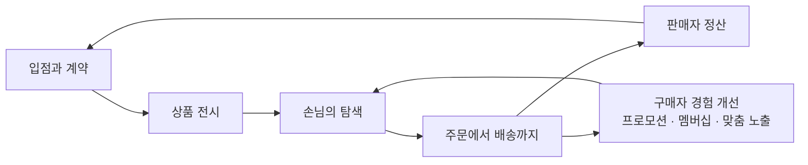

[앞 편](/blog/product-management/planning-and-product-ops/)은 만드는 일의 첫 문장이 결정이 아니라 가설이라는 데까지 왔고, 마지막에 이 뼈대에 도메인의 살을 붙이겠다고 적었다. 그 첫 도메인이 커머스다.

커머스를 먼저 놓는 이유는 **경계가 눈에 보이기 때문이다.** 물건이 실제로 오가고 돈이 실제로 움직이므로, 어디까지가 한 도메인이고 어디부터가 다른 도메인인지를 현실이 대신 그어 준다. 뒤에 오는 도메인들은 그만큼 친절하지 않다.

그리고 커머스에서 도메인을 안다는 것은 화면을 익히는 일이 아니라 **데이터 구조를 읽는 일**이다. 무엇을 하나로 세고 무엇을 쪼개 두었는가가 나머지 전부를 결정한다.

이 편은 커머스를 정의하는 데서 시작해 다섯 도메인 가운데 앞의 둘 — 회원과 상품 — 까지 간다. 가격과 프로모션, 주문은 다음 편이다.

## 「커머스」는 두 낱말에서 갈린다

커머스를 한 문장으로 줄이면 「인터넷으로 상품과 서비스를 사고파는 활동」이 된다. 짧지만 이 문장에는 갈림길이 둘 들어 있고, 회사마다 달라지는 것은 전부 그 둘 중 하나에서 나온다.

**첫째 갈림길은 어떤 자리에서 무엇을 파느냐다.** 없는 게 없는 종합몰과, 남의 물건을 걸어 주는 자리를 파는 마켓플레이스가 다르다. 한 범주만 깊게 파고드는 버티컬이 있고, 관계와 공유를 지렛대로 쓰는 소셜이 있으며, 온라인에서 결제하고 오프라인에서 받는 O2O 가 있다. 같은 「쇼핑몰」이라는 말을 쓰지만 만들어야 할 기능은 겹치지 않는다.

**둘째 갈림길은 누가 팔고 누가 사느냐다.** 회사가 개인에게 파는 자리, 회사가 회사에 파는 자리, 개인끼리 거래하는 자리, 개인이 회사에 제안하는 자리가 각각 다른 문제를 낸다. 여기에 여러 사업자가 서로 물량을 주고받는 형태까지 더하면, 같은 「주문」이라는 낱말이 자리마다 다른 절차를 가리킨다.

⇒ 제품 담당자가 커머스에 합류할 때 처음 할 일은 기능 목록을 훑는 것이 아니라 **이 회사가 두 갈림길에서 어느 쪽에 서 있는지 확정하는 것이다.**

## 합류할 회사의 성격은 일곱 축으로 드러난다

합류를 앞두고 회사를 살필 때 던져 볼 질문은 대략 열둘로 정리된다. 그런데 열두 개를 순서대로 확인하는 것보다, 그 질문들이 실제로 무엇을 판별하는지로 묶어 두는 편이 쓸모 있다. 채용 공고와 최근 기사를 훑는 둘은 답이 아니라 재료를 모으는 일이므로 빼고, 남은 열을 묶으면 일곱 축이 된다. 축마다 답이 정해지는 순간 그 회사에서 무엇이 무겁고 무엇이 가벼운지가 함께 정해진다.

| 확인할 축 | 어디서 보이나 | 정해지는 것 |
| --- | --- | --- |
| 판매자가 존재하는가 | 입점 안내 페이지 · 파트너 사이트 유무 | 판매자 도메인을 통째로 만들어야 하는가 |
| 같은 물건을 여럿이 파는가 | 상품 상세의 판매자 목록 · 최저가 표시 | 가격 경쟁과 상품 매칭 로직의 복잡도 |
| 물류를 직접 쥐는가 | 배송 서비스의 가짓수 · 풀필먼트 제공 여부 | 물류가 별도 제품인가, 외부에 맡긴 기능인가 |
| 무엇을 기반으로 성장했는가 | 상품 구조가 상품–옵션인가 딜–옵션인가 | 상품 도메인의 레벨 설계와 그 부채 |
| 한 범주만 파는가 | 취급 범주의 폭 · 종합몰인가 전문몰인가 | 분류 체계를 얼마나 깊게 설계해야 하는가 |
| 무엇으로 손님을 붙드는가 | 연 단위 대형 행사 · 멤버십 종류 | 가격·프로모션과 회원 가운데 어느 쪽이 무거운가 |
| 얼마나 열려 있는가 | 오픈 API 제공 · 클레임 자동 처리 수준 | 플랫폼으로 갈 것인지 자사 서비스로 남을 것인지 |

일곱 축은 밖에서 회사를 판별하는 도구이면서, 안에 들어간 뒤로는 **자기 자리를 잡는 지도로 그대로 쓰인다.** 축마다 답을 채우면 그 회사가 지금 어느 도메인에 사람과 돈을 넣고 있는지가 드러난다.

## 다섯 도메인이 하나의 흐름으로 이어진다

커머스 플랫폼이 하는 일을 한 문장으로 적으면 이렇게 된다 — **사는 쪽과 파는 쪽이 상품을 합리적이고 공정하다고 여길 만한 조건과 가격으로 주고받게 만드는 것.** 이 한 문장에 커머스의 도메인이 전부 들어 있다. 거래 주체가 회원이고, 주고받는 대상이 상품이며, 합리적이고 공정한 조건이 가격과 프로모션이고, 주고받는 행위 자체가 주문이다. 합리성은 사는 쪽이 값을 납득하느냐이고 공정성은 파는 여럿 사이에 자리가 어떻게 배분되느냐라, 둘은 다른 축이다.

화살표가 한 방향인 것에는 이유가 있다. **앞 단계가 정해지지 않으면 뒤 단계를 정의할 수 없기 때문이다.** 회원 등급이 정해져야 그 등급에 걸리는 가격을 쓸 수 있고, 상품에 배송 정책이 붙어야 주문에서 배송비를 계산할 수 있다. 도메인을 나누는 일이 곧 의존 순서를 세우는 일이다.

그림에서 프로모션이 가격 노드 안에 있는 것은 그것이 조건과 가격을 정하는 수단이기 때문이고, 맨 끝의 정산이 따로 선 것은 그것이 도메인이 아니라 **다섯이 한 바퀴 돌고 난 결과**이기 때문이다.

| 도메인 | 그 안에 들어가는 것 |
| --- | --- |
| 회원 | 구매자의 가입과 등급, 판매자의 계약과 입점 정보 |
| 상품 | 기준 정보와 부가 정보, 분류 체계, 브랜드, 상품과 옵션, 소개 콘텐츠 |
| 가격 | 기준가와 판매가, 배송비 정책, 상품·회원·장바구니에 걸리는 조건 |
| 프로모션 | 마케팅과 할인, 캠페인과 이벤트, 그리고 적립 |
| 주문 | 주문, 결제 수단과 결제 대행, 배송, 취소·반품·교환 |

다섯 도메인은 서로 다른 팀이 맡는 경우가 많고, 그 경계가 곧 조직도가 된다.

한 가지 덧붙일 것은 **퍼널 분석**이다. 유입부터 추천까지 다섯 구간으로 나눠 보는 이 틀은 마케팅에서 왔지만, 커머스에서는 도메인을 가로지르는 공용어로 쓰인다. 어느 구간이 새는지를 말하지 못하면 도메인 담당자끼리 같은 숫자를 놓고 다른 이야기를 하게 된다.

## 회원은 사는 쪽과 파는 쪽 둘이다

회원 도메인을 「가입과 로그인」으로 좁혀 보면 뒤에서 반드시 막힌다. 회원은 **서비스를 쓸 자격을 받은 사람**이고, 그 자격에 무엇이 딸려 오느냐가 회원 도메인의 실체다.

| 갈래 | 무엇을 정하나 |
| --- | --- |
| 회원이 되는 과정 | 그냥 둘러보던 사람이 사는 사람이 되고, 다시 돌아오는 사람이 되는 단계 |
| 자격을 확인하는 방법 | 아이디와 비밀번호, 휴대폰, 이메일, 공동인증서, 일회용 비밀번호, 생체, 카드 |
| 계정을 몇 개까지 허용하나 | 사람마다 하나로 묶을 것인가, 여럿을 허용할 것인가 |
| 등급과 혜택 | 무료 등급과 유료 등급, 정기 결제로 이어지는 구독 |

계정을 하나로 묶기로 하면 인증이 무거워지고, 여럿을 허용하면 인증은 가벼워지지만 같은 사람을 세는 일이 어려워진다. **어느 쪽도 공짜가 아니라는 것이 이 표가 말하는 전부다.**

파는 쪽도 회원이다. 여기서 자주 어긋나는데, 판매자를 「관리자 화면을 쓰는 내부 사용자」쯤으로 보면 설계가 통째로 틀어진다. 그 자리는 앞 그림의 직원 몫이다. 오픈마켓에서 판매자가 보는 화면은 구매자가 보는 화면과 **완전히 별개의 제품이다.** 로그인 방식도, 권한 구조도, 성공의 정의도 다르다.

판매자와 플랫폼의 관계는 한 겹이 아니라 세 겹이다. 판매 채널을 빌려 쓰는 입점 고객이면서, 노출을 사는 광고주이면서, 창고와 배송을 맡기는 위탁 화주다. 세 겹 가운데 어디까지를 제공하느냐가 그 회사의 판매자 제품 범위를 정한다.

이 그림에서 눈여겨볼 것은 **고리가 둘**이라는 점이다. 바깥 고리는 판매자를 다시 데려오고 안쪽 고리는 구매자를 다시 데려온다. 두 고리가 같은 속도로 돌아야 플랫폼이 커지는데, 한쪽만 밀면 물건은 많은데 사는 사람이 없거나 그 반대가 된다.

## 상품 정보는 쓰임새로 네 갈래다

상품에 붙는 항목을 나열하면 끝이 없다. 그런데 **무엇에 쓰이는지로 묶으면 넷으로 정리되고**, 이 넷은 각각 다른 팀이 다른 주기로 손댄다.

| 갈래 | 여기에 담기는 것 |
| --- | --- |
| 무엇인지 밝히는 정보 | 상품명, 브랜드, 품번, 파는 사람, 분류, 색상·크기·재질 같은 선택지 |
| 주문을 성립시키는 정보 | 적용될 가격, 남은 수량과 품절 여부, 어떻게 보낼지에 대한 정책 |
| 고르게 돕는 정보 | 소개 콘텐츠, 후기, 문의, 함께 볼 만한 상품 |
| 밝히도록 정해진 정보 | 법으로 표시해야 하는 항목, 배송·교환·반품 안내, 혜택 고지 |

넷 가운데 앞의 둘은 **틀리면 거래가 깨지고**, 뒤의 둘은 틀려도 거래는 성립한다. 그래서 검수와 승인 절차는 대개 앞의 둘에 집중되고, 뒤의 둘은 판매자가 고친 즉시 반영되게 두는 경우가 많다. 법으로 표시하도록 정해 둔 항목만은 예외인데, 틀려도 거래는 성립하지만 책임이 플랫폼에 남기 때문이다. 이 비대칭을 모르고 네 갈래에 같은 절차를 걸면 등록이 느려져 판매자가 떠난다.

## 분류하는 축도 상품 구조도 회사 사정을 드러낸다

상품을 묶는 방법은 하나가 아니다. 창고에서 세기 위한 묶음과 손님이 훑어보기 위한 묶음은 목적이 달라 같은 나무에 담기지 않는다.

| 어떤 분류인가 | 무엇을 위해 | 무엇을 기준으로 나누나 |
| --- | --- | --- |
| 품목 분류 | 물건이 무엇인지 식별하려고 | 종류와 쓰임새 |
| 전시 분류 | 손님이 찾아보게 하려고 | 성별·연령·취향, 브랜드와 제조사, 가격대 |

둘을 하나로 합치려는 시도는 흔하고 거의 실패한다. **품목 분류는 물건이 바뀌지 않는 한 그대로여야 하고, 전시 분류는 계절마다 바뀌어야 하기 때문이다.** 하나로 합치면 전시를 바꿀 때마다 재고와 정산이 흔들린다.

상품을 몇 층으로 쌓을 것인가는 더 근본적인 선택인데, 이 선택은 대개 이미 내려져 있다. **회사가 무엇을 하다가 온라인으로 왔는지가 그대로 남아 있기 때문이다.**

| 어디서 출발했나 | 처음 잡은 층 | 그렇게 잡은 이유 | 나중에 겪는 일 |
| --- | --- | --- | --- |
| 유통과 물류를 이미 하던 곳 | 상품 아래 선택지 | 창고관리 시스템의 식별 단위를 그대로 온라인에 가져왔다 | 묶어 파는 단위를 얹느라 층이 하나 늘어난다 |
| 온라인에서 먼저 시작한 곳 | 판매 묶음 아래 선택지 | 실물과 무관하게 팔 수 있는 단위부터 만들었다 | 매입과 자체 브랜드와 물류를 시작하면서 선택지를 상품으로 승격해야 한다 |

두 줄이 말하는 것은 우열이 아니라 **부채의 종류가 다르다는 것이다.** 어느 쪽에 합류하든 「왜 이렇게 되어 있느냐」의 답은 대개 이 표 안에 있고, 그 답을 모르면 구조를 바꾸자는 제안이 매번 같은 자리에서 막힌다.

## 팔리는 단위와 세는 단위를 갈라야 한다

물류와 이어지지 않은 커머스에는 고질적인 증상이 하나 있다. **같은 물건을 부르는 이름이 단계마다 달라서, 「상품 A」라고 말할 때 서로 다른 것을 떠올린다는 것이다.**

사들일 때 적은 것과 창고에 들어온 것이 다르고, 한 매장에 올린 것과 다른 매장에 올린 것이 또 다르다. 그리고 나간 것과 정산에 잡힌 것은 **두 매장 가운데 한쪽과만 맞아떨어진다.** 어긋난 자리가 하나면 사람이 맞출 수 있지만, 단계마다 어긋나면서 같은 이름이 두 무리로 갈리면 **어느 숫자가 맞는지 판정할 기준 자체가 없어진다.**

해법은 단위를 둘로 나누는 것이다. 창고가 세는 단위를 **표준상품**으로 따로 세우고, 매장에서 팔리는 단위를 **스토어상품**으로 그와 별개로 두되, 둘 사이를 대응표로 잇는다. 파는 단위 하나가 세는 단위 하나에 대응할 수도 있고, 같은 것을 두 개 묶어 파는 구성일 수도 있으며, 서로 다른 것을 하나씩 담은 세트일 수도 있다. **대응이 여러 모양이어도 상관없다 — 대응이 명시되어 있기만 하면 언제든 되짚어 셀 수 있기 때문이다.**

이 분리를 하지 않은 채 규모가 커지면 같은 물건이 화면마다 다른 수량으로 잡힌다. 원인이 집계하는 코드가 아니라 **식별 단위가 처음부터 하나가 아니었다는 데** 있어서, 뒤늦게 기준을 세우려면 쌓인 이력을 전부 다시 대응시켜야 하고 그때까지의 집계는 근거로 쓸 수 없다.

## 배송은 「언제」와 「얼마」 두 축이다

배송 서비스를 늘리자는 요구는 늘 들어오는데, 무엇을 늘리자는 것인지는 둘로 갈린다. 언제 나가고 언제 닿느냐를 늘리자는 것이거나, 얼마를 받느냐의 가짓수를 늘리자는 것이다.

| 축 | 여기서 갈라지는 것 |
| --- | --- |
| 언제 나가나 | 바로 내보내기, 날짜를 지정해 한꺼번에, 예약한 날에, 준비된 것부터 차례로, 주문을 받고 나서 만들기 |
| 어떻게 닿나 | 일반 택배, 화물, 새벽 배송, 몇 시간 안에, 특별한 취급이 필요한 배송, 국경을 넘는 배송 |
| 얼마를 받나 | 무료, 정액, 얼마 이상이면 무료, 금액 구간별 차등 |

세 줄이지만 실제로는 앞의 둘이 「언제」 축이고 마지막 하나가 「얼마」 축이다. **두 축이 곱해지므로 조합은 금세 수십 가지가 된다.**

이 조합을 상품마다 손으로 정하게 두면 등록이 불가능해진다. 그래서 대부분의 플랫폼은 정책을 **판매자나 매장 단위로 세워 두고 상품이 그것을 물려받게** 한다. 상품에서 따로 지정하는 것은 예외이지 기본이 아니다.

「얼마」 축에서 가장 자주 어긋나는 것은 **여러 상품을 한 번에 살 때 배송비를 어떻게 셀 것인가**이다. 묶음 단위를 정해 두고 그 단위 안에서 금액을 합산해 무료 조건을 따지는 방식이 일반적인데, 이때 주문 하나 아래에 배송이 여럿 생긴다. **주문 번호와 배송 번호가 일대일이라고 가정한 화면과 통계는 여기서 전부 깨진다.**

## 이 편이 쓴 용어

| 용어 | 원어 | 이 편에서의 뜻 |
| --- | --- | --- |
| 딜 | Deal | 소셜 커머스에서 나온 판매 묶음. 개별 상품보다 한 층 위에 놓인다 |
| 표준상품 | — | 창고와 재고를 기준으로 세는 식별 단위 |
| 스토어상품 | — | 매장에서 실제로 팔리는 단위. 표준상품 여럿의 조합일 수 있다 |
| 창고관리 시스템 | WMS | 입고와 보관과 출고를 다루는 시스템. 표준상품의 기준이 여기서 나온다 |
| 품목 분류와 전시 분류 | — | 물건을 식별하려는 분류와 손님이 훑어보게 하려는 분류. 「품목/전시 카테고리」라고도 부른다 |
| 퍼널 분석 | AARRR | 손님이 들어와 머물고 다시 오고 사고 남을 데려오기까지를 다섯 구간으로 끊어 보는 틀 |

「상품」이라는 낱말은 [지도편](/blog/product-management/product-management-map/)에서 제품·서비스와 갈라 둔 그 뜻 그대로 쓴다. 여기서 다루는 것은 **팔리는 대상으로서의 상품**이며, 그것을 담는 시스템 쪽을 가리킬 때는 「상품 도메인」이라고 적었다.

## 정리

커머스는 어떤 자리에서 무엇을 파느냐와 누가 누구에게 파느냐, 두 갈림길에서 갈린다. 회사가 그 둘에서 어디에 서 있는지를 확정하기 전에는 어떤 요구사항도 크기를 잴 수 없고, 그 확정은 일곱 축의 질문으로 대체로 끝난다.

도메인은 회원에서 시작해 상품과 가격과 프로모션을 거쳐 주문으로 흐르고, 그 결과가 정산으로 닫힌다. 화살표가 한 방향인 것은 앞이 정해져야 뒤를 정의할 수 있기 때문이며, 그래서 도메인을 나누는 일은 곧 의존 순서를 세우는 일이다.

회원에는 사는 쪽과 파는 쪽이 함께 있고 둘은 별개의 제품이다. 상품 정보는 쓰임새로 넷으로 갈리는데 앞의 둘만 거래를 깨뜨리므로 검수의 무게도 그쪽에 실어야 한다. 분류하는 축이 둘인 것과 상품 구조가 회사마다 다른 것은 취향이 아니라 **출신이 남긴 자국**이다.

이 편이 남기는 한 문장은 팔리는 단위와 세는 단위를 갈라야 한다는 절의 것이다. **파는 단위와 세는 단위를 처음에 갈라 두지 않으면, 나중에 어긋난 숫자를 보고도 무엇이 맞는지 판정할 기준이 없다.** 도메인 지식이 데이터 구조에 있다는 말이 가장 분명해지는 자리다. [이어지는 편](/blog/product-management/commerce-pricing-and-order/)은 이 위에 가격과 프로모션, 주문을 얹는다 — 조건에 따라 값이 달라지는 구조와, 주문이 상태를 옮겨 다니며 클레임으로 되돌아오는 흐름이다.
