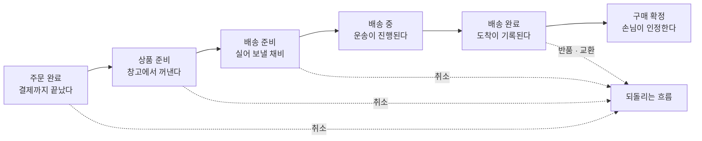

[앞 편](/blog/product-management/commerce-member-and-catalog/)은 다섯 도메인 가운데 회원과 상품을 지나며 사는 쪽과 파는 쪽을, 팔리는 단위와 세는 단위를 갈랐다. 두 번 모두 하나로 보이던 것을 둘로 쪼갠 셈이다.

이 편이 잇는 가격에서는 반대 방향의 일이 벌어진다 — 쪼개는 것이 아니라 **층을 쌓는 일**이다. 주문에서는 물건과 돈이 실제로 움직이므로 앞의 결정이 전부 여기서 결과로 드러난다. 주문 도메인이 어려운 이유는 성공 경로가 복잡해서가 아니라 **되돌리는 경로가 정방향만큼 있고 그쪽이 훨씬 덜 설계되어 있기 때문이다.**

## 가격은 한 숫자가 아니라 층이다

상품 화면에 뜨는 값을 「가격」이라 부르지만 그 안에는 성격이 다른 것 둘이 들어 있다.

| 무엇의 값인가 | 그 안에서 다시 갈리는 것 |
| --- | --- |
| 물건의 값 | **기준가** — 정가이자 공식적으로 내건 판매 가격 |
| | **판매가** — 즉시 할인이 적용되어 실제 결제되는 가격 |
| 보내는 값 | 포장 비용과 운송 비용 |

둘을 한 칸으로 합치자는 제안은 자주 나오는데, **합치는 순간 「얼마나 깎았는지」를 말할 방법이 사라진다.** 할인율 표시도, 행사 뒤 값을 되돌리는 일도, 할인 부담을 누가 졌는지 가르는 일도 두 값의 차에서 나온다. 보내는 값이 나란히 선 것도 같은 이유여서, **무료 배송은 비용이 없다는 뜻이 아니라 파는 쪽이 떠안았다는 뜻**이다.

층 위에 얹히는 것이 **조건**이다. 조건이 성립할 때 적용할 값을 미리 정해 두는 방식이며, 커머스의 가격 정책은 대부분 이 형태다.

| 무엇을 조건으로 삼나 | 어떻게 값이 달라지나 |
| --- | --- |
| 몇 개를 · 얼마어치를 사는가 | 수량이나 구매 금액이 기준을 넘으면 할인이 걸린다 |
| 지금이 어느 때인가 | 행사 기간이나 계절에 맞춰 값을 조정한다 |
| 누가 사는가 | 고객을 묶어 둔 갈래마다 다른 값을 적용한다 |

세 줄은 **수량 축 · 시간 축 · 사람 축**이고 조합은 셋을 곱한 만큼 생긴다. ⇒ 조건을 미리 정해 둔다는 말은 **조건 자체를 다룰 자리를 만든다**는 뜻이며, 그 자리 없이 「할인 기능」으로 좁히면 예외마다 새로 만들게 된다.

## 세일과 쿠폰은 붙는 자리가 다르다

값을 깎는 방법은 상품에 붙이거나 사람에게 붙이거나 둘이고, 자리가 다르므로 운영도 다른 모양이 된다.

| 무엇을 보나 | 세일 | 쿠폰 |
| --- | --- | --- |
| 어떻게 적용되나 | 대상 상품에 기간과 할인율을 직접 건다 | 미리 받아 둔 것을 **살 때 꺼내 쓴다** |
| 혜택의 폭 | 금액이나 비율을 깎는 쪽 — 시간을 끊어 파는 것, 계절 행사, 재고 정리 | 훨씬 넓다 — 할인, 적립, 하나 더 주기, 배송비 면제, 덤 |
| 운영 단위 | 행사와 대상 상품의 짝. 기간이 겹치면 상품마다 구간을 쪼갠다 | 받을 자격의 조건과 혜택의 조합 |

사고가 가장 잦은 칸은 세일 쪽 마지막이다. **같은 상품에 두 행사가 겹치면 그 값은 기간을 따라 구간으로 쪼개진다.** 「나중에 건 행사가 이긴다」로 처리하면 짧은 행사가 끝난 뒤 값이 원래대로 돌아오지 않는다.

쿠폰은 다른 어려움을 낸다. 만들어진 시점과 건네진 시점과 쓰인 시점이 **모두 다르고** 사이에 며칠에서 몇 달이 놓인다.

| 시점 | 이때 정해지는 것 | 여기서 세는 것 |
| --- | --- | --- |
| 만들 때 | 혜택의 내용과 쓸 조건, 총 몇 장까지 | 만든 수량 — 예산의 상한 |
| 건넬 때 | 누구에게 몇 장이 갔는가 | 나간 수량 — 잠재 부채 |
| 쓸 때 | 어느 주문에서 얼마가 깎였는가 | 실제로 나간 돈 |

셋은 각각 다른 숫자다. 만들기만 한 것은 아직 돈이 아니고 건넸지만 쓰이지 않은 것은 언제 청구될지 모르는 빚이라, **한 칸에 담으면 이달에 나갈 돈을 예측할 수 없다.**

적립금도 같은 층에 놓인다. 산 금액의 일정 비율이나 행사 참여로 쌓이고, 회원 등급에 따라 비율이 다르며, 정해진 기간 안의 결제 금액에서 차감된다. 현금이 아니면서 결제를 대신하는 점은 쿠폰과 같지만 **쿠폰과 달리 잔액이 남아 계속 따라다닌다.**

## 주문은 상태를 옮겨 다니는 것이다

여기서부터 물건이 실제로 움직인다. 주문을 「결제 버튼을 누른 사건」으로 보면 뒤가 막히는데, 주문은 **한 건이 상태를 갈아입으며 지나가는 여정**이기 때문이다.

실선이 정방향이고 점선이 되돌리는 쪽이다. **점선이 갈라져 나오는 자리가 정해져 있다는 것**이 요지다 — 물건이 나가기 전과 손님 손에 닿은 뒤는 되돌리는 방법이 다르고, 그 사이의 이동 중에는 방법이 거의 없다.

상태가 넘어가는 순간에는 행위가 하나씩 붙는다. 주문을 확인하고, 창고에서 꺼내 송장을 붙여 출고를 끝내고, 운송을 맡은 쪽이 받아 가면 집하가 끝나고, 도착이 기록되면 배송이 완료되며, 손님이 인정하거나 정해진 기간이 지나면 구매가 확정된다. **구매 확정은 배송 완료와 다른 사건이고 정산과 클레임 가능 기간이 여기 걸려 있다** — 둘을 같이 다루면 받자마자 대금이 나가고, 뒤에 들어온 반품은 나간 돈을 되받는 일이 된다.

## 네 도메인이 한 상태 모델을 쓴다

주문이 진행되는 동안 벌어지는 일은 여러 시스템이 서로에게 **무엇을 하라고 알리고, 하는 중임을 알리고, 결과를 돌려주는** 주고받음이다. 결제도 배송도 클레임도 같은 모양이라, 공통의 넷을 세우고 도메인마다 자기 이름을 매다는 방식이 성립한다.

| 공통 상태 | 주문 | 결제 | 입출고와 배송 | 클레임 |
| --- | --- | --- | --- | --- |
| 하라고 알린다 | 주문 지시 | 결제 지시 | 입출고·배송 지시 | 요청 |
| 하는 중이다 | 주문 접수 | 결제 처리 중 | 입출고 처리 중 · 배송 중 | 처리 중 |
| 끝났다 | 배송 완료 뒤 구매 확정 | 결제 완료 | 입출고·배송 완료 | 완료 |
| 그만둔다 | 취소 | 취소 | 취소 | 취소 |

이 표의 값어치는 칸을 채운 데 있지 않고 **가로줄이 넷뿐이라는 데** 있다. 도메인마다 상태를 따로 세우면 「결제는 끝났는데 주문은 어느 상태인가」에 답하는 규칙을 도메인 수만큼 따로 써야 한다.

⇒ 커머스에만 쓰이는 요령이 아니다. **여러 시스템이 순서대로 일을 넘겨받는 곳이면 어디서나 같은 일반화가 선다.**

## 장바구니와 주문서는 역할이 다르다

「주문 전 화면 두 개」로 보면 왜 따로 있는지 설명되지 않는다. 하나는 고르는 곳이고 하나는 계약하는 곳이다.

| 무엇을 보나 | 장바구니 | 주문서 |
| --- | --- | --- |
| 무엇을 하는 자리인가 | 사기 전에 담아 두고 견주는 자리. 찜해 두는 쓰임을 겸한다 | **거래를 맺고 값을 치르는 자리** |
| 어떤 성격인가 | 넣고 빼고 선택지와 혜택을 바꿔 본다 | 동의 절차를 거쳐 서명하는 것에 가깝다 |
| 무엇을 다루나 | 수량과 값과 배송비를 확인한다 | 그 셋을 확정하고 결제를 잇고 받을 곳을 입력받는다 |

두 자리를 잇는 목표는 하나다 — **가능한 한 높은 금액으로 주문을 끝맺게 하는 것.** 탐색에서 장바구니로, 장바구니에서 주문서로, 주문서에서 주문 완료로 넘어가는 구간마다 유실을 줄이고 사는 비율과 한 번에 사는 금액을 올리는 실험이 여기서 돈다. 앞 편이 공용어라고 적은 **퍼널 분석**이 가장 짧게 쓰이는 자리다. 상품 화면에서 주문서로 바로 넘기는 원클릭 주문서는 **구간을 하나 없애는** 설계다.

주문서 끝에 결제가 붙는다. 수단을 고르고, 정보를 넣고, 유효한지 확인받고, 승인이나 거절을 돌려받는 네 걸음이다. 간편결제는 정보를 넣는 걸음을 미리 해 두고 짧은 확인으로 대신하므로 **걸음을 없앤 것이 아니라 앞으로 옮긴 것**이며, 결제 수단의 승인과 그 뒤의 규제는 다음 편에서 다룬다.

예외가 하나 있다. **선물하기는 주문한 사람과 받을 사람이 다른 주문이다.** 값을 치른 쪽은 주문자인데 무엇을 어디로 받을지 정하는 쪽은 받는 사람일 수 있어, 주문자 한 칸에 두 사람을 담아 온 구조가 여기서 깨진다.

## 주문 완료에서 역할이 넘어간다

주문이 완료된 순간을 한 줄로 적으면 이렇다 — **사는 쪽이 할 일이 끝나고 파는 쪽이 할 일이 시작된다.**

| 어느 구간인가 | 무엇이 차례로 끝나나 |
| --- | --- |
| 내보내는 구간 — 물류센터 | 꺼내고, 포장하고, 실을 자리에 대고, 송장을 붙여 내보낸다 |
| 나르는 구간 — 배송을 맡은 쪽 | 받아 가고, 옮기고, 받을 곳에 닿고, 전달을 마친다 |

두 구간이 나뉜 것은 **책임이 넘어가는 지점이 그 사이에 있기 때문이다.** 앞 편의 배송이 상품에 매다는 정책이었다면 여기서 다루는 것은 그 뒤의 진행 단계다.

무엇으로 나르느냐도 갈린다. 택배와 화물이 대부분이지만 설치가 따라붙는 것, 냉장·냉동, 이륜차, 손님이 직접 찾아가는 것까지가 실제 갈래다. **취급 조건이 다르면 출고 단계도 달라져**, 갈래를 늘리는 결정은 화면이 아니라 창고에서 값을 치른다.

## 되돌리는 흐름까지가 주문이다

가장 늦게 설계되고 가장 자주 터지는 곳이다. 손님이 무르겠다고 할 때 무엇을 할 수 있는지는 **물건이 움직였는지**로 먼저 갈린다.

| 무엇을 보나 | 취소 | 반품 | 교환 |
| --- | --- | --- | --- |
| 언제 가능한가 | 물건이 나가기 **전** | 물건이 나간 **뒤** | 물건이 나간 뒤 |
| 무엇을 하는 일인가 | 거래 자체를 없던 것으로 되돌린다 | 돌려받는 절차를 거친 뒤 값을 돌려준다 | 돌려받고 다시 내보낸다 |

세 열은 어려움의 크기 순서이기도 하다. 취소는 값만 되돌리면 되지만 반품은 물건이 돌아온 것을 확인해야 하고 교환은 거기에 다시 내보내는 일이 더 붙는다. **교환을 「반품 더하기 재주문」으로 처리하면 손님에게는 두 건이 되어 이력이 끊긴다.**

무르는 것 말고 주문을 바꿔 달라는 요청은 **내보내는 일에 영향을 주는가**로 갈라 두면 정리된다.

- 영향을 주는 것: 받을 곳을 바꾸거나 상품과 선택지를 바꾸는 요청. 아직 나가지 않아 취소가 가능한 상태에서만 받을 수 있다.
- 영향을 주지 않는 것: 값을 치른 수단을 바꾸는 요청. 물건이 어디쯤 있는지와 무관하다.

이 갈래가 없으면 모든 변경이 「취소 후 재주문」이 되고, 그 순간 행사 가격과 쿠폰이 함께 날아간다.

클레임 정책에서 정할 것은 여섯이다. 요청의 주체와 내용과 사유, 주문의 상태와 조건 변경, 더 받거나 돌려주거나 다시 받을 돈, 추가로 내보내고 되받는 일, 정산 반영, 그리고 접수하고 처리하고 승인하는 업무 절차다. **마지막이 사람의 일이라는 사실이 이 도메인의 성격을 정한다** — 클레임은 자동화의 대상이면서 끝까지 자동화되지 않는 자리다.

## 커머스는 덜 애자일하다

여기까지가 도메인이고, 남은 것은 실제로 굴릴 때의 이야기다.

**시작을 선언하는 자리를 건너뛰지 않는다.** 함께 배를 탔고 출발한다는 것을 알리는 자리에서 정리할 것은 다섯이다 — 어디로 왜 가는지, 어디까지 하고 무엇이 제약인지, 누가 참여하고 어떻게 이야기를 나눌지, 일정과 중간 지점과 몫과 협업 방식을 어떻게 관리할지, 이해관계자를 어떻게 끌어들일지. 중요도와 급함과 어려움과 이해관계자 규모에 따라 줄이거나 건너뛸 수 있고, 가벼운 과제는 요구사항 문서 한 장이 대신한다.

**남을 볼 때는 순서를 지킨다.** 무엇을 얻으려는지 정하고, 볼 대상을 고르고, 기준과 지표를 뽑고, 모아서 뜯어보고, 고칠 안을 내고, 적용한 뒤 결과를 확인한다. 앞의 셋을 건너뛰면 남의 화면을 구경한 기록만 남는다. **다른 회사가 왜 우리와 다르고 왜 그렇게 할 수밖에 없었는지를 매번 추측해 보는 습관**을 붙이면 좋다.

**답을 제품 안에서만 찾지 않는다.** 운영과 현장에 나가 보면 넷이 따라온다. 막연하던 문제가 구체적인 장면이 되고, 뒤를 받쳐 주는 사이라는 신뢰가 생기며, 제품을 바꿨을 때 현장에 벌어질 일을 미리 그리게 되고, 안에서 일하는 사람의 불편이 곧 운영 효율의 손실임이 보인다. **안쪽의 불편을 줄이는 일이 결국 바깥쪽 손님의 경험으로 이어진다.**

그리고 이 도메인의 조건을 정직하게 안다.

| # | 무엇이 | 왜 그런가 |
| ---: | --- | --- |
| 1 | 빠르게 돌리기 어렵다 | 실험 자체가 쉽지 않은 데다 배포에 운영 정책과 현장 업무가 함께 나가 되돌리기가 힘들고, 주기를 짧게 가져가기도 어렵다 |
| 2 | 조직 형태가 역할을 바꾼다 | 목적별 조직은 목표 집중·유연함·도메인 전문성이 강점이고 일관성 부족과 목표 달성 뒤의 흔들림이 약점이다. 기능별 조직은 효율·신속함·기능 전문성이 강점이고 업무 중복과 협업 난이도가 약점이다 |
| 3 | 설명해도 안 통할 때가 있다 | 수단을 가리지 말고 맞춘다 — 비전과 로드맵, 사용자 이야기, 정보 구조, 사용자 흐름, 화면 뼈대, 화면과 기능 명세, 배포 계획, 작업 분해, 사용 안내를 전부 쓴다 |
| 4 | 요구사항이 자꾸 바뀐다 | 중요하지 않으면 미뤄 두고, 일정에 영향이 없으면 받고, 있으면 일정이나 범위를 조정한다. 범위 조정은 미뤄 두는 쪽이 가장 안전하며, 우선순위 조정은 진행 중인 것에 쓰지 않는다 |

첫 줄이 요지다. **배포에 운영 정책이 딸려 나간다**는 것은 코드를 되돌려도 원래대로 돌아오지 않는다는 뜻이다 — 값을 잘못 걸면 그 값으로 팔린 주문이 남고, 규칙을 잘못 바꾸면 그 규칙으로 처리된 건이 남는다.

⇒ **가격도 주문도 정책이 먼저 서고 화면이 그 뒤에 온다.** 쿠폰의 세 시점도 클레임의 여섯 갈래도, 화면을 그리기 전에 정해 두지 않으면 나중에 고칠 수 없다.

## 이 편이 쓴 용어

| 용어 | 원어 | 이 편에서의 뜻 |
| --- | --- | --- |
| 조건부 가격 | Condition Pricing | 조건이 성립할 때 적용할 값을 미리 정해 두는 정책 |
| 적립금 | — | 현금이 아니면서 다음 결제를 대신하는 잔액 |
| 원클릭 주문서 | — | 상품 화면에서 곧바로 주문서로 넘어가는 경로 |
| 간편결제 | — | 결제 정보를 미리 저장해 두고 짧은 확인으로 대신하는 방식 |
| 주문 클레임 | — | 이미 성립한 주문을 무르거나 바꿔 달라는 요청 |

「배송」은 [앞 편](/blog/product-management/commerce-member-and-catalog/)과 이 편에서 가리키는 것이 다르다. 앞 편은 상품에 매다는 정책이었고 이 편은 주문 뒤의 진행 단계다. 「가격」과 「프로모션」은 [지도편](/blog/product-management/product-management-map/)이 다섯 도메인으로 갈라 둔 구분을 그대로 쓴다.

## 정리

가격은 한 숫자가 아니라 층이다. 기준가와 판매가를 갈라야 할인을 말할 수 있고 물건 값과 보내는 값을 갈라야 무료 배송이 누구의 부담인지 말할 수 있으며, 그 층 위에 수량과 시간과 사람이라는 세 축의 조건이 얹힌다. 값을 깎는 방법은 상품에 붙는 세일과 사람에게 붙는 쿠폰으로 갈리고, 주문은 사건이 아니라 상태를 갈아입는 여정이라 그 모양을 넷으로 묶으면 결제도 배송도 클레임도 같은 모델에 얹힌다.

이 편이 남기는 한 문장은 되돌리는 흐름을 다룬 절의 것이다. **주문 도메인의 크기는 정방향이 아니라 되돌리는 경로가 정한다.** 취소와 반품과 교환은 물건이 움직였는지로 갈리고 변경 요청은 내보내는 일에 영향을 주는지로 갈리며, 그 갈래가 없으면 앞에서 쌓은 가격과 혜택이 함께 날아간다.

다음 도메인은 커머스보다 경계가 흐리다. 물건이 오가지 않는 대신 규제가 경계를 대신 그어 주는데, 그 선이 어디 있는지를 아는 것이 곧 도메인 지식이 된다.
