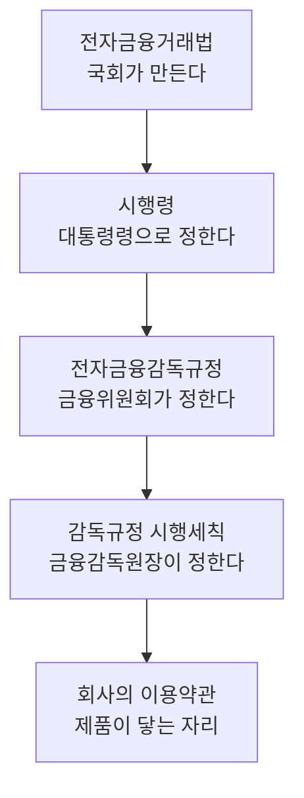
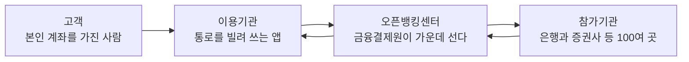

[앞 편](/blog/product-management/commerce-pricing-and-order/)은 가격이 층이고 주문이 상태를 갈아입는 여정이라는 것을 다뤘다. 커머스는 물건이 실제로 오가기 때문에 도메인의 경계가 또렷하다 — 팔 것이 있고 살 사람이 있고 보낼 곳이 있다.

핀테크는 그렇지 않다. 오갈 물건이 없는 자리에서는 **규제가 그 경계를 대신 그어 준다.** 이 편이 다루는 것은 그 선이 어디 있고, 그것을 아는 일이 실무에서 무엇을 바꾸는지다. 정의에서 시작해 법으로 내려갔다가 오픈뱅킹이라는 인프라에서 끝나는데, 세 자리가 따로 노는 것이 아니라 **앞의 것이 뒤의 것을 가능하게 하는 순서**로 이어져 있다.

## 핀테크는 정의부터 다시 세워야 한다

「금융과 기술의 합성어」라는 흔한 설명으로는 아무것도 하지 못한다. 어떤 회사가 핀테크인지 **가릴 수 없기 때문**이다. 대상을 가릴 수 없으면 조사할 목록이 만들어지지 않는다.

먼저 갈라야 할 것은 시기가 다른 두 덩어리다.

| 구분 | 시기 | 무엇이 달라졌나 |
| --- | --- | --- |
| 디지털 금융 (전통 핀테크) | 모바일 이전 | 텔레뱅킹 · 현금자동입출금기 · 인터넷뱅킹. 영업점 창구와 종이 서류를 대신한 **겉모습의 변화**다 |
| 핀테크 (신흥 핀테크) | 모바일 이후 | 마이데이터 · 지급지시업. 무엇을 **추구하는가가 바뀐** 쪽이다 |

같은 「금융 + 기술」인데 앞줄이 바뀐 것은 겉모습이고 뒷줄이 바뀐 것은 추구하는 가치다. 창구에서 하던 이체를 화면에서 하게 된 것과, 흩어져 있던 내 정보를 한자리에 모을 권리가 생긴 것은 층이 다르다.

그다음이 판별 기준이다. 여기서 필요한 것이 **조작적 정의** — 뜻을 풀어 설명하는 대신, 적용하면 목록이 나오는 형태로 다시 쓰는 방식이다.

> 핀테크 기업 = **IT 기업 또는 플랫폼 사업을 하는 전자금융업자**

이 정의의 값어치는 뜻이 정확해서가 아니라 **적용하면 답이 하나로 떨어진다**는 데 있다. e-금융민원센터가 공개하는 전자금융업 등록 현황을 열면 대상 기업이 이름으로 나열되므로, 조사할 목록이 논쟁 없이 만들어진다.

물론 예외가 있다. 전자금융업자가 아닌데 널리 핀테크로 불리는 회사가 있고, 금융회사에 솔루션만 납품하는 회사도 있다. **예외가 있다는 것이 기준을 버릴 이유는 아니다** — 기준이 없으면 예외라는 말 자체가 성립하지 않는다. 목록을 뽑아 두고 「이 회사는 왜 빠졌는가」를 따지는 편이, 기준 없이 「이 회사는 핀테크인가」를 매번 다투는 것보다 낫다.

## 허가와 등록은 다른 절차다

전자금융거래법 제28조는 업무 유형에 따라 문턱을 둘로 나눈다. 이름이 비슷해 섞어 쓰기 쉬운데, 심사가 있느냐 없느냐로 갈린다.

| 구분 | 무엇인가 |
| --- | --- |
| 허가 | 요건을 갖춘 경우에 한해 법이 걸어 둔 일반적 금지를 풀어 주는 행정처분이다 |
| 등록 | 심사 절차 없이 요건을 갖췄다는 사실을 공적 장부에 적어 금지를 풀고 법률 효과를 내는 절차다 |

차이는 이름이 아니라 심사에 있다. **허가는 행정청이 판단해서 풀어 주고, 등록은 요건을 채웠다는 사실을 공적 장부에 적으면 효과가 생긴다.**

어느 업무가 어느 쪽인지는 법이 정해 두었다.

| 문턱 | 대상 업무 |
| --- | --- |
| 허가 | 전자화폐의 발행 및 관리업 |
| 등록 | ① 전자자금이체업무 |
| | ② 직불전자지급수단 발행·관리 |
| | ③ **선불전자지급수단 발행·관리** |
| | ④ 전자지급결제대행(PG) |
| | ⑤ 그 밖에 대통령령이 정하는 업무 |

허가 쪽이 한 줄뿐인 것이 눈에 띈다. 법이 가장 무거운 문턱을 하나에만 걸어 두었다는 뜻이며, 그 하나가 다음 절에서 볼 전자화폐다.

등록 쪽 셋째 줄이 실무에서 가장 자주 만나는 자리다. 결제 수단을 앱 안에 담으려는 회사가 밟는 절차가 여기이며, 뒤에 나올 오픈뱅킹의 이용 자격도 이것을 전제로 한다. **이 편의 세 덩어리가 한 줄에서 만난다** — 정의가 「전자금융업자」를 기준으로 삼았고, 법이 그 자격을 등록으로 주며, 오픈뱅킹이 그 자격을 요구한다.

## 선불전자지급수단과 전자화폐는 요건이 다르다

둘은 상하 관계다. 전자화폐가 선불전자지급수단의 상위 개념이며, 상위로 갈수록 요건이 무거워진다.

| 무엇을 보나 | 선불전자지급수단 | 전자화폐 |
| --- | --- | --- |
| 쓰이는 범위 | 두 개 업종 이상 | 광역자치단체 2곳 이상 + 가맹점 500곳 이상 + 업종 5개 이상 |
| 환급 | 권면액의 정해진 비율 이상을 쓰고 나면 남은 값을 돌려준다 | 현금·예금과 같은 값으로 바꾸며 요청하면 전액 돌려준다 |
| 충전 방법 | 현금 · 예금 · 신용카드 · 전화결제 · 마일리지 등 여럿 | 제한적이다 |
| 겸업 | 제한이 없다 | 제한이 있다 |

네 줄이 같은 방향을 가리킨다. 전자화폐는 **더 넓게 쓰이고 더 확실하게 돌려주는 대신 더 좁게만 할 수 있다.** 환급 줄이 특히 그렇다 — 요청만 하면 전액을 돌려준다는 조건은 발행한 쪽이 그만큼을 늘 준비해 두어야 성립한다.

요건 차이가 결과를 만들었다. 진입 문턱이 워낙 높아 **전자화폐 발행·관리업자는 지금까지 사실상 없다.** 우리가 아는 「○○페이」는 대부분 선불전자지급수단이다. 법에 두 갈래가 적혀 있어도 실제로는 한 갈래만 쓰인다는 뜻이라, **법전의 구조와 시장의 구조가 같지 않다.**

한도도 법이 정한다. 선불전자지급수단의 발행권면 최고한도는 50만 원이고, 실지명의를 확인해 발행하면 200만 원이다(전자금융거래법 시행령 제13조). **이런 숫자는 협의로 정하는 값이 아니라 이미 정해져 있는 값이다** — 기획서에 담기 전에 확인할 자리이지 확인 뒤에 조정할 자리가 아니다. 충전 한도를 얼마로 할지 논의하다가 뒤늦게 상한을 발견하면, 그때까지 그린 화면과 정책이 함께 어긋난다.

## 법령은 다섯 층으로 내려온다

이 절의 층은 위에서 아래로 내려오며 좁아진다. 법률에 있는 것과 감독규정에 있는 것을 같은 무게로 인용하면, 바꿀 수 있는 것과 바꿀 수 없는 것이 뒤섞인다.

맨 아래 칸이 제품과 맞닿는 자리다. **약관이 곧 제품의 그릇이다** — 「○○머니」도 「△△페이」도 「◇◇포인트」도, 회사가 이용자와 맺는 전자금융거래의 기본 조건을 적어 둔 문서 위에 얹혀 있다. 이용자가 그 문서에 동의하는 순간 **송금과 결제를 담을 그릇 하나가 열린다.**

약관의 필수 사항으로 꼽히는 예로는 이용한도와 출금동의와 접근매체가 있다. 세 회사의 약관을 나란히 놓고 비교했을 때 공통으로 나온 항목이다. 그리고 약관을 고칠 때는 **시행일 한 달 전에 게시하고 알려야 한다.**

마지막 것이 일정에 직접 영향을 준다. 약관을 건드리는 변경은 개발이 끝나도 한 달을 더 기다려야 나가므로, **개발 완료일과 출시일이 벌어지는 이유가 여기에 있다.**

## 오픈뱅킹은 현상이고 공동망은 인프라다

낱말이 셋인데 가리키는 층이 서로 다르다.

| 용어 | 무엇을 가리키나 |
| --- | --- |
| 오픈API | 바깥에서도 프로그램이나 서비스를 만들 수 있게 열어 둔 접점이다 |
| 오픈뱅킹 | 금융이 그 열린 접점을 통해 제공되고 있는 **상태**를 부르는 말이다 |
| 금융결제원 오픈뱅킹공동망 | 그 중개를 실제로 맡아 돌리는 국내의 **설비**다 |

첫 줄은 기술의 이름, 둘째 줄은 그 기술이 금융에 퍼진 **상태**를 부르는 말이고, 셋째 줄만이 실제로 존재하는 **기관과 설비**다. 층이 다른 셋을 같은 말로 쓰면 「오픈뱅킹을 연동한다」가 무엇을 하겠다는 것인지 알 수 없어진다 — 현상을 연동할 수는 없다.

셋째 줄이 앞의 둘을 국내에서 실체로 만든 것이라, **국내에서는 「오픈뱅킹 = 금융결제원 오픈뱅킹공동망」으로 읽어도 무방하다.** 같은 축 위에 어카운트인포와 대출이동서비스, 그리고 마이데이터 중개 같은 것들이 나란히 있다. 무엇을 옮기느냐가 저마다 다른데, **마지막 것이 거기 있다는 사실이 다음 편으로 이어지는 다리**가 된다.

그렇다면 이 인프라가 없으면 어떻게 되는가. 대체 수단이 아예 없지는 않다는 점이 중요하다.

| 공동망이 없다면 | 공동망이 있으므로 |
| --- | --- |
| 펌뱅킹과 그 재판매, B2B API, CMS 로 대신할 수 있으나 비용이 든다 | 스타트업이 새 사업을 만들 수 있다 |
| 표준이 없어 중소형 금융사를 잇는 데 한계가 있다 | **금융회사와의 협상력 부족 문제가 풀린다** |
| 금융회사 50곳 이상과 직접 계약해야 하고, 정보를 넓게 받으려면 100여 기관을 이어야 한다 | 시스템이 안정되고 수수료와 정책이 하나로 모이며 개발설계서가 표준화된다 |

왼쪽 칸은 「불가능」이 아니라 **「가능하지만 비싸다」로** 읽어야 한다. 수수료를 기관마다 협상하고 전용회선을 기관마다 까는 부담 자체가 진입 장벽이 된다. 오른쪽 가운데 칸이 그 자리를 가리키며, 앞의 두 줄과 성격이 다르다 — 비용이 아니라 **협상력**이다.

## 오픈뱅킹은 고객 계좌에서 출발한다

구조는 단순하다. 고객과 금융회사 사이에 중개 한 겹이 들어간다.

계좌를 열어 주는 쪽이 **참가기관**이고 그 통로를 빌려 쓰는 쪽이 **이용기관**이다. 화살표가 되돌아오는 것은 조회 결과가 같은 경로로 돌아온다는 뜻이다.

여기에 지켜야 할 규칙이 하나 있다. **자금이 움직일 때 출발지는 무조건 고객 본인의 계좌여야 한다.** 도착지는 참가기관 가운데 자금을 받을 수 있는 계좌면 된다.

이 한 줄이 오픈뱅킹으로 무엇을 만들 수 있고 무엇을 만들 수 없는지를 거의 다 정한다. **고객 중심의 자금 이동**이라는 표현과 지급지시의 발판이라는 말이 가리키는 것이 이 규칙이다.

## 오픈뱅킹을 실제로 붙이는 절차

세 단계인데 첫 단계가 앞 절들과 이어진다.

| 단계 | 무엇을 하나 |
| --- | --- |
| 1 | **전자금융업 등록** — 선불전자지급수단 발행·관리업이다. 오픈뱅킹 이용약관 제11조가 정한 이용 자격 요건이다 |
| 2 | 오픈뱅킹공동망 이용기관으로 신청한다. 통합포털 신청서와 보증보험 가입 등이 따르고, API 명세서로 개발 범위를 가늠할 수 있다 |
| 3 | 서비스를 기획하고 출시한다 |

1단계가 곧 「허가와 등록」 절에서 굵게 표시했던 그 항목이다. **등록이 되어 있지 않으면 2단계로 넘어갈 수 없으므로, 오픈뱅킹을 쓰는 서비스의 일정은 개발이 아니라 등록에서 시작한다.**

붙이기 전에 확인할 것이 셋 있다.

| 확인할 것 | 무엇을 보나 |
| --- | --- |
| 수수료 | 입금이체 API 는 건당 40원, 출금이체 API 는 50원 수준이다. 건수가 곧 비용이므로 이체를 몇 번 부르는지가 단가 설계에 들어간다 |
| 테스트베드 | 계약 전에 미리 겪어 볼 수 있다 |
| 🔴 약관의 종류 | 「참가기관 약관」과 「이용기관 약관」을 혼동하면 안 된다. 금융정보조회와 자동이체 약관은 **참가기관용**이다 |

셋째 줄이 가장 조용하게 위험하다. 이용기관이 참가기관 약관을 읽고 요건을 잡으면 **처음부터 틀린 자리에서 시작하는데, 문서가 진짜이므로 틀렸다는 신호가 어디에도 뜨지 않는다.**

실제 사례로는 대출비교 플랫폼에 오픈뱅킹을 붙인 핀다가 있다. 상환할 계좌를 조회하고 중도상환으로 아낄 금액을 계산한 뒤 실제 상환까지 앱 안에서 끝낸다(1회 200만 원). **조회에서 끝나지 않고 자금 이동까지 이어졌다는 점**이 이 사례의 값어치인데, 그것이 가능했던 이유가 앞 절의 규칙이다 — 상환할 계좌가 고객 본인의 것이기 때문이다.

## 이 편이 쓴 용어

| 용어 | 원어 | 이 편에서의 뜻 |
| --- | --- | --- |
| 전자금융업자 | — | 제28조가 정한 문턱을 넘어 자격을 얻은 사업자. 금융회사는 여기 들지 않는다 |
| 선불전자지급수단 | — | 미리 채워 둔 값을 전자적으로 담아 옮길 수 있게 만든 증표. 업종 둘 이상에서 쓰이면 여기 든다 |
| 전자화폐 | — | 선불보다 한 단계 무거운 요건을 지는 개념. 광역단체 둘·가맹점 오백·업종 다섯이 그 문턱이다 |
| 오픈API | Open API | 바깥에서 응용프로그램이나 서비스를 만들 수 있도록 공개해 둔 접점 |
| 오픈뱅킹 | Open Banking | 금융이 열린 접점으로 제공되는 상태를 부르는 말. 국내에서는 공동망 하나를 뜻한다 |
| 참가기관과 이용기관 | — | 계좌를 내주는 금융회사와, 그 길을 빌려 쓰는 핀테크 사업자 |
| 데이터 3법 | — | 개인정보보호법과 정보통신망법, 신용정보법 셋을 묶어 부르는 이름 (이름만 짚는다 — 다음 편의 자리다) |
| 조작적 정의 | Operational Definition | 뜻을 푸는 대신, 적용하면 대상 목록이 나오는 형태로 다시 쓴 정의 |

눈여겨볼 것은 **요건이 적힌 줄들**이다. 「두 개 이상 업종」이나 「가맹점 500곳」 같은 숫자는 설명을 돕는 예시가 아니라 그 낱말의 정의 자체다. **이 편의 낱말들은 정해 둔 곳이 따로 있고 제품은 그것을 따를 뿐이라, 회의에서 합의해 바꿀 수 있는 것이 아니다.**

「데이터 3법」은 [지도편](/blog/product-management/product-management-map/)이 이 편과 다음 편에 함께 배정한 용어다. **이 편에서는 이름만 짚고, 마이데이터가 그 위에 어떻게 서는지는 다음 편이 다룬다.** 「약관」은 [앞 편](/blog/product-management/commerce-pricing-and-order/)의 「정책」과 자리가 같다 — 화면보다 먼저 정해지고 화면을 제약한다는 점에서 그렇다. 다만 앞 편의 정책은 회사가 정했고 이 편의 약관은 **회사가 정하되 그 위의 네 층이 이미 제약해 둔 것**이라는 차이가 있다.

## 정리

핀테크는 넓게 풀면 아무것도 가릴 수 없는 낱말이라, 등록현황을 조회하면 목록이 나오는 형태로 정의를 다시 써야 조사가 시작된다. 그렇게 확정한 대상 위에 법이 얹히는데, 허가와 등록은 심사가 있느냐로 갈리고 선불전자지급수단과 전자화폐는 요건의 무게로 갈리며 한도 같은 숫자는 협의가 아니라 시행령이 정해 둔다. 법률에서 약관까지 다섯 층으로 내려오는 구조에서 제품이 닿는 자리는 맨 아래이고, 그래서 약관을 건드리는 변경은 개발이 끝나도 한 달을 더 기다린다.

이 편이 남기는 한 문장은 오픈뱅킹 절의 것이다. **없어도 되지만 비싸다는 것과, 아예 협상 테이블에 앉을 수 없다는 것은 다른 문제다.** 금융회사 50곳과 개별로 계약해야 하는 부담이 곧 진입 장벽이었고, 공동망 하나가 그 협상력 문제를 해소했다. 그 위에서 지킬 규칙은 하나뿐이다 — 자금의 출발지는 언제나 고객 본인의 계좌다.

[다음 편](/blog/product-management/mydata-and-market-structure/)은 같은 규제 도메인의 다른 축을 본다. 오픈뱅킹이 계좌를 잇는 인프라였다면, 그다음은 **정보를 옮길 권리** 자체를 제도로 만든 이야기다. 권리가 먼저 생기고 시장 구조가 그 뒤에 따라 바뀐다.
