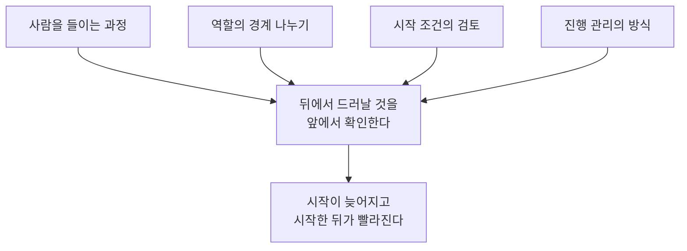
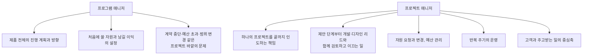
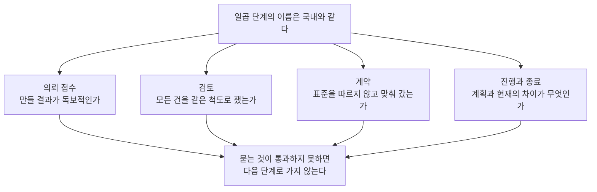

[앞 편](/blog/product-management/roles-and-organizational-culture/)은 한 사람을 부르는 세 가지 이름을 갈랐고, 계급이 하던 일이 사라지면 그 몫이 소통 쪽으로 옮겨 온다는 것까지 봤다. 같은 언어와 같은 노동 관행을 쓰는 국내 조직을 전제한 이야기였다.

**이 편은 그 전제를 뺀다.** 국경을 넘는 조직에서는 함께 일할 사람의 배경과 근무 시간대와 계약 조건이 모두 달라 앞 편이 말한 소통 비용이 한 번 더 커지는데, 그것을 감당하는 방식이 국내와 다르다.

이 편이 답할 질문은 하나다. **단계의 이름이 똑같은데 왜 다르게 굴러가는가.** 사람을 들이고 역할을 나누고 프로젝트를 검토해 추진하기까지 절차의 겉모양은 거의 같은데, 각 단계에서 확인하는 것이 다르다.

⚠️ **네 갈래가 한 곳으로 모이는 것이 이 편의 주장이다.** 넷은 서로 다른 국면이지만 각각이 무엇을 하는지 적어 놓고 보면 같은 방향을 향하며, 그 방향의 대가는 마지막 절에서 한 번에 모인다.

## 석 달이 걸리는 동안 확인하는 것은 성과가 아니다

사람을 들이는 데 단계가 다섯이나 여섯이고 석 달에서 넉 달이 걸린다. 단계마다 확인하려는 것이 달라 겹쳐서 줄일 수가 없다.

| 단계 | 무엇이 일어나나 | 무엇을 준비하는가 |
| --- | --- | --- |
| 접촉 | 인사 담당자가 경력 기록을 확인한다 | 경력 기록을 **영문으로 관리해 둔다** |
| 선별 대화 | 인사 담당자가 자리와 맞는지 가른다 | 영어로 주고받을 수 있는지가 판단된다 |
| 실무 대화 한두 차례 (관리자) | 제품 관리 경험과 능력을 확인한다 | **무슨 성과를 냈는지가 아니라 어떻게 일해 왔는지**를 드러낸다 |
| 실무 과제 | 상황을 주고 해결 방안을 받는다 | 가장 익숙하고 **평소에 쓰는 방식**으로 답한다 |
| 실무 대화 세네 차례 (개발·디자인 리드) | 함께 일할 동료가 프로젝트를 두고 검증한다 | 묻고 답하는 자리가 아니라 **같은 팀원으로 회의하듯** 대한다 |

**이 표가 말하는 것**: 뒤로 갈수록 대화 상대가 인사 담당자에서 관리자로, 다시 함께 일할 동료로 옮겨 간다. 동료는 뽑을 권한이 아니라 함께 일할 부담을 갖고 앉아 있으므로 물어볼 것이 자격이 아니라 **일하는 방식**이 된다. 오른쪽 열도 같은 것을 가리킨다 — 꾸며 두었는지가 아니라 **평소에 그렇게 하고 있는지**를 묻는다.

실무 과제가 그 성격을 잘 보여 준다. 발표 자료를 내는 것이 아니라 **프로젝트 관리 도구만 쓴다.**

> 전체 일정을 도구의 로드맵에 세우고, 필요한 작업을 빠짐없이 만들고, 작업마다 담당자와 걸리는 기간을 넣고, 그것을 근거로 **필요한 인원과 비용을 산출한다.**

발표 자료는 결과를 보여 주지만 도구 위에는 **과정이 남는다.** 작업을 얼마나 잘게 쪼갰는지와 인원 산정이 무엇에서 나왔는지가 화면에 그대로 보인다.

## 기대를 문장으로 적어 놓으면 그것이 채점표가 된다

무엇을 기대하는지가 항목과 문장으로 적혀 있다. 관리자 쪽에서 보는 것이 셋이다.

| 항목 | 기대하는 것 |
| --- | --- |
| 목표 지점 | 프로젝트의 목표와 그것에 닿는 방법을 이해할 것 |
| 연결과 소통 | 리드와 구성원 사이에서 **접착제** 노릇을 하며, 서로 믿고 최선을 끌어내는 팀을 만들 것 |
| 변화의 항해 | 어떤 어려움이 와도 팀이 목표를 놓지 않도록 변화 속에서 길을 낼 것 |

**이 표가 말하는 것**: 세 항목이 모두 목표 자체가 아니라 **목표에 닿게 만드는 방식**을 묻는다. 첫째는 길을 아는지, 둘째는 사람을 붙이는지, 셋째는 길이 바뀌었을 때 다시 붙이는지다. 가운데 칸의 접착제라는 말은 자기가 붙는 자리가 따로 없다는 뜻이며, 앞 편이 직책을 **팀 안의 구심점**이라 부른 자리를 중심이 아니라 접착면으로 바꿔 말한 것이다.

개발과 디자인 리드 쪽에서 보는 것은 더 구체적이다.

| 항목 | 확인하는 것 |
| --- | --- |
| 반복 주기 운영 | 일일 확인 회의와 남은 일 목록과 주기 계획과 회고를 어떻게 굴리는지 |
| 관리 도구 숙련 | 큰 덩어리와 작업과 사용자 이야기를 **주기와 배포에 배정**할 수 있는지 |
| 예산 관리 | 프로젝트 예산을 직접 다룰 수 있는지 |
| 소통 | 개발자와 디자이너와 말이 통하는지 |
| 교환 관계 설명 | **하나를 넣으면 무엇이 밀리는지**를 고객에게 설명할 수 있는지 |

**이 표가 말하는 것**: 다섯 가운데 넷이 도구와 숫자에 걸려 있고 마지막 하나만 말에 걸려 있는데, 그 마지막 항목의 내용이 앞의 넷이다. 이 기능을 이번 주기에 넣으려면 시간이 더 필요하다는 말은 배정과 예산을 읽지 못하면 나오지 않는다. **설명할 수 있다는 것이 앞 네 항목의 결과다.**

## 네 가지 특이점이 모두 같은 것을 앞으로 옮긴다

국내와 다른 자리가 네 곳 있고, 원본은 각각에 그렇게 하는 이유를 붙여 두었다.

| 다른 자리 | 국내에서는 어떤가 | 왜 그렇게 두는가 |
| --- | --- | --- |
| **중요한 단계부터 시작한다** | 국내는 실무진이 먼저 보고 임원이 나중에 본다. 이쪽은 **첫 단계가 임원 쪽**이다 | 모든 일에 중요도와 급한 정도가 함께 붙는다. 가장 중요한 결정권자가 먼저 판단하는 것이 효율적이다 |
| **실무 능력을 검증한다** | 이런 성과가 있었다가 아니라 **내가 할 수 있는 일은 이것이다**를 확인한다 | 실제로 굴리면 예측하지 못한 문제가 나오고, 그 자리에서 관리하고 이끄는 능력이 필요하다 |
| **문화 적합성을 본다** | 평가자 개인의 취향이 아니라 **회사 문화의 항목별 적합성**이다. 한 사람이라도 한 항목이라도 어긋나면 과감히 보류한다 | 방향을 책임지는 자리이므로, 논리가 통하지 않는 상황에서 **주장하고 설득할 수 있는지**를 봐야 한다 |
| **즉시 전력을 뽑는다** | 대기 인원이나 유망주가 아니라 **바로 경기에 나갈 수 있는** 사람이다 | 효과가 나지 않으면 인원을 과감히 바꾼다. 프로젝트의 생산성이 기준이다 |

**이 표가 말하는 것**: 넷이 서로 다른 이야기처럼 보이지만 오른쪽 열을 이어 읽으면 하나가 된다. **뒤에서 드러날 것을 앞에서 확인하겠다는 것이다.** 결정권자의 판단도, 예측 못 한 문제에서의 능력도, 투입 즉시의 성과도 본래는 일을 시작한 뒤에 알게 된다.

셋째 항목의 판정 방식이 특히 그렇다. 한 항목이라도 어긋나면 보류한다는 규칙은 **점수를 더하지 않고 최솟값을 본다**는 뜻이다. 평균으로 뽑으면 어떤 항목의 결핍이 다른 항목의 우수함에 가려지고, 가려진 그 항목이 나중에 그대로 문제가 된다. 넷째 항목은 그 대가를 함께 적어 둔 것이다 — 들이는 기준을 높이면 **맞지 않을 때 바꾸는 문턱도 같이 낮아진다.**

## 맡지 않을 것을 정해 두면 맡은 것에 전부를 쓸 수 있다

프로젝트를 맡는 자리가 프로그램 매니저와 프로젝트 매니저 둘로 나뉘어 있다.

⚠️ **두 갈래가 만나는 지점을 도식에 넣지 않았다.** 자원을 처음 정하는 것은 위쪽이고 요청해 바꾸는 것은 아래쪽인데 잇지 않았다. 나뉜 자리를 보이는 것이 이 도식의 목적이다.

**하지 않는 것**도 함께 정해져 있다. 로드맵의 방향을 잡는 일, 처음의 자원과 이익을 정하는 일, 그리고 **개발과 디자인 작업에 세부까지 관여하는 일**이다. 앞의 둘은 위쪽 몫이고 마지막 하나는 아무의 몫도 아니다.

국내에서 이 자리가 프로젝트의 거의 모든 것을 검토하고 진행했다면, 여기서는 **프로젝트 본연에만 집중하고** 그 역할이 아닌 일이 들어오면 **아니라고 말할 수 있어야** 한다. 다만 자리를 비워 두는 데는 조건이 붙는다.

| 조건 | 무엇을 해야 하나 |
| --- | --- |
| 권한 넘기기 | 역할별 리드와 나누되 관리 역할이 섞이지 않게 한다. 개발과 디자인에 **결정할 권한을 넘겨야** 비워 둔 자리가 빈칸으로 남지 않는다 |
| 관여 방식의 정리 | 실행과 최종 책임과 자문과 통보 가운데 누가 어디에 있는지 모호하면 **그것부터 팀 안에서 꺼내 정리한다** |

**이 표가 말하는 것**: 두 줄이 같은 일의 앞뒤다. 권한을 넘기는 것은 자리를 비우는 행위이고 관여 방식을 정리하는 것은 비운 자리에 누가 있는지를 적는 행위인데, 앞만 하고 뒤를 빼면 세부에 관여하지 않는다는 원칙이 **아무도 결정하지 않는 상태**로 나타난다.

⚠️ **역할의 이름 자체가 다르게 쓰이기도 한다.** 화면의 시각적 요소를 다루는 디자이너와 흐름을 설계하는 디자이너를 부르는 두 이름이 국내와 반대인 경우가 있으므로, 나누기 전에 그 이름이 무엇을 가리키는지부터 맞춘다.

## 같은 세 낱말의 순서를 국면마다 바꾼다

준비하고 겨누고 쏘는 세 낱말의 순서를 국면마다 달리 놓는다. 원본이 여기에 세 줄을 적었다.

| 국면 | 순서 | 그렇게 두는 이유 |
| --- | --- | --- |
| **프로젝트를 세울 때** | 준비 · **겨눔** · 발사 | 목표 지점이 잘못된 채로 시작되면 나중에 바로잡는 비용이 월등히 크다 |
| **프로젝트를 굴릴 때** | 준비 · **발사** · 겨눔 | 예측하지 못한 문제는 이 주 단위의 반복 주기로 대응한다 |
| **프로세스 자체** | 준비 · 발사 · 겨눔 | 방향이 맞지 않으면 오래 써 온 절차라도 **과감히 바꿔 시도한다** |

🔴 **세 줄을 한 줄로 합치면 이 표가 말하는 것이 뒤집힌다.** 둘째 줄만 떼면 일단 만들고 나중에 방향을 본다는 이야기가 되고, 첫째 줄만 떼면 계획을 다 세운 뒤에 착수한다는 이야기가 된다. 그 둘 중 하나를 전체로 삼는 태도가 원본이 뒤집으려던 것이므로 **국면을 나눈 것 자체가 주장이다.**

셋째 줄은 둘째 줄과 순서가 같으면서 층이 다르다 — 프로젝트를 굴리는 방식이 아니라 **그 방식을 정하는 절차 자체**를 굴리는 방식이다.

> 바꾸는 일이 불편하고 시간도 걸리지만, 그 비용보다 바꾼 뒤에 얻는 것이 더 크다.

오래 써 왔다는 사실이 절차를 유지할 근거가 되지 못한다는 뜻이다.

## 프로젝트는 떨어지는 것이 아니라 맡겨지는 것이다

검토 단계에서 지키는 원칙이 다섯 있다. 원본은 이것을 「하면 된다」가 아니라 **「되면 한다」** 로 요약했다.

| 원칙 | 무엇을 하는가 |
| --- | --- |
| 검토 요청으로 받는다 | 프로젝트가 위에서 떨어지는 것이 아니라 **검토해 달라는 요청이 맡겨지는** 것이다 |
| 불명확한 것을 되돌린다 | 흐릿한 항목과 무리한 요구는 실행할 수 있는 형태로 정리해 달라고 **고객에게 당당히 요청한다** |
| 계약과 다른 진행을 짚는다 | 계약대로 굴러가지 않으면 그 자리에서 개선을 요청한다 |
| 세 가지가 갖춰질 때 시작한다 | **잘할 수 있는 분야인지, 잘할 수 있는 방법과 방향을 찾았는지, 관리와 추진이 모두 준비됐는지**를 보고 시작한다 |
| 하나의 기능까지 내려간다 | 기능 하나를 두고도 무엇을 해야 하는지와 **끝내는 데 며칠이 드는지까지** 판단한다 |

**이 표가 말하는 것**: 다섯 줄이 모두 시작 시점을 뒤로 미루고, 첫째 줄이 그 성격을 정한다 — 받는 것이 프로젝트가 아니라 검토 요청이므로 결과가 아니오여도 요청을 처리한 것이 된다. **아니오를 말할 자리를 절차 안에 만들어 둔 것이다.**

원본은 이것을 그림으로 설명한다. 멀리 열매가 달린 나무가 보일 때 한 명씩 달려가 따 오라고 하는 것이 아니라, **열매를 아는 사람과 사다리를 만드는 사람과 실어 나를 사람이 모여 방법부터 회의한다.** 나무가 한 길이든 열 길이든 순서가 같다는 것이 핵심이다 — 쉬워 보이는 일에서 절차가 생략되지 않는다.

## 일곱 단계는 그대로인데 각 단계가 하는 일이 다르다

의뢰 접수와 검토와 판단과 계약과 시작과 진행과 종료라는 일곱 단계는 국내와 같다. 다른 것은 그 목록을 무엇으로 보는지다 — **시간에 따라 밟는 순서가 아니라 각기 다른 관문으로 여긴다.**

⚠️ **도식이 단계를 일렬로 잇지 않은 것이 이 절의 내용이다.** 일렬로 그리면 순서가 되는데, 순서로 보는 관점이 바로 이 절이 부정하는 것이다.

| 단계 | 이 관문이 묻는 것 |
| --- | --- |
| 의뢰 접수 | 의뢰 비용이 상당히 높으므로 **만들 결과가 뛰어나고 독보적인가**부터 생각한다. 사람을 들일 때처럼 가장 무거운 판단이 먼저 온다 |
| 검토 | 어느 건이든 **같은 도구로 정리해** 판단한다. 예외 사항도 승인 경로를 미리 정해 개인의 주관을 뺀다 |
| 계약 | 표준 문서를 따르는 것이 아니라 **협의해 맞춰 나간다.** 길어지거나 논쟁이 생기는 것은 생산적인 활동으로 여겨진다 |
| 진행과 종료 | 일정을 따르는 것이 아니라 **예측과 계획에 견준 현재의 차이**를 확인해 푼다. 변경 요청도 추가 업무가 아니라 기존 계획과의 **교환 관계**로 다루고, 밀린 기능은 남은 일 목록이나 다음 단계로 협의한다 |

**이 표가 말하는 것**: 네 관문이 각각 다른 것을 배제한다. 첫째는 할 수 있다는 자신감을, 둘째는 개인의 주관을, 셋째는 표준 문서의 권위를, 넷째는 일정의 권위를 뺀다. **관문은 통과 조건이 그 자리에 적혀 있다는 뜻이고, 순서는 시각이 오면 다음으로 간다는 뜻이다.**

같은 목록을 순서로 다룬 자리가 이 블로그 안에 있다. [기획과 제품 운영](/blog/product-management/planning-and-product-ops/)이 요구사항 하나가 접수되어 종료로 나가기까지의 아홉 단계를 늘어놓고 분석을 **두 번** 하도록 못 박아 둔 것을 핵심으로 짚었다. **그쪽은 한 단계를 둘로 쪼개 요청과 해결책 사이에 다른 후보가 낄 자리를 만들고, 이쪽은 모든 단계에 문턱을 세워 같은 자리를 만든다.**

## 여섯 단계 가운데 수로 바뀌지 않는 것은 하나뿐이다

진행 관리는 전부 도구 위에서 이루어지고, 여섯 갈래마다 무엇을 수로 바꾸는지가 정해져 있다.

| 단계 | 관리 방식 |
| --- | --- |
| **요구사항 분석** | 정량화할 수 없어 정성으로 남는 **유일한 단계**다. 고객의 요구를 내부 시각으로 다시 정리해 맞추는데, 스스로 무엇을 원하는지 모르는 경우가 많으므로 현실적인 방향을 제시한다. 바꾸고 명확히 한 과정은 **문서로 남겨 공유하고**, 기한까지 불명확한 부분은 **범위에서 뺀다** |
| **수용 가능한 범위** | 정성을 **정량으로 바꾸는** 단계다. 기능별로 역할마다 필요한 기간을 산출하고 이해도와 휴일과 개인 휴가와 사람마다 다른 생산성까지 계산에 넣는다. **기능 하나가 닷새를 넘지 않게** 하고 넘으면 더 쪼갠다. 사람은 이름이 아니라 **역할별 숙련도 등급**으로 적는다 |
| **예산** | 자원의 등급과 기간을 계산으로 정리해 산정하고, 역할별 투입 시기까지 계획한다. 예산이 고정이면 **우선순위가 낮은 기능을 미리 빼서** 종료일 무렵의 무리한 개발을 막는다 |
| **반복 주기 운영** | 주기 계획은 이 주의 근무일 가운데 **여덟 할 정도**로 세우고 주기의 목표를 명확히 둔다. 일일 확인 회의와 내부 시연으로 진척을 보고, 회고를 돌리며, **잔여 업무 추이**로 운영이 건강한지를 본다 |
| **문제와 위험** | 내용과 중요도와 발생일과 예상 종료일과 책임자와 대안을 **계산으로 점수화해** 처리 순서를 정한다. 위험을 강조하는 데서 멈추지 않고 **해결 제안까지** 함께 낸다 |
| **보고** | 문제가 없으면 **추가로 보고하지 않는다.** 잦은 보고보다 **중요할 때의 명확한 상황 설명과 고를 수 있는 대응안**이 실질적인 지원을 끌어낸다 |

**이 표가 말하는 것**: 첫 줄만 정성으로 남고 나머지 다섯이 전부 수로 바뀌는데, 첫 줄에 붙어 있는 처리가 문서화와 기한이다. **수로 바꿀 수 없는 단계를 문서와 기한으로 묶어 둔 것이다.** 기한까지 불명확한 것을 범위에서 뺀다는 규칙이 없으면 정성 단계가 뒤로 새어 나오고, 그러면 둘째 줄의 정량 변환이 근거 없는 숫자를 만든다.

닷새 규칙과 여덟 할 규칙은 성격이 같다. 하나는 작업의 크기에, 하나는 시간의 채움에 상한을 두어 **둘 다 계획이 맞았는지 알 수 있는 간격을 확보한다.** 열흘짜리 작업은 이레째에 늦었다는 것을 알 수 없고, 근무일을 열 할로 채운 계획은 하루만 밀려도 어긋난다. 사람을 이름이 아니라 등급으로 적는 규칙도 같은 자리에 있다 — **인원 변경의 문턱을 낮춘 조직은 계획에서 이름을 빼야** 사람이 바뀔 때 계획이 무너지지 않는다.

마지막 줄은 앞 편과 이어진다. 문제가 없으면 보고하지 않는다는 규칙의 목적은 보고를 줄이는 것이 아니라 보고가 도착했을 때 **그것이 신호가 되게** 하는 것이다. 앞 편이 계급의 대체물로 설명한 소통 비용을, 여기서는 필요한 순간에 몰아서 쓴다.

## 이 편이 쓴 용어

[지도편](/blog/product-management/pm-practice-map/)의 용어표는 이 편에 낱말 다섯을 맡겨 두었다. 거기 실린 것이 여덟 편에 두루 통하는 뜻이라면, 아래는 **국경을 넘는 협업에서 그 말이 놓인 자리**다.

| 용어 | 이 편에서 놓인 자리 |
| --- | --- |
| 프로젝트 매니저 (PM) | 하나의 프로젝트를 끝까지 인도하는 책임. **맡지 않을 것이 함께 정해져 있다**는 점이 국내와 다르다 |
| 프로그램 매니저 (PgM) | 제품 전체의 계획과 방향, 처음의 자원과 이익, 프로젝트 바깥의 문제를 맡는 자리 |
| 역할 분담 모델 (RACI) | 관여 방식을 넷으로 나누는 모델. 여기서는 **모호한 자리를 찾아 꺼내는 대상**으로 쓰였다 |
| 문화 적합성 (Culture Fit) | 일하는 방식이 맞는지를 보는 관점. 평균이 아니라 **최솟값으로 판정한다** |
| 잔여 업무 추이 (Burndown Chart) | 남은 일의 양이 줄어드는 모양. 진척이 아니라 **주기 운영이 건강한지**를 보는 척도다 |

앞의 여섯 편은 이렇게 범위를 좁혀 왔다. [편2](/blog/product-management/product-cycle-and-metric-hierarchy/)가 지표의 위계를, [편3](/blog/product-management/why-data-and-metric-dictionary/)이 그 값을 세는 방법을, [편4](/blog/product-management/data-driven-project-walkthrough/)가 그것으로 내린 결정을 다뤘고, [편5](/blog/product-management/team-building-and-agile-org/)와 [편6](/blog/product-management/roles-and-organizational-culture/)이 그 일을 하는 사람들의 묶음과 각자의 자리를 짚었다. **이 편은 그 자리에 사람이 들어오고 일이 시작되기까지의 절차를 봤다.**

## 정리

세 가지가 남는다.

**첫째, 이름이 같아도 각 단계가 묻는 것이 다르면 다른 절차다.** 사람을 들이는 다섯 단계도 프로젝트의 일곱 단계도 목록은 국내와 거의 같은데, 단계마다 통과 조건이 적혀 있으면 순서가 아니라 관문이 된다. 무엇이 다른지는 목록에서 보이지 않고 **각 칸의 질문에서** 보인다.

**둘째, 앞으로 옮긴 비용은 사라지지 않고 시작 시점을 늦춘다.** 첫 단계에 가장 무거운 판단을 두고, 겨눈 뒤에 쏘고, 세 조건이 갖춰질 때 시작하고, 기한까지 불명확한 것을 범위에서 뺀다. **이것이 이득인지는 되돌리는 비용에 달려 있다** — 바로잡는 값이 큰 일일수록 앞으로 옮기는 편이 낫고, 작은 일에서는 절차 자체가 비용이 된다.

**셋째, 맡지 않을 것을 적어 두는 일이 맡은 것을 정하는 일보다 어렵다.** 세부에 관여하지 않는다는 원칙은 비운 자리에 누가 있는지를 함께 적지 않으면 아무도 결정하지 않는 상태가 된다. **경계를 좁게 그은 대가를 경계선 관리로 치르는** 셈이다.

**다음 편은 그렇게 굴러가는 조직 안에서 결정이 어떻게 내려지고 말이 어떻게 오가는지를 본다.** 주간 공유가 보고와 무엇이 다른지, 최종 결정권자가 아닌 결정권자란 무엇인지, 그 조직에서 자리를 잡는 데 무엇이 필요한지가 남아 있다.
