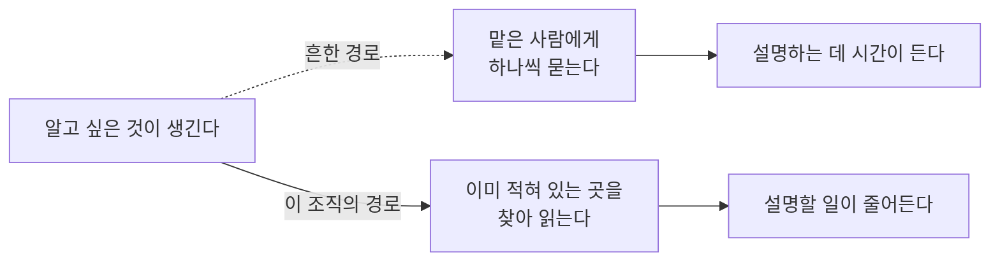
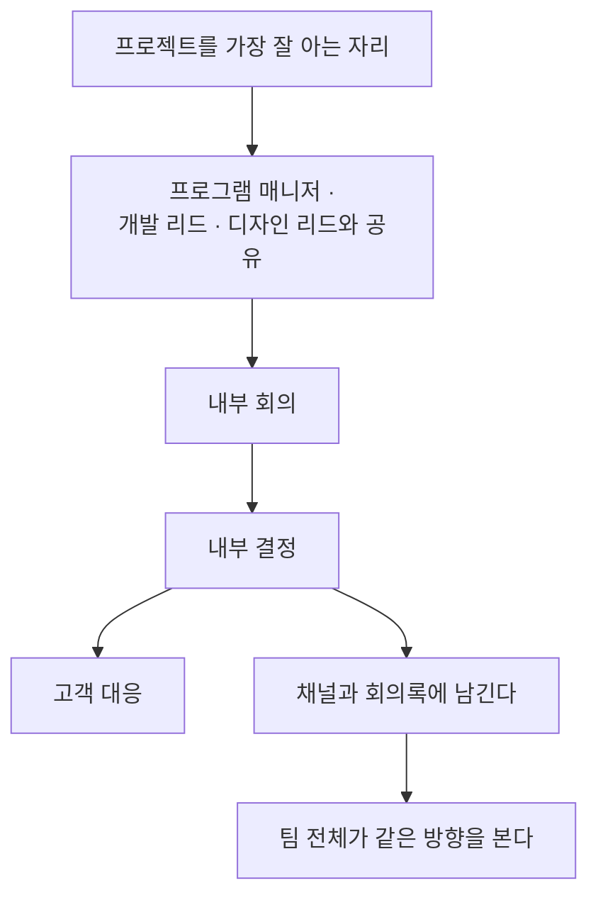
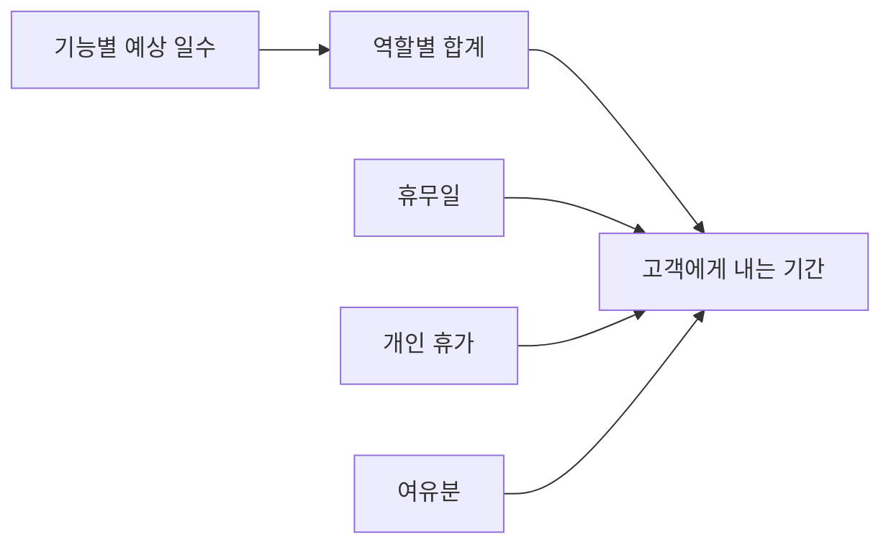

[앞 편](/blog/product-management/global-collaboration-process/)은 국경을 넘는 조직이 사람을 들이고 역할을 나누고 프로젝트를 시작하기까지를 봤다. 넷 모두 뒤에서 치를 비용을 앞으로 옮겨 놓았고 그 대가로 시작 시점이 늦어졌다.

**이 편은 그렇게 시작된 프로젝트가 굴러가는 동안을 본다.** 절차가 끝나면 남는 것은 매주 반복되는 일이다 — 상태를 알리고 결정을 내리고 문제가 생기면 대응한다. 여기서도 이름이 같은 활동들이 다르게 굴러간다.

이 편이 답할 질문은 하나다. **미리 꺼내 놓는 일이 왜 소통을 줄이는가.** 보고와 회의와 문서를 늘리면 소통이 늘어난다고 보는 것이 상식인데, 이 조직들은 반대 방향으로 같은 목적을 이룬다.

⚠️ **두 경로의 총량이 같지 않은 것이 이 편의 전제다.** 아래쪽은 적어 두는 비용을 한 번 치르고 읽는 비용을 나눠 갖는데, 묻는 사람이 늘수록 격차가 벌어진다. 다만 적어 두는 쪽에 붙는 조건이 이 편의 절반을 차지한다.

## 보고를 없애지 않고 방향만 바꾼다

주마다 상태를 알리는 일 자체는 그대로 있다. 바뀐 것은 그것이 무엇을 향하느냐다.

| 항목 | 흔한 주간 보고 | 여기서의 주간 공유 |
| --- | --- | --- |
| 형식 | 발표 자료 | 관리 도구 위의 **한 줄짜리 문장** |
| 담기는 칸 | 이번 주 한 일과 다음 주 할 일 | 전체 현황과 일정과 범위와 예산과 고객, **다섯 항목** |
| 문제를 적는 방식 | 본문에 섞어 서술한다 | 해당 영역을 **색으로 드러내고** 한 문장으로 적는다 |
| 문장의 방향 | 결정해 달라는 요청 | **이렇게 접근해 처리하고 있다**는 공유 |
| 만드는 데 드는 시간 | 보기 좋게 다듬는 데 상당 부분이 간다 | 문장을 고르는 데만 든다 |

**이 표가 말하는 것**: 앞의 세 줄이 꾸미고 고르고 찾는 시간을 걷어내는 장치라면, **넷째 줄만 성격이 다르고 책임의 위치를 정한다.** 결정해 달라는 요청으로 적으면 상태를 알리는 문서가 결재를 기다리는 문서가 되어 답이 올 때까지 일이 멈추고, 처리하고 있다고 적으면 문서는 상태만 나르고 일은 계속 간다.

이 블로그 안에 같은 전환을 한 번의 승인 자리에서 다룬 편이 있다. [전술과 목표 설정](/blog/product-management/tactics-and-goal-setting/)이 발표 자료를 걷어내고 서술형 문서를 먼저 읽는 형식을 짚으면서, 발표자가 채워 주는 낱말과 스스로 서야 하는 문장의 차이를 그 형식의 핵심으로 봤다. **그쪽은 한 번의 판정 자리에서 형식을 바꾸고, 이 편은 매주 반복되는 자리에서 같은 것을 한다.** 반복되는 쪽에서는 절약이 누적되는 대신 형식이 굳어 내용까지 굳을 위험이 함께 생긴다.

## 가장 잘 아는 사람이 혼자 정하면 안 되는 이유

프로젝트를 인도하는 자리가 그 프로젝트를 가장 잘 아는데도, 혼자 정한 뒤 알리는 것이 금지된다.

⚠️ **도식에서 고객이 맨 끝에 있는 것이 순서의 핵심이다.** 안에서 결론이 서기 전에 밖으로 나가면 되돌릴 때 두 번 설명해야 하고, 그 두 번째 설명이 조직이 정리되지 않았다는 인상을 남긴다.

혼자 정하지 않는다는 원칙이 결정을 미룬다는 뜻은 아니다. 미루지 않기 위해 필요한 것이 함께 정해져 있다.

| 갖춰야 할 것 | 무엇을 하는가 |
| --- | --- |
| 판단에 필요한 자료 | 한 장 현황 문서와 회의록과 대화 채널을 **링크 묶음으로** 건넨다. 발표 자료가 아니라 문장이라 왜곡이 적다 |
| 결정의 기록 | 내린 결정을 채널과 회의록에 남겨 나중에 온 사람도 같은 결론에 닿게 한다 |
| 바깥 문제의 담당 | 계약 중단과 예산 초과와 범위 변경은 **프로그램 매니저 쪽 몫**이며, 그동안에도 프로젝트 인도는 계속된다 |

**이 표가 말하는 것**: 셋이 각각 결정 전과 결정 후와 결정을 다른 자리로 보내는 규칙을 맡는다. **한 명의 결정권자라는 말은 권한이 작다는 뜻이 아니라 결정의 앞뒤가 다른 사람에게 열려 있다는 뜻이다.** 셋째 줄에서는 앞 편이 나눠 둔 경계가 값을 한다 — 계약 문제를 맡을 자리가 미리 정해져 있지 않으면 프로젝트를 가장 잘 아는 사람이 그 일까지 끌어안고, 그 순간 진행 관리가 멈춘다.

## 묻지 않아도 되게 만들고, 틀린 계획이라도 먼저 내놓는다

소통 원칙의 앞 둘은 짝을 이룬다. 하나는 물음을 줄이고 하나는 물음이 왔을 때 답이 준비돼 있게 한다.

**첫째, 바뀌지 않는 링크 하나에 전부를 모은다.** 현황과 문제와 대응 방안이 그 문서 하나에 정리돼 있어, 안팎의 누구든 담당자를 붙잡고 하나씩 묻지 않고도 전반을 이해할 수 있어야 한다. 원본은 이것을 한 문장으로 요약했다.

> 불필요한 소통을 하지 않는 것이 소통을 잘하는 방법이다.

다만 모든 것을 문서로 대신하면 안 된다는 단서가 붙는다. 문서가 아끼는 것은 **같은 설명을 되풀이하는 시간**뿐이며, 중요한 자리는 마주 앉아 이야기하되 목표와 필요한 자료를 미리 전부 보내 **논의부터 시작한다.** 문서가 하는 일은 회의를 없애는 것이 아니라 회의의 앞부분을 없애는 것이다.

**둘째, 대응 방안을 항상 준비해 둔다.** 하면 안 된다는 말이 아니라 이 상황에서는 이 방법이 지금으로선 최선이라는 말로 내는데, 그렇게 내놓는 이유가 옳기 때문이 아니라는 점이 중요하다.

⚠️ **틀린 대응 방안이라도 드러나 있어야 다른 사람이 그 자리에서 고칠 수 있다.** 없으면 고칠 대상 자체가 없어 누군가 처음부터 만들어야 하고, 고치는 비용이 만드는 비용이 된다. 관찰자가 아니라 주도자라는 말의 실질이 여기다 — 자기 견해와 계획을 **먼저 내고 의견을 부른다.**

원본이 가장 큰 잘못으로 지목한 것도 이 자리다. **대응 방안 없이 결정을 남에게 미루거나 시간이 해결해 주기를 기다리는 것**인데, 둘은 겉으로 달라 보여도 문제가 아무 방향 없이 놓여 있게 된다는 결과가 같다.

## 무반응은 참석하지 않은 것과 같다

회의 자리의 태도에는 해야 할 것과 조심할 것이 함께 적혀 있다.

| 해야 할 것 | 조심할 것 |
| --- | --- |
| 찬성이든 반대든 **의견과 그 근거를 말한다.** 아무 말도 하지 않으면 그 자리에 없었던 것과 같이 취급된다 | 공식적인 자리에서 **특정 개인의 의견을 정면으로 받아치거나 감정을 드러내는 일**은 개인을 앞에 두는 문화에서 뜻보다 크게 받아들여진다 |
| 상급자를 상대로도 명확한 의견과 논리적 근거를 낸다. **조건 없는 동의는 위험을 다루는 능력이 없다고 읽힌다** | 일에서는 논리와 객관을 쓰되, 일 밖에서는 **사람 대 사람의 관계**를 따로 쌓는다 |

**이 표가 말하는 것**: 두 열이 반대 방향이 아니라 같은 것의 앞뒤다. 왼쪽은 **내용에 대해** 물러서지 말라는 것이고 오른쪽은 **사람에 대해** 앞서지 말라는 것인데, 둘을 섞으면 사람을 배려하느라 내용에서 물러서거나 내용을 밀어붙이느라 사람을 밟는다. 앞 편이 문화 적합성을 최솟값으로 판정한다고 한 자리가 여기와 이어진다 — 들어올 때 주장하고 설득할 수 있는지를 보았다면, 여기서는 그 능력을 **어느 선까지 쓰는지**를 본다.

## 열흘 안에 정확히만 하면 남은 기간이 편해진다

주거 공간 하나를 디지털로 재현하고 앱에서 주요 가전과 조명을 다루게 하는 정도의 과제에, 요구사항을 분석하고 계획을 세우는 데만 **근무일 열흘**을 쓴다.

| 시점 | 하는 일 |
| --- | --- |
| **1일까지** | 요구사항을 **내부에서 먼저 검토한다.** 이해한 것과 이해하지 못한 것을 모두 목록으로 만들어 개발과 디자인과 품질이 각자 일을 산정할 기준을 잡아 주고, 전용 대화 채널을 연다 |
| **2일까지** | 기능마다 걸리는 점과 물을 것을 모아 **고객에게 한꺼번에 묻는다.** 전반과 디자인과 개발과 품질로 나눠, 항목의 종류부터 지원 범위와 최대 동시 접속까지 각 직군이 필요한 것을 함께 올린다 |
| **3일까지** | 예상 결과물의 형태를 공유한다. 1차 목록을 만들면 **기능별 담당자가 예상 일수와 추가·수정·삭제를 직접 채운다.** 한 기능이 닷새를 넘지 못하며 **확신이 낮으면 고객에게 물어 높인다** |
| **5일까지** | **고객과 1차로 논의한다.** 미리 역할별 업무 비중을 점검하고 휴무와 휴가와 여유분을 반영해 기간을 낸다. 디자인 확정 뒤 큰 변경 없음처럼 **고객이 지켜야 할 것도 함께 적는다** |
| **7일까지** | **초안을 낸 뒤 2차로 논의한다.** 잘하지 못하는 부분은 밖과 협력하거나 범위에서 빼고 예산에 맞춰 줄이며, 반영하지 못한 요청은 **이유를 설명한다** |
| **10일까지** | 최종 제안을 낸다 |

**이 표가 말하는 것**: 여섯 시점 가운데 고객이 나오는 자리가 셋이고 나머지 셋은 전부 **묻기 위한 준비**다. 첫날의 내부 검토는 무엇을 모르는지 목록을 만드는 일이고, 사흘째의 일수 채우기는 확신이 낮은 자리를 찾는 일이다. 묻는 것은 쉽지만 **무엇을 물어야 하는지 아는 것이 어렵다**는 전제가 이 배치에 깔려 있다.

셋째 줄의 두 규칙이 그 전제를 강제한다. 닷새를 넘지 못하게 하면 큰 덩어리 안에 숨어 있던 모르는 것이 쪼개는 동안 드러나고, 확신이 낮으면 물어 높이라는 규칙은 **모르는 채로 숫자를 적는 길을 막는다.**

기간을 내는 방식도 같은 성격이다.

⚠️ **여유분이 합계 안에 섞이지 않고 따로 붙는 것이 이 도식의 내용이다.** 셋을 합계에 녹여 하나의 숫자로 내면 기간이 밀렸을 때 무엇이 잘못됐는지 가릴 수 없다.

원본이 남긴 태도 한 줄이 이 절을 요약한다.

> 무엇이든 할 수 있다는 무모함이 아니라, 지금 조건에서 가장 나은 결과가 나올 제안이라는 현실적인 주장이다.

열흘을 쓰는 이유도 함께 적혀 있다. 분석과 계획이 정확하기만 하면 **정작 프로젝트 기간에는 예측하지 못한 문제만 다루면 된다.** 앞 편이 시작을 늦춰 뒤를 빠르게 한다고 한 것을 두 주 단위로 실행한 것이다.

## 세 사례가 모두 같은 것으로 대응한다

프로젝트 중에 나온 어려운 요구 셋과 그 처리다.

| 상황 | 어떻게 다뤘나 |
| --- | --- |
| **범위가 두 배로 늘어난 변경 요청** | 고객은 이미 만든 것을 겹쳐 쓰면 쉽게 덮인다고 봤다. 변경 뒤의 결과물을 먼저 공유하고 **지금까지 한 작업 가운데 값이 사라지는 부분을 계산해 보였다.** 늘어나는 관리 부담으로 프로젝트의 값이 떨어지므로 기존 방향 유지나 예산 추가로 협의했다 |
| **계약에 없던 근무 조건 요구** | 공유 주기 단축과 고객사 상주에 더해 **작업 장비를 확인하겠다**는 요구가 함께 왔다. 협의되지 않은 사항은 리드들과 상의해 일부만 받아들이고, 보안 서약이 있는데도 개인의 사적 영역을 침해한다고 판단한 요구는 **받아들이지 않았다** |
| **사람이 바뀌는 상황** | 이직이나 강한 부담으로 변경 요청이 나왔다. 업무가 관리 도구에 정리돼 있어 인수인계가 가능했고 그 **시간까지 수로 넣어** 계획에 반영했다. 프로젝트에 미치는 영향은 주 단위 기록과 함께 그대로 공유하고 본인의 뜻을 최대한 반영했다 |

**이 표가 말하는 것**: 셋 다 대응의 형태는 다른데 근거의 성격이 같다. 사라지는 값과 늘어나는 부담과 인수인계에 드는 시간은 모두 **수로 바꾼 것**이고, 수로 바꿀 수 없는 하나인 개인의 사적 영역에서만 협의가 아니라 거절이 나왔다. **정량화가 협의의 언어이고, 정량화되지 않는 자리가 선이 그어지는 자리다.**

첫째 줄의 계산 방식이 특히 그렇다. 늘어나는 일을 세는 대신 **이미 한 일 가운데 무의미해지는 몫을 세는데**, 앞의 것은 우리가 더 받아야 할 이유가 되고 뒤의 것은 고객이 이미 치른 값이 사라진다는 이야기가 된다. 같은 변경을 두고 **누구의 손실을 세는지**가 다르다. 셋 모두 반응할 자리가 없어서 계산을 내민 것이 아니라 **반응 대신 계산을 내놓을 수 있게 자료가 준비돼 있었고**, 앞 편의 진행 관리가 전부 도구 위에 있다는 사실이 여기서 값을 한다.

## 도구를 잘 쓰는가가 아니라 무엇을 수로 바꾸는가

살아남기 위한 첫째 조건은 도구를 다루는 능력인데 보는 각도가 다르다.

> 얼마나 능숙하게 쓰는가가 아니라, 도구로 현황을 수로 바꿔 문제를 객관화하고 풀어 프로젝트를 성공시키는가를 본다.

수로 바꾸는 대상이 여섯 갈래로 정해져 있다.

| 대상 | 무엇을 수로 바꾸나 |
| --- | --- |
| 전체 일정 | 시작과 끝과 그 사이의 배치 |
| 요구사항 | 분석과 검토가 어디까지 진행됐는지 |
| 개발 진척 | 반복 주기와 주기 계획과 내부 시연과 회고 |
| **문제와 위험** | **점수로 매겨 처리 순서를 정한다** |
| 예산과 인력 | 계획 대비 실제 투입을 따라가고 자동으로 그림이 나오게 한다 |
| 협업 요청 | 받을 사람을 분명히 지정한다 |

**이 표가 말하는 것**: 여섯 가운데 넷은 상태를 세는 일이고 넷째 줄만 세는 데서 그치지 않고 **순서를 만든다** — 위험을 점수로 바꾸는 목적은 크기를 아는 것이 아니라 무엇을 먼저 처리할지 정하는 것이다. 마지막 줄은 수로 바꾸는 일이 아니라 **일이 흘러갈 곳을 비우지 않는** 일이라 성격이 또 다르다.

조직마다 쓰는 도구는 달라도 들이는 목적은 같다 — **객관화와 효율로 생산성을 올리는 것이다.** 그래서 주어진 도구를 적극적으로 쓰되 맞지 않으면 **새 방법을 제안하는 쪽**이 기대된다. 잘 쓰는 사람과 바꾸자고 말하는 사람이 다른 사람이 아니라는 뜻이다.

## 겸손이 정보 전달 실패가 되는 자리

둘째 조건은 태도이며, 원본은 이것을 자신감이라 부르며 다섯으로 나눴다.

| 갈래 | 무엇을 말하나 |
| --- | --- |
| 드러내기 | 묵묵히 자기 일만 하는 방식이 인정받는 환경도 있지만 여기서는 **성과를 드러내고 팀과 부딪히기도 하면서** 개인과 팀 양쪽의 성공에 기여한다 |
| 언어 | **선택 사항이다.** 어차피 모국어가 아니므로 망설이기보다 **맥락을 중심에 놓고** 주고받고, 회의에서는 자막을 따라가는 대신 회의 자체에 붙는다 |
| 적극성 | 모든 문제에 의견과 근거와 실행 방안을 낸다. 정해진 답을 찾는 자리가 아니라 함께 방법을 만드는 자리이므로 **어긋난 의견에도 팀이 얻을 것이 있다** |
| 성실함 | 어디서든 인정받는다. 다만 늦게까지 일하는 상황이라면 **그 사정을 분명히 알려야** 노력이 읽힌다 |
| 자기 바꾸기 | 문화와 언어와 시간대와 일하는 방식의 차이로 힘든 순간이 반드시 오는데, 기존 방식으로 감당되지 않으므로 **취미나 생활 방식이나 환경을 스스로 바꾼다** |

**이 표가 말하는 것**: 다섯 가운데 넷이 밖으로 내보내는 일이고 마지막 하나만 안으로 향하는데, 앞의 넷은 모두 같은 실패를 막으려 한다 — **한 일이 전달되지 않는 것**이다. 넷째 줄이 그 성격을 가장 잘 보인다. 늦게까지 일하는 사실 자체는 아무 신호도 아니고, 피할 수 없는 상황이라는 설명이 붙어야 신호가 된다.

⚠️ **오래 일한 사람일수록 이 자리가 어렵다.** 성과를 드러내지 않는 것이 미덕인 환경에서 익힌 방식이 여기서는 겸손이 아니라 **정보 전달 실패**로 읽힌다. 성실함이 어디서든 통한다는 대목도 위안이면서 경고다 — 성실함은 **기본값**이지 남과 다른 점이 아니다.

둘째 줄과 셋째 줄은 서로를 받친다. 언어가 선택 사항이라는 말은 완벽하지 않아도 된다는 뜻이 아니라, 말의 정확함보다 **의견을 냈는지**가 먼저 판정된다는 뜻이다.

> 들어간 지 사흘 안에 나를 알리고 석 달 안에 능력을 인정받아야 한다.

기간을 이렇게 짧게 잡은 것은 압박으로 읽히지만 앞 편의 채용 절차와 함께 놓으면 다르게 보인다. **넉 달을 들여 확인하고 뽑은 조직은 뽑은 뒤에도 같은 속도로 판단한다.**

## 이 편이 쓴 용어

이 편이 넘겨받은 낱말은 셋이고, [지도편](/blog/product-management/pm-practice-map/)이 붙여 둔 뜻은 여덟 편 어디서나 통한다. 아래에 적는 것은 **주고받는 자리에서 그 말이 실제로 하는 일**이다.

| 용어 | 이 편에서 놓인 자리 |
| --- | --- |
| 한 장 현황 문서 (One Pager) | 현황과 문제와 대응을 한곳에 모은 문서. 회의를 없애는 것이 아니라 **회의의 앞부분을 없애는** 도구로 쓰였다 |
| 완화 계획 (Mitigation Plan) | 문제를 어떻게 누그러뜨릴지 미리 적어 둔 대응. 옳아서 내놓는 것이 아니라 **틀렸을 때 고쳐지도록** 내놓는다 |
| 상위 보고 (Escalation) | 위로 올리는 일. 여기서는 올릴 것이 문제가 아니라 **문제와 고를 수 있는 대응안**이며, 그것이 없는 상태로 올리는 것이 가장 큰 잘못으로 지목됐다 |

셋 모두 **미리 적어 두는 것**이라는 공통점이 있고, 그 점에서 앞 편의 용어들과 성격이 다르다. 앞 편이 사람과 절차에 이름을 붙였다면 여기서는 **문서에 이름이 붙는다.**

## 정리

세 가지가 남는다.

**첫째, 소통을 잘한다는 말이 여기서는 말할 일을 줄인다는 뜻이다.** 다섯 항목 한 줄씩의 공유도 바뀌지 않는 링크 하나도 준비된 대응 방안도 모두 질문이 오기 전에 답을 놓아두는 장치다. **읽는 비용을 여럿이 나눠 갖는 대신 적는 비용을 한 사람이 먼저 치른다** — 이것이 이득인지는 묻는 사람이 몇인지에 달려 있다.

**둘째, 정량화가 협의의 언어이고 정량화되지 않는 자리가 선이 그어지는 자리다.** 수로 바꾸는 일이 늘 옳아서가 아니라 **그것이 감정을 빼고 말할 수 있는 유일한 형식**이기 때문이다.

**셋째, 미리 내놓는 일에는 틀릴 각오가 함께 붙는다.** 대응 방안을 먼저 내라는 요구도 의견과 근거를 반드시 말하라는 요구도 **완성된 것을 내라는 말이 아니다.** 드러나 있어야 고쳐진다는 것이 이 조직들이 속도를 얻는 방식이고, 그 대가로 틀린 것도 함께 드러난다.

**여덟 편이 여기서 끝난다.** [지도편](/blog/product-management/pm-practice-map/)이 네 갈래의 지형을 그린 뒤로 [편2](/blog/product-management/product-cycle-and-metric-hierarchy/)가 무엇을 위에 둘지 정했고, [편3](/blog/product-management/why-data-and-metric-dictionary/)과 [편4](/blog/product-management/data-driven-project-walkthrough/)가 그 값을 세어 판단까지 갔다. [편5](/blog/product-management/team-building-and-agile-org/)와 [편6](/blog/product-management/roles-and-organizational-culture/)이 그 일을 맡는 묶음과 이름을 다뤘고, [편7](/blog/product-management/global-collaboration-process/)이 국경 너머에서 일이 시작되기까지를 봤다. **혼자 세울 수 있는 근거에서 출발해 여럿이 있어야 성립하는 것으로 넓혀 왔는데, 마지막 자리에 남은 것이 결국 말을 주고받는 방식이었다.**
