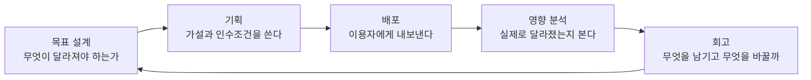
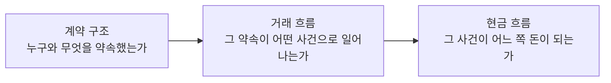

[앞 편](/blog/product-management/tactics-and-goal-setting/)은 무엇을 재기로 정하느냐가 목표를 목표로 만든다는 데까지 왔다. 목표가 섰으면 다음은 만드는 일이다.

그런데 만드는 일의 첫 문장은 언제나 추측이다. **「이렇게 바꾸면 이렇게 될 것이다」가 사실이 되는 시점은 내보낸 뒤다.** 이 편은 그 추측이 산출물이 되고 배포와 회고로 돌아오는 한 바퀴를 따라가고, 마지막에는 바퀴 자체를 손보는 일까지 간다.

## 믿음과 가설을 가르는 것은 검증 가능성이다

둘은 같은 문장처럼 들리지만 성질이 다르다. **가정**은 겉으로 드러나지 않은 믿음이다 — 「가입이 안 되는 것은 그 단계 때문일 것이다」에는 무엇을 바꿀지도, 무엇이 달라지면 맞은 것인지도 없다. **가설**은 바꿀 행동과 예상되는 변화 폭이 함께 든 문장이다 — 「문구를 이렇게 고치면 전환이 10% 오를 것이다」에는 검증이 이미 설계돼 있다.

**차이를 만드는 것은 확신의 세기가 아니라 반증할 방법의 유무다.** 앞쪽은 틀렸음을 보여 줄 방법이 없어 목소리 큰 쪽이 이기고, 뒤쪽은 숫자가 결론을 낸다.

여기서 자주 어긋나는 자리가 있다. **목표와 기회영역을 충분히 살피기 전에 가설부터 쓰는 것이다.** 같은 문제 위에 두 경우를 올려 보면 무엇이 갈리는지가 드러난다.

| | 어긋난 쪽 | 바로잡은 쪽 |
| --- | --- | --- |
| 문제 정의 | 오프라인 가맹점 매출이 온라인의 절반에 못 미친다 | 같다 |
| 가설 | 결제 기능만 붙이면 매출이 따라올 것이다 | 정보를 얻기 어렵다는 문제를 짚고, 조회율을 30% 끌어올려 그것이 매출로 이어지는지 본다 |
| 무엇이 잘못됐나 | 매출을 결제와 같은 말로 놓아 해결책이 기능으로 먼저 정해졌다 | 노출·검색·알림·대면 영업을 열어 두고 네 안을 견준다 |

왼쪽 칸의 문장도 그 자체로는 검증 가능하다. 문제는 **후보가 하나뿐이라는 데 있다.** 기능이 먼저 정해지면 그것을 넣을지 말지만 남고, 더 싼 방법이 있었는지는 영영 묻지 않게 된다.

오른쪽에서는 지표가 두 층으로 나뉜다. 조회율은 손을 대면 먼저 움직이는 값이고 매출은 뒤따라오는 값이다. **앞의 값을 움직여 뒤의 값이 따라오는지를 보는 것이 검증이고, 뒤의 값만 보면 무엇 때문에 움직였는지 끝내 알 수 없다.**

여기서 이 편의 전제가 나온다. **내보내기 전까지 반응은 아무도 모르므로, 우리가 쓴 명세는 결정이 아니라 가설이다.** 이것을 받아들이면 잘 만드는 능력보다 빨리 확인하고 안전하게 되돌리는 구조가 중요해진다.

## 비교 실험이 답하는 것과 답하지 않는 것

두 개 이상의 안을 동시에 내보내 이용자의 선택으로 우열을 가리는 방법이 있다. 같은 기간에 같은 조건으로 재므로 계절이나 마케팅 같은 바깥 요인을 걷어낼 수 있다.

| 이 방법이 답한다 | 이 방법이 답하지 않는다 |
| --- | --- |
| 어느 쪽이 더 많이 선택되는가 | **왜 그쪽을 선택했는가** |
| 바깥 요인을 뺐을 때도 차이가 남는가 | 지금 후보 밖에 더 나은 안이 있었는가 |

오른쪽 칸은 이용자를 직접 만나는 조사로 메워야 한다. **선호도는 재지만 이유는 재지 못한다는 것이 이 방법의 경계다.**

운영에서 중요한 것은 한 번의 크기가 아니라 횟수다. 실험 문화가 자리 잡은 대형 플랫폼 기업 가운데는 주당 서른 건 안팎을 돌리는 곳도 있다. 그런 조직에서 실패한 실험은 낭비가 아니라 기록이다 — **성공한 실험은 무엇을 할지 알려 주지만, 실패한 실험은 다음 사람이 같은 곳을 파지 않게 해 준다.** 매일 1%씩 나아지면 1년 뒤에 37.78배가 되고 1%씩 나빠지면 0.03배가 되는 곱셈이 그 근거다.

다만 노린 숫자만 보면 위험하다. 그래서 **가드레일 지표**를 함께 둔다. 목표 지표가 올라도 전체 이용률처럼 지켜야 할 값이 내려갔다면 실패로 판정한다. 이것이 없으면 국소적으로 이긴 실험이 제품 전체를 갉아먹는 것을 아무도 눈치채지 못한다.

## 기능이 아니라 이야기로 적는다

요구사항을 적는 방식도 옮겨 갔다. 과제를 발의하고 예산을 잡고 발주해 기획서를 넘기던 순서에서, 한 장짜리 문서로 방향을 맞추고 이야기 단위로 쪼갠 뒤 화면 뼈대와 사용 흐름을 거쳐 개발로 가는 순서가 됐다.

| | 기능으로 적을 때 | 이야기로 적을 때 |
| --- | --- | --- |
| 문장 | 수신자 선택, 금액 입력, 송금 버튼 | 이용자는 보낼 상대를 고르고 원하는 금액을 보낼 수 있다 |
| 완료 판정 | 없다. 만들었으면 끝이다 | 목록과 검색을 주고, 열 자리 이내로 제한하고, 입력이 끝나면 버튼이 살아난다 |
| 무엇이 남는가 | 무슨 가치를 주는지 읽히지 않는다 | 어떤 상황에서 무엇이 좋아지는지와 잴 지표가 붙는다 |

가운데 줄이 **인수조건**이다. 이것이 없으면 완료 여부가 만든 사람의 판단에 맡겨지고, 있으면 화면을 보면서 항목을 하나씩 짚어 확인할 수 있다.

쓸 때 지킬 것이 넷이다. 될 수 있는 대로 작게 쪼갠다 — 「뱅킹 시스템을 쓸 수 있다」는 판정이 불가능하지만 「첫 화면에서 송금 메뉴를 고를 수 있다」는 가능하다. 화면을 보며 확인할 수 있는 단위로 끊는다. 인수조건은 상세히 적는다 — 화면을 그리고 코드를 쓰는 사람이 꺼내 쓰는 정보다. 그리고 두 주가량인 한 주기 안에 만들 수 있는 크기, 곧 **덩어리**(EPIC)로 묶는다.

크기는 한 사람이 정하지 않는다. 카드에 1·2·3·5·8·13·21과 무한대를 적어 두고 모두가 아는 이야기 하나를 3점으로 놓은 뒤, 작성자가 설명하고 참여자가 각자 카드를 낸다. 값이 갈리면 가장 높게 부른 쪽과 낮게 부른 쪽이 이유를 말하고 다시 낸다. **숫자를 맞추는 것이 아니라 왜 갈렸는지를 드러내는 것이 목적이다** — 한쪽은 알고 다른 쪽은 모르는 제약이 대개 그 차이 안에 있다.

크기가 정해진 이야기는 손을 바꿔 가며 나아간다. 제품 담당자와 현업이 이야기를 만들면, 개발자와 디자이너가 과업으로 쪼개고, 이야기를 인수한 뒤 품질 담당자가 검증 항목을 만들어 수행하고, 배포로 끝난다.

## 요구사항이 들어와 종료로 나가기까지

제품관리는 한 번에 끝나는 일이 아니라 도는 일이다. **한 바퀴마다 이용자가 얻는 것과 사업이 얻는 것이 함께 올라가야 제대로 돈 것이다.**

이 바퀴 안에서 개별 요구사항은 아래 아홉 단계를 지난다.

| # | 단계 | 이 단계가 답하는 것 |
| ---: | --- | --- |
| 1 | 접수 | 현업이 무엇을 필요로 하는가 |
| 2 | 유형 분류 | 새로 만드는 일인가, 운영 중인 것을 잇는 일인가 |
| 3 | 1차·2차 분석 | 이 요청이 실제로 푸는 문제는 무엇이고, 그 방법 말고 다른 방법은 없는가 |
| 4 | 요구사항 문서 작성 | 만들 것과 완료 기준은 무엇인가 |
| 5 | 선별 위원회 승인 | 지금 자원을 여기에 쓸 것인가 |
| 6 | 업무 지정 | 누가 맡는가 |
| 7 | 착수 | 무엇부터 시작하는가 |
| 8 | 관리 | 정해진 대로 가고 있는가 |
| 9 | 종료 | 완료 기준을 채웠는가 |

분석을 한 번이 아니라 **두 번** 하도록 못 박아 둔 것이 이 절차의 핵심이다. **한 번만 분석하면 요청을 그대로 명세로 옮기게 되고, 두 번 분석하면 요청과 해결책 사이에 다른 후보가 낄 자리가 생긴다.** 앞 절에서 기회영역을 열어 두라고 한 것이 절차로 굳은 자리다.

승인을 기다리는 목록은 사업적 영향의 크기, 최상위 과제에 속하는지 여부, 지금 고치지 않으면 안 되는 장애인지 여부로 줄을 세운다. 순서가 곧 힘의 순서는 아니다 — 마지막 것은 언제나 앞으로 끼어든다.

## 품질은 개발이 아니라 기획에서 시작한다

별도 조직 없이 품질을 올리는 방법이 셋 있다. 사람을 더 쓰는 대신 시점을 앞당기거나 대상을 갈라 놓는 방식이다.

| 방법 | 왜 듣는가 |
| --- | --- |
| 검증 항목 작성을 기획하는 자리에서 함께 한다 | 기획 의도가 항목에 그대로 남으므로, 의도한 것이 빠졌는지를 사람의 기억이 아니라 문서로 확인한다 |
| 개발이 70%·80%·90%·100% 된 시점마다 나눠 확인한다 | 마감에 몰린 한 번의 검증은 고칠 시간이 없다. 나눠 돌리면 항목을 수행하는 요령도 함께 쌓인다 |
| 회원·결제·알림·데이터 기반·구조 개선을 별도 안건으로 세운다 | 기능 과제와 같은 줄에 세우면 언제나 밀린다. 국내 한 플랫폼 기업은 이 자리에 이름을 붙여 정기 안건으로 굴린다 |

첫 줄이 가장 값이 싸고 효과가 크다. **검증 항목을 개발이 끝난 뒤에 쓰면 만들어진 것을 보고 쓰게 되므로, 만들어지지 않은 것은 항목에서도 빠진다.**

기획에서 개발로 넘어가는 산출물에도 순서가 있다. 이야기에서 이용자 여정을 그리고, 여정에서 흐름도를 뽑고, 그 위에 화면 뼈대와 디자인이 얹힌다. **앞의 것이 비어 있으면 뒤의 것은 만들어지기는 하지만 근거가 없다.**

## 배포하는 동안 제품 담당자가 하는 두 가지

기획이 끝나면 주고받을 규격과 데이터 구조를 정하는 설계가 오고, 구현과 자체 확인, 코드 검토와 충돌 정리, 저장소 반영, 품질 인수를 거쳐 배포로 나간다.

이 기간에 제품 담당자는 두 가지를 동시에 한다. **하나는 빠진 것과 고칠 것이 나올 때마다 판단하는 일이고, 하나는 배포 앞뒤로 필요한 준비를 챙기는 일이다.** 앞의 것만 하면 나가는 날 공지와 협조가 비고, 뒤의 것만 하면 나가는 것 자체가 어긋난다.

배포 기록은 두 벌로 남긴다. 밖으로 나가는 것은 이용자가 무엇이 달라졌는지 알 수 있게 쓰고, 안에 두는 것은 무엇을 했고 누구의 협조가 필요했는지를 남긴다. **읽는 사람이 다르므로 한 문서로 겸할 수 없다.**

한 바퀴의 끝은 회고다. 유지할 것, 걸림돌이 된 것, 새로 해 볼 것으로 나눠 적고 마지막에 **실행할 수 있는 항목**으로 바꾼다. 여기서 멈추면 회고는 감상으로 끝난다 — 담당자와 기한이 붙지 않은 항목은 다음 회고에서 같은 문장으로 다시 나온다.

## 보이지 않는 업무를 보이게 만드는 일

지금까지가 한 바퀴를 도는 방법이라면, 바퀴 자체가 헛돌 때 손대는 일이 따로 있다. 업무 절차와 조직과 시스템에서 불필요한 것을 걷어내고 다시 짜서 기업 가치를 끌어올리는 활동이다.

**이 일의 첫 과제는 개선이 아니라 가시성이다.** 관리가 되지 않는다는 호소를 뜯어보면 대개 업무가 눈에 보이지 않는 상태다. 보이지 않는 것은 고칠 수도, 고쳤는지 확인할 수도 없다.

| 빠지기 쉬운 자리 | 왜 어긋나나 |
| --- | --- |
| 도구부터 들인다 | 순서가 뒤집혔다. 업무 방식을 새로 정하고 그 효율을 위해 도구를 고른다 |
| 부서별 요청을 그대로 모은다 | 각 부서는 자기 업무를 중심에 놓고 요청한다. 이끄는 사람이 연결점을 다시 해석해야 한다 |
| 권한 없이 시작한다 | 전사의 프로젝트다. 최상위 경영진의 후원이 없으면 부서 경계에서 멈춘다 |

실제 사례 하나가 이 셋을 한꺼번에 보여 준다. 계약이 끝나고 서비스가 열리기까지 평균 60일이 걸리는데, 진행 상황은 190개가 넘는 표 파일에 흩어져 **어느 단계에서 막히는지를 아무도 답하지 못하는 상태**였다.

여기서 한 일은 도구 도입이 아니었다. 부서 사이의 협조 체계를 다시 설계하고 관리자가 실제로 필요로 하는 것을 확인한 뒤, 결정이 필요한 질문 일곱 개를 정리했다. 검수를 별도 단계로 뗄 것인가, 반려는 어떤 절차로 돌릴 것인가, 작업을 밀어 줄 것인가 가져가게 할 것인가 같은 것들이다. **답이 나온 뒤에야 시스템을 만들었고, 성공 기준은 평균 5일 이내로 세웠다.**

## 로드맵은 법령이 아니라 조감도다

여러 바퀴를 한 화면에 놓는 것이 로드맵이며, 목표와 중간 지점, 결과물, 자원, 일정 다섯으로 이루어진다. 세 가지를 지키지 않으면 곧 아무도 보지 않는 문서가 된다.

| 지킬 것 | 어기면 |
| --- | --- |
| 갱신할 수 있어야 한다 | 확정한 것을 바꾸지 못하면 현실과 어긋난 채로 남고, 어긋난 문서는 읽히지 않는다 |
| 세부에 빠지지 않아야 한다 | 위에서 내려다보는 그림이라야 우선순위가 보인다. 실행 계획을 옮기면 축소된 일정표가 될 뿐이다 |
| 중장기 기술 과제를 함께 담아야 한다 | 사업 영향이 큰 과제만 담으면 회원·데이터·고객관리·디자인 같은 공통 기반은 자리를 얻지 못한다 |

마지막 줄은 품질을 다룰 때 나온 「별도 안건으로 세운다」와 같은 자리다. **공통 기반 과제는 별도 안건으로 세워야 살아남는다** — 기능 과제와 한 줄에 놓으면 언제나 다음 분기로 밀린다.

## 화면이 아니라 흐름을 설계하는 자리

지금까지의 이야기는 이용자가 쓰는 화면이 있다는 것을 전제로 했다. 그렇지 않은 도메인이 있다.

거래의 흐름이 곧 돈의 흐름과 맞물리는 곳 — 주문과 결제, 정산과 배송, 장비에서 올라오는 신호를 다루는 영역 — 에서는 화면보다 데이터가 흐르는 구조를 먼저 설계한다. 화면만으로 개발 요건이 잡히지 않을 때, 관련 조직이 많을 때, 도메인 사이의 의존이 깊을 때, 거래 조건이 외부 계약에 매여 있을 때가 그렇다.

설계는 세 층을 순서대로 내려간다. 뒤집으면 정산 단계에서 근거를 찾지 못한다.

호출 순서를 시간축으로 그리면 기업별·도메인별·이해관계자별로 업무 범위가 어디서 갈리는지가 한 장에 드러난다.

내부 운영자가 쓰는 화면도 성격이 다르다. **관리자 화면을 설계하는 일은 화면이 아니라 업무를 설계하는 일이다.** 권한을 신청하고, 승인받고, 영업 정보와 이미지·메뉴·권역을 등록하고, 검수하고, 시험 주문을 넣어 본 뒤 실제로 여는 순서를 먼저 그린다. 화면은 그 흐름 위에서 나온다.

**업무를 수행하는 순서가 곧 데이터가 쌓이는 순서다.** 신청 중·보류·거절·등록 완료·사용 같은 단계별 상태와, 각 단계에서 확정되는 열쇠 값 — 사업자 번호나 계약 번호 같은 것 — 을 흐름과 함께 설계한다.

이 설계가 회계의 기준까지 정한다. 가맹 형태의 기업 고객이라면 정산은 브랜드 단위로 끊기는데 매출과 회계는 본사의 사업자 번호 단위로 잡히는 식이다. **데이터 구조를 잘못 잡으면 나중에 화면을 아무리 고쳐도 숫자가 맞지 않는다.**

## 이 편이 쓴 용어

[지도편](/blog/product-management/product-management-map/)이 이 편으로 배정해 둔 셋에, 원본이 따로 이름을 붙인 하나를 더했다.

| 용어 | 원어 | 이 편에서의 뜻 |
| --- | --- | --- |
| 선행지표와 후행지표 | Input / Output Metric | 손을 대면 먼저 움직이는 값과 그 뒤를 따라오는 값 |
| 이야기(스토리)와 인수조건 | Story / Acceptance Criteria | 이용자 가치로 쓴 요구사항과, 완료를 판정하는 기준 |
| 프로세스 혁신 | Process Innovation | 절차와 조직과 시스템에서 불필요한 것을 걷어내는 개선 활동 |
| 가드레일 지표 | — | 노린 값이 올라도 이것이 내려갔다면 실패로 판정하는 값 |

요구사항 문서는 [기획 하네스 시리즈의 해당 편](/blog/ai-product-planning/deliver-and-prd/)에서 다른 층위로 다뤄진다. 그쪽은 문서를 도구가 반복해서 만들 수 있는 **표준 형식**으로 보고, 이 편은 승인 절차의 다섯째 단계에 놓인 **산출물 하나**로 본다.

## 정리

만드는 일을 시작하는 문장은 결정이 아니라 가설이다. 인정하면 절차가 달라진다 — 확신을 키우는 대신 반증할 방법을 문장에 넣고, 후보를 좁히는 대신 기회영역을 열어 견주며, 완료를 만든 사람의 판단이 아니라 인수조건으로 판정한다.

한 바퀴는 목표에서 시작해 회고로 끝나고 다시 목표로 돌아온다. 그 안에서 품질은 개발이 끝난 뒤가 아니라 기획하는 자리에서 시작되고, 배포는 내보내는 행위가 아니라 앞뒤 준비까지 포함한 기간이다. 바퀴가 헛돌면 바퀴 자체를 손대야 하는데, 그때 첫 과제는 개선이 아니라 **보이게 만드는 것**이다.

모든 제품이 화면에서 시작하지도 않는다. 돈이 오가는 흐름을 다루는 곳에서는 계약과 거래와 현금을 순서대로 내려가고, 운영자가 쓰는 화면에서는 업무의 순서가 곧 데이터의 순서다. **다음 편부터는 이 뼈대에 도메인의 살을 붙인다.**
