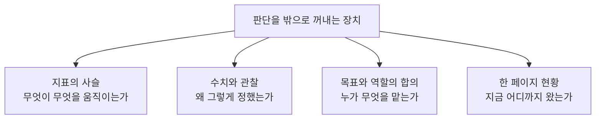

한 달째 잘 굴러가던 일이 어느 날 어긋나 있는 것으로 드러나는 경우가 있다. 되짚어 보면 어긋난 지점은 한 달 전이다. 그때 두 사람이 같은 말을 하고 각자 다른 뜻으로 알아들었고, 그 뒤로는 서로 확인할 일이 없었다.

이런 일을 소통 부족이라고 부르면 처방이 「더 자주 이야기하자」가 된다. 회의를 늘려도 같은 일이 반복되는 이유는 처방이 원인을 잘못 짚었기 때문이다. 문제는 이야기의 양이 아니라 **판단이 어디에도 적혀 있지 않았다는 것**이다. 적혀 있지 않으면 어긋난 것을 확인할 대상 자체가 없고, 확인할 대상이 없으면 시간이 지나 결과가 나온 뒤에야 드러난다.

이 시리즈가 다루는 것이 그것이다. 지표를 사슬로 그리는 일, 수치와 관찰을 근거로 남기는 일, 목표와 역할을 합의로 확정하는 일, 현황을 한 페이지로 공유하는 일은 겉보기에 서로 다른 주제지만 **전부 판단을 밖으로 꺼내 두는 장치**다. 꺼내 두면 틀렸을 때 남이 고쳐 줄 수 있고, 들고 있으면 고쳐 줄 수 없다.

네 장치가 각각 두 편씩을 가져간다. 이 글은 그 여덟 편이 놓인 자리를 표시하는 데서 멈춘다. 지표를 어떻게 쪼개는지, 잔존율을 어떤 단위로 세는지, 직책을 어떻게 나누는지를 실제로 파고드는 일은 일곱 편 각자의 몫이다. 여기서 끝내 둘 것은 넷이다. 네 갈래가 왜 한 시리즈인지, 순서를 왜 이렇게 잡았는지, 여덟 편에 걸쳐 쓰이는 낱말이 무엇인지, 그리고 어떤 물음이 몇 편에 실려 있는지.

## 이 시리즈가 「일하는 방식」이라고 부르는 것

이 블로그의 [프로덕트 매니지먼트 시리즈](/blog/product-management/product-management-map/)는 제품의 구조를 갈랐다. 무엇을 제품이라 부르는지, 도메인을 어떤 축으로 나누는지, 커머스와 핀테크에서 데이터와 제도가 무엇을 먼저 정하는지를 다뤘다. 그 시리즈가 답한 물음은 **무엇을 만드는가**였다.

이 시리즈는 그 물음을 건드리지 않는다. 만들 것이 이미 정해졌다고 치고, **그것을 어떻게 굴리는가**를 본다. 같은 제품을 두 조직이 만들어도 결과가 갈리는 자리들이 여기 모여 있다.

| 물음 | 다루는 시리즈 |
| --- | --- |
| 무엇을 제품이라 부르고, 도메인은 어떻게 갈리는가 | [프로덕트 매니지먼트 — 도메인](/blog/product-management/product-management-map/) 여덟 편 |
| 만들 것이 정해진 다음, 무엇을 재고 누구와 어떻게 굴리는가 | **이 시리즈** 여덟 편 |

두 시리즈는 같은 분류 아래 있지만 층이 다르다. **도메인 지식은 회사를 옮기면 상당 부분 다시 배워야 하고, 일하는 방식은 대체로 따라간다.** 이 시리즈를 따로 세운 이유가 그것이다.

## 네 갈래의 지형

원 자료는 네 갈래를 각각 다른 자리에서 다뤘다. 갈래마다 중심에 놓인 물음이 다르다.

| 갈래 | 중심 물음 | 여기서 나오는 것 | 편 |
| --- | --- | --- | :---: |
| 지표와 순환 | 무엇을 보고 잘 되고 있다고 말할 것인가 | 제품 개발의 네 단계, 지표의 계층 구조, 역량의 세 영역 | 2 |
| 데이터 | 그 수치를 어떻게 세고 무엇으로 뒷받침할 것인가 | 정량과 정성의 분업, 퍼널 지표의 정의, 사례 한 바퀴 | 3 · 4 |
| 팀 | 누구와 나눠 맡고 무엇을 합의해 둘 것인가 | 팀의 정의, 애자일 조직, 직무와 직급과 직책 | 5 · 6 |
| 협업 | 떨어져 있는 사람들과 어떻게 주고받을 것인가 | 역할 분담 모델, 게이트 방식의 검토, 한 페이지 현황 공유 | 7 · 8 |

**네 갈래는 서로를 전제한다.** 지표를 정하지 않으면 어떤 데이터를 모을지 정해지지 않고, 데이터가 없으면 팀 안에서 우선순위를 두고 다툴 근거가 없으며, 팀 안의 합의가 없으면 밖에 내보낼 현황도 만들어지지 않는다. 그래서 이 시리즈는 갈래마다 독립된 묶음이 아니라 한 줄로 이어지는 여덟 편이다.

## 순서를 이렇게 잡은 이유

일곱 편의 순서는 **혼자 하는 일에서 여럿이 하는 일로 넓어지는 방향**이다.

지표의 사슬을 그리는 일은 혼자서도 시작할 수 있다. 데이터를 모으는 일부터는 남의 손이 필요하고, 팀을 다루는 일은 정의상 여럿의 문제이며, 떨어져 있는 조직과 주고받는 일이 가장 넓다. **뒤로 갈수록 내 뜻대로 되지 않는 것이 늘어난다.**

순서를 뒤집으면 곤란한 이유가 여기 있다. 협업 방식부터 익히고 지표를 나중에 배우면, 무엇을 공유해야 하는지 모르는 채로 공유하는 형식만 갖추게 된다. **주간 공유 문서에 무엇을 적을지는 지표가 정한다.**

다만 순서가 중요도의 순위는 아니다. 이미 팀을 맡고 있다면 편5부터 열어도 무방하며, 각 편은 자기가 쓰는 용어를 그 편 안에서 다시 설명한다.

## 세 낱말을 먼저 갈라 둔다

여덟 편을 가로지르면서 뜻이 달라지는 낱말이 셋 있다. 갈라 두지 않으면 편을 옮길 때마다 앞에서 읽은 것과 어긋난다.

### 지표

세 편에 걸쳐 나오는데 층이 다르다.

| 편 | 이 편에서 지표는 | 묻는 것 |
| :---: | --- | --- |
| 2 | **위계** | 무엇을 위에 두고 무엇을 아래에 둘 것인가 |
| 3 | **정의** | 그 값을 어떤 모수로 어떻게 셀 것인가 |
| 4 | **적용** | 그것을 보고 무엇을 바꿨고 결과가 어땠는가 |

한 편에서 한 층만 다룬다. 위계를 이야기하다가 계산식으로 내려가면 **어떤 지표를 위에 둘 것인가라는 물음이 계산 문제로 바뀌어 사라진다.**

### 팀과 조직

편5·편6과 편7이 같은 낱말로 다른 것을 가리킨다. 앞의 둘은 **국내 조직**을 전제하고, 편7·편8은 **국경을 넘는 조직**을 전제한다. 특히 편6이 다루는 조직문화 비교는 국내 세 유형에 한정된 이야기이며, 그 범위는 해당 편 본문에서 다시 밝힌다.

### 역할

세 편에 나오지만 가리키는 것이 다르다.

| 편 | 무엇을 다루나 |
| :---: | --- |
| 2 | **역량** — 무엇을 할 줄 알아야 하는가 |
| 6 | **직책** — 조직도에서 어느 자리에 놓이는가 |
| 7 | **분담** — 옆자리 역할과 무엇을 나누는가 |

셋을 섞으면 직무 소개서에나 실릴 평평한 목록이 나온다. 그런 목록은 그것을 적은 사람이 있어 본 조직 밖에서는 들어맞지 않는다.

## 용어 정리

여덟 편에 걸쳐 쓰이는 낱말을 한자리에 모았다. 뒤의 편들은 이 표에서 자기 글에 필요한 행만 골라 그 자리에서 다시 풀어 쓴다. **어느 값을 기준으로 삼는지와 그 수치는 여기 적지 않았다** — 그 판정은 해당 편에서 한다.

### 지표와 셈의 어휘

| 용어 | 원어 | 뜻 | 편 |
| --- | --- | --- | :---: |
| 지표 위계 | Metric Hierarchy | 지표를 계층으로 세우고 위에서 아래로 전환율을 곱해 가며 사업 지표에 닿게 하는 구조. 회사 전체의 지표가 어떻게 물려 있는지를 보고 우선순위를 정하는 데 쓴다 | 2 |
| 핵심 경로 | Critical Path / Funnel | 고객 여정 가운데 핵심이 되는 흐름. 최종 목표에 이르는 데 필요한 데이터를 모으는 경로이기도 하다 | 2 |
| 기대효과 산정 | Impact Estimation | 어떤 변경이 어느 정도의 결과를 낼지 미리 어림하는 일 | 2 · 4 |
| 쪼개 보기 | Drill-down | 하나로 뭉쳐 있는 지표를 조건별로 갈라 어느 쪽에서 값이 움직였는지 짚는 분석 | 2 |
| 평균 판매가 | ASP | Average Selling Price. 팔린 것 하나당 평균 가격 | 2 |
| 총거래액 | GMV | Gross Merchandise Volume. 일정 기간에 오간 거래의 총액 | 2 |
| 퍼널 | AARRR | 유입·활성·유지·추천·매출 다섯 구간으로 나눠 보는 분석 틀 | 3 |
| 유입·열람·순사용자 | UA / PV / UU | 들어온 사용자 수 / 페이지가 열린 횟수 / 실제로 행동한 사용자 수 | 3 |
| 이탈률 | Bounce Rate | 다른 화면으로 넘어가지 않고 그대로 떠나는 비율 | 3 |
| 이탈률 | Churn Rate | 서비스 사용 자체를 그만두는 사용자의 비율. 위와 한국어 이름이 겹치므로 구분해 쓴다 | 3 |
| 가치를 느끼는 첫 순간 | A-ha Moment | 쓰는 사람이 이 제품이 왜 필요한지를 처음으로 실감하는 지점 | 3 |
| 사용자 구분 | Segmentation | 조건을 공유하는 사용자끼리 묶어 나누는 일. 전체 평균이 감추는 차이가 여기서 드러난다 | 3 |
| 최고 연봉자의 의견 | HIPPO | Highest Paid Person's Opinion. 근거가 아니라 직급이 결정을 지배하는 현상 | 3 |
| 우선순위 점수 | ICE Score | 임팩트·확신도·용이함을 곱해 매기는 점수 | 4 |

### 조사와 검증의 어휘

| 용어 | 원어 | 뜻 | 편 |
| --- | --- | --- | :---: |
| 문제·해결 적합도 | Problem-Solution Fit (PSF) | 구상한 것이 고객의 문제를 실제로 풀고 가치를 주는지의 적합도 | 2 |
| 역공학 | Product Teardown | 다 만들어진 제품을 거꾸로 뜯어 그 안에 숨어 있는 착상과 설계 의도를 읽어 내는 일 | 2 |
| 사용자 조사 | UXR | 사용자를 정의하고 이해한 뒤 그 이해로 서비스를 만들고, 불편과 만족의 지점을 찾아내는 전 과정 | 2 |
| 그로스 해킹 | Growth Hacking | 개발 전 과정에 마케팅 아이디어를 녹여 넣는 전략. 행동 데이터 분석으로 경험을 다듬는다 | 3 |
| 심층 면담과 표적 집단 면접 | IDI / FGI | 한 명을 깊이 파고드는 면담과, 여러 명을 모아 함께 듣는 면접 | 3 |
| 사용성 테스트 | UT | 실제로 써 보게 하고 어디서 막히는지를 관찰하는 방법 | 3 |
| 정황 조사 | Contextual Inquiry | 사용하는 상황에 직접 들어가 곁에서 관찰하는 방법 | 3 |
| 소리 내어 생각하기 | Think Aloud | 테스트 중에 참가자가 생각을 말로 내뱉게 하는 기법 | 3 |

### 팀과 조직의 어휘

| 용어 | 원어 | 뜻 | 편 |
| --- | --- | --- | :---: |
| 팀 빌딩 | Team Building | 정한 목표에 맞게 팀의 상태를 계속 다듬어 가는 일. **사람을 뽑는 것과는 다르다** | 5 |
| 애자일 조직 | — | 빠르고 유연하게 움직이며 의사결정을 줄이고 실행에 무게를 두는 조직. 기본적으로 수평이다 | 5 |
| 자기조직화 | — | 외부의 압력 없이 스스로 조직을 꾸려 나가는 것 | 5 |
| 사일로 | Silo | 부서끼리 벽을 세우고 서로 오가지 않게 되는 현상 | 5 |
| 스크럼 팀 | Scrum Team | 제품 오너·스크럼 마스터·개발팀 세 역할로 이루어진 다기능 팀. 개발자뿐 아니라 테스터·디자이너·운영까지 포함한다 | 5 |
| 직무와 직급과 직책 | — | 일의 영역과 역할 / 조직 안의 지위와 계급 / 직무를 넘어 맡는 특정한 역할과 책임 | 6 |
| 프로덕트 팀 리드 | PL (Product Team Lead) | 제품 매니저가 속한 프로덕트팀을 이끄는 사람 | 6 |
| 밍글링 | Mingling | 편안한 분위기에서 사람들과 섞여 교류하는 것 | 6 |
| 일대일 면담 | 1on1 | 리더와 구성원이 일대일로 나누는 대화 | 6 |

### 협업과 진행의 어휘

| 용어 | 원어 | 뜻 | 편 |
| --- | --- | --- | :---: |
| 프로젝트 매니저 | PM (Project Manager) | 하나의 프로젝트를 끝까지 인도하는 책임. 프로젝트의 성공에만 집중한다 | 7 |
| 프로그램 매니저 | PgM (Program Manager) | 제품 전체의 진행 계획과 방향을 잡고, 처음에 쓸 자원과 남길 이익을 정하며, 개별 프로젝트 바깥에서 생기는 문제를 맡는 역할 | 7 |
| 역할 분담 모델 | RACI | 실행·최종책임·자문·통보 네 가지로 관여 방식을 나누는 모델 | 7 |
| 문화 적합성 | Culture Fit | 지원자가 그 회사의 일하는 방식과 맞는지를 보는 관점 | 7 |
| 잔여 업무 추이 | Burndown Chart | 남은 일의 양이 줄어드는 모양을 그린 그래프. 반복 주기가 건강한지를 보는 척도다 | 7 |
| 한 장 현황 문서 | One Pager | 현황·이슈·대응 방안을 한 페이지에 담은 문서. 개별 문의를 줄이는 것이 목적이다 | 8 |
| 완화 계획 | Mitigation Plan | 이슈와 위험을 어떻게 누그러뜨릴지 미리 적어 둔 대응 계획 | 8 |
| 상위 보고 | Escalation | 그 자리에서 풀리지 않는 문제를 상위 의사결정권자에게 올리는 일 | 8 |

### 사업과 문서의 어휘

| 용어 | 원어 | 뜻 | 편 |
| --- | --- | --- | :---: |
| 요구사항 문서 | PRD (Product Requirements Document) | 무엇을 왜 만드는지와 무엇을 갖춰야 하는지를 적은 문서 | 4 |
| 타당성 조사 | Feasibility Study | 기술적으로 가능한지를 바탕에 두고 경제성과 재무를 평가해 추진 여부를 정하는 조사 | 2 |
| 컴퍼니 빌더 | Company Builder | 돈만 대는 곳이나 조언만 주는 곳과 달리 **사업의 첫 단계부터 운영에 직접 들어가는** 스타트업 스튜디오 | 2 |

앞의 두 표는 혼자서도 쓰는 어휘이고, 뒤의 세 표는 상대가 있어야 쓰이는 어휘다. **뒤로 갈수록 낱말의 뜻을 상대와 맞춰 두지 않으면 그 낱말 자체가 어긋남의 원인이 된다** — 이탈률처럼 한국어 이름이 겹치는 두 지표가 대표적이다.

## 이 시리즈가 다루지 않는 것

지도에는 경계선도 함께 그려야 한다. 밖에 두는 것이 셋이다.

**첫째, 도메인 지식은 다루지 않는다.** 상품을 어떤 단위로 쪼개는지, 어떤 법이 무엇을 막는지는 [앞 시리즈](/blog/product-management/product-management-map/)의 몫이다. 여기서 도메인이 등장하는 것은 예시를 들 때뿐이며, 그 예시가 그 도메인에서만 참인 경우에는 본문에서 그렇다고 밝힌다.

**둘째, 조직을 어떻게 설계할 것인가는 다루지 않는다.** 이 시리즈가 다루는 것은 **이미 있는 조직 안에서 어떻게 일할 것인가**다. 편6이 직무와 직급과 직책을 가르지만, 그것은 조직도를 새로 그리기 위해서가 아니라 자기가 어느 자리에 있는지 알기 위해서다.

**셋째, 도구의 사용법은 다루지 않는다.** 진행 관리 도구가 여러 번 나오지만 어느 화면에서 무엇을 누르는지는 적지 않는다. 조직마다 쓰는 도구가 다르고 **도구를 들여놓는 목적은 같기** 때문이다. 목적은 하나다 — 현황을 수치로 바꿔 문제를 객관화하는 것.

셋 가운데 첫째는 이미 다른 시리즈가 맡고 있다.

| 이 시리즈가 다루지 않는 것 | 그것을 다루는 글 |
| --- | --- |
| 무엇을 제품이라 부르는지, 커머스와 핀테크에서 데이터와 제도가 무엇을 먼저 정하는지 | [무엇을 제품이라 부르는지에서 직무가 갈린다](/blog/product-management/product-management-map/) |

🔴 **두 시리즈를 이어 읽는다면 만들 것을 정하는 쪽이 앞 시리즈이고, 정해진 것을 굴리는 쪽이 이 시리즈다.** 같은 분류 아래 있지만 층이 다르므로, 앞 시리즈에서 배운 도메인 판단을 이 시리즈의 일하는 방식으로 대체할 수는 없다.

## 일곱 편이 각각 묻는 것

일곱 편이 각자 하나씩 물음을 세운다. 시간이 없다면 아래 표만 훑어도 전체 골격은 들어온다.

| 편 | 이 편이 다투는 물음 |
| :---: | --- |
| 2 | 지표 하나가 좋아진 것을 성과라고 부를 수 있는가. 사슬 전체를 보면 다른 결론이 나오는 경우를 어떻게 알아채는가 |
| 3 | 수치는 무엇을 말해 주고 무엇을 말해 주지 않는가. 정량과 정성은 어느 자리에서 서로를 보완하는가 |
| 4 | 목표를 세우고 우선순위를 매기고 결과를 되짚는 한 바퀴에서, 각 단계는 무엇을 보고 무엇을 정하는가 |
| 5 | 팀을 최적화한다는 것은 무엇을 하는 일인가. 수평 조직이라는 형태 자체가 성과를 보장하는가 |
| 6 | 직무와 직급과 직책은 어떻게 다르며, 그 구분이 흐려진 조직에서 무엇이 어려워지는가 |
| 7 | 역할의 경계를 좁게 긋는 것이 어떻게 프로젝트를 빠르게 하는가. 검토와 추진의 순서를 왜 뒤집는가 |
| 8 | 현황을 미리 꺼내 놓는 일이 왜 커뮤니케이션을 늘리는 것이 아니라 줄이는가 |

**일곱 줄 가운데 다섯 줄이 「하나만 보면 놓치는 것」을 묻고 있다.** 지표 하나, 조직의 형태 하나, 직책의 이름 하나, 역할의 경계 하나가 각각 그 자리에서 전체를 대신하는 것처럼 보이지만 대신하지 못한다. 이 시리즈가 반복해서 내미는 처방은 하나다 — **나눠 놓고 그 나눔을 밖에서 보이게 하라.**

## 이 시리즈의 구성

일곱 편이 이 지도의 각 자리를 하나씩 맡는다.

| 편 | 다루는 것 | 이 편이 답하는 질문 |
| --- | --- | --- |
| 편2 — 제품 개발의 순환과 지표의 위계 | 개발의 네 단계, 지표 계층 구조, 역량의 세 영역, 사례 훈련법, 시장과 서비스를 고르는 틀 | 무엇을 위에 두어야 지표가 사슬이 되는가 |
| 편3 — 데이터가 필요한 이유와 지표 사전 | 데이터의 쓸모, 정량과 정성의 구분, 퍼널 지표의 정의, 정성 데이터를 모으는 다섯 방법 | 그 값을 어떤 모수로 어떻게 세는가 |
| 편4 — 데이터 드리븐 한 바퀴 | 목표 수립부터 우선순위·요구사항 문서·지표 설정·성과 분석까지 하나의 사례로 관통 | 정한 대로 굴렸을 때 무엇이 남는가 |
| 편5 — 팀의 정의와 애자일 조직 | 팀과 팀 빌딩의 정의, 좋은 팀과 나쁜 팀의 갈림, 애자일 조직 | 팀을 최적화한다는 것은 무엇을 하는 일인가 |
| 편6 — 직책과 조직문화 | 직무와 직급과 직책, 팀 빌딩에서의 역할, 국내 조직문화 세 유형의 비교 | 자기 자리를 어떻게 알아보는가 |
| 편7 — 글로벌 협업의 프로세스 | 채용 과정, 두 매니저 역할의 분담, 게이트 방식의 검토와 추진, 진행 관리 방안 | 경계를 좁게 긋는 것이 왜 빠른가 |
| 편8 — 글로벌 조직의 의사결정과 커뮤니케이션 | 주간 공유, 의사결정의 구조, 커뮤니케이션 원칙, 사례, 자리 잡기 | 미리 꺼내 놓는 일이 왜 소통을 줄이는가 |

**편2부터 편4까지가 혼자서도 세울 수 있는 근거를 다루고, 편5부터 편8까지가 여럿이 있어야 성립하는 것을 다룬다.** 앞에서부터 차례로 읽도록 썼으나, 지금 맡고 있는 일이 정해져 있다면 그 자리의 편을 먼저 열어도 된다.

## 정리

세 가지를 잡아 두면 뒤의 일곱 편이 읽힌다.

**첫째, 네 갈래는 같은 것을 다르게 묻는다.** 지표도 데이터도 팀도 협업도 결국 「내 판단이 밖에서 보이는가」를 묻고 있다. 장치가 넷인 이유는 판단이 새어 나가는 자리가 넷이기 때문이다.

**둘째, 하나만 보면 반드시 놓친다.** 지표 하나가 좋아진 것은 사슬 전체가 좋아진 것과 다르고, 조직이 수평이라는 것은 그 조직이 빠르다는 것과 다르며, 직책이 있다는 것은 그 자리의 책임이 정의되어 있다는 것과 다르다. 일곱 편이 반복해서 붙드는 것이 이 어긋남이다.

**셋째, 일하는 방식은 도메인보다 오래 간다.** 상품을 쪼개는 단위나 규제의 조문은 자리를 옮기면 다시 배워야 하지만, 무엇을 재기로 정하고 그것을 어떻게 꺼내 놓는지는 대체로 따라간다. **그래서 이 시리즈를 도메인 시리즈와 나란히 두되 따로 세웠다.**

다음 편은 제품 개발의 순환과 지표의 위계를 다룬다 — 네 단계가 왜 순환인지, 지표를 계층으로 쌓는다는 것이 무엇인지, 그리고 지표 하나만 보고 성공이라 말했을 때 무엇을 놓치게 되는지다.
