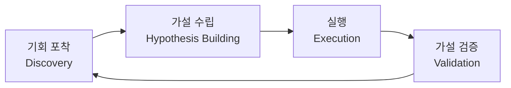
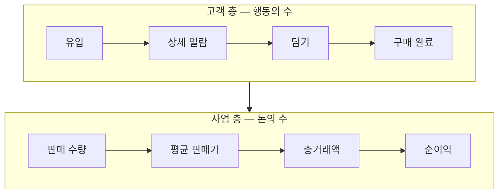
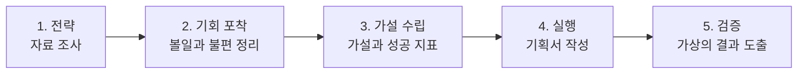

[지도편](/blog/product-management/pm-practice-map/)은 이 시리즈가 다루는 네 갈래가 전부 판단을 밖으로 꺼내 두는 장치라는 데까지 왔다. 첫 갈래는 지표다.

지표를 꺼내 놓는다는 말은 숫자를 대시보드에 띄운다는 뜻이 아니라 **무엇을 위에 두고 무엇을 아래에 둘지를 미리 정해 놓는다는 뜻이다.** 위아래가 정해져 있지 않으면 값 하나가 올랐을 때 그것이 좋은 일인지 판정할 방법이 없고, 판정할 방법이 없으면 그 값을 올린 사람의 말이 결론이 된다.

이 편은 그 위계를 세우는 자리까지 간다. 값을 어떤 모수로 어떻게 세는지는 다음 편의 몫이고, 여기서는 **어느 값이 어느 값을 움직이는가**만 다룬다.

## 처음 적어 둔 것의 절반은 살아남지 못한다

> 대규모 소프트웨어 개발 과정을 조사한 연구는 초기 제품 명세의 **30%가 개발 도중에 수정**되고, 개발이 끝난 뒤에도 **20~25%가 삭제**된다고 보고했다. (MIT, *Lean and agile software development*)

두 수치를 겹쳐 놓으면 처음 적어 둔 것의 절반 가까이가 원래 모습대로 나가지 못한다는 뜻이 된다. 이것을 계획이 부실했던 탓으로 읽으면 처방은 「더 꼼꼼히 적자」가 되는데, 여러 조직에서 비슷한 값이 반복해서 나온다면 원인은 개별 계획의 품질이 아니다.

**만들기 전에는 알 수 없는 것이 있고 그것은 내보낸 뒤에야 드러난다.** 그래서 제품을 만드는 일은 계획에서 출시로 흐르는 한 방향의 선이 아니라 네 단계를 도는 바퀴가 된다.

바퀴인 이유는 마지막 단계의 산출물이 다음 바퀴의 첫 입력이 되기 때문이다. 검증에서 나오는 것은 성공과 실패의 판정만이 아니라 **다음에 무엇을 살펴야 하는지**이며, 그것이 곧 다음 기회 포착의 재료다. 이 연결이 끊기면 바퀴는 도는 것처럼 보여도 매번 같은 자리에서 다시 시작한다.

## 각 단계를 잘 했다는 것은 한 문장을 말할 수 있게 되었다는 뜻이다

단계의 완료를 산출물의 유무로 판정하면 기획서가 있으니 끝났다는 결론이 나온다. 더 쓸모 있는 기준은 **그 단계가 끝났을 때 막힘 없이 말할 수 있게 되는 문장이 무엇인가**이다.

| 단계 | 잘 끝났으면 이렇게 말할 수 있다 | 스스로에게 묻는 것 | 그러려고 하는 일 |
| --- | --- | --- | --- |
| **기회 포착** | 사용자에게 이런 볼일이 있는데 지금은 채워지지 않는다. 이런 문제와 이런 이유 때문이고, 그래서 사업에는 이만큼의 기회가 열려 있다 | 대상이 누구이고 무엇을 하려 하는가 · 하려는 일을 왜 하지 않고 있는가 · 어느 선행 지표가 떨어졌으며 되돌리면 얼마인가 | 사용자 조사(심층 면담·표적 집단 면접·설문), 사용성 테스트, 핵심 경로의 행동 데이터 분석, **기대효과 산정** |
| **가설 수립** | 이렇게 바꾸면 그 볼일이 채워질 것 같다. 그러면 쓰는 사람은 이것을 얻고 사업은 저것을 얻는다 | 어떤 변경이 우리가 바라는 행동을 실제로 끌어내는가 · 그때 어떤 행동 데이터가 움직이는가 · 사업 쪽에는 어떤 영향이 도달하는가 | 이용자 관점의 요구사항 설계와 견주기, **문제·해결 적합도 판단**, 지표 위계 정의 |
| **실행** | 언제까지 누가 이렇게 만들고, 이런 방법으로 가설이 맞았는지 확인하겠다. 진행 상황은 이렇게 주고받는다 | 누가 언제 무엇을 왜 하는가 · 계획이 무엇인가 · 계획대로 가고 있는가 | 한 장짜리 기획서, 로드맵 관리, 소통 설계 |
| **가설 검증** | 사용자의 볼일이 실제로 채워졌는지와 그 이유는 이것이다. 그러니 다음에는 이렇게 해 보자 | 세운 가설이 참이었는가 · 성공 지표를 실제로 움직인 것은 무엇인가 · 새로 알게 된 것으로 무엇을 다르게 할 것인가 | 결과 검증(검증 오류 막기), 지표 쪼개 보기, 배운 것 정리와 다음 바퀴 설계 |

**둘째 칸이 산출물이 아니라 문장인 것이 요점이다.** 기획서는 있는데 「사용자에게 어떤 볼일이 있는가」에 답하지 못하는 경우가 실제로 생기고, 그때 그 기획서는 앞 단계가 끝났다는 증거가 되지 못한다. 셋째 칸의 질문들에도 순서가 있어서, **얼마인지를 마지막에 두지 않으면 기회의 크기를 모르는 채로 다음 단계에 들어간다.** 기대효과 산정이 기회 포착의 마지막 항목인 이유가 이것이다.

## 제품 전략은 사업 전략에서 내려온다

네 단계보다 먼저 있어야 하는 것이 하나 더 있다. **이 회사가 지금 무엇으로 돈을 벌기로 했는가**이다. 이것을 모르면 찾아낸 문제가 회사가 지금 풀려는 문제인지를 판정할 수 없다.

매출 100에 이익 20을 내는 회사가 이익을 24로 올리려 한다고 하자. 길은 둘이고 도착점은 같다.

| 경로 | 무엇을 바꾸나 | 매출 | 이익 | 이익률 |
| --- | --- | ---: | ---: | ---: |
| 매출 확대 | 파는 양을 20% 늘린다 | 120 | 24 | 20% 그대로 |
| 이익률 개선 | 같은 매출에서 남기는 비율을 올린다 | 100 | 24 | 20% → **24%** |

**같은 숫자에 닿는데 여기서 나오는 제품 과제는 서로 겹치지 않는다.** 앞쪽을 택하면 유입을 늘리고 구매까지 오는 비율을 높이는 일이 과제가 되고, 뒤쪽을 택하면 이미 들어와 있는 거래에서 새어 나가는 손실을 막는 일이 과제가 된다.

뒤쪽에서 나올 법한 제품 전략을 하나 들면 연결이 보인다. 반품된 상품은 되팔 데가 마땅치 않아 업체에 헐값으로 넘기는데 그 차액이 그대로 이익률을 깎는다. 이것을 **가격 대비 값어치를 먼저 보는 고객이 쉽게 찾아내고 믿고 살 수 있게** 만들면 같은 매출에서 남는 것이 늘어난다. 사업 전략이 이익률 쪽으로 정해졌기 때문에 이 과제가 나온 것이지, 반품 상품이 원래부터 중요한 문제였던 것이 아니다.

**제품 과제는 이 연결에서 도출되어야 한다.** 연결 없이 좋아 보이는 것부터 고르면 잘 만들어 내보내고도 회사가 보는 숫자는 움직이지 않는다.

## 실행 단계의 소통은 주기로 설계한다

실행 단계에서 어긋나는 것은 대개 만드는 일이 아니라 알리는 일이다. 알리는 방식을 그때그때 정하면 급한 사람만 말하게 되고 급하지 않은 정보는 아무에게도 닿지 않는다. **주기와 범위를 미리 정해 두면 무엇을 언제 어디에 올릴지가 따라서 정해진다.**

| 형태 | 주기 | 닿는 범위 |
| --- | --- | --- |
| 메시지 — 개인 대화 · 스레드 · 채널 | 수시 | 팀 안 |
| 일일 회의 | 하루 | 팀 안 |
| 주간 · 월간 회의 | 주 · 월 | 팀에서 리더십까지 |
| 회고와 성과 보고 | 분기 이상 | 리더십에서 전사까지 |

네 줄을 내려가면 주기가 길어지는 만큼 닿는 범위가 넓어진다. **잦은 것은 좁게 가고 드문 것은 넓게 간다.** 이 대응이 깨지면 전사가 보는 자리에 매일의 진행이 올라오거나, 반대로 분기에 한 번 정해질 방향이 팀 채널 안에서만 오간다.

로드맵에 들어가는 것은 다섯이다. **누가 · 무엇을 · 언제 · 어떻게 · 어디까지 왔는가.** 앞의 넷은 계획을 세울 때 채워지고 마지막 하나만 계속 고쳐 쓰이는데, 그 하나가 빠진 로드맵이 「알리는 일」의 실패가 시작되는 자리다. **진행이 적혀 있지 않으면 물어봐야 알 수 있고, 물어봐야 알 수 있으면 묻지 않은 사람은 모른 채로 남는다.**

## 지표를 사슬로 잇는다는 것

지표 위계는 **여러 지표를 한 줄로 세워 위에서 아래로 곱해 내려가며 최종 사업 숫자에 닿게 하는 구조**다. 단계마다 다음으로 넘어가는 비율이 붙고, 그 비율들을 차례로 곱하면 맨 아래의 매출과 순익이 나온다.

이 구조가 힘을 얻는 것은 **손대지 않은 쪽과 손댄 쪽을 같은 사슬 위에 나란히 놓을 때**다. 한 줄만 있으면 값이 얼마인지만 알게 되지만, 두 줄이 나란히 있으면 어느 칸에서 차이가 벌어졌고 그것이 아래로 내려가면서 얼마가 되는지를 볼 수 있다. **전환율을 몇 퍼센트 올렸다는 말이 돈으로 얼마인가에 답하려면 사슬이 끝까지 이어져 있어야 한다.**

## 전환율은 올랐는데 순익이 줄었다

반품 상품을 사기 쉽게 만드는 변경을 내보냈다고 하자. 노린 것은 담기 비율과 한 사람이 사 가는 개수였다.

| 층 | 지표 | 손대지 않은 쪽 | 손댄 쪽 |
| --- | --- | ---: | ---: |
| 고객 | 검색 | 10,000,000 | 10,000,000 |
| | 상세 열람 — 신상품 | 5,000,000 (50%) | 4,000,000 (40%) |
| | 상세 열람 — 반품 상품 | 500,000 (10%) | 320,000 (8%) |
| | 담기 | 100,000 (20%) | 80,000 (25%) |
| | 구매 완료 | 100,000 | 80,000 |
| | 한 사람이 사 간 개수 | 1.5 | **2.0** |
| 사업 | 총 판매 수량 | 150,000 | **160,000** |
| | 평균 판매가 | ₩60,000 | ₩50,000 |
| | 총거래액 | ₩9,000백만 | ₩8,000백만 |
| | 순이익률 | 24% | **25%** |
| | 순이익 | ₩2,160백만 | ₩2,000백만 |

굵게 표시한 세 칸만 보면 성공이다. 담기 비율이 20%에서 25%로 올랐고, 한 사람이 사 가는 개수가 1.5에서 2.0으로 늘었으며, 순이익률까지 1%p 좋아졌다. **그런데 맨 아랫줄의 순이익은 2,160에서 2,000으로 줄었다.**

갈라진 자리는 평균 판매가다. 반품 상품이 눈에 잘 띄게 되면서 사는 물건의 구성이 값싼 쪽으로 옮겨 갔고 개당 가격이 6만 원에서 5만 원으로 내려앉았다. 개수가 늘어난 것보다 가격이 내려간 것이 컸기에 총거래액이 줄었고, 이익률이 좋아진 것으로도 그 감소를 메우지 못했다.

검증 단계의 결론은 이렇게 정리된다. **문제와 원인과 해결 방안에 대한 가설은 맞았으나 그 결과로 일어난 행동이 예상과 달랐다.** 그러면 다음 바퀴의 첫 물음은 기능이 아니라 **가격 정책**이 된다.

## 행동은 예상대로 움직였는데 기대효과가 달랐다

구인구직 서비스에서 높은 연봉의 공고만 모아 보여 주는 자리를 새로 만들었다고 하자.

| 층 | 지표 | 손대지 않은 쪽 | 손댄 쪽 |
| --- | --- | ---: | ---: |
| 고객 | 채용 공고 탭 진입 | 3,000,000 | 3,300,000 |
| | 공고 상세 진입 | 600,000 (20%) | 825,000 (25%) |
| | 공고 지원 | 180,000 (30%) | 330,000 (40%) |
| | 채용 성사 | 9,000 (5%) | 9,900 (3%) |
| 사업 | 평균 연봉 | ₩75,000천 | ₩80,000천 |
| | 총 성사 연봉 | ₩675,000백만 | ₩792,000백만 |
| | 성사 수수료율 | 7% | 7% |
| | 매출 | ₩47,250백만 | ₩55,440백만 |

이번에는 맨 아랫줄이 늘었다. 매출이 472억에서 554억으로 올랐으니 앞 사례처럼 결과가 뒤집히지는 않았다. 그런데 사슬의 중간에서 한 칸이 반대로 움직인다. **지원에서 성사로 넘어가는 비율이 5%에서 3%로 떨어졌다.** 지원은 18만에서 33만으로 거의 두 배가 되었는데 성사는 9,000에서 9,900으로 10%만 늘었다. 지원하는 쪽이 늘어난 만큼 뽑는 자리가 늘지 않았기 때문이다.

검증 결론은 **가설도 맞았고 예상한 행동 변화도 실제로 일어났으나 기대했던 효과의 크기가 달랐다**가 된다. 그러면 다음 물음은 구직자 쪽을 더 늘리는 일이 아니라 **공고를 올리는 쪽을 어떻게 늘릴 것인가**로 넘어간다. 사슬이 끝까지 이어져 있지 않았다면 「지원이 두 배가 되었다」에서 멈췄을 것이고, 다음 과제는 같은 방향으로 한 번 더 갔을 것이다.

## 두 사례가 갈라지는 자리는 사슬의 층이다

두 사례에서 노린 칸은 모두 올랐다. 갈린 것은 그 칸의 아래쪽이다.

| | 노린 칸 | 아래에서 반대로 움직인 칸 | 맨 아랫줄 |
| --- | --- | --- | --- |
| 반품 상품 | 담기 비율 · 인당 개수 | 평균 판매가 | 줄었다 |
| 연봉 전용관 | 상세 진입 · 지원 | 성사 비율 | 늘었으나 기대에 못 미쳤다 |

**한 칸만 보면 성공이고 사슬을 끝까지 따라가면 결론이 달라진다.** 두 사례가 같은 자리에서 다른 방향으로 갈라지는 것도 사슬 덕분에 보인다. 앞쪽은 가격이라는 값이 아래에서 반대로 움직여 결론 자체를 뒤집었고, 뒤쪽은 성사 비율이 떨어졌지만 위쪽의 증가분이 충분히 커서 결론까지 뒤집지는 못했다.

여기서 얻는 것은 **어느 칸이 반대로 움직일 수 있는지를 내보내기 전에 적어 두어야 한다는 것**이다. 적어 두지 않으면 그 칸은 결과가 나온 뒤에 찾게 되고, 찾기 시작한 시점에는 이미 다음 계획이 앞의 결론 위에 세워져 있다. 다만 값을 어떤 모수로 나누고 어느 기간을 기준으로 셀 것인지는 여기서 다루지 않는다 — 같은 이름의 지표가 세는 방법에 따라 다른 값이 되는 문제는 다음 편의 몫이다.

## 역량은 세 영역으로 나뉜다

제품을 맡는 사람이 무엇을 할 줄 알아야 하는지도 같은 방식으로 정리된다. 이 역할을 한 문장으로 줄이면 **쓰는 사람에게 공감하고, 사용자 가치와 사업 가치를 함께 만들어 낼 가장 나은 길을 찾아 실행하는 사람**이다. 그 문장을 셋으로 쪼갠 것이 아래 표다.

| 영역 | 붙들고 있는 질문 | 성향으로 필요한 것 | 익혀야 하는 기술 |
| --- | --- | --- | --- |
| **고객 집착** Customer Obsession | 우리 고객이 누구이고, 어떤 볼일이 있으며, 어떤 불편을 왜 겪고 있는가 | 공감하는 힘, 궁금해하는 성향, 따져 보는 태도 | 사용자 조사, 데이터를 뒤져 보는 탐색적 분석 |
| **전략적 사고** Strategic Thinking | 어떤 변화를 먼저 시도해야 사용자 가치와 사업 가치를 함께 최대로 만드는가 | 비판적이고 논리적인 성향 | 가설을 세우는 일과 순서를 매기는 일 |
| **실행력** Execution | 어떻게 하면 가장 빠르게 가장 적은 자원으로 가설을 검증하고 시행착오에서 성과를 낼 것인가 | 얽힌 것을 구조로 보는 태도, 문제 해결 성향 | 프로젝트 관리 |

셋이 각각 무엇에 가까운지를 비유로 잡아 두면 헷갈리지 않는다. **고객 집착**은 진찰에 가깝다 — 행동의 이유를 밝히는 일은 증상을 보고 원인을 찾는 일과 같은 구조다. **전략적 사고**는 근거들을 하나씩 꺼내 좋고 나쁨을 가르는 일이고, **실행력**은 여러 부분이 관계를 맺어 하나의 쓰임을 채우게 만드는 일이다.

⚠️ **세 영역을 앞의 네 단계와 겹쳐 읽지 않는 편이 낫다.** 앞의 표는 일이 흘러가는 순서를 나눈 것이고 이 표는 사람이 가진 것을 나눈 것이라 축이 다르다. 겹쳐 놓으면 「기회 포착은 고객 집착이 하는 일」 같은 대응이 만들어지는데, 실제로는 네 단계 전부에 세 영역이 모두 들어간다.

## 사례 연구를 스스로 만드는 다섯 단계

읽어서 아는 것과 해 보아서 아는 것은 다르다. 원 자료는 아무 제품이나 하나 골라 혼자서 한 바퀴를 돌려 보는 절차를 제시한다.

**1단계 — 대상의 사업 전략과 제품 전략을 파악한다.** 산업군을 하나 정한 뒤 주요 서비스를 투자 규모와 매출 기준으로 몇 개로 좁힌다. 업계 동향은 증권사와 컨설팅 회사와 국가 기관처럼 **정리해서 내놓는 것이 본업인 곳**의 자료가 낫다.

**2단계 — 직접 써 보면서 볼일과 불편을 적는다.** 자기가 그 서비스의 사용자라면 무엇을 하려고 들어왔을지를 한 문장으로 세우는 데서 시작한다. 의류를 주로 팔던 곳이 가전으로 품목을 넓히는 상황이라면 이런 문장이 된다.

> 혼자 쓰는 좁은 방에 놓을 것이라 자리를 적게 차지해야 하고, 침대 곁에 두어도 답답하지 않을 만한 크기의 냉장고를, 평소 옷을 사던 이곳에서 함께 사고 싶다.

그러고 실제로 해 보면 막히는 자리가 나온다. 냉장고를 사려면 어느 분류로 들어가야 하는지 보이지 않는다. 「미니 냉장고」로 검색했더니 냉장고가 아니라 **냉장고 바지**가 먼저 나온다. 크기와 가격을 견주려는데 그 정보가 한참 들어가야 나온다.

**두 번째 것이 특히 쓸모 있는 재료다.** 검색어를 형태소로 나누는 과정에서 「미니 냉장고」의 「냉장고」가 「냉장고 바지」의 「냉장고」와 같은 것으로 처리되면 이런 결과가 나온다. 화면을 고쳐 풀 수 있는 문제가 아니므로, **불편을 적을 때 화면의 문제와 그 아래의 문제를 갈라 두면 다음 단계의 가설이 달라진다.**

**3단계부터 5단계까지는 앞에서 본 순환의 나머지다.** 가설과 성공 지표를 세우고, 한 장짜리 기획서를 쓰고, 지표 위계를 그려 가상의 숫자를 채워 넣는다. 숫자를 지어내는 것이 이상해 보이지만 그렇게 해 보면 **어느 칸이 반대로 움직일 수 있는지가 실제로 보인다.**

## 몸담을 시장을 고르는 세 물음

마지막은 제품이 아니라 자리를 고르는 이야기다. 세 물음에 스스로 답해 보면 실마리가 잡힌다.

| 물음 | 왜 중요한가 | 답을 어디서 찾나 |
| --- | --- | --- |
| **1. 이 일을 오래 붙들 수 있을까** | 매일 그 문제를 들여다보아야 하고 그 고객에게 공감할 수 있어야 하기 때문이다 | 이 시장에서 사용자가 **돈을 내는 이유**, 주요 회사들이 내세운 **미션** |
| **2. 이 회사가 성장할까** | 회사가 자라야 내 자리도 자라고, 내 힘만으로 회사를 자라게 하기는 어렵기 때문이다 | 회사의 **성장 추이와 버틸 힘**, **시장의 크기와 앞으로의 전망** |
| **3. 내가 여기서 잘해 낼 수 있을까** | 잘해야 일할 맛이 나고 일할 맛이 나야 빠르게 자라기 때문이다 | 회사가 지금 있는 **단계**, **뽑으려는 자리** |

**세 물음이 보는 대상이 각각 다르다.** 첫째는 시장을, 둘째는 회사를, 셋째는 그 회사 안의 특정한 자리를 본다. 범위가 넓은 것에서 좁은 것으로 내려오므로 순서를 뒤집으면 답이 어긋난다. 자리부터 보고 시장을 나중에 보면 조건이 좋은 자리를 골라 놓고 그 시장에 관심이 없다는 사실을 뒤늦게 알게 된다.

첫째 물음의 재료로 미션을 든 이유는 미션이 **그 회사가 무엇을 오래 할 생각인지를 한 문장으로 적어 둔 것**이기 때문이다. 읽을 때 볼 것은 문장이 멋있는가가 아니라 셋이다. 누구를 대상으로 적었는가, 그 대상에게 무엇을 하겠다고 했는가, 그리고 그 문장이 지금 만들고 있는 것과 이어지는가. **세 번째가 어긋나 있으면 그 미션은 판단의 재료가 되지 못한다.**

## 이 편이 쓴 용어

[지도편](/blog/product-management/pm-practice-map/)이 이 편으로 배정해 둔 것 가운데 본문에서 실제로 쓴 것들이다. 지도편의 표가 여덟 편에 걸친 공통의 뜻이라면, 여기서는 **이 편의 문맥에서 그것이 가리킨 것**을 적는다.

| 용어 | 이 편에서 가리킨 것 |
| --- | --- |
| 지표 위계 | 고객의 행동 수에서 시작해 전환 비율을 곱해 내려가며 순익까지 닿는 한 줄. 손댄 쪽과 손대지 않은 쪽을 나란히 놓았을 때 비로소 쓸모가 생긴다 |
| 핵심 경로 | 그 사슬에서 실제로 값을 재기로 정한 구간. 기회 포착 단계에서 행동 데이터를 볼 자리를 정하는 일이다 |
| 기대효과 산정 | 기회 포착의 마지막 항목. 찾아낸 문제가 얼마짜리인지를 다음 단계로 넘기기 전에 어림해 둔다 |
| 쪼개 보기 | 검증 단계에서 뭉쳐 있는 값을 조건별로 갈라 어느 쪽이 결과를 움직였는지 짚는 일 |
| 평균 판매가 · 총거래액 | 사슬의 사업 층에 놓이는 두 칸. 앞 사례에서 결론을 뒤집은 것이 평균 판매가였다 |

목표를 세우는 일 자체는 [앞 시리즈의 해당 편](/blog/product-management/tactics-and-goal-setting/)이 다뤘다. 그쪽은 목표를 조직과 주기와 추적 방식을 갖춘 **장치**로 보고, 이 편은 그 목표 아래에 지표를 어떤 순서로 매다는지를 본다. 전사에서 팀으로 목표를 정렬하라는 그쪽의 조건이 지표 쪽에서 사슬로 나타난 것이라고 읽으면 두 편이 이어진다.

## 정리

세 가지가 남는다.

**첫째, 순환인 이유는 계획이 부실해서가 아니다.** 처음 적어 둔 것의 절반 가까이가 바뀐다는 사실이 여러 조직에서 반복해서 관찰된다면 원인은 개별 계획의 품질이 아니라 만들기 전에는 알 수 없는 것이 있다는 데 있다. 네 단계를 바퀴로 도는 것은 그 사실을 받아들인 결과다.

**둘째, 단계의 완료는 산출물이 아니라 문장으로 판정된다.** 기획서가 있는데도 사용자에게 어떤 볼일이 있는지 말하지 못하면 그 단계는 끝난 것이 아니다. 산출물은 만들면 생기지만 문장은 알아야 나온다.

**셋째, 지표는 하나로 보면 반드시 오독된다.** 담기 비율이 오르고 인당 개수가 늘어도 평균 판매가가 내려가면 순익은 줄고, 지원이 두 배가 되어도 뽑는 자리가 그대로면 성장은 거기서 막힌다. 사슬을 끝까지 이어 두는 일이 그 오독을 막는 유일한 장치이며, **어느 칸이 반대로 움직일 수 있는지는 결과가 나오기 전에 적어 두어야 한다.**

지표를 어디에 둘지는 이렇게 정해진다. 그런데 그 칸에 들어갈 값을 실제로 세려고 하면 다른 문제가 시작된다. 같은 이름의 지표가 어느 기간을 기준으로 삼느냐, 어느 모수로 나누느냐에 따라 다른 값이 되기 때문이다. **다음 편은 그 값을 어떻게 세는지와, 숫자가 말해 주지 않는 것을 무엇으로 메우는지를 다룬다.**
