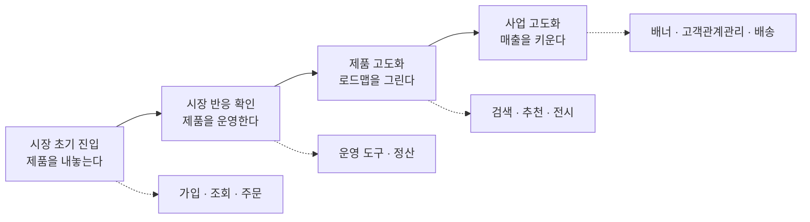

같은 직함을 단 두 사람이 만나 하는 일을 이야기하면 대개 어긋난다. 한쪽은 지표를 보고 다음 분기에 무엇을 할지 정하는 사람이고, 다른 한쪽은 화면 정의서를 쓰고 개발 일정을 맞추는 사람이다. 둘 다 자기를 제품 담당자라고 부르는데 하루의 내용이 겹치지 않는다.

이 어긋남을 개인의 역량이나 회사의 성숙도로 설명하는 시도가 흔하지만, 그렇게 보면 설명되지 않는 것이 남는다. 같은 사람이 회사를 옮기면 하는 일이 통째로 바뀌기 때문이다. 바뀐 것은 사람이 아니라 **그 회사가 무엇을 제품이라고 부르는가**이다. 소프트웨어 하나로 가치가 완결되는 곳과, 소프트웨어가 창고와 배송 기사와 상담원을 거쳐야 비로소 가치가 되는 곳에서는 같은 직함이 다른 일을 가리킬 수밖에 없다.

그래서 이 시리즈는 직무를 정의하는 데서 시작하지 않는다. **제품의 구조를 먼저 갈라 놓고, 그 구조에서 직무가 어떻게 파생되는지를 본다.** 순서를 뒤집으면 「제품 담당자는 이런 일을 합니다」라는 목록이 나오는데, 그 목록은 자기가 다녀 본 회사에서만 참이다.

구조를 먼저 보는 방식에는 대가가 따른다. 도메인마다 답이 달라지므로 한 번에 외울 정답이 없고, 그래서 여덟 편이 필요했다. 이 글이 하는 일은 그 여덟 편의 지형을 그리는 것까지다. 각 도메인의 데이터 구조가 어떻게 생겼는지, 어떤 법이 무엇을 막는지는 뒤의 일곱 편이 하나씩 맡는다. 여기 남는 것은 넷이다. 제품을 가르는 기준, 도메인을 나누는 축이 바뀌는 지점, 여덟 편이 공유하는 어휘, 그리고 어떤 물음이 몇 편에 실려 있는지.

## 「기획」은 여기서 직무의 이름이다

이 낱말을 먼저 갈라 둬야 한다. 이 블로그 안에서만도 두 층을 가리키기 때문이다.

하나는 **공정의 한 구간**이다. 만들 것이 이미 정해진 다음에 그 범위를 어디서 끊을지 확정하는 자리를 뜻하며, [기획 하네스 시리즈](/blog/ai-product-planning/planning-harness-map/)가 끝까지 이 용법을 쓴다. 그 시리즈에서 「기획 단계」는 탐색과 제작 사이에 낀 두 번째 구간을 가리킨다.

다른 하나는 **직무의 산출물을 만드는 행위**다. 문제를 정의하고 가설을 세우고 스토리와 인수조건을 쓰는 일 전체를 「기획」이라 부르는 용법이며, **이 시리즈는 끝까지 이 뜻으로 쓴다.** 편4의 제목에 붙은 기획은 구간이 아니라 행위다.

구분하는 이유는 두 뜻이 겨누는 대상이 다르기 때문이다. 구간 쪽은 「무엇이 갖춰져야 다음 자리로 넘어가는가」라는 절차를 묻고, 행위 쪽은 「무엇을 어떤 형식으로 써야 개발이 시작될 수 있는가」라는 산출물을 묻는다. 「전략」·「지표」·「요구사항 문서」도 사정이 같아서, 그 낱말들은 각각 처음 다루는 편에서 다시 갈라 둔다.

## 제품과 상품과 서비스를 왜 가르는가

세 낱말이 일상에서는 섞여 쓰이지만, 이 시리즈에서는 갈라 쓴다. 무엇을 직접 만들었는지가 책임의 경계를 정하기 때문이다.

| 구분 | 무엇인가 | 온라인 장터로 치면 |
| --- | --- | --- |
| 상품 | 회사가 만들지 않고 사들여 파는 물건 | 입점 판매자가 올린 세제 |
| 제품 | 회사가 스스로 만들어 낸 것 | 장터 애플리케이션과 자체 브랜드 생수 |
| 서비스 | 제품이나 상품의 가치를 높이려고 얹는 유통 방식과 노무·용역 | 당일 배송 |

가르는 실익은 이렇다. **상품의 품질은 판매자에게 책임이 있고, 제품의 품질은 만든 조직에 있으며, 서비스의 품질은 그 서비스를 운영하는 조직에 있다.** 세 가지를 뭉뚱그려 「우리 제품」이라고 부르면 문제가 생겼을 때 누가 고쳐야 하는지가 흐려진다.

이 시리즈에서 말하는 제품은 그중에서도 좁다. **원천 기술이 소프트웨어인 것**을 가리킨다. 하드웨어나 금융 상품 자체를 설계하는 일은 다루지 않으며, 그것들이 소프트웨어와 만나는 자리만 다룬다.

## 다섯 가지 유형이 곧 설계 지점이다

제품을 유형으로 나누는 목적은 분류 자체가 아니다. **제품을 만드는 조직과 제품으로 매출을 내는 조직이 서로 다른 방향을 볼 때, 그 어긋남이 어디서 생기는지를 짚기 위해서다.** 소프트웨어만으로 가치가 완결되는 제품과 사람의 노동이 붙어야 완결되는 제품은 애초에 누가 이용자를 가장 잘 아는지가 다르다.

| # | 유형 | 무엇이 결합되는가 | 설계가 걸리는 지점 |
| :---: | --- | --- | --- |
| 1 | 제품과 내부 운영의 결합 | 화면 기능 + 내부 심사·발급 절차 | 신청 경험과 내부 처리 효율을 함께 봐야 한다. 품질 약정과 절차 표준이 여기서 나온다 |
| 2 | 제품과 외부 노동의 결합 | 화면 기능 + 외부 인력의 수행 | 연결 경험과 더불어 평점·후기 같은 외부 인력 관리 체계 |
| 3 | 제품과 내부 운영과 외부 노동의 결합 | 앞의 둘이 동시에 | 탐색 경험과 물류 절차를 처음부터 끝까지 이해해야 한다 |
| 4 | 제품 단독 | 소프트웨어만으로 완결 | 순수한 기능으로 어떻게 가치를 줄 것인가 |
| 5 | 내부 운영 지원 | 내부 이용자의 업무 효율 | 현장의 일을 깊이 알아야 효율이 오른다 |

유형이 답을 주는 물음은 둘이다. 하나는 **요구사항의 목소리를 누가 내는가**이다. 시장에 막 들어가는 단계라면 제품 조직이 내지만, 판매를 극대화하는 단계로 가면 매출 조직과의 협업 비중이 커진다. 다른 하나는 **이용자를 누가 가장 잘 아는가**이다. 소프트웨어만으로 가치가 완결되면 제품 조직이 가장 잘 알고, 사람의 노동이 끼어들수록 현장 조직과 매출 조직 쪽이 더 잘 안다.

**두 물음의 답이 유형에 따라 갈린다는 것이 요점이다.** 4번에서 통했던 「제품 조직이 요구사항의 주인」이라는 원칙을 3번에 그대로 가져가면, 현장을 모르는 채로 우선순위를 정하게 된다.

## 도메인을 나누는 축은 사업 단계에 따라 바뀐다

도메인을 어떻게 쪼갤 것인가는 한 번 정하고 끝나는 문제가 아니다. 사업이 어느 단계에 있느냐에 따라 쪼개는 축 자체가 바뀐다.

아래쪽 점선이 각 단계에서 실제로 만들어지는 것들이다. 왼쪽에서는 거래가 성립되는 최소한을 만들고, 오른쪽으로 갈수록 이미 있는 거래를 키우는 것을 만든다.

| 나누는 축 | 언제 쓰나 | 무엇이 중요해지나 |
| --- | --- | --- |
| ① 이용자 기준으로 앞단과 뒷단을 가른다 | 진입에서 검증까지 | 앞단은 이용자 경험과 첫 성공 경험, 뒷단은 운영 흐름과 절차 개선 |
| ② 기능과 시스템 단위로 가른다 | 제품을 고도화할 때 | 도메인 전문성, 그리고 도메인과 도메인을 잇는 기준을 세우는 일 |
| ③ 사업 단위로 가른다 | 사업을 고도화할 때 | 사업 영향도로 우선순위를 매기는 힘, 제품이 사업을 이끄는 전문성 |

축이 바뀌면 필요한 역량도 바뀐다. 한 도메인 안에서 끝나는 일은 조직 형태와 상관없이 처리되지만, **도메인을 가로지르는 일이 생기면 조율하는 힘이 따로 필요해진다.** 회원·결제·정산·데이터 기반처럼 여러 곳이 함께 쓰는 제품은 한 번 바꿀 때 파급이 크므로 영향도와 명세를 관리하는 역량이 요구되고, 최종 이용자를 마주하는 제품은 이용자 조사와 데이터 분석 역량이 요구된다.

## 만들고 운영하는 네 가지 방식

같은 제품이라도 누가 만들고 누가 운영하느냐에 따라 위험이 달라진다. 네 가지가 있다.

| 방식 | 구조 | 여기서 터지는 위험 |
| --- | --- | --- |
| ① 개발만 맡긴다 | 사업·서비스 기획 조직이 외부 개발사에 발주 | 일정이 외부에 묶이고, 요건이 바뀌면 계약을 다시 써야 한다 |
| ② 기획과 개발을 함께 맡긴다 | 요구사항을 정리해 넘기고 산출물을 검토 | 사전에 다 정의해야 하는 구조가 되고, 산출물이 두 벌로 갈린다 |
| ③ 내부에 두되 사업과 제품이 붙어 있다 | 사업 조직과 제품 기획이 나뉘지 않음 | 매출 전략이 곧 제품 전략이 된다. 개발 인력 확보가 전제다 |
| ④ 내부에 두고 목적 조직으로 묶는다 | 제품 기획과 개발이 한 조직 | 사업 목표와 제품 목표를 맞춰 두면 결정이 빨라진다 |

네 방식은 성숙도의 사다리가 아니다. **④가 언제나 낫다는 뜻이 아니라, 각 방식이 감당할 수 있는 변경의 크기가 다르다는 뜻이다.** 요건이 거의 바뀌지 않는 제품이라면 ①이 합리적이고, 매주 가설을 갈아치워야 하는 제품에 ①을 쓰면 계약 협의가 개발보다 오래 걸린다. 방식을 고르는 기준은 조직의 취향이 아니라 **요건이 얼마나 자주 바뀌는가**다.

## 이 직무는 결국 무엇을 하는 사람인가

앞의 네 절이 나눈 것들을 한 문장으로 되감으면 이렇게 된다.

> 소프트웨어로 이용자의 문제나 사업의 문제를 푸는 사람.

여기서 요구되는 능력은 넷으로 정리된다. 문제를 정의하는 일, 정성적 목적과 정량적 목표를 함께 세우는 일, 일을 굴러가게 관리하는 일, 그리고 가설을 세우고 검증을 설계하는 일이다. 넷 모두 뒤의 편들이 하나씩 맡는다.

원 자료는 여기에 능력이 아닌 것을 하나 덧붙인다. 가장 필요한 자질은 **용기**라는 것이다. 이 말이 정서적인 수사로 읽히기 쉽지만, 앞의 네 절을 지나온 뒤라면 다르게 읽힌다. 제품 유형도 도메인 축도 개발 방식도 전부 「무엇을 포기할 것인가」를 묻고 있었다. 다섯 유형 가운데 하나를 고르는 일은 나머지 넷의 설계 지점을 버리는 일이고, 도메인을 나누는 축을 정하는 일은 다른 축으로 보였을 문제를 당분간 보지 않겠다고 정하는 일이다. **포기를 문서로 남기고 그 결과를 자기 이름으로 감당하는 것**이 여기서 말하는 용기다.

## 용어 정리

여덟 편이 함께 쓰는 어휘를 여기 모아 둔다. 각 편은 자기에게 필요한 행만 추려 본문에서 다시 설명한다. **도메인별 판정 기준과 수치는 여기 적지 않는다** — 그것은 해당 도메인을 다루는 편의 몫이다.

### 직무와 조직의 어휘

| 용어 | 원어 | 뜻 | 다루는 편 |
| --- | --- | --- | --- |
| 제품 매니저 | Product Manager (PM) | 제품의 방향과 일의 우선순위를 정하는 역할. 해외에서는 제품 오너의 상위에 둔다 | 편2 |
| 제품 오너 | Product Owner (PO) | 정해진 방향을 과업으로 쪼개고 진행 순서를 정하는 역할 | 편2 |
| 기능조직 | — | 기획·개발·운영처럼 전문성 단위로 나눈 조직. 조직과 조직이 협업한다 | 편2 |
| 목적조직 | — | 달성할 목표 하나를 놓고 여러 직군이 한 팀으로 묶인 조직. 스쿼드·트라이브·챕터가 그 단위다 | 편2 |

### 전략과 목표의 어휘

| 용어 | 원어 | 뜻 | 다루는 편 |
| --- | --- | --- | --- |
| 제품 주도 성장 | Product Led Growth (PLG) | 제품 경험 자체로 고객을 끌어오고 붙잡는 시장 진입 전략 | 편2 |
| 목적과 핵심결과 | OKR | 정성적 목적과 정량적 핵심결과를 한 세트로 관리하는 목표 방식 | 편3 |
| 핵심성과지표 | KPI | 목표로 가는 과정이 제대로 굴러가는지 수치로 확인하는 지표 | 편3 |
| 선행지표와 후행지표 | Input / Output Metric | 유지율처럼 앞서 움직이는 값과 매출처럼 뒤따르는 값. 둘 사이의 인과를 세우는 것이 핵심이다 | 편3 |
| 북극성 지표 | North Star Metric | 제품의 핵심 가치를 담은 단 하나의 지표. 통제할 수 있는 선행지표여야 한다 | 편3 |
| 한 장 문서와 여섯 장 문서 | 1pager / 6pager | 발표 대신 참석자가 읽고 시작하는 서술형 문서. 배경과 문제, 고객, 전술, 지표, 범위를 담는다 | 편3 |
| 스토리와 인수조건 | Story / Acceptance Criteria | 기능이 아니라 이용자 가치로 쓴 요구사항과, 개발 완료를 판정하는 기준 | 편4 |

### 운영과 비용의 어휘

| 용어 | 원어 | 뜻 | 다루는 편 |
| --- | --- | --- | --- |
| 프로세스 혁신 | Process Innovation (PI) | 업무 절차·조직·시스템에서 불필요한 것을 걷어내 기업 가치를 끌어올리는 개선 활동 | 편4 |
| 품질 약정과 절차 표준 | SLA / SOP | 지켜야 할 품질 수준을 적은 약정서와, 운영 절차를 표준으로 굳힌 문서 | 편4 · 편5 |
| 획득비용과 생애가치 | CAC / CLV | 고객 한 명을 새로 데려오는 데 든 비용과, 그 고객이 남기는 총액 | 편3 · 편6 |

### 커머스 도메인의 어휘

| 용어 | 원어 | 뜻 | 다루는 편 |
| --- | --- | --- | --- |
| 딜 | Deal | 소셜 커머스에서 나온 판매 단위. 상품의 상위 묶음이다 | 편5 |
| 표준상품 | — | 물류와 재고를 기준으로 잡은 상품 식별 단위 | 편5 |
| 스토어상품 | — | 온라인 매장에서 실제로 팔리는 단위. 표준상품 여러 개의 조합일 수 있다 | 편5 |
| 창고관리 시스템 | WMS | 입고·보관·출고를 관리하는 시스템. 표준상품의 기준이 여기서 나온다 | 편5 |
| 품목 분류와 전시 분류 | — | 품목을 식별하기 위한 분류와, 고객이 훑어보기 위한 분류 | 편5 |
| 조건부 가격 | Condition Pricing | 특정 조건이 성립할 때 적용할 가격을 미리 정해 둔 정책 | 편6 |
| 주문 클레임 | — | 취소·반품·교환처럼 주문 상태를 되돌리거나 바꾸는 고객 요청 | 편6 |
| 퍼널 분석 | AARRR | 유입·활성·유지·매출·추천 다섯 구간으로 나눠 보는 분석 틀 | 편5 · 편6 |
| 원클릭 주문서 | — | 장바구니를 들르지 않고 상품 화면에서 주문서로 바로 넘어가는 흐름 | 편6 |
| 묶음배송 | — | 여러 상품을 함께 주문할 때 배송비 정책을 하나로 묶어 적용하는 방식 | 편6 |

### 핀테크 도메인의 어휘

| 용어 | 원어 | 뜻 | 다루는 편 |
| --- | --- | --- | --- |
| 전자금융업자 | — | 전자금융거래법 제28조가 정한 허가·등록을 거친 사업자. 금융회사는 제외된다 | 편7 |
| 선불전자지급수단 | — | 옮길 수 있는 금전적 가치를 전자적으로 담은 증표. 두 개 이상 업종에서 쓰인다 | 편7 |
| 전자화폐 | — | 선불전자지급수단의 상위 개념. 광역단체 2곳·가맹점 500곳·업종 5개 이상이 요건이다 | 편7 |
| 오픈뱅킹 | Open Banking | 금융 서비스가 열린 방식으로 제공되는 현상. 국내에서는 금융결제원의 공동망을 가리킨다 | 편7 |
| 참가기관과 이용기관 | — | 계좌를 열어 주는 금융회사와, 그 통로를 빌려 쓰는 사업자 | 편7 |
| 마이데이터 | 본인신용정보관리업 | 전송요구권에 기대어 흩어진 신용정보를 모아 보여 주는 사업 | 편8 |
| 개인신용정보 전송요구권 | — | 신용정보법 제33조의2. 마이데이터가 서 있는 제도적 기반이다 | 편8 |
| 데이터 3법 | — | 개인정보보호법 · 정보통신망법 · 신용정보법 | 편7 · 편8 |
| 스크린 스크래핑 | screen scraping | 고객의 인증정보로 대신 접속해 화면을 긁어 오는 방식. 마이데이터에서는 금지됐다 | 편8 |
| 중계기관 | — | 전송 설비를 스스로 갖추지 못한 금융사 몫의 정보 전송을 떠맡는 기관 | 편8 |
| 겸영업무와 부수업무 | — | 다른 업권의 업무를 함께 하는 것과, 본업은 아니나 관련이 깊은 업무 | 편8 |
| 빅블러 | Big Blur | 업권 사이의 경계가 흐려지는 현상 | 편8 |

앞의 세 표는 도메인과 무관하게 쓰이고, 뒤의 두 표는 해당 도메인 안에서만 쓰인다. **뒤의 두 표가 앞의 세 표보다 두꺼운 것이 이 시리즈의 형태를 그대로 보여 준다** — 뼈대는 얇고 도메인이 두껍다.

## 이 시리즈가 다루지 않는 것

지도에는 경계선도 함께 그려야 한다. 이 시리즈 밖에 두는 것이 셋이다.

**첫째, 구현 기술은 다루지 않는다.** 어떤 저장소를 고르고 어떤 구조로 짜는지는 대상이 아니다. 도메인을 이야기할 때 데이터 구조가 자주 나오지만, 그것은 **업무의 순서가 데이터의 순서를 정하기 때문**이지 구현을 설명하려는 것이 아니다.

**둘째, 판단을 건너뛰지 못하게 하는 장치는 다루지 않는다.** 무엇을 만들지 정하는 절차에 차단 장치를 어떻게 놓는가는 다른 층의 물음이다. 이 시리즈는 **판단의 재료**를 다루고, 그 재료를 어떤 절차에 태울지는 다루지 않는다.

**셋째, 커머스와 핀테크 밖의 도메인은 다루지 않는다.** 기업 간 소프트웨어, 온·오프라인 연계, 플랫폼, 물류처럼 같은 방식으로 뜯어볼 수 있는 도메인이 더 있지만, 여기서는 두 도메인만 끝까지 판다. **얕게 여덟 도메인을 훑는 것보다 두 도메인에서 데이터 구조와 규제까지 내려가는 편이 나머지에 옮겨 붙일 만한 것을 더 남긴다**고 봤기 때문이다.

밖에 둔 것 가운데 둘째는 이미 다른 글이 맡고 있다.

| 이 시리즈가 다루지 않는 것 | 그것을 다루는 글 |
| --- | --- |
| 만들지 말지를 판정하는 절차와, 조건이 모자라면 다음 산출물을 만들지 못하게 막는 장치 | [만드는 비용이 내려가면 무엇이 남는가](/blog/ai-product-planning/planning-harness-map/) |

🔴 **두 시리즈를 이어 읽는다면 재료를 모으는 쪽이 이 시리즈이고, 그 재료로 통과와 보류를 가르는 쪽이 그 시리즈다.** 앞에서 갈라 둔 「기획」의 두 뜻이 그 경계에 그대로 놓인다.

## 일곱 편이 각각 내세우는 것

일곱 편이 각자 하나씩 주장을 세운다. 급하면 이 표만 읽어도 시리즈의 뼈대는 잡힌다.

| 편 | 이 편이 세우는 주장 |
| :---: | --- |
| 2 | 요구사항을 어느 조직이 내는지가 곧 그 회사의 제품 전략이다. 조직도를 그대로 둔 채 전략만 바꿀 수는 없다 |
| 3 | 목적은 정성적으로, 목표는 정량적으로 쓴다. **산출물을 냈다는 것은 성과가 아니다** |
| 4 | 제품 명세는 확정이 아니라 가설이다. 배포하기 전까지 이용자가 어떻게 반응할지는 아무도 모른다 |
| 5 | 도메인 지식은 화면이 아니라 데이터 구조에 있다. 회원과 상품을 어떤 단위로 쪼갰는지가 나머지를 결정한다 |
| 6 | 가격과 주문은 정책이 먼저이고 화면이 나중이다. **되돌리는 흐름까지 설계해야 주문이 끝난다** |
| 7 | 규제 산업에서는 무엇을 만들 수 있는지를 법이 먼저 정한다. 대상을 확정하는 기준이 없으면 조사도 시작되지 않는다 |
| 8 | 제도가 이미 열어 준 것과 아직 논의 중인 것은 같은 층이 아니다. 경쟁 구도는 그 차이 위에서 갈린다 |

**일곱 줄 가운데 다섯 줄이 「무엇을 먼저 놓는가」의 순서를 다투고 있다.** 조직이 전략보다 먼저이고, 목적이 목표보다 먼저이고, 데이터 구조가 화면보다 먼저이고, 정책이 화면보다 먼저이고, 법이 기능보다 먼저다. 도메인이 달라도 형태가 같은 이유는 하나다 — **나중에 오는 것은 고치기 쉽고 먼저 오는 것은 고치기 어렵다.**

## 이 시리즈의 구성

일곱 편이 이 지도의 각 자리를 하나씩 맡는다.

| 편 | 다루는 것 | 이 편이 답하는 질문 |
| --- | --- | --- |
| [편2 — 요구사항은 어느 조직에서 나오는가](/blog/product-management/product-org-and-strategy/) | 이해관계자가 바라는 것, 기능조직과 목적조직, 전략의 계층과 제품 주도 성장 | 조직의 형태가 제품을 어떻게 바꾸는가 |
| [편3 — 전술과 목표를 세우는 법](/blog/product-management/tactics-and-goal-setting/) | 한 장 문서로 바뀐 승인 방식, 목적과 목표의 구분, 두 가지 목표 관리 방식, 지표 체계 | 무엇을 재야 목표가 목표가 되는가 |
| 편4 — 기획하고 관리하고 넓히기 | 가설 검증과 비교 실험, 스토리 기반 기획, 품질과 배포와 회고, 프로세스 혁신·로드맵·뒷단 설계 | 명세를 가설로 다루면 무엇이 달라지는가 |
| 편5 — 커머스의 회원과 상품 | 커머스의 정의와 도메인 지도, 회원 도메인, 상품 도메인 | 상품을 어떤 단위로 쪼개야 하는가 |
| 편6 — 커머스의 가격과 주문 | 가격 도메인, 주문·결제·배송·클레임, 현장 사례 | 주문은 어디서 끝나는가 |
| 편7 — 핀테크의 정의와 규제 | 디지털 금융과 핀테크의 구분, 전자금융 관련 법, 오픈뱅킹 | 어떤 회사를 핀테크라고 부를 수 있는가 |
| 편8 — 마이데이터와 업권 경쟁 | 마이데이터 제도, 업권 경쟁 구도, 아직 남은 논점 | 제도가 바꾼 경쟁의 축은 무엇인가 |

**편2부터 편4까지가 도메인과 무관한 뼈대를 세우고, 편5부터 편8까지가 두 도메인에서 그 뼈대에 살을 붙인다.** 순서대로 읽는 것을 전제로 썼지만, 필요한 도메인이 이미 정해져 있다면 편5부터 편8 사이에서 곧장 그 편을 열어도 무방하다. 각 편이 쓰는 용어는 그 편 안에서 다시 설명하기 때문이다.

## 정리

세 가지를 잡아 두면 뒤의 일곱 편이 읽힌다.

**첫째, 직무를 정의하는 대신 제품의 구조를 정의한다.** 같은 직함이 회사마다 다른 일을 가리키는 이유는 제품의 구조가 다르기 때문이고, 구조를 먼저 갈라 두면 하는 일이 왜 다른지가 따라 나온다.

**둘째, 도메인 지식은 화면이 아니라 데이터와 제도에 있다.** 커머스에서는 상품과 회원을 어떤 단위로 쪼갰는지가, 핀테크에서는 무엇이 허용되고 무엇이 금지됐는지가 만들 수 있는 것의 범위를 먼저 정한다.

**셋째, 뼈대는 옮겨 붙고 살은 옮겨 붙지 않는다.** 목표를 세우는 방식이나 명세를 가설로 다루는 태도는 도메인이 바뀌어도 그대로 쓰이지만, 정산 단위나 전송요구권 같은 것은 그 도메인 안에서만 참이다. 두 층을 섞어 외우면 다음 도메인에서 처음부터 다시 시작하게 된다.

다음 편은 요구사항이 어느 조직에서 나오는지를 다룬다 — 이해관계자가 제품 담당자에게 무엇을 바라는지, 조직을 기능으로 나눌 때와 목적으로 나눌 때 무엇이 달라지는지다.
