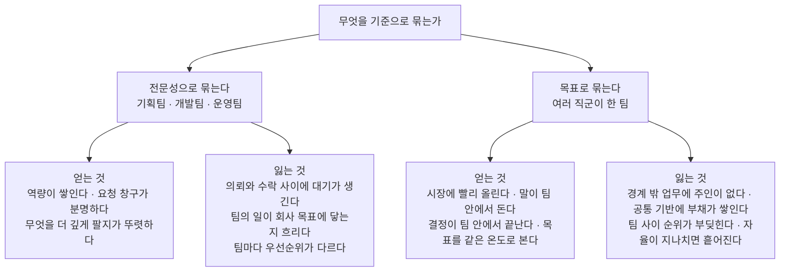

[앞 편](/blog/product-management/product-management-map/)은 같은 직함을 단 두 사람이 하는 일이 겹치지 않는 이유를 제품의 구조에서 찾았다. 그 편이 세운 것은 구조이고, 이 편이 맡는 것은 그 구조가 조직도와 전략으로 내려앉는 자리다.

내려앉는 경로는 한 문장으로 줄어든다. **요구사항을 어느 조직이 발의하는지가 그 회사의 제품 전략이다.** 전략 문서에 무엇이 적혀 있는지가 아니라 「이걸 만듭시다」라는 말이 어느 회의실에서 시작되는지가 전략의 내용이며, 두 값이 어긋난 회사에서 이기는 쪽은 언제나 회의실이다.

그래서 세 층을 차례로 내려간다. 직함이 무엇을 나누는지, 조직을 나누는 두 방식이 각각 무엇을 사고파는지, 그 위에 얹히는 전략이 어떤 계층으로 서는지다.

## 네 개의 직함은 두 개의 축으로 갈린다

제품을 맡는 사람의 직함은 흔히 넷으로 불린다. 유행에 따라 바뀐 호칭처럼 보이지만 실제로는 두 축이 교차한 결과다. **런칭 전인가 이후인가**라는 시점의 축과, **방향을 정하는가 일정을 지키는가**라는 책임의 축이다.

| 직함 | 무게가 실린 시점 | 실제로 판정하는 것 |
| --- | --- | --- |
| 서비스 기획자 | 런칭까지 | 화면을 어떻게 그리고 기능 요구사항을 어디까지 적을 것인가 |
| 프로젝트 매니저 | 런칭까지 | 약속한 기능이 약속한 날짜에 나가는가 |
| 제품 매니저 | 런칭 이후 | 이 제품이 어디로 가야 하며 지금은 무엇이 먼저인가 |
| 제품 오너 | 런칭 이후 | 정해진 방향을 어떤 과업으로 쪼개 어떤 순서로 태울 것인가 |

**위 두 줄과 아래 두 줄 사이에 굵은 선이 있다.** 위쪽은 정해진 것을 내보내는 일이고 아래쪽은 무엇을 정할지를 정하는 일이다. 회사가 어느 쪽 직함을 쓰는지는 제품 담당자에게 무엇을 맡기는지의 자백에 가깝다. 런칭 전까지만 사람을 붙이는 회사에서 제품은 프로젝트로 관리되고 있으며, 그 상태에서 방향을 정하라는 요구는 권한 없는 책임이 된다.

아래 두 줄 사이에도 층이 하나 있다. 방향과 순서를 한 자리에 두는 회사가 있고 둘로 나누는 회사가 있는데, 나누면 앞쪽이 전략을 맡고 뒤쪽이 실행 단위로 옮긴다. 국내에서는 두 직함이 같은 층으로 쓰이지만 원래 용법에서는 방향을 정하는 쪽이 위에 선다.

## 여섯 자리에서 오는 요구는 한 낱말로 모인다

제품 담당자를 둘러싼 자리는 여섯쯤 된다. 각자 다른 말로 요구하지만, 늘어놓고 보면 같은 것을 다르게 부르고 있다.

| 요구하는 자리 | 그 자리가 바라는 것 |
| --- | --- |
| 대표 | 사업의 전략을 제품의 전략으로 옮겨 실행하고 숫자로 답을 가져오는 것 |
| 사업 담당 | 제품의 원리를 모르는 사람에게도 통하게 설명하고, 안 되면 대안을 내는 것 |
| 개발자 | 이 일을 왜 하는지를 팀 밖까지 납득시키는 것. 배로 치면 키를 잡는 자리다 |
| 디자이너 | 시작할 때 방향을, 만드는 동안 제약을, 내보낸 뒤 결과를 제때 알리는 것 |
| 데이터 담당 | 목적과 그 달성을 재는 값을 명확히 정의하고 팀이 납득하게 설득하는 것 |
| 기술 프로젝트 담당 | 위험까지 계산에 넣어 문제를 정의하고 우선순위를 투명하게 여는 것 |

여섯 줄의 공통분모는 **정렬** 하나다. 각자 필요한 정보를 달라고 말하는 것처럼 보이지만 실제로 요구하는 것은 **여섯 자리가 같은 그림을 보고 있다는 상태**다. 대표가 원하는 번역도 개발자가 원하는 이유의 설명도 그 그림을 만드는 작업의 다른 얼굴이다.

그래서 이 직무는 한 문장으로 줄어든다. **제품의 목표에 근거해 일의 순서를 정하고, 주어진 개발 자원 안에서 제품으로 사업의 성과를 만드는 사람.** 여기서 「주어진」이 중요하다. 자원을 늘려 달라는 요구도 일의 일부이지만, 판정은 늘어난 자원이 아니라 주어진 자원에서 나온 결과로 이뤄진다.

## 역할이 무너지는 다섯 가지 방식

앞 절이 그린 것은 잘 작동할 때의 모습이다. 무너지는 방식은 다섯 가지로 반복된다.

| # | 무너지는 지점 | 겉으로 드러나는 증상 |
| :---: | --- | --- |
| 1 | 무엇을 할지 정할 여지가 없다 | 「위에서 정한 것」만 남고 역할이 전달자로 줄어든다 |
| 2 | 설계의 주인이 불분명하다 | 어디까지가 제품 담당의 설계인지를 매번 다시 다툰다 |
| 3 | 제품 아닌 일이 몰린다 | 운영 매뉴얼과 배너 같은 주변 업무가 하루를 채운다 |
| 4 | 사업 조직과 역할 경계가 없다 | 요금과 수수료처럼 매출에 직결되는 정책이 현업 소관이다 |
| 5 | 추진할 근거가 없다 | 「하면 무엇이 좋아지느냐」에 숫자로 답하지 못한다 |

다섯 줄이 각각 다른 문제로 보이지만 1번과 4번은 뿌리가 같다. **요구사항이 제품 조직 밖에서 발의되는 구조**다. 밖에서 온 요구는 결론까지 함께 도착하므로 1번이 되고, 그 결론을 낼 권한이 밖에 있으므로 4번이 된다. 이 편의 마지막 본문 절에서 다룰 두 유형의 갈림이 여기서 미리 얼굴을 내민다.

나머지 셋은 성격이 다르다. 2번과 3번은 경계를 문서로 정하지 않아 생기므로 규약으로 줄어들고, 5번은 목표와 지표를 세우는 훈련이 없어서 생기므로 다음 편이 통째로 다룬다. 요구되는 역량이 다섯인 것도 그래서다. 문제를 정의하는 힘, 지표를 세우는 힘, 가설을 세우고 검증을 설계하는 힘, 일을 굴러가게 만드는 관리와 리더십, 그 전부를 말과 글로 옮기는 힘이다. **다만 이 다섯으로 메워지는 것은 2·3·5번까지다** — 1번과 4번은 역량이 아니라 권한이 놓인 자리의 문제여서 개인이 채울 수 없다.

## 조직을 전문성으로 나눌 때와 목표로 나눌 때

조직을 나누는 방식은 크게 둘이다. 같은 일을 하는 사람끼리 묶으면 기능조직이고, 같은 목표를 보는 사람끼리 묶으면 목적조직이다.

두 방식의 차이는 장단점 목록보다 **일이 흘러가는 모양**에서 더 분명해진다.

| 갈리는 지점 | 기능조직 | 목적조직 |
| --- | --- | --- |
| 일이 흐르는 모양 | 의뢰하고 받아들이고 수행하고 검토한다 | 한 팀 안에서 정하고 만들고 내보낸다 |
| 조직도의 생김새 | 총괄 아래 본부와 팀이 선다 | 목표 단위의 작은 팀이 여럿 서고 그 묶음이 다시 선다 |
| 제품 담당의 일 | 기획하고 부서 사이를 잇는 조율에 시간을 쓴다 | 목표와 지표를 세우고 과업의 순서를 관리한다 |
| 잘 맞는 시점 | 운영이 안정되고 전문성을 쌓아야 할 때 | 시장에 빨리 안착시켜 성과를 내야 할 때 |

목적조직을 도입한 회사들은 대개 세 층의 이름을 함께 쓴다. 목표 하나를 보는 작은 팀이 기본 단위이고, 연관된 팀을 묶은 상위 단위가 그 위에 서서 자원과 자율이 충분한지 확인한다. 여기에 같은 직군끼리 가로로 묶는 단위가 하나 더 붙는데, 이 단위의 장은 관리자가 아니라 자기 팀에서 실무를 함께 하는 사람이다. **이 조건이 굳이 명시되는 이유는 분명하다** — 가로줄이 실무에서 손을 떼면 그때부터는 관리 계층이 하나 더 늘어난 셈이 된다.

둘 중 하나가 옳은 것은 아니지만, 고르는 순간 무엇을 팔았는지는 알아야 한다. 기능조직은 속도를 팔아 전문성을 샀고 목적조직은 공통 기반의 완성도를 팔아 속도를 샀다. 판 것의 대금은 나중에 청구된다.

## 전략은 다섯 층으로 내려온다

조직 이야기 위에 전략을 얹으면 층이 보인다. 전략이라는 말이 회의에서 자주 어긋나는 이유는 서로 다른 층을 같은 낱말로 부르기 때문이다.

| 층 | 이 층이 답하는 물음 | 담기는 내용 |
| --- | --- | --- |
| 비전 | 우리는 무엇이 되려 하는가 | 고객에게 무슨 가치를 주는 존재가 될지가 들어가야 한다 |
| 기업 전략 | 어느 판에서 사업할 것인가 | 성장성과 점유를 두 축으로 놓고 유망·안정·불안정·쇠퇴로 가른다 |
| 사업 전략 | 이 판에서 어떻게 이길 것인가 | 통상 「제품 전략」이라 부르는 것이 이 층이다 |
| 기능 전략 | 각 조직은 어떻게 일할 것인가 | 마케팅·사업·제품·운영이 각자 세우는 실행 계획 |
| 전술 | 다음에 무엇을 할 것인가 | 개별 행동으로 쪼갠 것. 영업·제품·마케팅으로 갈린다 |

**「제품 전략」은 세 번째 층에 있다.** 그러니 제품 전략을 세우라는 요구는 「이 사업에서 어떻게 이길지를 제품의 언어로 옮겨라」는 뜻이고, 위의 두 층이 비어 있으면 옮길 원본이 없다. 원본 없이 만든 제품 전략은 기능 목록이 되며, 기능 목록은 우선순위를 판정하지 못한다.

제품 쪽에는 대응하는 두 낱말이 있다. 제품 비전은 이 제품으로 고객의 생활이 어떻게 달라지는지를, 제품 전략은 지금의 사업적 필요를 충족시키면서 그 비전으로 가는 방식을 말한다. **비전만 있으면 이번 분기를 설명하지 못하고, 사업적 필요만 있으면 다음 해를 설명하지 못한다.**

## 제품이 성장을 이끄는가, 성장을 거드는가

여기까지 온 층들이 하나의 갈림으로 모인다. 제품이 성장의 엔진인 회사와 성장을 거드는 도구인 회사, 곧 제품 주도형과 제품 지원형이다.

| 무엇이 다른가 | 제품 주도형 | 제품 지원형 |
| --- | --- | --- |
| 경영진이 제품을 보는 눈 | 제품을 만드는 일이 곧 사업이다 | 제품은 사업을 거드는 수단이다 |
| 요구사항을 발의하는 곳 | 제품 조직 | 사업 조직과 운영 조직 |
| 개발에 쓰는 돈의 이름 | 투자 | 비용 |
| 제품의 고객 | 최종 이용자 | 사내의 사업 조직 |
| 실행의 뼈대 | 사용에서 확산으로 도는 순환 구조 | 조직과 조직이 층으로 협업하는 구조 |
| 결정의 근거 | 하나의 핵심 지표를 중심에 둔 데이터 | 현장의 판단 |
| 어울리는 시기 | 제품을 시장에 안착시켜야 할 때 | 안착 이후 운영을 다지고 매출을 키울 때 |

**두 번째 줄이 나머지 여섯 줄을 끌고 간다.** 요구사항이 제품 조직에서 나오면 개발 자원은 투자로 계산되고 지표가 결정의 근거가 되지만, 사업 조직에서 나오면 자원은 비용이 되고 제품의 고객은 사내 조직이 된다. 앞 절에서 애로 1번과 4번을 한 뿌리로 묶은 이유가 이것이다. **그 둘은 역량의 문제가 아니라 제품 지원형 구조에서 구조적으로 발생하는 증상이다.**

제품 주도형이 부상한 배경에는 마케팅으로 성장을 사던 방식의 한계가 있다. 광고를 사는 사람이 몇 해 사이 몇 배로 늘어 노출 단가는 올랐는데 반응률은 떨어졌고, 고객 한 명을 데려오는 비용은 그 반대로 움직였다. 기업 대상 거래에서도 영업 담당을 거치기보다 직접 찾아보고 사는 쪽을 택하는 고객이 네 명 중 셋이다. **고객이 탐색과 학습과 전환의 주체가 되면, 그 세 순간을 만나는 접점은 광고가 아니라 제품 자신이다.**

그래서 이 유형은 네 칸이 도는 순환으로 설계된다. 가치를 처음 실감하는 순간을 만들고, 지불 의사가 생기는 시점에 결제가 걸림 없이 되게 하고, 더 쓰고 싶어질 때 쓰던 경험을 해치지 않으면서 범위를 넓히고, 권하는 일을 쉽게 만들어 다시 첫 칸으로 보낸다. **한 칸이라도 막히면 순환이 아니라 깔때기가 되고, 깔때기는 결국 광고비로 위를 채워야 한다.** 이용자를 살펴보는 사람과 막 시작한 사람, 익숙하게 쓰는 사람과 권하는 사람으로 갈라 칸마다 초점을 달리 잡는 것도 같은 설계다. 무료로 시작해 유료로 넘기며 도입한 회사끼리 연결되는 협업 도구, 개인에서 교육을 거쳐 기업 시장으로 올라간 저작 도구, 송금과 증권과 은행을 한 앱에 모으고 그 속도와 장애를 서비스 단위를 쪼개 막은 금융 서비스가 그 예다.

제품 지원형은 구조가 다르다. 고객의 여정이 자동화된 절차와 사람이 처리하는 운영으로 나뉘고, 제품은 그 둘을 이어 붙여 각 조직의 원가를 낮춘다. 공급과 수요를 함께 다루는 시장이 대표적이다. 조직마다 이해가 충돌하므로 **우선순위를 정하는 협의체와 합의된 규칙이 없으면 요구사항이 목소리 크기로 정렬된다.** 이 유형에는 이 유형의 장치가 필요하다는 뜻이다.

## 이 편이 쓴 용어

지도편이 모아 둔 어휘 가운데 이 편에서 실제로 쓰인 다섯 줄이다.

| 용어 | 원어 | 이 편에서의 뜻 |
| --- | --- | --- |
| 제품 매니저 | Product Manager (PM) | 런칭 이후의 방향과 우선순위를 정하는 자리 |
| 제품 오너 | Product Owner (PO) | 방향이 정해진 뒤 그것을 과업 단위로 나누고 순서를 매기는 자리 |
| 기능조직 | — | 전문성 단위로 묶어 조직 사이의 의뢰로 일이 흐르는 구조 |
| 목적조직 | — | 목표 하나를 놓고 여러 직군이 한 팀으로 묶인 구조 |
| 제품 주도 성장 | Product Led Growth (PLG) | 쓰는 경험 그 자체가 획득과 확산의 통로가 되는 시장 진입 방식 |

## 정리

세 가지가 이 편에 남는다.

**첫째, 직함은 회사가 무엇을 맡기고 있는지의 자백이다.** 런칭까지만 사람을 붙이는 구조에서 방향을 정하라는 요구는 권한 없는 책임이 되며, 직함을 바꿔 다는 것으로는 아무것도 옮겨지지 않는다.

**둘째, 조직을 나누는 두 방식은 각각 무언가를 팔아 무언가를 샀다.** 전문성으로 묶은 쪽은 속도를, 목표로 묶은 쪽은 공통 기반의 완성도를 팔았다. 대금은 면제되지 않으므로 도입할 때 그 청구서를 누가 받을지까지 정해 두는 편이 낫다.

**셋째, 요구사항의 발의 주체가 전략의 실체다.** 그 자리가 어디냐에 따라 개발 자원의 이름도, 결정의 근거도, 제품이 바라보는 고객도 함께 바뀐다. 조직도를 그대로 둔 채 전략만 바꾸겠다는 계획이 실패하는 이유가 여기 있다. **전략은 문서가 아니라 발의 권한이 놓인 자리다.**

다음 편은 그 전략을 아래로 내리는 자리를 다룬다. 승인 방식이 발표에서 읽는 문서로 바뀐 이유, 정성적 목적과 정량적 목표를 갈라 쓰는 이유, 그리고 무엇을 재야 목표가 목표가 되는지가 거기서 갈린다.
