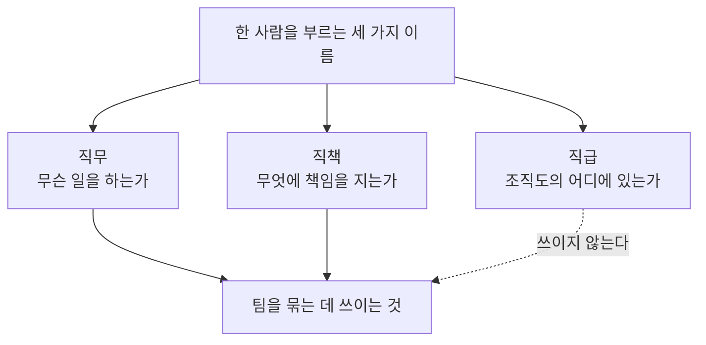

[앞 편](/blog/product-management/team-building-and-agile-org/)은 팀이라는 낱말의 안쪽을 봤다. 다듬는 일에 끝이 없다는 것, 좋고 나쁨을 성과 하나로 가를 수 없다는 것, 형태가 자주 바뀌는 조직일수록 그 일이 잦아진다는 것이었다.

**이 편은 그 팀 안에서 사람들이 서 있는 자리를 본다.** 한 사람은 팀에만 속해 있지 않다. 맡은 일의 영역이 있고, 조직도상의 계급이 있으며, 그것과 또 다른 책임의 이름이 있다. 셋이 뒤섞여 쓰이는 탓에 자기가 무엇을 근거로 무엇을 요구받는지가 흐려진다.

이 편이 답할 질문은 하나다. **계급으로 역할과 순서를 정하던 조직에서 그 계급을 걷어 내면, 계급이 하던 일은 어디로 가는가.**

⚠️ **점선이 이 편의 주장이다.** 세 이름이 나란히 놓여 있지만 팀을 묶는 데 힘을 보태는 것은 둘뿐이다. 다만 아무 일도 하지 않는다는 말과 없어도 된다는 말은 다르며, 그 차이는 마지막 절에서 드러난다.

## 하나는 일의 이름이고 하나는 계급의 이름이고 하나는 책임의 이름이다

세 낱말을 가르는 기준은 각각이 무엇에 붙는가다. 일에 붙는 것이 있고, 사람에 붙는 것이 있고, 맡은 몫에 붙는 것이 있다.

| 개념 | 무엇에 붙나 | 운동 경기로 옮기면 |
| --- | --- | --- |
| 직무 | **일의 영역과 역할**에 붙는다. 목표에 닿기 위해 필요한 일들을 갈라 놓은 것이다 | 감독과 코치와 의료진, 수비와 공격과 중원과 골문. 그 안에서 다시 갈린다 |
| 직급 | **사람의 지위와 계급**에 붙는다. 계층의 어디에 있고 무엇을 결정할 수 있는지를 정한다 | 옮기기 어렵다. 굳이 대면 등급 정도인데 그것도 잘 맞지 않는다 |
| 직책 | **직무를 넘어 맡은 특정한 역할**에 붙는다. 권한보다 책임 쪽에 무게가 있다 | 주장, 수석 코치, 의료진의 책임자 |

**이 표가 말하는 것**: 가운데 줄만 비유가 성립하지 않는다. 경기에 나가는 팀에는 등급으로 서열을 매기는 장치가 없어도 누가 무엇을 하는지가 정해지기 때문이다. 이것이 우연한 빈칸이 아니라는 것이 다음 절의 내용이다.

직무를 아는 것이 왜 필요한지도 여기서 나온다. 옆 사람이 무슨 일을 하는지 알아야 업무를 나눌 수 있고, 나뉘어야 각자가 자기 일에 집중하며, 그래야 조직의 효율과 성과가 오른다. **순서가 반대로 가지 않는다.** 성과를 올리려는 압력에서 시작해 역할을 나누면 그 기준이 일의 성격이 아니라 급한 정도가 된다.

## 셋 가운데 하나는 팀을 묶는 일에 끼지 않는다

같은 세 낱말을 팀 빌딩이라는 목적 하나로 다시 재면 값이 고르지 않다.

| 개념 | 팀을 다듬는 일에서 갖는 값 |
| --- | --- |
| 직무 | **구성원을 더 이해하려는 통로**가 된다. 무슨 일을 하는지 알면 무엇을 어렵게 여기는지도 어느 정도 보인다 |
| 직급 | 여기에 보탬이 되는 지점을 찾기 어렵다 |
| 직책 | 비전과 목표를 향한 정렬을 계속 잡아 주고 **팀 안의 구심점이 된다.** 리더십과 신뢰가 여기 걸린다 |

**이 표가 말하는 것**: 가운데 칸이 비어 있는 것은 직급이 나쁘다는 뜻이 아니라 **하는 일이 다르다**는 뜻이다. 직급은 결정의 순서와 보상의 근거를 정할 뿐 같은 목표를 보게 만들지는 않는다. 다만 계급이 뚜렷한 조직에서는 위에서 정하면 아래가 따라오므로 **정렬이 이미 되어 있는 것처럼 보인다.**

## 세 이름은 같은 종류의 이름이 아니다

제품을 맡는 자리를 부르는 이름 셋도 같은 층에 있지 않다. 하나는 자리의 이름이고 하나는 일의 이름이며 남은 하나는 아직 정해지지 않았다.

| 명칭 | 무엇을 가리키나 | 어느 쪽인가 |
| --- | --- | --- |
| 프로덕트 팀 리드 | 제품 매니저가 속한 프로덕트팀을 이끄는 사람 | **직책**이다. 그 사람의 직무는 제품 관리일 수도 아닐 수도 있다 |
| 제품 매니저 | 전략과 협업과 실행까지 개발과 운영의 전 과정을 맡는 사람 | **직무**다. 다른 직무들처럼 확실히 자리를 잡았다 |
| 제품 오너 | 제품의 지속성과 연속성에 책임을 지는 사람. 회사 안에서 창업에 가까운 역할이다 | 직책인지 직무인지 논쟁 중이며 **직무로 자리 잡지는 못했다** |

**이 표가 말하는 것**: 세 번째 줄의 미결 상태가 혼란을 만든다. 어떤 회사는 팀을 이끄는 자리로 쓰고 다른 회사는 제품 하나를 맡는 일로 쓰는데, 어느 쪽이 틀린 것이 아니라 아직 굳지 않은 것이다. 이 갈래를 조직도와 전략의 층에서 다룬 편이 따로 있다 — [직함과 조직과 전략의 세 층](/blog/product-management/product-org-and-strategy/)이 네 직함을 시점과 책임 두 축으로 갈랐다. **그쪽이 회사가 무엇이라 부르는지를 물었다면, 이 편은 그 이름이 무엇의 이름인지를 묻는다.**

직급은 이 목록에 들어오지 못한다. 제품 매니저와 제품 오너가 일하는 조직에서는 계급 자체가 성립하기 어려운데, **오 급 제품 매니저나 삼 급 제품 오너 같은 말이 어색하게 들리는 것이 그 증거다.**

## 네 가지를 적어 놓고 보면 전부 같은 항목이다

계급이 하던 일을 사람이 직접 한다면 무엇을 하는 것인가. 팀을 다듬는 기본 요소로 흔히 넷을 꼽는데, 갈라 놓고 보면 같은 하나로 수렴한다.

| 요소 | 무엇을 하는 것인가 |
| --- | --- |
| **밍글링** | 편안한 분위기에서 섞여 교류하는 일이다. 업무를 방해한다고 볼 일이 아니며 **몇 시간을 쉬어 가더라도 그 뒤가 훨씬 낫다** |
| **구성원 관찰** | 동료에게 관심을 둔다는 것은 자기 시간을 상대에게 내주는 일이다. 다만 **상대가 불편해지지 않아야 한다는 조건이 핵심이다.** 개인사와 컨디션이 업무에 영향을 주지 않는 상태는 드물기에 서로의 관심이 필요해진다 |
| **일대일 면담** | 리더마다 구성원마다 방식이 다르다. 무엇이 몰입을 막는지를 찾는 자리이며, 개인 사이의 교류로 접근할 수도 있으나 **팀 단위로 섞이는 것보다 부담스러울 수 있다** |
| **피드백** | **듣기 좋은 피드백이라는 것은 없다.** 목적을 분명히 하고(경력인지 성과인지 개선인지), 상황과 행동을 구체적으로 들고, 자리와 표정과 말투까지 본다. 언제나 받는 쪽에서 생각한다 |

**이 표가 말하는 것**: 네 항목이 전부 **말을 주고받는 방식**에 관한 것이고 제도를 고치는 항목은 없다. 계급이 있는 조직에서는 상당 부분이 위계를 타고 저절로 흘렀고, 그것이 사라지면 항목마다 사람이 시간을 들여야 한다. **팀 빌딩의 비용이라 부를 만한 것의 실체가 이 시간이다.**

피드백은 상대의 성과 수준에 따라 방향이 갈린다.

| 대상 | 무엇을 주는가 |
| --- | --- |
| 성과가 낮은 구성원 | **작게 이겨 본 경험**을 만들어 준다. 해볼 만하다는 감각과 해보니 되더라는 확인이 차례로 필요하다 |
| 성과가 높은 구성원 | 멀리 보고 함께 가자는 신호를 준다. 얼마나 중요한 몫을 했는지 인정하고 고마움을 표한다 |

**이 표가 말하는 것**: 두 줄의 시제가 다르다. 위쪽은 **앞으로 생길 경험**을 설계하는 일이고 아래쪽은 **이미 있었던 일**을 제대로 값 매기는 일이다. 잘하는 사람에게 앞으로의 계획만 말하고 지난 몫을 짚지 않으면, 일이 몰리는 쪽에 인정만 빠지는 상태가 된다.

## 팀의 상태를 바꾸는 것은 네 가지 조건이다

앞의 넷이 하는 일이라면 아래 넷은 그 일이 놓이는 조건이다.

| 조건 | 요지 |
| --- | --- |
| **비저닝** | 구성원이 비전을 쉽게 이해하도록 **눈에 보이게 만들어 나누는 것**이 가장 중요하다. 그림이나 도식이나 한 줄의 문구로 구체화한다 |
| **명확한 목표 설정** | 보기보다 훨씬 어렵다. 팀이 목표 하나를 공유하는 것만으로 좋은 팀의 준비는 갖춰진다. 성과를 평가하는 척도이며 구체적이고 잴 수 있으므로 **마찰과 갈등을 줄인다** |
| **다양성과 신뢰와 존중** | 목표 하나를 위해 **서로 다른 사람을 모았다는 사실**을 잊지 않는다. 같은 척도로 재되 함께 정한 원칙을 기준으로 신뢰하고 존중한다 |
| **동기부여** | 실패를 두려워하지 않기란 쉽지 않다. **맡은 사람이 먼저 이겨 내고 더 해내는 모습을 보여야** 한다 |

**이 표가 말하는 것**: 첫째 칸과 둘째 칸이 짝이다. 비전은 눈에 보이게 만들어야 나눌 수 있고 목표는 잴 수 있어야 다툼을 줄이는데, 둘 다 **머릿속에 있는 것을 밖으로 꺼내는 작업**이다. 꺼내지 않으면 각자 다르게 이해한 채로 같은 말을 하게 되고, 그 어긋남은 결과가 나온 뒤에야 드러난다.

셋째 칸에는 단서가 붙는다. 다양한 사람을 모아 둔 목적이 목표에 있으므로 **다름을 존중한다는 말이 각자 알아서 하도록 둔다는 뜻이 되면 곤란하다.** 재는 척도는 공통이어야 한다.

## 방향이 회사와 어긋나면 잘 굴러갈수록 멀어진다

팀을 다듬기 전에 확인할 것이 둘 있다. **회사의 목표와 방향에 맞는가**와 **전사 조직문화에 부합하는가**이며, 둘 다 팀 바깥을 보라는 요구다. 첫 단추가 잘못 끼워졌을 때 벌어지는 일이 이 둘을 먼저 두는 이유다.

⚠️ **이 흐름에서 팀 내부가 나빠지는 단계는 하나도 없다.** 팀은 목표를 향해 잘 달리고 결속도 소통도 좋다. 그런데 그 목표가 회사의 방향과 어긋나 있으면 **잘 굴러갈수록 조직 전체에서 멀어진다.** 앞 편이 부서끼리 벽을 세우는 현상으로 소개한 낱말이 여기서는 원인이 아니라 결과의 자리에 놓인다.

그래서 스스로에게 물을 세 가지가 남는다.

1. 회사의 방향과 목표를 계속해서 확인하고 있는가.
2. 우리가 가는 길이 그것과 맞는지 수시로 맞춰 보고 있는가.
3. **나 자신은 그 비전에 강하게 정렬되어 있는가.**

앞의 둘은 확인 절차를 묻지만 셋째는 **확인하는 사람 자신의 상태**를 묻는다. 스스로 납득하지 못한 방향으로 팀을 정렬시키려 하면 그 어긋남이 말투에서 새어 나온다.

## 말하는 기술은 태도가 아니라 비용의 문제다

지금까지 나온 것이 전부 소통에 걸려 있으므로 그 소통을 이루는 기술을 따로 갈라 둔다.

| 기술 | 요지 |
| --- | --- |
| **칭찬** | 기본 중의 기본이다. 듣기 좋은 피드백은 없다고 했으나 **칭찬에는 나쁜 것이 없다** |
| **공감과 이해와 격려** | 공감은 **해 줄 수 있는 것의 절반을 이미 한 것**이다. 이해는 해법을 찾고 있다는 뜻이고, 격려는 최선을 다했다고 인정하는 것이다 |
| **비언어적 소통** | 시선과 표정과 손짓과 자세와 거리다. 말하지 않고도 전할 수 있지만 **어설프면 오해를 만든다** |
| **건설적인 피드백** | 비판적 피드백과 다르다. 개인을 겨누지 않고 **문제를 풀고 성장할 기회로 다룬다.** 현실에서 가장 어려운 항목이다 |
| 그 밖 | 목표를 근거로 삼기, 듣기, 투명하고 솔직하게 말하기, 도구 쓰기, 시간 관리 |

**이 표가 말하는 것**: 첫째 줄과 넷째 줄이 서로를 설명한다. 칭찬에 나쁜 것이 없는 이유는 그것이 사람을 향하기 때문이고, 피드백에 좋은 것이 없는 이유는 그것이 일을 향하는데 듣는 쪽에서는 사람을 향한 것으로 읽히기 때문이다. **건설적인 피드백이 어려운 것은 기술이 부족해서가 아니라 그 두 방향을 듣는 쪽이 구분해 주기를 기대해야 하기 때문이다.**

이 자리에서 실무로 굳은 요령이 넷 있다.

1. **다양성을 인정하고 사람마다 방식을 달리한다.** 같은 말을 같은 방식으로 전하면 어떤 사람에게는 닿지 않는다.
2. **모른다고 말하기 전에 알아보려는 노력을 먼저 한다.**
3. **기록한다.** 모두가 바쁘므로 소통 중에 남기지 못했다면 끝나고라도 남긴다.
4. **자신을 탓하지 않는다.** 상처받지 말고 감정으로 대응하지 않는다.

셋째가 가장 자주 빠진다. 말로 합의한 것은 그 시점에는 분명하지만 **양쪽이 다르게 기억하기까지 며칠이 걸리지 않는다.** 앞 절이 목표를 잴 수 있게 만들라고 한 것과 같은 이야기이며, 대상이 주고받은 말일 뿐이다.

## 같은 네 축으로 재야 세 조직의 차이가 보인다

지금까지의 이야기가 얼마나 필요한지는 조직마다 크게 다르다. 국내에서 성격이 뚜렷하게 갈리는 세 유형을 **같은 네 축**으로 재면 그 차이가 드러난다.

| 축 | **국내 은행** | **인터넷전문은행** | **핀테크 스타트업** |
| --- | --- | --- | --- |
| **팀** | 갈등이 거의 없고 결속이 강하다. 회사에 대한 애착이 팀워크보다 앞선다 | 수평을 표방하지만 결정은 위에서 내려온다. 전통 금융과 정보기술이 섞여 옅은 긴장이 남는다 | **갈등이 상시로 있다.** 중요하게 볼 것이 서로 다르고, 오래 함께 가리라는 기대가 낮아 결속이 어렵다 |
| **팀 빌딩** | 힘을 들이지 않아도 회사 차원에서 만들어진다. **직급이 있어 누가 무엇을 맡는지가 분명하다** | 회사가 개입하되 애자일 조직이라 중요도가 높다. 팀마다 방식이 비슷하다 | **많은 힘이 든다.** 팀을 세우지 못해 프로젝트가 시작되지도 못하는 경우가 있다 |
| **제품 매니저 · 제품 오너** | 명칭이 자리 잡기 어렵다. 필요할 때 필요한 역할을 맡는다 | 명칭이 존재할 수 있고 실제로 그 일을 하는 자리가 있다 | **이 역할이 회사의 성패와 직결된다.** 조직과 프로젝트가 이 자리를 중심으로 짜인다 |
| **커뮤니케이션** | **비용이 매우 낮다.** 따로 기술이 필요하지 않다 | 시간과 노력이 든다. 회사가 정한 원칙을 근거로 말한다 | **비용이 크게 든다.** 기대를 낮추고 다름을 존중하며 피드백과 기록을 중심에 둔다 |

**이 표가 말하는 것**: 왼쪽 열과 오른쪽 열이 네 축 모두에서 정반대다. 왼쪽은 갈등이 없고 팀 빌딩에 힘이 들지 않으며 소통 비용이 낮은데 오른쪽은 셋 다 반대다. **가운데 열은 두 극단의 중간이 아니라 두 성질이 겹쳐 있는 상태다.**

🔴 **세 열을 하나로 합치면 이 표가 말하는 것이 사라진다.** 국내 조직문화를 한 줄로 요약하려는 순간 왼쪽의 「갈등 없음」과 오른쪽의 「갈등 상시」가 서로를 상쇄해 「갈등이 어느 정도 있다」가 되는데, 그런 조직은 세 열 어디에도 없다. **이 비교의 값은 평균이 아니라 폭에 있다.**

두 번째 줄이 이 편의 앞부분과 이어진다. 왼쪽에서 팀 빌딩에 힘이 들지 않는 이유로 **직급이 지목되어 있다.** 누가 무엇을 맡는지가 정해져 있어 역할과 기대를 조율할 일이 생략되기 때문인데, 곧 **직급은 팀을 묶지 않고 팀을 묶을 필요를 줄인다.** 오른쪽 열의 비용도 같은 이치다. 계급이 정해 주던 것이 없으니 역할도 기대도 매번 사람이 맞춰야 하고, 그 일이 곧 앞 절들이 나열한 항목들이다. **소통 비용이 크다는 말은 계급이 하던 일이 소통 쪽으로 옮겨 왔다는 뜻이다.**

⚠️ **이 비교는 국내 세 유형에 한정된다.** 국경을 넘는 조직에서 같은 축을 재면 다른 그림이 나오며 그것은 뒤쪽 두 편이 맡는다.

## 이 편이 쓴 용어

[지도편](/blog/product-management/pm-practice-map/)의 용어표가 이 편에 맡겨 둔 낱말은 넷이다. 그 표가 여덟 편에 공통으로 통하는 뜻을 적었다면, 아래는 **자리와 조직문화의 문맥에서 그 말이 가리킨 것**을 적는다.

| 용어 | 이 편에서 놓인 자리 |
| --- | --- |
| 직무와 직급과 직책 | 각각 일의 영역과, 조직 안의 계급과, 직무를 넘어 맡는 책임에 붙는 이름. 팀을 묶는 데 쓰이는 것은 첫째와 셋째다 |
| 프로덕트 팀 리드 (PL) | 제품 매니저가 속한 팀을 이끄는 사람. 직책이며 그 직무는 제품 관리가 아닐 수도 있다 |
| 밍글링 (Mingling) | 편안한 분위기에서 섞여 교류하는 것. 업무 시간을 쓰지만 그 뒤의 협업이 나아진다 |
| 일대일 면담 (1on1) | 리더와 구성원이 일대일로 나누는 대화. 무엇이 몰입을 막는지를 찾는 자리다 |

다섯 편이 쌓아 온 것을 되짚으면 이렇다. [편2](/blog/product-management/product-cycle-and-metric-hierarchy/)는 무엇을 위에 둘지, [편3](/blog/product-management/why-data-and-metric-dictionary/)은 그 값을 어떻게 셀지, [편4](/blog/product-management/data-driven-project-walkthrough/)는 그것으로 무엇을 정했는지를 다뤘고, [편5](/blog/product-management/team-building-and-agile-org/)는 그 일을 하는 사람들의 묶음을 봤다. **이 편은 그 묶음 안에서 각자가 선 자리를 봤다.**

## 정리

세 가지가 남는다.

**첫째, 세 이름 가운데 둘만 팀을 묶는 데 쓰인다.** 직무는 상대를 이해하는 통로가 되고 직책은 정렬을 잡는 구심점이 되지만 직급은 그 일을 하지 않는다. 대신 직급은 **팀을 묶어야 할 필요 자체를 줄인다.** 두 문장이 모순이 아니라는 것이 가장 자주 헷갈리는 지점이다.

**둘째, 팀을 다듬는 일은 네 항목으로 나뉘지만 넷 다 소통이다.** 섞여서 교류하는 일도, 동료를 살피는 일도, 마주 앉아 이야기하는 일도, 피드백을 주는 일도 제도를 고치는 항목이 아니다. 그래서 이 일의 비용은 **사람의 시간으로 지불된다.** 계급이 가파른 조직에서 그것이 낮게 보이는 것은 계급이 미리 치러 두었기 때문이다.

**셋째, 조직문화의 차이는 평균이 아니라 폭에서 읽는다.** 같은 네 축으로 세 유형을 재면 소통 비용이 한쪽 끝에서 다른 끝까지 벌어지는데, 한 줄로 합치면 어느 조직에도 해당하지 않는 서술이 남는다. 자기 조직이 어느 열에 가까운지를 먼저 정해야 **무엇이 자기 몫인지**가 정해진다.

여기까지가 같은 언어와 노동 관행을 공유하는 국내 조직을 전제한 이야기였다. **[다음 편](/blog/product-management/global-collaboration-process/)은 국경을 넘는 조직에서 사람을 들이는 과정부터 프로젝트를 검토하고 추진하는 절차까지, 협업이 어떤 순서로 굴러가는지를 본다.**
