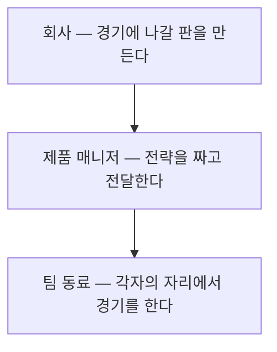

[앞 편](/blog/product-management/data-driven-project-walkthrough/)은 목표를 세우는 자리에서 결과를 되짚는 자리까지 한 바퀴를 따라갔다. 그 여덟 단계 어디에도 혼자 끝나는 칸은 없었다. 우선순위를 정할 때는 설득할 상대가 있었고, 요구사항을 넘길 때는 받는 쪽이 있었으며, 결과를 읽을 때는 함께 읽을 사람이 있었다.

**이 편은 그 상대들의 묶음, 곧 팀 자체를 본다.** 팀이라는 낱말이 무엇을 가리키는지, 그것을 좋게 만든다는 말이 어떤 행위를 뜻하는지, 그리고 애자일이라 부르는 조직에서 그 행위가 왜 더 자주 필요해지는지다.

먼저 한 가지 오해를 걷어 내야 한다. 팀 빌딩을 **사람을 뽑는 일로 이해하는 경우가 많은데 그렇지 않다.** 채용은 그 안에서 벌어지는 한 계기일 뿐이고, 뽑을 사람이 없는 상황에서도 팀 빌딩은 계속된다.

⚠️ **이 그림에 끝나는 지점이 없다는 것이 이 편의 전제다.** 목표가 달라지면 팀의 형태도 달라져야 하므로, 한 번 맞춰 놓고 두는 종류의 일이 아니다. 아래는 그 순환을 정의 · 판별 · 조직 형태의 세 층으로 나눠 본다. 직무와 직급과 직책을 가르는 이야기는 다음 편의 몫이므로 여기서는 자리 이름을 다루지 않는다.

## 한 사람으로는 팀이 되지 않는다

팀은 **목표를 이루기 위해 협력해야 하는 가장 작은 단위의 무리**다. 정의에 협력이 들어 있으므로 한 사람으로 이루어진 팀이라는 말은 성립하지 않는다. 운동 경기에서 쓰는 팀과 회사에서 쓰는 팀이 다른 뜻이라고 볼 이유도 없다. 둘 다 같은 조건을 요구한다.

여기서 실무에 영향을 주는 성질이 하나 나온다. **이루려는 목표가 달라지면 팀의 형태도 달라진다는 것이다.** 신규 서비스를 띄우는 목표와 이미 있는 서비스의 이탈을 줄이는 목표는 필요한 사람의 구성이 다르고, 같은 사람들로 짜여 있어도 서로 무엇을 기대해야 하는지가 달라진다. 조직문화에 따라서도 그 형태는 여러 갈래로 나타난다.

그래서 팀을 다듬는 일은 상태를 한 번 만들어 놓는 작업이 아니라 **계속 이어지는 행위**가 된다. 구체적으로는 네 가지가 포개져 있다.

| 하는 일 | 무엇을 정하나 |
| --- | --- |
| 목표와 방향의 합의 | 단기 · 중기 · 장기로 나눠 팀원과 같은 그림을 갖는 일 |
| 역할과 책임의 분담 | 그 목표에 닿기 위해 각자가 무엇을 맡을지 정하는 일 |
| 과정에서의 소통 | 정해 둔 것이 어긋나기 시작할 때 그것을 드러내는 일 |
| 형태의 재조정 | 목표가 바뀌었을 때 앞의 셋을 다시 맞추는 일 |

**이 표가 말하는 것**: 네 가지 가운데 채용에 해당하는 항목이 하나도 없다. 사람을 새로 들이는 일은 두 번째 칸을 채우는 여러 방법 가운데 하나이고, 있는 사람들의 역할을 바꾸는 것도 같은 칸을 채운다. 채용을 팀 빌딩과 같은 말로 쓰면 **뽑을 자리가 없는 조직에서는 할 일이 없다는 결론**이 나오는데, 실제로는 그 조건에서도 위의 네 가지가 모두 남는다.

## 다른 직무에서는 리더의 일이고 여기서는 기본 업무다

제품을 맡는 사람에게 이 일이 특별한 이유는 책임의 크기가 아니라 **책임이 걸리는 자리**에 있다.

| 관점 | 이 직무에서 뜻하는 것 |
| --- | --- |
| 소속 | 제품 매니저가 한 명인 회사는 있어도, 제품 매니저만으로 이루어진 팀은 없다 |
| 성과 | 개인의 성장만큼 팀의 성과와 성장이 평가의 대상이 된다 |
| 영향 | 일하는 방식과 팀의 분위기에 미치는 영향이 다른 직무보다 크다 |
| 차별성 | 다른 직무에서는 리더급이 챙기는 일이지만 여기서는 직급과 무관한 기본 업무다 |
| 관여의 정도 | 제품 오너는 팀 채용에 깊이 관여하고 구성원의 성장을 가까이에서 본다. 다만 인사 평가를 맡는 자리는 아니다 |

**이 표가 말하는 것**: 네 번째 칸이 나머지를 설명한다. 조직도에서 사람을 관리하는 자리에 있지 않아도 이 일이 업무에서 빠지지 않는다. 여러 직무가 섞인 팀에서 무엇을 먼저 할지 정하고 그 결정을 설명하는 사람이 곧 팀의 일하는 방식을 정하기 때문이다. **자리에서 나오는 권한이 아니라 하는 일의 성격에서 나오는 책임이다.**

## 감독이 없어도 경기는 열리지만 이기기는 어렵다

이 관계를 설명할 때 자주 쓰이는 비유가 운동 경기의 지휘자다.

비유에서 얻을 것은 위아래가 아니라 **양쪽 모두가 없으면 성립하지 않는다는 점**이다.

| 자리 | 이 비유가 말하는 것 |
| --- | --- |
| 지휘하는 쪽 | 뛰어 본 사람일 수도 있고 그렇지 않을 수도 있다. 처음부터 이 직무로 경력을 시작하기는 쉽지 않고 다른 직군에서 옮겨 오는 경우가 많다. **더 중요한 쪽이라고 말할 근거는 없다** — 뛰는 사람이 없으면 경기 자체가 열리지 않는다 |
| 뛰는 쪽 | 각자의 자리에서 같은 목표를 향해 최선을 다한다. 지휘하는 사람 없이도 경기는 할 수 있으나, **정해 둔 목표에 닿기는 어려워진다** |

여기서 규모에 관한 관찰이 하나 따라 나온다. **동네에서 하는 경기에 가까울수록 지휘자의 몫이 작고, 전문화된 경기에 가까울수록 커진다.** 사람이 적을 때는 서로가 서로의 일을 다 보고 있어서 조율이 저절로 되지만, 인원이 늘고 팀이 여럿으로 갈리면 그 시야가 끊긴다. 조직이 커질 때 갑자기 정렬이 어려워지는 이유가 사람들이 나빠져서가 아니라 **서로를 보던 시야가 사라졌기 때문**이라는 설명이 여기서 나온다.

그 자리에서 요구되는 것을 다섯으로 정리하면 이렇게 된다.

1. 목표에 맞는 구성으로 팀을 짠다.
2. 꾸준한 소통과 협업으로 팀워크를 만들어 낸다.
3. 비전과 목표에 대한 정렬을 강하게 잡는다.
4. 전략과 실행 계획을 분명하게 전달한다.
5. **팀원의 장점을 끌어내고 신뢰를 쌓는다.**

앞의 넷은 일에 관한 것이고 다섯째만 사람에 관한 것인데, 다음 절에서 보듯 좋은 팀과 나쁜 팀을 가르는 자리는 바로 그 다섯째다.

## 신뢰가 없으면 같은 결과도 운으로 읽힌다

좋은 팀과 나쁜 팀을 성과의 크기로 가르면 판정이 틀린다. 축이 둘이기 때문이다.

| | 좋은 팀 | 나쁜 팀 |
| --- | --- | --- |
| 한 줄 정의 | 신뢰를 바탕으로 성과가 나는 팀 | 신뢰도 없고 성과도 낮은 팀 |
| 왜 그렇게 보나 | 개인의 역량이 뛰어나고 협업이 잘 되더라도 끝내 팀 단위의 결과가 따라와야 한다. 그 결과는 우연히 나오기도 하는데, **신뢰가 쌓여 있으면 그 우연조차 만들어 낸 것으로 읽힌다** | 개인의 역량이 아무리 좋아도 협업이 되지 않으면 성과가 이어지지 않는다. 결과가 좋아도 신뢰가 없으면 **운이 따랐던 것으로 읽힌다** |
| 어떻게 끝나나 | 오래 함께 일하고 싶어지고 팀과 함께 개인도 빠르게 자란다 | 낮은 성과와 무너진 신뢰가 겹쳐 팀을 해체할 사유가 된다 |

**이 표가 말하는 것**: 가운데 줄의 두 문장이 서로 대칭이다. 같은 결과를 두고도 신뢰가 있으면 실력으로, 없으면 운으로 읽힌다. 성과 하나만 관리하면 **좋게 끝난 분기에도 팀에 대한 평판이 오르지 않는 상황**이 생기는데, 그때 무엇이 빠졌는지는 성과 지표를 아무리 들여다봐도 나오지 않는다.

## 만드는 목록과 막는 목록은 같은 목록이 아니다

좋은 팀을 만들기 위한 노력을 다섯으로 나누면 이렇게 된다.

| # | 항목 | 무엇을 하는 것인가 |
| :---: | --- | --- |
| 1 | 구성을 목표에 맞춘다 | 새로 만드는 조직인지 이미 있는 조직인지에 따라 다르게 접근한다. 회사의 문화와 맞는지를 먼저 보고, 그다음에 팀의 목표에 맞는지를 본다 |
| 2 | 계속 고쳐 나간다 | 피드백으로 나아지게 한다. 개인이 배우는 속도와 변화에 대응하는 힘도 여기 들어간다 |
| 3 | 역할과 기대치를 맞춘다 | 같은 역할을 나눠 맡을 수 없고 상대에게 거는 기대도 저마다 다르므로 **이른 시점에 드러내 놓고 맞춘다** |
| 4 | 신뢰와 존중 위에서 말한다 | 보이지 않는 결속을 높여 협업을 낫게 한다. 의견 충돌과 오해를 풀어 **쓸데없는 소모를 줄인다** |
| 5 | 각자의 강점을 쓴다 | 사람을 온전히 알 수는 없지만 알아보려는 시도를 멈추지 않는다. 성과와 동기를 함께 올린다 |

나쁜 팀이 되지 않기 위한 노력도 다섯인데, 목록의 성격이 다르다. **앞의 것이 무엇을 할지의 목록이라면 이쪽은 방치하면 무엇이 벌어지는지의 목록이다.**

| # | 항목 | 그냥 두면 |
| :---: | --- | --- |
| 1 | 지나치다 싶을 만큼 말한다 | 효율이 떨어지고 오해와 혼선이 생기며, 정보가 없어 일정이 밀린다. **일정이 밀리는 것은 곧 성과의 문제다** |
| 2 | 피드백 없는 분위기를 두지 않는다 | 감정의 골이 깊어지고 결과물의 질이 떨어져 결국 쓰는 사람에게까지 간다 |
| 3 | 역할과 기대치를 흐리지 않는다 | 역량을 넘는 기대는 부담이 되고, 책임이 흐리면 같은 일을 둘이 하거나 일정이 밀린다 |
| 4 | 두서없는 충돌을 막는다 | 의견이 부딪히는 것 자체는 나쁘지도 좋지도 않다. 문제는 **두서없이 부딪히는 방식과 존중하지 않는 태도**이며, 그것이 갈등과 긴장을 만든다 |
| 5 | 일의 몫을 고르게 나눈다 | 한쪽은 과부하가 되고 다른 쪽은 손을 놓게 되어 불만이 쌓인다 |

**이 표가 말하는 것**: 다섯째가 실제로 가장 자주 터진다. 잘하는 사람에게 일이 몰리는 현상은 사람이 적고 역할의 경계가 느슨한 조직일수록 심해지는데, 그 조직일수록 **일을 덜어 줄 다른 사람도 없다.** 앞 표의 다섯째(강점을 쓴다)와 이 표의 다섯째(몫을 고르게 나눈다)가 정면으로 부딪히는 자리이기도 하다. 강점을 쓰는 쪽으로만 최적화하면 잘하는 사람에게 계속 몰린다.

두 목록의 관계를 정리하면 이렇다. **좋은 팀을 만드는 다섯을 다 해도 나쁜 팀이 되는 다섯 가운데 하나가 남아 있으면 그것이 결과를 지배한다.** 앞의 것은 잘 되고 있을 때 더 좋게 만드는 힘이고, 뒤의 것은 무너질 때 무너지는 속도를 정하기 때문이다.

## 애자일은 방법론의 이름이 아니라 움직이는 방식이다

조직 형태로 넘어간다. 애자일 조직을 이야기할 때 먼저 걷어야 할 오해는 **그것이 특정한 개발 방법론을 도입한 상태를 가리킨다는 생각**이다.

| 처음과 끝을 미리 정하는 방식 | 나눠서 굴리는 방식 |
| --- | --- |
| 순서를 정해 두고 차례로 넘긴다. 기획에서 디자인으로, 디자인에서 개발로, 그다음 마케팅과 검토를 거쳐 내보낸다 | 요구가 도중에 바뀌어도 다음 주기에 반영한다. 일을 작게 잘라 목표 단위로 접근하고, 제품 · 디자인 · 개발 · 품질 · 분석이 한자리에서 움직인다 |

여기서 오른쪽 칸의 상태를 애자일 조직이라 부른다. 스크럼 같은 특정 절차를 쓰지 않아도 상관없다. **빠르고 유연하게 움직인다는 뜻으로 통용되며, 소통하는 방식부터 결재의 단계를 줄이고 실행에 무게를 둔다.** 기본적으로 수평에 가까운 구조인데, 그래야 결정이 빠르고 그 근거가 드러나기 때문이다. 직무와 무관하게 쓰는 사람을 중심에 두고 제품에 의견을 낸다는 것도 이 형태의 특징이다.

절차를 갖춘 형태 가운데 가장 자주 쓰이는 것이 **스크럼 팀**이다. 제품의 방향을 정하는 사람, 팀이 굴러가게 하는 사람, 그리고 실제로 만드는 사람들의 세 역할로 이루어지고, 마지막 묶음에는 개발자만이 아니라 테스트와 디자인과 운영이 함께 들어간다. 한 팀 안에서 필요한 기능이 모두 갖춰져 있어야 밖으로 넘기지 않고 끝낼 수 있다는 발상이다.

## 형태가 자주 바뀌는 조직일수록 다듬는 일이 잦아진다

이 형태에서 팀을 다듬는 일이 더 중요해지는 이유는 셋이다.

1. **권한과 책임이 팀 쪽에 많이 내려온다.** 순서대로 넘기는 조직보다 팀이 정할 수 있는 것이 많으므로 기회도 많고 그만큼 결과에 미치는 영향도 크다.
2. **구성과 역할이 수시로 바뀐다.** 목표에 맞춰 사람과 역할을 유연하게 옮기므로 다듬는 일이 상시 업무가 되고, 그것이 매끄럽지 않으면 곧바로 비효율로 나타난다.
3. **여러 직무가 한 목표로 모인다.** 같은 직무끼리 모인 팀보다 서로를 맞추는 데 더 많은 품이 들고, 그 품을 들이지 않으면 쉽게 흐트러진다.

그래서 앞에서 본 다섯 가지에 두 가지가 더 붙는다.

| 더해지는 항목 | 무엇을 하는 것인가 |
| --- | --- |
| 결정의 속도와 투명성 | 팀 안에서 일이 막히지 않게 해 비효율이 생기기 전에 끊는다 |
| 실험 | 속도와 어긋나는 것처럼 보이지만, **실행하면서 나오는 실패는 배움으로 남는다** |

**이 표가 말하는 것**: 두 항목이 서로를 견제한다. 속도만 남기면 실험할 여유가 없어지고, 실험만 남기면 결정이 늦어진다. 둘을 함께 적어 두는 이유가 여기에 있다.

## 국내에서 어려운 것은 제도가 아니라 앞선 조건이다

이 형태가 국내 조직에서 잘 자리 잡지 않는다는 이야기는 자주 나온다. 이유를 제도의 차이로 돌리면 답이 나오지 않는데, **막는 것이 인사 제도가 아니라 그 앞에 있는 조건들**이기 때문이다.

| 국내에서 어려운 이유 | 밖에서 성립하는 이유 |
| --- | --- |
| 인사 절차가 아니라 회사의 문화에 가깝다. 위에서 하자고 해서 되는 것이 아니고, 일부 조직만 참여하는 방식으로도 되지 않는다 | 이 방식의 핵심이 협력과 피드백인데, 일하는 방식과 대화하는 방식이 이미 그렇게 굳어져 있다 |
| 결과보다 과정을 중요하게 봐야 성립하는데, 시간과 자금이 빠듯하면 결과를 볼 수밖에 없다 | 시장 환경의 제약이 비교적 덜하고 들어오는 투자의 규모가 다르다 |
| 팀을 다듬는 일이 중요한데 **그 방법도 경험도 축적되어 있지 않다.** 형식만 갖춘 경우가 많다 | 회사가 이 일을 적극적으로 뒷받침한다. 멘토링과 유대를 만드는 프로그램이 따로 있다 |
| 흐름의 변화에는 빠르게 대응하지만 예측하기 어려운 위기 앞에서는 아직 위쪽의 판단에 기대게 된다 | **스스로 꾸려 나가게 한다.** 자율과 책임을 함께 주어 결정에 참여할 동기를 만들고, 그것이 다시 참여도를 높인다 |

**이 표가 말하는 것**: 왼쪽 세 번째 줄이 가장 실무적이다. 방법과 경험이 없다는 것은 시간이 지나면 해결되는 종류의 문제이지만, 그 사이에 **형식만 갖춘 상태가 굳어 버리면 그다음이 더 어려워진다.** 결재 단계를 줄이겠다고 선언한 조직에 여전히 서열이 남아 있는 상태가 그렇다.

여기서 한 가지 경고가 나온다. 국내에서는 이 형태를 도입했는지로 회사의 성패를 가를 수 없다. 그런데도 **그 형태를 갖췄다는 사실 자체를 강점으로 내세우려는 경향이 있다.** 갖춘 형태가 아니라 그 형태로 무엇을 더 빨리 해냈는지가 근거가 되어야 하는데, 앞의 것만 말하면 검증할 수 있는 것이 남지 않는다.

부서끼리 벽을 세우고 오가지 않게 되는 **사일로**는 이 논의에서 반대편에 놓인다. 형태를 수평으로 바꿔도 각 팀이 자기 안에서만 정보를 돌리면 결정의 투명성은 오르지 않는다. 조직도의 모양과 정보가 흐르는 모양이 같지 않을 수 있다는 것이 이 낱말이 가리키는 지점이다.

## 이 편이 쓴 용어

아래 다섯은 [지도편](/blog/product-management/pm-practice-map/)이 이 편에 배정해 둔 낱말이다. 지도편의 풀이가 여덟 편을 관통하는 정의라면, 여기서는 **팀을 이야기하는 문맥에서 그 말이 어디에 놓였는지**를 적는다.

| 용어 | 이 편에서 놓인 자리 |
| --- | --- |
| 팀 빌딩 (Team Building) | 목표에 맞춰 팀의 상태를 계속 다듬는 일. 채용은 그 안의 한 계기이며 전부가 아니다 |
| 애자일 조직 | 결재 단계를 줄이고 실행에 무게를 두는 조직. 특정 방법론의 도입 여부로 판정하지 않는다 |
| 스크럼 팀 (Scrum Team) | 방향을 정하는 역할, 팀을 굴러가게 하는 역할, 만드는 역할로 이루어진 팀. 만드는 쪽에 테스트와 디자인과 운영이 함께 들어간다 |
| 자기조직화 | 밖에서 누르지 않아도 스스로 팀을 꾸려 나가는 상태. 자율과 책임을 함께 줄 때 생긴다 |
| 사일로 (Silo) | 부서끼리 벽을 세우고 오가지 않게 되는 현상. 구조를 수평으로 바꿔도 따로 생길 수 있다 |

앞 편들과의 관계를 한 줄로 두면, [편2](/blog/product-management/product-cycle-and-metric-hierarchy/)가 무엇을 위에 둘지를, [편3](/blog/product-management/why-data-and-metric-dictionary/)이 그 값을 어떻게 셀지를, [편4](/blog/product-management/data-driven-project-walkthrough/)가 그것으로 무엇을 정했는지를 다뤘다. **이 편은 그 세 가지를 실제로 하는 사람들의 묶음을 본다.**

## 정리

세 가지가 남는다.

**첫째, 팀을 다듬는 일에는 끝나는 지점이 없다.** 목표가 바뀌면 필요한 구성과 서로에 대한 기대도 바뀌므로, 한 번 맞춰 놓은 상태는 다음 목표에서 다시 어긋난다. 채용을 이 일과 같은 말로 쓰면 **뽑을 자리가 없는 조직에서는 할 일이 없다는 결론**이 나오는데, 실제로는 합의와 분담과 소통이 그대로 남는다.

**둘째, 판정의 축이 둘이다.** 성과만 보면 좋은 팀과 운이 좋았던 팀이 구분되지 않고, 신뢰만 보면 사이는 좋은데 결과가 없는 팀을 좋다고 말하게 된다. **같은 결과가 신뢰의 유무에 따라 실력으로도 운으로도 읽힌다**는 것이 이 축을 둘로 두어야 하는 이유다.

**셋째, 형태를 바꾸는 것과 방식을 바꾸는 것은 다른 일이다.** 결재 단계를 줄이겠다고 선언해도 정보가 팀 안에서만 돌면 결정은 빨라지지 않는다. 국내에서 어렵다고 말할 때 지목해야 하는 것은 제도가 아니라 **그 앞에 놓인 대화의 방식과 축적된 경험**이다.

여기까지가 팀이라는 낱말의 안쪽이다. 그런데 실제 조직에서 사람들은 팀에만 속해 있지 않다. 직무가 있고 직급이 있으며 그것과는 또 다른 직책이 있는데, 이 셋이 자주 뒤섞여 쓰인다. **다음 편은 그 세 낱말을 갈라 놓고, 국내 조직문화가 실제로 어떻게 다른 모양을 하고 있는지를 세 유형으로 비교한다.**
