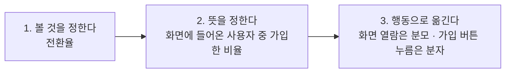
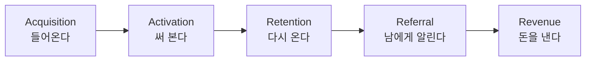

[앞 편](/blog/product-management/product-cycle-and-metric-hierarchy/)은 지표를 사슬로 이어 두는 데까지 왔다. 어느 값이 어느 값을 움직이는지 미리 적어 두어야 값 하나가 올랐다는 소식을 판정할 수 있다는 것이었다.

그런데 그 칸에 실제로 값을 채우려고 하면 다른 문제가 시작된다. **「전환율 20%」라는 말은 무엇을 분모로 삼았는지를 함께 말하지 않으면 아무것도 특정하지 못한다.** 같은 이름을 쓰면서 서로 다른 값을 보는 상태는 오래 유지될 수 있고, 그때는 지표를 나란히 놓는 일 자체가 성립하지 않는다.

이 편은 값을 세는 자리를 다룬다. 그 값으로 무엇을 바꿨는지는 다음 편의 몫이고, 여기서는 **무엇을 어떤 기준으로 세는가**만 본다.

## 같은 요청인데 하나만 통과하는 이유

같은 개선을 요청하는 두 사람을 나란히 놓으면 이 차이가 드러난다. 회원가입 화면을 고치자는 요청이고 대상도 같다.

| 물음 | 앞사람 | 뒷사람 |
| --- | --- | --- |
| 왜 개선해야 하는가 | 회원가입이 불편하기 때문이다 | 회원가입 화면의 전환율이 **20%다**. 데려온 사용자의 80%가 가입하지 않고 떠나므로, 고치면 확보하는 수가 늘어난다 |
| 배포한 뒤의 반응은 | 써 보니 이전보다 편해졌다 | 전환율이 **두 배인 40%가** 되었고 한 달에 3만 명가량을 더 확보했다. 이탈을 더 줄이려고 문구와 쿠폰을 검토하고 있다 |

**두 답의 차이는 성의가 아니라 검증 가능성이다.** 앞사람의 문장은 참인지 거짓인지 밖에서 확인할 방법이 없고, 뒷사람의 문장은 같은 방법으로 다시 재면 누구나 확인할 수 있다. 확인할 수 있는 문장만이 다음 요청의 근거로 쌓인다.

근거가 놓이지 않으면 그 자리는 다른 것으로 채워진다. 그 상태를 가리키는 낱말이 **최고 연봉자의 의견**인데, 문제가 되는 이유는 그 감각이 틀려서가 아니라 **사후에 확인할 수 없기 때문이다.** 근거 없이 내린 결정은 성공해도 왜 성공했는지 남지 않는다.

⇒ 데이터를 근거로 삼는 일의 값어치는 **결정의 객관성**과 **시도에서 교훈을 남기는 것** 둘로 갈린다. 뒤엣것이 흔히 빠지는데, 결과를 재지 않으면 실패한 시도는 그냥 사라진다.

## 전환율 하나를 보려면 먼저 정해야 할 것이 있다

전환율을 보겠다고 정한 다음에도 바로 볼 수 있는 것은 없다. 그 값을 만들려면 **분모와 분자를 사용자의 행동으로 옮겨 적어야 하고**, 그 행동이 기록되고 있어야 한다.

세 칸이 각각 다른 종류의 결정이다. 무엇을 보기로 할 것인가, 그 말을 어느 범위로 한정할 것인가, 그 범위를 시스템이 기록하는 사건으로 어떻게 바꿀 것인가이다. **셋째 칸에서 막히면 앞의 두 칸이 아무리 정확해도 값은 나오지 않는다.**

여기서 「시작은 기록하기」라는 말이 나온다. 무엇을 기록할지는 무엇을 보기로 했는지가 정해진 다음에야 정할 수 있고, 순서가 뒤집히면 쌓이는 것은 데이터가 아니라 용량이다.

## 분석을 남에게 넘기면 잃는 것

값을 세는 일을 분석 담당자에게 넘기면 편해 보이지만, 직접 보아야 하는 이유가 셋 있다.

| 이유 | 무엇을 잃게 되는가 |
| --- | --- |
| 기능 이해도 | 그 기능이 무엇을 하려는 것인지 가장 잘 아는 사람이 요구사항을 쓴 사람이다. 조건을 옮겨 적는 과정에서 그 이해가 빠진다 |
| 확인까지의 시간 | 답을 받는 사이에 다음 질문이 떠오르는데, 그것이 매번 대기열에 들어가면 파고들기가 끊긴다 |
| 되풀이로 붙는 감각 | 값을 자주 본 사람만 이상한 값을 이상하다고 느낀다. 이 감각은 설명으로 옮겨지지 않는다 |

**셋째 줄이 앞의 둘과 성격이 다르다.** 앞의 둘은 넘기는 순간 잃는 것이고 셋째는 넘기는 동안 붙지 않는 것이므로, 한 번의 위임은 손해가 작은데 관행이 되면 되돌리기 어려워진다.

## 무엇을 했는가와 왜 했는가는 다른 데이터가 답한다

값을 세는 일에는 처음부터 한계가 하나 있다. 숫자는 무슨 일이 일어났는지를 말하지만 왜 일어났는지는 말하지 않는다.

| 견주는 자리 | 정량적 데이터 | 정성적 데이터 |
| --- | --- | --- |
| 답하는 물음 | 고객이 **무엇을** 했는가 | 고객이 **왜** 그렇게 했는가 |
| 생김새 | 회원가입 전환율 20% | 주로 출근 시간대에 앱을 연다 |
| 강점 | 문제를 특정하고 행동의 흐름을 내다본다 | 원인을 짚고 드러나지 않은 동기를 찾는다 |
| 한계 | **왜인지를 알기 어렵다** | 규모와 대표성을 갖추기 어렵다 |

**두 한계가 서로의 강점과 정확히 맞물린다.** 그래서 둘은 고르는 문제가 아니라 순서의 문제가 된다. 정성부터 시작하면 들은 이야기가 얼마나 넓게 퍼진 문제인지 알 수 없고, 정량에서 멈추면 고칠 자리를 못 찾은 채 숫자만 남는다.

## 퍼널 다섯 구간에 지표를 걸어 둔다

지표를 늘어놓기 전에 걸어 둘 자리가 필요하다. 널리 쓰이는 틀은 사용자가 지나는 길을 다섯 구간으로 끊는다.

이 다섯 구간이 [지도편](/blog/product-management/pm-practice-map/)의 용어표에 **퍼널**로 올라 있는 그것이다. 아래 표는 구간마다 무엇을 세는지를 겹쳐 놓았다.

| 구간 | 지표 | 무엇을 세는가 |
| --- | --- | --- |
| 전체 | **핵심 성과 지표** | 목표를 이루려고 정한 행동들의 성패를 재는 값. 나머지는 이것 아래에 놓인다 |
| 유입 | **유입 사용자** | 서비스로 들어오는 사용자. 광고를 타고 온 쪽과 찾아온 쪽을 갈라 센다 |
| 유입 | **페이지 열람 수** | 화면이 열린 **횟수** |
| 유입 | **순사용자 수** | 그 행동을 한 **사람의 수** |
| 유입 | **이탈률** | 들어온 화면에서 다른 화면으로 넘어가지 않고 떠난 비율 |
| 활성 | **전환율** | 서비스가 의도한 행동을 실제로 한 비율 |
| 활성 | **가치를 느끼는 첫 순간** | 이 제품이 왜 필요한지 처음 실감하는 지점 |
| 활성·유지 | **활성 사용자** | 정한 기간 안에 서비스를 쓴 사람의 수. 하루·한 주·한 달로 나눠 본다 |
| 유지 | **잔존율** | 처음 쓴 뒤에 남아 있는 비율. 하루 뒤·한 주 뒤·한 달 뒤로 나눠 센다 |
| 유지 | **이탈률** | 서비스 사용 자체를 그만둔 사용자의 비율 |
| 전체 | **비교 실험** | 둘 이상의 안 가운데 나은 쪽을 고르려고 돌리는 실험 |
| 전체 | **사용자 구분** | 조건을 공유하는 사용자끼리 묶어 나누는 일 |

**행을 구간으로 겹친 이유는 지표가 혼자서는 자리를 갖지 못하기 때문이다.** 같은 「이탈률」이 유입과 유지에 한 번씩 나오는데 두 값은 이름만 같고 세는 대상이 다르다. 이름순으로 늘어놓았다면 그 둘이 나란히 붙어 같은 것처럼 보였을 것이다.

어긋나기 쉬운 쌍이 둘 더 있다. **페이지 열람 수와 순사용자 수**는 횟수와 사람 수라서, 한 사람이 열 번 열면 앞은 10이고 뒤는 1이다. 앞의 값을 사람 수로 읽으면 규모를 열 배로 잘못 본다. **두 이탈률**은 이름이 같아 표에서 구분되지 않는데, 화면 이탈이 줄었다고 사용자가 남았다는 뜻은 아니다. **두 쌍 모두 세는 쪽이 아니라 읽는 쪽에서 어긋나므로**, 이름 옆에 세는 대상을 함께 적어야 닫힌다.

## 활성 사용자는 신규와 잔존이 겹쳐 쌓인다

하루 단위 활성 사용자를 예로 들면, 그날의 값은 그날 새로 들어온 사람만으로 만들어지지 않는다. 앞선 날에 들어와 아직 남아 있는 사람이 함께 셈에 들어간다.

| 날짜 | 신규 | 앞선 날에서 남은 사람 | 그날의 활성 사용자 |
| --- | ---: | ---: | ---: |
| 첫날 | 100 | — | 100 |
| 둘째 날 | 100 | 전날의 10% | 110 |
| 셋째 날 | 100 | 앞선 이틀에서 누적 | 115 |

신규 유입이 100으로 고정되어 있는데도 값이 오르는 것은 잔존이 겹쳐 쌓이기 때문이다. 뒤집으면 **잔존율이 떨어지는 동안에도 신규를 늘리면 활성 사용자 수는 오를 수 있고**, 그 상태를 성장으로 읽으면 유입을 멈추는 순간 값이 무너지는 이유를 설명하지 못한다.

여기서 필요해지는 것이 **사용자 구분**이다. 전체 잔존율이 50%인 상황에서 조건별로 갈라 보면 한쪽은 10%, 다른 쪽은 90%인 그림이 나올 수 있다. 두 그림에서 할 일은 완전히 다른데 **뭉쳐 놓은 평균은 그 차이를 정확히 가린다.**

## 왜를 묻는 다섯 가지 방법

정량이 문제를 특정한 뒤에는 원인을 물어야 하고, 그 물음에 답하는 방법은 다섯 갈래로 정리된다. 어느 것을 고를지는 **지금 무엇이 없는지**가 정한다.

| 방법 | 무엇을 하는가 | 언제 고르는가 |
| --- | --- | --- |
| **정황 조사** | 사용하는 상황에 직접 들어가 곁에서 관찰하고 그 자리에서 묻는다 | 환경이나 사용자가 특수한 서비스, 아직 만들 것이 정해지지 않은 초기 |
| **설문** | 특정 집단에 질문지를 돌린다 | 짧은 기간에 많은 응답이 필요할 때. **질문이 답을 유도하지 않아야** 한다 |
| **면담** | 한 명을 깊이 파고들거나, 공통점을 가진 여러 명을 한자리에서 만난다 | 사용자 데이터가 없고, 드러나지 않은 불편을 찾아야 할 때 |
| **사용성 테스트** | 써 보게 하고 어디서 막히는지 관찰한다. 진행자와 관찰자를 두고 **소리 내어 생각하게** 한다 | 만져 볼 것이 있고, 막힐 자리가 짐작될 때 |
| **고객의 소리** | 들어온 문의와 의견을 모아 읽는다 | 운영 중이고, 흩어진 불만에서 덩어리를 찾을 때 |

**다섯 줄의 「언제」 칸이 서로 배타적이다.** 만들 것이 정해지지 않았으면 사용성 테스트를 할 대상이 없고, 운영 중이 아니면 고객의 소리는 모이지 않는다. 그래서 이 표는 방법의 목록이라기보다 **지금 쓸 수 있는 것이 무엇인지 확인하는 표**로 읽는 편이 맞다.

## 직접 만날 것인가 이미 있는 것을 볼 것인가

다섯 방법은 모두 사용자를 직접 만나는 쪽이다. 그렇게 하기 어려울 때 쓰는 다른 갈래가 있고, 둘은 비용과 전제가 다르다.

| 견주는 자리 | 직접 만나는 조사 | 이미 조사된 것을 보는 조사 |
| --- | --- | --- |
| 하는 일 | 관찰하거나 이야기를 주고받으며 사용자를 이해한다 | 앞서 조사된 내용을 모아 읽는다 |
| 언제 고르는가 | 물어볼 대상에 닿을 수 있고, 확인할 가설이 있을 때 | 데이터를 모으기 어려울 때 · 빠르고 싸게 훑어야 할 때 · **아직 가설이 없을 때** |

**오른쪽 칸의 마지막 조건이 이 표의 요점이다.** 가설이 없는 상태에서 사용자를 만나면 무엇을 물어야 할지 정해지지 않아 시간이 흩어진다. 그때는 이미 있는 자료로 가설을 먼저 세운다.

이 갈래에는 손댈 자리가 넷 있다 — **기사와 뉴스**, **공공 통계**, **학술 자료**, 그리고 **다른 서비스를 견주어 보는 일**이다. 마지막 것은 성격이 달라서, 대상을 고르고 자료를 모아 견준 뒤 무엇을 가져올지 판단하는 과정이 따로 필요하다. **견주기는 자료 수집이 아니라 판단이다.**

## 숫자가 가리킨 자리와 원인이 달랐다

마지막 사례는 두 데이터가 맞물리는 방식을 한 바퀴로 보여 준다. 가상자산을 거래하려면 여러 단계의 인증을 거치는데, 단계별 전환율을 재니 한 곳이 뚜렷하게 낮았다.

| 단계 | 전환율 |
| --- | ---: |
| 이메일 인증 | 52% |
| **실명 인증** | **16%** |
| 계좌 등록 | 32% |

정량 데이터는 여기까지 말한다. 실명 인증 단계에서 사람이 빠진다는 것이다. 세운 가설은 「인증 절차가 불편해서 떨어진다」였고, 확인하려고 사용성 테스트를 붙였다. 과제는 가입한 뒤 실제로 거래해 보는 것이었고, 소리 내어 생각하게 했더니 나온 말은 두 가지였다.

> 「무엇을 해야 하지?」 — 거래에 필요한 과정이 있다는 것 자체를 알지 못한다.
>
> 「어디 있지?」 — 해야 할 기능이 어디에 있는지 찾지 못한다.

**둘 다 불편함에 대한 말이 아니다.** 막힌 것은 절차의 번거로움이 아니라 **인지와 탐색**이다. 정량에서 멈춘 채 절차 간소화에 자원을 넣었다면 전환율은 그대로 남았을 것이고, 그때도 숫자는 「아직 덜 간소화되었다」고 읽혔을 것이다.

⚠️ **이 흐름에서 가설이 기각된 자리가 중요하다.** 정량이 특정한 것은 **어디서** 빠지는지이고 정성이 답한 것은 **왜** 빠지는지다. 가설은 그 사이를 잇는 임시 다리이므로 **틀린 가설을 검증 없이 실행으로 옮기는 것이 손실이지, 가설이 틀린 것 자체는 손실이 아니다.**

## 이 편이 쓴 용어

[지도편](/blog/product-management/pm-practice-map/)이 의 용어표가 이 편 몫으로 남겨 둔 것들 가운데 본문에 실제로 나온 것이다. 그 표가 여덟 편에 두루 통하는 뜻을 담았다면, 아래는 **이 편의 문맥에서 그 말이 무엇을 가리켰는지**를 적는다.

| 용어 | 이 편에서 가리킨 것 |
| --- | --- |
| 최고 연봉자의 의견 | 근거가 놓이지 않은 자리를 직급이 대신 채운 상태. 사후에 확인할 수 없어서 문제가 된다 |
| 퍼널 | 지표를 걸어 두는 자리. 구간이 있어야 같은 이름의 지표가 어느 층의 것인지 갈린다 |
| 이탈률 두 가지 | 화면을 떠난 것과 서비스를 그만둔 것. 한국어 이름이 같아 표에서 구분되지 않는다 |
| 사용자 구분 | 뭉쳐 있는 평균을 조건별로 갈라 서로 다른 그림을 드러내는 일 |
| 소리 내어 생각하기 | 사용성 테스트에서 원인을 꺼내는 장치. 앞 사례의 가설을 기각한 것이 여기서 나왔다 |

제품을 만들 문제를 어느 채널로 찾는지는 [앞 시리즈의 마이데이터 편](/blog/product-management/mydata-and-market-structure/)이 여섯 갈래로 세어 두었다. 그쪽이 **어디서 문제가 들어오는가**를 나눴다면, 이 편은 그 가운데 사용자를 만나는 채널들을 **어떻게 하는가**로 푼 것이다.

## 정리

세 가지가 남는다.

**첫째, 지표의 이름은 값을 특정하지 못한다.** 「전환율 20%」는 분모를 무엇으로 잡았는지를 함께 말해야 확인 가능한 문장이 되고, 그런 문장만이 다음 요청의 근거로 쌓인다. 같은 이름을 쓰면서 다른 값을 보는 상태는 조용해서 오래 간다.

**둘째, 숫자는 어디까지만 답한다.** 정량은 어느 자리에서 빠지는지를 특정하고 멈추며, 왜 빠지는지는 사람을 만나야 나온다. 두 한계가 서로의 강점과 맞물리므로 고르는 문제가 아니라 순서의 문제다.

**셋째, 뭉쳐 놓은 값은 차이를 가린다.** 잔존율 50%가 실제로는 10%와 90%의 평균일 수 있고 그 둘에서 할 일은 다르다. **평균을 하나 보고 판단을 끝내지 않는 것이 이 편에서 가장 값싸게 얻는 습관이다.**

값을 세는 기준은 이렇게 정해진다. 그런데 실제 일은 지표를 정의하는 데서 시작하지 않는다. 목표를 세우고, 순서를 정하고, 무엇을 만들지 적어 넘기고, 결과를 다시 읽는 과정이 한 바퀴로 이어져야 한다. **다음 편은 그 한 바퀴를 하나의 사례로 끝까지 따라간다.**
