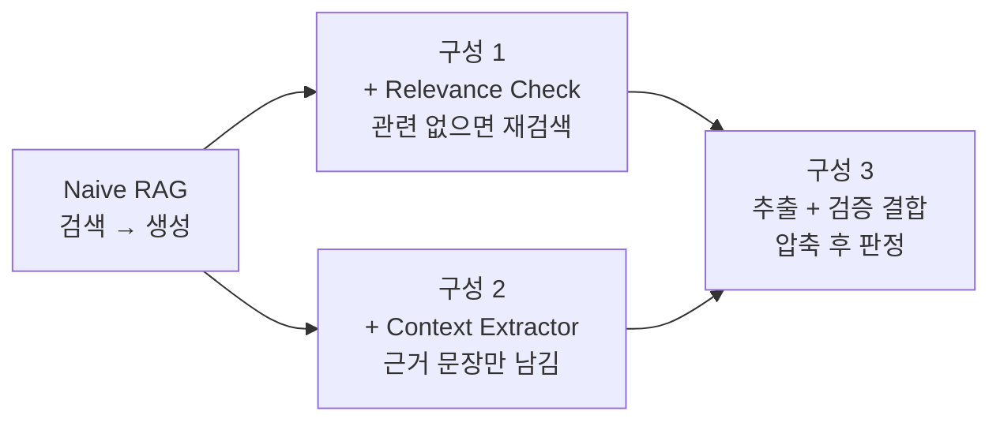
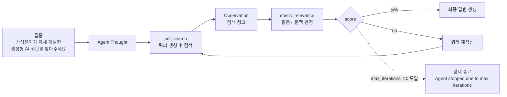
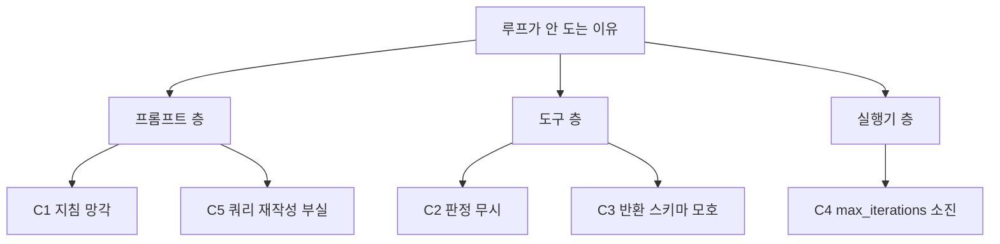
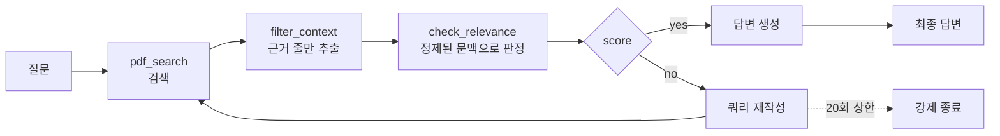
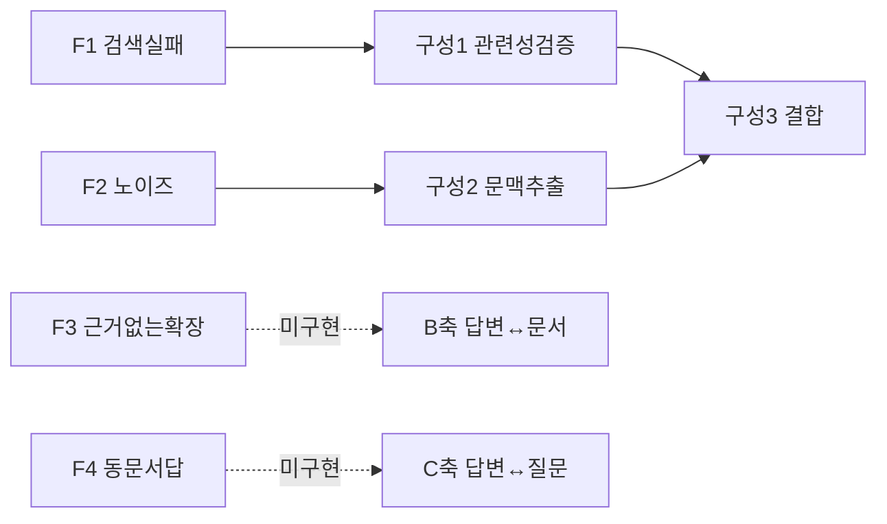
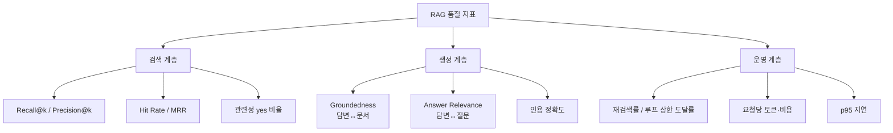

관련성 판정을 항상 `no`로 고정한 스텁을 붙이고 자기교정 루프를 돌리면 무슨 일이 일어날까. 정확히 10회 재검색한 뒤 `Agent stopped due to max iterations.`만 출력하고 끝난다. **답변이 아예 없다.** 그리고 10회 동안 생성된 쿼리는 어순과 수식어만 바뀐 동의어 나열이다.

이 글은 검증 루프를 실제로 돌렸을 때 관측되는 것들을 다룬다. 루프가 왜 중간에 멈추는지 프롬프트·도구·실행기 세 층으로 나눠 진단하고, **압축기에서 생성 권한을 제거하는** 설계, 두 도구를 결합할 때의 트레이드오프, 그리고 RAG 품질을 계층별 지표로 관리하는 체계까지 이어진다. 설계와 프롬프트 개정 기록은 [앞 편](/blog/rag/agentic-rag-relevance-check/)에 있다.

## 세 가지 조합

같은 retriever와 같은 질문을 쓰고 **도구 구성과 프롬프트만** 바꾼 세 가지 구성이 있다. 실험 변수는 "어떤 검증 도구를 어떤 순서로 붙이는가" 하나다.



## 용어 정리

| 용어 | 뜻 |
|---|---|
| Context Extractor | 검색 문서 전체가 아니라 **근거 문장만 골라내는** 도구 |
| max_iterations | 실행기가 허용하는 최대 **도구 호출** 횟수. 왕복 횟수가 아니다 |
| 폴백(fallback) | 상한 도달·판정 실패 시 내보내는 대체 응답 |
| Recall@k | 정답 근거가 상위 k개 검색 결과 안에 들어온 비율 |
| Groundedness | 답변의 각 주장이 문서에 근거하는 정도 |
| Answer Relevance | 답변이 질문 의도에 부합하는 정도 |
| Lost in the middle | 긴 문맥의 중간 정보를 모델이 놓치는 현상 |
| 트레이스(trace) | 실행의 단계별 도구 호출·입출력·토큰 기록 |

## 검증 루프를 실제로 돌리면

공통 기반은 이렇다.

```python
loader = PyPDFLoader("data/report.pdf")
text_splitter = RecursiveCharacterTextSplitter(chunk_size=1000, chunk_overlap=100)
split_docs = loader.load_and_split(text_splitter)

vector = FAISS.from_documents(split_docs, OpenAIEmbeddings())
retriever = vector.as_retriever()

agent = create_tool_calling_agent(llm, tools, prompt)
agent_executor = AgentExecutor(
    agent=agent, tools=tools, verbose=True, max_iterations=20
)
```

| 설정 | 값 | 의미 |
|---|---|---|
| `chunk_size` | 1000 | 청크가 커서 **한 청크 안에 무관한 문장이 많이 섞인다** → F2의 원인 |
| `chunk_overlap` | 100 | 경계에서 문맥이 끊기는 것을 완화 |
| `max_iterations` | 20 | 루프 상한. 프롬프트의 `up to 20 times`와 짝을 이룸 |
| `verbose` | True | 중간 단계 출력 → **루프 관찰의 전제** |



### 강제 `no` 상황의 트레이스

판정을 항상 `no`로 고정한 스텁을 붙이고 실행한 결과다.

| 회차 | 생성된 쿼리 | 판정 |
|---|---|---|
| 1 | 삼성전자 생성형 AI | no |
| 2 | 삼성전자 생성형 AI 삼성 가우스 | no |
| 3 | 삼성전자 AI 모델 삼성 가우스 | no |
| 4 | 삼성전자 AI 기술 삼성 가우스 | no |
| 5 | 삼성전자 AI 기술 | no |
| 6 | 삼성전자 AI 가우스 | no |
| 7 | 삼성전자 AI 가우스 기술 | no |
| 8 | 삼성전자 AI 가우스 발표 | no |
| 9 | 삼성전자 AI 가우스 기능 | no |
| 10 | 삼성전자 AI 가우스 발표 내용 | no |
| — | **종료** | `Agent stopped due to max iterations.` |

관측된 사실 셋이 전부 실무에 직결된다.

| 관측 | 해석 | 시사점 |
|---|---|---|
| 정확히 **10회** 반복 후 종료 | 도구 호출 2회(검색+판정)가 1회차이므로 20 iterations 소진 | `max_iterations`는 **왕복 횟수가 아니라 도구 호출 횟수**다. 검증 도구를 늘리면 실질 재시도 횟수가 그만큼 줄어든다 |
| 최종 출력이 `Agent stopped...` | 상한 도달 시 **답변이 아예 없다** | 폴백 답변("문서에서 근거를 찾지 못했습니다") 설계가 별도로 필요하다 |
| 재작성 쿼리가 **동의어 나열** | LLM은 "다른 쿼리"를 요구받으면 어휘만 바꾼다 | 쿼리 재작성 전략을 프롬프트로 명시해야 한다 |

### 루프가 중간에 멈추는 이유 — 세 층으로 나눠 본다

관련성 판정이 `no`인데도 재검색하지 않고 종료되는 일이 있다. 원인 후보는 다섯이다.

| # | 원인 후보 | 근거 | 대응 |
|---|---|---|---|
| C1 | 프롬프트 지침이 앞부분에만 있어 후반 턴에서 무시됨 | v2가 `Remember:` 블록을 말미에 중복 추가한 것이 이 대응 | 핵심 규칙을 프롬프트 앞·뒤에 이중 배치 |
| C2 | LLM이 검색 결과를 보고 "이미 충분하다"고 자체 판단 | 모델 사전지식이 문맥 판정을 덮어씀 | "판정 결과에만 따르라"를 명시. 판정 미호출 시 실패 처리 |
| C3 | 도구 반환 타입이 모호 | 타입힌트는 `bool`인데 실제로는 판정 객체를 반환 | 반환 스키마를 타입힌트와 일치시킨다 |
| C4 | `max_iterations` 소진 | 트레이스에서 실제 확인됨 | 상한 도달을 **정상 경로로 취급**해 폴백 답변 생성 |
| C5 | 재작성 쿼리가 이전과 사실상 동일 | 트레이스의 쿼리 10개가 동의어 수준 | 이전 쿼리 목록을 프롬프트에 넣어 중복 회피 지시 |



> **진단의 요령은 층을 가르는 것이다.** 트레이스에 판정 도구 호출 기록이 **없으면** 프롬프트 층, 호출은 됐는데 **결과를 안 따르면** 도구 층(스키마·description), 정상 동작인데 **끊기면** 실행기 층(상한) 문제다.

쿼리 재작성 부실은 별도로 손봐야 한다. 트레이스의 쿼리 10개는 같은 어휘의 어순만 바뀐 변형이라 **같은 문서를 계속 검색한다.** 재시도가 의미를 갖지 못한다.

| 개선안 | 방식 | 기대 효과 |
|---|---|---|
| 이전 쿼리 이력 전달 | 프롬프트에 시도한 쿼리 목록을 누적 제공 | 중복 회피 |
| 재작성 전략 명시 | "① 상위어로 넓히기 ② 하위어로 좁히기 ③ 동의어 치환 ④ 문서 어휘로 바꾸기" 순서 지정 | 탐색 다양성 확보 |
| 검색 파라미터 변주 | `k` 확대, 다른 인덱스, 키워드 검색 병행 | 임베딩 편향 우회 |
| 시도 상한 분리 | 재검색 상한과 전체 iteration 상한을 별도 관리 | 상한 소진 예측 가능 |

## 문맥 추출기 — 압축기가 거짓말할 수 없게 만든다

검색은 성공했는데 **청크가 크다.** `chunk_size=1000`이면 한 청크에 목차·출처·머리말 같은 무관한 줄이 대량으로 섞인다. 그대로 넣으면 F2(노이즈 희석)가 발생한다.

핵심 기법은 두 줄이다.

```python
contexts = []
for doc in retriever.invoke("삼성전자가 개발한 생성형 AI 관련된 정보를 문서에서 찾아줘"):
    contexts.extend(doc.page_content.split("\n"))

indexed_contexts = [f"[{i+1}] {contexts[i]}" for i in range(len(contexts))]
```

- 청크(문서 단위)를 **줄 단위**로 분해한다 → 근거의 최소 단위를 잘게 만든다.
- 각 줄에 `[index]` 번호를 붙인다 → LLM이 **원문 대신 번호로** 답할 수 있게 한다.

실제로 검색된 청크 4개가 **61줄**로 펼쳐졌고, 그중 다수가 목차·행동강령 조항·출처 표기였다.

```python
llm_context_extractor = (
    load_prompt("prompts/context-extractor.yaml")
    | ChatOpenAI(model="gpt-4o-mini", temperature=0)
    | StrOutputParser()
)

llm_context_extractor.invoke(
    {"question": "...", "contexts": indexed_contexts}
)
# '3,4,5,9,10,15,17,19,21,23'
```

### 인덱스만 반환하게 한 것이 핵심이다

프롬프트의 결정적 지시는 이 두 줄이다.

```
- Your response should be only the relevant context for the user's query, nothing else.
- Only return the index of the relevant context.
```

| 항목 | 원문 재생성 방식 | **인덱스 반환 방식** |
|---|---|---|
| 출력 형태 | 선택한 문장을 다시 써서 출력 | **출력 토큰이 극소** (20자 내외) |
| 원문 충실도 | 요약·의역이 섞일 수 있음 | 원문이 **한 글자도 변형되지 않음** |
| 할루시네이션 | 압축 단계에서 새 환각 유입 가능 | **압축 단계 환각이 구조적으로 불가능** |
| 검증 가능성 | 원문 대조 필요 | 인덱스로 근거 추적이 즉시 가능 |
| 실패 모드 | 조용한 왜곡 | 잘못된 인덱스 → 즉시 티가 남 |

> 이 설계의 진짜 값어치는 토큰 절감이 아니라 **압축기가 거짓말할 수 없게 만든 것**이다.
>
> LLM에게 요약을 시키면 요약 자체가 새로운 할루시네이션 발생원이 된다. 출력을 인덱스로 제한하면 압축기의 역할이 "선택"으로 축소되고 **생성 권한이 제거된다.**
>
> 이것이 검증 단계 설계의 일반 원칙이다. **판정·선별 컴포넌트에는 생성 권한을 주지 않는다.**

### 효과 — 총 토큰이 줄어드는 게 아니다

| 지표 | 추출 전 | 추출 후 | 변화 |
|---|---|---|---|
| 문맥 줄 수 | 61줄 | 10줄 | **약 84% 감소** |
| 포함된 무관 내용 | 목차·조항·출처 표기 다수 | 관련 문장만 | 노이즈 제거 |
| 답변 생성 시 입력 토큰 | 청크 4개 전량 | 선별 10줄 | 대폭 감소 |
| 추출기 자체 비용 | — | 61줄 전량을 프롬프트로 투입 | **추가 비용 발생** |

> 마지막 행이 중요하다. **추출기는 61줄을 전부 읽어야 하므로 그 단계에서 입력 토큰을 온전히 쓴다.** 절감은 하류(답변 생성, 그리고 이후 모든 루프 반복)에서 발생한다.
>
> 따라서 추출기가 이득이 되는 조건은 ① 답변 생성 모델이 추출 모델보다 비싸거나 ② 압축된 문맥이 **여러 번 재사용**될 때다. 단발 호출에서는 오히려 손해일 수 있다.

정확도 측면의 효과는 별개로 존재한다.

| 효과 | 메커니즘 |
|---|---|
| Lost in the middle 완화 | 문맥이 짧아지면 중간 정보를 놓치는 현상이 사라진다 |
| 근거 밀도 상승 | 관련 문장 비율이 10/61 → 10/10 |
| 후속 판정 정확도 상승 | 판정기가 노이즈 없는 문맥을 보게 된다 |
| 인용 추적 용이 | 답변의 근거를 원문 줄 번호로 되짚을 수 있다 |

### 도구화와 그 취약점

```python
@tool
def filter_context(input: str, context: list[Document]) -> list[str]:
    """This is a tool for filtering the retrieved context."""
    contexts = []
    for doc in context:
        contexts.extend(doc.page_content.split("\n"))

    indexed_contexts = [f"[{i+1}] {contexts[i]}" for i in range(len(contexts))]

    answer = llm_context_extractor.invoke(
        {"question": input, "contexts": indexed_contexts}
    )

    selected_contexts = [contexts[int(index) - 1] for index in answer.split(",")]
    return "\n".join(selected_contexts)
```

> **`int(index)`는 LLM 출력이 정확한 숫자 CSV일 때만 동작한다.**
>
> 모델이 `3, 4, 5`(공백 포함)나 `없음`, 혹은 범위를 벗어난 인덱스를 반환하면 예외가 난다. 실무 이식 시에는 `strip()`·범위 검사·빈 결과 폴백을 반드시 넣어야 한다.


**조건 분기가 없다는 점에 주목한다.** 이 구성에는 판정 도구가 없으므로 되돌아가는 화살표가 존재하지 않는다. 검색이 통째로 빗나가면 **무관한 문서에서 "그나마 관련 있는 줄"을 골라** 답을 만든다.

즉 압축만으로는 F1(검색 실패)을 잡지 못하며, 오히려 무관한 근거를 정제해 **더 그럴듯한 오답**을 만들 위험이 있다. 실제 트레이스도 도구 호출 2회 후 그대로 끝난다.

## 압축과 검증을 결합하면



실제 실행에서는 **첫 시도에 `yes`가 나와 루프 없이 끝났다.** 도구 호출 3회다.

> **정상 케이스에서는 검증 루프의 비용이 거의 없다.** 관련성이 통과되면 판정 1회분(저비용 모델) 비용만 추가된다.
>
> 루프 비용은 검색이 실패했을 때만 발생하므로, 검증 도입의 비용 구조는 **"평상시 소액 고정비 + 실패 시 변동비"**다. 이것이 검증 루프가 실무에서 성립하는 이유다.

### 결합의 트레이드오프

| 항목 | 분리 운영 | **결합** |
|---|---|---|
| 도구 호출 수 (성공 시) | 2회 | **3회** |
| 판정 입력 토큰 | 청크 전량 (61줄) | 정제 문맥 (10줄) → **감소** |
| 판정 정확도 | 노이즈에 흔들림 | 근거 밀도 높아 **상승** |
| 잡을 수 있는 실패 | F1 또는 F2 | **F1 + F2 동시** |
| 지연 | 낮음 | 순차 호출로 **증가** |
| 새 위험 | — | **압축이 근거를 잘라 잘못된 `no`** 유발 |

압축과 판정을 **한 번의 LLM 호출로 합치는** 확장도 생각할 수 있다. 그런데 이 거래는 손해다.

| 항목 | 순차 2회 호출 | 단일 호출 통합 |
|---|---|---|
| LLM 호출 수 | 2 | **1** |
| 지연 | 왕복 2회 | 왕복 1회 → **개선** |
| 출력 스키마 | 각각 단순 (인덱스 / yes·no) | 복합 구조 필요 |
| 파싱 실패 위험 | 낮음 | **높음** |
| 판정 독립성 | 압축과 판정이 분리 | 같은 추론 안에서 서로 오염됨 |
| 관측 가능성 | 단계별 트레이스 확보 | **어느 단계가 틀렸는지 분리 불가** |
| 모델 분리 | 압축·판정에 다른 모델 배치 가능 | 하나의 모델로 고정 |

> **지연이 치명적인 서비스가 아니라면 분리 유지가 낫다.** 통합의 이득은 왕복 1회 단축뿐인데, 잃는 것은 "어느 단계가 고장났는지 아는 능력"이다.
>
> RAG 품질 개선은 결국 단계별 지표를 보고 하는 일이라, **관측 가능성을 파는 거래는 손해다.** 다만 압축기와 판정기가 같은 문맥을 두 번 읽는 낭비는 실재하므로, 압축기가 인덱스와 함께 근거 충분성 플래그를 부수적으로 내는 절충안은 검토할 만하다.

### 세 구성 종합

| 구분 | 구성 1 검증 | 구성 2 추출 | 구성 3 결합 |
|---|---|---|---|
| 도구 | `pdf_search` + `check_relevance` | `pdf_search` + `filter_context` | 셋 전부 |
| 조건 분기 | **있음** (no → 재검색) | 없음 | **있음** |
| 잡는 실패 | F1 검색 실패 | F2 노이즈 희석 | F1 + F2 |
| 못 잡는 실패 | F2, F3, F4 | F1, F3, F4 | F3, F4 |
| 실행 트레이스 | 강제 no → 10회 루프 → 상한 종료 | 2회 호출 후 종료 | 3회 호출, `yes`, 종료 |
| 남은 과제 | 쿼리 재작성 품질·폴백 | 검증 부재 | 압축으로 인한 근거 손실 |



F3·F4는 셋 중 어느 구성도 잡지 못한다. 답변을 대상으로 하는 B·C축 판정이 필요하고, 그것은 요청 경로가 아니라 오프라인 샘플링에 배치하는 것이 기본형이다.

## 운영으로 옮길 때 채워야 할 것

| # | 항목 | 학습 코드 상태 | 운영에서 필요한 것 |
|---|---|---|---|
| 1 | 폴백 답변 | 상한 도달 시 `Agent stopped...`만 출력 | "문서에서 근거를 찾지 못했습니다" 명시적 응답 |
| 2 | 파싱 방어 | `int(index)` 직접 변환 | `strip()`·범위 검사·빈 결과 처리 |
| 3 | 반복 상한 | `max_iterations=20` 단일 값 | 재검색 상한 / 전체 상한 분리, 타임아웃 병행 |
| 4 | 쿼리 재작성 | LLM 자율 (동의어 나열) | 이력 전달 + 재작성 전략 명시 |
| 5 | 판정 모델 | 생성 모델과 동일 | 판정 전용 저비용 모델 분리, 임계값 관리 |
| 6 | 반환 스키마 | 타입힌트와 실제 객체 불일치 | 스키마 일치, 구조화 출력 강제 |
| 7 | 캐싱 | 없음 | 동일 질문·동일 문맥의 판정 결과 캐시 |
| 8 | 관측 | 콘솔 출력 | 트레이스 수집 + 지표 적재 |
| 9 | 회귀 테스트 | 없음 | 프롬프트 버전별 골든셋 평가 |
| 10 | 비용 상한 | 없음 | 요청당 토큰·호출 예산 상한 |

## 품질을 무엇으로 관리하는가



| 계층 | 지표 | 정의 | 나쁠 때 손대는 곳 |
|---|---|---|---|
| 검색 | Recall@k | 정답 근거가 상위 k개 안에 들어온 비율 | 청크 크기, 임베딩 모델, k 값, 하이브리드 검색 |
| 검색 | Precision@k | 상위 k개 중 관련 문서 비율 | 리랭커, 필터링 |
| 검색 | 관련성 `yes` 비율 | 판정 통과율 | 검색 품질 전반 |
| 생성 | Groundedness | 답변의 각 주장이 문서에 근거하는 비율 | 프롬프트 제약, 문맥 압축, 인용 강제 |
| 생성 | Answer Relevance | 답변이 질문 의도에 부합하는 정도 | 질문 재해석, 프롬프트 |
| 운영 | 재검색률 | 전체 요청 중 1회 이상 재검색한 비율 | 높으면 검색 품질 문제 |
| 운영 | 상한 도달률 | `max_iterations` 소진 비율 | 폴백 품질·상한 값 재조정 |
| 운영 | 요청당 토큰 | `token_usage.total_tokens` 집계 | 문맥 압축, 캐싱 |
| 운영 | p95 지연 | 상위 5% 응답 시간 | 도구 호출 수, 병렬화 |

운영 계층의 두 지표를 신호로 읽는 방법이 특히 유용하다. **재검색률이 오르면 검색 품질 신호**로, **상한 도달률이 오르면 폴백 설계 신호**로 읽는다.

### 관측이 먼저다

세 구성 모두 **가장 먼저** 하는 일이 트레이스 설정이다.

```python
import os

os.environ["LANGCHAIN_TRACING_V2"] = "true"
os.environ["LANGCHAIN_PROJECT"] = "agentic-rag"
```

> Agentic RAG는 실행 경로가 매번 다르므로 **트레이스 없이는 디버깅이 불가능하다.**
>
> "어떤 쿼리로 몇 번 재검색했고, 판정이 어디서 뒤집혔는가"는 로그가 아니라 트레이스에 있다. **관측을 먼저 깔고 기능을 붙이는 순서**가 이 구조에서 특히 중요한 이유다.
