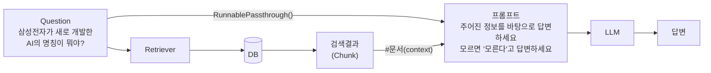
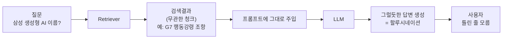
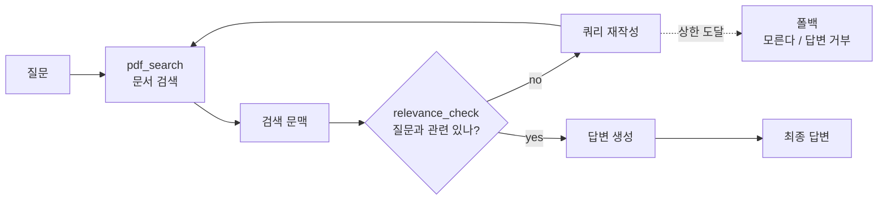
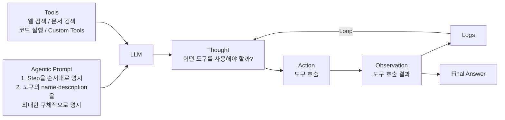
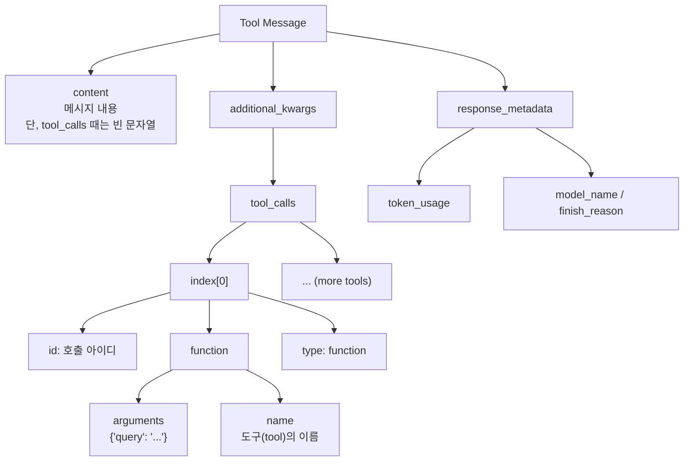
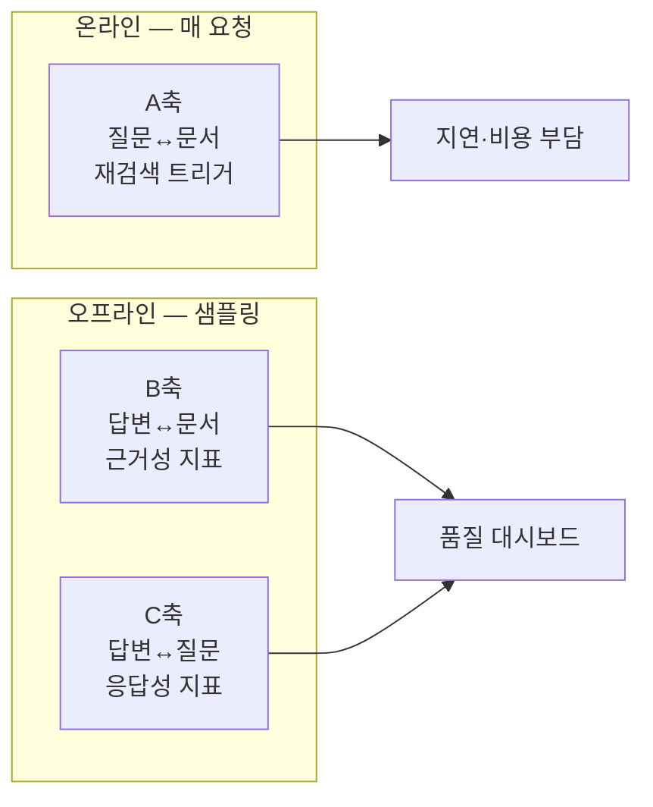
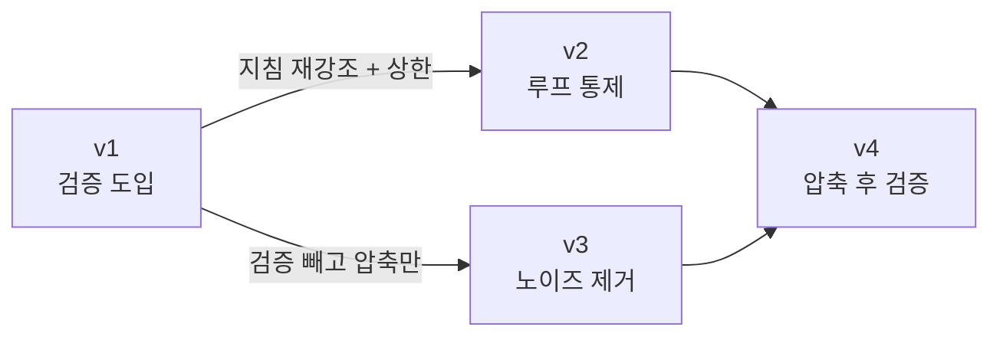

프롬프트에 "모르면 모른다고 답하세요"를 넣어도 할루시네이션은 사라지지 않는다. 무관한 청크가 문맥에 들어와 있으면 LLM은 "문맥에 뭔가 있으니 답할 수 있다"고 판단해 억지로 연결하기 때문이다. **실패의 본질은 모델의 능력이 아니라 파이프라인에 판정 지점이 없다는 설계 문제다.**

이 글은 그 판정 지점을 만드는 방법을 다룬다. Naive RAG가 무너지는 다섯 가지 지점을 분류하고, 판정을 **도구(tool)로 외부화**해 에이전트가 호출하게 만드는 구조, 무엇을 무엇에 대해 평가할지 정하는 3축 설계, 그리고 같은 문제를 놓고 프롬프트를 네 번 고친 기록까지 이어진다.

## 용어 정리

| 용어 | 영문 | 뜻 |
|---|---|---|
| Naive RAG | — | 검색 → 프롬프트 주입 → 생성으로 끝나는, **검증 단계가 없는** RAG |
| Agentic RAG | — | RAG를 **에이전트가 도구를 호출하는 방식**으로 수행하는 것. 검색·검증·압축이 각각 도구 |
| Agent | — | LLM이 "생각(Thought) → 도구 호출(Action) → 결과 관찰(Observation)"을 반복하며 목표를 달성하는 실행 단위 |
| Tool Calling | 도구 호출 | LLM이 함수 이름과 인자를 JSON으로 생성해 외부 기능을 호출하는 메커니즘 |
| Relevance Check | 관련성 검증 | 검색 결과·답변이 질문에 실제로 맞는지 별도 LLM이 판정하는 단계 |
| Groundedness | 근거성 | 답변이 얼마나 문서에 근거하는지의 정도. 낮으면 곧 할루시네이션 |
| Self-correction | 자기교정 | 판정 결과가 나쁘면 시스템이 스스로 쿼리를 다시 만들어 재시도하는 것 |
| CRAG | Corrective RAG | 검색 결과를 평가해 나쁘면 쿼리를 교정·웹검색으로 보강하는 개선형 RAG 계열 |
| Self-RAG | — | 모델이 "검색이 필요한가 / 근거가 충분한가"를 스스로 토큰으로 표시하며 통제하는 계열 |
| LLM-as-a-judge | — | 사람 대신 LLM이 평가자 역할을 맡아 yes/no·점수를 매기는 방식 |
| AgentExecutor | — | 에이전트의 Thought-Action-Observation 루프를 실제로 돌리는 실행기 |
| max_iterations | — | 실행기가 허용하는 최대 반복 횟수. 넘으면 강제 종료 |

## Naive RAG의 실패 지점

일반적인 RAG 파이프라인은 이렇게 생겼다.



주목할 점은 **`Question`이 두 갈래로 흐른다**는 것이다. 한 갈래는 Retriever로 가서 검색을 수행하고, 다른 갈래는 그대로 프롬프트의 질문 자리에 꽂힌다.

**이 구조에는 두 갈래가 서로 맞는지 확인하는 지점이 어디에도 없다.** 검색된 청크는 "검색됐다"는 이유만으로 무조건 문맥 자리에 들어간다.



### 무너지는 지점 다섯 가지

| # | 실패 유형 | 증상 | 근본 원인 | 검증 루프의 대응 |
|---|---|---|---|---|
| F1 | 검색 실패 | 질문과 무관한 청크가 top-k에 올라옴 | 임베딩 유사도가 의미 일치를 보장하지 않음 | 질문↔문서 관련성 판정 → 재검색 |
| F2 | 노이즈 희석 | 관련 청크는 있으나 무관한 문장에 파묻힘 | 청크 단위가 커서 근거 밀도가 낮음 | 문맥 추출로 근거 문장만 남김 |
| F3 | 근거 없는 확장 | 문서에 없는 세부를 덧붙여 답함 | 모델 사전지식이 문맥을 넘어 개입 | 답변↔문서 근거성 판정 |
| F4 | 동문서답 | 문서 근거는 맞지만 질문에 답하지 않음 | 질문 의도 파악 실패 | 답변↔질문 관련성 판정 |
| F5 | 무한 재시도 | 재검색이 끝없이 반복됨 | 종료 조건 미정의 | 반복 상한 + 폴백 답변 |

> F1~F4는 **품질** 문제이고 F5는 **운영** 문제다.
>
> 검증 루프를 넣는 순간 F5가 새로 생긴다는 점이 중요하다. 즉 자기교정은 공짜가 아니라 **"품질 문제를 운영 문제로 바꾸는" 거래**다.

### 검증 루프를 넣으면 무엇이 달라지나



Naive RAG와의 차이는 딱 둘이다.

1. **판정 노드가 생겼다** — 검색 결과를 그대로 믿지 않는다.
2. **되돌아가는 화살표가 생겼다** — 판정이 나쁘면 다시 검색한다.

이 둘이 자기교정의 최소 구성이다.

| 계열 | 판정 주체 | 판정 대상 | 실패 시 행동 |
|---|---|---|---|
| Naive RAG | 없음 | — | 없음 |
| **Agentic RAG** | 에이전트가 호출하는 **별도 도구** | 질문↔검색문맥 | 쿼리 재작성 후 재검색 |
| CRAG | 경량 평가기 | 검색 결과 품질 | 쿼리 교정·외부 검색 보강 |
| Self-RAG | 모델 자신 (특수 토큰) | 검색 필요성·근거성 | 검색 생략 또는 재생성 |

> Agentic RAG가 CRAG·Self-RAG와 갈리는 지점은 **판정을 도구로 외부화**했다는 것이다.
>
> 판정 로직이 도구이므로 모델 교체와 무관하게 재사용되고, 트레이스에 호출 기록이 남아 "왜 재검색했는가"를 사후에 추적할 수 있다. 운영 관점에서 이 관찰 가능성이 핵심 이점이다.

## Agentic RAG의 구조

체인형 RAG와의 결정적 차이는 **경로가 고정되어 있지 않다**는 점이다.

| 구분 | Chain RAG | Agentic RAG |
|---|---|---|
| 실행 경로 | 고정 (검색 → 생성) | LLM이 매 턴 결정 |
| 검색 횟수 | 항상 1회 | 0회~N회 |
| 조건 분기 | 코드로 하드코딩해야 함 | 프롬프트 지침으로 유도 |
| 새 검증 추가 | 파이프라인 재설계 | **도구 하나 추가** |
| 비용·지연 | 예측 가능 | 예측 어려움 (상한 필요) |
| 실패 모드 | 조용한 오답 | 루프 폭주 / 조기 종료 |



에이전트는 `Thought → Action → Observation`을 반복하고, 그 기록이 다음 Thought의 입력이 된다. **Agentic RAG에서 "검증"이란 이 Tools 목록에 판정 도구를 하나 더 꽂는 일**이다.

### 장애는 답변 텍스트가 아니라 메타데이터에서 보인다

도구 호출 응답 메시지의 구조다.



| 필드 | 의미 | 디버깅에서의 쓸모 |
|---|---|---|
| `content` | 메시지 본문. **도구 호출 시에는 빈 문자열** | 비어 있으면 "지금은 도구 호출 턴"이라는 신호 |
| `additional_kwargs.tool_calls` | 호출할 도구 목록 (배열) | 한 턴에 여러 도구를 병렬 호출했는지 확인 |
| `tool_calls[i].id` | 호출 식별자 | 요청↔응답 짝맞춤 |
| `tool_calls[i].function.name` | 도구 이름 | **에이전트가 의도한 도구를 골랐는지** 확인 |
| `tool_calls[i].function.arguments` | 인자 JSON | 쿼리를 어떻게 재작성했는지 추적 |
| `response_metadata.token_usage` | `completion_tokens` / `prompt_tokens` / `total_tokens` | 비용 추적. 압축 효과 측정의 근거 |
| `token_usage.*_details` | `reasoning_tokens`, `cached_tokens` | 캐시 적중·추론 토큰 분리 |
| `response_metadata.finish_reason` | `tool_calls` = 툴 호출 후 종료 | 왜 턴이 끝났는지 판별 |

> Agentic RAG의 장애는 대부분 **"도구를 안 불렀다 / 엉뚱한 인자로 불렀다"**에서 온다.
>
> 그 판단은 답변 텍스트가 아니라 `tool_calls` 필드를 봐야만 가능하다. **관찰 지점이 응답 본문이 아니라 메시지 메타데이터에 있다.**

### 프롬프트 작성 시 못 박아야 할 두 가지

| # | 원칙 | 이유 | 위반 시 증상 |
|---|---|---|---|
| 1 | **Step-by-step 프로세스를 명시** | 에이전트는 매 턴 자유롭게 판단하므로, 순서를 안 박으면 검증 단계를 건너뛴다 | 검색만 하고 바로 답변 |
| 2 | **도구의 이름·description을 상세히 명시** | 도구 선택은 이름과 설명 텍스트만 보고 이뤄진다 | 엉뚱한 도구 호출 / 도구 미사용 |

```python
retriever_tool = create_retriever_tool(
    retriever,
    name="pdf_search",  # 도구의 이름
    description="use this tool to search information from the PDF document",
)
```

> **도구의 `description`은 주석이 아니라 라우팅 로직이다.**
>
> 사람이 읽는 설명문처럼 쓰면 안 되고, "언제 이 도구를 써야 하는가"의 판단 기준으로 써야 한다. 도구가 늘어날수록 description 품질이 곧 시스템 정확도가 된다.

## Relevance Check 설계 — 무엇을 무엇에 대해 평가하나

관련성 검증은 하나가 아니다. **평가 대상 쌍이 무엇이냐**에 따라 잡아내는 오류가 다르다.

| 축 | 평가 쌍 | 잡아내는 실패 | 판정이 `no`일 때 조치 |
|---|---|---|---|
| A | **질문 ↔ 검색 문서** | 검색 실패(F1). 엉뚱한 문서를 가져옴 | 쿼리 재작성 후 재검색 |
| B | **답변 ↔ 검색 문서** | 근거 없는 확장(F3) = groundedness 붕괴 | 답변 재생성 또는 답변 거부 |
| C | **답변 ↔ 질문** | 동문서답(F4). 근거는 맞지만 질문에 답 안 함 | 질문 재해석 후 재시도 |

세 축을 다 돌리면 판정 호출이 3배가 된다. 그래서 실무에서는 배치를 나눈다.



**A축은 온라인 실시간 루프로, B·C축은 오프라인 샘플링 평가로** 배치하는 것이 기본형이다. A축만 요청 경로에 있으므로 지연 예산도 A축만 계산하면 된다.

### 판정기 만들기

```python
from langchain_openai import ChatOpenAI

# 관련성 판정기 — 구조화 출력을 강제하는 LLM-as-a-judge
retrieval_question_evaluator = OpenAIRelevanceGrader(
    llm=ChatOpenAI(model="gpt-4o-mini", temperature=0),
    target="retrieval-question",
).create()
```

`OpenAIRelevanceGrader`는 Pydantic 스키마를 모델에 바인딩해 판정 결과를 구조화 객체로 받게 하는 얇은 래퍼다. 설계 포인트는 셋이다.

| 선택 | 값 | 이유 |
|---|---|---|
| 평가 모델 | 소형 모델 | 판정은 **매 루프마다** 돈다. 생성 모델과 분리해 저비용 모델을 쓴다 |
| `temperature` | `0` | 평가는 재현성이 생명. 같은 입력에 같은 판정이 나와야 지표가 의미를 가진다 |
| `target` | `retrieval-question` | 평가 축을 **명시적 파라미터로** 노출 → 축 교체가 코드 한 줄 |

동작은 이렇다.

```python
# 무관한 경우
retrieval_question_evaluator.invoke(
    {
        "context": ["삼성전자는 지난 2023년 자체적으로 만든 생성형 AI 가우스를 발표했다."],
        "input": "삼성전자의 생성형 AI 이름은 빅스비 입니까?",
    }
)
# GradeRetrievalQuestion(score='no')

# 관련 있는 경우
retrieval_question_evaluator.invoke(
    {
        "context": ["삼성전자는 지난 2023년 자체적으로 만든 생성형 AI 가우스를 발표했다."],
        "input": "삼성전자의 생성형 AI 이름은 가우스 입니다.",
    }
)
# GradeRetrievalQuestion(score='yes')
```

> 반환값이 자유 텍스트가 아니라 `GradeRetrievalQuestion(score='yes'|'no')`라는 **구조화된 객체**라는 점이 중요하다.
>
> 판정 결과가 구조화되어 있어야 프로그램이 분기할 수 있고, 로그에 쌓아 비율을 집계할 수 있다. **LLM-as-a-judge를 붙일 때 출력 스키마를 강제하지 않으면 그 판정은 지표가 되지 못한다.**

### 평가기를 도구로 바꾼다

```python
from langchain_core.tools import tool


@tool
def check_relevance(input: str, context: list[str]) -> bool:
    """This is a tool for checking relevance between the user's query and retrieved context."""
    return retrieval_question_evaluator.invoke({"context": context, "input": input})
```

`@tool` 데코레이터가 하는 일은 셋이다. 함수를 LLM이 호출 가능한 도구 스키마로 변환하고, **docstring이 곧 `description`**이 되어 도구 선택 근거가 되며, 타입힌트가 인자 스키마가 된다.

### 루프를 관찰하려면 스텁이 필요하다

```python
@tool
def check_relevance_fake(input: str, context: list[str]) -> bool:
    """This is a tool for checking relevance between the user's query and retrieved context."""

    if len(input) % 2 == 0:
        return "no"
    else:
        return "no"
```

두 분기 모두 `"no"`를 반환한다. 즉 **항상 `no`**다.

> 이건 버그가 아니라 의도된 실험 장치다. 관련성이 절대 통과되지 않는 상황을 만들어 **"자기교정 루프가 실제로 도는가, 언제 멈추는가"**를 관찰하려는 것이다.
>
> 검증 루프를 설계할 때 **판정 결과를 강제로 고정할 수 있는 스텁**을 함께 만들어 두는 것은 그대로 이식할 만한 습관이다. **루프 로직은 정상 케이스에서는 절대 드러나지 않는다.**

## 프롬프트를 네 번 고친 기록

같은 문제를 놓고 프롬프트를 네 번 개정한 파일이 남아 있다. 이 기록이 이 자료에서 가장 실무적인 부분이다.

**v1** — 기준선. 4단계 지침으로 검증 단계를 파이프라인에 진입시킨다.

```yaml
_type: "prompt"
template: |
  You are a question answering assistant. Your task is to answer the user's question based on the provided context.

  You should follow the below guidelines step by step:
  1. make sure to use the `pdf_search` tool for searching information from the PDF document.
  2. Then, use the `relevance_check` tool for checking the relevance between the user's query and retrieved context.
  3. If the result of `relevance_check` is **no**, you should generate another query and use the `pdf_search` tool again.
  4. You should include `relevance_check` tool call in your response.
```

**v2** — 도구는 그대로 두고 지시 방식만 고쳤다. 말미에 `Remember:` 블록으로 핵심 규칙을 재강조하고 반복 상한을 문장으로 넣었다.

```yaml
  Remember:
  - If the result of `relevance_check` is **no**, you should re-generate another query and use the `pdf_search` tool again.
  - You can do this process up to 20 times.
```

**v3** — 도구 구성 자체를 바꿨다. `relevance_check`를 **제거**하고 `filter_context`만 남겨 지침이 2단계로 줄었다. "검증보다 노이즈 제거가 먼저"라는 가설 검증이다.

```yaml
  1. make sure to use the `pdf_search` tool for searching information from the PDF document.
  2. Then, use the `filter_context` tool for filtering the retrieved context.
```

**v4** — 두 갈래를 합치되 **실행 순서를 못 박았다.**

```yaml
  1. make sure to use the `pdf_search` tool for searching information from the PDF document.
  2. Then, use the `filter_context` tool for filtering the retrieved context.
  3. Finally, use the `relevance_check` tool for checking the relevance between the user's query and retrieved context.
  4. If the result of `relevance_check` is **no**, you should generate another query and use the `pdf_search` tool again.
```

| 버전 | 도구 구성 | **무엇을 고치려 했나** | 남은 문제 |
|---|---|---|---|
| **v1** | `pdf_search` + `relevance_check` | 검증 단계를 파이프라인에 진입시키는 것 자체 | 재검색 지침이 지켜지지 않고 조기 종료. 반복 상한 없음 |
| **v2** | 동일 | ① 지침 4번이 앞부분에만 있어 잊힘 → **끝에서 재강조**<br/>② 루프 폭주 위험 → **명시적 상한 부여** | 상한에 도달하면 답을 못 내고 종료 |
| **v3** | `pdf_search` + `filter_context` | 검증보다 **노이즈 제거가 먼저**라는 가설 검증. 루프를 없애 흐름 단순화 | 검증이 없어 F1(검색 실패)을 못 잡음 |
| **v4** | 셋 결합 | **압축 → 검증** 순서 고정. 정제된 문맥으로 판정해 정확도·비용 동시 개선 | 압축에서 근거가 잘리면 잘못된 `no` 유발 가능 |



진화의 축이 세 번 다르다는 것이 이 기록의 핵심이다.

- **v1 → v2**: 같은 도구로 **지시 방식**만 고쳤다 (프롬프트 엔지니어링).
- **v2 → v3**: 도구 구성 자체를 바꿨다 (아키텍처 변경).
- **v3 → v4**: 두 갈래를 합치되 **실행 순서를 명시**했다 (오케스트레이션).

### 프롬프트도 형상관리 대상이다

| 관측 사실 | 실무 교훈 |
|---|---|
| 프롬프트가 `.yaml` **파일**로 분리되어 있다 | 코드에 문자열로 박지 않는다. 파일이어야 diff·리뷰·롤백이 된다 |
| 파일명에 `v2`, `v3`, `v4` 버전이 붙는다 | 프롬프트 변경은 **릴리스**다. 이전 버전을 지우지 않고 남긴다 |
| 코드가 `load_prompt(...)`로 로드한다 | 코드와 프롬프트의 배포 주기를 분리할 수 있다 |
| v2에서 `Remember:` 블록이 **중복 서술**로 추가됐다 | LLM은 긴 지침의 중간을 흘린다. 핵심 규칙은 앞·뒤 양쪽에 배치 |
| v2에서 `up to 20 times` 상한이 명시됐다 | 루프가 있는 프롬프트에는 **반드시 종료 조건**을 문장으로 넣는다 |
| v4에서 `Finally`로 순서를 못 박았다 | 도구가 3개 이상이면 순서 지시어가 실행 순서를 좌우한다 |

```python
# 버전 교체 = 파일명 한 줄
from langchain_core.prompts import ChatPromptTemplate, load_prompt

prompt = ChatPromptTemplate.from_messages(
    [
        ("system", load_prompt("prompts/agentic-rag-prompt-relevance-v2.yaml").template),
        ("placeholder", "{chat_history}"),
        ("human", "{input}"),
        ("placeholder", "{agent_scratchpad}"),
    ]
)
```

> **프롬프트는 소스코드다.** 파일로 분리하고, 버전을 붙이고, 변경 이유를 남기고, 회귀 테스트를 붙인다.
>
> 모델을 안 바꿔도 프롬프트 한 줄로 시스템 동작이 바뀌므로, 형상관리가 없으면 장애의 원인을 재현할 수 없다.

여기까지가 판정을 도구로 만드는 설계다. 그 도구를 실제로 붙였을 때 루프가 어떻게 도는지, 문맥 압축기를 결합하면 무엇이 달라지는지는 [다음 편](/blog/rag/agentic-rag-context-extractor/)에서 다룬다.
