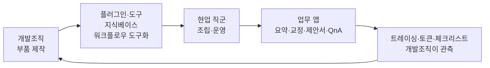
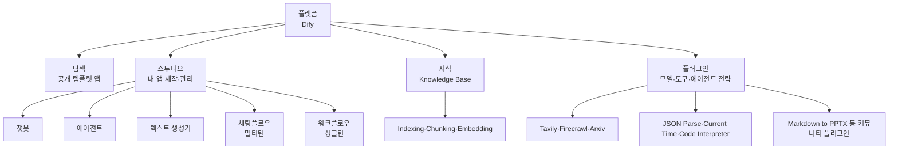
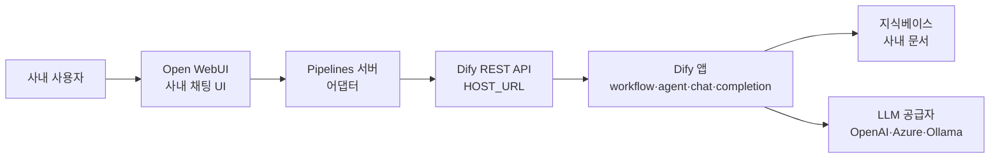

노코드 LLM 플랫폼을 도입하는 결정은 도구 선택이 아니다. **병목 리스크를 거버넌스 리스크로 교환하는 결정**이다. 개발조직이 요청을 처리하느라 막히던 문제는 풀리지만, 대신 난립·중복·데이터 유출·비용 폭주가 새로 생긴다.

이 글은 그 교환을 다룬다. 노코드 플랫폼이 코드 프레임워크와 업무 자동화 SaaS 사이 어디에 놓이는지, 어떤 업무를 노코드로 열고 어떤 업무를 코드로 잠글지 가르는 기준, 앱 5종의 구조가 실제로 어떻게 다른지, 그리고 **문서와 질의를 사내망에 남기는 셀프호스팅 구성**까지 이어진다. 이어지는 세 편은 [노드 체계와 지식베이스 RAG](/blog/rag/dify-nodes-and-knowledge/), [워크플로우 9종 해부](/blog/rag/dify-workflow-patterns/), [확산과 통제의 설계](/blog/rag/dify-enterprise-governance/)다.

## 용어 정리

| 용어 | 뜻 |
|---|---|
| **Dify** | 오픈소스 LLM 애플리케이션 개발 플랫폼. 노코드·로우코드로 챗봇·에이전트·워크플로우를 만들고 API로 노출한다 |
| **LLMOps** | LLM 애플리케이션의 배포·관측·버전·비용을 운영하는 활동 |
| **DSL 파일** | 앱 전체(노드·엣지·프롬프트·모델설정)를 담은 YAML. 내보내기/가져오기로 앱을 이전한다 |
| **블록 / 노드** | 워크플로우 안의 작업 단위 1개 |
| **chatbot** | 그래프 없이 프롬프트 1개로 동작하는 앱 |
| **agent** | LLM이 도구를 스스로 골라 반복 호출하는 앱 |
| **workflow** | 시작→끝이 정해진 **싱글턴** 자동화 그래프 |
| **chatflow** | **멀티턴 대화**용 워크플로우 |
| **Knowledge Base** | 문서를 청킹·임베딩해 저장한 검색 대상 |
| **워크플로우 도구화** | 만든 워크플로우를 다른 앱이 호출하는 Tool로 등록하는 것. 사내 재사용의 핵심 |
| **MCP** | Model Context Protocol. 외부 AI 클라이언트가 도구를 발견·호출하는 표준 |
| **Pipelines** | Open WebUI의 확장 서버 규격. 외부 백엔드를 붙이는 어댑터 계층 |
| **Valves** | Pipelines에서 UI로 노출되는 설정 필드 묶음 |
| **response_mode** | `streaming`(토큰 단위) / `blocking`(완성 후 일괄) |

## 노코드 플랫폼의 좌표

LLM 애플리케이션을 만드는 방법은 세 층위로 나뉜다.

| 층위 | 대표 | 만드는 사람 | 강점 | 한계 |
|---|---|---|---|---|
| **코드 프레임워크** | LangChain·LangGraph | 개발자 | 임의의 제어 흐름, 테스트·버전관리, 무제한 커스터마이즈 | 개발자 없이는 한 줄도 안 굴러감. 사소한 변경도 배포 필요 |
| **노코드 플랫폼** | **Dify** | 기획·마케팅·CS·개발자 공용 | 화면에서 조립·즉시 테스트·즉시 배포. 트레이싱·비용 기본 제공 | 플랫폼이 제공하는 노드 밖으로 못 나감. 코드 리뷰·Git 워크플로우가 약함 |
| **업무 자동화 SaaS** | 사내 챗봇 SaaS 등 | 일반 직원 | 설정만 하면 됨 | 데이터가 외부로. 로직 커스터마이즈 거의 불가 |

정확한 위치는 **"개발자가 만든 부품을 비개발자가 조립하는 층"이다**. 이 한 문장이 조직 관점에서 노코드를 이해하는 핵심이다.

### 무엇이 실제로 바뀌나

노코드 도입은 도구 도입이 아니라 **업무 요청 경로의 재배치**다.

| 축 | 도입 전 | 도입 후 |
|---|---|---|
| **요청 경로** | 현업 → 기획 → 개발 백로그 → 스프린트 | 현업이 직접 제작. 개발은 **막힐 때만** 개입 |
| **개발조직의 일** | 요청 처리(구현) | 부품 제공 + 가드레일 설계 + 관측 |
| **실패 비용** | 배포 후 발견, 롤백 필요 | 만든 사람이 즉시 확인. 실패가 싸짐 |
| **리스크** | 병목·리드타임 | 난립·중복·데이터 유출·비용 폭주 |

마지막 행이 이 결정의 실체다. **병목 리스크를 거버넌스 리스크로 교환**하는 것이므로, 도입 판단의 진짜 질문은 "노코드가 좋은가"가 아니라 **"우리 조직이 거버넌스 리스크를 감당할 준비가 되었는가"다**.

### 어디까지 열고 어디부터 잠그나

| 판단 축 | 노코드가 유리 | 코드가 유리 |
|---|---|---|
| **누가 유지보수하나** | 업무 담당자 본인. 담당자가 바뀌어도 화면으로 인수인계 | 개발조직이 소유. 온콜·배포 체계 안에 있음 |
| **변경 빈도** | 주 단위 이상으로 자주 바뀜(프롬프트 톤·양식) | 분기 단위로 안정. 바뀌면 회귀 테스트 필요 |
| **통제 요구 수준** | 틀려도 사람이 검토 후 사용(초안 생성) | 결과가 그대로 고객·정산·계약에 반영 |
| **로직 복잡도** | 분기 10개 이하, 상태 없음 | 다단계 상태·트랜잭션·롤백·재처리 |
| **데이터 민감도** | 공개·사내 일반 문서 | 개인정보·계약·재무. 감사 추적 필요 |
| **성능 요구** | 초 단위 응답이면 충분 | ms 단위 SLA, 대량 배치 |
| **테스트 방식** | 사람이 몇 케이스 눌러보면 충분 | 자동화된 회귀 스위트가 필수 |
| **재사용 형태** | 워크플로우 도구화로 앱끼리 재사용 | 라이브러리·서비스로 패키징 |

> **판정 규칙은 한 줄이다.** 결과를 사람이 한 번 더 보는 업무는 노코드로 열고, 결과가 그대로 시스템에 반영되는 업무는 코드로 잠근다.
>
> 다만 이 경계는 고정이 아니다. 노코드로 검증된 워크플로우 중 사용량이 늘고 요구가 굳어진 것을 코드로 이관하는 것이 정상 경로다. **노코드는 요구사항 발굴 도구로도 기능한다.**

## 플랫폼 구조 — 앱·지식·블록·도구

### 앱 5종은 DSL 구조가 다르다

| 앱 종류 | DSL `mode` | 그래프 | 종료 노드 | 언제 쓰나 |
|---|---|---|---|---|
| **챗봇** | `chat` | 없음 | — | 프롬프트 1개 + 지식 1개로 끝나는 QnA |
| **에이전트** | `agent-chat` | 없음 | — | 도구 선택을 LLM에 맡기고 싶을 때 |
| **텍스트 생성기** | `completion` | 없음 | — | 대화 없이 입력→출력 1회 변환 |
| **채팅플로우** | `advanced-chat` | 있음 | `answer` | 멀티턴 대화 + 분기·도구·메모리 |
| **워크플로우** | `workflow` | 있음 | `end` | 대화 없이 입력→처리→결과. 배치·API |

> **여기가 흔히 헷갈리는 지점이다.** 그래프가 없는 챗봇·에이전트는 DSL에 `workflow` 키 자체가 없고 `model_config`만 있다.
>
> 그래서 "챗봇 앱"과 "채팅플로우 앱"은 이름만 비슷할 뿐 **DSL 구조가 완전히 다르다.** 마이그레이션 시 챗봇 → 채팅플로우 자동 변환은 되지 않는다.

### DSL 임포트가 거버넌스의 열쇠다

| 시작점 | 설명 | 조직 관점 |
|---|---|---|
| **빈 상태로 시작** | 백지에서 제작 | 학습용. 실무 확산에는 비효율 |
| **템플릿에서 시작** | 제공 템플릿을 복제 | 초기 학습 곡선 완화 |
| **DSL 파일 가져오기** | YAML 임포트 | **사내 표준 배포 경로.** 검증된 워크플로우를 조직에 뿌리는 수단 |

DSL 임포트·익스포트가 있다는 사실 자체가 중요하다. 워크플로우를 YAML로 뽑아 Git에 올리면 **노코드 산출물에도 버전관리·리뷰·롤백을 붙일 수 있다.**

## 셀프호스팅 — 사내망에서 끝내는 구성

사내 채팅 UI를 앞에 두고 실제 처리는 플랫폼 앱에 위임하는 어댑터 구조다.

### 어댑터의 구성요소

| 구성요소 | 역할 | 핵심 필드·메서드 |
|---|---|---|
| `DifySchema` | 앱 타입별 **요청 본문 스키마** 생성 | `dify_type`, `user_input_key`, `response_mode`, `get_schema()` |
| `Pipeline.Valves` | 배포 후 UI에서 바꿀 수 있는 **설정 묶음** | `HOST_URL`, `DIFY_API_KEY`, `USER_INPUT_KEY`, `DIFY_TYPE`, `RESPONSE_MODE`, `VERIFY_SSL` |
| `create_api_url()` | 앱 타입 → 엔드포인트 경로 매핑 | 아래 표 참조 |
| `inlet` / `outlet` | 요청 전 / 응답 후 가로채기 | **PII 마스킹·감사로그를 넣을 자리** |
| `pipe()` | 실제 호출·스트리밍 파싱 | 제너레이터로 토큰을 흘려보냄 |

| `DIFY_TYPE` | 엔드포인트 | 사용자 입력이 들어가는 자리 |
|---|---|---|
| `workflow` | `POST {HOST_URL}/v1/workflows/run` | `inputs[USER_INPUT_KEY]` |
| `agent` | `POST {HOST_URL}/v1/chat-messages` | `query` |
| `chat` | `POST {HOST_URL}/v1/chat-messages` | `query` |
| `completion` | `POST {HOST_URL}/v1/completion-messages` | `inputs["query"]` |

### 스트리밍 파싱과 그것이 드러내는 규약

`response_mode: streaming`일 때 SSE 라인을 파싱해 이벤트별로 다르게 처리한다.

| 이벤트 | 꺼내는 값 | 발생하는 앱 |
|---|---|---|
| `text_chunk` | `data.data.text` | workflow |
| `agent_message` / `message` / `completion` | `data.answer` 있으면 그것, 없으면 `data.data.text` | agent·chat·completion |
| `workflow_finished` | `data.data.outputs.output` | workflow 최종 산출물 |

> 마지막 행이 중요하다. `workflow_finished`가 `outputs["output"]`을 **하드코딩**한다.
>
> 즉 **워크플로우의 끝 노드 출력 변수 이름을 `output`으로 통일한다**는 사내 규약이 코드에 박혀 있는 셈이다. 실제로 출력 변수명이 `text`인 앱은 이 어댑터로 최종 산출을 받지 못한다.
>
> **노코드 산출물에도 인터페이스 규약이 필요하다**는 것을 보여주는 사례다. 화면에서 조립한다고 해서 계약이 없어도 되는 것이 아니다.

### 데이터 통제 포인트

| 통제 포인트 | 근거 | 통제 의미 |
|---|---|---|
| **호스트 지정** | `HOST_URL` 기본값이 호스트 로컬 주소 | 컨테이너에서 **호스트의 로컬 인스턴스**를 가리킴 → 사내망 종결 가능 |
| **SSL 검증** | `VERIFY_SSL` 기본 False | 사내 사설 인증서 대응. **외부망 노출 시에는 반드시 True로** |
| **사용자 귀속** | 호출에 사용자 이메일을 실어 보냄 | 호출을 **실명 계정에 귀속**. 감사·비용 배분의 최소 조건 |
| **API 키 주입** | 환경변수로 주입 | 코드·DSL에 키를 넣지 않는 원칙 |
| **입력 고정** | `USER_INPUTS`를 `inputs`에 병합 | 부서·환경별 고정 파라미터를 사용자 입력과 분리 |
| **전처리 훅** | `inlet()` | 마스킹·금칙어·길이 제한을 넣을 지점 |
| **후처리 훅** | `outlet()` | 출력 검열·워터마킹·로깅 지점 |

온프레미스 배치의 요점은 **LLM 호출만 외부로 나가고 문서·질의·응답은 사내에 남는 구조**를 만드는 것이다. 여기서 더 잠그려면 모델 공급자를 로컬 모델로 바꾸면 된다.

> **노코드 플랫폼 도입의 첫 설계 결정은 노드가 아니라 경계다.** 어디까지가 사내망이고, 어느 호출이 외부로 나가며, 그 호출이 누구 이름으로 기록되는지를 먼저 정한다.
>
> 이것을 정하지 않고 시작하면 나중에 전부 다시 만들게 된다. 확산이 시작된 뒤에 경계를 긋는 것은 이미 만들어진 앱을 전수 조사하는 일이 되기 때문이다.

경계를 정했다면 다음은 실제로 무엇을 조립할 수 있는지다. [다음 편](/blog/rag/dify-nodes-and-knowledge/)에서 노드 체계와 지식베이스 RAG 파이프라인을 다룬다.
