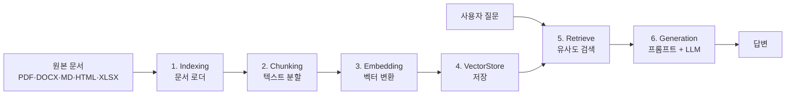
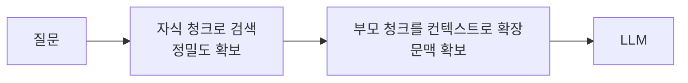

노코드로 만든다고 해서 RAG 개념을 몰라도 되는 것은 아니다. 청크 크기를 잘못 잡으면 화면에서 조립했든 코드로 짰든 똑같이 검색이 실패한다. **노코드가 없애는 것은 구현 부담이지 설계 부담이 아니다.**

이 글은 그 설계 부담이 어디에 남는지를 다룬다. 워크플로우를 구성하는 노드 17종을 언제 쓰고 언제 피하는지, 그리고 지식베이스의 청킹·임베딩·검색 설정을 **실제 워크플로우에서 관찰된 값**과 함께 정리한다. 플랫폼 구조와 도입 판단은 [앞 편](/blog/rag/dify-architecture/)에 있다.

## 용어 정리

| 용어 | 뜻 |
|---|---|
| **질문 분류기** | 질문을 사전 정의 클래스로 분류해 경로를 가르는 노드. LLM 기반, **의미 단위 분기** |
| **IF/ELSE** | 변수 값 비교로 경로를 가르는 노드. 규칙 기반, **결정적이고 비용 0** |
| **변수 집계자** | 여러 갈래의 출력을 하나의 출력 변수로 모으는 노드. 배타 분기의 합류 지점 |
| **템플릿** | Jinja2 문법으로 여러 변수를 하나의 문자열로 조립하는 노드 |
| **이터레이션** | 배열의 각 항목에 하위 그래프를 반복 적용. `is_parallel`로 동시 실행 수 제어 |
| **Loop** | 종료 조건을 만족할 때까지 반복. **횟수가 미정**이라 상한 필수 |
| **매개변수 추출기** | 자연어에서 구조화된 필드를 뽑는 노드 |
| **Indexing** | 문서 로딩 → 청킹 → 임베딩 → 저장까지의 적재 파이프라인 |
| **부모-자식 청크** | 자식(작은 조각)으로 검색하고 부모(큰 문단)를 컨텍스트로 넘기는 방식 |
| **top_k** | 검색해 올 청크 개수. 많을수록 재현율↑ 토큰비용↑ |
| **score_threshold** | 유사도가 이 값 미만이면 버림. 무관한 청크가 프롬프트에 섞이는 것을 막는 안전장치 |

## 노드 17종 — 언제 쓰고 언제 피하나

| 노드 | DSL `type` | 하는 일 | **언제 쓰나 / 언제 피하나** |
|---|---|---|---|
| **시작** | `start` | 입력 변수 정의, 시스템 변수 제공 | 모든 그래프의 유일한 진입점. 입력 스키마를 여기서 확정 |
| **LLM** | `llm` | 모델 호출 | 판단·생성이 필요할 때. **결정적 처리에는 쓰지 말 것** |
| **지식 검색** | `knowledge-retrieval` | 지식베이스에서 관련 청크 검색 | 사내 문서 기반 답변. 최신 정보는 웹검색 도구로 |
| **질문 분류기** | `question-classifier` | 질문을 클래스로 분류해 분기 | **의미 기준** 분기. LLM 호출 1회 비용 발생 |
| **IF/ELSE** | `if-else` | 변수 비교로 분기 | **규칙 기준** 분기. 비용 0·결정적. **가능하면 이쪽 우선** |
| **변수 집계자** | `variable-aggregator` | 여러 갈래 출력을 한 변수로 수렴 | 배타 분기의 합류. **조합이 아니라 수렴** |
| **템플릿** | `template-transform` | Jinja2로 여러 변수를 한 문자열로 조립 | 동시 실행 결과의 **조합**·최종 포맷팅 |
| **반복** | `iteration` | 배열 각 항목에 하위 그래프 반복 | 개수가 정해진 반복. `is_parallel`로 동시 실행 |
| **Loop** | `loop` | 종료조건까지 반복 | 개수가 미정인 반복. **상한 설정 필수** |
| **코드** | `code` | Python3 실행 | 문자열 파싱·리스트 변환 등 결정적 처리. LLM 대체용 |
| **매개변수 추출기** | `parameter-extractor` | 자연어에서 구조화 필드 추출 | 후속 노드가 필요로 하는 타입(특히 `array[string]`)을 만들 때 |
| **Doc 추출기** | `document-extractor` | 파일 → 텍스트 | 업로드 파일을 LLM에 넣기 전 필수 |
| **도구** | `tool` | 외부 API·플러그인 호출 | 검색·크롤링·변환·TTS 등 |
| **HTTP 요청** | `http-request` | 임의 REST 호출 | 사내 시스템 연동. 인증정보 관리 주의 |
| **변수 할당** | `assigner` | 대화 변수에 값 저장 | 채팅플로우에서 턴 간 상태 유지 |
| **끝** | `end` | 워크플로우 종료·출력 반환 | `mode: workflow` 전용 |
| **답변** | `answer` | 사용자에게 응답 출력 | `mode: advanced-chat` 전용. **중간에도 놓을 수 있음** |

가장 중요한 선택은 **IF/ELSE와 질문 분류기 사이**다. 사용자가 종류를 직접 고르면 IF/ELSE, 자연어만 던지면 질문 분류기다. IF/ELSE는 비용 0에 결정적이고, 분류기는 LLM 호출 1회에 확률적이다. **가능하면 규칙 기반을 먼저 쓴다.**

### 시작 노드 — 변수명을 나중에 바꾸면 참조가 깨진다

시스템 변수는 별도 정의 없이 쓸 수 있다.

| 변수명 | 타입 | 설명 |
|---|---|---|
| `sys.query` | String | 사용자의 이번 턴 질문(채팅 계열) |
| `sys.files` | Array[File] | 업로드 파일 목록 |
| `sys.user_id` | String | 실행한 사용자 ID |
| `sys.app_id` | String | 현재 앱 ID |
| `sys.workflow_run_id` | String | 이번 실행의 고유 ID |

| 필드 타입 | DSL `type` | 용도 |
|---|---|---|
| 짧은 텍스트 | `text-input` | 단어·한 문장 |
| 문단 | `paragraph` | 여러 줄 긴 텍스트 |
| 선택 | `select` | 미리 정의된 옵션 중 하나. **분기의 입력으로 자주 쓰임** |
| 숫자 | `number` | 수치 전용 |
| Single File | `file` | 파일 1개 |
| File List | `file-list` | 파일 여러 개 |

> `변수명`(내부 식별자)과 `레이블명`(화면 표기)이 분리되어 있다.
>
> 노드 참조는 `{{#노드ID.변수명#}}` 형식이므로 **변수명을 나중에 바꾸면 참조가 깨진다.** 레이블만 바꾸는 것은 안전하다. 사내 배포 워크플로우에서 지켜야 할 규칙이다.

### LLM 노드 — 분류와 추출은 온도를 낮춘다

| 항목 | 의미 | 운영 포인트 |
|---|---|---|
| 모델 | 공급자 + 모델명 + 모드 | DSL에 공급자 식별자가 박힌다. **공급자 교체 시 전 노드 수정 필요** |
| 컨텍스트 | 참고할 문맥 변수 지정 | 지정 시 프롬프트에서 `{{#context#}}`로 참조 |
| SYSTEM 프롬프트 | 역할·톤·제약 | "모르면 모른다고 답하라"는 환각 억제의 기본 |
| USER 프롬프트 | 실제 질문 + 컨텍스트 | 변수 치환 `{{#노드ID.필드#}}` |
| 메모리 | 이전 턴 대화 유지 | 채팅플로우에서만 의미 있음 |
| 출력변수 | 응답 저장 변수 | 관례상 `text` |
| 실패 시 재시도 / 오류 처리 | 모델 호출 실패 대응 | **프로덕션 워크플로우에서 반드시 설정** |

| 파라미터 | 범위 | 의미 |
|---|---|---|
| Temperature | 0~1 | 창의성. **분류·추출은 낮게(0~0.2), 생성은 높게** |
| Top P | 0~1 | 응답 다양성 |
| Presence Penalty | 0~1 | 같은 **주제** 반복 억제 |
| Frequency Penalty | 0~1 | 같은 **단어·문장** 반복 억제 |
| Max Tokens | 1~8192 | 응답 길이 상한. **비용 통제의 1차 수단** |
| Seed | 정수 | 응답 일관성 고정 |
| Response Format | TEXT/JSON 등 | 후속 노드가 파싱해야 하면 JSON |

> 실제 워크플로우들은 대부분 `temperature: 0.7`을 그대로 쓰는 반면, 분류기와 RAG용 LLM은 `0.1`이다.
>
> **분류와 추출은 온도를 낮추고 생성만 높인다** — 워크플로우 리뷰에서 가장 먼저 볼 항목이다. 분류기를 0.7로 두면 같은 입력에 다른 경로를 타는 일이 생긴다.

### 반복과 Loop는 다르다

| 구분 | 반복(이터레이션) | Loop |
|---|---|---|
| 종료 조건 | 배열 길이 = 반복 횟수 | 종료 조건식 충족 시 |
| 입력 | 배열 변수 | 상태 변수 |
| 병렬 | `is_parallel` + `parallel_nums` 지원 | 순차(상태 의존) |
| 폭주 위험 | 낮음(배열 길이 상한) | **높음** → 최대 반복 횟수 필수 |
| 전형 용도 | 검색어 N개 각각 검색 | 품질 기준 만족까지 재작성 |

템플릿 노드는 Jinja2 문법을 쓴다. 변수 출력은 `{{ 변수명 }}`, 조건문은 ` … `, 필터는 `{{ 변수 | 필터명 }}` 형태이고 `lower`·`upper`·`length`·`default("값")` 등을 쓸 수 있다.

### 도구와 파라미터 잠그기

| 도구 | 하는 일 | 주요 파라미터 |
|---|---|---|
| **Tavily Search** | 실시간 웹 검색 | `query`, `search_depth`, `topic`, `days`, `max_results`, `include/exclude_domains` |
| **Firecrawl Scrape** | URL 본문 크롤링 | `url`, `onlyMainContent`, `formats`, `includeTags`/`excludeTags` |
| **Arxiv Search** | 논문 검색 | `query`(제목·ID·저자) |
| **JSON Parse** | JSON 문자열에서 필드 추출 | `JSON data`, `JSON filter` |
| **Current Time** | 현재 시각 생성 | `FORMAT`, `TIMEZONE` |
| **Code Interpreter** | 지정 언어 코드 실행 | `Language`, `Code` |
| **Markdown to PPTX** | 마크다운 → PPTX 파일 | `markdown_content`, `theme`, `title` |

> 도구 파라미터에는 두 가지 타입이 있다 — `constant`(고정값)와 `mixed`(변수 치환 가능).
>
> 예를 들어 웹 검색 노드는 `query`를 `mixed`로 두어 사용자 질문을 넣고, `days`·`country`·`search_depth`는 `constant`로 고정한다. **사용자가 못 건드리게 할 값은 `constant`로 잠그는 것이 사내 배포의 기본**이다.

## 지식베이스 RAG — 개념은 그대로다

### 청킹 — 검색 품질의 대부분이 여기서 결정된다

| 파라미터 | 의미 | 실무 감각 |
|---|---|---|
| 세그먼트 식별자 | 분할 기준 구분자 | `\n\n` = 단락 단위 / `\n\n,\n` = 단락이 상한 초과 시 줄로 재분할 |
| 최대 청크 길이 | 청크 1개의 상한 | 너무 크면 무관한 내용이 섞이고, 너무 작으면 문맥이 끊김 |
| 청크 중첩 | 인접 청크가 겹치는 토큰 수 | 경계에서 잘린 문맥을 보완 |
| Q&A 형식 청크 | 문서를 질문-답변 쌍으로 변환해 적재 | **FAQ·매뉴얼에서 검색 적중률이 크게 오름** |

검색 정밀도(작을수록 유리)와 답변 품질(클수록 유리)이 상충하는 문제를 구조로 푸는 방식이 **부모-자식 청크**다.

단락 기준으로 시작해 중첩을 조금 주고, 정밀도와 문맥이 계속 부딪히면 부모-자식으로 옮겨 가는 것이 기본 순서다.

### 임베딩 — 인덱스 모드가 비용을 결정한다

| 특징 | Dense Vector (Embedding) | Sparse Vector (Vectorization) |
|---|---|---|
| 의미 반영 | 문맥적 의미·유사성 반영 | 단순 빈도·위치. 의미 없음 |
| 모델 활용 | 신경망 사전학습 모델 | 통계 기법(TF-IDF, BoW) |
| 벡터 특성 | 밀집·저차원 | 희소·고차원 |
| 문맥 반영 | 같은 단어도 문맥 따라 다른 벡터 | 같은 단어는 항상 같은 벡터 |
| 응용 | 의미 기반 검색, 유사도, 클러스터링 | 단순 분류, 초기 검색엔진 |

| 인덱스 모드 | 실제 방식 | 특징 |
|---|---|---|
| **고품질** | Embedding | 의미 유사도 계산. 임베딩 토큰 비용 발생 |
| **경제적** | Vectorization(키워드) | 토큰 소비 없이 빠름. 정확도는 낮을 수 있음 |

> 인덱스 모드는 **적재 시점에 결정되고 문서량에 비례해 임베딩 비용이 발생한다.**
>
> 즉 "아무 문서나 올려도 된다"고 열어두면 비용이 지식베이스 크기에 비례해 늘어난다. **지식베이스 신설 권한을 제한해야 하는 실질적 이유**가 여기 있다.

### 검색 — 실제로 관찰된 설정값

Retriever와 Reranker의 역할 분담이 핵심이다. **Retriever는 대규모 집합에서 후보를 빠르게 추출**하고, **Reranker는 소수 후보를 정교하게 재평가**한다.

실제 워크플로우에서 쓰인 설정값이다.

| 앱 | 벡터 가중치 | 키워드 가중치 | top_k | 임계값 | 재랭크 |
|---|---|---|---|---|---|
| RAG 챗봇 | 0.7 | 0.3 | 7 | 0.21 | 활성 |
| 고급 챗봇 | 0.7 | 0.3 | 4 | — | 비활성 |
| AI_Brief_DB | 0.7 | 0.3 | 4 | — | 비활성 |
| Query Expansion 워크플로우 | — | — | 8 | — | **활성** (다국어 rerank 모델) |

> **벡터:키워드 = 7:3이 사실상 기본값으로 반복된다.** 고유명사·제품코드·약어가 많은 도메인일수록 키워드 비중을 올린다.
>
> 더 흥미로운 것은 재랭크 패턴이다. **이터레이션으로 여러 질의를 동시에 검색하는 워크플로우에서만 재랭크를 붙였다.** 후보가 많아질 때 효용이 커지기 때문이다. 반대로 단일 질의에 top_k 4인 구성에서는 재랭크를 꺼서 비용과 지연을 아꼈다.
>
> **재랭크는 항상 켜는 것이 아니라 후보 수에 비례해 켠다.**

`score_threshold`를 켜는 것도 중요하다. 임계값이 없으면 **무관한 청크도 top_k만큼 채워져 프롬프트에 들어간다.**

### 검색 테스트가 확산 속도를 좌우한다

| 기능 | 용도 |
|---|---|
| 청크 확인 | 실제로 어떻게 잘렸는지 육안 검증 |
| 검색 테스트 | 앱을 만들기 전에 질의를 넣어 검색 품질만 먼저 확인 |
| 지식 설정 | 인덱스 모드·검색 설정 변경 |

> **검색 테스트는 노코드 확산의 숨은 핵심 기능이다.**
>
> 현업이 "챗봇이 이상해요"라고 할 때 원인이 검색인지 프롬프트인지를 **개발자 없이 스스로 가릴 수 있게** 해 준다. 1차 트러블슈팅을 현업에 위임할 수 있다는 뜻이고, 이것이 확산 속도를 좌우한다.

### 생성 — 마지막 문장이 유일한 방어선이다

실제 RAG 챗봇의 시스템 프롬프트는 세 문장이다.

> 당신은 친절한 AI 어시스턴트입니다.
>
> 사용자의 질문에 대해 컨텍스트 내용에 기반하여 답변해주세요.
>
> 컨텍스트에서 질문에 답변을 찾지 못하면 모른다고 답해주세요.

세 문장이 각각 역할·근거제약·환각억제를 담당한다. 노코드에서도 **프롬프트의 마지막 문장이 사실상 유일한 환각 방어선**이라는 점은 코드 기반 RAG와 완전히 같다.

부품을 알았으면 다음은 조립이다. [다음 편](/blog/rag/dify-workflow-patterns/)에서 실제 워크플로우 9종을 분해해 분기·병렬·템플릿·MCP 연동 패턴을 본다.
