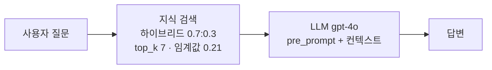
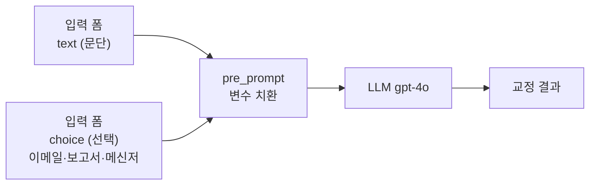
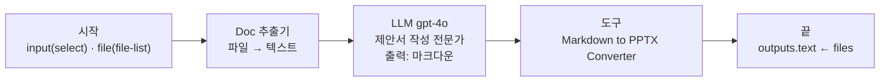
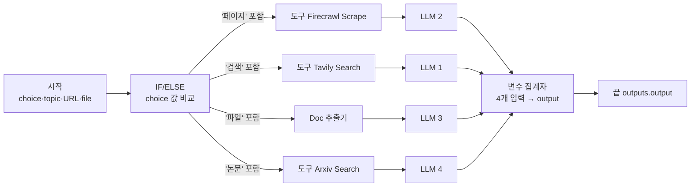
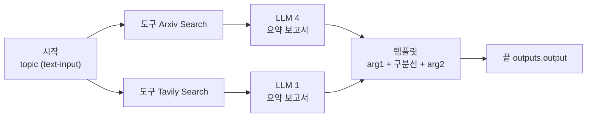
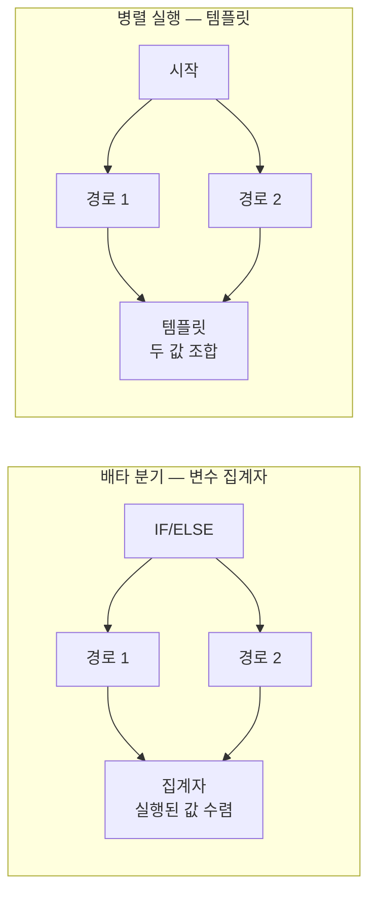
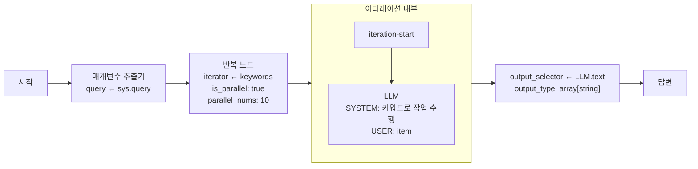
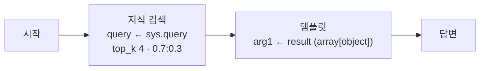
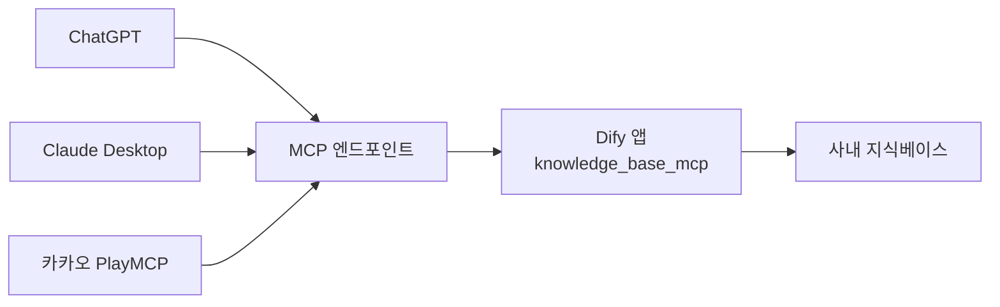
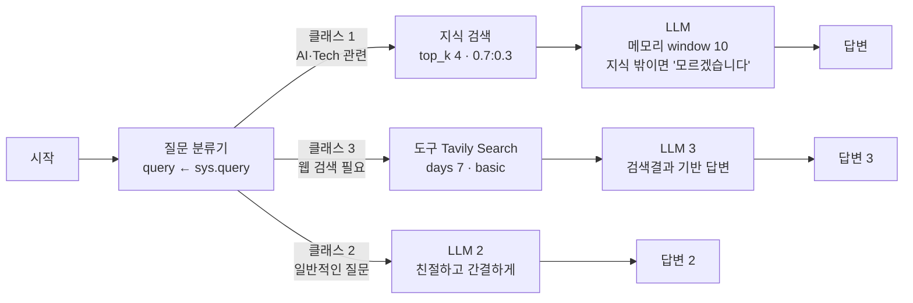

이름이 거의 같은 두 워크플로우가 있다. 하나는 IF/ELSE로 갈라 변수 집계자로 모으고, 다른 하나는 분기 없이 전부 병렬 실행한 뒤 템플릿으로 조합한다. **겉보기엔 같은 요약 기능인데 실행 모델과 비용 구조가 완전히 다르다.**

이 글은 실제 워크플로우 9개를 분해해 그런 차이들을 드러낸다. 배타 분기와 동시 실행, 비정형 입력을 배열로 바꾸는 진입 경로, LLM이 아예 없는 검증용 앱, 그리고 **MCP가 워크플로우 안이 아니라 퍼블리시 계층에 붙는다**는 사실까지 다룬다. 노드 하나하나의 쓰임새는 [앞 편](/blog/rag/dify-nodes-and-knowledge/)에 있다.

## 문서 QnA — 가장 단순한 형태가 가장 먼저 쓸모 있다

문서를 근거로 답하는 챗봇이다. `mode: chat`이라 **그래프 없이 설정만으로 성립한다.**



| 설정 | 값 |
|---|---|
| 지식 | 데이터셋 1개 연결 |
| 검색 | 하이브리드, 재랭크 활성 |
| 가중치 | 벡터 0.7 / 키워드 0.3 |
| top_k / 임계값 | 7 / 0.21 (활성) |
| 근거 표시 | 답변에 출처 청크 노출 |

세 가지가 중요하다. **가장 단순한 형태가 가장 먼저 쓸모 있으므로** 사내 확산의 첫 템플릿은 이것이어야 한다. `score_threshold: 0.21`을 켠 것도 결정적이다 — 임계값이 없으면 무관한 청크도 top_k만큼 채워져 프롬프트에 들어간다. 그리고 **출처 노출을 켜면 사용자가 답변을 검증할 수 있으므로** 사내 배포 시 기본값으로 강제할 항목이다.

## 분기 없이 분기를 구현하기

입력 텍스트를 목적(이메일·보고서·메신저)에 맞게 교정하는 챗봇이다.



목적별로 IF/ELSE를 만들지 않고 `{{choice}}`를 프롬프트에 꽂아 **LLM이 톤을 조절하게 했다.** 노드는 하나, 유지보수 지점도 하나다.

트레이드오프는 명확하다. 목적별 품질을 개별 튜닝할 수 없고, 옵션이 늘어나도 프롬프트만 길어진다. **옵션이 5개를 넘고 품질 편차가 문제되기 시작하면 그때 분기로 쪼갠다.** `select` 필드로 자유입력을 막아 프롬프트 인젝션 표면을 줄인 점도 눈여겨볼 부분이다.

## LLM은 마크다운만 만들고 변환은 도구가 한다

입찰 공고문을 업로드하면 제안서 PPT 초안을 만드는 워크플로우다.



> **LLM에게 바이너리 포맷 생성을 시키지 않는 것이 정석이다.** 중간 표현(마크다운)을 두면 검증도 수정도 쉬워진다.

이 워크플로우에는 리뷰에서 잡아야 할 결함이 둘 있다.

| 결함 | 내용 | 왜 문제인가 |
|---|---|---|
| **입력 스키마와 그래프 불일치** | 시작 노드의 `input`은 세 옵션(PPT/줄글/QnA)을 받지만 그래프에 분기가 없어 항상 PPT 경로로만 흐른다 | **사용자가 동작하지 않는 옵션을 선택한다** |
| **출력 변수명과 내용 불일치** | 끝 노드 출력 변수명이 `text`인데 실제로는 파일 배열을 담는다 | 어댑터가 기대하는 `output` 규약과도 어긋나 최종 산출을 못 받는다 |

확장하려면 Doc 추출기 뒤에 IF/ELSE를 넣고 `input` 값으로 경로를 가르면 된다.

## 배타 분기와 동시 실행 — 같은 기능, 다른 실행 모델

같은 "콘텐츠 요약" 과업을 두 가지 방식으로 구현한 사례가 나란히 있다. **이 대비가 노코드 워크플로우 설계 이해의 핵심이다.**

### 방식 A — IF/ELSE 4갈래 + 변수 집계자



노드 12개다. 여기서 드러나는 문제가 둘 있다.

**`contains` 비교의 취약성.** 옵션 문자열에 "페이지"·"논문"·"파일"·"검색"이 들어 있느냐로 분기한다. 옵션 라벨을 나중에 바꾸면(예: "웹문서 요약") **조건이 조용히 깨진다.** 라벨과 분기 키를 분리하는 것이 안전하다.

**LLM 4개가 거의 같은 프롬프트를 중복 보유한다.** 프롬프트를 고칠 때 4곳을 고쳐야 하고, 실제로 한 곳은 이미 미세하게 어긋나 있다.

> 개선안은 순서를 뒤집는 것이다. 수집 노드들을 변수 집계자로 **먼저 합치고** → LLM 1개로 요약 → 끝. 노드 12개가 8개로 줄고 프롬프트 유지보수 지점이 1곳이 된다.
>
> **"합치고 나서 처리"가 "처리하고 나서 합치기"보다 대개 낫다.** 노코드 워크플로우의 전형적 리팩터링 포인트다.

### 방식 B — 병렬 실행 + 템플릿



노드 7개. 분기가 아예 없고 두 소스를 항상 동시에 친 뒤 템플릿으로 조합한다.

| 축 | 배타 분기 + 집계자 | 병렬 + 템플릿 |
|---|---|---|
| 분기 성격 | **배타** — 1개만 실행 | **동시** — 전부 실행 |
| 사용자 입력 | 종류를 직접 선택해야 함 | 주제만 넣으면 됨 |
| 실행 시간 | 1개 경로 시간 | 가장 느린 경로 시간 |
| 토큰 비용 | 1회분 | **경로 수만큼** |
| 합류 노드 | 변수 집계자 = 값 **수렴** | 템플릿 = 값 **조합** |
| 출력 | 선택한 소스의 요약 1개 | 두 소스 요약이 나란히 |
| 확장 비용 | 소스 추가 시 3곳 수정 | 소스 추가 시 2곳 수정 |
| 적합한 상황 | 소스가 상호배타적, 비용 민감 | 소스가 상호보완적, 다각도 검토 |



> **선택 규칙은 한 줄이다.** 하나만 맞는 답이면 집계자, 여럿을 모두 보여줘야 하면 템플릿.

템플릿 방식에는 숨은 이점이 있다. **출력 형식을 사람이 통제한다.** LLM에게 "둘을 합쳐서 정리해줘"라고 시키면 형식이 매번 흔들리지만 템플릿은 결정적이다. **LLM에게 시키지 않아도 되는 일은 시키지 않는다**는 원칙의 사례다.

다만 비용이 경로 수에 비례한다. 소스가 5개면 질문 1회당 LLM 5회다. 사내 배포 시 **경로 수에 상한**을 두는 규칙이 필요하다.

## 비정형 → 배열 → 반복

사용자 입력에서 키워드 배열을 추출하고 각 키워드에 대해 LLM 작업을 **동시에** 수행하는 워크플로우다.



> **이 워크플로우의 진짜 주제는 타입 변환이다.** 이터레이션은 배열을 요구하고 사용자 입력은 자연어다. 그 간극을 매개변수 추출기의 `array[string]` 타입이 메운다.
>
> **비정형 → 배열 → 반복**이 노코드 병렬 처리의 표준 진입 경로다.

같은 변환을 하는 방법이 둘이고 선택 기준이 명확하다.

| 방법 | 비용 | 정확성 | 적합한 입력 |
|---|---|---|---|
| 매개변수 추출기 | LLM 호출 1회 | 입력 형태가 흔들려도 견딤 | 자연어 원문 |
| 코드 노드 | 0 | 형식이 정확할 때만 동작 | 이미 구분자로 정리된 문자열 |

`parallel_nums: 10`은 **동시 실행 상한**이다. 이 값이 곧 순간 API 호출량이므로 **레이트리밋과 비용 스파이크의 조절 손잡이**다. 사내 배포에서 무제한으로 열어두면 안 된다.

리뷰에서 지적할 것도 있다. 추출 파라미터 4개 중 실제로 쓰이는 것은 `keywords` 하나이고 나머지 3개는 원래 시나리오의 잔재다. **불필요한 추출은 토큰과 실패 확률만 늘린다.**

## LLM 없는 워크플로우 — 관측이 목적이다

지식 검색 결과를 **가공 없이 그대로** 출력하는 앱이다. 노드가 4개인데 **LLM 노드가 없다.**



목적이 답변이 아니라 **관측**이다. 이런 "검색 전용 앱"을 별도로 두면 RAG 품질 문제가 생겼을 때 **검색이 못 찾은 것인지, LLM이 잘못 읽은 것인지**를 즉시 가릴 수 있다. 토큰 비용도 질의 임베딩 1회뿐이라 자주 돌려도 부담이 없다.

현업에 1차 진단을 위임하는 장치이기도 하다. "챗봇이 이상해요"라는 신고가 들어왔을 때 이 앱을 먼저 돌려보게 하면 개발조직에 도달하는 문의의 성격이 달라진다.

## MCP는 워크플로우가 아니라 퍼블리시 계층에 붙는다

지식베이스를 외부 AI 클라이언트가 호출할 수 있는 도구로 노출하는 앱이다. 그래프는 앞의 검증용 앱과 **완전히 동일하다.**


DSL 어디에도 MCP 관련 설정이 없다. 앱 이름만 다르다. **이것이 결정적 사실이다.**

> **MCP는 워크플로우 안이 아니라 앱을 퍼블리시하는 계층에 붙는다.**
>
> 즉 **이미 만들어 둔 어떤 앱이든 코드 한 줄 고치지 않고 MCP 서버로 노출할 수 있다.** 워크플로우 설계와 외부 노출은 완전히 분리된 관심사다.

퍼블리시하면 엔드포인트가 생기고, 그 URL을 등록하면 외부 클라이언트가 도구를 발견해 호출한다.

| 클라이언트 | 등록 방식 | 사용 형태 |
|---|---|---|
| **ChatGPT** | 커넥터에 MCP 서버 URL 등록 | 사내 지식 검색 도구로 호출 |
| **Claude Desktop** | MCP 서버 설정 | 시스템 프롬프트로 웹검색 금지 + 사내 도구만 사용 강제 |
| **카카오 PlayMCP** | 플랫폼에 등록 | 동일 |

도구 사용을 강제하는 프롬프트 패턴은 이렇게 생겼다.

```text
You are an assistant that should answer by using given tools.
Use `search_ai_brief` tool to answer the question.

[RULE]
- NEVER use WEB SEARCH. Only use `search_ai_brief` tool.
- Your answer should be based on information from `search_ai_brief` tool.
- Write your answer in Korean.
```



### 조직 관점에서 이것이 왜 중요한가

| 관점 | MCP 이전 | MCP 이후 |
|---|---|---|
| 사용자 진입점 | 사내 챗봇 UI로 **찾아와야** 함 | 이미 쓰는 도구 안에서 사내 지식 사용 |
| 채택률 | UI 이동 비용만큼 떨어짐 | 도구 등록 한 번이면 상시 사용 |
| 개발 부담 | 클라이언트별 연동 개발 | 프로토콜 표준 하나 |
| **통제** | 사내 UI 안에서 전부 관측 | **외부 클라이언트가 호출** → 관측·인증이 어려워짐 |

> **MCP는 확산의 최고 수단이자 통제의 최대 난점이다.**
>
> 엔드포인트 URL 하나가 사내 지식 전체에 대한 접근권이 되므로 **URL 자체를 자격증명으로 취급**해야 한다.
>
> 그리고 외부 클라이언트에서 온 호출은 사내 계정과 연결되지 않을 수 있어, **어떤 지식베이스를 MCP로 열지는 문서 등급 기준으로 별도 승인**해야 한다. 공개 가능 등급만 여는 것이 안전한 출발점이다.

## 의미 기반 분기 — 가장 완성도 높은 그래프

질문 성격에 따라 사내 지식 / 일반 상식 / 웹 검색 중 적합한 경로를 자동 선택하는 챗봇이다. 노드 10개.



**경로마다 답변 노드를 따로 두었다.** 변수 집계자로 모으지 않고 각 경로가 자기 답변 노드로 끝난다.

| 방식 | 장점 | 단점 |
|---|---|---|
| 경로별 답변 노드 | 경로별로 출력 포맷·후처리를 다르게 가능. 스트리밍이 곧바로 시작 | 노드 수 증가, 공통 후처리 넣기 어려움 |
| 변수 집계자 → 답변 1개 | 후처리·로깅을 한 곳에서 | 경로별 차별화 불가 |

공통 후처리(면책 문구·출처 표기 등)를 강제해야 하는 사내 배포에서는 **집계자 + 단일 답변**이 유리하다.

### 질문 분류기와 IF/ELSE의 선택 근거

| 기준 | 질문 분류기 | IF/ELSE |
|---|---|---|
| 판단 근거 | 의미 | 변수 값 |
| 비용 | LLM 호출 1회 | 0 |
| 결정성 | 확률적(같은 입력도 흔들릴 수 있음) | 결정적 |
| 실패 모드 | 오분류 → 엉뚱한 경로 | 조건 누락 → ELSE |
| 적합 | 자연어 입력 | 폼 입력·플래그 |

여기서는 사용자가 종류를 고르지 않고 자연어만 던지므로 **의미 기반 분류가 필수**다. 사용자가 종류를 고르는 구조라면 IF/ELSE가 맞다.

**메모리는 지식 경로에만 붙어 있다.** 후속 질문("그럼 그건 왜?")이 나오는 것은 문서 QnA이지 단발 웹검색이 아니라는 판단으로 읽힌다. 다만 창 크기 제한이 꺼져 있어 전체 이력을 사용하므로, 대화가 길어지면 토큰이 선형 증가한다. **사내 배포에서는 창을 켜는 편이 안전하다.**

웹 검색 도구의 파라미터가 전부 `constant`로 고정되어 사용자가 검색 범위를 조작할 수 없는 점도 눈여겨볼 부분이다. 다만 `country` 같은 값은 사내용이라면 바꿔야 한다.

## 9종 한눈에

| # | 워크플로우 | 모드 | 노드 | 분기 방식 | 합류 방식 | 병렬 | 핵심 학습 포인트 |
|---|---|---|---|---|---|---|---|
| 1 | RAG 챗봇 | chat | — | 없음 | — | — | 하이브리드 검색 + 임계값 + 출처 노출 |
| 2 | 텍스트 교정 | chat | — | 프롬프트 변수 | — | — | 분기 없이 옵션 처리 |
| 3 | 제안서(PPT) | workflow | 5 | 없음(미구현) | — | — | LLM은 마크다운, 변환은 도구 |
| 4 | 텍스트 요약 | workflow | 12 | IF/ELSE 4갈래 | 변수 집계자 | ✕ | 배타 분기 + 수렴 |
| 5 | 텍스트 요약(템플릿) | workflow | 7 | 없음(무조건 병렬) | 템플릿 | ○ | 동시 실행 + 조합 |
| 6 | 키워드 병렬작업 | advanced-chat | 6 | 없음 | 이터레이션 출력 | ○(10) | 비정형→배열→반복 |
| 7 | 검색 검증 앱 | advanced-chat | 4 | 없음 | — | — | LLM 없는 관측 도구 |
| 8 | knowledge_base_mcp | advanced-chat | 4 | 없음 | — | — | MCP는 퍼블리시 계층 |
| 9 | 고급 챗봇 | advanced-chat | 10 | 질문 분류기 3갈래 | 경로별 답변 | ✕ | 의미 기반 분기 + 경로별 메모리 |

9개를 관통하는 것은 **합류 방식이 곧 설계 의도**라는 점이다. 집계자는 수렴, 템플릿은 조합, 이터레이션 출력은 누적, 경로별 답변은 차별화다. 어느 것을 골랐는지가 그 워크플로우가 무엇을 하려는지를 말해 준다.

여기까지가 개별 워크플로우의 패턴이다. 이것들을 조직에 뿌리고 통제하는 방법은 [다음 편](/blog/rag/dify-enterprise-governance/)에서 다룬다.
