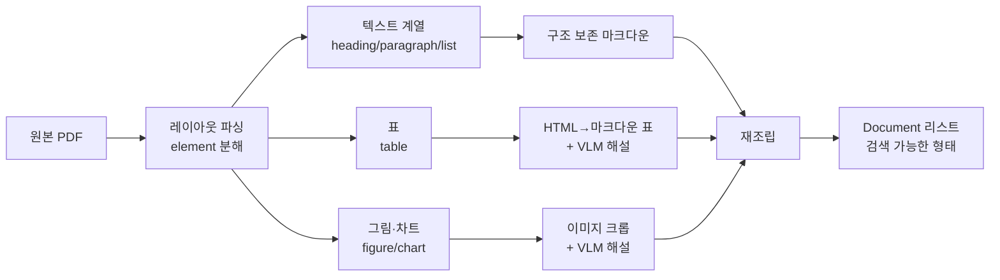

RAG가 틀린 답을 낼 때 대부분 검색기나 모델을 먼저 의심한다. 그런데 실제 원인의 상당수는 그 앞단 — **문서를 텍스트로 바꾸는 순간**에 이미 정보가 사라진 것이다. 임베딩 모델을 바꾸거나 리랭커를 붙여도, 애초에 텍스트에 없는 숫자는 검색되지 않는다.

이 글은 파싱 손실이 왜 복구 불가능한지를 먼저 보이고, 표준 로더가 없는 포맷을 직접 다루는 방법으로 이어진다. LangChain `BaseLoader`의 설계 규약, HWP처럼 표준 로더가 없는 한국 공공문서를 파싱하는 구현, 그리고 상용 파서에 파싱 지시문을 주어 품질을 끌어올리는 방법을 다룬다. 이 시리즈는 4개월에 걸쳐 네 세대로 발전한다 — [레이아웃 파서와 그래프화](/blog/rag/layout-parser-pipeline/), [패키지 구조와 상태 설계](/blog/rag/layoutparse-architecture/), [노드 파이프라인](/blog/rag/layoutparse-nodes/), 그리고 [프롬프트 설계와 품질 진단](/blog/rag/multimodal-prompt-design/)이다.

## 용어 정리

| 용어 | 풀이 |
|---|---|
| **Document Loader** | 원시 파일(PDF·HWP·DOCX)을 LangChain `Document`(= `page_content` + `metadata`)로 변환하는 컴포넌트 |
| **`BaseLoader`** | LangChain의 로더 추상 클래스. `lazy_load()`만 구현하면 `load`/`aload`/`alazy_load`가 따라온다 |
| **lazy loading (지연 로딩)** | 전량을 메모리에 올리지 않고 제너레이터로 하나씩 흘려보내는 방식. 대용량 문서에서 필수 |
| **layout parsing** | 페이지를 픽셀·텍스트 덩어리가 아니라 **의미 단위 블록**(제목·문단·표·그림)으로 분해하는 것 |
| **element** | 레이아웃 파싱의 최소 단위. `category` + `content` + `coordinates` + `page` + `id` |
| **OCR** | 이미지에서 글자를 읽는 기술. 텍스트 레이어가 있는 PDF는 **끄는 게** 정확도·비용 모두 유리 |
| **VLM** | Vision Language Model. 이미지를 이해하고 텍스트로 설명하는 모델 |
| **LlamaParse** | 상용 문서 파싱 서비스. 마크다운 출력과 파싱 지시문을 지원 |
| **`parsing_instruction`** | 파서에게 주는 자연어 지시. "표는 마크다운으로, 그래프는 상세 설명으로" 같은 요구 |
| **PyMuPDF** | PDF 조작 라이브러리. 페이지 분할·이미지 렌더링에 사용 |

## 파싱 손실은 뒤에서 복구되지 않는다


핵심은 **C 이후 어떤 단계도 손실을 복구할 수 없다**는 점이다. 이 그림이 파싱을 우선순위 1번에 놓아야 하는 이유 전부다.

### 대표적인 세 가지 실패

| # | 실패 유형 | 원본 | 단순 추출 결과 | RAG에서 나타나는 증상 |
|---|---|---|---|---|
| 1 | **표 뭉개짐** | 행·열 구조의 재무표 | 셀 값이 공백으로 연결된 한 줄 텍스트 | "2021년 매출은?" → 다른 연도 숫자를 답함 |
| 2 | **2단 편집 순서 붕괴** | 좌우 2단 조판 보고서 | 왼쪽 1행 → 오른쪽 1행 → 왼쪽 2행 순으로 섞임 | 문장이 중간에서 끊겨 문맥이 성립하지 않음 |
| 3 | **차트·다이어그램 소실** | 막대그래프·조직도 이미지 | 아무것도 추출되지 않음(빈 문자열) | "추세가 어떻게 되나?" → "자료에 없음" |

1번이 특히 위험하다. **검색은 성공하고 답변도 그럴듯하게 나오는데 숫자만 틀리기** 때문이다. 3번처럼 "자료에 없다"고 답하면 최소한 실패했다는 것은 알 수 있다.

자주 나오는 나머지 손실 유형은 다음과 같다.

| 유형 | 설명 |
|---|---|
| 머리말·꼬리말 오염 | 매 페이지 반복되는 회사명·페이지번호가 청크마다 섞여 노이즈가 된다 |
| 각주 삽입 | 본문 중간에 각주 텍스트가 끼어들어 문장을 끊는다 |
| 수식 파괴 | LaTeX 수식이 깨진 기호 나열로 바뀐다 |
| 병합 셀(colspan/rowspan) 무시 | 헤더가 없어지면서 숫자만 남는다 |
| 한글 인코딩 깨짐 | HWP·구형 PDF에서 제어문자·한자가 섞여 들어온다 |

### 해법의 방향



요지는 셋이다.

1. **유형별로 다르게 처리한다.** 표를 문단처럼 다루는 순간 정보가 죽는다.
2. **그림은 버리지 말고 텍스트로 번역한다.** VLM이 그림을 설명한 문장이 검색 대상이 된다.
3. **머리말·꼬리말·각주는 의도적으로 버린다.** 남기면 노이즈, 버리면 신호가 선명해진다.

## 네 세대에 걸친 진화

이 파이프라인은 2024년 7월부터 11월까지 네 단계로 발전했다. 각 세대가 무엇을 해결했는지 보면 설계 의도가 드러난다.

| 세대 | 시기 | 접근 | 해결한 문제 | 남은 한계 |
|---|---|---|---|---|
| **1세대** | 2024.07 | 커스텀 `BaseLoader` + LlamaParse | 비표준 포맷(HWP) 처리, 파싱 지시문으로 표 품질 개선 | 파이프라인이 단일 함수. 재시도·부분 실패 관리 불가 |
| **2세대** | 2024.08 | Layout Analysis + 직접 크롭 | element 단위 분해, 그림 크롭, HTML→마크다운 재조립 | 절차형 스크립트. 상태 추적·중단 재개 불가 |
| **3세대** | 2024.09 | LangGraph `StateGraph`로 그래프화 | 노드 병렬화, 상태 스냅샷, 체크포인트 | 페이지 요약·표 마크다운을 매번 LLM에 의존(비용) |
| **4세대** | 2024.11 | 패키지화 + Document Parse v2 | base64 응답으로 크롭 제거, 마크다운 네이티브 지원, 모듈 분리, export 서브그래프 | — |


이 글은 1세대를 다룬다.

## 커스텀 Document Loader

### LangChain 로더의 추상화

| 구성요소 | 설명 |
|---|---|
| `Document` | `page_content`(텍스트)와 `metadata`(dict)를 담는 컨테이너 |
| `BaseLoader` | 원시 데이터를 `Document` 리스트로 변환하는 추상 클래스 |

`BaseLoader`가 제공하는 인터페이스는 넷이다.

| 메서드 | 설명 | 용도 |
|---|---|---|
| `lazy_load` | 문서를 하나씩 **지연** 로드 | **운영 코드 권장** |
| `alazy_load` | `lazy_load`의 비동기 변형. 기본 구현은 `lazy_load`에 위임 | 비동기 파이프라인 |
| `load` | 전량을 즉시 메모리에 적재. 내부적으로 `list(self.lazy_load())` | 프로토타이핑 |
| `aload` | `load`의 비동기 변형 | 프로토타이핑 |

### 설계 규약 — 인자는 반드시 `__init__`으로

> 문서 로더를 구현할 때 `lazy_load`나 `alazy_load`에 **매개변수를 넣지 않는다.** 모든 구성은 초기화자(`__init__`)를 통해 전달한다.
>
> 로더가 인스턴스화되는 시점에 모든 문서를 로드하는 데 필요한 정보를 갖추게 하려는 설계 선택이다.

이 규약 덕분에 로더는 "설정이 끝난 객체"가 되어, **파이프라인 어디에 꽂아도 추가 인자 없이 동작한다.** 규약을 어기면 로더를 호출하는 쪽이 매번 그 로더의 사정을 알아야 한다.

### 최소 구현

```python
from typing import Iterator

from langchain_core.document_loaders import BaseLoader
from langchain_core.documents import Document


class CustomDocumentLoader(BaseLoader):
    """파일을 한 줄씩 읽어오는 문서 로더의 예시입니다."""

    def __init__(self, file_path: str) -> None:
        self.file_path = file_path

    def lazy_load(self) -> Iterator[Document]:  # <-- 인자를 받지 않습니다
        """제너레이터로 문서를 하나씩 생성해 반환합니다."""
        with open(self.file_path, encoding="utf-8") as f:
            line_number = 0
            for line in f:
                yield Document(
                    page_content=line,
                    metadata={"line_number": line_number, "source": self.file_path},
                )
                line_number += 1
```

`lazy`가 주는 것을 정리하면 다음과 같다.

| 관점 | 효과 |
|---|---|
| 메모리 효율 | 전량을 한 번에 올리지 않고 필요할 때만 로드 |
| 성능 | 초기 로딩 시간과 메모리 사용량 감소 |
| 제너레이터 | `yield`로 하나씩 순차 생성 |
| 유연성 | 전량 필요하면 `load()`, 부분만 필요하면 `lazy_load()` |

### 실전 사례 — HWP 로더

한국 공공기관 문서는 HWP가 많은데 표준 로더가 없다. OLE 구조를 직접 파싱해야 한다.

```python
from typing import Any, Dict, List, Optional
import olefile
import zlib
import struct
import re
import unicodedata
from langchain.schema import Document
from langchain.document_loaders.base import BaseLoader


class HWPReader(BaseLoader):
    """HWP 파일의 내용을 읽어 Document로 변환합니다."""

    def __init__(self, file_path: str, *args: Any, **kwargs: Any) -> None:
        super().__init__(*args, **kwargs)
        self.file_path = file_path
        self.extra_info = None
        self._initialize_constants()

    def _initialize_constants(self) -> None:
        self.FILE_HEADER_SECTION = "FileHeader"
        self.HWP_SUMMARY_SECTION = "\x05HwpSummaryInformation"
        self.SECTION_NAME_LENGTH = len("Section")
        self.BODYTEXT_SECTION = "BodyText"
        self.HWP_TEXT_TAGS = [67]

    def lazy_load(self) -> List[Document]:
        load_file = olefile.OleFileIO(self.file_path)
        file_dir = load_file.listdir()

        if not self._is_valid_hwp(file_dir):
            raise ValueError("유효하지 않은 HWP 파일입니다.")

        result_text = self._extract_text(load_file, file_dir)
        return [self._create_document(text=result_text, extra_info=self.extra_info)]

    def _is_valid_hwp(self, dirs: List[List[str]]) -> bool:
        """헤더 스트림 존재 여부로 위장 파일을 조기 차단합니다."""
        return [self.FILE_HEADER_SECTION] in dirs and [self.HWP_SUMMARY_SECTION] in dirs

    def _get_body_sections(self, dirs: List[List[str]]) -> List[str]:
        section_numbers = [
            int(d[1][self.SECTION_NAME_LENGTH :])
            for d in dirs
            if d[0] == self.BODYTEXT_SECTION
        ]
        return [
            f"{self.BODYTEXT_SECTION}/Section{num}" for num in sorted(section_numbers)
        ]

    def _create_document(
        self, text: str, extra_info: Optional[Dict] = None
    ) -> Document:
        return Document(page_content=text, metadata=extra_info or {})

    def _extract_text(
        self, load_file: olefile.OleFileIO, file_dir: List[List[str]]
    ) -> str:
        sections = self._get_body_sections(file_dir)
        return "\n".join(
            self._get_text_from_section(load_file, section) for section in sections
        )

    def _is_compressed(self, load_file: olefile.OleFileIO) -> bool:
        """헤더 37번째 바이트의 1비트로 압축 여부를 판정합니다."""
        with load_file.openstream(self.FILE_HEADER_SECTION) as header:
            header_data = header.read()
            return bool(header_data[36] & 1)

    def _get_text_from_section(self, load_file: olefile.OleFileIO, section: str) -> str:
        with load_file.openstream(section) as bodytext:
            data = bodytext.read()

        unpacked_data = (
            zlib.decompress(data, -15) if self._is_compressed(load_file) else data
        )

        text = []
        i = 0
        while i < len(unpacked_data):
            header, rec_type, rec_len = self._parse_record_header(
                unpacked_data[i : i + 4]
            )
            if rec_type in self.HWP_TEXT_TAGS:
                rec_data = unpacked_data[i + 4 : i + 4 + rec_len]
                text.append(rec_data.decode("utf-16"))
            i += 4 + rec_len

        text = "\n".join(text)
        text = self.remove_chinese_characters(text)
        text = self.remove_control_characters(text)
        return text

    @staticmethod
    def remove_chinese_characters(s: str):
        return re.sub(r"[\u4e00-\u9fff]+", "", s)

    @staticmethod
    def remove_control_characters(s):
        """유니코드 카테고리 C(제어문자)를 제거합니다."""
        return "".join(ch for ch in s if unicodedata.category(ch)[0] != "C")

    @staticmethod
    def _parse_record_header(header_bytes: bytes) -> tuple:
        header = struct.unpack_from("<I", header_bytes)[0]
        rec_type = header & 0x3FF
        rec_len = (header >> 20) & 0xFFF
        return header, rec_type, rec_len
```

설계 포인트는 셋이다.

| 포인트 | 내용 |
|---|---|
| 유효성 선검증 | `FileHeader`·`HwpSummaryInformation` 스트림 존재 여부로 위장 파일을 조기 차단 |
| 압축 분기 | 헤더 37번째 바이트의 1비트로 압축 여부 판정 → `zlib.decompress(data, -15)` |
| 후처리 정제 | 한자 제거 + 유니코드 카테고리 `C` 제거 → 인코딩 쓰레기 정리 |

> **한계가 분명하다.** 이 방식은 텍스트 레코드(태그 67)만 훑기 때문에 **표 구조가 그대로 평문으로 흘러나온다.** 대안은 HWP를 PDF로 변환한 뒤 PDF 파서를 쓰는 것이다.
>
> 즉 1세대 시점에서 이미 "표는 별도 처리가 필요하다"는 문제의식이 드러난다. 이것이 2세대 레이아웃 파싱으로 넘어가는 동기가 된다.

### 파싱 지시문 — 상용 파서에도 도메인을 알려준다

```python
from llama_parse import LlamaParse
from llama_index.core import SimpleDirectoryReader
import os

parser = LlamaParse(
    result_type="markdown",          # "markdown" 또는 "text"
    num_workers=4,                   # 여러 파일 처리 시 API 호출 분할 수
    verbose=True,
    language="ko",                   # 기본값 'en'
    skip_diagonal_text=True,         # 대각선 워터마크 텍스트 무시
    use_vendor_multimodal_model=True,
    vendor_multimodal_model_name="openai-gpt4o",
    vendor_multimodal_api_key=os.environ.get("OPENAI_API_KEY"),
)

file_extractor = {".pdf": parser}
documents = SimpleDirectoryReader(
    input_files=["data/report.pdf"], file_extractor=file_extractor
).load_data()
```

여기에 `parsing_instruction`을 추가하면 결과가 눈에 띄게 달라진다.

```python
parsing_instruction = """This document is related to the Digital Government Transformation Initiative.
Be sure to parse tables and should be interpreted as text with detailed informations.
Images, Graphs, Diagrams should be interpreted as text with detailed descriptions."""
```

| 지시문 없음 | 지시문 있음 |
|---|---|
| 표 헤더 열이 누락됨 | 헤더 열이 복원됨 |
| 불릿을 계층 없이 나열 | 강조 구조가 살아남 |
| 도식 내부 텍스트 일부 누락 | 도식의 항목이 텍스트로 풀림 |

> 상용 파서를 쓸 때도 **문서 도메인을 알려주는 한 문단**이 정확도를 좌우한다. "이 문서는 X에 관한 것이다 / 표는 반드시 파싱하라 / 그림·그래프는 상세 설명으로 바꿔라" 세 문장이 기본 템플릿이다.

### 인터페이스만 맞춘 지연 로딩과 진짜 지연 로딩

상용 파서를 `BaseLoader`로 감쌀 때 흔히 나오는 두 버전이다.

```python
class LlamaParseLoader(BaseLoader):
    def __init__(self, file_paths: List[str], parsing_instructions="") -> None:
        parser = LlamaParse(
            result_type="markdown",
            num_workers=4,
            language="ko",
            invalidate_cache=True,
            skip_diagonal_text=True,
            use_vendor_multimodal_model=True,
            vendor_multimodal_model_name="openai-gpt4o",
            vendor_multimodal_api_key=os.environ.get("OPENAI_API_KEY"),
            parsing_instruction=parsing_instructions,
        )
        file_extractor = {".pdf": parser}
        self.document_reader = SimpleDirectoryReader(
            input_files=file_paths,
            file_extractor=file_extractor,
        )

    # 버전 A — 타입만 List
    def lazy_load(self) -> List[Document]:
        documents = self.document_reader.load_data()
        return [doc.to_langchain_format() for doc in documents]

    # 버전 B — 계약에 맞는 제너레이터
    def lazy_load(self) -> Iterator[Document]:
        for doc in self.document_reader.load_data():
            yield doc.to_langchain_format()
```

> **차이의 의미**: 버전 A는 타입만 `List`일 뿐 전량 적재다. 버전 B가 계약에 맞다.
>
> 다만 `load_data()` 자체가 내부적으로 전량을 받아오므로, **진짜 지연 로딩이 되려면 파서 API가 스트리밍을 지원해야 한다.** 인터페이스만 맞춘 것과 실제 지연은 다르다 — 코드 리뷰에서 자주 놓치는 지점이다.

1세대는 여기까지다. 표가 평문으로 뭉개지는 문제와 파이프라인이 단일 함수라 부분 실패를 다룰 수 없는 문제가 남았고, 그것이 [2세대 레이아웃 파서](/blog/rag/layout-parser-pipeline/)로 이어진다.
