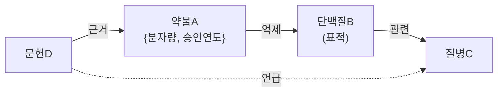
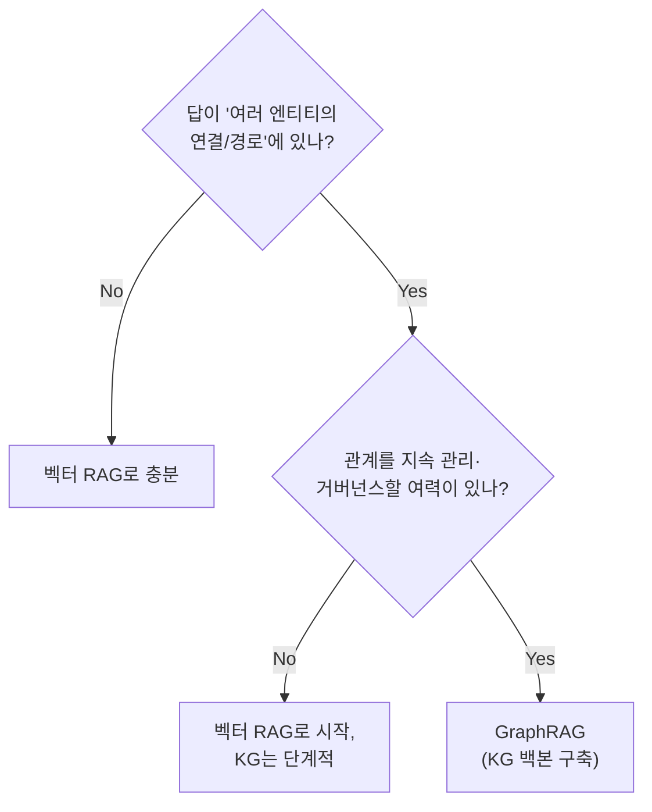
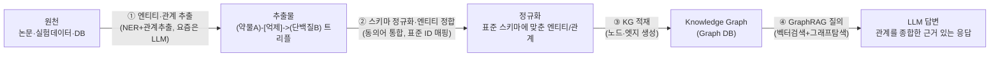
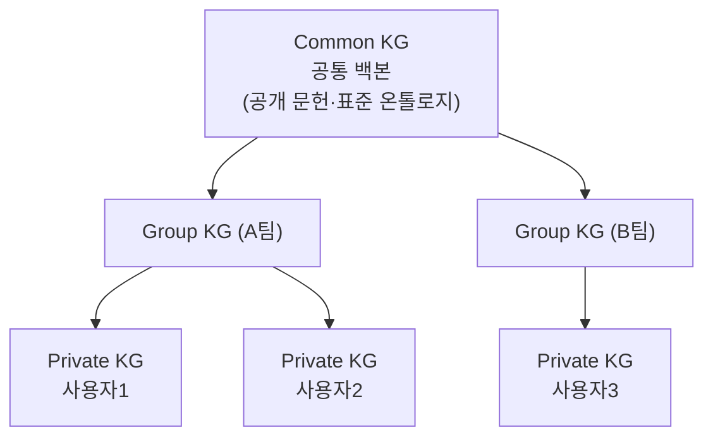
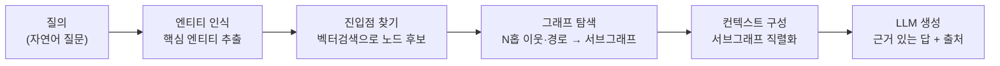

벡터 RAG는 "비슷한 문서 조각"을 찾는다. 그런데 실무에는 답이 조각이 아니라 **연결**에 있는 질문이 있다. "이 약물이 억제하는 표적과 연관된 질병은 무엇이고 그 근거 문헌은 어디인가" 같은 질문은 문서 하나에 답이 없고, 세 번의 관계를 따라가야 답이 나온다.

이 글은 그런 질문을 다루는 구조인 Knowledge Graph와 GraphRAG를 정리한다. 개념과 벡터 RAG와의 차이에서 시작해 Graph DB 선택 기준, 문서에서 그래프를 만드는 구축 파이프라인, 그리고 **KG를 도입하지 말아야 할 조건**까지 다룬다. 마지막 항목이 실무에서 가장 중요하다 — 대부분의 챗봇은 벡터 RAG로 충분하고, KG는 구축과 거버넌스 비용을 계속 지불해야 하는 구조이기 때문이다.

## 한눈에

| 질문 | 한 줄 답 |
|---|---|
| **KG가 뭔가** | 지식을 **노드(엔티티) + 엣지(관계)로** 표현한 그래프. "무엇이 무엇과 어떻게 연결됐나"를 명시적으로 저장 |
| **GraphRAG vs 벡터 RAG** | 벡터 RAG는 "비슷한 문서 조각"을, GraphRAG는 **"연결을 따라간 다단계 관계"를** 끌어온다 |
| **언제 KG를 쓰나** | 답이 **여러 엔티티의 연결·경로·다단계 추론**에 있을 때. 단순 Q&A면 벡터 RAG로 충분 |
| **무슨 DB로** | 범용·생태계는 Neo4j(Cypher), 초대규모는 NebulaGraph, 멀티모델은 ArangoDB, AWS 매니지드는 Neptune |
| **구축 파이프라인은** | 문서 → (LLM)엔티티·관계 추출 → 스키마 정규화·거버넌스 → KG 적재 → GraphRAG 질의 |

## 용어 정리 — KG · Graph DB · GraphRAG

### Knowledge Graph란

- **노드(Node / Vertex)** = 엔티티. 예: `(약물A)`, `(단백질B)`, `(질병C)`.
- **엣지(Edge / Relationship)** = 관계. 예: `(약물A)-[억제]->(단백질B)`, `(단백질B)-[관련]->(질병C)`.
- **속성(Property)** = 노드·엣지에 붙는 데이터. 예: 약물A의 `{분자량, 승인연도}`.

핵심은 **"무엇이 무엇과 어떻게 연결되어 있는가"를 1급 시민(first-class)으로 저장**한다는 점이다.



"약물A가 억제하는 표적B → 그 표적과 연관된 질병C → 그 근거 문헌D"까지 **연결을 따라가는 것**이 KG의 본질이다. 표(RDB)로는 JOIN을 거듭해야 하는 이 탐색이, 그래프에서는 화살표를 따라가는 한 번의 질의가 된다.

### Graph DB vs RDB vs 문서DB

| 구분 | 관계를 어떻게 다루나 | 다단계 연결 질의 | 비고 |
|---|---|---|---|
| **RDB(관계형)** | 외래키 + JOIN | 깊어질수록 JOIN 폭증, 느려짐 | "관계형"이란 이름과 달리 다단계 관계 탐색에 약함 |
| **문서DB(MongoDB 등)** | 문서 내 중첩/참조 | 조인 약함, 앱에서 연결 | 관계 탐색을 애플리케이션이 떠안게 됨 |
| **Graph DB** | 관계가 **물리적 포인터** | **수 홉(hop)도 빠르게 탐색** | "A와 3단계 연결된 모든 C" 같은 질의에 최적 |

> 핵심 변별점은 한 줄로 정리된다. **JOIN이 깊어지면 RDB는 느려지지만, Graph DB는 관계를 직접 따라가 일정하게 빠르다.**

### GraphRAG와 벡터 RAG의 차이

| | 벡터 RAG | GraphRAG |
|---|---|---|
| 검색 단위 | **비슷한 문서 조각**(임베딩 유사도) | **엔티티·관계 + 연결된 이웃·경로** |
| 강점 | 의미 유사 검색, 구현 단순 | **다단계 추론, 전체 맥락 요약, 출처 연결** |
| 약점 | "A→B→C" 연결 추론 못함, 조각이 흩어짐 | 구축·운영 복잡, KG 품질에 의존 |
| 비유 | "키워드 비슷한 페이지 찾기" | **"관계를 따라가며 지도를 그려 답하기"** |

한 문장으로 줄이면 이렇다. **벡터 RAG는 비슷한 걸 찾고, GraphRAG는 연결된 걸 따라간다.**

## 왜 · 언제 KG인가

기술을 아는 것보다 **언제 KG가 과하고 언제 필요한지 판단하는 것**이 실무에서 훨씬 어렵다.

### KG가 빛나는 경우

| 동인 | 설명 | 대표 적용 |
|---|---|---|
| **다단계 관계 추론** | "이 약물과 연결된 표적의, 그 표적과 연관된 질병은?" | 신약 후보 탐색 |
| **전체 맥락 요약** | 흩어진 문서가 아니라 **관계망 전체를 종합** | 연구 문헌·실험 통합 분석 |
| **출처·근거 추적** | 답이 어떤 엔티티·관계에서 나왔는지 설명 가능 | 규제 대응, 설명가능성 요구 |
| **이종 데이터 통합** | 논문·실험·외부 DB를 **하나의 관계망**으로 | 자동 적재 파이프라인 |

### 벡터 RAG로 충분한 경우

- 질문이 **단일 문서/단락 안에서 답이 나오는** 일반 Q&A.
- 관계보다 **의미 유사도**가 중요한 검색(FAQ, 매뉴얼 챗봇).
- 빠르게 PoC해야 하고 KG 구축·거버넌스 인력이 없을 때.

> **대부분의 챗봇은 벡터 RAG로 충분하다.** KG는 답이 '연결'에 있을 때, 그리고 그 연결을 지속 관리할 조직과 거버넌스가 있을 때 도입한다. 이 두 번째 조건이 자주 빠진다 — KG는 만드는 비용보다 **틀어지지 않게 유지하는 비용**이 크다.

### 의사결정 트리



## Graph DB 비교

| DB | 쿼리 언어 | 성격 | 언제 고르나 |
|---|---|---|---|
| **Neo4j** | **Cypher** | 가장 대중적·생태계 최대·학습자료 풍부 | **기본값/PoC.** 표준 출발점 |
| **NebulaGraph** | nGQL | **초대규모 분산** 그래프, 수십억 노드 | 데이터가 매우 클 때 |
| **ArangoDB** | AQL | **멀티모델**(그래프+문서+키밸류 한 엔진) | 그래프 외 모델도 한 DB로 |
| **Amazon Neptune** | Cypher/Gremlin/SPARQL | **AWS 매니지드**, 운영 부담↓ | AWS 환경·운영 인력이 적을 때 |

선택 기준을 한 줄로 줄이면 이렇다. PoC와 표준은 Neo4j, 규모가 폭증하면 NebulaGraph, 멀티모델 단순화는 ArangoDB, 운영 부담을 줄이려면 매니지드 서비스다. **이미 특정 클라우드에 인프라가 몰려 있다면 매니지드 옵션이 총비용에서 앞서는 경우가 많다.**

### Cypher 맛보기

```cypher
// 약물A가 억제하는 표적과, 그 표적과 연관된 질병 찾기 (2-hop)
MATCH (d:Drug {name:'약물A'})-[:INHIBITS]->(t:Target)-[:ASSOCIATED_WITH]->(dis:Disease)
RETURN d, t, dis
```

SQL을 아는 사람에게 Cypher는 직관적이다. **관계를 화살표로 그린다**는 것이 문법 그대로 드러나기 때문이다. RDB 경험은 여기서 그대로 학습 가속 자산이 된다.

## KG 구축 파이프라인 — 문서에서 그래프까지



**②번 스키마 정규화·엔티티 정합이 KG 품질의 대부분을 가른다.** 이 단계는 검색엔진의 analyzer·동의어 사전 설계와 정확히 같은 문제다. 표기가 다른 같은 대상을 하나로 묶지 못하면, 그 뒤 단계가 아무리 정교해도 그래프가 조각난다.

### 스키마 거버넌스

- **스키마 강제(schema enforcement)**: 아무 노드·관계나 들어오지 못하게 **허용된 엔티티 타입·관계 타입을 정의**하고 검증한다. 예를 들어 `Drug`, `Target`, `Disease`만 허용하고 `INHIBITS`, `ASSOCIATED_WITH`만 허용한다.
- **엔티티 정규화(entity resolution)**: "Aspirin"과 "아스피린"과 "ASA"를 **하나의 엔티티로 통합**한다. LLM으로 트리플을 자동 추출하면 이 문제가 폭발적으로 늘어난다 — 같은 문장을 두 번 넣어도 다른 표기가 나올 수 있기 때문이다.

스키마 강제를 나중으로 미루면 안 되는 이유가 여기 있다. 검증 없이 적재한 그래프는 **어디까지가 신뢰할 수 있는 관계인지 사후에 판정할 수 없다.**

### Private / Group / Common 계층화

| 계층 | 의미 | 격리 방식 |
|---|---|---|
| **Common KG** | 모두가 공유하는 **공통 백본**(공개 문헌·표준 온톨로지) | 전체 공유 |
| **Group KG** | 특정 그룹·팀이 공유 | 그룹 격리 |
| **Private KG** | 사용자·테넌트 **개인 전용** | 테넌트별 격리 |



> 이 계층화는 사실상 **멀티테넌트 격리 설계의 그래프 버전**이다. "공통 위에 그룹·개인이 얹히는" 구조는 공유 스키마 + 논리 격리 방식의 멀티테넌트 DB 설계와 동형이고, 부딪히는 문제도 같다 — 상위 계층이 바뀔 때 하위 계층의 참조를 어떻게 유지할 것인가.

## GraphRAG 동작 원리

1. **질의 → 엔티티 인식**: 질문에서 핵심 엔티티 추출.
2. **진입점 찾기(벡터검색)**: 임베딩으로 KG 내 관련 노드 후보 검색.
3. **그래프 탐색(확장)**: 그 노드에서 **연결된 이웃·경로를 N홉 따라가** 관련 서브그래프 수집.
4. **컨텍스트 구성**: 서브그래프(엔티티+관계)를 텍스트로 직렬화.
5. **LLM 생성**: 그 맥락으로 근거 있는 답 생성(+출처 = 어떤 노드·관계).



핵심 차별점은 2번과 3번의 분업이다. **벡터검색으로 진입점만 잡고, 그래프 탐색으로 연결을 따라간다.** 벡터 RAG는 2번에서 끝나지만 GraphRAG는 3번에서 다단계 관계를 모은다.

| 접근 | 개념 |
|---|---|
| **Microsoft GraphRAG** | LLM으로 문서에서 엔티티·관계 추출 → KG 구축 → **커뮤니티 탐지로 계층 요약** → "전체 주제는?" 같은 전역 질문에 강함 |
| **Local + Global 검색** | Local은 특정 엔티티 주변 질의, Global은 전체 그래프 요약 질의 |
| **프레임워크 내장 모듈** | LangChain·LlamaIndex의 KG·GraphRAG 모듈로 빠른 구성 |

## 단계적 학습 로드맵

KG는 개념만 읽어서는 감이 잡히지 않는다. 규모를 키우지 않고 감각을 만드는 순서는 다음과 같다.

### Level 1 — Neo4j 설치 + Cypher 기초 (반나절)

1. Neo4j Desktop이나 Docker로 로컬 구동한다(또는 AuraDB 무료 티어).
2. 샘플 데이터로 노드·엣지를 만들고 **Cypher로 2-hop 질의**를 실습한다.
3. 체득 포인트: "관계를 화살표로 질의한다"는 감각, RDB JOIN과의 차이.

### Level 2 — 기존 RAG에 그래프 얹기 (1~2일)

1. 벡터 RAG 위에 문서의 **엔티티·관계를 수동/반자동으로 Neo4j에 적재**한다.
2. 질의 시 **벡터검색 진입점 → 그래프 1~2홉 확장 → LLM 컨텍스트**로 구성한다.
3. 체득 포인트: 같은 질문에 대해 벡터 RAG와 GraphRAG의 답이 어떻게 갈리는지 눈으로 비교.

### Level 3 — LLM으로 엔티티 자동 추출·적재 (2~3일)

1. LLM에 문서를 주고 **(엔티티, 관계, 엔티티) 트리플 추출** 프롬프트를 건다.
2. 추출물을 **스키마 검증 후 자동 적재**하는 파이프라인을 만든다.
3. 간단한 **엔티티 정규화**(동의어 통합)를 추가한다.
4. 체득 포인트: 자동 적재의 진짜 난이도가 추출이 아니라 **정규화와 스키마 검증**에 있다는 것.

Level 1과 2만으로도 GraphRAG의 구조적 차이는 체감된다. Level 3은 앞에서 다룬 스키마 거버넌스가 왜 선택이 아니라 전제인지를 직접 확인하는 단계다.
