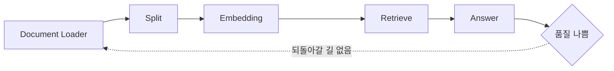
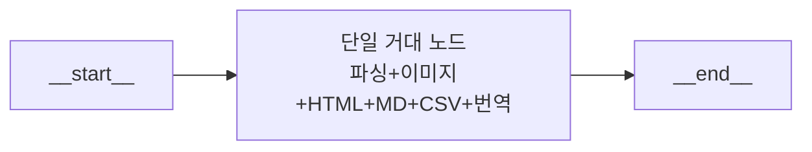
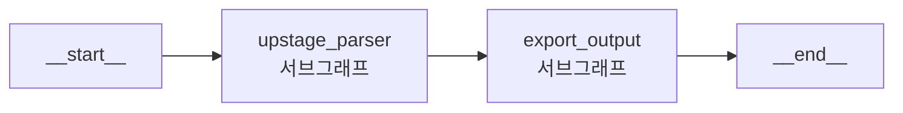
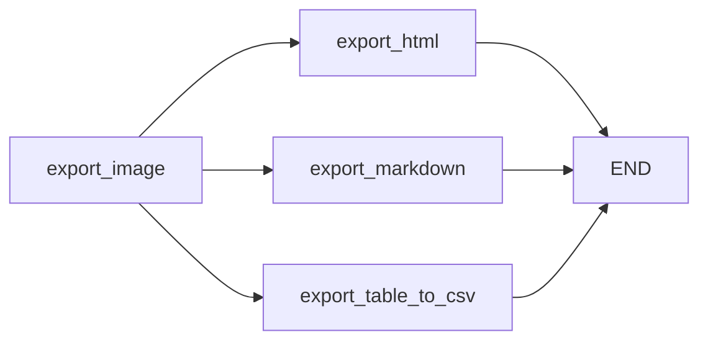
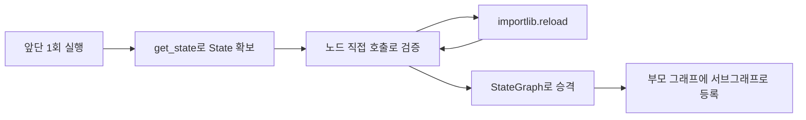

노드를 다 짤 줄 아는 사람에게 남는 질문은 하나다. **그걸 어떻게 배치해야 6개월 뒤에도 고칠 수 있는가.** 마크다운 출력 한 줄을 고치려고 PDF 파싱부터 20초와 $0.21을 다시 내야 하는 구조라면, 코드가 동작하더라도 개선이 멈춘다.

이 글은 그 배치 문제를 다룬다. RAG에 검증을 붙이다 보면 왜 코드가 반드시 복잡해지는지, 단방향 파이프라인의 구조적 한계가 무엇인지 짚고, **모듈 경계를 정하는 일곱 가지 기준**과 앞 단계를 다시 돌리지 않고 이어서 개발하는 기법으로 이어진다. 이어지는 두 편은 그 경계를 실제로 조립하는 [서브그래프와 레거시 개조](/blog/rag/langgraph-subgraph-retrofit/), 그리고 동시 실행과 확장을 다루는 [병렬 처리와 멀티에이전트](/blog/rag/langgraph-parallel-multiagent/)다.

## 용어 정리

| 용어 | 표기 | 뜻 |
|---|---|---|
| StateGraph | `StateGraph(SchemaClass)` | 상태 스키마를 지정해 만드는 그래프 빌더. `compile()`로 실행 가능해진다 |
| Node | `add_node("이름", 호출가능객체)` | 작업 단위. 입력은 State, 출력은 대개 State의 **부분 딕셔너리** |
| Edge | `add_edge("from", "to")` | 다음 실행 동작을 정의하는 고정 연결 |
| Conditional Edge | `add_conditional_edges(...)` | 판단 함수 반환값을 dict로 매핑해 분기. `if / elif / else`에 해당 |
| Subgraph | — | 독립적으로 컴파일된 그래프를 상위 그래프의 **노드 하나로** 등록한 것 |
| Compile | `workflow.compile()` | 빌더를 실행 가능한 그래프로 변환. 이 시점에 checkpointer가 결정된다 |
| State | `TypedDict` 등 | 노드 간 정보를 실어 나르는 객체. 값은 기본적으로 덮어쓰기 |
| Reducer | `add_messages`, `operator.add` | 덮어쓰기 대신 **누적**하도록 지정하는 병합 규칙 |
| Checkpointer | `MemorySaver`, `SqliteSaver` 등 | 노드 실행 Step마다 상태를 저장하는 단기 메모리 |
| thread_id | `configurable={"thread_id": ...}` | 실행 단위 식별자. 스레드별로 메모리가 격리된다 |
| recursion_limit | `RunnableConfig(recursion_limit=N)` | 실행할 노드 수 상한. 순환 그래프의 무한 루프 방어선 |
| Fan-out / Fan-in | 병렬 분기 / 결과 집계 | 한 노드에서 여러 노드로 퍼뜨리고 다시 모으는 구조 |
| Self-RAG | arXiv 2310.11511 | 선택적 검색 + 답변-근거 관련성 체크를 제안한 논문 |
| Corrective RAG | arXiv 2401.15884 | 검색 문서 품질을 평가해 쿼리를 교정하는 접근 |
| Modular RAG | arXiv 2407.21059 | RAG를 교체 가능한 모듈 조합으로 재구성하는 설계 관점 |

이 글은 State·Node·Edge·Checkpointer의 개념을 안다고 전제한다. 최소한 아래 다섯 줄이 읽히면 충분하다.

| 개념 | 한 줄 정의 | 대표 API |
|---|---|---|
| State | 노드 간 전달되는 상태 객체. 기본은 키 단위 덮어쓰기 | `class MyState(TypedDict): ...` |
| Node | State를 받아 State 일부를 돌려주는 함수/호출가능 객체 | `workflow.add_node("name", fn)` |
| Edge | 고정된 다음 단계 연결 | `workflow.add_edge("a", "b")` |
| Conditional Edge | 판단 함수 반환값을 dict로 매핑해 분기 | `workflow.add_conditional_edges("a", is_ok, {...})` |
| Checkpointer | Step마다 상태 스냅샷 저장 → 재개·되감기 | `workflow.compile(checkpointer=MemorySaver())` |

## 왜 모듈화인가 — 코드는 반드시 복잡해진다

RAG를 붙이고 나면 순서대로 다음 갈등을 만난다.

| # | 의심 | 그래서 추가하게 되는 것 |
|---|---|---|
| 1 | LLM 답변이 할루시네이션 아닐까 | 답변-근거 관련성 평가자 |
| 2 | 문서에 없는 "사전 지식"으로 답한 건 아닐까 | 근거 판정(grounded / notGrounded) |
| 3 | 문서 검색에 원하는 내용이 없으면 | 웹 검색·논문 검색으로 지식 보강 |
| 4 | 웹 검색 결과가 틀렸거나 아예 없으면 | 검색 결과 품질 평가자 |
| 5 | 잘못된 검색이 결국 할루시네이션으로 이어지면 | 평가자 2단 구성 |
| 6 | 제대로 나올 때까지 반복하면 | 반복문 — 그런데 토큰 사용량이 폭증 |

결말은 둘이다. **코드가 점점 길어지고 복잡해진다.** 그리고 **LLM의 일관되지 않은 답변이 나비효과처럼 번져 최종 품질 저하로 이어진다.**

### 근본 원인은 파이프라인이 단방향이라는 것

`로드 → 분할 → 임베딩 → 검색 → 답변`으로 흐르는 선형 구조의 한계는 셋이다.

| 한계 | 의미 |
|---|---|
| 모든 단계를 한 번에 다 잘해야 함 | 어느 한 단계가 어긋나면 뒤가 전부 무너진다 |
| 이전 단계로 되돌아가기 어려움 | 검색이 나빴다는 걸 답변 단계에서 알아도 되돌릴 길이 없다 |
| 이전 과정의 결과물을 수정하기 어려움 | 중간 산출물을 고쳐 다시 흘려보낼 수 없다 |

여기에 **사전에 고정된 것들**이 겹친다 — 정해진 데이터 소스, 고정 크기 청크, 정해진 검색 방법, 고정된 프롬프트 형식. 그 위에 신뢰하기 어려운 LLM이 얹힌다.



### 그래프가 바꾸는 것

| 바뀌는 것 | 내용 |
|---|---|
| 각 세부 과정 | **노드**로 정의 |
| 이전 노드 → 다음 노드 | **엣지**로 연결 |
| 분기 | **조건부 엣지**로 처리 |
| 순환 | Cycle 연산으로 **이전 단계 재실행** 가능 |
| 중간 개입 | Human-in-the-loop |
| 과거 시점 복원 | Checkpointer의 수정 & 리플레이 |

LangGraph는 **상태 저장 멀티 액터 애플리케이션 구축에 특화된 워크플로 프레임워크**로, 핵심 기능이 셋이다 — 루프와 조건문을 구현하는 **Cycle & Branching**, 각 단계 후 자동으로 상태를 저장하는 **Persistence**, 흐름을 세밀하게 직접 제어하는 **Low Level Control**.

> LangGraph는 LangChain을 만든 곳에서 나왔지만 **LangChain 없이도 사용 가능**하다. 워크플로 엔진으로서 독립적이라는 뜻이다. 그래프 구성은 `networkx`의 개념을 차용했다.

## 모듈화가 주는 것

| 이득 | 내용 |
|---|---|
| **독립성** | 독립된 모듈로 모듈 간 의존성을 낮추거나 제거한다 |
| **중첩 가능성** | 노드의 집합(Sub-Graph)이 상위 그래프의 **노드 하나**가 될 수 있다 |
| **조립성** | 블록처럼 세부 모듈을 연결해 구성한다. 추가·변경·교체가 쉽고, 단계의 전·후에 모듈을 끼워 넣을 수 있다 |

### 협업 구조와 직결된다

| 역할 | 책임 |
|---|---|
| Base Template 정의 | 노드가 지켜야 할 입출력 계약을 먼저 못박는다 |
| **도메인 전문가** | 노드의 **개발**에 집중한다 |
| **흐름 엔지니어** | 작성된 노드로 **흐름**을 구성한다 |

이 분리가 성립하려면 **State 스키마가 계약(contract) 역할**을 해야 한다. 스키마가 흔들리면 두 역할이 다시 한 사람에게 합쳐진다. 조직을 나누는 능력이 스키마 설계에 달려 있는 셈이다.

### 실험이 코드 한 줄로 끝난다

답변 생성 단계에서 모델을 바꿔가며 실험할 때, 노드를 같은 베이스로 구현해 두면 등록만 바꾸면 된다.

```
O3_GenerateNode(BaseNode)
DeepSeek_GenerateNode(BaseNode)
Claude_GenerateNode(BaseNode)
```

세 노드가 **같은 State 키를 읽고 같은 키를 쓰면** 그래프 코드는 한 줄만 바뀐다.

## 경계를 긋는 일곱 가지 기준

| 기준 | 질문 | 쪼개라 | 합쳐라 |
|---|---|---|---|
| **비용** | 이 단계만 다시 돌릴 일이 잦은가 | 파싱(20초·$0.21)과 후처리는 분리 | 비용 없는 문자열 가공은 한 노드 |
| **외부 의존** | 외부 API·과금이 걸리는가 | API 호출 단위로 노드 격리 | 순수 계산은 묶어도 됨 |
| **교체 가능성** | 이 구현을 갈아끼울 가능성이 있는가 | 모델·파서·검색기는 각각 노드 | 고정 로직은 굳이 안 나눔 |
| **팀 경계** | 다른 사람이 맡을 부분인가 | 담당자 경계 = 모듈 경계 | 한 사람이 다 쓰는 코드는 유지 |
| **State 키** | 읽고 쓰는 State 키가 겹치지 않는가 | 키 집합이 분리되면 좋은 절단면 | 같은 키를 계속 주고받으면 한 덩어리 |
| **재사용** | 다른 파이프라인에서도 쓸 것인가 | 재사용되면 팩토리 함수로 승격 | 1회성이면 인라인 |
| **관찰 필요** | 중간 결과를 따로 봐야 하는가 | 관찰 지점마다 노드 분리 | 볼 일 없으면 통합 |

핵심 기준은 **재실행 단위**다. 다시 돌릴 일이 잦거나, 외부 API 비용이 걸리거나, 구현을 갈아끼울 가능성이 있거나, 담당자가 다르면 자른다. 반대로 State 키를 계속 주고받는 구간을 억지로 나누면 매핑 코드만 늘어난다. **매핑 코드가 길어지면 경계를 잘못 그은 신호로 본다.**

### Before — 한 덩어리 그래프



| 증상 | 결과 |
|---|---|
| 마크다운 출력 하나 고치려면 | PDF 파싱부터 전부 재실행 (20초 + $0.21) |
| 실패 지점 파악 | 어느 단계에서 깨졌는지 로그로만 추정 |
| 병렬화 | 불가능. HTML·MD·CSV가 순차로 묶여 있음 |
| 협업 | 한 파일을 두 사람이 동시에 못 건드림 |
| 중간 확장 | 번역을 넣으려면 함수 본문을 갈라야 함 |

### After — 모듈 단위로 쪼갠 그래프



`export_output` 서브그래프 내부는 Fan-out 구조다.



| 개선 | 근거 |
|---|---|
| 마크다운만 고쳐도 파싱 재실행 불필요 | 이전 서브그래프의 State를 재사용 |
| HTML·MD·CSV 동시 실행 | `export_image`에서 3방향 Fan-out |
| 실패 지점 특정 | 노드별 로그가 이름과 함께 찍힘 |
| 담당자 분리 | 노드 클래스별로 파일이 갈림 |
| 중간 확장 | 부모 그래프의 엣지 한 줄만 조정 |

## 모듈 단위로 "이어서" 개발하기

모듈화의 진짜 이득은 구조가 예뻐지는 게 아니라 **개발 루프가 짧아지는 것**이다.

### 앞 단계를 한 번만 돌린다

```python
import uuid
from langchain_core.runnables import RunnableConfig

# batch_size: 한번에 처리할 페이지 수
# test_page : 테스트할 페이지 번호
parser_graph = create_upstage_parser_graph(
    batch_size=30, test_page=None, verbose=True, visualize=True
)

config = RunnableConfig(
    recursion_limit=300,
    configurable={"thread_id": str(uuid.uuid4())},
)

parser_graph.invoke({"filepath": "data/report.pdf"}, config=config)
```

실행 로그는 이렇게 찍힌다.

```
[SplitPDFNode] 파일의 전체 페이지 수: 21 Pages.
[SplitPDFNode] 분할 PDF 생성: data/report_0000_0020.pdf
[DocumentParseNode] Start Parsing: data/report_0000_0020.pdf
[DocumentParseNode] Finished Parsing in 20.78 seconds
[PostDocumentParseNode] Total Post-processed Elements: 465
[PostDocumentParseNode] Total Cost: $0.21
```

> **이 여섯 줄이 모듈화의 경제적 근거다.** 뒷단을 한 번 고칠 때마다 20초와 $0.21을 다시 낼 것인가.
>
> 노드 이름이 로그 접두어로 그대로 찍히는 것도 주목할 점이다. **모듈 경계가 곧 관측 경계가 된다.**

### 체크포인터에서 State를 꺼내 다음 모듈의 입력으로 쓴다

```python
# 이전 단계의 실행 결과를 그대로 가져온다
previous_state = parser_graph.get_state(config).values
inputs = previous_state.copy()
```

`get_state(config).values`는 해당 `thread_id`의 최신 스냅샷을 그대로 돌려준다. 즉 **체크포인터가 개발 중에는 캐시 역할**을 한다. 이 한 줄 덕분에 앞단을 다시 안 돌린다.

### 노드를 그래프 없이 함수처럼 호출해 검증한다

```python
import importlib

# 모듈을 리로드해 최신 코드를 반영한다
importlib.reload(export)

export_image = export.ExportImage(verbose=True)
export_html = export.ExportHTML(verbose=True, ignore_new_line_in_text=True)
export_markdown = export.ExportMarkdown(
    verbose=True, ignore_new_line_in_text=True, show_image=False
)
```

```python
# 단계별 상태를 업데이트 후 반영한다
inputs2 = export_image(inputs)
inputs.update(inputs2)

export_html(inputs)
# [ExportHTML] HTML 파일이 성공적으로 생성되었습니다: data/report.html
# {'export': ['data/report.html']}
```

여기서 드러나는 규약이 모듈화의 전제다.

| 규약 | 내용 |
|---|---|
| 노드는 **호출 가능 객체** | 클래스 인스턴스가 `__call__(state)`를 구현하면 그래프 등록도, 직접 호출도 된다 |
| 노드 반환값은 **부분 딕셔너리** | `{'export': [...]}`처럼 자기가 바꾼 키만 돌려준다 |
| 병합은 `state.update()` | 그래프가 하는 일을 손으로 재현한 것이 `inputs.update(inputs2)`다 |
| `importlib.reload` | 세션을 죽이지 않고 모듈 코드만 갈아끼운다 |

> 노드가 순수 함수처럼 **State in / partial State out** 계약을 지키면 **그래프 없이도 단위 테스트가 가능하다.**
>
> 반대로 노드가 전역 상태나 그래프 런타임에 의존하면 이 기법이 전부 무너진다. 계약을 지키는 것이 모듈화의 전제이지 결과가 아니다.

### 검증이 끝나면 그래프로 승격시킨다

여기까지가 하나의 개발 루프다.



가운데 `C → D → C` 순환이 이 루프의 핵심이다. **앞단을 다시 돌리지 않고 신규 로직만 반복해서 고친다.** 검증이 끝난 뒤에야 그래프로 올라간다.

경계를 그었다면 다음 문제는 그 모듈을 어떻게 상위 그래프에 꽂고, 이미 돌아가는 그래프를 안 깨고 확장하느냐다. [다음 편](/blog/rag/langgraph-subgraph-retrofit/)에서 서브그래프와 레거시 개조를 다룬다.

모듈 경계보다 한 층 아래 — State 스키마와 채널별 리듀서를 어떻게 정하는지, 그 결정이 병렬 처리에서 왜 정합성을 좌우하는지 — 는 [State와 Reducer가 정하는 것](/blog/ai-agent/langgraph-state-reducer/)에서 다룬다.
