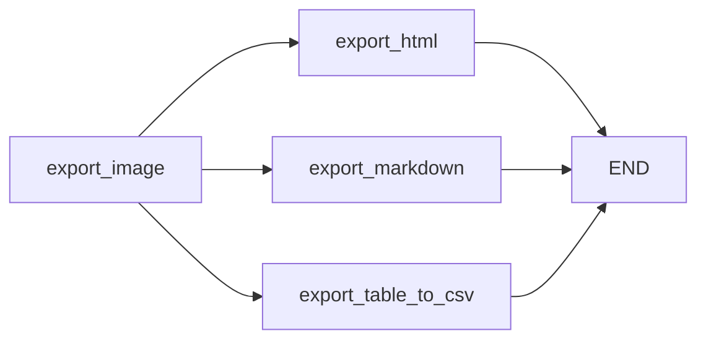
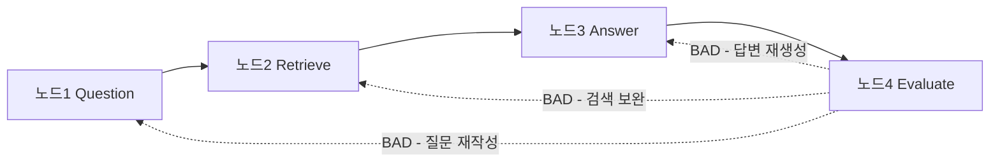
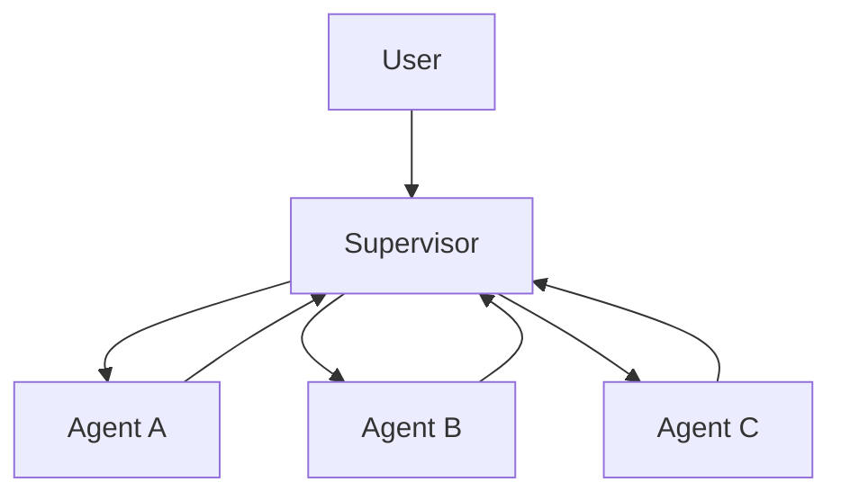
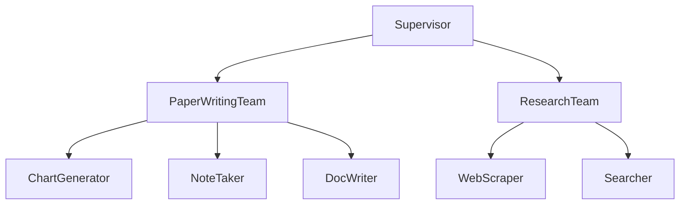

평가 결과가 나쁠 때 던지는 진짜 질문은 "무엇을 고칠까"가 아니라 **"어느 지점으로 되돌아갈까"**다. 질문이 모호했는지, 검색이 부실했는지, 답변 생성이 어긋났는지에 따라 되돌아갈 노드가 다르다. 그리고 **되돌아갈 지점의 정밀도는 모듈을 얼마나 잘 쪼갰는지로 결정된다.**

이 글은 그 관점에서 세 가지를 다룬다. 여러 노드를 동시에 돌릴 때 상태가 충돌하지 않게 하는 조건, 노드를 지나며 State가 실제로 어떻게 변하고 어디로 되돌아갈 수 있는지, 그리고 이 모든 구조가 **멀티에이전트로 확장될 때 무엇이 달라지고 무엇이 그대로인지**다. 앞 편들은 [모듈 경계](/blog/rag/langgraph-module-boundaries/)와 [서브그래프·레거시 개조](/blog/rag/langgraph-subgraph-retrofit/)에 있다.

## 용어 정리

| 용어 | 뜻 |
|---|---|
| Fan-out | 한 노드에서 여러 노드로 분기해 동시에 실행 |
| Fan-in | 분기된 결과를 다시 한 지점으로 모음 |
| Reducer | 덮어쓰기 대신 **누적**하도록 지정하는 병합 규칙 (`operator.add` 등) |
| Checkpointer | Step마다 상태 스냅샷을 저장하는 **단기 메모리** |
| MemoryStore | 여러 thread를 가로질러 유지되는 **장기 메모리** |
| thread_id | 실행 단위 식별자. 스레드별로 메모리가 격리된다 |
| Time Travel | 체크포인터 스냅샷으로 특정 시점 상태를 복원하는 것 |
| HITL | Human-in-the-loop. 실행 중간에 사람이 개입해 검증·승인하는 루프 |
| Supervisor 패턴 | 감독자 에이전트가 작업을 하위 에이전트에 할당·회수하는 멀티에이전트 패턴 |
| Query Transform | 검색이 실패했을 때 질문 자체를 고쳐 다시 검색하는 것 |

## 병렬 처리 — Fan-out과 Fan-in

효과는 둘이다. **병렬 처리 구조로 지연 시간을 최소화**하고, **대규모 작업 분산과 결과 집계를 효율화**한다.



`export_image`가 이미지 파일을 먼저 떨어뜨려야 나머지 셋이 그 경로를 참조할 수 있다. 그래서 **의존이 있는 단계는 직렬, 없는 단계는 병렬**로 갈랐다. 실행 로그에서 세 포맷의 출력이 뒤섞여 찍히는 것이 병렬 실행의 증거다.

```
[ExportMarkdown] 마크다운 파일이 성공적으로 생성되었습니다: .../report.md
[ExportTableCSV] CSV 파일이 성공적으로 생성되었습니다: .../REPORT_TABLE_Page_0_Index_10.csv
[ExportHTML] HTML 파일이 성공적으로 생성되었습니다: data/report.html
[ExportTableCSV] CSV 파일이 성공적으로 생성되었습니다: .../REPORT_TABLE_Page_0_Index_14.csv
```

### 병렬화의 전제 조건

| 조건 | 이유 |
|---|---|
| 병렬 노드끼리 **같은 State 키를 쓰지 않는다** | 동시에 같은 키를 덮어쓰면 결과가 비결정적 |
| 같은 키를 써야 한다면 **Reducer를 지정한다** | `operator.add` 등으로 누적 병합 |
| 외부 자원 경합이 없다 | 같은 파일에 동시 쓰기 금지 |
| 순서 의존이 없다 | 순서가 필요하면 직렬이 맞다 |

세 export 노드가 각각 `{'export': [경로]}` 형태를 반환하므로, `export` 키에는 **리스트 누적 리듀서가 붙어 있어야 세 결과가 모두 살아남는다.** 리듀서가 덮어쓰기면 두 개를 조용히 잃는다.

## 상태 전달의 실제

기본 규칙은 셋이다. 각 노드가 업데이트하는 값은 **기존 키를 덮어쓰고**, 노드는 필요한 상태 값을 **조회**해 동작에 활용할 수 있으며, 앞선 노드가 넣은 값은 **뒤 노드까지 그대로 전달**된다.

| 시점 | time | name | llm |
|---|---|---|---|
| 노드1 통과 후 | 1 | — | GPT |
| 노드2 통과 후 | 2 | 테디 | GPT |
| 노드3 통과 후 | 3 | 테디 | GPT |
| 노드4 통과 후 | 4 | 셜리 | GPT |

노드4 시점에도 노드1이 넣은 `llm = GPT`가 살아 있다. **모듈이 앞 단계 결과를 조회할 수 있다는 것** — 이것이 모듈 간 결합을 코드가 아니라 스키마로 하게 해 준다.

### 평가가 나쁠 때 어디로 되돌아가나

노드 구성이 `Question → Retrieve → Answer → Evaluate` 4단이라고 하자.

| 단계 | context | question | answer | score |
|---|---|---|---|---|
| 1. Question | — | 질문1 | — | — |
| 2. Retrieve | 문서1 | 질문1 | — | — |
| 3. Answer | 문서1 | 질문1 | 답변1 | — |
| 4. Evaluate | 문서1 | 질문1 | 답변1 | **BAD** |

`score`가 BAD일 때 선택할 수 있는 행동이 셋이다. 이것이 순환 그래프의 존재 이유이자 모듈을 나눠 둔 보상이다.



**선택지 1 — 질문을 재작성한다 (Query Transform).** 질문이 바뀌면 검색도 답변도 새로 돈다.

| Step | context | question | answer | score |
|---|---|---|---|---|
| 5 | 문서1 | **질문2** | 답변1 | BAD |
| 6 | **문서2** | 질문2 | 답변1 | BAD |
| 7 | 문서2 | 질문2 | **답변2** | BAD |
| 8 | 문서2 | 질문2 | 답변2 | **GOOD** |

**선택지 2 — 검색을 재요청한다.** 청크 크기 변경, 다른 검색기, 웹 검색 추가 등을 조정한다.

| Step | context | question | answer | score |
|---|---|---|---|---|
| 5 | **문서2** | 질문1 | 답변1 | BAD |
| 6 | 문서2 | 질문1 | **답변2** | BAD |
| 7 | 문서2 | 질문1 | 답변2 | **GOOD** |

**선택지 3 — 답변만 재생성한다.** 프롬프트를 조정하거나 다른 LLM으로 갈아끼운다.

| Step | context | question | answer | score |
|---|---|---|---|---|
| 5 | 문서1 | 질문1 | **답변2** | BAD |
| 6 | 문서1 | 질문1 | 답변2 | **GOOD** |

> 세 선택지는 곧 **"어느 모듈로 되돌아갈 것인가"**의 문제다. 모듈이 잘게 나뉘어 있을수록 되돌아갈 지점이 정밀해지고, 한 덩어리면 처음부터 다시 도는 수밖에 없다.
>
> **모듈화가 비용 절감으로 이어지는 지점이 여기다. 재실행 단위 = 모듈 단위.**

되돌아갈 지점이 정해지면 그 자리에 무엇을 끼울지도 정해진다.

| 실패 유형 | 되돌아갈 노드 | 끼워 넣을 모듈 |
|---|---|---|
| 질문이 모호함 | Question | Query Rewrite 모듈 |
| 검색 결과가 부실 | Retrieve | Web Search 보강 모듈 |
| 답변이 근거를 벗어남 | Answer | 다른 LLM 노드 / 프롬프트 교체 |
| 원문 자체가 문맥 부족 | 파싱 직후 | Contextualize 모듈 |
| 원문이 외국어 | 파싱 직후 | Translation 모듈 |

## 전체 학습 경로

이 주제를 처음부터 밟는다면 17단계가 된다. 각 단계에서 무엇을 흔히 틀리는지가 더 유용하다.

| # | 단계 | 핵심 개념 | 흔한 실패 |
|---|---|---|---|
| 1 | 문제 인식 | 단방향 구조의 3대 한계 | "RAG만 잘 붙이면 된다"고 넘어감 |
| 2 | LangGraph 정체성 | Cycle & Branching / Persistence / Low Level Control | LangChain의 부속으로 오해 |
| 3 | 그래프 기반 파이프라인 | 노드·엣지·상태 | 그래프를 그림으로만 이해하고 실행 모델을 안 봄 |
| 4 | 모듈 독립성 | Sub-Graph → Super-Graph의 노드 | State 키를 공유해 놓고 독립이라 착각 |
| 5 | 분산 개발 | Base Template 정의 | 템플릿 없이 나눠서 통합 시점에 충돌 |
| 6 | Plug-in 교체 | 동일 계약 노드 | 노드마다 입출력 키가 달라 교체 불가 |
| 7 | 조립형 모듈 | 단계 전·후에 모듈 추가 | 스키마를 바꿔가며 붙여 전 구간 회귀 |
| 8 | 조건부 분기 | `add_conditional_edges` | dict 매핑 값에 없는 문자열 반환 |
| 9 | 라우팅 설계 | Tool Name/Description, Schema | 설명을 대충 써서 도구 선택이 흔들림 |
| 10 | 병렬 처리 | Fan-out / Fan-in | 같은 State 키 동시 쓰기로 결과 유실 |
| 11 | 단기 메모리 | `checkpointer`, `thread_id` | thread_id 재사용·누락으로 대화가 섞임 |
| 12 | Time Travel | 체크포인터 스냅샷 | 체크포인터 없이 컴파일해 되감기 불가 |
| 13 | 장기 메모리 | MemoryStore | 무엇을 장기 기억할지 미정의 |
| 14 | Human-in-the-loop | 중단·검증·피드백 | 개입 지점을 안 정해 그냥 다 자동 실행 |
| 15 | 추적·디버깅 | 트레이싱 도구 | 추적을 끄고 개발해 원인 규명 불가 |
| 16 | 배포 | 운영 반영 | 로컬 `MemorySaver` 그대로 운영 투입 |
| 17 | 멀티에이전트 | Supervisor 패턴 | 감독자 없이 에이전트만 늘려 통제 불능 |

### 라우팅 — 두 갈래 설계

| 방식 | 선택 주체 | 설계 포인트 | 성격 |
|---|---|---|---|
| **Agent Routing** | LLM이 도구를 고름 | 각 도구의 **Name과 Description을 상세히** 작성. 도구 추가만으로 라우팅 옵션이 늘어남 | 유연·확장적 |
| **Structured Output** | 스키마 기반 선택 | 시스템 프롬프트 + **Schema에도 각 옵션의 선택 가이드**를 상세히 | 규칙 기반에 가까움 |

> 확장성이 필요하면 Agent Routing, 통제가 필요하면 Structured Output. 다만 둘 다 **설명문의 품질이 곧 라우팅 정확도**라는 점은 같다.

### 메모리 — 단기와 장기

| 항목 | 단기 메모리 (Checkpointer) |
|---|---|
| 저장 대상 | 노드의 매 Step 상태 값 |
| 설정 | `compile(checkpointer=MemorySaver())` |
| 격리 단위 | `config`의 `thread_id` |
| 장점 | 멀티턴 대화 구현 용이, 노드별 스냅샷 관리 |
| 프로덕션 옵션 | `SqliteSaver`, `PostgresSaver` 등 |

장기 메모리는 여러 thread를 가로질러 사용자별 특성을 기억한다. 이름·직업·취향처럼 **변하지 않는 고유 정보**가 대상이다.


과정은 넷이다. 추출할 Personal Entity를 정의하고, 대화에서 추출하고, 장기 기억에 업데이트하고, **신규 대화 스레드를 열 때 System 프롬프트에 주입**한다. 첫 단계가 빠지면 무엇을 기억할지 정하지 않은 채 전부 저장하게 된다.

## 멀티에이전트 — 새로운 개념이 아니다

여러 AI 에이전트가 각자의 전문 기능으로 협력해 복잡한 업무를 분산 처리하는 시스템이다. 이점은 셋 — 역할별 **작업 분배와 병렬 처리**, 에이전트 추가로 얻는 **확장성**, 상태를 통한 **실시간 정보 교환**이다.

그래프로 구축하는 것이 유용한 이유는 세 줄로 정리된다.

- Agent 팀을 **작은 단위의 그래프**로 구축한다.
- **그래프가 하나의 노드로 플러그인** 가능하다.
- 다양한 그래프의 **협업 구축이 쉽다.**

> 즉 멀티에이전트는 새로운 개념이 아니라 **서브그래프의 확대 적용**이다. 노드가 함수 → 그래프 → 에이전트 팀으로 커질 뿐 **계약은 동일하다.**
>
> 그래서 모듈 계약을 잘 잡아 둔 조직이 멀티에이전트로 넘어갈 때 추가 비용이 거의 없다.

### Supervisor 패턴



| 단계 | 동작 |
|---|---|
| 1 | Supervisor가 사용자와 상호작용하며 지시사항을 받는다 |
| 2 | Supervisor가 **적합한 Agent에게 작업을 할당**한다 |
| 3 | Agent는 작업 완료 후 **Supervisor에게 라우트**한다 |

계층을 하나 더 올리면 팀 단위가 된다.



**팀이 서브그래프, 팀원이 노드다.** 상위 Supervisor 입장에서 `PaperWritingTeam`은 그냥 노드 하나다.

### 조합으로 만들어지는 패턴들

| 패턴 | 구성 |
|---|---|
| **Plan and Execute** | 질문 → 계획 수립 → 순차 실행 → 최종 보고서 |
| **STORM Research** | 가상 인터뷰 Persona 생성(동적 노드) → HITL로 Persona 조정 → 인터뷰 **병렬 수행**(Fan-out/Fan-in) → 결과 종합 |

> STORM의 네 단계가 전부 앞에서 나온 부품의 조합이다. **화려한 리서치 에이전트도 뜯어 보면 모듈 + 병렬 + HITL이다.**

## 흔한 실패 열여섯 가지

| # | 실패 | 증상 | 처방 |
|---|---|---|---|
| 1 | State 스키마를 모듈마다 다르게 정의 | 통합 시점에 매핑 코드가 폭발 | 파이프라인 단위 공용 스키마 1개 |
| 2 | 노드가 State 전체를 반환 | 다른 노드가 쓴 값이 덮여 소실 | 자기가 바꾼 키만 부분 딕셔너리로 |
| 3 | 병렬 노드가 같은 키를 씀 | 실행마다 결과가 달라짐 | Reducer 지정 또는 키 분리 |
| 4 | 체크포인터 없이 컴파일 | `get_state()` 불가, 되감기 불가 | 개발 중에도 `MemorySaver()` 지정 |
| 5 | thread_id 고정 | 이전 실행 상태가 섞여 들어옴 | 실행마다 `str(uuid.uuid4())` |
| 6 | `recursion_limit` 기본값 방치 | 순환 그래프가 조기 종료 | 파싱 파이프라인 기준 `300` 수준 |
| 7 | 조건부 엣지 반환값이 dict에 없음 | 라우팅 실패 | 반환 문자열 집합을 상수로 고정 |
| 8 | LLM 노드에서 요소별 개별 호출 | 465개 요소 × 1회 = 비용·지연 폭증 | `chain.batch()` + BATCH_SIZE |
| 9 | 배치 실패 시 전체 중단 | 한 번의 API 오류로 20분 작업 소실 | `trial = 3` 재시도 루프 |
| 10 | 처리 대상을 안 좁힘 | 표·이미지까지 번역돼 구조 파괴 | `category` 화이트리스트 |
| 11 | 앞단을 매번 재실행하며 뒷단 개발 | 반복마다 20초 + $0.21 | `get_state().values` 재사용 |
| 12 | 노드 로그에 이름이 없음 | 어디서 깨졌는지 못 찾음 | `[NodeName] ...` 접두어 |
| 13 | `xray` 없이 시각화 | 서브그래프가 검은 상자 | `visualize_graph(g, xray=True)` |
| 14 | 비활성 모듈을 삭제 | 롤백에 히스토리 탐색 필요 | 노드+엣지 두 줄을 주석으로 보존 |
| 15 | 로컬 `MemorySaver`로 운영 배포 | 프로세스 종료 시 상태 소실 | `SqliteSaver` / `PostgresSaver` |
| 16 | 도구 Description을 대충 작성 | 라우팅이 오락가락 | Name·Description·Schema 가이드 상세화 |

## 전 과정 골격

지금까지의 내용을 한 파일로 이어 붙인 최소 골격이다.

```python
import uuid
from typing import TypedDict

from langgraph.graph import StateGraph, END
from langgraph.checkpoint.memory import MemorySaver
from langchain_core.runnables import RunnableConfig


# 1) 공용 State — 파이프라인 전 구간이 이 하나를 공유한다
class ParseState(TypedDict, total=False):
    filepath: str
    elements_from_parser: list
    export: list


# 2) 서브그래프 A — 파싱 (팩토리 함수로 감싼다)
def create_parser_graph(batch_size=30, verbose=True):
    wf = StateGraph(ParseState)
    wf.add_node("split_pdf", SplitPDFNode(batch_size=batch_size, verbose=verbose))
    wf.add_node("document_parse", DocumentParseNode(verbose=verbose))
    wf.add_node("post_process", PostDocumentParseNode(verbose=verbose))

    wf.add_edge("split_pdf", "document_parse")
    wf.add_edge("document_parse", "post_process")
    wf.add_edge("post_process", END)
    wf.set_entry_point("split_pdf")

    # 단독 실행 시 get_state()를 쓰려면 자체 체크포인터가 필요하다
    return wf.compile(checkpointer=MemorySaver())


# 3) 서브그래프 B — 내보내기 (Fan-out / Fan-in)
#    export_image -> {export_html, export_markdown, export_table_to_csv} -> END
export_graph = create_export_graph(show_image_in_markdown=True)


# 4) 삽입 모듈이 지켜야 할 다섯 규칙
#    (a) category 화이트리스트로 처리 대상 축소
#    (b) BATCH_SIZE 단위 chain.batch() 호출
#    (c) 배치 단위 재시도 (trial = 3)
#    (d) 원본 요소를 제자리 갱신
#    (e) 부분 딕셔너리만 반환


# 5) 부모 그래프 — 서브그래프 2개 + 삽입 노드 1개
parser_graph = create_parser_graph(batch_size=30, verbose=True)

parent_workflow = StateGraph(ParseState)
parent_workflow.add_node("upstage_parser", parser_graph)             # 서브그래프
parent_workflow.add_node("add_translation", add_translation_module)  # 삽입 노드
# parent_workflow.add_node("contextualize_text", contextualize_text)  # 대안 (비활성)
parent_workflow.add_node("export_output", export_graph)              # 서브그래프

parent_workflow.add_edge("upstage_parser", "add_translation")
# parent_workflow.add_edge("upstage_parser", "export_output")  # 개조 전 배선 (보존)
parent_workflow.add_edge("add_translation", "export_output")

parent_workflow.set_entry_point("upstage_parser")
parent_graph = parent_workflow.compile(checkpointer=MemorySaver())


# 6) 실행
config = RunnableConfig(
    recursion_limit=300,
    configurable={"thread_id": str(uuid.uuid4())},
)
parent_graph.invoke({"filepath": "data/report.pdf"}, config=config)

# 실행 후 상태 조회
snapshot = parent_graph.get_state(config).values
snapshot["elements_from_parser"][:10]
```

이 골격에서 지켜지는 것은 셋뿐이다. **공용 State 하나**, **흐름이 있는 단위만 서브그래프**, 그리고 **확장도 롤백도 두 줄**. 이 셋이 유지되는 한 파이프라인은 6개월 뒤에도 고칠 수 있다.

모듈 경계·개조·병렬 처리에서 반복해 나오는 질문은 [RAG 운영 Q&A](/blog/rag/rag-qna-operations/)에 문답으로 모았다.

토폴로지를 고르는 기준과 각 구조의 실제 구현 — 언제 쪼개고, Supervisor의 대가가 무엇이고, 계층에서 상태를 어떻게 격리하는지 — 는 [AI 에이전트 카테고리의 멀티에이전트 패턴 시리즈](/blog/ai-agent/when-to-split-agents/)에서 코드 수준으로 이어 다룬다.
