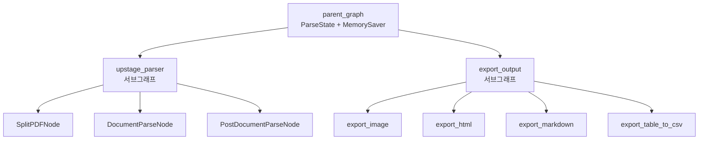
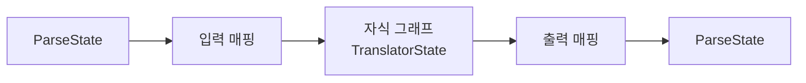
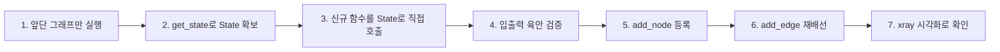
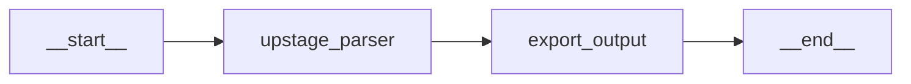
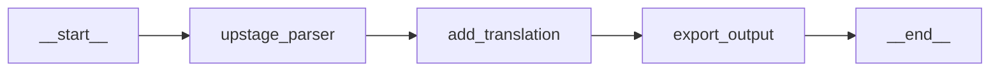
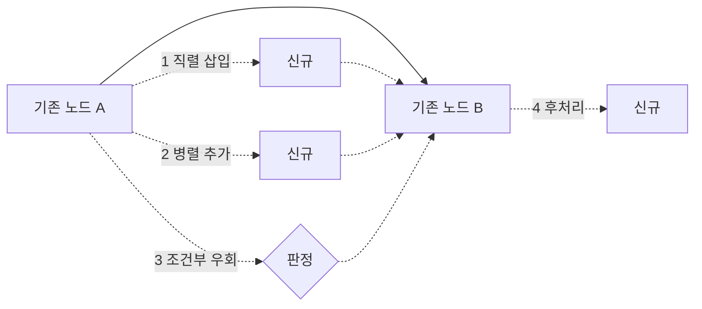

이미 돌아가는 파이프라인에 신규 단계를 추가할 때 가장 흔한 실수는 **그래프부터 고치는 것**이다. 그러면 신규 로직을 한 줄 바꿀 때마다 전 구간이 재실행되고, 앞단이 유료 API라면 개발 루프마다 돈이 나간다.

이 글은 그 순서를 뒤집는 방법을 다룬다. 컴파일된 그래프를 노드로 꽂는 서브그래프 합성, 부모와 자식의 스키마가 다를 때 끼우는 변환 래퍼, 그리고 **그래프를 마지막에 고치는 7단계 개조 절차**로 이어진다. [앞 편](/blog/rag/langgraph-module-boundaries/)에서 그은 모듈 경계를 실제로 조립하는 단계에 해당한다.

## 용어 정리

| 용어 | 뜻 |
|---|---|
| Subgraph | 독립적으로 컴파일된 그래프를 상위 그래프의 **노드 하나로** 등록한 것 |
| Parent Graph | 서브그래프들을 노드로 조립한 최상위 그래프 |
| 팩토리 함수 | 그래프를 만들어 반환하는 함수. 설정을 인자로 주입받는다 |
| Checkpointer | Step마다 상태 스냅샷을 저장하는 단기 메모리. **컴파일 시점에 결정된다** |
| xray | 시각화 시 **서브그래프 내부까지** 펼쳐 그리는 옵션 |
| Fan-out / Fan-in | 한 노드에서 여러 노드로 분기 / 결과를 다시 모음 |
| 부분 딕셔너리 | 노드가 자기가 바꾼 키만 담아 반환하는 것. 다른 키는 건드리지 않는다 |
| 변환 래퍼(bridge) | 부모 State를 자식 그래프 입력으로 번역해 주는 중간 노드 |

## 서브그래프 — 그래프를 노드로 꽂는다

### 팩토리 함수로 감싸는 것이 첫 단계

인라인으로 짠 그래프 구성 코드를 **함수로 감싸는 것**이 서브그래프화의 실질적 시작점이다.

```python
def create_export_graph(
    ignore_new_line_in_text=True,
    show_image_in_markdown=False,
    verbose=True,
    visualize=False,
):
    """문서 내보내기 그래프를 생성한다.

    Returns:
        CompiledGraph: 컴파일된 내보내기 그래프
    """
    export_workflow = StateGraph(ParseState)

    export_image = export.ExportImage(verbose=verbose)
    export_html = export.ExportHTML(
        ignore_new_line_in_text=ignore_new_line_in_text, verbose=verbose
    )
    export_markdown = export.ExportMarkdown(
        ignore_new_line_in_text=ignore_new_line_in_text,
        show_image=show_image_in_markdown,
        verbose=verbose,
    )
    export_table_csv = export.ExportTableCSV(verbose=verbose)

    export_workflow.add_node("export_image", export_image)
    export_workflow.add_node("export_html", export_html)
    export_workflow.add_node("export_markdown", export_markdown)
    export_workflow.add_node("export_table_to_csv", export_table_csv)

    export_workflow.add_edge("export_image", "export_html")
    export_workflow.add_edge("export_image", "export_markdown")
    export_workflow.add_edge("export_image", "export_table_to_csv")

    export_workflow.add_edge("export_html", END)
    export_workflow.add_edge("export_markdown", END)
    export_workflow.add_edge("export_table_to_csv", END)

    export_workflow.set_entry_point("export_image")

    export_graph = export_workflow.compile()
    if visualize:
        visualize_graph(export_graph)
    return export_graph
```

| 항목 | 인라인 구성 | 팩토리 함수 |
|---|---|---|
| 설정 변경 | 코드를 직접 수정 | 인자로 주입 (`show_image_in_markdown=True`) |
| 재사용 | 복사·붙여넣기 | import 한 줄 |
| 테스트 | 전역 상태 오염 | 호출마다 독립 인스턴스 |
| 시각화 | 항상 실행 | `visualize=False`로 끔 |
| 부모 그래프 등록 | 불가능에 가까움 | 반환값을 그대로 노드로 |

### `add_node`에 그래프를 넣는다

```python
from langgraph.checkpoint.memory import MemorySaver

parent_workflow = StateGraph(ParseState)

# 서브그래프를 "노드"로 등록한다
parent_workflow.add_node("upstage_parser", upstage_parser_graph)
parent_workflow.add_node("export_output", export_graph)

parent_workflow.add_edge("upstage_parser", "export_output")
parent_workflow.set_entry_point("upstage_parser")

parent_graph = parent_workflow.compile(checkpointer=MemorySaver())

# xray 옵션으로 서브그래프 내부까지 펼쳐 본다
visualize_graph(parent_graph, xray=True)
```

> 핵심은 `add_node("이름", 컴파일된_그래프)` 한 줄이다. **컴파일된 그래프는 그 자체로 호출 가능 객체**이며, 따라서 노드가 될 수 있다.
>
> 노드에 함수를 넣든 그래프를 넣든 부모 입장에서 계약은 동일하다. **State를 받아 State 일부를 돌려준다.**



`xray=True`가 이 그림을 그려 준다. 서브그래프를 검은 상자로 두지 않고 내부까지 펼쳐 보여주므로 **리뷰와 디버깅 시에는 켜는 편이 낫다.**

### 스키마가 같을 때 — 매핑이 아예 없다

| 조건 | 결과 |
|---|---|
| 부모 스키마 == 자식 스키마 | 그대로 `add_node`. 변환 불필요 |
| 자식이 부모의 부분집합 키만 사용 | 그대로 동작. 자식은 자기가 아는 키만 읽고 씀 |
| 자식이 부모에 없는 키를 반환 | 부모 스키마에 그 키가 없으면 버려지거나 오류. **스키마를 먼저 넓혀야 한다** |

파이프라인 내부에서 흐르는 데이터가 동질적이면 **공용 스키마 하나가 가장 싸다.** 스키마를 하나로 통일하는 선택이 게으름이 아니라 설계인 이유가 여기 있다.

### 스키마가 다를 때 — 변환 래퍼를 끼운다

자식 그래프를 다른 프로젝트에서 가져왔거나, 자식이 범용 컴포넌트라 부모 도메인을 몰라야 하는 경우다.

```python
# 자식 그래프는 자기만의 스키마를 갖는다
class TranslatorState(TypedDict):
    source_text: str
    target_lang: str
    translated_text: str


translator_graph = build_translator_graph()


# 부모(ParseState) <-> 자식(TranslatorState) 사이를 잇는 래퍼 노드
def translate_bridge(state: ParseState):
    results = []
    for element in state["elements_from_parser"]:
        # 1) 부모 State -> 자식 입력으로 변환 (입력 매핑)
        child_input = {
            "source_text": element["content"]["markdown"],
            "target_lang": "ko",
        }
        # 2) 자식 그래프 실행
        child_output = translator_graph.invoke(child_input)
        # 3) 자식 출력 -> 부모 State로 변환 (출력 매핑)
        element["content"]["markdown"] = child_output["translated_text"]
        results.append(element)

    return {"elements_from_parser": results}


parent_workflow.add_node("translate", translate_bridge)
```



| 결정 항목 | 질문 | 실무 기본값 |
|---|---|---|
| 입력 매핑 | 부모의 어떤 키가 자식의 어떤 키가 되는가 | 명시적 dict 리터럴로 적는다. **`**state` 금지** |
| 실행 단위 | 자식을 State 전체에 1회 호출인가, 원소마다 반복인가 | 원소 반복이면 배치 처리를 함께 설계 |
| 출력 매핑 | 자식 결과를 부모의 어떤 키에 어떻게 병합하는가 | 부분 딕셔너리로 자기 키만 반환 |
| 실패 처리 | 자식이 실패하면 부모는 어떻게 되는가 | 래퍼에서 잡아 원본 유지 후 진행 |

> `**state`로 통째로 넘기는 방식은 처음에 편하지만 **스키마가 바뀌는 순간 조용히 깨진다.** 매핑은 명시적으로 적는 편이 낫다.
>
> 그리고 **매핑 코드가 20줄을 넘어가기 시작하면 두 그래프의 경계가 잘못 그어졌다는 신호**다.

### Checkpointer는 컴파일 시점에 결정된다

| 대상 | 처리 |
|---|---|
| 부모 그래프 | `compile(checkpointer=MemorySaver())`로 명시 |
| 서브그래프 | 부모에 노드로 등록되면 부모의 체크포인터 아래에서 동작 |
| 독립 실행할 서브그래프 | 별도로 `compile(checkpointer=...)` 해야 `get_state()` 사용 가능 |

앞 편에서 파서 그래프를 단독 실행하고 `get_state(config).values`를 꺼낼 수 있었던 이유가 여기 있다. **그 그래프는 팩토리 내부에서 이미 자기 체크포인터를 갖고 컴파일된 상태**였다.

### 서브그래프인가, 함수면 충분한가

| 상황 | 서브그래프 | 함수 |
|---|---|---|
| 내부에 분기가 있다 | ○ | — |
| 내부에 순환·재시도 루프가 있다 | ○ | — |
| 내부 단계별 스냅샷이 필요하다 | ○ | — |
| 내부에서 병렬 Fan-out을 한다 | ○ | — |
| 내부 단계를 개별 관찰·디버깅해야 한다 | ○ | — |
| 다른 파이프라인에서도 통째로 재사용한다 | ○ | — |
| 팀이 나뉘어 개발한다 | ○ | — |
| 단일 변환 로직이다 | — | ○ |
| 상태 갱신 없이 계산만 한다 | — | ○ |
| LLM 호출 1회 + 후처리 | — | ○ |
| 3줄짜리 포맷 변환 | — | ○ |

> 판단 기준은 하나다. **내부에 "흐름"이 있으면 서브그래프, "변환"만 있으면 함수.**
>
> 분기·순환·병렬·중간 관찰 중 하나라도 필요하면 흐름이다. 그중 아무것도 없으면 함수로 두는 편이 읽기도 고치기도 쉽다.

## 레거시 개조 — 그래프를 마지막에 고친다

### 여섯 가지 원칙

| # | 원칙 | 이유 |
|---|---|---|
| 1 | **그래프를 먼저 고치지 않는다** | 그래프를 고치면 전 구간 재실행이 강제된다 |
| 2 | 앞단 State를 먼저 확보한다 | 신규 로직 개발 중 앞단을 반복 실행하지 않기 위해 |
| 3 | 신규 노드를 **함수로 단독 검증**한다 | 그래프 밖에서 입출력을 눈으로 확인 |
| 4 | **부분 딕셔너리만 반환**한다 | 다른 키를 건드리지 않아야 기존 노드가 안 깨진다 |
| 5 | 등록과 배선은 마지막에 한다 | 검증 끝난 뒤 `add_node` + `add_edge` 두 줄 |
| 6 | 롤백 경로를 주석으로 남긴다 | 되돌리기가 한 줄이어야 한다 |

### 7단계 절차



| 단계 | 하는 일 | 실패 시 |
|---|---|---|
| 1 | 삽입 지점 **직전까지의 그래프만** 실행 | 여기서 실패하면 신규 로직 문제가 아니다 |
| 2 | `graph.get_state(config).values`로 스냅샷 확보 | thread_id가 다르면 빈 값이 나온다 |
| 3 | 신규 함수를 `fn(previous_state)`로 호출 | 그래프 없이 순수 파이썬 디버깅 |
| 4 | 원본 vs 처리 결과를 나란히 출력 | 프롬프트·배치 크기를 여기서 튜닝 |
| 5 | `add_node("이름", fn)` | 이름 충돌 주의 |
| 6 | 기존 엣지를 **끊고 다시 잇는다** | 옛 엣지를 주석으로 남긴다 |
| 7 | `visualize_graph(g, xray=True)` | 배선 실수를 그림으로 잡는다 |

### 삽입할 모듈 — 번역

파싱 결과 텍스트를 한국어로 번역해 export로 넘기는 단계다.

```python
class TranslatedText(BaseModel):
    translated_text: str = Field(description="The translated text of the given text")


prompt = PromptTemplate.from_template(
    """You are a translation expert. Translate the <given_text> into Korean.
[IMPORTANT] Keep the <given_text>'s markdown format.

###

<given_text>
{text}
</given_text>"""
)

llm = ChatOpenAI(model=MODEL_NAME, temperature=0).with_structured_output(TranslatedText)
chain = prompt | llm


def add_translation_module(state: ParseState):
    """상태의 텍스트 요소들을 한국어로 번역한다."""
    translated_elements = []
    # 번역이 필요한 카테고리만 선택한다
    for element in state["elements_from_parser"]:
        if element["category"] in [
            "paragraph", "index", "heading1", "header",
            "footer", "caption", "list", "footnote",
        ]:
            translated_elements.append(element)

    BATCH_SIZE = 50
    all_translated_results = []

    for i in range(0, len(translated_elements), BATCH_SIZE):
        batch = translated_elements[i : i + BATCH_SIZE]
        batch_data = [{"text": text["content"]["markdown"]} for text in batch]

        trial = 3
        while trial > 0:
            try:
                batch_results = chain.batch(batch_data)
                break
            except Exception as e:
                print(e)
                trial -= 1
                continue

        all_translated_results.extend(batch_results)

    # 번역 결과를 원본 요소에 반영한다
    for i, result in enumerate(all_translated_results):
        translated_elements[i]["content"]["markdown"] = result.translated_text

    return {"elements_from_parser": state["elements_from_parser"]}
```

| 규칙 | 코드상 근거 | 왜 |
|---|---|---|
| **카테고리 필터링** | `if element["category"] in [...]` | 표·이미지까지 번역하면 구조가 깨진다 |
| **배치 처리** | `BATCH_SIZE = 50` + `chain.batch()` | 465개 요소를 하나씩 호출하면 지연·비용이 폭증 |
| **재시도 루프** | `trial = 3` while 루프 | LLM API는 실패한다. 배치 단위로 재시도 |
| **제자리 갱신** | `element["content"]["markdown"] = ...` | 필터링된 리스트는 원본 요소의 참조라 원본이 함께 갱신된다 |
| **부분 딕셔너리 반환** | `return {"elements_from_parser": ...}` | 자기가 건드린 키만 반환한다 |

### 같은 자리에 꽂는 대안 모듈 — 문맥화

청크에 주변 문맥을 덧붙여 검색 품질을 높이는 단계다.

```python
def contextualize_text(state: ParseState):
    """페이지별로 요소를 그룹화하고 배치 처리해 문맥을 추가한다."""
    elements_by_page = {}
    for element in state["elements_from_parser"]:
        if element["category"] in [
            "paragraph", "index", "heading1", "header",
            "footer", "caption", "list", "footnote",
        ]:
            page = element["page"]
            elements_by_page.setdefault(page, []).append(element)

    BATCH_SIZE = 10
    for page, elements in elements_by_page.items():
        for i in range(0, len(elements), BATCH_SIZE):
            batch = elements[i : i + BATCH_SIZE]
            # 배치의 모든 텍스트를 배경 정보로 결합한다
            background = " ".join([elem["content"]["text"] for elem in batch])
            batch_data = [
                {
                    "text": elem["content"]["markdown"],
                    "background_information": background,
                }
                for elem in batch
            ]

            contextualized_results = chain.batch(batch_data)
            for elem, result in zip(batch, contextualized_results):
                elem["content"]["markdown"] = result.contextualized_text

    return {"elements_from_parser": state["elements_from_parser"]}
```

| 항목 | 번역 모듈 | 문맥화 모듈 |
|---|---|---|
| 읽는 State 키 | `elements_from_parser` | `elements_from_parser` |
| 쓰는 State 키 | `elements_from_parser` | `elements_from_parser` |
| 그룹화 단위 | 전체 요소 리스트 | **페이지별** |
| 배치 크기 | 50 | 10 (배경 정보가 커서 작게) |
| 배경 정보 | 없음 | 같은 배치 텍스트를 이어붙여 주입 |
| 재시도 | 있음 (3회) | 없음 |
| 삽입 지점 | 파싱 후 / export 전 | 파싱 후 / export 전 |

> 두 모듈은 **입출력 키가 완전히 동일하다.** 그래서 같은 자리에 서로 바꿔 꽂을 수 있다.
>
> 이것이 Plug-in 교체의 실제 모습이다. **계약이 같으면 구현은 자유롭게 갈아끼운다.**

### 그래프 밖에서 먼저 검증한다

```python
# 앞단만 실행해 State 확보
parser_graph.invoke(inputs, config=config)
previous_state = parser_graph.get_state(config).values

# 신규 모듈을 함수로 직접 호출
translated_state = add_translation_module(previous_state)
translated_state["elements_from_parser"][-30:-25]

# 대안 모듈도 같은 방식으로 검증
contextualized_state = contextualize_text(previous_state)
contextualized_state["elements_from_parser"][-30:-25]
```

문맥화 모듈이 배치마다 원본과 결과를 나란히 찍는 이유가 여기 있다. **그래프에 넣기 전에 눈으로 비교하기 위한 장치**다.

### 등록과 배선은 마지막 두 줄이다

```python
parent_workflow = StateGraph(ParseState)

parent_workflow.add_node("upstage_parser", upstage_parser_graph)   # PDF 파싱
parent_workflow.add_node("add_translation", add_translation_module)  # 번역
# parent_workflow.add_node("contextualize_text", contextualize_text)  # 문맥화 (비활성)
parent_workflow.add_node("export_output", export_graph)            # 내보내기

parent_workflow.add_edge("upstage_parser", "add_translation")
# parent_workflow.add_edge("upstage_parser", "contextualize_text")  # (비활성)
parent_workflow.add_edge("add_translation", "export_output")

parent_workflow.set_entry_point("upstage_parser")
parent_graph = parent_workflow.compile(checkpointer=MemorySaver())

visualize_graph(parent_graph, xray=True)
```

주목할 것은 **주석 처리된 두 줄**이다.

> 비활성 모듈을 삭제하지 않고 주석으로 남긴다. **노드 등록 한 줄과 엣지 한 줄, 총 두 줄이 한 세트다.**
>
> 모듈을 바꿔 끼우는 작업이 "두 줄 주석 토글"로 끝나는 구조 — 이것이 개조 가능한 파이프라인의 실제 모습이다.

### Before / After





| 항목 | Before | After | 영향 |
|---|---|---|---|
| 노드 수 | 2 | 3 | +1 |
| 엣지 | `parser → export` | `parser → translation → export` | 1개 교체 |
| State 스키마 | `ParseState` | `ParseState` (변경 없음) | **없음** |
| 파서 코드 | — | — | **변경 없음** |
| export 코드 | — | — | **변경 없음** |
| 롤백 방법 | — | 두 줄 주석 처리 | 즉시 |

> 개조의 성공 조건은 한 줄로 요약된다. **State 스키마가 그대로면 앞뒤 모듈은 신규 노드의 존재를 모른다.**
>
> 신규 노드가 새로운 키를 필요로 하는 순간 스키마 변경 → 앞뒤 모듈 영향 검토 → 전 구간 회귀 테스트가 줄줄이 따라온다. 그래서 삽입 노드는 **기존 키만 읽고 기존 키만 쓰도록** 설계하는 편이 압도적으로 싸다.

### 삽입 노드 안전 체크리스트

| # | 점검 | 위반 시 증상 |
|---|---|---|
| 1 | State 스키마에 신규 키를 추가하지 않았는가 | 앞뒤 모듈 전체 회귀 필요 |
| 2 | 반환값이 **부분 딕셔너리**인가 | 다른 노드가 쓴 값을 덮어써 소실 |
| 3 | 처리 대상을 카테고리·조건으로 좁혔는가 | 표·이미지까지 처리해 구조 파괴 |
| 4 | 배치 처리로 묶었는가 | 요소 수 × API 호출 = 비용·지연 폭증 |
| 5 | 재시도 로직이 있는가 | 배치 1개 실패가 전체 실행 실패로 |
| 6 | 실패 시 원본을 유지하는가 | 부분 실패가 데이터 손상으로 |
| 7 | 로그에 노드 이름을 넣었는가 | 어느 단계에서 깨졌는지 못 찾음 |
| 8 | 옛 엣지를 주석으로 남겼는가 | 롤백에 커밋 히스토리를 뒤져야 함 |
| 9 | `recursion_limit`이 충분한가 | 노드 추가로 상한 초과 |
| 10 | `xray=True`로 배선을 눈으로 확인했는가 | 엣지 오배선을 실행 후에야 발견 |

### 끼워 넣는 네 가지 자리



| 유형 | 배선 | 언제 |
|---|---|---|
| **1. 직렬 삽입** | `A → 신규 → B` | 모든 데이터가 반드시 거쳐야 하는 변환 (번역·문맥화) |
| **2. 병렬 추가** | `A → 신규`, `A → B` | 부수 작업. 로깅·메트릭 적재·별도 포맷 저장 |
| **3. 조건부 우회** | `A → 판정 → 신규` 또는 `A → 판정 → B` | 일부 케이스만 처리. 저품질 문서만 재파싱 |
| **4. 후처리** | `B → 신규 → END` | 최종 산출물 검증·알림 |

가장 흔하고 가장 안전한 것이 **1번**이다. 유일하게 신경 쓸 것은 State 스키마 불변 조건 하나뿐이다.

노드를 끼워 넣을 줄 알게 되면 다음은 **여러 노드를 동시에 돌리는 것**이다. 병렬 처리에서 상태가 어떻게 충돌하는지, 그리고 이 구조가 멀티에이전트로 어떻게 확장되는지는 [다음 편](/blog/rag/langgraph-parallel-multiagent/)에서 다룬다.
