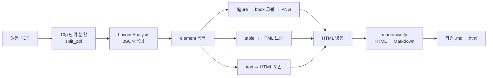
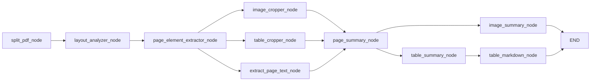
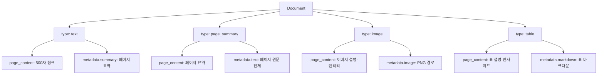

표 이미지만 잘라서 VLM에 보여주면 "숫자가 있는 표입니다"라고 답한다. 같은 페이지의 텍스트 요약을 함께 주면 "2019~2022년 부처별 추진일정 표"라고 답한다. **문맥 주입 한 번의 차이가 그 표의 검색 가능 여부를 가른다.**

이 글은 그런 판단들이 쌓인 2·3세대 파이프라인을 다룬다. PDF를 의미 단위 블록으로 분해하고, 좌표계가 다른 두 이미지 사이에서 크롭 위치를 맞추고, 절차형 스크립트를 그래프로 바꿔 부분 실패를 격리하고, 표를 검색용과 답변용 두 벌로 저장하는 설계까지 이어진다. [1편에서 다룬](/blog/rag/document-parsing-bottleneck/) "표가 평문으로 뭉개진다"는 문제의 해법에 해당한다.

## 용어 정리

| 용어 | 풀이 |
|---|---|
| **element** | 레이아웃 파싱의 최소 단위. [1편](/blog/rag/document-parsing-bottleneck/)에서 정의했다 |
| **category** | element의 유형 라벨. `table` `figure` `chart` `heading1` `header` `footer` `caption` `paragraph` 등 |
| **bounding box (bbox)** | element가 페이지에서 차지하는 사각 영역. 4개 꼭짓점 좌표로 표현 |
| **normalized coordinates** | bbox를 페이지 너비·높이로 나눠 0~1 비율로 만든 좌표. **DPI가 달라도 크롭 위치가 안 깨진다** |
| **crop (크롭)** | bbox 영역만 잘라 PNG로 저장하는 것. 잘린 표·그림이 VLM 입력이 된다 |
| **VLM** | 이미지를 이해하고 텍스트로 설명하는 모델. 그림·표를 검색 가능한 텍스트로 바꾸는 데 쓴다 |
| **StateGraph** | 상태(State)를 노드들이 갱신하며 진행하는 LangGraph의 그래프 실행 엔진 |
| **`TypedDict` State** | 그래프가 공유하는 상태 스키마. 각 노드는 자기가 채우는 키만 반환한다 |
| **checkpointer** | 그래프 실행 중간 상태를 저장. 중단·재개·상태 조회가 가능해진다 |
| **hypothetical questions** | "이 표를 보고 사용자가 물어볼 법한 질문". 질문-질문 유사도로 검색 적중률을 올리는 기법 |
| **`markdownify`** | HTML을 마크다운으로 변환하는 라이브러리 |

## 2세대 — 레이아웃 파서 파이프라인



### 왜 PDF를 먼저 분할하는가

| 이유 | 설명 |
|---|---|
| API 페이지 한도 | 한 번에 보낼 수 있는 페이지 수 제한 |
| 부분 실패 격리 | 100p 중 1p가 실패해도 해당 배치만 재시도 |
| 병렬 처리 | 배치별 동시 호출 가능 |
| 비용 통제 | 테스트 시 앞 N페이지만 잘라 검증 |

```python
def split_pdf(filepath, batch_size=10):
    """입력 PDF를 여러 개의 작은 PDF 파일로 분할"""
    input_pdf = pymupdf.open(filepath)
    num_pages = len(input_pdf)

    ret = []
    for start_page in range(0, num_pages, batch_size):
        end_page = min(start_page + batch_size, num_pages) - 1

        input_file_basename = os.path.splitext(filepath)[0]
        output_file = f"{input_file_basename}_{start_page:04d}_{end_page:04d}.pdf"
        with pymupdf.open() as output_pdf:
            output_pdf.insert_pdf(input_pdf, from_page=start_page, to_page=end_page)
            output_pdf.save(output_file)
            ret.append(output_file)

    input_pdf.close()
    return ret
```

> **파일명이 곧 메타데이터다.** `report_0000_0009.pdf`처럼 **4자리 시작·끝 페이지를 파일명에 인코딩**한다. 나중에 파일명만 파싱하면 전체 문서 기준 페이지 번호를 복원할 수 있다. 별도 매핑 테이블이 필요 없어지는 단순한 관례다.

### API 호출

```python
class LayoutAnalyzer:
    def __init__(self, api_key):
        self.api_key = api_key

    def _upstage_layout_analysis(self, input_file):
        response = requests.post(
            "https://api.upstage.ai/v1/document-ai/layout-analysis",
            headers={"Authorization": f"Bearer {self.api_key}"},
            data={"ocr": False},
            files={"document": open(input_file, "rb")},
        )

        if response.status_code == 200:
            output_file = os.path.splitext(input_file)[0] + ".json"
            with open(output_file, "w") as f:
                json.dump(response.json(), f, ensure_ascii=False)
            return output_file
        else:
            raise ValueError(f"예상치 못한 상태 코드: {response.status_code}")

    def execute(self, input_file):
        return self._upstage_layout_analysis(input_file)
```

API 키는 환경변수로 주입한다. `ocr: False`가 기본값인 것에 주의한다 — **텍스트 레이어가 있는 PDF에 OCR을 켜면 오탈자가 늘고 비용도 오른다.** 스캔본에만 켠다.

### 좌표 정규화 — 이 파이프라인에서 가장 미묘한 부분

| 단계 | 좌표계 |
|---|---|
| API 응답 bbox | 파서가 본 페이지 크기 기준 (예: 1240 × 1755) |
| 크롭 대상 이미지 | 300 DPI로 렌더링한 이미지 (예: 2480 × 3508) |

두 좌표계가 다르다. 그대로 쓰면 크롭 영역이 어긋난다. 해법은 **0~1 비율로 정규화한 뒤 대상 이미지 크기를 다시 곱하는 것**이다.

```python
@staticmethod
def normalize_coordinates(coordinates, output_page_size):
    """bbox 4개 꼭짓점에서 축 정렬 사각형을 만든 뒤 0~1로 정규화"""
    x_values = [coord["x"] for coord in coordinates]
    y_values = [coord["y"] for coord in coordinates]
    x1, y1, x2, y2 = min(x_values), min(y_values), max(x_values), max(y_values)

    return (
        x1 / output_page_size[0],
        y1 / output_page_size[1],
        x2 / output_page_size[0],
        y2 / output_page_size[1],
    )


@staticmethod
def crop_image(img, coordinates, output_file):
    """정규화 좌표에 대상 이미지 크기를 곱해 실제 픽셀 좌표로 환산"""
    img_width, img_height = img.size
    x1, y1, x2, y2 = [
        int(coord * dim)
        for coord, dim in zip(coordinates, [img_width, img_height] * 2)
    ]
    cropped_img = img.crop((x1, y1, x2, y2))
    cropped_img.save(output_file)


@staticmethod
def pdf_to_image(pdf_file, page_num, dpi=300):
    """PDF 특정 페이지를 이미지로 렌더링"""
    with pymupdf.open(pdf_file) as doc:
        page = doc[page_num].get_pixmap(dpi=dpi)
        target_page_size = [page.width, page.height]
        page_img = Image.frombytes("RGB", target_page_size, page.samples)
    return page_img
```

정규화가 하는 일은 **파싱 해상도와 렌더링 해상도를 분리**하는 것이다. 이 층이 없으면 DPI를 바꾸는 순간 모든 크롭이 깨진다.

### HTML 재조립에서 `br`을 빼는 이유

element마다 API가 HTML 조각을 준다. figure의 `` 태그 `src`만 크롭 파일 경로로 바꾼 뒤 전부 이어붙이고, `markdownify`로 한 번에 변환한다.

```python
# HTML에서 이미지 경로 업데이트
soup = BeautifulSoup(element["html"], "html.parser")
img_tag = soup.find("img")
if img_tag:
    relative_path = os.path.relpath(output_file, output_folder)
    img_tag["src"] = relative_path.replace("\\", "/")
element["html"] = str(soup)

html_content.append(element["html"])

# 전체 결합 후 — 발견된 태그로 변환 목록을 구성하되 br은 제외
combined_html_content = "\n".join(html_content)
soup = BeautifulSoup(combined_html_content, "html.parser")
all_tags = set([tag.name for tag in soup.find_all()])
html_tag_list = [tag for tag in list(all_tags) if tag not in ["br"]]

md_output = markdown(combined_html_content, convert=html_tag_list)
```

> `<br>`을 마크다운으로 변환하면 의도치 않은 줄바꿈이 대량 발생해 문단이 잘게 부서진다. 그러면 청킹 단계에서 문맥이 통째로 깨진다.
>
> **변환할 태그 목록을 문서에서 실제로 발견된 태그로 동적으로 구성하되, 노이즈 태그는 명시적으로 뺀다**는 것이 여기서의 아이디어다.

2세대의 한계는 구조에 있다. 절차형 스크립트라 **어느 단계에서 무엇이 만들어졌는지 볼 수 없고, 100페이지 중 70페이지에서 실패하면 처음부터 다시 해야 한다.**

## 3세대 — 파이프라인을 그래프로

절차형 스크립트를 `StateGraph`로 바꾸면 넷이 생긴다.

| 이점 | 설명 |
|---|---|
| **상태 가시성** | 어느 단계에서 무엇이 만들어졌는지 스냅샷 조회 |
| **병렬 실행** | 이미지 크롭·표 크롭·텍스트 추출이 서로 독립 → 동시 실행 |
| **중단·재개** | 체크포인터가 상태를 저장 → 실패 지점부터 재시작 |
| **조건 분기** | 배치가 남았는지에 따라 루프를 돌지 종료할지 선언적으로 표현 |

### 공유 State 정의

```python
from typing import TypedDict


class GraphState(TypedDict):
    filepath: str                                    # 원본 경로
    filetype: str                                    # pdf
    page_numbers: list[int]
    batch_size: int
    split_filepaths: list[str]                       # 분할된 파일들
    analyzed_files: list[str]                        # 분석 완료 파일들
    page_elements: dict[int, dict[str, list[dict]]]  # 페이지별 element
    page_metadata: dict[int, dict]
    page_summary: dict[int, str]
    images: list[str]                                # 크롭된 이미지 경로
    image_summary: list[str]
    tables: list[str]
    table_summary: dict[int, str]
    table_markdown: dict[int, str]
    texts: list[str]
    text_summary: dict[int, str]
    language: str
```

각 노드는 이 State 중 **자기가 채우는 키만 반환**한다. 분할 노드는 `GraphState(split_filepaths=ret)`만 돌려주고 나머지는 건드리지 않는다. 이 규약이 노드 간 결합을 끊는다.

### 그래프 구조



```python
from langgraph.graph import END, StateGraph
from langgraph.checkpoint.memory import MemorySaver

workflow = StateGraph(GraphState)

workflow.add_node("split_pdf_node", split_pdf_node)
workflow.add_node("layout_analyzer_node", layout_analyze_node)
workflow.add_node("page_element_extractor_node", page_element_extractor_node)
workflow.add_node("image_cropper_node", image_cropper_node)
workflow.add_node("table_cropper_node", table_cropper_node)
workflow.add_node("extract_page_text_node", extract_page_text)
workflow.add_node("page_summary_node", page_summary_node)
workflow.add_node("image_summary_node", image_summary_node)
workflow.add_node("table_summary_node", table_summary_node)
workflow.add_node("table_markdown_node", table_markdown_extractor)

workflow.add_edge("split_pdf_node", "layout_analyzer_node")
workflow.add_edge("layout_analyzer_node", "page_element_extractor_node")
workflow.add_edge("page_element_extractor_node", "image_cropper_node")
workflow.add_edge("page_element_extractor_node", "table_cropper_node")
workflow.add_edge("page_element_extractor_node", "extract_page_text_node")
workflow.add_edge("image_cropper_node", "page_summary_node")
workflow.add_edge("table_cropper_node", "page_summary_node")
workflow.add_edge("extract_page_text_node", "page_summary_node")
workflow.add_edge("page_summary_node", "image_summary_node")
workflow.add_edge("page_summary_node", "table_summary_node")
workflow.add_edge("image_summary_node", END)
workflow.add_edge("table_summary_node", "table_markdown_node")
workflow.add_edge("table_markdown_node", END)

workflow.set_entry_point("split_pdf_node")

memory = MemorySaver()
graph = workflow.compile(checkpointer=memory)
```

**`page_summary_node`가 세 갈래의 합류 지점(join)이다.** 이미지·표 요약을 만들 때 "그 페이지의 텍스트 요약"을 문맥으로 넣어야 하므로, 크롭과 텍스트 추출이 모두 끝난 뒤에 실행되어야 한다. 그래프로 표현하면 이 의존이 배선에 드러나고, 절차형 코드에서는 실행 순서에 암묵적으로 숨는다.

### 요약 프롬프트 — 숫자가 증발하는 것을 막는다

```python
prompt = PromptTemplate.from_template(
    """Please summarize the sentence according to the following REQUEST.

REQUEST:
1. Summarize the main points in bullet points.
2. Write the summary in same language as the context.
3. DO NOT translate any technical terms.
4. DO NOT include any unnecessary information.
5. Summary must include important entities, numerical values.

CONTEXT:
{context}

SUMMARY:"
"""
)

llm = ChatOpenAI(model_name="gpt-4o-mini", temperature=0)
text_summary_chain = create_stuff_documents_chain(llm, prompt)
```

| 지시 | 의도 |
|---|---|
| bullet points | 후속 프롬프트에 넣을 때 토큰 효율 |
| same language as context | 한국어 문서를 영어로 번역해버리는 사고 방지 |
| DO NOT translate technical terms | 고유명사·기술용어 보존 → 검색 키워드 유지 |
| must include entities, numerical values | **요약 과정에서 숫자가 증발하는 것을 막는 핵심 지시** |

마지막 지시가 실무에서 가장 중요하다. 요약은 본질적으로 정보를 버리는 연산이고, **모델이 가장 먼저 버리는 것이 숫자**다.

### 문맥 주입 — 잘라낸 이미지만으로는 부족하다

각 이미지와 표에 **같은 페이지의 텍스트 요약**을 붙여 배치를 만든다.

```python
def create_image_summary_data_batches(state: GraphState):
    data_batches = []
    page_numbers = sorted(list(state["page_elements"].keys()))

    for page_num in page_numbers:
        text = state["text_summary"][page_num]
        for image_element in state["page_elements"][page_num]["image_elements"]:
            image_id = int(image_element["id"])
            data_batches.append(
                {
                    "image": state["images"][image_id],  # 이미지 파일 경로
                    "text": text,                        # 관련 텍스트 요약
                    "page": page_num,
                    "id": image_id,
                }
            )
    return GraphState(image_summary_data_batches=data_batches)
```

> **왜 문맥을 붙이는가.** 잘라낸 표 이미지만 보여주면 VLM은 "숫자가 있는 표"라고만 답한다. 같은 페이지 텍스트 요약을 함께 주면 "2019~2022년 부처별 추진일정 표"라고 **제목과 의미를 부여**할 수 있다.
>
> 이 문맥 주입 하나가 표 검색 품질을 좌우한다. 의미 없는 설명은 어떤 질의에도 매칭되지 않기 때문이다.

### 멀티모달 호출 래퍼

이미지를 base64 data URI로 인코딩해 messages에 실어 보내는 얇은 래퍼다.

```python
class MultiModal:
    def __init__(self, model, system_prompt=None, user_prompt=None):
        self.model = model
        self.system_prompt = system_prompt
        self.user_prompt = user_prompt
        self.init_prompt()

    def encode_image_from_file(self, file_path):
        with open(file_path, "rb") as image_file:
            image_content = image_file.read()
            file_ext = os.path.splitext(file_path)[1].lower()
            if file_ext in [".jpg", ".jpeg"]:
                mime_type = "image/jpeg"
            elif file_ext == ".png":
                mime_type = "image/png"
            else:
                mime_type = "image/unknown"
            b64 = base64.b64encode(image_content).decode("utf-8")
            return f"data:{mime_type};base64,{b64}"

    def create_messages(
        self, image_url, system_prompt=None, user_prompt=None, display_image=True
    ):
        encoded_image = self.encode_image(image_url)
        system_prompt = (
            system_prompt if system_prompt is not None else self.system_prompt
        )
        user_prompt = user_prompt if user_prompt is not None else self.user_prompt

        return [
            {"role": "system", "content": system_prompt},
            {
                "role": "user",
                "content": [
                    {"type": "text", "text": user_prompt},
                    {"type": "image_url", "image_url": {"url": f"{encoded_image}"}},
                ],
            },
        ]

    def batch(
        self,
        image_urls: list[str],
        system_prompts: list[str] = [],
        user_prompts: list[str] = [],
        display_image=False,
    ):
        messages = []
        for image_url, system_prompt, user_prompt in zip(
            image_urls, system_prompts, user_prompts
        ):
            messages.append(
                self.create_messages(image_url, system_prompt, user_prompt, display_image)
            )
        response = self.model.batch(messages)
        return [r.content for r in response]
```

`invoke`·`batch`·`stream` 셋을 제공하지만 파이프라인에서는 **`batch`만 쓴다.** 이미지 수십~수백 장을 순차 호출하면 대기시간이 선형으로 늘어나기 때문이다.

### 표를 두 벌로 저장한다

3세대의 핵심 통찰이다. 표 이미지에서 **두 가지를 따로 뽑는다.**

| 추출물 | 프롬프트 성격 | 저장 위치 | 용도 |
|---|---|---|---|
| `table_summary` | 서술형 (제목·요약·엔티티·인사이트·가상질문) | `page_content` | **검색용** — 임베딩 대상 |
| `table_markdown` | 기계적 변환 (설명 금지, 마크다운만) | `metadata.markdown` | **답변 생성용** — LLM에 원본 수치 전달 |

이 분리가 필요한 이유는 명확하다. **표 마크다운만 임베딩하면 자연어 질의와 유사도가 낮아 검색이 안 되고**, 서술문만 저장하면 답변할 때 정확한 수치가 없다.

```python
@chain
def table_markdown_extractor(data_batches):
    llm = ChatOpenAI(temperature=0, model_name="gpt-4o-mini")

    system_prompt = (
        "You are an expert in converting image of the TABLE into markdown format. "
        "Be sure to include all the information in the table. "
        "DO NOT narrate, just answer in markdown format."
    )

    image_paths, system_prompts, user_prompts = [], [], []

    for data_batch in data_batches:
        image_path = data_batch["table"]
        user_prompt_template = """DO NOT wrap your answer in code fences or any XML tags.

###

Output Format:

<table_markdown>

Output must be written in Korean.
"""
        image_paths.append(image_path)
        system_prompts.append(system_prompt)
        user_prompts.append(user_prompt_template)

    multimodal_llm = MultiModal(llm)
    return multimodal_llm.batch(
        image_paths, system_prompts, user_prompts, display_image=False
    )
```

> **`DO NOT narrate` 한 줄의 무게.** 이것이 없으면 모델이 "이 표는 다음과 같습니다:" 같은 서두를 붙여 마크다운 파싱이 깨진다. 코드 펜스로 감싸지 말라는 지시도 같은 목적이다.
>
> **구조화 출력에서 형식 오염을 막는 방어 문구**는 선택이 아니라 필수 요소다.

### 최종 Document 구조

파싱 결과를 네 가지 타입의 `Document`로 재조립한다.



| type | `page_content` | 주요 `metadata` |
|---|---|---|
| `text` | `RecursiveCharacterTextSplitter(500, 50)`로 나눈 청크 | `summary`(페이지 요약), `page`, `source` |
| `page_summary` | 페이지 단위 요약 | `text`(해당 페이지 전체 원문), `page`, `source` |
| `image` | 이미지 설명·엔티티·요약 | `image`(파일 경로), `page`, `source`, `id` |
| `table` | 표 설명·엔티티·인사이트 | `table`(이미지 경로), `markdown`(표 마크다운), `page`, `source`, `id` |

공통 규약은 `type`(네 값 중 하나), `page`(1부터 시작하는 숫자), `source`(원본 파일 경로) 셋이다.

산출 예시는 다음과 같다.

```python
{
  "metadata": {
    "type": "table",
    "table": ".../83.png",
    "markdown": "| 추진일정 | 2019 | 2020 | 2021 | 2022 | 관계부처 |\n|---|---|---|---|---|---|\n| | 상 | 하 | 상 | 하 | |",
    "page": "7",
    "source": ".../report.pdf",
    "id": "83"
  },
  "page_content": "<table>\n<title>\n주요 과제별 추진일정 검토 및 확정\n</title>\n<summary>...</summary>\n<entities>...</entities>\n<data_insights>...</data_insights>\n</table>"
}
```

> **이 구조가 주는 것**: 같은 표에 대해 **검색은 서술문으로, 답변은 마크다운으로** 동작한다. 사용자가 "부처별 추진일정 알려줘"라고 물으면 서술문이 매칭되고, LLM은 metadata의 마크다운을 보고 정확한 값을 답한다. **하나의 청크에 두 표현을 공존시킨 것**이 핵심이다.

3세대의 남은 문제는 비용이다. 페이지 요약과 표 마크다운을 매번 LLM으로 만들기 때문에 재실행할 때마다 호출이 발생한다. 그리고 코드가 노트북 하나에 흩어져 있어 재사용이 어렵다. 이 둘을 정리한 것이 [4세대 패키지 구조](/blog/rag/layoutparse-architecture/)다.
