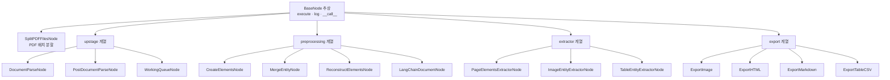
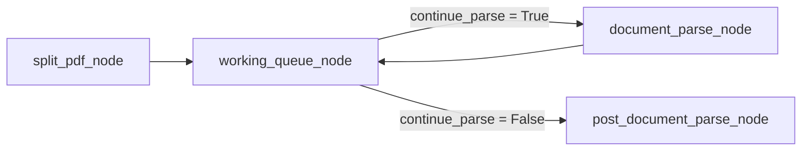

21페이지 산업 리포트를 파싱하면 465개 element가 나오는데, 그중 62개(13%)가 머리말·꼬리말이고 표·차트·그림은 42개(9%)뿐이다. **13%는 버리려고, 9%는 살리려고** 파이프라인의 대부분이 존재한다. 수치의 대부분이 그 9%에 있기 때문이다.

이 글은 그 처리를 노트북 코드에서 재사용 가능한 패키지로 옮긴 4세대 구조를 다룬다. Document Parse v2가 크롭 코드를 통째로 없앤 방식, 11개 노드를 하나로 묶는 16줄짜리 추상 클래스, 그리고 **리듀서 선택이 곧 동시성 설계가 되는** 상태 스키마를 정리한다. [2·3세대 파이프라인](/blog/rag/layout-parser-pipeline/)의 코드를 모듈로 분해한 결과에 해당한다.

## 용어 정리

| 용어 | 풀이 |
|---|---|
| **element** | 레이아웃 파싱의 최소 단위. 구성은 [1편](/blog/rag/document-parsing-bottleneck/), 유형별 처리는 [2편](/blog/rag/layout-parser-pipeline/) 참조 |
| **`base64_encoding`** | 잘라낸 그림·표 이미지를 API 응답 안에 문자열로 실어 보내는 필드 |
| **`ParseState`** | 그래프가 공유하는 상태 스키마(`TypedDict`). 각 노드는 자기가 채우는 키만 반환한다 |
| **리듀서(reducer)** | 노드 반환값을 기존 상태에 합치는 규칙. `operator.add`면 누적, 기본은 덮어쓰기 |
| **`BaseNode`** | 모든 노드의 추상 기반 클래스. "상태를 받아 상태를 반환한다"는 계약을 강제한다 |
| **센티널(sentinel)** | 루프 종료를 알리는 특수 값. 여기서는 `<<FINISHED>>` |
| **페이지 오프셋** | 분할 파일 기준 페이지 번호를 전체 문서 기준으로 되돌리는 보정값 |

## Document Parse v2 — 크롭 코드가 사라진다

| 항목 | v1 `layout-analysis` | v2 `document-parse` |
|---|---|---|
| 출력 형식 | `html` 단일 | `html` + `markdown` + `text` |
| 좌표 | 절대 픽셀 (`bounding_box`) | **정규화 좌표** (`coordinates`, 0~1) |
| 이미지 | 직접 크롭 필요 | `base64_encoding` 필드로 잘린 이미지 제공 |
| 카테고리 | 기본 세트 | `chart` 분리 등 세분화 |
| 사용량 | `billed_pages` | `usage.pages` + `model` 버전 명시 |

세 번째 행이 결정적이다. **2세대에서 좌표 정규화와 크롭에 쓰던 코드 전체가 사라진다.** 좌표계 불일치라는 미묘한 버그 원인도 함께 사라진다.

### 요청 설정

```python
DEFAULT_CONFIG = {
    "ocr": False,
    "coordinates": True,
    "output_formats": "['html', 'text', 'markdown']",
    "model": "document-parse",
    "base64_encoding": "['figure', 'chart', 'table']",
}

response = requests.post(
    "https://api.upstage.ai/v1/document-ai/document-parse",
    headers={"Authorization": f"Bearer {self.api_key}"},
    data=self.config,
    files={"document": open(input_file, "rb")},
)
```

| 옵션 | 설명 | 선택 근거 |
|---|---|---|
| `ocr: False` | OCR 비활성화 | 텍스트 레이어가 있는 PDF는 OCR이 오히려 오탈자를 만든다. 스캔본만 `True` |
| `coordinates: True` | 좌표 반환 | 원본 위치 추적·시각화·재크롭에 필요 |
| `output_formats` | 3종 동시 요청 | 텍스트는 `text`, 표는 `markdown`, 그림은 `html`로 각각 다르게 쓴다 |
| `base64_encoding` | `figure`·`chart`·`table`만 이미지 인코딩 | 전체에 걸면 응답이 불필요하게 커진다 |

### 응답 스키마

```python
{
  "api": "2.0",
  "model": "document-parse-240910",
  "usage": {"pages": 21},
  "content": {...},          # 문서 전체 통합 결과
  "elements": [...]          # 요소 배열 (핵심)
}
```

element 하나의 구조는 이렇다.

```python
{
  "category": "paragraph",
  "content": {
    "html": "<p id='0' data-category='paragraph' style='font-size:20px'>Europe, Africa ...</p>",
    "markdown": "Europe, Africa, Middle East and Asia-Pacific prices and commentary",
    "text": "Europe, Africa, Middle East and Asia-Pacific prices and commentary"
  },
  "coordinates": [
    {"x": 0.3217, "y": 0.1249},
    {"x": 0.9273, "y": 0.1249},
    {"x": 0.9273, "y": 0.1560},
    {"x": 0.3217, "y": 0.1560}
  ],
  "id": 0,
  "page": 1
}
```

`table` element는 `content.html`에 `colspan`·`rowspan`이 살아 있는 완전한 `<table>` 태그가 들어온다.

```html
<table id='10' style='font-size:14px'>
  <tr><td colspan="4">Bitumen prices at key locations, 16-22 Mar</td><td rowspan="2">$/t ±</td></tr>
  <tr><td></td><td></td><td>Low</td><td>High</td></tr>
  <tr><td>Mediterranean</td><td></td><td>445.43</td><td>449.77</td><td>+29.05</td></tr>
</table>
```

병합 셀이 보존된다는 것이 중요하다. 단순 텍스트 추출에서는 헤더가 사라지고 숫자만 남는 실패가 바로 이 지점에서 발생한다.

### 실제 문서의 카테고리 분포

21페이지 산업 리포트를 파싱한 결과다.

| category | 개수 | 처리 방침 |
|---|---|---|
| `paragraph` | 322 | 텍스트로 누적 |
| `header` | 40 | **버림** |
| `heading1` | 38 | `# ` 붙여 마크다운 헤딩화 |
| `table` | 23 | 마크다운 + 이미지 + VLM 해설 |
| `footer` | 22 | **버림** |
| `chart` | 13 | 이미지 + VLM 해설 |
| `figure` | 6 | 이미지 + VLM 해설 |
| `list` | 1 | 텍스트로 누적 |

> 전체 465개 중 **62개(13%)가 header·footer**다. 버리지 않으면 청크의 13%가 "회사명·페이지번호" 노이즈로 채워진다.
>
> 반대로 `table`+`chart`+`figure`는 42개(9%)뿐이지만 보고서에서 **수치의 대부분이 여기에 있다.** 9%를 살리기 위해 파이프라인의 대부분이 존재하는 셈이다.

### 비용 구조

```python
pages_count = 0
for meta in state["metadata"]:
    for k, v in meta.items():
        if k == "usage":
            pages_count += int(v["pages"])

total_cost = pages_count * 0.01
```

| 항목 | 값 |
|---|---|
| 과금 단위 | **페이지 수** (`usage.pages`) |
| 단가 (코드 상수 기준) | 페이지당 `$0.01` |
| 21페이지 문서 1회 | 약 `$0.21` |
| 1,000페이지 문서 | 약 `$10` |

여기에 **VLM 비용이 별도로 붙는다.** 표·그림 1개당 멀티모달 호출 1회다.

| 비용 항목 | 통제 수단 |
|---|---|
| 파싱 API | `test_page` 옵션으로 앞 N페이지만 시험 파싱 |
| VLM 호출 | 배치 처리(10개 단위), `figure`/`chart`/`table`에만 호출 |
| 재실행 | 파싱 결과를 JSON·pickle로 저장 → 재파싱 없이 후처리만 반복 |
| 모델 선택 | 해설 생성은 소형 멀티모달 모델로 충분 |

> **파싱은 1회성 비용, 검색은 상시 비용이다.** 파싱에 페이지당 몇 센트를 더 쓰더라도 검색 정확도가 오르면 전체적으로 이득이다.
>
> 반대로 문서가 자주 바뀐다면 변경 감지(해시 비교) 후 변경분만 재파싱하는 구조가 필요하다. 세 번째 행의 캐시가 실험 비용을 한 자릿수로 떨어뜨리는 지점이다.

## 모듈별 책임

3세대의 노트북 코드를 책임별로 분해한 결과다.

| 모듈 | 줄수 | 책임 | 주요 심볼 |
|---|---|---|---|
| `base.py` | 16 | 모든 노드의 추상 기반. `__call__` → `execute` 위임, `log` 제공 | `BaseNode` |
| `state.py` | 39 | 그래프 공유 상태 스키마 | `ParseState` |
| `element.py` | 17 | 파싱 결과 요소의 값 객체 | `Element` |
| `utils.py` / `pdf.py` | 43 / 43 | PDF 배치 분할 | `SplitPDFFilesNode` |
| `upstage.py` | 166 | API 호출·후처리·작업 큐·루프 분기 | `DocumentParseNode`, `PostDocumentParseNode`, `WorkingQueueNode` |
| `preprocessing.py` | 208 | raw element → `Element` 변환, 엔티티 병합, 페이지 재조립 | `CreateElementsNode`, `MergeEntityNode`, `ReconstructElementsNode`, `LangChainDocumentNode` |
| `extractor.py` | 257 | 페이지별 요소 분류, VLM 엔티티 추출 | `PageElementsExtractorNode`, `ImageEntityExtractorNode`, `TableEntityExtractorNode` |
| `export.py` | 218 | 산출물 내보내기 (PNG·HTML·Markdown·CSV) | `ExportImage`, `ExportHTML`, `ExportMarkdown`, `ExportTableCSV` |
| `file.py` | 30 | Document 리스트 pickle 저장·로드 | `save_documents_to_pkl`, `load_documents_from_pkl` |
| 그래프 팩토리 | 178 | 그래프 조립 | `create_upstage_parser_graph`, `create_export_graph` |
| `prompts/*.yaml` | 4개 | 이미지·표 엔티티 추출 프롬프트 | `IMAGE-SYSTEM`, `IMAGE-USER`, `TABLE-SYSTEM`, `TABLE-USER` |



프롬프트가 코드가 아니라 **YAML 파일**로 분리돼 있는 것에 주목한다. 프롬프트를 코드에 f-string으로 박으면 문구 하나 바꾸는 데 배포가 필요하고 변경 이력도 코드 diff에 묻힌다.

## 노드 규약 — 16줄이 11개 노드를 통일한다

```python
from .state import ParseState
from abc import ABC, abstractmethod


class BaseNode(ABC):
    def __init__(self, verbose=False, **kwargs):
        self.name = self.__class__.__name__
        self.verbose = verbose

    @abstractmethod
    def execute(self, state: ParseState) -> ParseState:
        pass

    def log(self, message: str, **kwargs):
        if self.verbose:
            print(f"[{self.name}] {message}")
            for key, value in kwargs.items():
                print(f"  {key}: {value}")

    def __call__(self, state: ParseState) -> ParseState:
        return self.execute(state)
```

| 설계 요소 | 효과 |
|---|---|
| `__call__` → `execute` 위임 | LangGraph는 callable을 노드로 받는다. 인스턴스를 그대로 `add_node`에 넘길 수 있다 |
| `self.name = self.__class__.__name__` | 로그에 노드명이 자동으로 찍힌다 |
| `verbose` 플래그 | 로그를 노드별로 켜고 끈다. 운영에서는 전부 끔 |
| `@abstractmethod` | `execute` 미구현 시 인스턴스화 자체가 실패 → 실수 조기 발견 |

> **이 16줄이 하는 일**은 "노드는 상태를 받아 상태를 반환한다"는 계약을 코드로 강제하는 것이다. 11개 노드가 전부 같은 모양이 되므로 새 처리 단계를 추가하는 비용이 거의 0이 된다.
>
> 로그 접두어를 클래스명으로 강제한 것도 작지만 결정적이다. **모듈 경계가 그대로 관측 경계**가 된다.

## 상태 스키마 — 리듀서가 곧 동시성 설계다

```python
from typing import TypedDict, Annotated, List, Dict
import operator
from .element import Element
from langchain_core.documents import Document


class ParseState(TypedDict):
    filepath: Annotated[str, "filepath"]
    filetype: Annotated[str, "filetype"]
    split_filepaths: Annotated[List[str], "split_filepaths"]
    working_filepath: Annotated[str, "working_filepath"]

    metadata: Annotated[List[Dict], operator.add]     # api, model, usage
    total_cost: Annotated[float, "total_cost"]

    raw_elements: Annotated[List[Dict], operator.add]
    elements_from_parser: Annotated[List[Dict], "elements_from_parser"]

    elements: Annotated[List[Element], "elements"]
    reconstructed_elements: Annotated[List[Dict], "reconstructed_elements"]

    export: Annotated[List, operator.add]

    texts_by_page: Annotated[Dict[int, str], "texts_by_page"]
    images_by_page: Annotated[Dict[int, List[Element]], "images_by_page"]
    tables_by_page: Annotated[Dict[int, List[Element]], "tables_by_page"]

    extracted_image_entities: Annotated[List[Element], "extracted_image_entities"]
    extracted_table_entities: Annotated[List[Element], "extracted_table_entities"]

    documents: Annotated[List[Document], "documents"]
    language: Annotated[str, "language"]
```

**`operator.add`가 붙은 세 키가 결정적이다.**

| 키 | 이유 |
|---|---|
| `metadata` | 배치마다 API 메타데이터가 하나씩 생긴다 → 누적해야 총 페이지 수 계산 가능 |
| `raw_elements` | 배치 루프가 돌 때마다 element 목록이 추가된다 → **덮어쓰면 마지막 배치만 남는다** |
| `export` | export 노드 4개가 **병렬로** 실행되어 각자 파일 경로를 반환 → 누적해야 전부 수집된다 |

나머지 키는 `Annotated[..., "설명"]` 형태로 **덮어쓰기(replace)** 동작이다.

> **리듀서 선택이 곧 동시성 설계다.** 병렬 노드가 같은 키를 반환하는데 리듀서가 덮어쓰기면 결과가 조용히 사라진다. 에러도 나지 않고 값 하나만 남는다.
>
> `export`가 이 경우의 교과서적 사례다. 노드 4개가 동시에 끝나는데 누적 리듀서가 없으면 산출물 3개를 잃는다.

### 값 객체

```python
from typing import Dict
from dataclasses import dataclass
from copy import deepcopy


@dataclass
class Element:
    category: str  # table, figure, chart, heading1, header, footer, caption,
                   # paragraph, equation, list, index, footnote
    content: str = ""
    html: str = ""
    markdown: str = ""
    base64_encoding: str = None
    image_filename: str = None
    page: int = None
    id: int = None
    coordinates: list[Dict] = None
    entity: str = ""

    def copy(self):
        return deepcopy(self)
```

`copy()`가 `deepcopy`인 이유는 엔티티 추출 시 원본 `Element`를 복제해 `entity`만 채워 넣기 때문이다. 얕은 복사면 `coordinates` 리스트가 공유되어 한쪽 수정이 다른 쪽에 새어 나간다.

## 파싱 루프 — 큐와 조건 분기



`WorkingQueueNode`가 다음 처리 대상 파일을 하나 꺼내고, 다 떨어지면 `<<FINISHED>>` 센티널을 세운다.

```python
class WorkingQueueNode(BaseNode):
    def execute(self, state: ParseState):
        working_filepath = state.get("working_filepath", None)
        # 비어 있으면 첫 번째 파일 선택
        if (
            "working_filepath" not in state
            or state["working_filepath"] is None
            or state["working_filepath"] == ""
        ):
            if len(state["split_filepaths"]) > 0:
                working_filepath = state["split_filepaths"][0]
            else:
                working_filepath = "<<FINISHED>>"
        else:
            if working_filepath == "<<FINISHED>>":
                return {"working_filepath": "<<FINISHED>>"}

            current_index = state["split_filepaths"].index(working_filepath)
            if current_index + 1 < len(state["split_filepaths"]):
                working_filepath = state["split_filepaths"][current_index + 1]
            else:
                working_filepath = "<<FINISHED>>"
        return {"working_filepath": working_filepath}


def continue_parse(state: ParseState):
    return state["working_filepath"] != "<<FINISHED>>"
```

```python
workflow.add_conditional_edges(
    "working_queue_node",
    continue_parse,
    {True: "document_parse_node", False: "post_document_parse_node"},
)
workflow.add_edge("document_parse_node", "working_queue_node")
```

> **재귀 한도에 주의한다.** 이 루프 때문에 실행 시 `recursion_limit=300`을 지정한다. 배치 1개당 노드 2회(큐 → 파싱)를 소비하므로, 30페이지 배치에 300 한도면 약 4,000페이지까지 처리 가능하다는 계산이 나온다.

## 페이지 오프셋 복원

API는 **보낸 파일 기준**으로 페이지 번호를 매긴다. 40~49페이지를 잘라 보내면 응답은 1~10페이지로 돌아온다. 파일명에 인코딩해 둔 시작 페이지로 이것을 되돌린다.

```python
class DocumentParseNode(BaseNode):
    def __init__(self, api_key, use_ocr=False, verbose=False, **kwargs):
        super().__init__(verbose=verbose, **kwargs)
        self.api_key = api_key
        self.config = DEFAULT_CONFIG
        if use_ocr:
            self.config["ocr"] = True

    def parse_start_end_page(self, filepath):
        """파일명 끝 9글자(예: 0040_0049)에서 페이지 범위를 읽는다"""
        filename = os.path.basename(filepath)
        name_without_ext = filename.rsplit(".", 1)[0]

        try:
            if len(name_without_ext) < 9:
                return (-1, -1)

            page_numbers = name_without_ext[-9:]

            if not (
                page_numbers[4] == "_"
                and page_numbers[:4].isdigit()
                and page_numbers[5:].isdigit()
            ):
                return (-1, -1)

            start_page = int(page_numbers[:4])
            end_page = int(page_numbers[5:])

            if start_page > end_page:
                return (-1, -1)

            return (start_page, end_page)

        except (IndexError, ValueError):
            return (-1, -1)

    def execute(self, state: ParseState):
        filepath = state["working_filepath"]
        parsed_json = self._upstage_layout_analysis(filepath)

        start_page, _ = self.parse_start_end_page(filepath)
        page_offset = start_page - 1 if start_page != -1 else 0

        with open(parsed_json, "r") as f:
            data = json.load(f)
            for element in data["elements"]:
                element["page"] += page_offset

        metadata = {
            "api": data.pop("api"),
            "model": data.pop("model"),
            "usage": data.pop("usage"),
        }

        return {"metadata": [metadata], "raw_elements": [data["elements"]]}
```

형식 검증에 실패하면 `(-1, -1)`을 반환해 **오프셋 0으로 안전하게 폴백**한다. 파일명 규칙이 깨졌을 때 예외로 파이프라인을 죽이지 않고 원래 번호를 유지하는 선택이다.

### 전역 ID 재부여

배치별로 `id`가 0부터 다시 시작하므로, 전 배치를 이어붙이면서 문서 전역 유일 ID를 다시 매긴다.

```python
class PostDocumentParseNode(BaseNode):
    def execute(self, state: ParseState):
        elements_list = state["raw_elements"]
        id_counter = 0
        post_processed_elements = []

        for elements in elements_list:
            for element in elements:
                elem = element.copy()
                elem["id"] = id_counter
                id_counter += 1
                post_processed_elements.append(elem)

        pages_count = 0
        for meta in state["metadata"]:
            for k, v in meta.items():
                if k == "usage":
                    pages_count += int(v["pages"])

        total_cost = pages_count * 0.01
        self.log(f"Total Cost: ${total_cost:.2f}")

        return {
            "elements_from_parser": post_processed_elements,
            "total_cost": total_cost,
        }
```

이 ID가 이후 **이미지 파일명과 엔티티 병합의 키**가 된다. 배치 경계를 넘어 유일해야 하는 이유가 여기 있다.

여기까지가 구조와 규약이다. 이 위에서 실제로 element를 분류하고 VLM으로 엔티티를 뽑아 페이지 단위로 재조립하는 [노드 파이프라인](/blog/rag/layoutparse-nodes/)이 다음 편이다.
