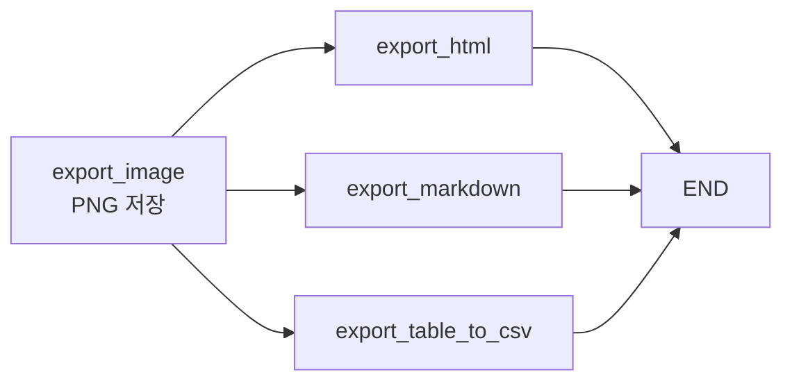

같은 API 응답에서 표는 `markdown` 필드를 쓰고 문단은 `text` 필드를 쓴다. 반대로 하면 문단에 불필요한 이스케이프가 섞이고 표는 구조가 사라진다. **유형별로 다른 필드를 골라 쓰는 것**이 파싱 파이프라인의 실제 작업이다.

이 글은 그 분기가 일어나는 노드 9개를 순서대로 따라간다. element를 유형별로 갈라 `Element` 객체로 만들고, 페이지별로 재분류하고, VLM으로 엔티티를 배치 추출하고, 다시 페이지 단위로 재조립해 최종 `Document`를 만드는 과정이다. 마지막에 **표 하나에서 Document를 2개 만드는 이유**가 나온다.

## 이 편에서 쓰는 계약

[앞 편에서 정의한](/blog/rag/layoutparse-architecture/) 세 가지 위에서 진행된다. 시그니처만 다시 옮겨 둔다.

| 심볼 | 형태 | 역할 |
|---|---|---|
| `BaseNode` | `execute(state) -> state`, `__call__`이 `execute`에 위임 | 모든 노드의 계약. 상태를 받아 상태를 반환한다 |
| `ParseState` | `TypedDict`. `Annotated[..., operator.add]`면 누적, 아니면 덮어쓰기 | 그래프 공유 상태. 각 노드는 자기가 채우는 키만 반환 |
| `Element` | `@dataclass`. `category`·`content`·`html`·`markdown`·`base64_encoding`·`image_filename`·`page`·`id`·`coordinates`·`entity` | 파싱 결과의 값 객체. `copy()`는 `deepcopy` |

카테고리는 세 묶음으로 상수화돼 있다.

```python
IMAGE_TYPES = ["figure", "chart"]
TEXT_TYPES = ["text", "equation", "caption", "paragraph", "list", "index", "heading1"]
TABLE_TYPES = ["table"]
```

## 노드 9개의 입출력 계약

각 노드가 State의 무엇을 읽고 무엇을 쓰는지 먼저 보면 흐름이 잡힌다.

| # | 노드 | 읽는 키 | 하는 일 | 쓰는 키 |
|---|---|---|---|---|
| 1 | `CreateElementsNode` | `elements_from_parser` | 카테고리별 분기, base64 → PNG 저장, 노이즈 폐기 | `elements` |
| 2 | `PageElementsExtractorNode` | `elements` | 페이지별 텍스트·이미지·표 3분류 | `texts_by_page`, `images_by_page`, `tables_by_page` |
| 3 | `ImageEntityExtractorNode` | `images_by_page`, `texts_by_page` | VLM 배치 10개로 엔티티 추출 | `extracted_image_entities` |
| 4 | `TableEntityExtractorNode` | `tables_by_page`, `texts_by_page` | 동일 구조, 표 전용 프롬프트 | `extracted_table_entities` |
| 5 | `MergeEntityNode` | `elements`, `extracted_*_entities` | `id` 기준으로 `entity` 필드 병합 | `elements` |
| 6 | `ReconstructElementsNode` | `elements` | 페이지 단위로 텍스트·이미지·표 재조립 | `reconstructed_elements` |
| 7 | `LangChainDocumentNode` | `reconstructed_elements` | 최종 `Document` 생성 | `documents` |
| 8 | `ExportImage` | `elements` | PNG 저장, `png_filepath` 주입 | `export` |
| 9 | `ExportHTML` / `ExportMarkdown` / `ExportTableCSV` | `elements` | 산출물 3종 병렬 저장 | `export` |

3번과 4번이 **병렬 브랜치**로 갈라졌다가 5번에서 합류한다. 8번과 9번도 병렬이고, 그래서 `export` 키에 누적 리듀서가 붙어 있다.

## 카테고리별 분기 — 파이프라인의 심장

```python
class CreateElementsNode(BaseNode):
    def __init__(self, verbose=False, add_newline=True, **kwargs):
        super().__init__(verbose=verbose, **kwargs)
        self.add_newline = add_newline
        self.newline = "\n" if add_newline else ""

    def _save_base64_image(self, base64_str, basename, page_num, element_id, directory):
        img_filename = f"{basename}_Page_{page_num}_Index_{element_id}.png"
        img_filepath = os.path.join(directory, img_filename)
        img_data = base64.b64decode(base64_str)
        with open(img_filepath, "wb") as f:
            f.write(img_data)
        return img_filepath

    def execute(self, state: ParseState) -> ParseState:
        post_processed_elements = []
        directory = os.path.dirname(state["filepath"])
        base_filename = os.path.splitext(os.path.basename(state["filepath"]))[0]

        for element in state["elements_from_parser"]:
            elem = None

            # 1) 버릴 것은 즉시 버린다
            if element["category"] in ["footnote", "header", "footer"]:
                continue

            # 2) 수식: 마크다운만
            if element["category"] in ["equation"]:
                elem = Element(
                    category=element["category"],
                    content=element["content"]["markdown"] + self.newline,
                    html=element["content"]["html"],
                    markdown=element["content"]["markdown"],
                    page=element["page"],
                    id=element["id"],
                )

            # 3) 표: 마크다운 + 이미지 저장
            elif element["category"] in ["table"]:
                image_filename = self._save_base64_image(
                    element["base64_encoding"], base_filename,
                    element["page"], element["id"], directory,
                )
                elem = Element(
                    category=element["category"],
                    content=element["content"]["markdown"] + self.newline,
                    html=element["content"]["html"],
                    markdown=element["content"]["markdown"],
                    base64_encoding=element["base64_encoding"],
                    image_filename=image_filename,
                    page=element["page"],
                    id=element["id"],
                    coordinates=element["coordinates"],
                )

            # 4) 그림·차트: 이미지 저장
            elif element["category"] in ["figure", "chart"]:
                image_filename = self._save_base64_image(
                    element["base64_encoding"], base_filename,
                    element["page"], element["id"], directory,
                )
                elem = Element(
                    category=element["category"],
                    content=element["content"]["markdown"] + self.newline,
                    html=element["content"]["html"],
                    markdown=element["content"]["markdown"],
                    base64_encoding=element["base64_encoding"],
                    image_filename=image_filename,
                    page=element["page"],
                    id=element["id"],
                    coordinates=element["coordinates"],
                )

            # 5) 대제목: 마크다운 헤딩으로 승격
            elif element["category"] in ["heading1"]:
                elem = Element(
                    category=element["category"],
                    content=f'# {element["content"]["text"]}{self.newline}',
                    html=element["content"]["html"],
                    markdown=element["content"]["markdown"],
                    page=element["page"],
                    id=element["id"],
                )

            # 6) 일반 텍스트
            elif element["category"] in ["caption", "paragraph", "list", "index"]:
                elem = Element(
                    category=element["category"],
                    content=element["content"]["text"] + self.newline,
                    html=element["content"]["html"],
                    markdown=element["content"]["markdown"],
                    page=element["page"],
                    id=element["id"],
                )

            if elem is not None:
                post_processed_elements.append(elem)

        return {"elements": post_processed_elements}
```

| 분기 | `content`에 담는 것 | 근거 |
|---|---|---|
| `equation` | `markdown` | 수식은 LaTeX 마크다운이 원형에 가장 가깝다 |
| `table` | `markdown` + PNG 저장 | 검색은 마크다운, 해설은 이미지로 VLM에 전달 |
| `figure`·`chart` | `markdown` + PNG 저장 | 텍스트가 거의 없으므로 이미지가 본체 |
| `heading1` | `# ` + `text` | 문서 구조를 마크다운 헤딩으로 복원 |
| `caption`·`paragraph`·`list`·`index` | `text` | HTML 태그 없는 순수 텍스트가 청킹에 적합 |
| `footnote`·`header`·`footer` | **`continue` (폐기)** | 페이지마다 반복되는 노이즈 |

> **표는 `text`가 아니라 `markdown`을 쓰고, 문단은 `markdown`이 아니라 `text`를 쓴다.** 같은 응답에서 유형별로 다른 필드를 골라 쓰는 것이 이 노드의 핵심이다.
>
> 문단에 마크다운을 쓰면 불필요한 이스케이프가 섞이고, 표에 텍스트를 쓰면 구조가 사라진다. API가 세 형식을 동시에 주는 이유가 여기서 드러난다.

## 페이지별 3분류

```python
class PageElementsExtractorNode(BaseNode):
    def execute(self, state: ParseState) -> ParseState:
        elements = state["elements"]
        elements_by_page = dict()
        max_page = 0

        for elem in elements:
            page_num = int(elem.page)
            max_page = max(max_page, page_num)
            if page_num not in elements_by_page:
                elements_by_page[page_num] = []
            if elem.category in (IMAGE_TYPES + TABLE_TYPES):
                elements_by_page[page_num] = []
            elements_by_page[page_num].append(elem)

        texts_by_page = dict()
        images_by_page = dict()
        tables_by_page = dict()

        # 0부터 max_page까지 빠짐없이 초기화 — 빈 페이지도 키가 있어야 한다
        for page_num in range(max_page + 1):
            texts_by_page[page_num] = ""
            images_by_page[page_num] = []
            tables_by_page[page_num] = []

        for page_num, elems in elements_by_page.items():
            for elem in elems:
                if elem.category in IMAGE_TYPES:
                    images_by_page[page_num].append(elem)
                elif elem.category in TABLE_TYPES:
                    tables_by_page[page_num].append(elem)
                else:
                    texts_by_page[page_num] += elem.content

        return {
            "texts_by_page": texts_by_page,
            "images_by_page": images_by_page,
            "tables_by_page": tables_by_page,
        }
```

> **`texts_by_page`가 이후 VLM 호출의 context가 된다.** 이미지 element의 `page`로 조회해 "이 그림이 있는 페이지의 텍스트"를 프롬프트에 넣는다.
>
> 3세대에서는 LLM으로 만든 **요약**을 문맥으로 썼지만, 4세대는 **원문 텍스트를 그대로** 쓴다. 요약 단계 LLM 호출 1회가 통째로 사라진 셈이고, 요약 과정의 정보 손실도 함께 없어진다.

빈 페이지까지 키를 만들어 두는 초기화가 사소해 보이지만 중요하다. 뒤 단계가 `texts_by_page[page]`를 무조건 조회하므로, 그림만 있는 페이지에서 `KeyError`가 나지 않게 한다.

## 엔티티 추출 — 배치 10개 단위

```python
class ImageEntityExtractorNode(BaseNode):
    def execute(self, state: ParseState) -> ParseState:
        images_files = []
        for page_images in state["images_by_page"].values():
            images_files.extend(page_images)

        BATCH_SIZE = 10
        language = state["language"]
        extracted_image_entities = []

        for i in range(0, len(images_files), BATCH_SIZE):
            batch = images_files[i : i + BATCH_SIZE]
            batch_data = []
            for image_element in batch:
                batch_data.append(
                    {
                        "image": image_element.image_filename,
                        "context": state["texts_by_page"][image_element.page],
                        "language": language,
                    }
                )
            batch_result = image_entity_extractor.invoke(batch_data)
            for j, result in enumerate(batch_result):
                element = batch[j].copy()   # Element 깊은 복사
                element.entity = result
                extracted_image_entities.append(element)
        return {"extracted_image_entities": extracted_image_entities}
```

`TableEntityExtractorNode`는 `tables_by_page` / `table_entity_extractor` / `extracted_table_entities`만 다르고 구조가 같다.

배치 크기 10은 두 제약의 절충이다. 너무 작으면 왕복 횟수가 늘고, 너무 크면 **배치 하나가 실패할 때 잃는 작업량이 커진다.** 재시도 단위가 곧 배치 단위이기 때문이다.

호출 체인은 `@chain` 데코레이터로 정의한다.

```python
@chain
def image_entity_extractor(data_batches):
    llm = ChatOpenAI(temperature=0, model_name="gpt-4o-mini")

    system_prompt = load_prompt("prompts/IMAGE-SYSTEM-PROMPT.yaml", encoding="utf-8")

    image_paths, system_prompts, user_prompts = [], [], []

    for data_batch in data_batches:
        context = data_batch["context"]
        image_path = data_batch["image"]
        language = data_batch["language"]
        user_prompt_template = load_prompt(
            "prompts/IMAGE-USER-PROMPT.yaml", encoding="utf-8"
        ).format(context=context, language=language)
        image_paths.append(image_path)
        system_prompts.append(system_prompt)
        user_prompts.append(user_prompt_template)

    multimodal_llm = MultiModal(llm)
    return multimodal_llm.batch(
        image_paths, system_prompts, user_prompts, display_image=False
    )
```

> **프롬프트를 `load_prompt`로 외부화한 이유**: 3세대에서는 프롬프트가 파이썬 f-string으로 코드에 박혀 있었다. YAML로 분리하면 **코드 변경 없이 프롬프트를 수정·버전관리**할 수 있다.
>
> 프롬프트는 코드가 아니라 설정이다. 문구 하나 바꾸는 데 배포가 필요하고 변경 이력이 코드 diff에 묻히는 구조는 실험 속도를 직접 떨어뜨린다.

## ID 기준 병합

```python
class MergeEntityNode(BaseNode):
    def execute(self, state: ParseState) -> ParseState:
        elements = state["elements"]

        for elem in state["extracted_image_entities"]:
            for e in elements:
                if elem.id == e.id:
                    e.entity = elem.entity
                    break

        for elem in state["extracted_table_entities"]:
            for e in elements:
                if elem.id == e.id:
                    e.entity = elem.entity
                    break

        return {"elements": elements}
```

이미지·표 엔티티 추출이 병렬 브랜치로 갈라졌다가 여기서 합류한다. `id`로 원본 element를 찾아 `entity` 필드만 채운다. 앞 편에서 전역 유일 ID를 재부여한 이유가 여기서 드러난다.

> **실무 이식 시 가장 먼저 손볼 지점이다.** 이중 루프라 element가 많으면 O(n·m)이다. `{e.id: e for e in elements}` 딕셔너리를 만들면 O(n+m)이 된다. 명확성을 우선한 선택으로 보이지만, 수백 페이지 문서에서는 체감된다.

## 페이지 단위 재조립

```python
class ReconstructElementsNode(BaseNode):
    def _add_src_to_markdown(self, image_filename):
        abs_image_path = os.path.abspath(image_filename)
        return f""

    def execute(self, state: ParseState) -> ParseState:
        elements = state["elements"]
        filepath = state["filepath"]

        pages = sorted(list(state["texts_by_page"].keys()))
        max_page = pages[-1]

        reconstructed_elements = dict()
        for page_num in range(max_page + 1):
            reconstructed_elements[int(page_num)] = {
                "text": "", "image": [], "table": [],
            }

        for elem in elements:
            if elem.category in TABLE_TYPES:
                table_elem = {
                    "content": elem.content + "\n\n" + elem.entity,
                    "metadata": {
                        "table": elem.content,
                        "entity": elem.entity,
                        "page": elem.page,
                        "source": filepath,
                    },
                }
                reconstructed_elements[elem.page]["table"].append(table_elem)
            elif elem.category in IMAGE_TYPES:
                image_elem = {
                    "content": self._add_src_to_markdown(elem.image_filename)
                    + "\n\n"
                    + elem.entity,
                    "metadata": {
                        "image": self._add_src_to_markdown(elem.image_filename),
                        "entity": elem.entity,
                        "page": elem.page,
                        "source": filepath,
                    },
                }
                reconstructed_elements[elem.page]["image"].append(image_elem)
            elif elem.category in TEXT_TYPES:
                reconstructed_elements[elem.page]["text"] += elem.content

        return {"reconstructed_elements": reconstructed_elements}
```

핵심은 `content = 원본 + "\n\n" + entity` 결합이다. **표 마크다운과 VLM 해설을 한 청크에 넣는다.** 동시에 `metadata`에 둘을 따로 보관해, 뒤에서 필요에 따라 분리할 수 있게 남겨 둔다.

## 최종 Document 생성 — 표는 왜 2개인가

```python
class LangChainDocumentNode(BaseNode):
    def __init__(self, splitter, verbose=False):
        super().__init__(verbose)
        self.splitter = splitter

    def execute(self, state: ParseState) -> ParseState:
        reconstructed_elements = state["reconstructed_elements"]
        filepath = state["filepath"]
        documents = []
        for page_num, page_data in reconstructed_elements.items():
            # 1) 텍스트: 스플리터로 청킹
            text = page_data["text"]
            for split_text in self.splitter.split_text(text):
                documents.append(
                    Document(
                        page_content=split_text,
                        metadata={"page": page_num, "source": filepath},
                    )
                )
            # 2) 이미지: 통째로 1개
            for image in page_data["image"]:
                documents.append(
                    Document(page_content=image["content"], metadata=image["metadata"])
                )
            # 3) 표: 2개 생성 (결합본 + 해설 단독)
            for table in page_data["table"]:
                documents.append(
                    Document(page_content=table["content"], metadata=table["metadata"])
                )
                documents.append(
                    Document(
                        page_content=table["metadata"]["entity"],
                        metadata=table["metadata"],
                    )
                )

        return {"documents": documents}
```

| 유형 | Document 개수 | 이유 |
|---|---|---|
| 텍스트 | 청크 수만큼 | 길이 제한 |
| 이미지 | 1개 | 이미지 + 해설이 한 덩어리 |
| **표** | **2개** | ① 마크다운+해설 결합본 ② **해설만 단독** |

> **표를 2개로 만드는 이유가 이 파이프라인의 결론이다.** 마크다운 표는 숫자·기호가 많아 임베딩 벡터가 자연어 질의와 잘 맞지 않는다.
>
> 해설만 담은 두 번째 Document는 **순수 서술문이라 자연어 질의와 코사인 유사도가 높다.** 검색은 ②가 걸리고, 답변 생성은 ①의 원본 수치를 쓴다.
>
> 재현율(recall)을 위해 저장 중복을 감수한 의도적 설계다. 표 하나가 인덱스에서 두 자리를 차지하지만, 검색이 안 되는 표는 저장 공간만 차지하고 아무 값도 만들지 않는다.

## Export 서브그래프 — 4갈래 병렬



`export_image`가 먼저 PNG를 저장하며 각 element에 `png_filepath`를 주입하고, 나머지 셋이 그 결과를 병렬로 소비한다.

```python
def create_export_graph(
    ignore_new_line_in_text=True,
    show_image_in_markdown=False,
    verbose=True,
):
    export_workflow = StateGraph(ParseState)

    export_image = ExportImage(verbose=verbose)
    export_html = ExportHTML(
        ignore_new_line_in_text=ignore_new_line_in_text, verbose=verbose
    )
    export_markdown = ExportMarkdown(
        ignore_new_line_in_text=ignore_new_line_in_text,
        show_image=show_image_in_markdown,
        verbose=verbose,
    )
    export_table_csv = ExportTableCSV(verbose=verbose)

    export_workflow.add_node("export_image", export_image)
    export_workflow.add_node("export_html", export_html)
    export_workflow.add_node("export_markdown", export_markdown)
    export_workflow.add_node("export_table_to_csv", export_table_csv)

    export_workflow.add_edge("export_image", "export_html")
    export_workflow.add_edge("export_image", "export_markdown")
    export_workflow.add_edge("export_image", "export_table_to_csv")
```

**`export` 키가 `operator.add`인 이유가 여기 있다.** 세 노드가 동시에 끝나며 각자 파일 경로를 반환하는데, 리듀서가 덮어쓰기면 산출물 2개를 조용히 잃는다. 에러도 나지 않는다.

노드 배선과 실제 사용법, 그리고 VLM 해설을 만드는 프롬프트 설계는 [다음 편](/blog/rag/multimodal-prompt-design/)에서 다룬다.
