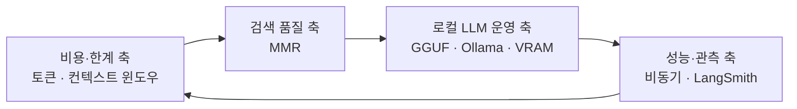
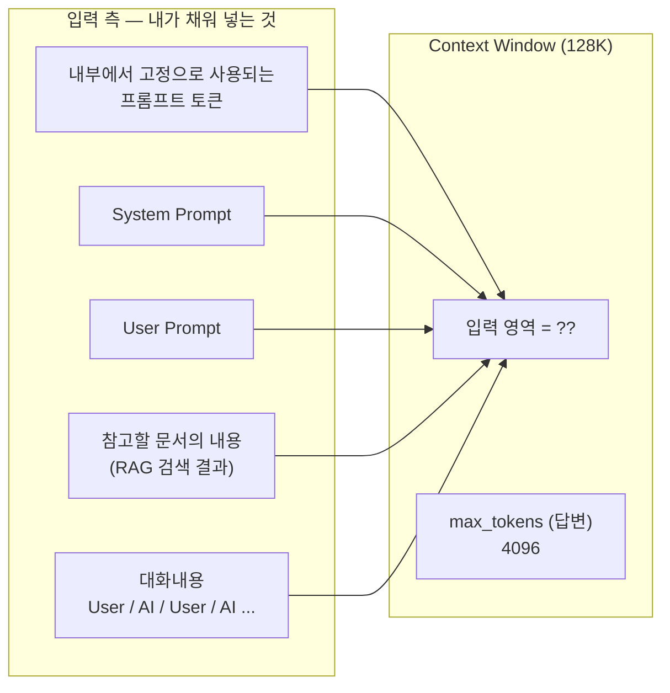
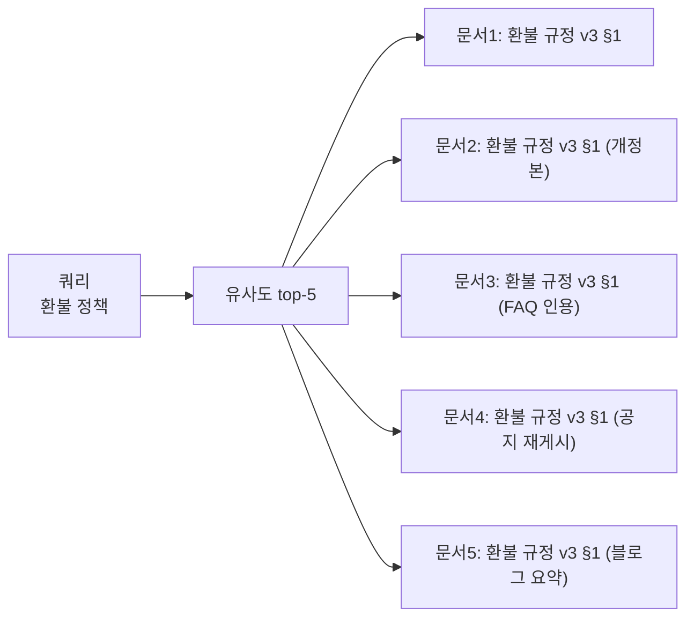
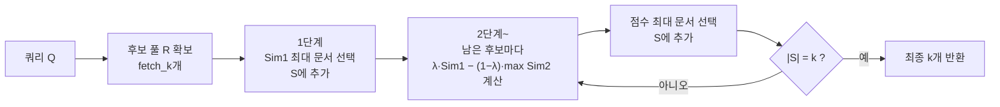
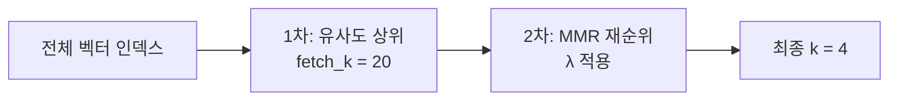

RAG에서 비용이 새는 지점은 대개 둘이다. 대화 히스토리를 자르지 않고 전부 재전송하는 것, 그리고 top-k를 습관적으로 크게 잡는 것. 둘 다 "일단 많이 넣으면 안전하다"는 직관에서 나오는데, 실제로는 비용만 늘고 답변 품질은 오히려 떨어진다.

이 글은 그 직관이 왜 틀렸는지를 토큰 단위에서 설명하고, **적게 넣어야 한다면 무엇을 넣을 것인가**라는 다음 질문까지 이어서 답한다. 토큰과 컨텍스트 윈도우의 구조, 한국어가 비싼 구조적 이유, 컨텍스트를 공유 예산으로 보는 관점, 그리고 중복 문서를 걷어내는 MMR 알고리즘을 다룬다.

## 용어 정리

| 용어 | 원어 | 뜻 |
|---|---|---|
| 토큰 | Token | LLM이 텍스트를 처리하는 최소 단위. **과금 단위이자 한계 단위** |
| 토큰화 | Tokenization | 텍스트를 토큰으로 쪼개는 과정. 토크나이저에 따라 토큰 수가 2배 이상 차이 난다 |
| BPE | Byte Pair Encoding | 자주 등장하는 문자 쌍을 반복 병합해 서브워드 사전을 만드는 알고리즘. 현대 LLM 토크나이저의 표준 |
| 서브워드 | Subword | 단어보다 작은 단위. `unhappiness` → `un` + `happiness` |
| 컨텍스트 윈도우 | Context Window | 모델이 **한 번에** 처리할 수 있는 최대 입력+출력 토큰 수 |
| max_tokens | — | 모델이 **답변으로** 생성할 수 있는 최대 출력 토큰 수 |
| 입력 토큰 | Input / Prompt Token | 모델에 밀어넣는 토큰. RAG는 여기가 폭증하는 구조 |
| 출력 토큰 | Output / Completion Token | 모델이 생성한 토큰. 단가가 입력의 **3배** |
| MMR | Max Marginal Relevance | 관련성과 다양성을 동시에 고려해 결과를 고르는 알고리즘 |
| λ (lambda_mult) | Lambda Multiplier | MMR에서 관련성 대 다양성의 균형 계수 (0~1) |
| fetch_k | — | MMR이 후보로 먼저 끌어올 문서 수 |

## 네 개 축이 서로를 물고 있다

RAG 운영의 핵심 개념은 독립된 주제가 아니라 하나의 순환이다.



| 축 | 던지는 질문 | 다음 축으로 넘기는 것 |
|---|---|---|
| 비용·한계 | 문서를 몇 개나 넣을 수 있고, 넣으면 얼마인가 | "적게 넣어야 한다"는 압력 |
| 검색 품질 | 적게 넣을 거라면 **어떤** 문서를 넣어야 하나 | 중복 제거로 확보한 토큰 여유 |
| 로컬 LLM 운영 | 토큰당 과금 자체를 없앨 수는 없나 | 고정비 전환 · 데이터 반출 통제 |
| 성능·관측 | 무엇이 느리고 무엇이 비싼지 어떻게 아나 | 측정값 → 다시 비용 최적화 |

이 글은 앞의 두 축을 다룬다. 나머지 두 축은 [로컬 LLM 운영](/blog/rag/local-llm-serving/)과 [비동기와 트레이싱](/blog/rag/rag-observability/)에서 이어진다.

## 토큰 — 과금 단위이자 한계 단위

토큰은 LLM이 텍스트를 이해·처리하기 위해 분할한 최소 단위이고, 나누는 과정을 **토큰화**라고 한다. 방식은 셋으로 나뉜다.

| 방식 | 설명 | 예시 | 토큰 수 | 특징 |
|---|---|---|---|---|
| **문자 기반** | 문자 단위로 분할 | `"Hello"` → `["H","e","l","l","o"]` | 많음 | 사전 불필요, 시퀀스가 길어져 비효율 |
| **단어 기반** | 단어 단위로 분할 | `"Hello, world!"` → `["Hello",",","world","!"]` | 적음 | 미등록 단어(OOV) 처리 불가, 사전 폭발 |
| **서브워드 기반** | 자주 쓰이는 서브워드 기준 분할 | `"unhappiness"` → `["un","happiness"]` | 중간 | **현대 LLM의 표준.** OOV 없음 + 시퀀스 짧음 |

서브워드 방식의 대표 알고리즘이 **BPE**다. 자주 등장하는 문자 쌍을 반복적으로 병합해 서브워드 사전을 구성한다. `"Machine learning"`이 `["Ma","chine","learn","ing"]`으로 쪼개지는 식이다.

토큰이 중요한 이유는 둘이다. 하나는 **문맥 이해** — 토큰화 결과에 따라 모델이 의미를 파악하는 정확도가 달라진다. 다른 하나는 더 직접적이다. **토큰 사용량이 곧 비용이다.**

### 한국어는 왜 더 비싼가

동일한 4턴 대화를 모델별·언어별로 측정한 결과다. 측정 대상은 시스템 프롬프트 1개와 인사말 수준의 사용자·어시스턴트 발화 각 1개다.

| 모델 | 토크나이저 | 한국어 토큰 | 영어 토큰 | 한/영 배율 |
|---|---|---|---|---|
| `gpt-3.5-turbo` | cl100k_base | **73** | **49** | 1.49배 |
| `gpt-4-1106-preview` | cl100k_base | **132** | **108** | 1.22배 |
| `gpt-4o` | o200k_base | **53** | **45** | 1.18배 |

> **행 간 비교는 하지 말 것.** `gpt-3.5-turbo` 73 → `gpt-4-1106-preview` 132로 뛴 것은 후자가 한국어를 더 비싸게 처리해서가 아니다. 토큰 ID 열을 보면 후자는 `<|im_start|>`가 `27, 91, 318, 5011, 91, 29`처럼 **문자 단위로 쪼개져** 있다. 측정 도구가 해당 템플릿의 특수토큰을 단일 토큰으로 인식하지 못한 결과다. 의미 있는 비교는 **같은 행 안의 한/영 배율**과 동일 토크나이저 계열 간 비교뿐이다.

여기서 나오는 결론은 둘이다.

| 결론 | 근거 | 실무 함의 |
|---|---|---|
| **한국어는 영어보다 토큰을 더 먹는다** | 모든 행에서 한국어 > 영어 (1.18~1.49배) | 같은 내용이면 한국어 프롬프트가 더 비싸다. 시스템 프롬프트를 영어로 쓰는 관행의 근거 |
| **토크나이저 세대 교체가 한국어 비용을 크게 줄였다** | `o200k_base` 53 vs `cl100k_base` 73 | 한국어 서비스는 모델 교체만으로 토큰 수가 줄어든다. 단가 비교 시 **토큰 수 변화까지 함께** 봐야 한다 |

원인은 언어의 난이도가 아니라 토크나이저다. BPE 사전이 영어 코퍼스 중심으로 학습됐기 때문에 한국어가 더 잘게 쪼개진다.

### 컨텍스트 윈도우와 max_tokens는 다르다

| 항목 | Context Window | max_tokens |
|---|---|---|
| 정의 | 한 번에 처리 가능한 **최대 입출력 토큰 수** | 답변으로 생성 가능한 **최대 출력 토큰 수** |
| 성격 | 모델의 **하드 스펙**. 바꿀 수 없음 | 호출 시 지정하는 **파라미터** |
| 포함 범위 | 입력 + 출력 전체 | 출력만 |
| 위반 시 | 요청 자체가 에러 | 답변이 중간에 잘림 |
| 제약 관계 | — | **컨텍스트 윈도우를 초과할 수 없음** |

| 모델 | Context Length |
|---|---|
| GPT-3.5 | 약 16K 토큰 |
| GPT-4 (기본) | 8,192 토큰 |
| GPT-4 (확장) | 최대 32,768 토큰 |
| GPT-4 Turbo 계열 | **128,000 토큰** |

> **비대칭에 주의한다.** 컨텍스트가 128,000 토큰이어도 **출력은 최대 4,096 토큰**인 모델이 있다. "128K 모델"이라고 해서 128K짜리 답변이 나오지 않는다. 입력은 128K까지 받되 답변은 4K가 상한이다. 긴 문서 요약·번역을 설계할 때 이 비대칭을 모르면 "왜 답변이 자꾸 잘리는가"에 답할 수 없다.

### 컨텍스트 윈도우는 공유 예산이다



| 구성요소 | 성격 | 비용 통제 레버 |
|---|---|---|
| 내부 고정 프롬프트 토큰 | 프레임워크가 자동으로 붙임. 눈에 안 보임 | 프레임워크의 기본 프롬프트를 확인·축약 |
| System Prompt | 매 호출마다 반복 전송 | 짧게. 영어로. 프롬프트 캐싱 활용 |
| User Prompt | 사용자 입력 | 통제 불가 |
| **참고 문서 내용** | **RAG에서 가장 크게 부푸는 영역** | **top-k 축소 · 청크 크기 조정 · MMR로 중복 제거** |
| 대화내용 히스토리 | 턴이 쌓일수록 **선형 증가** | 윈도우 버퍼 / 요약 메모리로 절단 |
| max_tokens | 답변 몫으로 **예약**됨 | 필요한 만큼만. 과하게 잡으면 입력 여유가 줄어듦 |

실무에서 비용이 새는 지점이 대개 두 곳이라는 것이 이 표에서 드러난다. **대화 히스토리를 자르지 않고 전부 재전송**하면 10턴째에는 1턴 대비 입력 토큰이 몇 배가 되어 있다. 그리고 **RAG top-k를 습관적으로 크게** 잡으면 k=10과 k=3의 차이가 그대로 매 호출 비용 차이가 된다.

### 단가에서 읽어야 할 것은 숫자가 아니라 패턴

| 모델 | 컨텍스트 | 입력 $/1M | 출력 $/1M | 출력/입력 배율 |
|---|---|---|---|---|
| **GPT-4o** | 128k | **$5** | **$15** | 3배 |
| **GPT-4 Turbo** | 128k | **$10** | **$30** | 3배 |
| **GPT-3.5 Turbo** | 16k | **$0.50** | **$1.50** | 3배 |

| 패턴 | 내용 | 설계 함의 |
|---|---|---|
| **출력이 입력의 3배** | 세 모델 모두 예외 없이 3배 | 답변 길이 제어가 프롬프트 축약보다 비용 효율이 높은 경우가 많다 |
| **세대 교체가 반값** | GPT-4 Turbo $10/$30 → GPT-4o $5/$15 | 성능 동급이면 최신 모델이 싸다. 모델 고정은 비용 부채 |
| **티어 간 10~20배** | GPT-3.5 $0.50 vs GPT-4o $5 | **작업별 모델 라우팅**의 근거. 분류·추출은 저가 모델로 충분 |
| **컨텍스트와 단가는 별개** | GPT-3.5는 16k, 나머지는 128k | 긴 문서 처리는 저가 모델로 내려갈 수 없는 경우가 있다 |

절대 단가는 시간이 지나면 바뀌지만 이 네 패턴은 유지된다. 특히 출력이 입력의 3배라는 구조는 **어디를 먼저 줄일지**의 순서를 정해 준다.

### 토큰 산정 감각

| 기준 | 값 |
|---|---|
| 4,096 토큰 ≈ 한글 | **약 1,350자** (글자 수 기준) |
| 4,096 토큰 ≈ 워드 문서 | **약 3장** (1장당 500자 가정) |

여기서 파생되는 환산표다.

| 대상 | 대략적 토큰 수 | 계산 근거 |
|---|---|---|
| 한글 1자 | 약 3토큰 | 4,096 ÷ 1,350 ≈ 3.03 |
| 한글 A4 1장(약 1,500자) | 약 4,500토큰 | 1,500 × 3 |
| 영어 1단어 | 약 1.3토큰 | 통용 기준 |
| 128K 컨텍스트 = 한글 | 약 42,000자 ≈ **A4 28장** | 128,000 ÷ 3 |

이 환산이 유용한 이유는 **컨텍스트 윈도우와 max_tokens의 비대칭을 한 번에 체감시키기** 때문이다. 128K 컨텍스트에는 한글 A4 28장이 들어가지만, 답변은 4K — A4 한 장이 상한이다. 넓은 입력 윈도우는 여유지 목표가 아니다.

### 비용 절감 레버 8가지

| # | 레버 | 어디에 작용 | 효과 크기 | 트레이드오프 |
|---|---|---|---|---|
| 1 | **작업별 모델 라우팅** | 단가 | 최대 10~20배 | 라우팅 로직 유지보수. 저가 모델 품질 검증 필요 |
| 2 | **출력 길이 제어** | 출력 토큰 | 출력 단가가 3배이므로 체감 큼 | 답변 잘림. 정보 손실 |
| 3 | **top-k 축소 + MMR** | 입력 토큰 | k=10→3이면 문서 영역 70% 감소 | 검색 리콜 하락 위험 → MMR로 완화 |
| 4 | **대화 히스토리 절단·요약** | 입력 토큰 | 장기 세션에서 가장 큼 | 이전 맥락 상실 |
| 5 | **프롬프트 캐싱** | 입력 토큰 | 고정 프롬프트가 클수록 큼 | 프롬프트 앞부분을 안정적으로 유지해야 함 |
| 6 | **시스템 프롬프트 영어화** | 입력 토큰 | 한국어 대비 15~35% | 가독성·유지보수성 저하 |
| 7 | **임베딩 결과 캐싱** | 임베딩 API 호출 | 재색인 비용 제거 | 캐시 무효화 정책 필요 |
| 8 | **로컬 LLM 전환** | 변동비 → 고정비 | 볼륨이 클수록 유리 | 인프라·운영 인력 비용 발생 |

3번이 이 글의 나머지 절반으로 이어진다. **top-k를 줄이려면 남는 자리에 무엇을 넣을지 더 잘 골라야 한다.**

## MMR — 적게 넣는다면 무엇을 넣을 것인가

### 유사도 top-k만 쓰면 생기는 일

벡터 검색은 기본적으로 쿼리와의 유사도 상위 k개를 반환한다. 문제는 **상위 k개가 서로 거의 같은 내용일 수 있다**는 점이다.



이 경우 5개 슬롯을 썼지만 **실제로 전달된 정보는 1개**다. 결과는 셋이다.

| 결과 | 설명 |
|---|---|
| 토큰 낭비 | 같은 내용을 5번 전송하고 5번 과금 |
| 정보 손실 | 환불 **절차**·**예외조항**·**기간** 문서가 밀려남 |
| 답변 품질 저하 | 모델이 부분적 정보만 보고 답변 |

### 발상 — 관련성과 다양성을 함께 본다

레스토랑에서 메뉴를 고르는 상황에 비유하면 이해가 빠르다. 피자를 좋아하지만 피자만 다섯 개 시키고 싶지는 않다. MMR은 **취향(쿼리 관련성)**과 **이미 고른 것과의 차별성(문서 간 다양성)**을 동시에 평가한다.

| 축 | 평가 대상 | 방향 |
|---|---|---|
| **관련성** (Relevance) | 문서 ↔ 쿼리 | 높을수록 선택 |
| **다양성** (Diversity) | 문서 ↔ **이미 선택된 문서들** | 유사할수록 **감점** |

### 수식

```
MMR = arg max      [ λ · Sim1(Di, Q)  −  (1 − λ) · max Sim2(Di, Dj) ]
      Di ∈ R \ S                                    Dj ∈ S
```

| 기호 | 의미 |
|---|---|
| `Di` | 선택 가능한 문서 (후보) |
| `R` | 검색 결과 집합 (후보 풀) |
| `S` | **이미 선택된** 문서 집합 |
| `Q` | 사용자 쿼리 |
| `Sim1` | 문서와 쿼리 사이의 유사성 함수 |
| `Sim2` | 문서 **간** 유사성 함수 |
| `λ` | 관련성과 다양성 사이의 균형 조정 파라미터 |

말로 풀면 이렇다. **쿼리와의 관련성 점수에서, 이미 뽑은 문서들 중 가장 비슷한 것과의 유사도를 벌점으로 뺀다. 그 값이 가장 큰 문서를 다음으로 뽑는다.**

핵심은 `max Sim2` — **평균이 아니라 최댓값**이다. 이미 뽑은 문서 중 **하나라도** 매우 비슷하면 그 순간 벌점이 커진다. 평균을 쓰면 "대부분 다르지만 하나와 완전히 같은" 문서를 걸러내지 못한다.

### 동작 흐름



주목할 점은 **탐욕적(greedy)·순차적** 알고리즘이라는 것이다. 한 번에 k개를 고르는 게 아니라 하나씩 뽑으며, 뽑을 때마다 나머지 후보의 점수가 재계산된다. 그래서 순서 자체가 의미를 갖는다.

### 계산 예시

λ = 0.5, k = 3 조건으로 액션 영화를 고르는 상황이다.

| 후보 | Sim1 | 1회차 점수 | 2회차 max Sim2 | 2회차 점수 | 3회차 max Sim2 | 3회차 점수 |
|---|---|---|---|---|---|---|
| A. 도심 총격 액션 | 0.95 | **0.95 → 선택** | — | — | — | — |
| B. 도심 총격 액션 (속편) | 0.93 | 0.93 | 0.97 (vs A) | 0.5×0.93 − 0.5×0.97 = **−0.02** | 0.97 | −0.02 |
| C. 스파이 액션 | 0.85 | 0.85 | 0.55 (vs A) | 0.5×0.85 − 0.5×0.55 = **0.15** | — | — |
| D. 고대 전쟁 액션 | 0.80 | 0.80 | 0.40 (vs A) | 0.5×0.80 − 0.5×0.40 = **0.20 → 선택** | 0.45 (vs D) | **0.175 → 선택** |
| E. 액션 코미디 | 0.78 | 0.78 | 0.50 (vs A) | 0.14 | 0.60 | 0.09 |

유사도만 썼다면 A → B → C가 되어 A와 B가 사실상 같은 영화였을 것이다. B의 2회차 점수가 **음수**로 떨어지는 것이 MMR의 작동 방식을 그대로 보여준다.

> 위 수치는 알고리즘 동작을 보이기 위해 구성한 설명용 값이다.

### λ 튜닝

| λ 값 | 성격 | 동작 | 적합한 상황 |
|---|---|---|---|
| **1.0** | 순수 관련성 | 벌점 항이 0. 일반 유사도 검색과 동일 | 정답이 한 문서에 확실히 있는 정밀 조회 (사번, 주문번호) |
| **0.7~0.9** | 관련성 우선 | 명백한 중복만 제거 | **RAG 기본 권장 구간.** 사실 조회형 QA |
| **0.5** | 균형 | 관련성과 다양성 동등 가중 | 여러 관점을 모아야 하는 요약·비교 질의 |
| **0.2~0.4** | 다양성 우선 | 관련성이 다소 낮아도 다른 내용을 끌어옴 | 브레인스토밍, 탐색적 리서치, 추천 다양화 |
| **0.0** | 순수 다양성 | 쿼리를 사실상 무시 | 실무 사용 사례 거의 없음 |

LangChain의 `lambda_mult`가 이 λ에 해당하며 기본값은 `0.5`다.

### fetch_k가 k와 같으면 MMR은 꺼진 것과 같다

MMR은 **후보 풀이 넓어야 다양성을 고를 여지**가 생긴다.

| 파라미터 | 의미 | 권장 |
|---|---|---|
| `k` | 최종 반환 문서 수 | 3~5 (컨텍스트 예산에 맞춰) |
| `fetch_k` | MMR이 먼저 끌어올 후보 수 | **k의 4~10배** (기본 20) |
| `lambda_mult` | λ | 0.5 기본 → 사실조회는 0.7~0.9 |



> `fetch_k`를 `k`와 같게 두면 MMR은 사실상 무력화된다. 고를 후보가 없으니 유사도 순서를 거의 그대로 내보낸다. 반대로 `fetch_k`를 과도하게 키우면 문서 간 유사도 계산이 O(fetch_k × k)로 늘어 검색 지연이 증가한다.

```python
retriever = vectorstore.as_retriever(
    search_type="mmr",
    search_kwargs={
        "k": 4,               # 최종 반환 문서 수
        "fetch_k": 20,        # MMR 후보 풀 크기
        "lambda_mult": 0.7,   # 1.0에 가까울수록 관련성 우선
    },
)

docs = retriever.invoke("환불 정책이 어떻게 되나요?")
```

### 언제 MMR을 쓰지 말아야 하나

| 상황 | 이유 | 대안 |
|---|---|---|
| 정확한 단일 사실 조회 | 다양성이 오히려 정답을 밀어냄 | λ=1.0 또는 유사도 검색 |
| 인덱스에 문서가 애초에 적음 | 후보 풀이 좁아 효과 없음 | 유사도 검색 |
| 지연 시간이 극도로 민감 | 문서 간 유사도 계산 오버헤드 | 유사도 검색 + 후처리 중복 제거 |
| 이미 리랭커(Cross-Encoder)를 붙임 | 역할이 부분적으로 겹침 | 리랭커 이후 MMR로 중복만 제거 |

"MMR을 기본으로 켠다"는 선택은 그래서 틀렸다. **질의 유형별로 λ를 다르게 두는 것**이 실제 설계다.

토큰당 과금 자체를 없앨 수는 없는지 — 즉 변동비를 고정비로 바꾸는 선택은 [로컬 LLM 운영](/blog/rag/local-llm-serving/)에서 다룬다.
