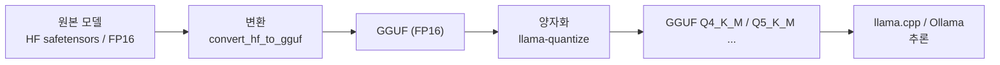
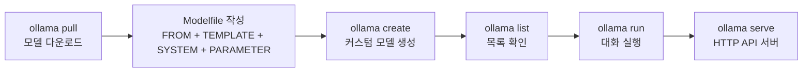

로컬 LLM 도입 논의는 대개 "API보다 싸다"에서 시작하는데, 손익분기 계산에 운영 인건비를 넣는 순간 그 전제가 무너지는 경우가 많다. GPU 하드웨어 비용보다 **이걸 관리할 사람**의 비용이 큰 조직이 흔하기 때문이다.

이 글은 로컬 LLM을 기술이 아니라 **판단 문제**로 다룬다. 어떤 조건에서 로컬이 옳은지에서 시작해, GGUF 파일 형식과 양자화 등급, VRAM 산정 공식, Ollama 운영과 그 보안 함정, 그리고 도입 여부를 가르는 체크리스트까지 이어진다. [토큰 비용 구조](/blog/rag/llm-token-cost/)에서 다룬 변동비 문제의 다른 해법에 해당한다.

## 용어 정리

| 용어 | 원어 | 뜻 |
|---|---|---|
| GGML | GPT-Generated Model Language | 로컬 추론용 텐서 라이브러리 겸 모델 파일 형식. GGUF의 전신 |
| GGUF | GPT-Generated Unified Format | 2023-08-21 도입된 GGML 후속 형식. 로컬 LLM 배포의 사실상 표준 |
| llama.cpp | — | C/C++로 작성된 LLM 추론 엔진. GGUF의 레퍼런스 구현 |
| 양자화 | Quantization | 모델 가중치를 FP16 → 8/5/4bit 등 저정밀도로 압축. **VRAM 요구량을 결정하는 최대 변수** |
| Q4_K_M 등 | — | GGUF 양자화 등급 표기. 숫자=비트수, K=K-quant, S/M/L=블록 크기 |
| VRAM | Video RAM | GPU 전용 메모리. 부족하면 CPU 오프로딩 → 급격한 속도 저하 |
| KV 캐시 | Key-Value Cache | 생성 중 이전 토큰의 어텐션 K/V를 저장하는 버퍼. 컨텍스트 길이에 비례해 증가 |
| Ollama | — | 로컬 LLM을 CLI/HTTP 서버로 구동하는 런타임 |
| Modelfile | — | Ollama에서 베이스 모델·프롬프트 템플릿·파라미터를 정의하는 파일 |

## 왜 로컬 LLM인가

이 판단의 출발점은 기술이 아니라 **비용 구조와 통제권**이다.

| 축 | 클라우드 API | 로컬 LLM | 판단 기준 |
|---|---|---|---|
| **데이터 반출 통제** | 프롬프트가 외부 사업자 서버로 전송됨 | **네트워크 밖으로 한 바이트도 나가지 않음** | 개인정보·의료·금융·계약서·미공개 코드를 다루면 **로컬이 사실상 강제** |
| **과금 구조** | 토큰당 **변동비**. 사용량에 비례해 무한 증가 | GPU 구매/임차 **고정비**. 사용량이 늘어도 추가 과금 없음 | 호출량이 크고 예측 가능하면 로컬이 유리 |
| **모델 수명 통제** | 사업자가 모델을 폐기·변경하면 따라가야 함 | 받아둔 GGUF 파일은 **영구히 동일하게 동작** | 재현성·감사 요건이 있으면 로컬 |
| 지연 시간 | 네트워크 왕복 + 사업자 큐 | 네트워크 홉 없음. 단 하드웨어 성능에 종속 | 대용량 배치는 로컬, 저부하 실시간은 API가 대개 빠름 |
| 품질 | 최상위 모델 접근 가능 | 오픈 모델 한계 | 난이도 높은 추론은 API 우위 |
| 운영 부담 | 없음 | GPU·드라이버·모델 버전·모니터링 전부 자체 부담 | 인력이 없으면 로컬은 함정 |

> **로컬 LLM은 "싸게 하려고" 쓰는 게 아니다.** 데이터를 밖으로 못 내보내거나, 변동비를 고정비로 바꿔야 할 때 쓴다. 이 둘 중 어느 것도 해당하지 않으면 클라우드 API가 거의 항상 옳다.

## GGML에서 GGUF로

GGUF와 GGML은 **추론용 모델을 저장하는 파일 형식**이다.

**GGML**은 머신러닝을 위해 설계된 텐서 라이브러리로, Apple Silicon을 비롯한 다양한 하드웨어에서 대규모 모델을 돌릴 수 있게 했다.

| GGML 장점 | GGML 단점 |
|---|---|
| **초기 혁신** — 로컬 추론용 파일 형식의 초기 시도 | **제한된 유연성** — 모델에 추가 정보를 넣기 어려움 |
| **단일 파일 공유** — 모델을 파일 하나로 배포 | **호환성 문제** — 새 기능 도입 시 이전 모델과 자주 충돌 |
| **CPU 호환성** — CPU에서 실행 가능 | **수동 조정 필요** — `rope-freq-base`, `rope-freq-scale`, `gqa`, `rms-norm-eps` 등을 사용자가 직접 맞춰야 했다 |

**GGUF**는 2023년 8월 21일 GGML의 후속으로 도입됐다. 마지막 단점이 결정적이었다 — 하이퍼파라미터를 손으로 맞추던 문제를 **메타데이터를 파일에 내장**해 없앴다.

| GGUF 장점 | GGUF 단점 |
|---|---|
| **GGML의 한계 해결** — 메타데이터 내장으로 수동 조정 제거 | **전환 시간** — 기존 모델을 GGUF로 전환하는 비용 |
| **확장성** — 이전 모델과의 호환성을 유지하면서 새 기능 추가 | **적응 필요** — 새 형식에 익숙해져야 함 |
| **안정성** — 급작스러운 변경 없이 버전 전환 | — |
| **다목적성** — 특정 모델 계열을 넘어 다양한 모델 지원 | — |



## 양자화 등급 — VRAM을 결정하는 변수

GGUF 파일명의 `Q5_K_M` 같은 접미사가 양자화 등급이다.

| 구성요소 | 의미 |
|---|---|
| `Q4`, `Q5`, `Q8` | 가중치 저장 **비트 수** |
| `_K` | K-quant. 블록 단위로 스케일을 달리 적용하는 개선된 방식 |
| `_S` / `_M` / `_L` | Small / Medium / Large. 같은 비트수 안에서의 품질·용량 변형 |
| `F16` / `F32` | 양자화하지 않은 원본 정밀도 |

7B 파라미터 모델 기준 등급별 비교다.

| 등급 | 비트 | 7B 파일 크기 | 품질 손실 | 용도 |
|---|---|---|---|---|
| `F16` | 16 | 약 13 GB | 없음 (기준선) | 품질 검증용 기준. 실서비스에는 과함 |
| `Q8_0` | 8 | 약 7.2 GB | 거의 없음 | 품질을 최대한 지켜야 하는 경우 |
| `Q6_K` | 6 | 약 5.5 GB | 매우 작음 | 고품질 요구 + VRAM 여유 |
| `Q5_K_M` | 5 | 약 4.8 GB | 작음 | **품질 우선 실무 선택** |
| `Q5_K_S` | 5 | 약 4.7 GB | 작음 | Q5_K_M보다 약간 작고 약간 낮음 |
| `Q4_K_M` | 4 | 약 4.1 GB | 보통 | **가장 널리 쓰이는 기본값.** 품질/용량 균형점 |
| `Q4_K_S` | 4 | 약 3.9 GB | 보통 | VRAM이 빠듯할 때 |
| `Q3_K_M` | 3 | 약 3.3 GB | 큼 | 저사양 강행용 |
| `Q2_K` | 2 | 약 2.8 GB | 매우 큼 | 실용성 낮음. 동작 확인용 |

> **선택 규칙**: **Q4_K_M부터 시작**하고, 품질이 부족하면 Q5_K_M으로, VRAM이 부족하면 Q4_K_S로 이동한다. Q3 이하는 품질 저하가 체감될 정도라 프로덕션 후보가 되기 어렵다.
>
> 위 크기·품질 값은 GGUF 생태계의 통용 기준이다.

"양자화하면 성능은 그대로"라는 인식은 틀렸다. **손실은 분명히 있고**, Q4_K_M이 실무에서 합의된 균형점이라는 것이 정확한 표현이다.

## Ollama 운영

**Ollama**는 로컬 LLM을 CLI와 HTTP 서버로 구동하는 런타임이다. 로컬 LLM 실행에서 `docker run`에 해당하는 위치를 차지한다.



| 명령 | 역할 |
|---|---|
| `ollama pull <model>` | 레지스트리에서 모델 다운로드 |
| `ollama create <name> -f Modelfile` | Modelfile로부터 커스텀 모델 생성 |
| `ollama list` | 보유 모델 목록 확인 |
| `ollama run <name>` | 대화형 실행 |
| `ollama serve` | HTTP API 서버 기동 |

한국어 특화 오픈 모델로는 `yanolja/EEVE-Korean-Instruct-10.8B-v1.0` 계열이 쓰인다. 원본 가중치는 HuggingFace에 safetensors로 올라오고, 커뮤니티가 이를 GGUF로 변환해 배포하는 것이 일반적인 유통 경로다.

### Modelfile — 로컬 LLM의 Dockerfile

```
FROM ggml-model-Q5_K_M.gguf

TEMPLATE """{{- if .System }}
<s>{{ .System }}</s>
{{- end }}
<s>Human:
{{ .Prompt }}</s>
<s>Assistant:
"""

SYSTEM """A chat between a curious user and an artificial 
intelligence assistant. The assistant gives helpful, 
detailed, and polite answers to the user's questions."""

PARAMETER stop <s>
PARAMETER stop </s>
```

| 지시어 | 역할 | 주의점 |
|---|---|---|
| `FROM` | 베이스가 될 GGUF 파일 또는 기존 모델 | 로컬 경로 또는 레지스트리 이름 |
| `TEMPLATE` | 프롬프트 조립 형식. Go 템플릿 문법 | **모델이 학습된 형식과 정확히 일치해야 한다.** 틀리면 품질이 급락 |
| `SYSTEM` | 기본 시스템 프롬프트 | 매 호출에 포함되므로 로컬에서도 컨텍스트를 잡아먹는다 |
| `PARAMETER stop` | 생성 중단 토큰 | 지정하지 않으면 모델이 대화를 혼자 이어간다 |

`TEMPLATE`이 조용한 실패 지점이다. 형식이 어긋나도 에러가 나지 않고 **품질만 떨어지기 때문에** 모델이 나쁘다고 오진하기 쉽다.

### 엔드포인트 노출 — 통제 목적을 스스로 무너뜨리는 지점

```bash
OLLAMA_MODELS=~/.ollama/models OLLAMA_HOST=127.0.0.1:11434 ollama serve
```

| 환경변수 | 역할 |
|---|---|
| `OLLAMA_MODELS` | 모델 파일 저장 경로. 모델이 수십 GB라 별도 볼륨으로 빼는 경우가 많다 |
| `OLLAMA_HOST` | 바인딩 주소·포트. **기본 11434** |

> `OLLAMA_HOST`를 `0.0.0.0`으로 열면 인증 없이 사내 누구나 호출할 수 있는 LLM 엔드포인트가 된다.
>
> 로컬 LLM을 도입한 이유가 "데이터 반출 통제"인데 엔드포인트를 무인증으로 열면 **통제 목적 자체가 무너진다.** 리버스 프록시 + 인증 + 호출 로깅을 반드시 앞단에 둔다.

## VRAM 산정

```
가중치 VRAM (GB) ≈ 파라미터 수(B) × (양자화 비트 ÷ 8)

KV 캐시 VRAM (GB) ≈ 2 × 레이어 수 × 히든 차원 × 컨텍스트 길이 × 배치 × 정밀도 바이트 ÷ 1024^3

총 VRAM ≈ (가중치 + KV 캐시) × 1.1 ~ 1.2   ← 활성화·프레임워크 오버헤드
```

실무에서는 간이식으로 충분하다.

```
총 VRAM (GB) ≈ 파라미터 수(B) × 비트수 ÷ 8 × 1.2 + 컨텍스트 여유분
```

KV 캐시가 산정에서 자주 누락되는 항목이다. **컨텍스트 길이에 비례해 선형으로 늘기 때문에**, 4K로 계산해 두고 32K를 밀어넣으면 예산이 어긋난다.

### 모델 크기별 필요 GPU

`Q4_K_M`(4bit) 기준, 컨텍스트 4K 가정이다.

| 모델 규모 | 가중치(4bit) | 오버헤드 포함 | 필요 VRAM | 대표 GPU |
|---|---|---|---|---|
| **3B** | 약 1.7 GB | ×1.2 | 약 2~3 GB | 내장 그래픽·저가 GPU도 가능 |
| **7~8B** | 약 4.0 GB | ×1.2 | **약 6~8 GB** | RTX 3060 12GB, RTX 4060 Ti |
| **10.8B** | 약 6.2 GB | ×1.2 | **약 8~10 GB** | RTX 3080 10GB, RTX 4070 |
| **13B** | 약 7.4 GB | ×1.2 | 약 10~12 GB | RTX 3080 Ti, RTX 4070 Ti |
| **34B** | 약 19 GB | ×1.2 | 약 24 GB | RTX 3090 / 4090 (24GB) |
| **70B** | 약 40 GB | ×1.2 | **약 48 GB** | A6000 48GB, 또는 4090 ×2 |

같은 7B 모델에서 양자화 등급만 바꿨을 때의 변화다.

| 등급 | 가중치 | 총 VRAM(추정) | 8GB GPU | 12GB GPU | 24GB GPU |
|---|---|---|---|---|---|
| F16 | 13 GB | 약 16 GB | 불가 | 불가 | 가능 |
| Q8_0 | 7.2 GB | 약 9 GB | 불가 | 가능 | 가능 |
| Q5_K_M | 4.8 GB | 약 6 GB | 가능 | 가능 | 가능 |
| Q4_K_M | 4.1 GB | 약 5 GB | 가능 | 가능 | 가능 |

> **VRAM이 부족하면 어떻게 되나.** llama.cpp와 Ollama는 일부 레이어를 CPU로 오프로딩한다. 동작은 하지만 **토큰 생성 속도가 수 배에서 수십 배 느려진다.**
>
> 따라서 "돌아간다"와 "쓸 만하다"는 다르다. 용량을 산정할 때는 **전 레이어가 GPU에 올라가는 조건**을 목표로 잡아야 한다. "GPU가 작아서 못 돌린다"가 아니라 "돌아가지만 실용 속도가 안 나온다"가 정확한 진단이다.

## 도입 판단 체크리스트

| # | 판단 항목 | "로컬" 신호 | "API" 신호 |
|---|---|---|---|
| 1 | 다루는 데이터의 민감도 | 개인정보·의료·금융·계약서·미공개 소스코드 | 공개 정보, 사내 일반 문서 |
| 2 | 규제·계약상 반출 제한 | 있음 (망분리, DPA 불가) | 없음 |
| 3 | 월간 호출량 | 크고 **예측 가능** | 작거나 변동 폭이 큼 |
| 4 | 요구 품질 | 정형 작업(분류·추출·요약) | 복잡한 추론·코드 생성 |
| 5 | 지연 요구 | 배치 처리 | 대화형 실시간 |
| 6 | 운영 인력 | GPU·MLOps 담당자 있음 | 없음 |
| 7 | 재현성 요건 | 모델 버전 고정 필요 | 최신 모델 추종이 유리 |

손익분기 계산은 이렇게 세운다.

```
API 월 비용 = (월 입력토큰 ÷ 1M × 입력단가) + (월 출력토큰 ÷ 1M × 출력단가)

로컬 월 비용 = GPU 감가상각(또는 임차료) + 전력비 + 운영 인건비 안분

→ API 월 비용이 로컬 월 비용을 안정적으로 넘어서는 시점이 전환점
```

> **가장 흔한 계산 오류는 운영 인건비 누락이다.** 이 항을 빼면 로컬이 항상 이기는 것처럼 보인다.
>
> 실제로는 GPU 하드웨어 비용보다 "이걸 관리할 사람"의 비용이 큰 경우가 많다. 그래서 조직 규모가 작을수록, 1·2번 항목(데이터 반출 제한)이 없으면 API가 합리적이라는 결론이 나온다.

로컬로 전환하든 API를 유지하든, 무엇이 느리고 무엇이 비싼지 알아야 판단이 성립한다. 그 측정 방법은 [비동기와 트레이싱](/blog/rag/rag-observability/)에서 다룬다.
