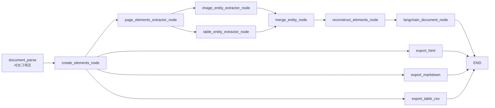
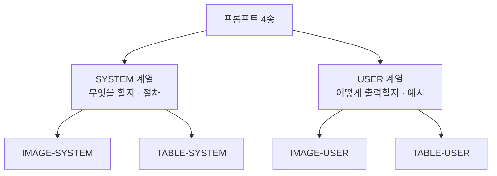

RAG 답변 품질이 떨어질 때 대부분의 팀이 프롬프트와 모델부터 확인한다. 순서가 거꾸로다. **파싱 산출물을 열어 표가 깨져 있으면 뒤 단계는 볼 필요가 없다.**

이 글은 파싱 시리즈를 닫으면서 두 가지를 다룬다. 하나는 표와 이미지에서 검색 가능한 텍스트를 만들어 내는 **프롬프트 4종의 설계 의도** — XML 태그를 쓰는 이유, 가상질문이 검색 적중률을 올리는 원리, 수치 강조를 두 곳에 반복해 넣는 이유다. 다른 하나는 **품질이 의심될 때의 진단 순서와 체크리스트**다. 앞 편들은 [파싱의 병목](/blog/rag/document-parsing-bottleneck/)부터 [노드 파이프라인](/blog/rag/layoutparse-nodes/)까지 이어진다.

## 용어 정리

| 용어 | 풀이 |
|---|---|
| **hypothetical questions** | "이 표를 보고 물어볼 법한 질문"을 미리 만들어 저장하는 기법. 원리는 [2편](/blog/rag/layout-parser-pipeline/) 참조 |
| **One-shot 예시** | 프롬프트에 완성된 출력 예시를 1개 넣어 형식 준수율을 높이는 기법 |
| **SYSTEM / USER 분리** | 변하지 않는 역할·절차와 문서마다 변하는 형식·문맥을 나눠 두는 프롬프트 구성 |
| **서브그래프 합성** | 컴파일된 그래프를 상위 그래프의 노드로 삽입하는 것 |
| **`entity`** | 그림·표에서 뽑아낸 제목·상세·개체명·가상질문 묶음. 검색 대상 텍스트가 된다 |

## 산출물 규약

Export 노드 넷은 같은 파싱 결과를 네 가지 형태로 떨어뜨린다.

| Export | 출력 경로 | 파일명 규칙 |
|---|---|---|
| `ExportImage` | `<dir>/images/<category>/` | `<BASENAME>_<CATEGORY>_Page_<page+1>_Index_<id>.png` |
| `ExportHTML` | `<dir>/<basename>.html` | 이미지는 base64로 **HTML에 인라인 삽입** |
| `ExportMarkdown` | `<dir>/<basename>.md` | 이미지는 **로컬 파일 경로 참조** |
| `ExportTableCSV` | `<dir>/tables/` | `<BASENAME>_TABLE_Page_<page>_Index_<id>.csv` |

```python
def _add_base64_src_to_html(self, html, base64_encoding):
    """HTML img 태그에 base64 src를 주입"""
    if not base64_encoding:
        return html

    pattern = r"]*)>"
    replacement = f''
    return re.sub(pattern, replacement, html)
```

> **HTML은 인라인, 마크다운은 경로 참조로 나눈 이유**: HTML은 **단일 파일로 공유**하는 용도라 브라우저에서 바로 열려야 하고, 마크다운은 **편집·버전관리** 용도라 base64가 들어가면 diff가 폭발한다.
>
> 같은 데이터라도 사용 시나리오가 다르면 표현을 달리한다는 판단이다.

CSV는 HTML 표를 pandas로 파싱한다.

```python
for elem in state["elements_from_parser"]:
    if elem["category"] == "table":
        soup = BeautifulSoup(elem["content"]["html"], "html.parser")

        # 불규칙한 문자 정리
        for td in soup.find_all("td"):
            td.string = td.get_text(strip=True).replace("\\t", " ").replace("\t", " ")

        cleaned_html_io = StringIO(str(soup))

        try:
            parsed_tables = pd.read_html(cleaned_html_io)
            for table in parsed_tables:
                csv_filename = (
                    f"{base_without_ext.upper()}_TABLE_"
                    f"Page_{elem['page']}_Index_{elem['id']}.csv"
                )
                csv_filepath = os.path.join(table_dir, csv_filename)
                absolute_path = os.path.abspath(csv_filepath)

                table.to_csv(absolute_path, index=False, encoding="utf-8-sig")
                elem["csv_filepath"] = absolute_path
        except Exception as e:
            self.log(f"테이블 파싱 중 오류 발생: {str(e)}")
            continue
```

| 처리 | 이유 |
|---|---|
| `td` 내부 탭 문자 치환 | 탭이 남으면 CSV 컬럼이 어긋난다 |
| `encoding="utf-8-sig"` | BOM 포함 → **Excel에서 한글이 깨지지 않는다** |
| `try/except` + `continue` | 표 1개 실패가 전체 파이프라인을 죽이지 않게 격리 |

## 전체 그래프 조립 — 그래프를 노드로 꽂는다



```python
def create_document_parse_graph():
    # 1단계 그래프: 파싱 루프
    split_pdf_node = SplitPDFFilesNode(batch_size=30, test_page=None, verbose=True)
    document_parse_node = DocumentParseNode(
        api_key=os.environ["UPSTAGE_API_KEY"], verbose=True
    )
    post_document_parse_node = PostDocumentParseNode(verbose=True)
    working_queue_node = WorkingQueueNode(verbose=True)

    workflow = StateGraph(ParseState)
    workflow.add_node("split_pdf_node", split_pdf_node)
    workflow.add_node("document_parse_node", document_parse_node)
    workflow.add_node("post_document_parse_node", post_document_parse_node)
    workflow.add_node("working_queue_node", working_queue_node)

    workflow.add_edge("split_pdf_node", "working_queue_node")
    workflow.add_conditional_edges(
        "working_queue_node",
        continue_parse,
        {True: "document_parse_node", False: "post_document_parse_node"},
    )
    workflow.add_edge("document_parse_node", "working_queue_node")
    workflow.set_entry_point("split_pdf_node")
    parser_graph = workflow.compile()

    # 2단계 그래프: 후처리 — 1단계 그래프를 하나의 노드로 삽입한다
    post_process_workflow = StateGraph(ParseState)
    post_process_workflow.add_node("document_parse", parser_graph)   # 서브그래프
    post_process_workflow.add_node(
        "create_elements_node", CreateElementsNode(verbose=True)
    )
    # ... 나머지 노드 추가 ...
    langchain_document_node = LangChainDocumentNode(
        verbose=True,
        splitter=RecursiveCharacterTextSplitter(chunk_size=1000, chunk_overlap=0),
    )

    post_process_workflow.set_entry_point("document_parse")

    memory = MemorySaver()
    return post_process_workflow.compile(checkpointer=memory)
```

> **`add_node("document_parse", parser_graph)` 한 줄이 핵심이다.** 컴파일된 그래프를 노드로 넣는다.
>
> 파싱 루프 전체가 하나의 블랙박스 노드가 되어 후처리 그래프에 꽂힌다. 파싱 로직을 바꿔도 후처리 그래프는 영향받지 않고, 후처리를 재배선해도 파싱 루프는 그대로다. **모듈 경계가 그래프 경계와 일치**하는 구조다.

### 사용법

```python
import uuid
from langchain_core.runnables import RunnableConfig

# batch_size: 한 번에 처리할 페이지 수
# test_page: 테스트할 페이지 번호 (None이면 전체)
parser_graph = create_upstage_parser_graph(
    batch_size=30, test_page=None, verbose=True
)

config = RunnableConfig(
    recursion_limit=300,
    configurable={"thread_id": str(uuid.uuid4())},
)

inputs = {"filepath": "data/report.pdf"}
parser_graph.invoke(inputs, config=config)

# 추출된 요소 확인
elements = parser_graph.get_state(config).values["elements_from_parser"]
```

`ParseState`를 직접 만들어 해설 언어를 지정할 수도 있다.

```python
inputs = ParseState(
    filepath="data/report.pdf",
    language="English",   # VLM 해설 출력 언어
)
```

결과는 pickle로 저장해 재사용한다.

```python
def save_documents_to_pkl(documents, filepath):
    abs_path = os.path.abspath(filepath)
    base_path = os.path.splitext(abs_path)[0]
    with open(f"{base_path}.pkl", "wb") as f:
        pickle.dump(documents, f)


def load_documents_from_pkl(filepath):
    abs_path = os.path.abspath(filepath)
    base_path = os.path.splitext(abs_path)[0]
    with open(f"{base_path}.pkl", "rb") as f:
        return pickle.load(f)
```

> **왜 캐시하는가**: 파싱은 비싸고 느리다(API 비용 + VLM 비용 + 수 분). 청킹 전략이나 임베딩 모델을 바꿔 실험할 때마다 재파싱하면 비용이 배로 든다.
>
> **파싱 결과를 고정하고 이후 단계만 반복 실험하는 것**이 표준 작업 방식이다. 이 캐시 하나가 실험 비용을 한 자릿수로 떨어뜨린다.

## 프롬프트 4종의 설계



| 파일 | 역할 | 변수 |
|---|---|---|
| `IMAGE-SYSTEM-PROMPT.yaml` | 이미지 분석 절차 5단계 정의 | 없음 |
| `IMAGE-USER-PROMPT.yaml` | 출력 태그 구조·예시·주의사항 | `{language}`, `{context}` |
| `TABLE-SYSTEM-PROMPT.yaml` | 표 분석 절차 5단계 (수치 강조 추가) | 없음 |
| `TABLE-USER-PROMPT.yaml` | 표 출력 태그 구조·예시 | `{language}`, `{context}` |

### SYSTEM — 절차를 고정한다

```yaml
_type: "prompt"
template: |
  Extract key information and insights from an image based on the provided context.

  Given the context related to the image, analyze and interpret the image to generate a structured output that includes a title, key details, entities, and hypothetical questions.

  # Steps

  1. **Analyze the Context**: Understand the context provided in relation to the image.
  2. **Title Generation**: Create a concise and descriptive title.
  3. **Details Extraction**: Identify and articulate key insights and details visible in the image.
  4. **Entity Identification**: Recognize and list significant entities or objects.
  5. **Hypothetical Questions**: Formulate relevant hypothetical questions that arise from the content.
```

표 전용 SYSTEM은 세 번째 단계에 한 문장이 더 붙는다 — `Be sure to include numerical values.` **표는 숫자가 본체**이므로 이미지보다 강한 지시가 필요하다.

### USER — 형식과 예시를 준다

```yaml
_type: "prompt"
template: |
  # Output Format

  - The output should be structured using the following tags:
    - `<image>`: Wrap the entire output.
    - `<title>`: Enclose the generated title.
    - `<details>`: Include detailed insights extracted from the image.
    - `<entities>`: List the identified entities.
    - `<hypothetical_questions>`: Present the formulated hypothetical questions.
  - The output must be written in {language}.

  # Example

  **Input**:
  Here is the context related to the image:
  {context}

  **Output**:
  <image>
  <title>
  The Rise of Artificial Intelligence in Modern Technology
  </title>
  <details>
  The image depicts the integration of AI in various technological devices,
  highlighting advancements in automation and data processing.
  </details>
  <entities>
  AI algorithms, robotics, smart devices
  </entities>
  <hypothetical_questions>
  - How will AI continue to evolve in the next decade?
  - What are the ethical implications of AI in everyday life?
  </hypothetical_questions>
  </image>

  # Notes

  - Use the provided context to inform and enhance the extraction process.
  - Ensure that the hypothetical questions are thought-provoking and relevant.
  - Be sure to include numerical values, proper nouns, terms, and terminologies.
input_variables: ["language", "context"]
```

표 전용 USER는 태그가 `<table>`로 바뀌고 예시가 재무 표로 교체될 뿐 구조가 같다.

### 각 설계 요소가 무엇을 막는가

| 설계 요소 | 의도 |
|---|---|
| **SYSTEM/USER 분리** | SYSTEM은 역할·절차(변하지 않음), USER는 출력 형식·문맥(문서마다 변함). 캐싱과 재사용에 유리 |
| **5단계 Steps 명시** | 문맥 이해 → 제목 → 상세 → 엔티티 → 질문 순으로 사고하도록 강제. Chain-of-Thought의 구조화 버전 |
| **XML 태그 출력** | 마크다운보다 파싱이 안정적이고, **표 내용에 파이프 문자가 있어도 충돌하지 않는다** |
| **One-shot 예시** | 태그 구조를 말로만 설명하면 모델이 변형한다. 완성 예시 1개가 형식 준수율을 크게 올린다 |
| **`{language}` 변수화** | 한국어 문서는 한국어 해설. **문서 언어와 임베딩 언어를 일치**시킨다 |
| **`{context}` 주입** | 잘라낸 이미지만으로는 무슨 표인지 모른다. 같은 페이지 텍스트가 제목·의미를 부여한다 |
| **`hypothetical_questions`** | **검색 적중률 장치.** 사용자 질문과 저장된 가상질문이 직접 매칭된다 |
| **`numerical values` 반복** | SYSTEM(표 전용)과 USER Notes 양쪽에 넣었다. 요약 과정의 숫자 증발이 가장 치명적이기 때문 |
| **`proper nouns, terms`** | 고유명사·전문용어는 검색 키워드 그 자체. 일반화하면 검색이 불가능해진다 |

가상질문이 가장 반직관적인 장치다. 질문과 문서를 비교하는 것보다 **질문과 질문을 비교하는 쪽이 유사도가 높기 때문에**, "이 표를 보고 물어볼 법한 질문"을 미리 만들어 저장해 두면 실제 사용자 질문과 직접 매칭된다.

### 세대 간 변화

| 항목 | 3세대 (코드 내장 f-string) | 4세대 (YAML 외부화) |
|---|---|---|
| 태그 | `<summary>` `<entities>` `<data_insights>` | `<details>` `<entities>` `<hypothetical_questions>` |
| 가상질문 | SYSTEM에 "provide five hypothetical questions" | **별도 태그로 승격** |
| 언어 지정 | user prompt 끝에 한 줄 | Output Format 규칙에 명시 |
| 예시 | 없음 (태그 골격만) | One-shot 완성 예시 포함 |
| 관리 | 코드 수정 필요 | YAML 편집만으로 변경 |

프롬프트 엔지니어링이라기보다 **인터페이스 설계**에 가깝다. 프롬프트를 코드에서 분리하고, 출력 형식을 태그로 고정하고, 예시를 하나 넣는 것 — 셋 다 "출력이 예측 가능해야 후속 시스템이 소비할 수 있다"는 같은 요구에서 나온다.

## 품질이 의심될 때의 진단 순서


**순서가 전부다.** 대부분의 팀이 4번부터 시작해 시간을 쓴다. 1번에서 표가 깨져 있으면 2~4번은 볼 필요가 없다. 파싱 단계에서 사라진 정보는 뒤에서 복구되지 않기 때문이다.

### 체크리스트

| 구분 | 점검 항목 | 실패 시 증상 |
|---|---|---|
| 파싱 | header/footer/footnote가 제거되었는가 | 청크에 회사명·페이지번호 반복 |
| 파싱 | 표가 마크다운 구조로 남아 있는가 | 숫자만 나열된 텍스트 |
| 파싱 | 그림·차트에 해설 텍스트가 붙었는가 | "자료에 없음" 응답 다발 |
| 파싱 | 페이지 번호가 전역 기준으로 복원됐는가 | 출처 인용이 엉뚱한 페이지 |
| 파싱 | 수식이 마크다운으로 보존됐는가 | 기호 깨짐 |
| 청킹 | 표가 청크 경계에서 잘리지 않았는가 | 표 절반만 검색됨 |
| 검색 | 표에 대해 서술문 Document가 별도로 있는가 | 표 관련 질문 재현율 저하 |
| 비용 | 파싱 결과가 캐시되어 있는가 | 실험할 때마다 API 재과금 |
| 운영 | 배치 실패가 격리되는가 | 1페이지 실패로 전체 재시작 |
| 운영 | 로그로 단계별 소요시간이 보이는가 | 병목 지점 파악 불가 |

파싱 단계의 정량 지표는 셋으로 잡는다. **header/footer 제거율**, **표 element 대비 마크다운 변환 성공률**, **그림 대비 해설 생성률**이다. 검색 단계에서는 정답 청크가 top-k에 들어오는 재현율을 먼저 보고 그다음 정밀도를 본다.

### 실무 이식 시 손볼 지점

| # | 지점 | 문제 | 개선 |
|---|---|---|---|
| 1 | `MergeEntityNode` 이중 루프 | O(n·m) | `id` 딕셔너리 인덱싱 |
| 2 | `DocumentParseNode` 파일 핸들 | `open()` 후 미close | `with` 구문 |
| 3 | 재시도 없음 | API 일시 실패 시 전체 중단 | 지수 백오프 재시도 |
| 4 | `total_cost` 상수 하드코딩 | 단가 변경 시 코드 수정 | 설정 외부화 |
| 5 | 분할 PDF 파일 미삭제 | 디스크 누적 | 임시 디렉터리 + 정리 노드 |
| 6 | `pickle` 사용 | 역직렬화 보안 위험 | 신뢰 경계 밖에서는 JSON |
| 7 | 프롬프트 경로가 상대경로 | 실행 위치 의존 | 패키지 리소스 경로 |

이 목록이 학습용 코드와 운영 코드의 거리다. 6번은 특히 주의할 항목으로, **신뢰할 수 없는 출처의 pickle을 역직렬화하면 임의 코드가 실행된다.** 내부 캐시 용도를 벗어나 파일이 외부에서 들어올 수 있다면 JSON으로 바꿔야 한다.

파이프라인은 여기서 닫힌다. 다시 요약하면, 파싱은 **유형별로 다르게 처리하고**, **그림을 버리지 않고 텍스트로 번역하며**, **노이즈는 의도적으로 버리는** 세 가지 판단의 반복이다. 그리고 그 판단이 옳았는지는 검색 재현율로만 확인된다.

파싱과 검증에서 반복해 나오는 질문들은 [RAG 품질 Q&A](/blog/rag/rag-qna-quality/)에 문답으로 모았다.
