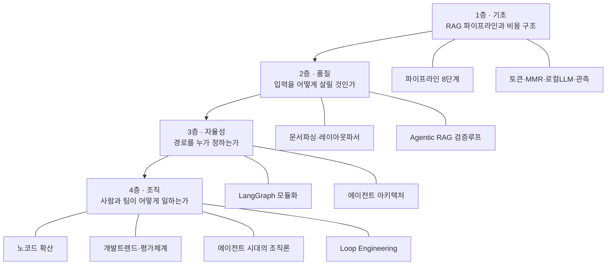
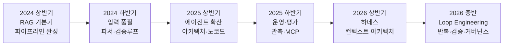

RAG를 공부하다 보면 자료가 층위 없이 쏟아진다. 청크 크기를 정하는 이야기와 조직에 AI를 확산시키는 이야기가 같은 무게로 나열되는데, 이 둘은 답해야 할 질문의 종류가 다르다.

이 글은 그 지형을 두 축으로 정리한다. 하나는 **네 개 층으로 나눈 지식 지도** — 층이 올라갈수록 질문의 주어가 바뀐다. 다른 하나는 **2년간의 시간 궤적** — 2024년 중반부터 2026년 중반까지 이 분야의 지배적 질문이 어떻게 옮겨 갔는지다. RAG 개별 기법을 배우기 전에 전체 좌표를 잡고 싶은 사람을 위한 글이다.

## 용어 정리

| 약어·용어 | 원어 | 뜻 |
|---|---|---|
| RAG | Retrieval-Augmented Generation | 외부 문서를 검색해 근거로 붙인 뒤 그 범위에서 답하게 하는 구조 |
| Agentic RAG | — | 검색·검증·압축을 도구로 만들고 LLM이 매 턴 경로를 정하는 RAG |
| LLM | Large Language Model | 대규모 언어모델 |
| VLM | Vision Language Model | 이미지·표를 읽고 텍스트로 해설하는 멀티모달 모델 |
| Embedding | — | 텍스트를 의미 좌표(벡터)로 바꾼 것 |
| Vector Store | — | 임베딩 벡터를 저장하고 유사도로 찾는 저장소 |
| Reranker | — | 1차 검색 결과의 순위를 정밀 모델로 다시 매기는 2단계 검색 |
| MMR | Max Marginal Relevance | 관련성과 다양성을 함께 최적화해 중복 결과를 줄이는 선택 알고리즘 |
| Chunk | — | 문서를 검색 단위로 자른 조각 |
| Grounding | — | 답변을 검색된 근거에 묶는 것 |
| Hallucination | — | 근거 없이 그럴듯한 내용을 지어내는 현상 |
| LangChain | — | LLM 애플리케이션 구성요소를 표준화한 프레임워크 |
| LangGraph | — | 상태를 가진 그래프로 에이전트 흐름을 짜는 LangChain 계열 라이브러리 |
| Dify | — | 노코드로 LLM 워크플로우를 만드는 플랫폼 |
| MCP | Model Context Protocol | 모델과 외부 도구·데이터를 잇는 개방 표준 |
| Agent Harness | — | 모델을 감싸 파일시스템·TODO·컨텍스트 관리를 담당하는 실행 껍데기 |
| Loop Engineering | — | 모델 호출 이후의 반복 실행·검증·승인 구조를 설계하는 것 |
| HITL | Human-in-the-Loop | 되돌릴 수 없는 행위 앞에 사람 승인을 넣는 설계 |

## 지식 지도 — 네 개 층

층이 올라갈수록 **질문의 주어가 바뀐다.**

| 층 | 질문 | 답의 성격 |
|---|---|---|
| 1층 · 기초 | "무엇을 쓰나" | 부품 선택. 청크 크기, 임베딩 모델, 벡터스토어 |
| 2층 · 품질 | "왜 안 되나" | 진단. 파싱이 무너졌는지, 검색이 빗나갔는지, 생성이 어긋났는지 |
| 3층 · 자율성 | "누가 경로를 정하나" | 설계. 코드가 정하면 워크플로, 모델이 정하면 에이전트 |
| 4층 · 조직 | "팀이 어떻게 일하나" | 운영. 누가 만들고, 누가 검증하고, 무엇으로 측정하나 |

**1층과 2층을 건너뛰면 3층과 4층이 공허해진다.** "에이전트를 도입하겠다"는 결정은 검색이 왜 실패하는지 아는 사람과 모르는 사람에게 전혀 다른 무게를 가진다. 반대로 1층에만 머물면 청크 크기를 조정하는 일을 성능 개선이라고 부르게 된다.

이 카테고리에서 다루는 것은 1층부터 4층의 앞부분까지다. 3층 후반과 4층의 에이전트 아키텍처 담론 — [하네스](/blog/ai-agent/agent-harness-architecture/), [루프 엔지니어링](/blog/ai-agent/loop-engineering-basics/), [에이전트가 개발조직 구조에 미치는 영향](/blog/ai-agent/enterprise-ai-adoption-actions/) — 은 RAG 실습이 아니라 별개의 주제라 **[AI 에이전트 카테고리](/blog/ai-agent/ai-agent-knowledge-map/)에서 따로 다룬다.**

## 시간 궤적 — 2년간 무엇이 움직였나

| 시기 | 지배적 질문 | 해결 수단 |
|---|---|---|
| 2024 상반기 | 어떻게 만드나 | 8단계 파이프라인 |
| 2024 하반기 | 왜 답이 틀리나 | 파싱 품질 + 관련성 검증 |
| 2025 상반기 | 누가 경로를 정하나 | [에이전트 아키텍처](/blog/ai-agent/agent-vs-workflow/), 노코드 확산 |
| 2025 하반기 | 좋아졌는지 어떻게 아나 | [평가·관측 체계](/blog/ai-agent/agent-evaluation-observability/), [MCP 표준화](/blog/ai-agent/mcp-a2a-landscape/) |
| 2026 상반기 | 왜 모델이 좋아져도 제품이 안 좋아지나 | [Agent Harness](/blog/ai-agent/agent-harness-architecture/) — 컨텍스트를 파일로 밀어냄 |
| 2026 중반 | 반복 실행을 어떻게 믿나 | [Loop Engineering](/blog/ai-agent/loop-engineering-basics/) — 검증기·승인·감사 |

이 표에서 읽어야 할 것은 항목이 아니라 **이동의 방향**이다. 질문이 "만드는 법"에서 "고치는 법"으로, 다시 "믿는 법"으로 옮겨 갔다. 기술이 성숙한다는 것은 대개 이 순서를 밟는다.

주목할 점은 2025년 하반기의 전환이다. **"좋아졌는지 어떻게 아나"라는 질문이 등장하기 전까지는 개선이 곧 개발이었다.** 평가와 관측이 논의의 중심에 오면서, 무엇을 고칠지 정하는 일 자체가 별도의 엔지니어링 대상이 됐다.

### 하네스 — 이 궤적의 종착점

`Agent Harness`는 2026년에 세 번에 걸쳐 다른 깊이로 등장한다. 한 번은 우연이지만 세 번은 흐름이다.

| 시기 | 주제 | 핵심 명제 |
|---|---|---|
| 2026.01 | 정의 | 새 프레임워크가 아니다. 도구 호출 루프에 파일시스템·TODO를 내장해 **컨텍스트를 파일로 밀어내는 것** |
| 2026.03 | 실전 | 하네스를 실제 작업 환경으로 구성하는 법 |
| 2026.04 | 진화 | `Agent = Model + Harness`. 모델을 고정한 채 하네스만 바꿔 벤치마크 52.8% → 66.5% |
| 2026.06 | 확장 | 하네스를 반복 실행 구조로 확장한 것이 **Loop Engineering** |

> 이 네 항목을 각각 최신 기술로 나열하면 정보에 그친다. 하나의 서사로 읽으면 판단이 된다.
>
> 출발점은 **"모델은 상향 평준화됐는데 제품 성능이 비례하지 않는다"는** 문제 제기이고, 결론은 원인이 **모델이 아니라 모델을 감싼 실행 구조**에 있다는 것이다. `Agent = Model + Harness`인데 그동안 모델만 봤다는 진단이다.

여기서 중요한 것은 벤치마크 수치가 아니라 **레버가 어디로 옮겨 갔는가**다. 모델을 고정한 채 실행 구조만 바꿔 성능이 유의미하게 움직인다면, 개선 예산을 모델 교체가 아니라 컨텍스트 관리 설계에 써야 한다는 뜻이 된다.

## 어디부터 읽을 것인가

| 목적 | 읽는 순서 |
|---|---|
| RAG를 처음 구축한다 | [파이프라인 8단계](/blog/rag/rag-pipeline-ingestion/) → [Agentic RAG](/blog/rag/agentic-rag-relevance-check/) |
| 사내 문서 RAG 정확도가 낮다 | [문서 파싱의 병목](/blog/rag/document-parsing-bottleneck/) → [Agentic RAG](/blog/rag/agentic-rag-relevance-check/) |
| 운영 비용을 줄여야 한다 | [토큰과 컨텍스트 윈도우](/blog/rag/llm-token-cost/) → [로컬 LLM 운영](/blog/rag/local-llm-serving/) |
| 유지보수 가능한 구조를 설계한다 | [LangGraph 모듈화](/blog/rag/langgraph-module-boundaries/) |
| 조직에 AI를 확산시켜야 한다 | [Dify 구조](/blog/rag/dify-architecture/) → [사내 AI의 확산과 통제](/blog/rag/dify-enterprise-governance/) |
| 답이 연결에 있는 문제를 다룬다 | [Knowledge Graph와 GraphRAG](/blog/rag/knowledge-graph-and-graphrag/) |
| 검색을 도구로 만들어 에이전트에 맡긴다 | [판단하는 RAG 4종](/blog/ai-agent/agentic-rag-as-tool/) → [Self-RAG](/blog/ai-agent/self-rag-grader-design/) |
| 모델을 바꿨는데 제품이 안 좋아진다 | [Agent = Model + Harness](/blog/ai-agent/agent-equals-model-plus-harness/) |

1층의 기술 디테일은 문제가 생겼을 때 내려가서 확인하는 보험이지, 처음부터 전부 읽어야 하는 전제가 아니다. **지금 막힌 지점이 어느 층인지 먼저 정하는 편이 빠르다.**

각 축에서 반복해 부딪히는 판단은 문답으로도 모아 두었다 — [기본기 Q&A](/blog/rag/rag-qna-fundamentals/)(청킹·검색·리랭커), [품질 Q&A](/blog/rag/rag-qna-quality/)(파싱·검증), [운영 Q&A](/blog/rag/rag-qna-operations/)(비용·관측·거버넌스).
