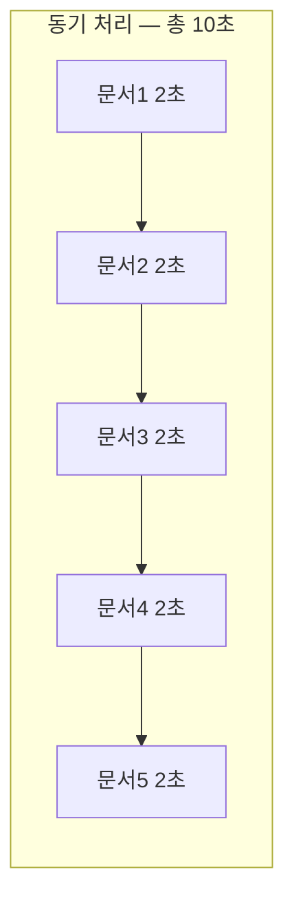
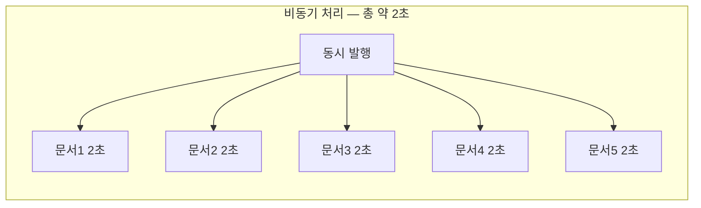
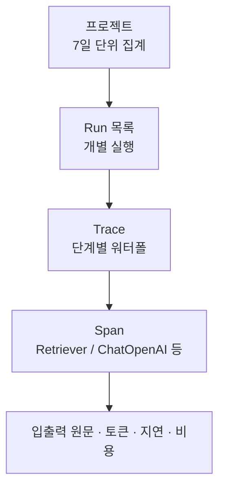
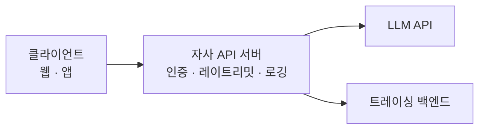

30초 걸리는 RAG 응답에서 검색이 1초, LLM 생성이 28.7초를 쓰고 있다면 벡터 DB 튜닝은 전체의 3.6%를 건드리는 일이다. 그런데 관측 없이 감으로 최적화하면 이 판단을 정확히 거꾸로 하기 쉽다. 눈에 보이는 것이 검색 쪽 코드이기 때문이다.

이 글은 그 판단을 데이터로 바꾸는 방법을 다룬다. 비동기가 실제로 무엇을 줄이는지(그리고 무엇을 줄이지 **않는지**), 트레이싱으로 어느 단계가 병목인지 가르는 법, 그리고 API 키와 예산 상한으로 비용 사고를 막는 구조까지 이어진다. [토큰 비용 구조](/blog/rag/llm-token-cost/)에서 정리한 절감 레버들의 전제가 되는 측정 계층이다.

## 용어 정리

| 용어 | 원어 | 뜻 |
|---|---|---|
| 동기 / 비동기 | Synchronous / Asynchronous | 작업 완료를 기다리는가 / 기다리지 않고 다른 일을 하는가 |
| async / await | — | 파이썬의 비동기 코루틴 문법. LangChain의 `ainvoke`·`abatch`가 이 위에 서 있다 |
| 지연 | Latency | 요청 하나가 끝나기까지 걸리는 시간 |
| 처리량 | Throughput | 단위 시간당 처리한 요청 수 |
| CPU 바운드 | CPU-bound | 연산이 병목인 작업. 비동기로 빨라지지 않는다 |
| I/O 바운드 | I/O-bound | 네트워크·디스크 대기가 병목인 작업. 비동기의 효과 구간 |
| 트레이싱 | Tracing | 실행의 단계별 입출력·소요시간·토큰을 기록·시각화하는 것 |
| Run | — | 체인 1회 실행 단위. 트레이스의 루트 노드 |
| Span | — | Run 안의 개별 단계(Retriever, ChatOpenAI 등) |

## 비동기 — 무엇을 줄이고 무엇을 줄이지 않나

비동기 메소드는 특정 작업이 완료될 때까지 **프로그램 전체를 멈추지 않고 다른 작업을 계속 수행**할 수 있게 한다.

| 방식 | 비유 | 프로그램에서의 의미 |
|---|---|---|
| **동기** | 커피를 주문하고 **그 자리에서 기다린다** | 응답을 받을 때까지 스레드가 블로킹됨 |
| **비동기** | 주문 후 **번호표를 받고 다른 일**을 한다 | 응답 대기 중에도 다른 코드가 실행됨 |

문서 5개를 각각 LLM으로 요약하는 작업(1건당 2초)을 가정하면 차이가 분명해진다.





핵심은 **LLM 호출이 CPU 작업이 아니라 네트워크 I/O 대기**라는 점이다. 대기 시간에는 CPU가 놀고 있으므로, 그 시간에 다른 요청을 보내면 총 소요시간이 순차 합계가 아니라 **가장 느린 하나** 수준으로 수렴한다.

### LangChain의 동기·비동기 대응

| 동기 | 비동기 | 동작 |
|---|---|---|
| `invoke(input)` | `ainvoke(input)` | 입력 1건 실행 |
| `batch(inputs)` | `abatch(inputs)` | 입력 여러 건을 **병렬** 실행 |
| `stream(input)` | `astream(input)` | 토큰 단위 스트리밍 |
| `stream_log(input)` | `astream_log(input)` | 중간 단계까지 포함해 스트리밍 |

```python
import asyncio

# 동기 — 순차 처리
results = [chain.invoke(q) for q in questions]

# 비동기 — 병렬 처리
async def run_all(questions):
    return await asyncio.gather(*[chain.ainvoke(q) for q in questions])

results = asyncio.run(run_all(questions))

# batch — 동시 실행 수를 제어하며 병렬 처리
results = chain.batch(questions, config={"max_concurrency": 5})
```

> `batch`는 동기 함수지만 **내부적으로 병렬 실행**한다. `max_concurrency`로 동시 호출 수를 제한할 수 있어, 레이트 리밋이 있는 API에는 `asyncio.gather`보다 `batch` 쪽이 안전한 경우가 많다.

### 효과가 있는 곳과 없는 곳

| 작업 | 비동기 효과 | 이유 |
|---|---|---|
| 다수 문서 임베딩 | **큼** | 네트워크 I/O 대기가 지배적 |
| 다수 질의 일괄 처리 | **큼** | 동일 |
| 여러 리트리버 동시 조회 (앙상블) | **큼** | 독립적 I/O |
| 웹 서버의 동시 사용자 처리 | **큼** | 응답 대기 중 다른 요청 처리 |
| **단일 질의 1건의 응답 시간** | **없음** | 병렬화할 대상이 없다. 오히려 오버헤드 |
| 로컬 CPU 임베딩 연산 | **없거나 역효과** | CPU 바운드는 GIL 때문에 async로 빨라지지 않는다 |
| 벡터 인덱스 로컬 검색 | 작음 | 대개 메모리·디스크 연산 |

> **"비동기를 썼더니 빨라졌다"는 서술은 반쪽이다.** 정확히는 **I/O 대기가 지배적인 구간을 병렬화해 처리량(throughput)을 높인 것**이다.
>
> 단일 요청의 지연(latency)은 비동기로 줄지 않는다. 이 둘을 구분하지 못하면 CPU 바운드 구간에 async를 붙여 놓고 왜 안 빨라지는지 묻게 된다.

## 트레이싱 — 무엇이 병목인지 가르는 도구

트레이싱은 실행의 단계별 입출력·소요시간·토큰을 기록한다. 이것이 답을 주는 문제들은 다음과 같다.

| 추적으로 밝히는 문제 |
|---|
| 예상치 못한 최종 결과 |
| 에이전트가 루핑되는 이유 |
| 체인이 예상보다 느린 이유 |
| 에이전트가 각 단계에서 사용한 토큰 수 |

관측은 두 계층으로 나뉜다.



### 프로젝트 계층 — 무엇이 비싼가

| 컬럼 | 의미 | 운영에서의 용도 |
|---|---|---|
| Run Count (7D) | 7일간 실행 횟수 | 트래픽 추이 |
| Error Rate (7D) | 에러 발생률 | 안정성 SLO |
| % Streaming (7D) | 스트리밍 응답 비율 | UX 구성 확인 |
| Total Tokens (7D) | 총 토큰 사용량 | 용량 계획 |
| **Total Cost (7D)** | **총 과금액** | **비용 관리의 1차 지표** |
| P50 Latency (7D) | 중앙값 지연 | 성능 SLO |

예시 대시보드를 읽어 보면 각 컬럼이 어떤 신호가 되는지 드러난다.

| 프로젝트 | Run Count | Error Rate | % Streaming | Total Tokens | Total Cost | P50 Latency |
|---|---|---|---|---|---|---|
| CH04-Models | 22 | 0% | 0% | 6,501 | $0.0092 | 0.00s |
| CH01-Basic | 48 | 0% | 9% | 189,876 | $0.9632 | 1.02s |
| llama3-agent | 33 | **12%** | 94% | 94,709 | — | **18.39s** |
| CH03-OutputParser | 3 | 0% | 67% | 3,332 | $0.0023 | 3.38s |
| CH02-Prompt | 29 | 3% | 24% | 17,389 | $0.2630 | 3.30s |

`llama3-agent` 행이 전형적인 이상 신호다. 에러율 12%에 P50이 18.39초 — 에이전트가 루핑하거나 로컬 모델이 느린 패턴이다. Total Cost가 비어 있는 것은 **로컬 모델이라 API 과금이 없다**는 뜻으로 읽는다. 비용이 0이라고 해서 공짜가 아니라, 비용이 다른 장부(GPU·전력)로 옮겨 갔을 뿐이다.

### Run 계층 — 어디가 느린가

1개 실행을 열면 검색된 문서뿐 아니라 **LLM의 입출력 원문까지** 기록된다. 그래서 검색 알고리즘을 바꿔야 할지 프롬프트를 바꿔야 할지 판단할 수 있다.

전형적인 트레이스 워터폴이다.

| 단계 | 소요시간 | 비중 |
|---|---|---|
| `RunnableSequence` (루트) | **30.00s** / 5,104 토큰 | 100% |
| └ `map:key:context` | 1.08s | 3.6% |
| └─ `Retriever` | 1.08s | 3.6% |
| └── `Retriever` (하위) | 0.03s | — |
| └── `Retriever` (하위) | 1.05s | — |
| └ `reorder_documents` | 0.00s | 0% |
| └ `ChatOpenAI` | **28.69s** | **95.6%** |

> **이 트레이스가 말하는 것**: 30초 응답의 **95.6%가 LLM 생성**이고 검색은 1.08초에 불과하다.
>
> 이 상태에서 벡터 DB를 튜닝하거나 인덱스를 바꾸는 것은 최대 3.6%를 건드리는 일이다. 개선해야 할 것은 **모델 교체 · 출력 길이 축소 · 스트리밍 도입**이다.
>
> 이것이 "기능보다 관측을 먼저 깐다"는 원칙의 근거다. 측정이 없으면 가장 눈에 띄는 코드를 고치게 되고, 그것이 병목일 확률은 낮다.

### 설정

| 환경변수 | 값 / 설명 |
|---|---|
| `LANGCHAIN_TRACING_V2` | `"true"`로 설정하면 추적 시작 |
| `LANGCHAIN_ENDPOINT` | `https://api.smith.langchain.com` |
| `LANGCHAIN_API_KEY` | 발급받은 키 |
| `LANGCHAIN_PROJECT` | 프로젝트 명. 해당 프로젝트 그룹으로 모든 Run이 추적됨 |

```python
from dotenv import load_dotenv

load_dotenv()
```

> **관측 도구에도 반출 기준을 똑같이 적용해야 한다.** 트레이싱은 프롬프트와 검색 문서 **원문을 외부 SaaS로 전송**한다.
>
> 로컬 LLM을 도입하는 이유가 데이터 반출 통제인 조직이라면, 관측 도구만 예외로 두는 것은 논리가 맞지 않는다. 민감 데이터를 다루면 마스킹 정책을 걸거나 셀프호스팅 옵션을 검토하고, 그것이 어렵다면 개발·스테이징에만 붙이고 프로덕션은 자체 지표로 가져간다.

## 예산 상한 — 비용 사고를 구조로 막는다

관측이 "얼마나 썼는지"를 알려준다면, 예산 상한은 "얼마까지만 쓰게" 만든다. 둘은 같은 문제의 앞뒤다.

| 설정 | 동작 | 성격 | 운영상 역할 |
|---|---|---|---|
| **Monthly budget** | 지정 금액 도달 시 **과금을 멈추고 API 사용을 차단** | 하드 스톱 | 무한 과금 사고의 최종 안전장치. 단, 도달하면 **서비스가 멈춘다** |
| **Email threshold** | 지정 금액 도달 시 이메일 발송 | 소프트 경보 | 하드 스톱 전에 손 쓸 시간을 확보 |

> **두 값을 어떻게 잡느냐가 설계다.** 프로덕션에서 monthly budget을 실제 예상치에 딱 맞게 잡으면 트래픽이 튀는 날 **서비스가 통째로 멈춘다.** 반대로 너무 넉넉히 잡으면 안전장치 역할을 못 한다.
>
> 실무 절충은 **예상치의 1.5~2배를 budget으로, 예상치의 1배 지점을 email threshold로** 두는 것이다.

### 조직 단위 키 관리

| 원칙 | 내용 | 이유 |
|---|---|---|
| **프로젝트별 키 분리** | 키 생성 시 프로젝트를 지정 | 프로젝트별 사용량·비용 귀속. 유출 시 폭발 반경 축소 |
| **용도별 키 분리** | 개발/스테이징/프로덕션 키를 각각 발급 | 개발 키가 유출돼도 프로덕션은 무사 |
| **키를 클라이언트에 두지 않기** | 브라우저·모바일 앱이 아니라 **서버 프록시** 경유 | 클라이언트 배포물에서 키는 반드시 추출된다 |
| **`.env` + `.gitignore`** | 키는 코드가 아니라 환경변수로 | 저장소 유출 = 키 유출. 히스토리에 남으면 회수 불가 |
| **정기 로테이션** | 주기적 재발급과 구 키 폐기 | 인지하지 못한 유출의 노출 기간 단축 |
| **한도의 이중화** | 조직 예산 + 프로젝트 예산 양쪽에 상한 | 한 프로젝트의 사고가 조직 전체 예산을 태우지 않도록 |
| **사용량 모니터링** | 프로젝트별 Total Cost 추적 | 청구서를 받고 알면 이미 늦다 |



> 키를 서버에 가두는 구조는 보안만의 문제가 아니다.
>
> 프록시 지점이 있어야 **사용자별 쿼터·캐싱·모델 라우팅·감사 로그**를 걸 수 있다. [토큰 비용 절감 레버](/blog/rag/llm-token-cost/) 대부분이 이 지점에서만 구현 가능하다.

키가 유출되면 타인이 그 키로 호출한 비용이 발급자에게 청구된다. API 키는 편의를 위한 식별자가 아니라 **결제 수단에 직결된 자격증명**으로 취급해야 한다.

비용·관측·모듈화·거버넌스에서 반복해 부딪히는 판단은 [RAG 운영 Q&A](/blog/rag/rag-qna-operations/)에 문답으로 모았다.
