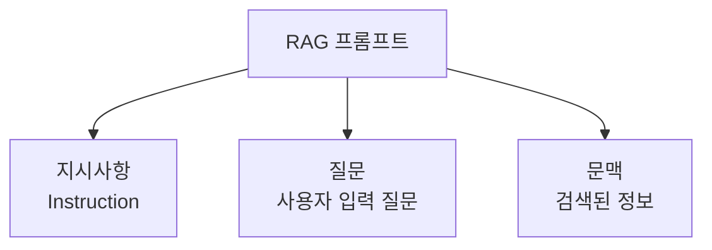
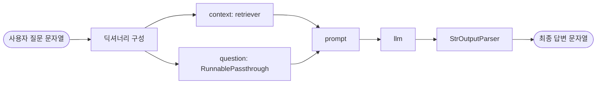
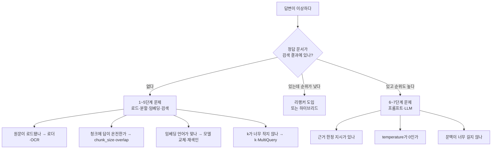

RAG 프롬프트에서 가장 중요한 문장은 "답을 찾을 수 없다면 모른다고 하세요" 한 줄이다. 모르는 것을 모른다고 하는 시스템이 아무 말이나 하는 시스템보다 실무에서 훨씬 쓸모 있기 때문이다. 그런데 이 문장은 검색이 제대로 됐을 때만 의미가 있다.

이 글은 검색된 근거를 답변으로 바꾸는 생성 계층 — 프롬프트, LLM, 체인, 출력파서 — 을 다루고, 마지막에 **RAG가 잘 안 될 때 어느 단계의 문제인지 특정하는 진단표**로 8단계 전체를 닫는다. 앞 단계는 [1편 로드·분할](/blog/rag/rag-pipeline-ingestion/)과 [2편 임베딩·검색·리랭커](/blog/rag/rag-pipeline-retrieval/)에 있다.

## 용어 정리

| 용어 | 원어 | 뜻 |
|---|---|---|
| 프롬프트 | Prompt | 지시사항 + 질문 + 검색된 문맥을 조합해 LLM에 넣는 최종 입력 |
| 컨텍스트 | Context | 프롬프트에 삽입되는 "검색된 문서 본문". RAG의 근거 |
| 체인 | Chain | 8단계를 하나의 실행 파이프라인으로 묶은 것 |
| 출력파서 | Output Parser | LLM의 자유형식 텍스트 출력을 구조화된 데이터로 변환하는 컴포넌트 |
| LCEL | LangChain Expression Language | `\|` 파이프 연산자로 컴포넌트를 조립하는 LangChain 표현식 문법 |
| Runnable | Runnable | LCEL에서 `invoke`·`stream`·`batch`를 지원하는 실행 단위 인터페이스 |
| RunnablePassthrough | — | 입력을 가공 없이 그대로 다음 단계로 흘려보내는 Runnable |
| StrOutputParser | — | LLM 응답 객체에서 본문 문자열만 뽑아내는 기본 출력파서 |
| NLU / NLG | Natural Language Understanding / Generation | 자연어 이해 / 자연어 생성 |
| Lost-in-the-middle | — | 긴 문맥에서 중간에 위치한 정보가 무시되는 현상 |

## 단계 6 — 프롬프트

검색된 문서들을 바탕으로 **언어 모델이 사용할 질문·명령을 구성**하는 단계다.

| # | 항목 | 설명 |
|---|---|---|
| 1 | **문맥 설정** | 모델이 특정 문맥에서 작동하도록 설정. 제공된 정보 기반의 답변 유도 |
| 2 | **정보 통합** | 여러 문서에서 검색된 정보는 서로 다른 관점·내용을 포함할 수 있다. 이를 모델이 활용할 형식으로 조정 |
| 3 | **응답 품질 향상** | 응답 품질은 프롬프트 구성에 크게 의존한다 |

### RAG 프롬프트의 3요소



| 요소 | 역할 |
|---|---|
| 지시사항(Instruction) | 역할 부여 + 답변 규칙 + 언어 지정 |
| 질문(Question) | 사용자가 입력한 원문 질문 |
| 문맥(Context) | 검색기가 가져온 문서 본문 |

### 표준 템플릿과 그 안의 안전장치

```text
당신은 질문-답변(Question-Answer) Task 를 수행하는 AI 어시스턴트 입니다.
검색된 문맥(context)를 사용하여 질문(question)에 답하세요.
만약, 문맥(context) 으로부터 답을 찾을 수 없다면 '모른다' 고 말하세요.
한국어로 대답하세요.

#Question:
{이곳에 사용자가 입력한 질문이 삽입됩니다}

#Context:
{이곳에 검색된 정보가 삽입됩니다}

#Answer:
```

이 짧은 템플릿에 RAG의 안전장치가 전부 들어 있다.

| 문장 | 역할 |
|---|---|
| "질문-답변 Task를 수행하는 AI 어시스턴트" | 역할(persona) 고정 → 잡담·창작 억제 |
| "검색된 문맥을 사용하여 답하세요" | **근거 범위를 문맥으로 한정** → 사전학습 지식 남용 억제 |
| "답을 찾을 수 없다면 '모른다'고 말하세요" | **할루시네이션 방어의 핵심 문장** |
| "한국어로 대답하세요" | 출력 언어 고정 |
| `#Question` / `#Context` / `#Answer` | 구획 구분자. 모델이 어디까지가 근거인지 인식하게 함 |

응답 시나리오는 둘로 갈린다. 문맥에 답이 있으면 문맥을 토대로 답하고, 없으면 "모른다"고 답해야 한다. **두 번째가 제대로 동작하는지가 RAG 품질 평가의 핵심 체크포인트다.**

### 튜닝 포인트

| 포인트 | 내용 |
|---|---|
| 문맥 배치 순서 | 관련도 높은 문서를 앞·뒤 끝에 배치(Lost-in-the-middle 완화) |
| 출처 표기 요구 | "답변 끝에 근거 문서명·페이지를 적으라"고 명시하면 검증이 쉬워짐 |
| 문맥 길이 상한 | 컨텍스트 윈도우와 비용 한도 내에서 청크 수 × 청크 크기를 관리 |
| 언어·톤 고정 | 다국어 문서 + 한국어 답변이면 명시적으로 지정 |
| 거절 조건 명시 | "문맥에 없으면 모른다" 외에 "추측하지 말라"를 추가 |

### 실패 모드

| 증상 | 원인 | 대응 |
|---|---|---|
| 문맥에 없는 내용을 지어냄 | 근거 한정 지시 부재·약함 | "문맥에서만 답하라 + 없으면 모른다" 강화 |
| 문맥이 있는데도 "모른다" | 지시가 과하게 보수적이거나 청크 문맥 부족 | 지시 완화 또는 chunk_size·k 조정 |
| 답변 언어가 섞임 | 언어 지정 누락 | "한국어로 대답하세요" 명시 |
| 긴 문맥에서 중간 정보 누락 | Lost-in-the-middle | 문서 수 축소, 리랭커로 상위만 투입 |

## 단계 7 — LLM

구성된 프롬프트를 입력으로 받아 **정확하고 자연스러운 답변을 생성**하는 단계다. 여기서 중요한 것은 **사전학습 지식이 아니라 제공된 정보에 기반해** 답하게 만드는 것이다.

### 배치 전략

| 옵션 | 예시 | 장점 | 단점 |
|---|---|---|---|
| 상용 API (GPT 계열) | `ChatOpenAI(model_name="gpt-4o")` | 성능 안정, 생태계 넓음 | 비용, 데이터 외부 전송 |
| 상용 API (Claude 계열) | `ChatAnthropic(model="claude-3-sonnet-...")` | 긴 문맥 처리·지시 준수 강점 | 비용, 외부 전송 |
| 로컬 모델(Ollama) | `ChatOllama(model="llama3:8b")` | **데이터 외부 유출 없음**, 호출 비용 0 | 품질 한계, GPU 자원 필요 |

| 선택 기준 | 확인할 것 |
|---|---|
| 보안 등급 | 사내 기밀 문서면 로컬/온프레미스가 사실상 강제 |
| 컨텍스트 윈도우 | 청크 k개를 넣고도 여유가 있는지 |
| 비용 | 질의당 입력 토큰 = 프롬프트 + 문맥. **문맥이 비용을 지배한다** |
| 지시 준수력 | "모르면 모른다" 지시를 잘 따르는지가 RAG에선 특히 중요 |
| 지연 | 스트리밍 지원 여부 |

### 튜닝 포인트

| 파라미터 | 권장 | 이유 |
|---|---|---|
| `temperature` | **0에 가깝게** | RAG는 창작이 아니라 근거 기반 요약·추출. 무작위성은 할루시네이션 위험 |
| `max_tokens` | 용도에 맞게 제한 | 장황한 답변 억제, 비용 통제 |
| 모델 등급 분리 | 질의 재작성·요약은 소형, 최종 답변은 대형 | 비용 대비 품질 최적화 |
| 스트리밍 | 사용자 대면이면 켜기 | 체감 지연 감소 |

### 실패 모드

| 증상 | 원인 | 대응 |
|---|---|---|
| 문맥을 무시하고 사전학습 지식으로 답함 | 지시 약함 + temperature 높음 | temperature↓, 근거 한정 지시 강화 |
| 답변이 잘림 | `max_tokens` 부족 | 상향 조정 |
| 문맥이 길어지자 품질 저하 | 컨텍스트 윈도우 한계 근접 | 문서 수 축소, 압축 검색기 도입 |
| 비용 급증 | k와 chunk_size가 과다 | 두 값을 함께 낮추고 리랭커로 보완 |

## 단계 8 — 체인

앞선 7단계를 **하나의 RAG 파이프라인으로 조립**하는 단계다. LCEL 문법으로 `|` 파이프를 써서 묶는다.



| 구성요소 | 역할 |
|---|---|
| `{"context": retriever, ...}` | 질문 문자열을 retriever에 넣어 검색 결과를 `context` 키에 채운다 |
| `RunnablePassthrough()` | **같은 질문 문자열을 가공 없이 그대로** `question` 키에 넣는다 |
| `prompt` | 두 키를 템플릿 변수에 대입해 최종 프롬프트 완성 |
| `llm` | 프롬프트를 받아 응답 메시지 생성 |
| `StrOutputParser()` | 응답 객체에서 본문 문자열만 추출 |

> `RunnablePassthrough`가 왜 필요한지가 이 구조를 이해했는지 가르는 지점이다. **입력 하나(질문)가 두 갈래로 갈라져야 하기 때문**이다. 한 갈래는 검색기로 가서 문맥이 되고, 다른 한 갈래는 원본 그대로 프롬프트의 질문 자리로 간다.

### LCEL이 주는 것

| 이점 | 설명 |
|---|---|
| 조립 가독성 | 데이터 흐름이 `\|` 순서 그대로 읽힌다 |
| 표준 인터페이스 | 모든 Runnable이 `invoke`·`batch`·`stream`을 지원 |
| 스트리밍 | 체인 전체가 토큰 단위 스트리밍 가능 |
| 병렬화 | 딕셔너리 형태의 입력은 각 키가 병렬로 평가된다 |
| 교체 용이 | 검색기·LLM만 갈아끼워 A/B 비교 가능 |

### 문서 포맷터와 출처 반환

검색기가 반환하는 것은 `Document` 객체 리스트다. 프롬프트에 넣으려면 문자열로 합쳐야 한다.

```python
def format_docs(docs):
    return "\n\n".join(doc.page_content for doc in docs)

chain = (
    {"context": retriever | format_docs, "question": RunnablePassthrough()}
    | prompt
    | llm
    | StrOutputParser()
)
```

답변과 함께 근거 문서를 돌려주려면 답변 생성과 원본 문서를 병렬로 유지한다.

```python
from langchain_core.runnables import RunnableParallel

rag_chain_from_docs = (
    {"context": lambda x: format_docs(x["context"]), "question": lambda x: x["question"]}
    | prompt
    | llm
    | StrOutputParser()
)

rag_chain_with_source = RunnableParallel(
    {"context": retriever, "question": RunnablePassthrough()}
).assign(answer=rag_chain_from_docs)
```

### 실패 모드

| 증상 | 원인 | 대응 |
|---|---|---|
| 프롬프트에 객체 문자열이 그대로 들어감 | `format_docs` 누락 | 포맷터 삽입 |
| `question` 자리가 비어 있음 | `RunnablePassthrough` 누락 | 입력 분기 확인 |
| 템플릿 변수 오류 | 프롬프트 변수명과 딕셔너리 키 불일치 | `{context}`·`{question}` 키 이름 일치 |
| 무엇이 검색됐는지 알 수 없음 | 추적 미설정 | 트레이싱 도구 연결 |

## 부속 컴포넌트 — 출력파서

LLM의 출력을 받아 더 적합한 형식으로 변환하는 컴포넌트다. **구조화된 데이터 생성**에 특히 유용하다.

| # | 이점 | 설명 |
|---|---|---|
| 1 | 구조화 | 자유 형식 텍스트 출력을 구조화된 데이터로 변환 |
| 2 | 일관성 | 출력 형식을 일관되게 유지해 후속 처리를 용이하게 함 |
| 3 | 유연성 | JSON·리스트·딕셔너리 등 다양한 형식으로 변환 가능 |

### 사용 전후 비교

파서 없이 이메일을 요약하면 사람이 읽기 좋은 자유형식 마크다운이 나온다.

```text
**중요 내용 추출:**
1. **발신자:** 홍길동 (sender@example.com)
2. **수신자:** 김영희 (receiver@example.com)
3. **제목:** 신규 모델 유통 협력 및 미팅 일정 제안
4. **요청 사항:**
   - 신규 모델의 상세 브로슈어 요청
5. **미팅 제안:**
   - 날짜: 다음 주 화요일 (1월 15일), 시간: 오전 10시
```

파서로 JSON 구조화하면 후속 시스템이 바로 쓸 수 있는 데이터가 나온다.

```json
{
  "person": "홍길동",
  "email": "sender@example.com",
  "subject": "신규 모델 유통 협력 및 미팅 일정 제안",
  "summary": "신규 모델 브로슈어와 기술 사양·배터리 성능·디자인 정보를 요청하고, 협력 논의를 위해 1월 15일 오전 10시 미팅을 제안.",
  "date": "1월 15일 오전 10시"
}
```

| 파서 | 출력 | 쓰임 |
|---|---|---|
| `StrOutputParser` | 문자열 | RAG 기본. 응답 본문만 추출 |
| `JsonOutputParser` | dict | 후속 시스템 연동 |
| `PydanticOutputParser` | 타입 검증된 객체 | **스키마 강제·검증**이 필요할 때 |
| `CommaSeparatedListOutputParser` | list | 키워드·태그 추출 |
| `StructuredOutputParser` | dict | 필드 정의가 단순할 때 |

| 증상 | 원인 | 대응 |
|---|---|---|
| JSON 파싱 실패 | LLM이 코드펜스·설명문을 덧붙임 | 포맷 지시를 프롬프트에 삽입, 재시도 파서 사용 |
| 필드 누락 | 스키마 미강제 | Pydantic 파서로 검증 |
| 스트리밍 중 파싱 오류 | 부분 JSON | 스트리밍 지원 파서 사용 또는 최종 청크에서 파싱 |

## 8단계 통합 코드

```python
# ===== 사전 준비 단계 (1~4) =====

# 단계 1: 문서 로드(Load Documents)
from langchain_community.document_loaders import PyMuPDFLoader

loader = PyMuPDFLoader("data/문서.pdf")
docs = loader.load()

# 단계 2: 문서 분할(Split Documents)
from langchain_text_splitters import RecursiveCharacterTextSplitter

text_splitter = RecursiveCharacterTextSplitter(chunk_size=1000, chunk_overlap=50)
split_documents = text_splitter.split_documents(docs)

# 단계 3: 임베딩(Embedding) 생성
from langchain_openai import OpenAIEmbeddings

embeddings = OpenAIEmbeddings()

# 단계 4: DB 생성(Create DB) 및 저장
from langchain_community.vectorstores import FAISS

vectorstore = FAISS.from_documents(documents=split_documents, embedding=embeddings)


# ===== 런타임 단계 (5~8) =====

# 단계 5: 검색기(Retriever) 생성
retriever = vectorstore.as_retriever(search_kwargs={"k": 4})

# 단계 6: 프롬프트 생성(Create Prompt)
from langchain_core.prompts import PromptTemplate

prompt = PromptTemplate.from_template(
    """당신은 질문-답변(Question-Answer) Task 를 수행하는 AI 어시스턴트 입니다.
검색된 문맥(context)를 사용하여 질문(question)에 답하세요.
만약, 문맥(context) 으로부터 답을 찾을 수 없다면 '모른다' 고 말하세요.
한국어로 대답하세요.

#Question:
{question}

#Context:
{context}

#Answer:"""
)

# 단계 7: 언어모델(LLM) 생성
from langchain_openai import ChatOpenAI

llm = ChatOpenAI(model_name="gpt-4o", temperature=0)

# 단계 8: 체인(Chain) 생성
from langchain_core.output_parsers import StrOutputParser
from langchain_core.runnables import RunnablePassthrough


def format_docs(docs):
    return "\n\n".join(doc.page_content for doc in docs)


chain = (
    {"context": retriever | format_docs, "question": RunnablePassthrough()}
    | prompt
    | llm
    | StrOutputParser()
)

# 체인 실행(Run Chain)
question = "삼성전자가 자체 개발한 AI 의 이름은?"
response = chain.invoke(question)
print(response)
```

## 실패 모드 종합 진단표

RAG가 잘 안 될 때 **어느 단계의 문제인지부터 특정**한다. 이 진단 순서가 8단계를 배우는 실질적인 이유다.



첫 분기가 전부다. **정답 문서가 검색 결과에 들어 있는지를 먼저 본다.** 이걸 건너뛰고 프롬프트를 고치거나 모델을 바꾸면 원인과 무관한 곳을 만지게 된다.

| 증상 | 1순위 의심 단계 | 조정 레버 |
|---|---|---|
| 정답 문서를 아예 못 가져옴 | 5 검색기 / 3 임베딩 | k↑, 하이브리드(BM25 병행), MultiQuery, 임베딩 모델 교체 |
| 정답 문서 순위가 낮음 | 5 검색기 | **리랭커 도입**, 앙상블 가중치 조정 |
| 근거는 맞는데 문맥이 잘림 | 2 분할 | chunk_size↑, overlap↑, ParentDocument |
| 관련 없는 청크가 딸려옴 | 2 분할 / 5 검색기 | chunk_size↓, MMR, score_threshold |
| 상위 k가 중복 내용 | 5 검색기 / 4 저장 | MMR, 적재 시 중복 제거 |
| 문맥에 없는 내용을 지어냄 | 6 프롬프트 / 7 LLM | 근거 한정 지시 강화, temperature=0 |
| 문맥이 있는데 "모른다" | 6 프롬프트 / 2 분할 | 지시 완화, chunk_size↑ |
| 표·수치 질문만 실패 | 1 로드 | 구조 보존 로더, 표 전용 처리 |
| 제품코드·약어 검색 실패 | 5 검색기 | BM25 병행(sparse 비중↑) |
| 오래된 정보로 답함 | 4 저장 | 메타데이터 필터, 재적재 주기, 시간 가중 |
| 응답이 느림 | 5 검색기 / 리랭커 | 후보 수↓, ANN 인덱스, 모델 등급 분리 |
| 비용이 과다 | 2 분할 / 7 LLM | k↓, chunk_size↓, 소형 모델 분업 |
| 재기동 후 검색 결과 없음 | 4 저장 | 인덱스 영속화 |
| JSON 파싱 실패 | 출력파서 | Pydantic 파서, 포맷 지시 |

RAG 품질은 단일 기법이 아니라 **8단계 각각의 누적**으로 올라간다. 그래서 운영에서 실제로 필요한 것은 좋은 모델을 고르는 일이 아니라, **어느 단계가 병목인지 측정 가능한 파이프라인을 만들고 단계별 개선을 반복하는 구조**다.

운영에 올리기 전에 반드시 정해야 할 세 가지가 있다. **정답 문서가 검색됐는지 판정하는 평가셋**, **질의당 지연·비용 예산**, **문서 갱신·삭제 시의 재색인 정책**이다. 이 셋이 없으면 품질 저하를 감지조차 못 한다.
