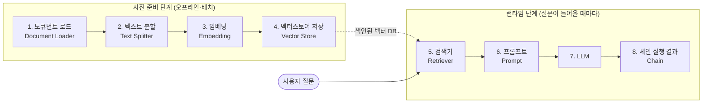

LLM에 사내 문서를 붙이려 할 때 처음 부딪히는 벽은 모델이 아니다. "왜 이 답이 나왔는지 알 수 없다"는 것이다. 파일을 올려서 답이 이상하면 할 수 있는 일이 문서 형태를 바꿔 보는 것뿐인데, 사내 문서 전체의 형태를 바꾸는 것은 현실적으로 불가능하다.

RAG를 직접 구축한다는 것은 그 블랙박스를 8개의 조정 가능한 단계로 펼치는 일이다. 이 글은 그 8단계 지도를 먼저 그리고, 사전처리의 첫 두 단계인 **도큐먼트 로드**와 **텍스트 분할**을 단계별 선택지·튜닝 파라미터·실패 모드까지 다룬다. 이어지는 편에서는 [임베딩부터 리랭커까지](/blog/rag/rag-pipeline-retrieval/)의 검색 계층을, [프롬프트부터 체인까지](/blog/rag/rag-pipeline-generation/)의 생성 계층을 다룬다.

## 용어 정리

| 용어 | 원어 | 뜻 |
|---|---|---|
| RAG | Retrieval-Augmented Generation | 검색으로 찾은 외부 문서를 LLM 입력에 붙여 답변을 생성하는 방식. 검색 → 증강 → 생성 |
| 할루시네이션 | Hallucination | LLM이 근거 없는 내용을 사실처럼 지어내는 현상 |
| 청크 | Chunk | 원본 문서를 검색·입력에 알맞게 자른 조각. 임베딩·저장·검색의 최소 단위 |
| 청크 크기 | chunk size | 한 청크에 담을 텍스트 길이(문자 수 또는 토큰 수) |
| 청크 오버랩 | chunk overlap | 인접 청크끼리 겹쳐 두는 구간. 경계에서 문맥이 끊기는 것을 완화 |
| 임베딩 | Embedding | 텍스트를 고차원 실수 벡터로 바꿔 의미를 수치화한 표현 |
| 벡터스토어 | Vector Store | 임베딩 벡터를 저장·색인하고 유사도 검색을 제공하는 DB |
| 검색기 | Retriever | 질문 벡터와 저장된 벡터를 비교해 관련 청크를 뽑아 오는 컴포넌트 |
| 리랭커 | Reranker | 검색기가 뽑은 후보를 더 정교한 모델로 재채점해 순위를 다시 매기는 2단계 컴포넌트 |
| 프롬프트 | Prompt | 지시사항 + 질문 + 검색된 문맥을 조합해 LLM에 넣는 최종 입력 |
| 컨텍스트 | Context | 프롬프트에 삽입되는 "검색된 문서 본문". RAG의 근거 |
| 체인 | Chain | 위 단계들을 하나의 실행 파이프라인으로 묶은 것 |
| top-k | top k | 유사도 상위 k개 문서만 반환하는 것. `k`는 반환 개수 파라미터 |
| OCR | Optical Character Recognition | 이미지·스캔 문서에서 글자를 인식해 텍스트로 바꾸는 기술 |

## RAG를 쓰는 이유

### 순수 LLM의 한계

| # | 문제 | 설명 |
|---|---|---|
| 1 | 최신 정보 부재 | 학습 컷오프 이후 정보를 모른다 |
| 2 | 내부 데이터 부재 | 개인·회사 내부 문서는 애초에 학습에 포함되지 않았다 |
| 3 | 도메인 질문 실패 | 그래서 특정 도메인 질문에는 기대하는 답이 나오지 않는다 |
| 4 | 할루시네이션 | 문서를 업로드해도 답을 못 찾거나 지어낸다. **문서량이 많아질수록 심해진다** |

### RAG를 적용하면 무엇이 달라지나

| # | 개선 | 설명 |
|---|---|---|
| 1 | 최신 정보 기반 답변 | 저장된 최신 문서를 검색해 답한다 |
| 2 | 내부데이터 참조 | 개인·사내 문서를 근거로 답변 가능 |
| 3 | 지식 축적 | 문서를 내부 DB에 쌓아 나가고, 그 DB에서 검색해 답변 |
| 4 | 할루시네이션 감소 | 답변의 출처를 DB에서 역으로 검색·검증하는 방식으로 환각을 줄인다 |

도달점은 **방대한 지식 기반으로 답변하는 도메인 특화 챗봇**이다. "서울특별시에 사는 특정 인물의 아버지 이름"처럼 내부 문서가 있어야만 답할 수 있는 질문이 이 구조가 필요한 전형적인 유형이다.

### 파일 업로드로 충분하지 않은 이유

상용 챗봇의 파일 업로드도 내부적으로 RAG를 쓴다. 결정적 차이는 **과정이 열려 있는가**에 있다.


| 비교 축 | 내장 RAG | 직접 구축 RAG |
|---|---|---|
| 과정 공개 | 블랙박스. 어떤 과정으로 검색됐는지 알 수 없음 | 전 과정을 직접 설계 → 단계별 분석·제어 가능 |
| 실패 원인 분석 | 불가 | 잘 나온 이유 / 못 찾은 이유를 추적 가능 |
| 개선 수단 | 문서 형태 변경 정도 | 청킹·임베딩·검색기·리랭커·프롬프트 전부 조정 가능 |
| 문서 세부 질의 | 문서 내부의 구체적 질문에 답을 못 하거나 관련 정보를 못 찾는 현상 발생 | 검색 결과를 확인하고 문제 단계를 특정해 고침 |

> **투명성과 해석가능성이 직접 구축의 핵심 가치다.** 추적 도구를 붙이면 "무엇이 검색됐는지"와 "각 문서의 세부 내용"까지 눈으로 확인할 수 있고, 그래야 어느 단계를 고쳐야 하는지 특정된다.

### 할루시네이션을 어떻게 줄이나

| 기법 | 동작 |
|---|---|
| 유효 정보 기반 답변 강제 | "주어진 문맥에서만 답하라, 없으면 모른다고 하라"를 프롬프트로 강제 |
| 출처 역추적 | 답변 내용의 근거를 다시 주어진 문서에서 찾게 함 |

RAG는 할루시네이션을 **없애는** 방법이 아니라 **줄이는** 방법이다. 이 구분은 어휘 문제가 아니라 설계 문제다. 검색이 틀린 문서를 가져오면 RAG는 오히려 더 그럴듯한 오답을 만들어 낸다.

## 전체 파이프라인 — 사전처리 4단계와 런타임 4단계

RAG는 8단계로 구성되며, **사전 준비 단계(1~4)와** **런타임 단계(5~8)로** 나뉜다. 이 구분이 전체의 뼈대다.



**이 구분이 중요한 이유는 비용과 지연이 갈리기 때문이다.** 앞의 넷은 배치로 한 번 돌고, 뒤의 넷은 질문마다 돈다. 임베딩 모델을 바꾸는 결정과 top-k를 바꾸는 결정은 비용 구조가 완전히 다르다.

### 단계별 산출물 흐름

| 단계 | 입력 | 출력 | 실행 시점 |
|---|---|---|---|
| 1 로드 | 파일·URL·API·DB | `Document[]` (본문 + 메타데이터) | 배치 |
| 2 분할 | `Document[]` | 잘게 쪼갠 `Document[]` (청크) | 배치 |
| 3 임베딩 | 청크 텍스트 | `float[]` 벡터 | 배치 |
| 4 저장 | 벡터 + 원문 + 메타 | 색인된 벡터 DB | 배치 |
| 5 검색 | 질문 문자열 | 관련 청크 top-k | 런타임 |
| 6 프롬프트 | 질문 + 청크 | 완성된 프롬프트 문자열 | 런타임 |
| 7 LLM | 프롬프트 | 응답 메시지 | 런타임 |
| 8 체인 | 위 전부 | 최종 문자열/구조화 데이터 | 런타임 |

각 단계를 도서관에서 공부하는 과정에 대응시키면 역할이 빠르게 잡힌다.

| 단계 | 이름 | 대응 |
|---|---|---|
| 1 | 도큐먼트 로드 | 책장에서 필요한 책들을 골라 오기 |
| 2 | 텍스트 분할 | 큰 책을 챕터별로 나누기 |
| 3 | 임베딩 | 책 내용을 요약해 핵심 키워드로 표현하기 |
| 4 | 벡터스토어 저장 | 요약 키워드를 색인화해 나중에 빨리 찾게 하기 |
| 5 | 검색기 | 질문에 가장 잘 맞는 챕터를 찾기 |
| 6 | 프롬프트 | 찾은 정보를 바탕으로 어떻게 물을지 정하기 |
| 7 | LLM | 수집한 정보로 보고서를 작성하는 학생 |
| 8 | 체인 생성 | 위 과정을 하나의 파이프라인으로 묶기 |

### 성능은 단계별 기법의 누적으로 오른다

RAG 성능은 한 방에 올라가지 않는다. **각 단계에 기법을 하나씩 적용할 때마다 점진적으로** 향상된다.

그래서 "RAG 성능을 어떻게 올리나"라는 질문에는 단일 해법이 존재하지 않는다. 실무에서 답이 되는 것은 **어느 단계의 문제인지 진단하고 그 단계의 레버를 조정하는 절차**이고, 그 진단 절차는 [실패 모드 종합 진단표](/blog/rag/rag-pipeline-generation/)에 정리했다.

## 단계 1 — 도큐먼트 로드

외부에 흩어져 있는 이질적 데이터를 **시스템이 다룰 수 있는 단일 형식(`Document`)으로 수집·정제**하는 단계다. 파이프라인의 첫 단추라 여기서의 정확성이 전체 출력 품질을 좌우한다.


| 하위 작업 | 내용 |
|---|---|
| 1. 데이터 소스 선택 | 어떤 종류의 데이터가 필요한지, 어디서 어떻게 수집할지 결정. 웹사이트·DB·API·공개 데이터셋 등 |
| 2. 데이터 수집 | API 호출·웹 스크래핑·DB 쿼리. 인증이나 접근 권한 설정이 필요할 수 있음 |
| 3. 필터링·전처리 | 필요한 정보만 추출하고 정제. 불필요한 포맷팅 제거, 언어·문맥 필터 적용 |
| 4. 데이터 로드 | 내부에서 쓸 형식으로 변환. 보통 메모리 내 자료구조로, 필요시 DB·파일시스템에 저장 |

### 소스별 로더 선택

| 데이터 유형 | 대표 로더 | 특징·주의점 |
|---|---|---|
| PDF | `PyMuPDFLoader` | 속도 빠르고 레이아웃 텍스트 추출 양호. 범용 기본값 |
| PDF (표·이미지 많음) | `UnstructuredPDFLoader` | 요소(제목·표·이미지) 단위 파싱. 느리지만 구조 보존 |
| PDF (스캔본) | OCR 병행 | 텍스트 레이어가 없으면 OCR로 글자를 인식해야 함 |
| Word·한글 문서 | `Docx2txtLoader` 등 | 한글(HWP)은 별도 변환기가 필요한 경우가 많음 |
| Excel·CSV | `CSVLoader`, `UnstructuredExcelLoader` | 행 단위 Document화. 표 의미가 사라지지 않게 헤더를 함께 실어야 함 |
| SQL Table | DB 커넥터 기반 로더 | 쿼리 결과를 Document로 변환 |
| 마크다운(.md) | `UnstructuredMarkdownLoader` | 헤딩 구조를 살려 두면 뒤의 분할 단계가 쉬워짐 |
| HTML | `WebBaseLoader`, `UnstructuredHTMLLoader` | 스크립트·네비게이션·광고 제거가 관건 |
| 웹 크롤링 | `WebBaseLoader` | 최신 뉴스 등 실시간성 자료 |
| 학술 논문 | `ArxivLoader` | 전문 지식·논문 수집 |

### 전처리에서 반드시 제거할 것

| 제거 대상 | 이유 |
|---|---|
| 불필요한 이미지 | 텍스트 파이프라인에 노이즈 |
| 그래프 | 캡션 없이 들어오면 의미 없는 문자열 조각 |
| License 표기 | 모든 문서에 반복 등장해 검색 결과를 오염 |
| 광고·메타데이터 | 답변에 포함되면 안 되는 정보 |

### 튜닝 포인트

| 포인트 | 판단 기준 |
|---|---|
| 로더 선택 | 속도(PyMuPDF) vs 구조 보존(Unstructured). 표가 답변 품질에 중요하면 후자 |
| 메타데이터 설계 | 출처·페이지·작성일·부서 등을 이때 심어야 나중에 필터 검색·출처 표기가 가능 |
| 정제 강도 | 과하게 지우면 근거 문장이 사라지고, 덜 지우면 반복 노이즈가 top-k를 잠식 |
| 증분 로드 | 문서가 계속 늘어나는 환경이면 전체 재적재가 아니라 변경분만 적재하는 설계 필요 |

### 실패 모드

| 증상 | 원인 | 대응 |
|---|---|---|
| 검색은 되는데 답이 엉뚱 | 헤더·푸터·License가 청크의 대부분을 차지 | 전처리 규칙 추가 |
| 특정 문서만 절대 검색 안 됨 | 스캔 PDF라 텍스트 레이어가 없음 | OCR 경로 분기 |
| 표 관련 질문에 전부 실패 | 표가 줄바꿈된 텍스트로 뭉개짐 | 구조 보존 로더 또는 표 전용 파싱 |
| 출처를 못 밝힘 | 로드 시 메타데이터를 안 심음 | 로더 단계에서 source·page 부여 |

```python
# 단계 1: 문서 로드(Load Documents)
from langchain_community.document_loaders import PyMuPDFLoader

loader = PyMuPDFLoader("data/문서.pdf")
docs = loader.load()
```

## 단계 2 — 텍스트 분할

크고 복잡한 문서를 **LLM이 받아들일 수 있는 작은 조각**으로 나눠, 질문에 대해 **필요한 정보만 압축·선별해 가져오게** 만드는 단계다. "구글이 앤스로픽에 투자한 금액은 얼마인가" 같은 한 문장에 답하려고 보고서 전체를 LLM에 넣을 이유가 없다.

### 분할이 필요한 두 가지 이유

| # | 이유 | 설명 |
|---|---|---|
| 1 | **핀포인트 정보 검색(정확성)** | 세분화하면 질문과 연관 있는 정보만 가져올 수 있다. 각 단위가 특정 주제에 초점을 맞추므로 관련성이 높아진다 |
| 2 | **리소스 최적화(효율성)** | 전체 문서를 LLM에 넣으면 비용이 크고, 많은 정보 속에서 효율적으로 발췌하지 못한다. **이것이 할루시네이션으로 이어지기도 한다** |

### 분할 과정 4단계


| 단계 | 내용 |
|---|---|
| 1. 문서 구조 파악 | PDF·웹페이지·전자책 등 형식별 구조 식별. 헤더·푸터·페이지 번호·섹션 제목 |
| 2. 단위 선정 | 페이지별/섹션별/문단별 중 무엇으로 나눌지. 문서 내용과 목적에 따라 다름 |
| 3. 단위 크기 선정 | 몇 개의 토큰 단위로 나눌지(`chunk_size`) |
| 4. 청크 오버랩 | 분할 끝부분에서 맥락이 이어지도록 일부를 겹쳐서 나누는 것이 **일반적** |

### 분할기 선택

| 분할기 | 기준 | 적합한 상황 | 주의점 |
|---|---|---|---|
| `CharacterTextSplitter` | 단일 구분자 | 구조가 매우 단순한 텍스트 | 구분자가 없으면 크기 제한을 못 지킴 |
| `RecursiveCharacterTextSplitter` | 구분자 우선순위 재귀 적용(문단→줄→문장→단어) | **범용 기본값** | 의미 경계보다 길이 우선이라 표·코드가 잘림 |
| `TokenTextSplitter` | 토큰 수 | LLM 입력 한도를 정확히 맞춰야 할 때 | 문자 기준보다 계산 비용 있음 |
| `MarkdownHeaderTextSplitter` | 헤딩 레벨 | 마크다운 문서. 헤딩을 메타데이터로 보존 | 원문이 마크다운일 때만 |
| `HTMLHeaderTextSplitter` | HTML 태그 계층 | 웹 문서 | 마크업 품질에 의존 |
| 코드용 스플리터 | 언어별 문법 단위 | 소스코드 저장소 | 언어 지정 필요 |
| 의미 기반 분할 | 문장 임베딩 유사도 급변 지점 | 주제가 자주 바뀌는 긴 문서 | 전처리 임베딩 비용 발생 |

### 튜닝 포인트

| 파라미터 | 기준값 | 튜닝 방향 |
|---|---|---|
| `chunk_size` | 1000 | **작게** → 정밀하지만 문맥 부족. **크게** → 문맥 충분하지만 노이즈·비용 증가 |
| `chunk_overlap` | 50 | 보통 chunk_size의 5~20%. 경계 문맥 유실이 잦으면 늘림 |
| 분할 단위 | 문단 | 문서가 규격화돼 있으면(계약서·매뉴얼) 섹션 단위가 유리 |
| 청크당 메타데이터 | — | 원문 위치·섹션 제목을 함께 저장해야 출처 표기와 ParentDocument 확장이 가능 |

> **트레이드오프 한 줄 요약**: 청크가 작을수록 *검색 정밀도*가 오르고 *답변 문맥*이 줄어든다. 반대도 성립한다. 정답은 문서 성격과 질문 유형에 달렸고, 실측으로 정한다.

### 실패 모드

| 증상 | 원인 | 대응 |
|---|---|---|
| 답이 문장 중간에서 근거가 끊김 | overlap 부족 | overlap 증가, 문장 경계 우선 분할기로 교체 |
| 검색은 맞는데 LLM이 "모른다"고 함 | 청크가 너무 작아 답에 필요한 문맥 결여 | chunk_size 증가 또는 ParentDocument 방식 |
| 관련 없는 내용이 자꾸 딸려옴 | 청크가 너무 커서 한 청크에 여러 주제 혼재 | chunk_size 감소 |
| 표·목록이 의미를 잃음 | 문자 길이 기준 분할이 표를 관통 | 구조 인식 분할기 사용 |

```python
# 단계 2: 문서 분할(Split Documents)
from langchain_text_splitters import RecursiveCharacterTextSplitter

text_splitter = RecursiveCharacterTextSplitter(chunk_size=1000, chunk_overlap=50)
splits = text_splitter.split_documents(docs)
```

여기까지가 원문을 검색 가능한 조각으로 만드는 구간이다. 다음 편에서는 그 조각을 벡터로 바꿔 저장하고 다시 꺼내 오는 [임베딩·벡터스토어·검색기·리랭커](/blog/rag/rag-pipeline-retrieval/)를 다룬다.
