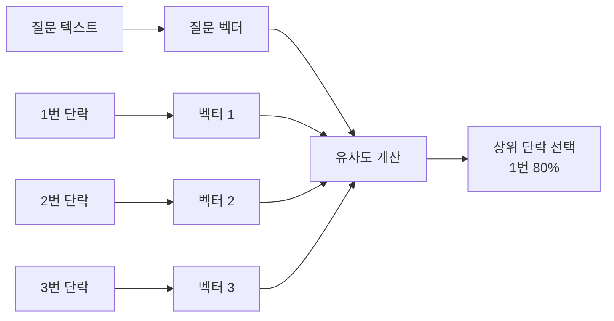
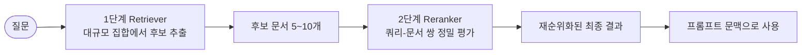

RAG 품질이 나쁠 때 가장 흔한 오진은 LLM을 바꾸는 것이다. 실제로는 대부분의 실패가 그 앞에서 일어난다. **정답 문서가 검색 결과에 아예 들어오지 않았거나, 들어왔는데 순위가 낮았거나** 둘 중 하나다.

이 글은 그 두 실패가 발생하는 구간을 다룬다. 청크를 벡터로 바꾸는 임베딩, 그 벡터를 저장·색인하는 벡터스토어, 질문과 비교해 후보를 꺼내는 검색기, 그리고 꺼낸 후보의 순위를 다시 매기는 리랭커다. 각 단계의 선택지와 튜닝 파라미터, 그리고 무엇이 어떻게 깨지는지를 정리한다. 8단계 전체 지도와 앞 단계(로드·분할)는 [1편](/blog/rag/rag-pipeline-ingestion/)에 있다.

## 용어 정리

| 용어 | 원어 | 뜻 |
|---|---|---|
| 청크 | Chunk | 원본 문서를 검색 단위로 자른 조각. 임베딩·저장·검색의 최소 단위 |
| 임베딩 | Embedding | 텍스트를 고차원 실수 벡터로 바꿔 의미를 수치화한 표현 |
| 벡터스토어 | Vector Store | 임베딩 벡터를 저장·색인하고 유사도 검색을 제공하는 DB |
| 검색기 | Retriever | 질문 벡터와 저장된 벡터를 비교해 관련 청크를 뽑아 오는 컴포넌트 |
| 리랭커 | Reranker | 검색기가 뽑은 후보를 더 정교한 모델로 재채점해 순위를 다시 매기는 2단계 컴포넌트 |
| top-k | top k | 유사도 상위 k개 문서만 반환하는 것. `k`는 반환 개수 파라미터 |
| dense | Dense Retriever | 딥러닝 임베딩 기반 검색. 연속적 고차원 벡터로 의미를 표현 |
| sparse | Sparse Retriever | 키워드 빈도 기반 검색. 대부분의 차원이 0인 희소 벡터를 씀 |
| hybrid | Hybrid Search | dense + sparse를 함께 돌려 점수를 합치는 방식 |
| TF-IDF | Term Frequency-Inverse Document Frequency | 단어의 문서 내 빈도 × 전체 문서에서의 희소성으로 중요도를 계산 |
| BM25 | Best Matching 25 | TF-IDF 개선판. 문서 길이를 보정해 긴 문서/짧은 문서 간 가중치를 조절 |
| 코사인 유사도 | cosine similarity | 두 벡터가 이루는 각도의 코사인. 방향이 같을수록 1에 가까움 |
| MMR | Maximal Marginal Relevance | 관련성과 다양성을 함께 최적화하는 선정 기준. 비슷한 청크의 중복 선택을 억제 |
| ANN | Approximate Nearest Neighbor | 근사 최근접 이웃 탐색. 정확도를 조금 포기하고 검색 속도를 크게 올림 |
| HNSW | Hierarchical Navigable Small World | 대표적인 ANN 인덱스 알고리즘. 계층 그래프를 타고 내려가며 이웃을 찾음 |
| Bi-Encoder | 단일 인코더 | 질문과 문서를 **각각 따로** 인코딩해 벡터로 만든 뒤 유사도만 계산. 사전 인덱싱 가능 → 빠름 |
| Cross-Encoder | 교차 인코더 | 질문과 문서를 **한 입력으로 붙여** 함께 인코딩해 관련성 점수를 산출. 정확하지만 느림 |

## 단계 3 — 임베딩

분할된 청크를 **기계가 다룰 수 있는 수치 형태(벡터)로 변환**해, 질문과 청크 사이의 **유사도 계산**을 가능하게 만드는 단계다.

| # | 이유 | 설명 |
|---|---|---|
| 1 | **의미 이해** | 자연어는 복잡하고 다의적이다. 정량화된 형태로 바꿔야 컴퓨터가 내용과 의미를 처리할 수 있다 |
| 2 | **정보 검색 향상** | 벡터화는 문서 간 유사성 계산에 필수적이다. 관련 문서 검색·최적 문서 탐색이 쉬워진다 |

### 동작 방식

"시장조사기관이 예측한 AI 소프트웨어 시장의 연평균 성장률은 얼마인가"라는 질문이 들어왔다고 하자. 각 단락은 이미 벡터로 표현돼 있다.

```text
1번 단락: [0.1, 0.5, 0.9, ... , 0.1, 0.2]
2번 단락: [0.7, 0.1, 0.3, ... , 0.5, 0.6]
3번 단락: [0.9, 0.4, 0.5, ... , 0.4, 0.3]
```

질문도 같은 방식으로 벡터화한 뒤 유사도를 계산하면 순위가 나온다.

```text
질문 벡터: [0.1, 0.5, 0.9, ..., 0.2, 0.4]

1번: 80%  -> 선택
2번: 30%
3번: 25%
```



### 임베딩 모델 선택

| 구분 | 예시 | 장점 | 단점 |
|---|---|---|---|
| API형 (상용) | `text-embedding-3-small/large` 계열 | 품질 안정, 운영 부담 없음 | 호출 비용, 데이터 외부 전송 |
| 오픈소스 다국어 | BGE-M3, multilingual-e5 | 무료, 온프레미스 가능, 한국어 성능 양호 | GPU·서빙 인프라 필요 |
| 도메인 파인튜닝 | 자체 학습 | 전문 용어 검색 정확도 상승 | 학습 데이터·주기적 재학습 비용 |

| 선택 기준 | 확인할 것 |
|---|---|
| 언어 | 한국어 문서면 다국어/한국어 성능이 검증된 모델인지 |
| 차원 수 | 클수록 표현력↑, 저장·검색 비용↑ |
| 최대 입력 길이 | 청크 크기가 모델 입력 한도를 넘지 않는지 |
| 비용 | 문서 수 × 청크 수만큼 호출된다. 재적재 정책과 직결 |
| 보안 | 내부 문서를 외부 API로 보내도 되는지 |

### 튜닝 포인트

| 포인트 | 내용 |
|---|---|
| 질문·문서 임베딩 일치 | **질문과 문서는 반드시 같은 모델로 임베딩**해야 한다. 다르면 벡터 공간이 달라져 유사도가 무의미 |
| 모델 교체 시 재색인 | 임베딩 모델을 바꾸면 **전체 벡터를 다시 만들어야 한다.** 운영상 가장 비싼 변경 |
| 정규화 | 코사인 유사도를 쓸 거면 벡터 정규화 여부를 확인 |
| 배치 크기 | 대량 적재 시 배치 호출로 처리량 확보 |

### 실패 모드

| 증상 | 원인 | 대응 |
|---|---|---|
| 한국어 질문에 검색 품질이 급락 | 영어 중심 임베딩 모델 | 다국어 모델로 교체 후 전체 재색인 |
| 고유명사·약어 검색 실패 | 임베딩이 희귀 토큰을 잘 표현 못 함 | sparse(BM25) 병행 → 하이브리드 |
| 모델 교체 후 검색이 전부 깨짐 | 기존 벡터와 새 질문 벡터의 공간 불일치 | 재색인 필수. 무중단이면 인덱스 이중 운영 |

```python
# 단계 3: 임베딩(Embedding) 생성
from langchain_openai import OpenAIEmbeddings

embeddings = OpenAIEmbeddings()
```

## 단계 4 — 벡터스토어 저장

생성된 벡터를 **효율적으로 저장·색인**해, 검색 시 관련 문서를 빠르게 찾아내게 만드는 단계다.

| # | 항목 | 설명 |
|---|---|---|
| 1 | **빠른 검색 속도** | 색인화로 대량 데이터 중에서도 관련 정보를 빠르게 검색 |
| 2 | **스케일러빌리티** | 데이터 증가를 수용. 효율적 저장 구조가 성능 저하 없는 확장을 보장 |
| 3 | **의미 검색 지원** | 키워드 기반이 아니라 **의미상 유사한 단락**을 조회 |

세 번째가 텍스트 DB와의 결정적 차이다. "모바일 디바이스에서 동작하는 인공지능 기술을 소개한 기업"을 물었을 때 문서에 "모바일 디바이스"라는 표현이 그대로 없어도 의미가 맞으면 찾아낸다.

### 벡터스토어 선택

| 스토어 | 유형 | 장점 | 한계 |
|---|---|---|---|
| FAISS | 로컬 라이브러리 | 설치 간단, 빠름, 무료. 학습·PoC 기본값 | 서버·권한·동시성 관리 기능 없음 |
| Chroma | 로컬/임베디드 DB | 메타데이터 필터·영속화 편의 | 초대형 규모에는 부적합 |
| pgvector | RDB 확장(PostgreSQL) | **기존 RDB 운영을 그대로 재사용**, 트랜잭션·백업 일원화 | 초대형 벡터 규모에서 튜닝 필요 |
| OpenSearch / Elasticsearch | 검색엔진 | dense + BM25를 **한 엔진에서** 하이브리드로 처리 | 클러스터 운영 부담 |
| Pinecone / Weaviate 등 | 관리형 서비스 | 운영 부담 최소, 확장 용이 | 비용, 데이터 외부 위치 |

> **"어느 벡터스토어가 좋은가"에는 정답이 없다.** 이 선택은 성능 비교표가 아니라 **기존 운영 스택·데이터 규모·보안 요건의 함수**다. 이미 PostgreSQL을 운영 중이라면 pgvector가, 이미 Elasticsearch 클러스터가 있다면 하이브리드를 한 엔진에서 처리하는 쪽이 대체로 총비용에서 앞선다.

다만 "이미 있다"는 전제에는 그 클러스터를 계속 돌리는 비용이 포함된다. 노드 구성·watermark·ILM은 [Elasticsearch 운영과 트러블슈팅](/blog/search-engineering/elasticsearch-operations/)에서 다룬다.

### 튜닝 포인트

| 포인트 | 내용 |
|---|---|
| 인덱스 방식 | 정확(Flat) vs 근사(ANN·HNSW). 규모가 커지면 ANN이 사실상 필수 |
| 거리 척도 | 코사인 / 내적 / L2. 임베딩 모델 권장 척도를 따를 것 |
| 메타데이터 필터 | 부서·기간·문서종류로 사전 필터링하면 정확도와 속도가 동시에 개선 |
| 영속화 | 인메모리만 쓰면 재기동 시 전체 재적재. 저장·로드 경로를 설계 |
| 갱신 전략 | 문서 수정 시 upsert/삭제 키 설계. **청크 ID를 원문 ID에 묶어 둘 것** |

### 실패 모드

| 증상 | 원인 | 대응 |
|---|---|---|
| 재기동하면 검색이 빈 결과 | 인메모리 인덱스를 영속화하지 않음 | 저장·로드 루틴 추가 |
| 삭제된 문서가 계속 검색됨 | 청크 단위 삭제 키가 없음 | 원문 ID ↔ 청크 ID 매핑 관리 |
| 데이터가 커지자 응답 지연 | 전수 비교(Flat) 인덱스 | ANN 인덱스로 전환 |
| 중복 문서가 top-k를 채움 | 동일 문서 재적재 | 적재 전 해시 기반 중복 제거 |

```python
# 단계 4: DB 생성(Create DB) 및 저장
from langchain_community.vectorstores import FAISS

vectorstore = FAISS.from_documents(documents=split_documents, embedding=embeddings)
```

## 단계 5 — 검색기

저장된 벡터 DB에서 **질문과 관련된 문서를 신속·정확하게 찾아내는** 단계다. RAG 시스템의 전반적 성능과 가장 직결되는 지점이다.


| 단계 | 내용 |
|---|---|
| 1. 질문의 벡터화 | 질문을 벡터로 변환. **임베딩 단계와 같은 모델**을 써야 한다. 이 벡터가 검색의 기준점 |
| 2. 벡터 유사성 비교 | 저장된 문서 벡터들과 질문 벡터의 유사성 계산. **코사인 유사도, MMR** 등 |
| 3. 상위 문서 선정 | 유사도 점수 기준 상위 N개 선정 |
| 4. 문서 정보 반환 | 선정 문서의 **내용·위치·메타데이터**를 프롬프트 생성 단계로 전달 |

### Sparse와 Dense — 무엇이 다른가

| 특성 | Sparse Retriever | Dense Retriever |
|---|---|---|
| 표현 방식 | 이산적 키워드 벡터 | 연속적 고차원 의미 벡터 |
| 대표 기법 | TF-IDF, BM25 | 딥러닝 임베딩 + 코사인 유사도 |
| 의미적 처리 | 단어 존재 여부만 고려. 의미적 연관성 미반영 | 문맥·의미를 깊이 파악. 키워드가 정확히 일치하지 않아도 검색 가능 |
| 계산 비용 | 낮음 | 상대적으로 높음 |
| 구현 난도 | 간단 | 임베딩 모델·벡터DB 필요 |
| 품질 의존성 | **키워드 선택에 크게 의존** | 임베딩 모델 품질에 의존 |
| 적합한 질의 | 간단·명확한 키워드 검색 | 복잡한 질문, 자연어 쿼리 |

**TF-IDF**는 단어가 문서에 나타나는 빈도와 그 단어가 몇 개의 문서에서 나타나는지를 반영해 중요도를 계산한다. 자주 나타나면서도 **문서 집합 전체에서는 드물게** 나타나는 단어가 높은 가중치를 받는다.

**BM25**는 TF-IDF를 개선한 모델로, **문서의 길이를 고려**해 검색 정확도를 높인다. 긴 문서와 짧은 문서 간 가중치를 조정해 단어 빈도의 영향을 상대적으로 조절한다.

둘은 우열 관계가 아니다. 서로의 약점을 정확히 메우기 때문에 실무에서는 **둘을 앙상블한 하이브리드가 기본값**이다. 다만 BM25가 세는 「단어」가 무엇인지는 색인 시점에 분석기가 정한다 — 한국어에서 그 토큰을 만드는 형태소 분석기와 사전 구성은 [한글 검색 구현](/blog/search-engineering/korean-text-search/)에서 다룬다.

### 검색기 종류

| 검색기 | 방식 | 강점 | 약점 / 비용 |
|---|---|---|---|
| Dense (벡터) | 임베딩 유사도 | 의미 기반, 동의어·의역에 강함 | 고유명사·숫자·코드에 약함 |
| Sparse (BM25) | 키워드 빈도 | 정확한 용어·약어·품번에 강함 | 표현이 다르면 못 찾음 |
| **Hybrid (Ensemble)** | dense + sparse 점수 결합 | 두 약점을 서로 보완. **실무 기본값** | 가중치 튜닝 필요 |
| MMR | 유사도 + 다양성 | 비슷한 청크 중복 제거, 넓은 근거 확보 | 최상위 관련성이 조금 희생될 수 있음 |
| MultiQuery | LLM이 질문을 여러 개로 재작성 후 각각 검색 | 질문 표현이 애매할 때 회수율↑ | LLM 호출 추가 → 지연·비용 |
| ParentDocument | 작은 청크로 검색 → 부모(큰) 문서를 반환 | 검색 정밀도와 답변 문맥을 동시 확보 | 부모·자식 저장소 이중 관리 |
| Self-Query | LLM이 질문에서 메타데이터 필터를 추출 | "2024년 이후 재무 문서만" 같은 조건 검색 | 스키마 정의 필요 |
| ContextualCompression | 검색 후 관련 문장만 압축 추출 | 프롬프트 토큰 절감, 노이즈 제거 | 추가 모델 호출 |
| 시간가중(Time-weighted) | 최신성 가중 | 뉴스·공지처럼 최신이 중요한 도메인 | 오래된 정답을 놓칠 수 있음 |

### 튜닝 포인트

| 파라미터 | 의미 | 튜닝 방향 |
|---|---|---|
| `k` | 반환할 문서 수 | 보통 3~10. 작으면 근거 부족, 크면 노이즈·비용↑ |
| `fetch_k` | MMR이 후보로 먼저 가져올 수 | k보다 충분히 크게(예: k=4, fetch_k=20) |
| `lambda_mult` | MMR의 관련성 vs 다양성 비중 | 1에 가까울수록 관련성 우선, 0에 가까울수록 다양성 우선 |
| `score_threshold` | 최소 유사도 컷 | 임계 미만이면 아예 반환하지 않아 "모른다" 유도 |
| `search_type` | `similarity` / `mmr` / `similarity_score_threshold` | 중복이 문제면 mmr |
| ensemble `weights` | dense:sparse 비중 | 고유명사 질의가 많으면 sparse 비중↑ |

### 실패 모드

| 증상 | 원인 | 대응 |
|---|---|---|
| 정답 문서가 아예 안 나옴 (recall 실패) | 임베딩 표현 불일치, k 과소 | k 증가, 하이브리드 도입, MultiQuery |
| 정답은 나오는데 순위가 낮음 | 1차 검색의 정밀도 한계 | **리랭커 도입** |
| 상위 k가 거의 같은 내용 | 중복 청크 | MMR 사용, 적재 시 중복 제거 |
| 제품코드·연도 검색 실패 | dense 단독 | BM25 병행 |
| 답변이 오래된 내용 | 최신성 미반영 | 메타데이터 필터·시간 가중 |

```python
# Dense Retriever
faiss_retriever = vectorstore.as_retriever()

# Sparse Retriever
from langchain_community.retrievers import BM25Retriever

bm25_retriever = BM25Retriever.from_documents(split_documents)

# 하이브리드: dense + sparse 결합
from langchain.retrievers import EnsembleRetriever

ensemble_retriever = EnsembleRetriever(
    retrievers=[bm25_retriever, faiss_retriever],
    weights=[0.5, 0.5],
)

# MMR + top-k 설정 예시
mmr_retriever = vectorstore.as_retriever(
    search_type="mmr",
    search_kwargs={"k": 4, "fetch_k": 20, "lambda_mult": 0.5},
)
```

## 보강 단계 — 리랭커

리랭커는 8단계의 정식 번호에는 없지만, 검색기와 프롬프트 사이에 들어가는 **2단계 검색 시스템(Two-Stage Retrieval System)의 핵심 컴포넌트**다. 1차 검색은 빠르지만 정확도가 다소 떨어진다. 리랭커는 그 후보들을 더 정교하게 분석해 **최종 순위를 재결정**한다.



### 두 단계는 무엇이 다른가

| # | Retrieval의 동작 | Reranker의 동작 |
|---|---|---|
| 1 | 질문과 문서를 **각각** 벡터로 인코딩 | Retrieval이 선택한 상위 k개 문서를 입력으로 받음 |
| 2 | 벡터 간 유사도(주로 내적)를 계산 | **각 문서와 원래 질문을 함께** 언어 모델에 입력 |
| 3 | 유사도가 높은 상위 k개 선택 | 관련성을 더 정확하게 평가 |
| 4 | — | 평가 결과에 따라 재정렬 |

핵심 차이는 인코딩 방식이다. Retrieval은 질문과 문서를 **따로** 인코딩하고(Bi-Encoder), Reranker는 **같이** 인코딩한다(Cross-Encoder). 같이 넣기 때문에 문맥을 고려한 심층 의미 분석이 가능하지만, **사전 인덱싱이 불가능해 질의 시점마다 계산**해야 한다.

| 특성 | Retriever (Bi-Encoder) | Reranker (Cross-Encoder) |
|---|---|---|
| 목적 | 관련 문서 빠른 검색 | 정확한 순위 조정 |
| 처리 방식 | 간단한 유사도 계산 | 복잡한 의미 분석 |
| 연산 복잡도 | 낮음 | 높음 |
| 우선순위 | 속도 | 정확도 |
| 입력 형태 | 쿼리와 문서 개별 처리 | 쿼리-문서 **쌍** 처리 |
| 출력 | 후보 문서 대규모 집합 | 정확한 순위와 점수 |
| 확장성 | 높음 | 제한적 |

두 방식을 결합하면 **빠른 속도와 높은 정확도를 동시에** 얻는다. 이것이 2단계 구조를 쓰는 이유 전부다.

### 기술적 특징

| 항목 | 내용 |
|---|---|
| 아키텍처 | 주로 BERT, RoBERTa 등 트랜스포머 기반. 교차 인코더 구조 |
| 입력 형식 | 일반적으로 `[CLS] Query [SEP] Document [SEP]` 형태 |
| 포인트와이즈 학습 | 개별 쿼리-문서 쌍의 관련성 점수를 예측 |
| 페어와이즈 학습 | 두 문서 간의 상대적 관련성을 비교 |
| 리스트와이즈 학습 | 전체 순위 목록을 한 번에 최적화 |

계산 비용은 리랭커 쪽이 높다. BERT 같은 복잡한 모델을 쓰기 때문이다. 그럼에도 전체 시스템 효율이 유지되는 이유는 **선별된 소수 문서만 처리**하기 때문이다.

### 튜닝 포인트

| 포인트 | 권장 / 기준 |
|---|---|
| 1차 검색 후보 수 | **상위 5~10개**를 리랭커에 입력. 계산 비용과 정확도의 균형점 |
| 최종 반환 수 (`top_n`) | 프롬프트에 넣을 최종 문서 수. 보통 3~5 |
| 리랭커 모델 | 오픈소스 Cross-Encoder(ms-marco 계열, BGE-reranker) vs 상용 Rerank API |
| 지연 예산 | 리랭커는 질의당 추가 지연을 만든다. p95 응답시간 목표부터 정하고 후보 수를 역산 |

### 실패 모드

| 증상 | 원인 | 대응 |
|---|---|---|
| 리랭커를 붙였는데 품질이 그대로 | 1차 검색이 정답을 아예 못 가져옴(recall 실패) | **리랭커는 순위만 고친다.** 먼저 검색기를 고칠 것 |
| 응답이 눈에 띄게 느려짐 | 후보 수를 과하게 넣음 | 후보 5~10개로 제한 |
| 전체 문서에 리랭커 적용 시도 | 확장성 한계 | 대규모 데이터셋에 직접 적용은 불가능하다는 전제를 지킬 것 |
| 한국어 질의에서 순위가 이상 | 영어 중심 리랭커 | 다국어 리랭커 사용 |

```python
# 검색기 뒤에 Cross-Encoder 리랭커를 붙이는 구성
from langchain.retrievers import ContextualCompressionRetriever
from langchain.retrievers.document_compressors import CrossEncoderReranker
from langchain_community.cross_encoders import HuggingFaceCrossEncoder

model = HuggingFaceCrossEncoder(model_name="BAAI/bge-reranker-v2-m3")
compressor = CrossEncoderReranker(model=model, top_n=3)

compression_retriever = ContextualCompressionRetriever(
    base_compressor=compressor,
    base_retriever=vectorstore.as_retriever(search_kwargs={"k": 10}),
)
```

여기까지가 근거를 확보하는 구간이다. 확보한 근거를 어떻게 프롬프트에 넣고 답변으로 만드는지는 [3편 프롬프트·LLM·체인](/blog/rag/rag-pipeline-generation/)에서 다룬다.
