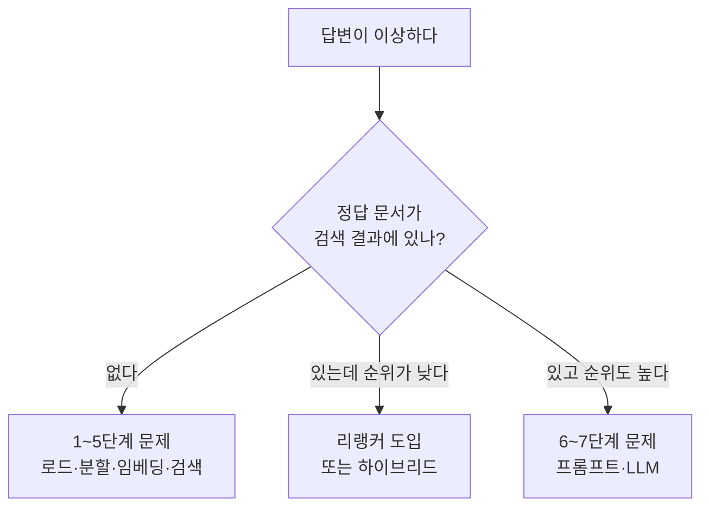

RAG를 설계하다 보면 같은 질문이 반복해서 돌아온다. "청크를 얼마로 잡나", "top-k를 늘리면 안전한가", "임베딩 모델을 바꾸면 어떻게 되나" 같은 것들이다. 이 글은 그 질문들에 결론부터 답하고 근거를 뒤에 붙인다.

절반은 **오해를 교정하는 문항**이다. "청크를 키우면 답이 좋아진다", "리랭커를 넣으면 검색이 좋아진다" 같은 직관이 왜 틀렸는지가 실제로는 더 중요하다. 전체 구조는 [RAG 파이프라인 8단계](/blog/rag/rag-pipeline-ingestion/) 시리즈에 있다. 파싱과 검증 쪽 질문은 [품질 Q&A](/blog/rag/rag-qna-quality/), 비용·관측·거버넌스 쪽은 [운영 Q&A](/blog/rag/rag-qna-operations/)로 나눠 두었다.

## 핵심 수치 정리

설계에서 반복해 등장하는 값들이다. 값만 외우면 응용이 안 되므로 **왜 그 값인지**를 함께 둔다.

| 항목 | 값 | 왜 그 값인가 |
|---|---|---|
| `chunk_size` | 기본 **1000** | 정답이 아니라 출발점이다. 작으면 검색 정밀도가 오르고 답변 문맥이 줄며, 크면 반대다. 질문 유형별 실측으로 정한다 |
| `chunk_overlap` | **50** (chunk_size의 5~20%) | 분할 경계에서 한 문장이 두 청크에 걸쳐 잘리면 어느 쪽도 답이 되지 못한다. 그 손실만 막을 만큼만 겹친다 |
| top-k | **3~10** | k가 작으면 근거가 부족하고, 크면 노이즈가 늘어 답이 흐려지며 비용이 선형 증가한다. 늘리는 대신 리랭커로 상위를 정제하는 편이 낫다 |
| 리랭커 입력 후보 | 상위 **5~10개** | Cross-Encoder는 질의 시점마다 계산하므로 후보 수가 곧 지연이다. 이 구간이 계산 비용과 정확도의 균형점 |
| 리랭커 최종 반환 | **3~5개** | 프롬프트에 실제로 들어갈 문서 수. 컨텍스트 예산에서 역산한다 |
| `fetch_k` (MMR) | k의 **4~10배** | 후보 풀이 넓어야 다양성을 고를 여지가 생긴다. k와 같게 두면 MMR이 사실상 꺼진 상태가 된다 |
| `lambda_mult` (MMR) | 기본 **0.5**, 사실조회 **0.7~0.9** | 1에 가까울수록 관련성 우선. 정답이 한 문서에 있는 조회에서는 다양성이 정답을 밀어낸다 |
| `temperature` | **0에 가깝게** | RAG는 창작이 아니라 근거 기반 추출이다. 무작위성이 높으면 문맥을 벗어난 문장이 섞인다 |
| 하이브리드 가중치 | 벡터 **0.7** / 키워드 **0.3** | 실무에서 반복 관찰되는 기본값. 고유명사·제품코드·약어가 많은 도메인일수록 키워드 비중을 올린다 |
| `score_threshold` | 도메인별 실측 (예: **0.21**) | 임계값이 없으면 무관한 청크도 top-k만큼 채워져 프롬프트에 들어간다 |

## Q. 문서를 통째로 넣지 않고 분할하는 이유는 무엇인가

정확성과 효율성 두 가지다. 그런데 두 번째가 첫 번째로 이어진다는 점이 중요하다.

| # | 이유 | 설명 |
|---|---|---|
| 1 | **핀포인트 정보 검색** | 세분화하면 질문과 연관된 부분만 가져올 수 있다. 각 단위가 특정 주제에 초점을 맞추므로 관련성이 높아진다 |
| 2 | **리소스 최적화** | 전체 문서를 넣으면 비용이 크고, 많은 정보 속에서 효율적으로 발췌하지 못한다. **이것이 할루시네이션으로 이어지기도 한다** |

"구글이 앤스로픽에 투자한 금액은 얼마인가"라는 한 문장에 답하려고 보고서 전체를 넣을 이유가 없다. 넣으면 비용만 드는 것이 아니라 **정보에 파묻혀 답을 못 찾는다.**

## Q. 청크를 크게 하면 답이 좋아지나

아니다. **양방향 트레이드오프**라 한쪽만 좋아지지 않는다.

| 청크 크기 | 검색 정밀도 | 답변 문맥 | 비용 |
|---|---|---|---|
| 작다 | **높음** | 부족 — 답에 필요한 문장이 잘림 | 낮음 |
| 크다 | 낮음 — 한 청크에 여러 주제 혼재 | **충분** | 높음 |

크게 잡으면 문맥은 늘지만 **검색 정밀도가 떨어지고 노이즈·비용이 늘며, 긴 문맥에서는 중간 정보가 묻힌다.** 증상별로 방향이 갈린다.

| 증상 | 조정 |
|---|---|
| 검색은 맞는데 LLM이 "모른다"고 함 | chunk_size 증가 또는 ParentDocument 방식 |
| 관련 없는 내용이 자꾸 딸려옴 | chunk_size 감소 |
| 답이 문장 중간에서 근거가 끊김 | overlap 증가 |

## Q. dense와 sparse 중 무엇을 쓰나

**둘 다 쓴다.** 하이브리드가 실무 기본값이고, 서로의 약점을 정확히 메우기 때문이다.

| 특성 | Sparse (BM25) | Dense (임베딩) |
|---|---|---|
| 표현 방식 | 이산적 키워드 벡터 | 연속적 고차원 의미 벡터 |
| 의미적 처리 | 단어 존재 여부만 고려 | 키워드가 일치하지 않아도 의미로 검색 |
| 계산 비용 | 낮음 | 상대적으로 높음 |
| 강점 | 정확한 용어·약어·품번 | 동의어·의역 |
| 약점 | 표현이 다르면 못 찾음 | **고유명사·숫자·코드에 약함** |

dense 단독으로 가면 제품코드·연도·약어 검색이 조용히 실패한다. 그것이 하이브리드를 기본값으로 두는 이유다.

## Q. BM25는 TF-IDF와 무엇이 다른가

**문서 길이를 보정한다**는 점이 결정적 차이다.

TF-IDF는 단어가 문서에 나타나는 빈도와 그 단어가 몇 개 문서에서 나타나는지를 반영한다. 자주 나타나면서 전체 문서 집합에서는 드문 단어가 높은 가중치를 받는다.

BM25는 여기에 두 가지를 더한다.

| 개선 | 효과 |
|---|---|
| **문서 길이 정규화** | 긴 문서가 단순히 단어를 많이 포함해서 유리해지는 것을 막는다 |
| **TF 포화** | 같은 단어를 도배한 문서가 무한히 점수를 올리지 못하게 한다 |

## Q. 벡터DB 하나면 검색이 다 되나

아니다. dense 단독은 **정확 일치가 필요한 질의에 약하다.**

| 질의 유형 | dense 단독 | 하이브리드 |
|---|---|---|
| "환불 절차가 어떻게 되나요" | 잘 찾음 | 잘 찾음 |
| "모델명 XC60의 배터리 사양" | **자주 실패** | 찾음 |
| "2021년 3분기 실적" | 연도를 놓칠 수 있음 | 찾음 |

임베딩은 희귀 토큰을 잘 표현하지 못한다. 제품코드·약어·연도처럼 **의미가 아니라 문자열 자체가 정답인 경우**에 BM25 병행이 필요하다.

## Q. 임베딩 모델을 바꾸면 어떤 일이 생기나

**전체 재색인이 필요하다.** 운영에서 가장 비싼 변경이다.

| 항목 | 내용 |
|---|---|
| 원인 | 벡터 공간이 달라진다. 질문과 문서가 다른 모델로 임베딩되면 유사도 자체가 무의미해진다 |
| 비용 | 문서 수 × 청크 수만큼 임베딩 API 호출이 다시 발생 |
| 무중단 전략 | 인덱스를 이중 운영하며 전환 |
| 전제 조건 | **질문과 문서는 반드시 같은 모델로 임베딩**해야 한다 |

그래서 "성능 좋은 걸로 아무거나"는 위험한 선택이다. 모델을 고르는 시점에 언어(한국어 문서면 다국어 성능이 검증됐는지), 차원 수, 최대 입력 길이, 비용, 보안을 한 번에 결정해야 한다.

## Q. 벡터스토어는 무엇을 기준으로 고르나

성능 비교표가 아니라 **기존 운영 스택·데이터 규모·보안 요건의 함수**다.

| 스토어 | 유형 | 언제 고르나 |
|---|---|---|
| FAISS | 로컬 라이브러리 | 학습·PoC. 서버·권한·동시성 관리가 필요 없을 때 |
| Chroma | 로컬/임베디드 DB | 메타데이터 필터·영속화가 필요한 소규모 |
| pgvector | RDB 확장 | **이미 PostgreSQL을 운영 중일 때.** 트랜잭션·백업 일원화 |
| OpenSearch / Elasticsearch | 검색엔진 | **하이브리드를 한 엔진에서** 처리하고 싶을 때 |
| Pinecone / Weaviate | 관리형 | 운영 인력이 없고 데이터 외부 위치가 허용될 때 |

세 번째와 네 번째 행이 실무에서 가장 자주 정답이 된다. **이미 운영 중인 것이 있으면 총비용에서 대체로 앞선다.**

## Q. 리랭커는 왜 필요하고 언제 넣나

1차 검색은 **빠르지만 정확도가 떨어지기** 때문이고, **정답이 검색 결과에는 있는데 순위가 낮을 때** 넣는다.


핵심은 두 단계의 역할 분담이다. **Retriever는 넓고 빠르게, Reranker는 좁고 정확하게**다.

## Q. 리랭커를 넣으면 검색이 좋아지나

**1차 검색이 정답을 아예 못 가져오면 아무 소용이 없다.** 리랭커는 순위만 고친다.

그래서 리랭커를 붙이기 전에 진단이 먼저다.

| 상태 | 문제 | 대응 |
|---|---|---|
| 정답 문서가 후보에 **없다** | recall 실패 | k 증가, 하이브리드, MultiQuery, 임베딩 모델 교체 |
| 정답 문서가 후보에 **있는데 순위가 낮다** | precision 문제 | **리랭커 도입** |

"리랭커를 붙였는데 품질이 그대로"라는 증상은 거의 항상 첫 번째 행이다.

## Q. Bi-Encoder와 Cross-Encoder는 어떻게 다른가

**질문과 문서를 따로 인코딩하느냐, 같이 인코딩하느냐**가 전부다.

| 특성 | Bi-Encoder (Retriever) | Cross-Encoder (Reranker) |
|---|---|---|
| 처리 방식 | 질문과 문서를 **각각** 인코딩 후 유사도 계산 | 질문과 문서를 **한 입력으로 붙여** 함께 인코딩 |
| 사전 인덱싱 | 가능 — 문서 벡터를 미리 만들어 둔다 | **불가능** — 질의 시점마다 계산 |
| 연산 복잡도 | 낮음 | 높음 |
| 우선순위 | 속도 | 정확도 |
| 확장성 | 높음 | 제한적 |

같이 넣기 때문에 문맥을 고려한 심층 분석이 가능하지만, 그 대가로 미리 계산해 둘 수 없다.

## Q. Cross-Encoder를 전체 문서에 적용하면 안 되나

**사전 인덱싱이 불가능해 문서 수만큼 실시간 추론이 필요하다.** 이것이 리랭커의 명시적 한계다.

100만 건 인덱스에 Cross-Encoder를 직접 걸면 질의 한 번에 100만 회 추론이다. 그래서 구조가 2단계로 고정된다 — **Bi-Encoder로 5~10개까지 좁힌 뒤에만** Cross-Encoder를 쓴다.

## Q. top-k를 크게 하면 안전하지 않나

아니다. 세 가지가 동시에 나빠진다.

| 영향 | 내용 |
|---|---|
| 답변 품질 | 노이즈가 늘어 답이 흐려진다 |
| 비용 | 입력 토큰이 **선형 증가**한다 |
| 정확도 | 긴 문맥의 **중간 정보가 묻힌다**(Lost in the middle) |

k를 늘리는 대신 **리랭커로 상위만 정제**하는 편이 낫다. 후보를 넓게 가져오되 프롬프트에 넣는 것은 좁히는 구조다.

## Q. MMR은 언제 켜고 λ를 어떻게 정하나

**질의 유형별로 다르게 둔다.** "MMR을 기본으로 켠다"는 선택은 틀렸다.

| λ 값 | 성격 | 적합한 상황 |
|---|---|---|
| **1.0** | 순수 관련성 | 정답이 한 문서에 확실히 있는 정밀 조회 (사번, 주문번호) |
| **0.7~0.9** | 관련성 우선 | **사실 조회형 QA의 권장 구간.** 명백한 중복만 제거 |
| **0.5** | 균형 | 여러 관점을 모아야 하는 요약·비교 질의 |
| **0.2~0.4** | 다양성 우선 | 브레인스토밍, 탐색적 리서치 |

그리고 `fetch_k`를 함께 봐야 한다. **`fetch_k`를 `k`와 같게 두면 MMR은 무력화된다** — 고를 후보가 없으니 유사도 순서를 거의 그대로 내보낸다. k의 4~10배가 기준이다.

MMR을 쓰지 말아야 할 경우도 명확하다. 단일 사실 조회(다양성이 정답을 밀어냄), 인덱스에 문서가 애초에 적을 때(후보 풀이 좁음), 이미 리랭커를 붙였을 때(역할이 겹침)다. 알고리즘의 동작 원리는 [토큰 비용과 MMR](/blog/rag/llm-token-cost/)에 정리했다.

## Q. RAG를 쓰면 할루시네이션이 없어지나

**줄이는** 방법이지 **없애는** 방법이 아니다. 이 구분은 어휘 문제가 아니라 설계 문제다.

| 기법 | 동작 | 한계 |
|---|---|---|
| 근거 한정 지시 | "문맥에서만 답하고 없으면 모른다고 하라" | 무관한 청크가 문맥에 있으면 억지로 연결한다 |
| 출처 역추적 | 답변 근거를 다시 문서에서 찾게 함 | 검색이 틀렸으면 틀린 근거를 확인할 뿐 |

**검색이 틀린 문서를 가져오면 RAG는 오히려 더 그럴듯한 오답을 만든다.** 그래서 생성 단계가 아니라 검색·검증 단계에서 막아야 한다.

## Q. temperature는 기본값을 써도 되나

**0에 가깝게 둔다.** RAG는 창작이 아니라 근거 기반 요약·추출이기 때문이다.

| 값 | 결과 |
|---|---|
| 0에 가까움 | 문맥에 있는 내용을 그대로 옮긴다 |
| 높음 | 무작위성이 커져 **문맥을 벗어난 문장이 섞일 위험**이 커진다 |

같은 이유로 분류·추출·판정 노드도 전부 0으로 둔다. 판정은 특히 재현성이 생명이라, 같은 입력에 같은 결과가 나와야 지표가 의미를 갖는다.

## Q. 문서를 지우면 검색에서도 사라지나

**청크 ID와 원문 ID의 매핑을 관리하지 않으면 사라지지 않는다.**

문서는 청크 단위로 저장되므로, 원문 1개가 인덱스에서는 수십 개의 레코드다. 삭제하려면 그 수십 개를 찾아낼 키가 있어야 한다.

| 설계 시점에 정할 것 | 내용 |
|---|---|
| 청크 ID ↔ 원문 ID 매핑 | 삭제·갱신의 유일한 근거 |
| upsert 전략 | 문서 수정 시 기존 청크를 지우고 다시 넣을지, 덮어쓸지 |
| 중복 제거 | 적재 전 해시 비교. 같은 문서 재적재가 top-k를 잠식한다 |

이것은 나중에 붙일 수 없다. **적재 설계 시점에 정해야 할 문제다.**

## Q. 상용 챗봇에 파일을 올리면 되지 않나

**과정이 블랙박스라 실패 원인을 특정할 수 없다**는 것이 결정적 차이다.

| 비교 축 | 내장 RAG | 직접 구축 |
|---|---|---|
| 과정 공개 | 어떤 과정으로 검색됐는지 알 수 없음 | 단계별 분석·제어 가능 |
| 실패 원인 분석 | 불가 | 어느 단계가 문제인지 특정 가능 |
| 개선 수단 | **문서 형태 변경 정도** | 청킹·임베딩·검색기·리랭커·프롬프트 전부 |

마지막 행이 실무에서 결정적이다. 개선 수단이 "문서 형태를 바꾸는 것"뿐인데 **사내 문서 전체의 형태를 바꾸는 것은 현실적으로 불가능하다.**

## Q. RunnablePassthrough는 왜 필요한가

**입력 하나(질문)가 두 갈래로 갈라져야 하기 때문이다.**

```python
chain = (
    {"context": retriever | format_docs, "question": RunnablePassthrough()}
    | prompt
    | llm
    | StrOutputParser()
)
```

한 갈래는 검색기로 들어가 문맥이 되고, 다른 한 갈래는 **원본 그대로** 프롬프트의 질문 자리로 간다. `RunnablePassthrough`가 그 두 번째 갈래다. 이것이 빠지면 프롬프트의 `{question}` 자리가 비어 버린다.

## Q. 출력파서는 왜 쓰나

**LLM 출력은 자유형식 텍스트라 후속 시스템이 그대로 쓸 수 없기** 때문이다.

| 파서 | 출력 | 쓰임 |
|---|---|---|
| `StrOutputParser` | 문자열 | RAG 기본. 응답 본문만 추출 |
| `JsonOutputParser` | dict | 후속 시스템 연동 |
| `PydanticOutputParser` | 타입 검증된 객체 | **스키마 강제·검증**이 필요할 때 |
| `CommaSeparatedListOutputParser` | list | 키워드·태그 추출 |

파싱이 실패하는 전형적 원인은 LLM이 코드펜스나 설명문을 덧붙이는 것이다. 프롬프트에 형식 지시를 넣고, 스키마 강제가 필요하면 Pydantic 파서로 검증한다.

## Q. RAG 답변 품질이 낮다는 신고가 오면 무엇부터 확인하나

**정답 문서가 검색 결과에 들어 있는지부터 본다.** 이 분기 하나가 이후 진단을 전부 가른다.



| 증상 | 1순위 의심 | 조정 레버 |
|---|---|---|
| 정답 문서를 아예 못 가져옴 | 검색기 / 임베딩 | k↑, 하이브리드, MultiQuery, 모델 교체 |
| 정답 문서 순위가 낮음 | 검색기 | 리랭커, 앙상블 가중치 |
| 근거는 맞는데 문맥이 잘림 | 분할 | chunk_size↑, overlap↑ |
| 문맥에 없는 내용을 지어냄 | 프롬프트 / LLM | 근거 한정 지시 강화, temperature=0 |
| 표·수치 질문만 실패 | 로드 | 구조 보존 로더, 표 전용 처리 |
| 제품코드·약어 검색 실패 | 검색기 | BM25 병행 |

이 순서를 건너뛰고 프롬프트를 고치거나 모델을 바꾸면 **원인과 무관한 곳을 만지게 된다.** 전체 진단표는 [실패 모드 종합 진단](/blog/rag/rag-pipeline-generation/)에 있다.

## 용어 정리

| 용어 | 뜻 |
|---|---|
| RAG | 외부 문서를 검색해 근거로 붙인 뒤 그 범위에서 답하게 하는 구조 |
| 청킹 | 문서를 검색 단위로 자르는 것. 정답값이 아니라 트레이드오프다 |
| 임베딩 | 텍스트를 의미 좌표로 바꾼 것. 질문과 문서를 **같은 모델**로 바꿔야 유사도가 성립한다 |
| 하이브리드 검색 | 키워드(BM25)와 벡터를 함께 쓰는 것. 실무 기본값 |
| 리랭커 | 2단계 검색의 두 번째. 1차 검색이 정답을 못 가져오면 소용이 없다 |
| MMR | 관련성만 보면 상위 결과가 다 비슷해진다. 다양성을 함께 최적화해 중복을 깎는다 |
| Bi-Encoder | 질문과 문서를 각각 인코딩. 사전 인덱싱 가능 → 빠름 |
| Cross-Encoder | 질문과 문서를 한 입력으로 인코딩. 정확하지만 실시간 계산 필요 |
| Lost in the middle | 긴 문맥의 중간 정보를 모델이 놓치는 현상 |
| ParentDocument | 작은 청크로 검색하고 부모(큰) 문서를 컨텍스트로 반환하는 방식 |
