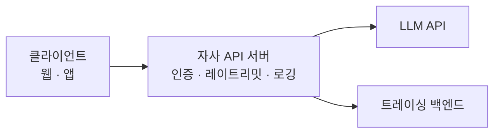
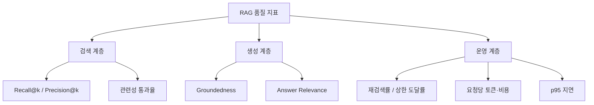
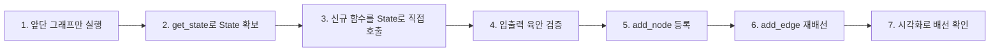
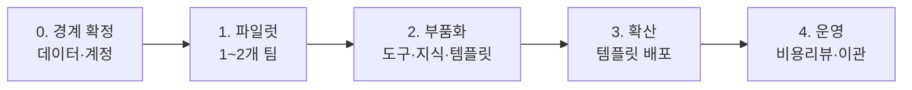

RAG를 만드는 것과 운영하는 것은 다른 문제다. 만들 때는 "어떻게 동작하게 하나"를 묻지만, 운영에서는 **"무엇이 비싸고 무엇이 느린지 어떻게 아나"**, **"6개월 뒤에도 고칠 수 있나"**, **"개발조직이 병목이 되지 않으려면"**을 묻는다.

이 글은 그 질문들을 모았다. 비용 구조와 절감 순서, 관측으로 병목을 가리는 법, 워크플로를 유지보수 가능하게 쪼개는 기준, 그리고 노코드로 확산시키면서 통제를 잃지 않는 설계다.

## 핵심 수치 정리

운영 판단에 반복해 등장하는 값들이다. **왜 그 값인지**를 함께 둔다.

| 항목 | 값 | 왜 그 값인가 |
|---|---|---|
| 출력/입력 단가 배율 | **3배** (모델 티어 무관) | 답변 길이 제어가 프롬프트 축약보다 비용 효율이 높은 경우가 많다는 근거 |
| 모델 티어 간 단가 차 | **10~20배** | 분류·추출을 저가 모델로 내리는 **작업별 라우팅**의 근거 |
| 한국어/영어 토큰 비율 | **1.18~1.49배** | BPE 사전이 영어 코퍼스 중심이라 한국어가 더 잘게 쪼개진다. 언어 난이도 문제가 아니다 |
| 한글 1자 | 약 **3토큰** | 4,096토큰 ≈ 한글 1,350자에서 역산 |
| 128K 컨텍스트 | 한글 약 **A4 28장** | 그런데 출력은 4K — **A4 1장**이 상한. 이 비대칭이 핵심 |
| 양자화 기본값 | **Q4_K_M** | 7B 기준 약 4.1GB. 품질 손실과 용량의 균형점. Q3 이하는 체감 저하 |
| VRAM 간이식 | 파라미터(B) × 비트 ÷ 8 **× 1.2** | 1.2배는 KV 캐시와 프레임워크 오버헤드. 컨텍스트가 길면 더 잡는다 |
| 7B / 70B 필요 VRAM | **6~8GB** / **약 48GB** | Q4_K_M 기준. 전 레이어가 GPU에 올라가는 것을 목표로 잡는다 |
| 하이브리드 가중치 | 벡터 **0.7** / 키워드 **0.3** | 실무에서 반복 관찰되는 기본값. 고유명사가 많을수록 키워드를 올린다 |
| 이터레이션 동시 실행 | 예: **10** | 이 값이 곧 순간 API 호출량. 레이트리밋과 비용 스파이크의 조절 손잡이 |

## Q. RAG 운영 비용을 어떻게 줄이나

**순서가 있다.** 출력 단가가 입력의 3배라는 구조에서 출발한다.

| # | 레버 | 효과 크기 | 트레이드오프 |
|---|---|---|---|
| 1 | **작업별 모델 라우팅** | 최대 10~20배 | 라우팅 로직 유지보수, 저가 모델 품질 검증 |
| 2 | **출력 길이 제어** | 출력 단가가 3배라 체감 큼 | 답변 잘림 |
| 3 | **top-k 축소 + MMR** | k=10→3이면 문서 영역 70% 감소 | 리콜 하락 위험 |
| 4 | **대화 히스토리 절단·요약** | 장기 세션에서 가장 큼 | 이전 맥락 상실 |
| 5 | 프롬프트 캐싱 | 고정 프롬프트가 클수록 | 앞부분을 안정적으로 유지해야 함 |
| 6 | 시스템 프롬프트 영어화 | 한국어 대비 15~35% | 가독성 저하 |
| 7 | 임베딩 결과 캐싱 | 재색인 비용 제거 | 캐시 무효화 정책 필요 |
| 8 | 로컬 LLM 전환 | 볼륨이 클수록 | 인프라·운영 인력 비용 |

**전제는 관측이다.** 프로젝트별 토큰·비용을 먼저 보고 큰 항목부터 손댄다. 실무에서 비용이 새는 지점은 대개 둘 — **대화 히스토리를 자르지 않고 전부 재전송**하는 것과 **top-k를 습관적으로 크게** 잡는 것이다.

## Q. 한국어 서비스에서 토큰 비용이 왜 더 나오나

**BPE 토크나이저가 영어 코퍼스 중심으로 학습됐기 때문**이다. 언어 난이도와 무관하다.

| 토크나이저 | 한국어 토큰 | 영어 토큰 | 배율 |
|---|---|---|---|
| cl100k_base (구세대) | 73 | 49 | 1.49배 |
| o200k_base (신세대) | 53 | 45 | **1.18배** |

대응이 둘이다. **사용자 입력은 못 바꾸니 시스템 프롬프트를 영어로 쓰고**, **토크나이저 세대가 새로운 모델로 간다.** 두 번째가 더 크다 — 모델 교체만으로 한국어 토큰 수가 27% 줄었다.

단가를 비교할 때 **토큰 수 변화까지 함께 봐야** 하는 이유가 여기 있다.

## Q. 컨텍스트가 128K면 긴 문서를 다 넣으면 되나

**두 가지가 걸린다.** 하나는 비대칭이고 하나는 비용이다.

| 항목 | Context Window | max_tokens |
|---|---|---|
| 정의 | 입출력 **합계** 상한 | **출력만**의 상한 |
| 성격 | 모델의 하드 스펙 | 호출 시 지정하는 파라미터 |
| 위반 시 | 요청 자체가 에러 | 답변이 중간에 잘림 |

컨텍스트가 128,000이어도 **출력은 4,096이 상한**인 모델이 있다. 긴 요약은 애초에 한 번에 나오지 않는다.

그리고 넣는 만큼 매 호출 과금되고, 관련 없는 문서가 섞이면 정확도가 오히려 떨어진다. **넓은 윈도우는 여유지 목표가 아니다.** 검색으로 걸러 적게 넣는 것이 여전히 정답이다.

## Q. 온프레미스 LLM은 언제 도입하나

**둘 중 하나가 성립할 때만** 본다.

| 조건 | 내용 |
|---|---|
| **데이터 반출 제약** | 규제·계약상 데이터를 밖으로 못 내보낸다 |
| **볼륨의 예측 가능성** | 호출량이 크고 예측 가능해 변동비를 고정비로 바꾸는 게 유리하다 |

둘 다 아니면 API가 거의 항상 옳다. 여기에 재현성 요건(모델 버전 고정)이 더해지면 로컬이 유리해진다.

손익분기 계산에서 **가장 흔한 오류는 운영 인건비 누락**이다.

```
API 월 비용   = (월 입력토큰 ÷ 1M × 입력단가) + (월 출력토큰 ÷ 1M × 출력단가)
로컬 월 비용  = GPU 감가상각 + 전력비 + 운영 인건비 안분
```

세 번째 항을 빼면 로컬이 항상 이기는 것처럼 보인다. 실제로는 **GPU 하드웨어 비용보다 "이걸 관리할 사람"의 비용이 큰 경우가 많다.** 그래서 조직 규모가 작을수록, 반출 제약이 없으면 API가 합리적이다.

## Q. 양자화하면 성능은 그대로인가

**손실이 있다.** "Q4로 줄여도 같다"는 인식은 틀렸다.

| 등급 | 7B 파일 크기 | 품질 손실 | 용도 |
|---|---|---|---|
| `Q8_0` | 약 7.2 GB | 거의 없음 | 품질을 최대한 지켜야 할 때 |
| `Q5_K_M` | 약 4.8 GB | 작음 | 품질 우선 실무 선택 |
| **`Q4_K_M`** | **약 4.1 GB** | **보통** | **가장 널리 쓰이는 기본값** |
| `Q4_K_S` | 약 3.9 GB | 보통 | VRAM이 빠듯할 때 |
| `Q3_K_M` | 약 3.3 GB | **큼** | 저사양 강행용 |

**Q4_K_M부터 시작**하고 품질이 부족하면 Q5_K_M으로, VRAM이 부족하면 Q4_K_S로 움직인다. **Q3 이하는 체감 저하가 와서 프로덕션 후보가 되기 어렵다.**

## Q. VRAM은 어떻게 산정하고, 부족하면 실행이 불가능한가

산정은 간이식으로 충분하고, **부족해도 동작은 한다. 문제는 속도다.**

```
총 VRAM (GB) ≈ 파라미터 수(B) × 비트수 ÷ 8 × 1.2 + 컨텍스트 여유분
```

| 모델 규모 | 필요 VRAM (Q4_K_M) | 대표 GPU |
|---|---|---|
| 7~8B | **6~8 GB** | RTX 3060 12GB, 4060 Ti |
| 10.8B | 8~10 GB | RTX 3080 10GB, 4070 |
| 34B | 약 24 GB | RTX 3090 / 4090 |
| 70B | **약 48 GB** | A6000 48GB, 또는 4090 ×2 |

1.2배는 KV 캐시와 프레임워크 오버헤드다. **KV 캐시는 컨텍스트 길이에 비례해 선형 증가**하므로 4K로 계산해 두고 32K를 밀어넣으면 예산이 어긋난다.

VRAM이 모자라면 일부 레이어가 CPU로 오프로딩된다. **동작은 하지만 토큰 생성 속도가 수 배에서 수십 배 느려진다.** 따라서 "돌아간다"와 "쓸 만하다"는 다르고, 용량 산정은 **전 레이어가 GPU에 올라가는 조건**을 목표로 잡는다.

## Q. 비동기로 바꾸면 얼마나 빨라지나

**단일 요청의 지연은 줄지 않는다.** 줄어드는 것은 처리량이다.

| 작업 | 비동기 효과 | 이유 |
|---|---|---|
| 다수 문서 임베딩 | **큼** | 네트워크 I/O 대기가 지배적 |
| 다수 질의 일괄 처리 | **큼** | 동일 |
| 여러 리트리버 동시 조회 | **큼** | 독립적 I/O |
| **단일 질의 1건의 응답 시간** | **없음** | 병렬화할 대상이 없다 |
| 로컬 CPU 임베딩 연산 | **없거나 역효과** | CPU 바운드는 GIL 때문에 빨라지지 않는다 |

정확한 표현은 **"I/O 대기가 지배적인 구간을 병렬화해 처리량(throughput)을 높였다"**이다. 문서 5건을 각 2초에 처리하면 순차로는 10초지만 병렬로는 2초 수준으로 수렴한다. 이 둘을 구분하지 못하면 CPU 바운드 구간에 async를 붙여 놓고 왜 안 빨라지는지 묻게 된다.

## Q. RAG가 느린데 어디를 고칠지 어떻게 판단하나

**추측하지 않고 트레이스를 본다.** 전형적인 워터폴이 답을 준다.

| 단계 | 소요시간 | 비중 |
|---|---|---|
| 루트 (전체) | **30.00s** | 100% |
| └ Retriever | 1.08s | **3.6%** |
| └ reorder_documents | 0.00s | 0% |
| └ **LLM 생성** | **28.69s** | **95.6%** |

이 상태에서 벡터 DB를 튜닝하거나 인덱스를 바꾸는 것은 **최대 3.6%를 건드리는 일**이다. 고칠 곳은 모델 교체, 출력 길이 축소, 스트리밍 도입이다.

**관측이 없으면 이 판단을 거꾸로 하기 쉽다.** 눈에 보이는 것이 검색 쪽 코드이기 때문이다. 그래서 기능보다 관측을 먼저 깐다.

## Q. 관측 도구를 프로덕션에 붙일 때 걸리는 것이 있나

**트레이싱은 프롬프트와 검색 문서 원문을 외부 SaaS로 보낸다.**

로컬 LLM을 도입하는 이유가 데이터 반출 통제인 조직이라면, **관측 도구에도 같은 기준을 적용해야 논리가 맞다.**

| 상황 | 대응 |
|---|---|
| 민감 데이터를 다룸 | 마스킹 정책을 걸거나 셀프호스팅 옵션 검토 |
| 둘 다 어려움 | 개발·스테이징에만 붙이고 프로덕션은 자체 지표로 |

LLM 호출만 잠그고 관측 도구는 열어 두는 구성은 통제 목적 자체를 무너뜨린다.

## Q. API 키는 팀에서 어떻게 관리하나

원칙이 넷이고, **프록시가 전제**다.

| 원칙 | 이유 |
|---|---|
| **프로젝트·환경별 키 분리** | 유출 시 폭발 반경 축소, 비용 귀속 |
| **클라이언트에 키를 두지 않기** | 클라이언트 배포물에서 키는 반드시 추출된다 |
| **`.env` + `.gitignore`** | 저장소 히스토리에 남으면 회수 불가 |
| **한도의 이중화** | 조직 예산 + 프로젝트 예산 양쪽에 상한 |



**키를 서버에 가두는 것은 보안만의 문제가 아니다.** 프록시 지점이 있어야 사용자별 쿼터·캐싱·모델 라우팅·감사 로그를 걸 수 있다. 앞의 비용 절감 레버 대부분이 이 지점에서만 구현 가능하다.

예산 상한은 두 단으로 잡는다. **하드 스톱(monthly budget)은 예상치의 1.5~2배, 소프트 경보(email threshold)는 예상치의 1배** 지점이다. 하드 스톱을 예상치에 딱 맞추면 트래픽이 튀는 날 서비스가 통째로 멈춘다.

## Q. LLM 제품 품질을 무엇으로 측정하나

**세 계층으로 나눈다.**



| 계층 | 지표 | 나쁠 때 손대는 곳 |
|---|---|---|
| 검색 | Recall@k | 청크 크기, 임베딩 모델, k, 하이브리드 |
| 검색 | 관련성 통과율 | 검색 품질 전반 |
| 생성 | Groundedness | 프롬프트 제약, 문맥 압축, 인용 강제 |
| 생성 | Answer Relevance | 질문 재해석, 프롬프트 |
| 운영 | **재검색률** | 높으면 **검색 품질 신호** |
| 운영 | **상한 도달률** | 높으면 **폴백 설계 신호** |
| 운영 | 요청당 토큰 | 문맥 압축, 캐싱 |

운영 계층 두 지표를 **신호로 읽는 것**이 특히 유용하다. 전제는 트레이스 수집이고, 기능보다 관측을 먼저 깐다.

## Q. 에이전트 워크플로를 유지보수 가능한 구조로 어떻게 설계하나

**셋을 고정한다.**

| # | 고정할 것 | 효과 |
|---|---|---|
| 1 | 전 구간이 **공용 State 스키마 하나**를 공유 | 그 스키마가 모듈 간 계약이 된다 |
| 2 | 분기·순환·병렬이 있는 단위만 **서브그래프**로 | 단순 변환은 함수로 두는 편이 읽기 쉽다 |
| 3 | 신규 단계 추가가 **노드 한 줄 + 엣지 한 줄** | 확장도 롤백도 두 줄 |

스키마가 안 바뀌는 한 앞뒤 모듈을 회귀 테스트할 필요가 없다. **스키마가 흔들리면 모듈화 자체가 무너진다** — 도메인 전문가와 흐름 엔지니어를 나눈 조직 구조도 다시 한 사람에게 합쳐진다.

## Q. 모듈 경계는 무엇을 기준으로 긋나

**재실행 단위**가 핵심 기준이다.

| 기준 | 쪼개라 | 합쳐라 |
|---|---|---|
| **비용** | 다시 돌릴 일이 잦은 단계 | 비용 없는 문자열 가공 |
| **외부 의존** | API 호출 단위로 격리 | 순수 계산 |
| **교체 가능성** | 모델·파서·검색기 | 고정 로직 |
| **팀 경계** | 담당자 경계 = 모듈 경계 | 한 사람이 다 쓰는 코드 |
| **State 키** | 키 집합이 분리되는 지점 | 같은 키를 계속 주고받는 구간 |
| **관찰 필요** | 중간 결과를 봐야 하는 지점 | 볼 일 없는 구간 |

**매핑 코드가 길어지면 경계를 잘못 그은 신호로 본다.** 억지로 나누면 변환 코드만 늘어난다.

## Q. 서브그래프와 함수는 어떻게 구분하나

**내부에 "흐름"이 있으면 서브그래프, "변환"만 있으면 함수다.**

| 내부에 있는 것 | 판정 |
|---|---|
| 분기 · 순환 · 병렬 · 중간 관찰 중 하나라도 | **서브그래프** |
| 단일 변환 로직, 상태 갱신 없는 계산, LLM 1회 + 후처리 | 함수 |

컴파일된 그래프는 그 자체로 호출 가능 객체라 `add_node("이름", 컴파일된_그래프)`로 바로 꽂힌다. 부모 입장에서 **함수를 넣든 그래프를 넣든 계약은 동일하다** — State를 받아 State 일부를 돌려준다.

## Q. 운영 중인 파이프라인에 신규 단계를 넣어야 한다면

**그래프를 먼저 고치지 않는다.** 순서를 뒤집는 것이 핵심이다.



앞단을 한 번만 실행해 체크포인터에서 상태를 꺼내고, 신규 로직을 **그래프 밖에서 그 상태로 직접 호출**해 눈으로 검증한다. 검증이 끝난 뒤에야 노드로 등록하고 엣지를 재배선하며, **옛 배선은 주석으로 남긴다.**

앞단을 반복 실행하지 않으니 개발 루프가 짧고, 문제가 생기면 두 줄 되돌리면 끝난다.

**성공 조건은 하나다. State 스키마가 그대로면 앞뒤 모듈은 신규 노드의 존재를 모른다.** 신규 노드가 새 키를 요구하는 순간 스키마 변경 → 앞뒤 영향 검토 → 전 구간 회귀가 줄줄이 따라온다.

## Q. 병렬 노드가 결과를 덮어쓰는 문제는 어떻게 막나

**병렬 노드끼리 쓰는 State 키를 분리하거나, 같은 키면 리듀서로 누적 병합한다.**

| 조건 | 이유 |
|---|---|
| 병렬 노드끼리 같은 키를 쓰지 않는다 | 동시에 덮어쓰면 결과가 비결정적 |
| 같은 키를 써야 하면 `operator.add` 등 리듀서 지정 | 누적 병합 |
| 외부 자원 경합 없음 | 같은 파일에 동시 쓰기 금지 |

**리듀서 선택이 곧 동시성 설계다.** 병렬 노드 4개가 각자 결과를 반환하는데 리듀서가 덮어쓰기면 **에러도 없이 셋을 잃는다.** 값 하나만 남는다.

## Q. 멀티에이전트는 무엇이 다른가

**다르지 않다. 서브그래프의 확대 적용이다.**

| 계층 | 대응 |
|---|---|
| 팀 | 그래프(서브그래프) |
| 팀원 | 노드 |
| 위에 | Supervisor가 작업을 할당하고 회수 |

노드가 함수 → 그래프 → 에이전트 팀으로 커질 뿐 **계약은 동일하다.** 그래서 모듈 계약을 잘 잡아 둔 조직이 멀티에이전트로 넘어갈 때 추가 비용이 거의 없다.

화려해 보이는 리서치 에이전트도 뜯어 보면 **모듈 + 병렬 + Human-in-the-loop**의 조합이다.

## Q. 노코드를 왜 쓰나

**코드는 개발조직이 병목이 되기 때문이다.** 노코드는 **병목 리스크를 거버넌스 리스크로 교환**하는 결정이다.

| 축 | 도입 전 | 도입 후 |
|---|---|---|
| 요청 경로 | 현업 → 기획 → 개발 백로그 → 스프린트 | 현업이 직접 제작. 개발은 막힐 때만 |
| 개발조직의 일 | 요청 처리(구현) | 부품 제공 + 가드레일 + 관측 |
| 실패 비용 | 배포 후 발견, 롤백 | 만든 사람이 즉시 확인 |
| **리스크** | 병목·리드타임 | **난립·중복·데이터 유출·비용 폭주** |

그래서 도입 판단의 진짜 질문은 "노코드가 좋은가"가 아니라 **"우리 조직이 거버넌스 리스크를 감당할 준비가 되었는가"**다.

## Q. 어떤 업무를 노코드로 열지 어떻게 정하나

**결과를 사람이 한 번 더 보는 업무는 열고, 결과가 그대로 시스템에 반영되는 업무는 코드로 잠근다.**

| 판단 축 | 노코드 | 코드 |
|---|---|---|
| 누가 유지보수하나 | 업무 담당자 본인 | 개발조직이 소유 |
| 변경 빈도 | 주 단위로 자주 | 분기 단위로 안정 |
| 통제 요구 | 틀려도 사람이 검토 | 고객·정산·계약에 직결 |
| 데이터 민감도 | 공개·사내 일반 | 개인정보·계약·재무 |
| 로직 복잡도 | 분기 10개 이하, 상태 없음 | 다단계 상태·트랜잭션 |

자주 바뀌고 담당자가 직접 고치는 **초안 생성 업무가 1순위**다.

열기로 한 업무 안에서도 **에이전트가 아니라 워크플로우를 표준으로 삼는다.**

| 기준 | 에이전트 | 워크플로우 |
|---|---|---|
| 경로 결정 | LLM(런타임) | 설계자(빌드타임) |
| **비용 예측** | **어려움** | 쉬움 |
| 추적·디버깅 | 어려움 | 노드별 트레이싱 |
| 안전장치 | `max_iteration` | 노드 수 자체가 상한 |

에이전트는 경로와 비용이 런타임에 결정돼 예측이 안 된다. 확산 초기에는 `max_iteration`을 낮게 잡아 제한적으로만 허용한다.

## Q. 노코드로 시작한 것이 커지면 어떻게 하나

**요구사항 발굴 도구로 쓰고, 굳어지면 코드로 이관한다.**

이관 판정 기준은 명확하다. **회귀 테스트가 필요해진 시점**, 즉 품질 게이트가 필요해진 순간이다.

| 신호 | 의미 |
|---|---|
| 사용량이 늘고 요구가 굳어짐 | 이관 검토 시작 |
| 품질을 자동으로 검증해야 함 | **이관 시점** |
| 실패 시 재시도 전략을 세밀하게 짜야 함 | 이관 시점 |

노코드에서도 Query Expansion + 병렬 검색 + Rerank 같은 상급 기법이 노드 조립으로 구현된다. 한계는 기능이 아니라 **품질을 측정하고 실패를 다루는 방식**에서 온다.

## Q. 개발자 없이 굴러가는 AI를 어떻게 통제하나

**금지 목록이 아니라 부품과 관측으로 통제한다.** 3계층이다.

| 계층 | 통제 수단 | 실패 시 증상 |
|---|---|---|
| **사전** | 안전한 도구와 승인된 지식만 제공 | 위험한 조합의 앱이 생김 |
| **배포** | 체크리스트 — 출처 표기·토큰 상한·병렬 수 검증 | 환각·출처 미표기·비용 폭주 |
| **사후** | 트레이싱의 노드별 토큰·지연 정기 리뷰 | 좀비 앱 누적, 비용 잠식 |

가장 강력한 수단은 **워크플로우 도구화**다. 위험한 처리(사내 시스템 호출·개인정보 접근)를 도구 안에 가두고 현업에는 인터페이스만 노출하면, **위험한 조합이 애초에 만들어지지 않는다.**

**배포 계층에서 반드시 잡을 것은 비용 파라미터 셋이다.** 비용 사고의 전형이 여기서 나온다.

| 원인 | 메커니즘 | 예방 |
|---|---|---|
| **이터레이션 병렬 수를 크게 잡음** | 순간 API 호출량 폭주 | 동시 실행 상한을 배포 전 확인 |
| **메모리 창 없이 긴 대화 누적** | 턴이 쌓일수록 입력 토큰 선형 증가 | 윈도우 버퍼 또는 요약으로 절단 |
| 병렬 경로 수 증가 | 소스가 5개면 질문 1회당 LLM 5회 | 경로 수에 상한 |

셋 다 워크플로우 리뷰에서 눈으로 잡히는 항목이라, **배포 전 체크리스트에 명시하는 것만으로 대부분 예방된다.**

사후 계층에서는 **DSL(YAML)을 익스포트해 Git에 올린다.** 노코드 산출물에도 버전관리·리뷰·롤백이 붙고, 노드 추가와 프롬프트 변경이 diff로 보인다. 다만 DSL에는 프롬프트·좌표·UI 상태가 뒤섞여 **가독성이 코드보다 나쁘고**, **API 키나 데이터셋 식별자 같은 민감값이 포함될 수 있어** 저장소에 올리기 전 마스킹 규칙을 먼저 정해야 한다.

**금지로 막으면 확산이 멈추고, 설계로 막으면 안 멈춘다.**

## Q. 전사 AI 도입을 어떻게 확산시키나

**확산은 교육 문제가 아니라 부품 공급 문제다.**



개발조직이 검증된 지식베이스와 워크플로우를 부품으로 만들어 두면 현업은 조립만 하면 된다. **순서를 지키는 것이 절반이다** — 0단계 없이 시작하면 나중에 전부 다시 만들고, 2단계 없이 확산하면 난립한다.

성공 지표는 **만들어진 앱 수가 아니라 개발 개입 없이 완결된 비율**이다. 앱 수는 난립해도 올라가지만 이 비율은 부품이 갖춰졌을 때만 오른다.

그리고 개발조직의 역할이 **구현자에서 플랫폼 제공자로** 바뀐다.

## Q. MCP는 왜 중요한가

**사용자를 사내 챗봇으로 오게 하는 대신, 이미 쓰는 도구 안에 사내 지식을 넣는 방식**이기 때문이다.

| 관점 | MCP 이전 | MCP 이후 |
|---|---|---|
| 사용자 진입점 | 사내 UI로 **찾아와야** 함 | 이미 쓰는 도구 안에서 |
| 채택률 | UI 이동 비용만큼 떨어짐 | 도구 등록 한 번이면 상시 |
| **통제** | 사내 UI 안에서 전부 관측 | **외부 클라이언트 호출 → 관측·인증이 어려워짐** |

채택률이 근본적으로 달라진다. 그리고 **MCP는 앱 안이 아니라 퍼블리시 계층에 붙으므로** 이미 만들어 둔 앱을 코드 한 줄 고치지 않고 노출할 수 있다.

동시에 **확산의 최고 수단이자 통제의 최대 난점**이다. 엔드포인트 URL 하나가 사내 지식 전체에 대한 접근권이 되므로 **URL 자체를 자격증명으로 취급**하고, 어떤 지식베이스를 열지는 **문서 등급 기준으로 별도 승인**한다. 공개 가능 등급만 여는 것이 안전한 출발점이다.

## 용어 정리

| 용어 | 뜻 |
|---|---|
| 컨텍스트 윈도우 | 모델이 한 번에 처리할 수 있는 최대 **입력+출력** 토큰 수 |
| max_tokens | 답변으로 생성 가능한 최대 **출력** 토큰 수. 컨텍스트와 별개 |
| 양자화 | 모델 가중치를 저정밀도로 압축. VRAM 요구량을 결정하는 최대 변수 |
| KV 캐시 | 생성 중 이전 토큰의 어텐션 K/V를 저장하는 버퍼. 컨텍스트 길이에 비례 |
| 지연 / 처리량 | 요청 하나가 끝나는 시간 / 단위 시간당 처리한 요청 수 |
| 트레이스 | 실행의 단계별 도구 호출·입출력·토큰 기록 |
| Reducer | 병렬 노드 반환값을 합치는 규칙. 누적이냐 덮어쓰기냐 |
| Supervisor 패턴 | 감독자 에이전트가 작업을 하위 에이전트에 할당·회수하는 구조 |
| DSL | 노코드 앱 전체를 담은 YAML. 익스포트하면 버전관리가 붙는다 |
| MCP | Model Context Protocol. 외부 AI 클라이언트가 도구를 발견·호출하는 표준 |
