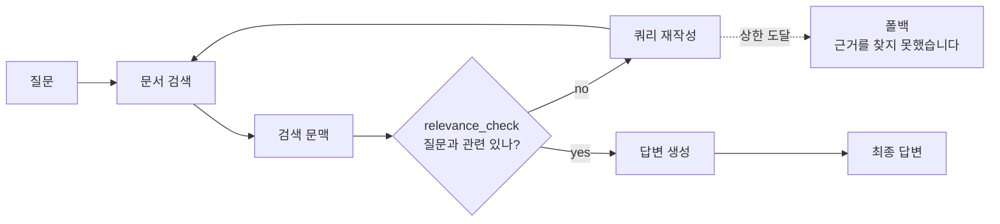
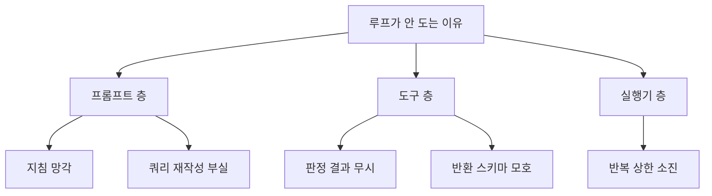

"사내 문서 RAG 정확도가 낮다"는 문제는 대부분 모델이 아니라 그 앞에서 시작된다. 파싱 단계에서 사라진 정보는 뒤에서 복구되지 않고, 검색이 빗나가면 프롬프트를 아무리 다듬어도 그럴듯한 오답이 나온다.

이 글은 품질이 무너지는 두 지점 — **입력 품질**과 **검증 부재** — 에 대한 질문을 모았다. 파싱 산출물을 어떻게 진단하는지, 표와 그림을 어떻게 살리는지, 그리고 판정을 파이프라인에 넣어 할루시네이션을 구조로 막는 방법이다. 전체 맥락은 [문서 파싱](/blog/rag/document-parsing-bottleneck/) 시리즈와 [Agentic RAG](/blog/rag/agentic-rag-relevance-check/) 시리즈에 있다.

## Q. 사내 문서 RAG 정확도가 낮은데 원인을 어디서 찾나

**검색기나 모델보다 파싱 산출물을 먼저 본다.** 순서를 지키는 것이 전부다.


파싱된 마크다운을 열어 표가 구조로 남았는지, 차트가 텍스트로 번역됐는지, 머리말·꼬리말이 제거됐는지 확인한다. **여기서 정보가 사라졌으면 뒤 단계로는 복구가 안 된다.** 그다음이 청킹, 그다음이 검색, 모델은 마지막이다.

대부분의 팀이 4번부터 시작해서 시간을 쓴다. 1번에서 표가 깨져 있으면 2~4번은 볼 필요가 없다.

## Q. 표가 많은 문서는 어떻게 처리하나

**두 벌로 저장한다.** 하나는 마크다운 원본, 하나는 서술형 해설이다.

| 저장물 | 형태 | 용도 |
|---|---|---|
| 표 마크다운 | 기계적 변환, 설명 금지 | **답변 생성용** — 원본 수치 전달 |
| 서술형 해설 | 제목·요약·엔티티·가상질문 | **검색용** — 임베딩 대상 |

이 분리가 필요한 이유는 명확하다. **표 마크다운만 임베딩하면 숫자·기호가 많아 자연어 질의와 유사도가 낮아 검색이 안 되고**, 서술문만 저장하면 답변할 때 정확한 수치가 없다.

질의는 서술문에 걸리고, 답변 생성은 마크다운의 원본 수치를 쓴다. 재현율을 위해 저장 중복을 감수한 의도적 설계다. 구현은 [레이아웃 파서와 Document Graph Parser](/blog/rag/layout-parser-pipeline/)에 있다.

## Q. 그림과 차트는 버려도 되나

**보고서는 핵심 수치가 차트에 있는 경우가 많다.** 실제 분포를 보면 답이 나온다.

| category | 개수 | 비중 |
|---|---|---|
| paragraph | 322 | 69% |
| header + footer | 62 | **13% — 버릴 것** |
| table + chart + figure | 42 | **9% — 정량 정보 대부분이 여기** |
| heading1 | 38 | 8% |

21페이지 산업 리포트를 파싱한 결과다. 표·차트·그림은 9%뿐이지만 **정량 정보의 대부분이 거기 있다.** VLM으로 해설을 생성해 텍스트로 만들면 검색 대상이 된다.

반대로 header·footer 13%는 의도적으로 버린다. 남기면 청크의 13%가 "회사명·페이지번호" 노이즈가 된다. 카테고리별 처리 방침은 [파싱 노드 파이프라인](/blog/rag/layoutparse-nodes/)에 정리했다.

## Q. OCR은 항상 켜야 하나

아니다. **텍스트 레이어가 있는 PDF에 OCR을 켜면 오히려 오탈자가 늘고 비용도 오른다.**

| 문서 유형 | OCR | 이유 |
|---|---|---|
| 텍스트 레이어가 있는 PDF | **끔** | 이미 정확한 텍스트가 있는데 이미지 인식으로 덮어쓸 이유가 없다 |
| 스캔본·이미지 PDF | 켬 | 텍스트 레이어가 없어 다른 방법이 없다 |

기본값을 `ocr: False`로 두고 문서 유형에 따라 분기하는 것이 맞다. "정확도가 오르니까 켠다"는 직관이 여기서는 반대로 작동한다.

## Q. 파싱 비용은 어떻게 통제하나

**파싱은 1회성 비용, 검색은 상시 비용**이라는 구분에서 출발한다.

| 비용 항목 | 통제 수단 |
|---|---|
| 파싱 API | 앞 N페이지만 시험 파싱하는 옵션 |
| VLM 호출 | 배치 처리(10개 단위), `figure`/`chart`/`table`에만 호출 |
| **재실행** | **파싱 결과를 pickle/JSON으로 캐시** → 청킹·임베딩 실험 때 재파싱하지 않음 |
| 모델 선택 | 해설 생성은 소형 멀티모달 모델로 충분 |

세 번째가 실험 비용을 한 자릿수로 떨어뜨린다. 파싱은 페이지당 수 센트에 수 분이 걸리므로, 청킹 전략을 바꿔 볼 때마다 재파싱하면 비용이 배로 든다.

파싱에 페이지당 몇 센트를 더 쓰더라도 **검색 정확도가 오르면 전체적으로 이득**이다. 반대로 문서가 자주 바뀐다면 변경 감지 후 변경분만 재파싱하는 구조가 필요하다.

## Q. 커스텀 로더는 언제 만드나

**표준 로더가 없는 포맷이거나, 파싱 결과에 도메인 후처리가 필요할 때**다.

```python
class CustomDocumentLoader(BaseLoader):
    def __init__(self, file_path: str) -> None:
        self.file_path = file_path

    def lazy_load(self) -> Iterator[Document]:  # <-- 인자를 받지 않는다
        ...
```

규약이 하나 있다. **모든 설정은 `__init__`으로 받는다.** `lazy_load`에 매개변수를 넣지 않는다.

이 규약 덕분에 로더는 "설정이 끝난 객체"가 되어 **파이프라인 어디에 꽂아도 추가 인자 없이 동작한다.** 어기면 로더를 호출하는 쪽이 매번 그 로더의 사정을 알아야 한다. HWP 같은 비표준 포맷의 전체 구현은 [커스텀 Document Loader](/blog/rag/document-parsing-bottleneck/)에 있다.

## Q. 대용량 문서는 어떻게 처리하나

**배치 분할이 기본이고, 파일명에 페이지 범위를 인코딩한다.**

```
report_0000_0009.pdf
report_0010_0019.pdf
```

| 얻는 것 | 내용 |
|---|---|
| 부분 실패 격리 | 100p 중 1p가 실패해도 해당 배치만 재시도 |
| 병렬 처리 | 배치별 동시 호출 가능 |
| 페이지 번호 복원 | **파일명만 파싱하면 전역 페이지 번호가 나온다** |
| API 한도 회피 | 한 번에 보낼 수 있는 페이지 수 제한 대응 |

세 번째가 핵심이다. API는 보낸 파일 기준으로 페이지를 매기므로 40~49페이지를 잘라 보내면 응답은 1~10페이지로 온다. 파일명 끝 9글자에서 시작 페이지를 읽어 오프셋을 더하면 **별도 매핑 테이블 없이** 복원된다.

## Q. 가상질문(hypothetical questions)은 왜 넣나

**질의-문서 유사도보다 질의-질의 유사도가 높기 때문이다.**

"이 표를 보고 사용자가 물어볼 법한 질문"을 미리 생성해 저장하면, 실제 사용자 질문과 **직접 매칭**되어 재현율이 올라간다.

| 비교 | 유사도 |
|---|---|
| 사용자 질문 ↔ 표 마크다운 | 낮음 — 숫자·기호가 많다 |
| 사용자 질문 ↔ 표 서술문 | 중간 |
| 사용자 질문 ↔ **저장된 가상질문** | **높음 — 같은 형태끼리 비교** |

프롬프트에서 `<hypothetical_questions>` 태그로 별도 항목을 만들어 뽑아낸다.

## Q. 요약할 때 숫자가 사라지는 문제는 어떻게 막나

**프롬프트에 명시적으로 요구하고, 원본을 함께 보관한다.** 둘 다 필요하다.

```yaml
5. Summary must include important entities, numerical values.
```

```
Be sure to include numerical values, proper nouns, terms, and terminologies.
```

표 전용 프롬프트에는 이 지시를 SYSTEM과 USER 양쪽에 **중복해서** 넣는다. 요약은 본질적으로 정보를 버리는 연산이고, **모델이 가장 먼저 버리는 것이 숫자**이기 때문이다.

그리고 요약본만 저장하지 않는다. **원본 마크다운을 metadata에 함께 보관**해서 답변 생성 시 원본 수치를 참조하게 한다.

## Q. 파싱 품질을 어떻게 측정하나

파싱 단계와 검색 단계의 지표가 다르다.

| 단계 | 지표 |
|---|---|
| 파싱 | ① header/footer 제거율 ② 표 element 대비 마크다운 변환 성공률 ③ 그림 대비 해설 생성률 |
| 검색 | 정답 청크가 top-k에 들어오는 **재현율을 먼저**, 그다음 정밀도 |

순서가 중요하다. 재현율이 낮은 상태에서 정밀도를 개선해 봐야 **애초에 후보에 없는 정답은 올라오지 않는다.**

배포 전 체크리스트는 이렇게 잡는다.

| 점검 항목 | 실패 시 증상 |
|---|---|
| header/footer/footnote가 제거되었는가 | 청크에 회사명·페이지번호 반복 |
| 표가 마크다운 구조로 남아 있는가 | 숫자만 나열된 텍스트 |
| 그림·차트에 해설 텍스트가 붙었는가 | "자료에 없음" 응답 다발 |
| 페이지 번호가 전역 기준으로 복원됐는가 | 출처 인용이 엉뚱한 페이지 |
| 표가 청크 경계에서 잘리지 않았는가 | 표 절반만 검색됨 |

## Q. 파싱 파이프라인을 왜 그래프로 만드나

**상태 가시성·병렬성·재개** 세 가지 때문이다.

| 이점 | 절차형 스크립트에서는 |
|---|---|
| **상태 가시성** | 어느 단계에서 무엇이 만들어졌는지 로그로만 추정 |
| **병렬 실행** | 이미지 크롭·표 처리가 독립인데 순차로 묶임 |
| **중단·재개** | 100페이지 중 70페이지에서 실패하면 **처음부터 다시** |
| **조건 분기** | 배치 루프를 명령형으로 짜야 함 |

세 번째가 비용에 직결된다. 파싱이 20초에 $0.21이면 재실행마다 그만큼을 다시 낸다. 체크포인터가 있으면 실패 지점부터 재시작한다.

## Q. 프롬프트를 YAML로 빼는 이유는

**프롬프트는 코드가 아니라 설정이기 때문이다.**

| 코드에 f-string으로 박으면 | YAML로 빼면 |
|---|---|
| 문구 하나 바꾸는 데 배포 필요 | 파일 편집만으로 변경 |
| 변경 이력이 코드 diff에 묻힘 | 프롬프트 단위 diff·리뷰·롤백 |
| SYSTEM/USER 구분이 흐려짐 | 역할별 파일 분리 |
| 언어·변수 하드코딩 | `{language}`·`{context}` 변수화 |

버전을 파일명에 붙이고 이전 버전을 지우지 않는 것도 중요하다. **프롬프트 변경은 릴리스**이고, 모델을 안 바꿔도 프롬프트 한 줄로 시스템 동작이 바뀌므로 형상관리가 없으면 장애 원인을 재현할 수 없다. 프롬프트 4종의 설계 의도는 [멀티모달 프롬프트 설계](/blog/rag/multimodal-prompt-design/)에, v1→v4 개정 기록은 [Agentic RAG와 관련성 검증](/blog/rag/agentic-rag-relevance-check/)에 있다.

## Q. 할루시네이션을 어떻게 줄이나

**프롬프트로 억제하는 데는 한계가 있어 파이프라인에 판정 지점을 넣는다.**



검색 결과를 그대로 믿지 않고 별도 저비용 모델로 질문↔문서 관련성을 yes/no로 판정한다. `no`면 쿼리를 다시 만들어 재검색한다. 여기에 검색 문서를 통째로 넣지 않고 **근거 문장만 골라 넣으면** 무관한 문맥에서 억지로 연결하는 경우가 줄어든다.

핵심은 **환각을 생성 단계가 아니라 검색·검증 단계에서 막는 것**이다.

## Q. Naive RAG와 Agentic RAG는 무엇이 다른가

**경로가 고정이냐, 매 턴 결정되느냐**다.

| 구분 | Chain RAG | Agentic RAG |
|---|---|---|
| 실행 경로 | 고정 (검색 → 생성) | LLM이 매 턴 결정 |
| 검색 횟수 | 항상 1회 | 0회~N회 |
| 새 검증 추가 | 파이프라인 재설계 | **도구 하나 추가** |
| 비용·지연 | 예측 가능 | **예측 어려움 (상한 필요)** |
| 실패 모드 | 조용한 오답 | 루프 폭주 / 조기 종료 |

Naive RAG는 검색이 빗나가도 그대로 답을 만든다. Agentic RAG는 판정 결과에 따라 재검색으로 되돌아가는 분기가 생긴다. 대신 **비용과 지연이 예측 불가**해지므로 반복 상한과 폴백을 반드시 같이 설계한다.

## Q. 검증 루프를 넣으면 비용이 많이 들지 않나

**성공 케이스에서는 판정 1회분만 추가된다.**

| 상황 | 추가 비용 |
|---|---|
| 검색이 성공 (평상시) | 저비용 모델 판정 1회 |
| 검색이 실패 | 재검색 × 반복 횟수 |

비용 구조가 **"평상시 소액 고정비 + 실패 시 변동비"**다. 실제로 정상 흐름은 검색·압축·판정 3회 호출로 끝나고, 판정이 계속 실패하는 경우에만 반복이 누적된다. **이것이 검증 루프가 실무에서 성립하는 이유다.**

판정은 저비용 모델에 `temperature 0`으로 돌리므로 부담이 더 작아진다.

## Q. 문맥 압축기가 요약을 잘못하면 더 위험하지 않나

**그래서 압축기에 생성 권한을 주지 않는다.**

검색 결과를 줄 단위로 쪼개 번호를 붙이고, LLM은 관련 있는 줄의 **번호만** 반환하게 한다.

```python
indexed_contexts = [f"[{i+1}] {contexts[i]}" for i in range(len(contexts))]
# LLM 출력: '3,4,5,9,10,15,17,19,21,23'
selected = [contexts[int(i) - 1] for i in answer.split(",")]
```

| 항목 | 원문 재생성 | **인덱스 반환** |
|---|---|---|
| 원문 충실도 | 요약·의역이 섞일 수 있음 | **한 글자도 변형되지 않음** |
| 할루시네이션 | 압축 단계에서 새 환각 유입 | **구조적으로 불가능** |
| 출력 토큰 | 선택 문장 전체 | 20자 내외 |
| 실패 모드 | 조용한 왜곡 | 잘못된 인덱스 → 즉시 티가 남 |

**판정·선별 컴포넌트에는 생성 권한을 주지 않는다**는 것이 일반 원칙이다. 토큰 효과와 한계는 [문맥 추출과 자기교정 루프](/blog/rag/agentic-rag-context-extractor/)에서 수치로 다뤘다.

## Q. 관련성 검증은 무엇과 무엇을 비교하나

**축이 세 개**이고 각각 잡아내는 실패가 다르다.

| 축 | 평가 쌍 | 잡아내는 실패 | 배치 |
|---|---|---|---|
| A | 질문 ↔ 검색문서 | 검색 실패 — 엉뚱한 문서 | **온라인** (재검색 트리거) |
| B | 답변 ↔ 검색문서 | 근거 없는 확장 (groundedness 붕괴) | 오프라인 샘플링 |
| C | 답변 ↔ 질문 | 동문서답 | 오프라인 샘플링 |

세 축을 다 실시간으로 돌리면 **판정 호출이 3배**가 된다. 보통 A축만 요청 경로에 넣고 나머지 둘은 샘플링해 품질 지표로 쓴다. 그래야 지연 예산을 A축만 계산하면 된다.

## Q. 압축을 먼저 하나, 검증을 먼저 하나

**압축 후 검증이 유리하다.** 판정기가 정제된 문맥을 보게 되기 때문이다.

| 순서 | 판정 입력 | 판정 정확도 |
|---|---|---|
| 검증만 | 청크 전량 (예: 61줄) | 노이즈에 흔들림 |
| **압축 → 검증** | 정제 문맥 (예: 10줄) | **근거 밀도가 높아 상승** |

다만 새 위험이 생긴다. **압축에서 근거가 잘리면 잘못된 `no` 판정**이 나온다. 압축기가 관련 문장을 놓치면 판정기는 "관련 없다"고 답할 수밖에 없다.

두 단계를 한 번의 LLM 호출로 합치는 확장도 가능하지만 권하지 않는다. 왕복 1회를 줄이는 대신 **어느 단계가 틀렸는지 분리할 수 없게** 되고, 압축과 판정이 같은 추론 안에서 서로 오염된다. **관측 가능성을 파는 거래는 손해다.**

## Q. 에이전트가 지시한 단계를 건너뛰면 어떻게 진단하나

**프롬프트 / 도구 / 실행기 세 층으로 나눠 본다.**



| 트레이스 상태 | 문제 층 | 대응 |
|---|---|---|
| 판정 도구 호출 기록이 **없다** | 프롬프트 | 핵심 규칙을 앞뒤에 이중 배치 |
| 호출은 됐는데 **결과를 안 따른다** | 도구 | description 개선, 반환 스키마를 구조화 객체로 강제 |
| 정상 동작인데 **끊긴다** | 실행기 | 반복 상한 확인, 폴백 설계 |

이 진단은 답변 텍스트가 아니라 **`tool_calls` 필드를 봐야만** 가능하다. 관찰 지점이 응답 본문이 아니라 메시지 메타데이터에 있다.

## Q. 반복 상한에 걸리면 어떻게 처리하나

**상한 도달을 정상 경로로 취급해 폴백 답변을 낸다.**

기본 동작은 답변 없이 종료 메시지만 나오는 것이다. 서비스에서는 "문서에서 근거를 찾지 못했습니다"를 명확히 응답해야 한다.

그리고 상한 계산에 함정이 있다.

| 오해 | 사실 |
|---|---|
| `max_iterations`는 재시도 횟수 | **도구 호출 횟수**다 |
| 20이면 20번 재검색 | 검색+판정이 1회차이므로 **10번** |

**검증 도구를 늘리면 실질 재시도 횟수가 그만큼 줄어든다.** 도구 3개를 쓰면 20 상한에서 6~7회밖에 못 돈다. 재검색 상한과 전체 상한을 별도로 관리하는 편이 안전하다.

## Q. 검증 루프 로직은 어떻게 테스트하나

**판정 결과를 항상 `no`로 고정하는 스텁 도구를 만든다.**

```python
@tool
def check_relevance_fake(input: str, context: list[str]) -> bool:
    """This is a tool for checking relevance between the user's query and retrieved context."""
    if len(input) % 2 == 0:
        return "no"
    else:
        return "no"
```

두 분기 모두 `"no"`를 반환한다. 관련성이 절대 통과되지 않는 상황을 만들어 **루프가 실제로 도는지, 언제 멈추는지**를 관찰하려는 것이다.

이 스텁으로 돌려 보면 실제 문제가 드러난다. 재작성된 쿼리 10개가 어순과 수식어만 바뀐 **동의어 나열**이었고, 상한에 도달하자 답변 없이 종료됐다.

**루프 로직은 정상 케이스에서는 절대 드러나지 않는다.** 검증 루프를 설계할 때 스텁을 함께 만들어 두는 것이 이식할 만한 습관이다. 실제 트레이스 관측 결과는 [문맥 추출과 자기교정 루프](/blog/rag/agentic-rag-context-extractor/)에 있다.

## Q. 재검색 쿼리가 계속 비슷하게 나오면 어떻게 하나

**LLM은 "다른 쿼리"를 요구받으면 어휘만 바꾼다.** 전략을 명시해야 한다.

| 개선안 | 방식 |
|---|---|
| 이전 쿼리 이력 전달 | 시도한 쿼리 목록을 프롬프트에 누적 제공 |
| **재작성 전략 명시** | "① 상위어로 넓히기 ② 하위어로 좁히기 ③ 동의어 치환 ④ 문서 어휘로 바꾸기" 순서 지정 |
| 검색 파라미터 변주 | k 확대, 다른 인덱스, 키워드 검색 병행 |
| 시도 상한 분리 | 재검색 상한과 전체 상한을 별도 관리 |

같은 어휘의 변형은 **같은 문서를 계속 검색**하므로 재시도가 의미를 갖지 못한다.

## Q. 문서 파서는 무엇을 기준으로 고르나

기능 비교가 아니라 **네 가지 요건**으로 고른다.

| 기준 | 확인할 것 |
|---|---|
| **표 구조 보존** | `colspan`/`rowspan`이 살아 있는 HTML을 주는가 |
| **좌표 제공** | 원본 위치 추적·시각화·재크롭이 가능한가 |
| **언어 지원** | 한국어 문서의 인식 품질 |
| **페이지 단가** | 문서량 × 재파싱 빈도로 총비용 계산 |

선택지는 상용 레이아웃 분석 API, 파싱 지시문을 지원하는 상용 파서, 무료지만 구조가 없는 라이브러리, 클라우드 사업자의 문서 인식 서비스 등이 있다. **표가 답변 품질에 중요하면 속도를 포기하고 구조 보존 쪽을 택한다.**

## Q. 해설 생성에 왜 소형 모델을 쓰나

**추론 난이도가 낮고 호출 수가 많은 작업**이기 때문이다.

| 작업 특성 | 모델 선택 |
|---|---|
| 이미지·표를 보고 설명 생성 | 난이도 낮음, **호출 수 많음** → 소형 |
| 최종 답변 생성 | 난이도 높음, 호출 수 적음 → 대형 |

표·그림 1개당 호출 1회이므로 문서 하나에 수십 회가 나간다. 여기서 대형 모델을 쓰면 비용이 배로 든다.

표 수치 판독 정확도가 문제되면 **표에만 상위 모델을 쓰는 하이브리드**가 가능하다. 전부 올리거나 전부 내리는 선택만 있는 것이 아니다.

## Q. LLM 제품 품질을 무엇으로 측정하나

**세 계층으로 나눈다.**

| 계층 | 지표 | 나쁠 때 손대는 곳 |
|---|---|---|
| 검색 | Recall@k | 청크 크기, 임베딩 모델, k, 하이브리드 |
| 검색 | **Precision@k** | 리랭커, 필터링, score_threshold |
| 검색 | 관련성 통과율 | 검색 품질 전반 |
| 생성 | Groundedness | 프롬프트 제약, 문맥 압축, 인용 강제 |
| 생성 | Answer Relevance | 질문 재해석, 프롬프트 |
| 운영 | **재검색률** | 높으면 **검색 품질 신호** |
| 운영 | **상한 도달률** | 높으면 **폴백 설계 신호** |
| 운영 | 요청당 토큰 | 문맥 압축, 캐싱 |
| 운영 | **p95 지연** | 도구 호출 수, 병렬화, 스트리밍 |

운영 계층 두 지표를 **신호로 읽는 것**이 특히 유용하다. 전제는 트레이스 수집이다.
## 용어 정리

| 용어 | 뜻 |
|---|---|
| layout parsing | 페이지를 픽셀이 아니라 **의미 단위 블록**(제목·문단·표·그림)으로 분해하는 것 |
| element | 레이아웃 파싱의 최소 단위. category + content + coordinates + page + id |
| VLM | Vision Language Model. 이미지를 이해하고 텍스트로 설명하는 모델 |
| hypothetical questions | "이 표를 보고 물어볼 법한 질문". 질문-질문 유사도로 적중률을 올린다 |
| Naive RAG | 검색 → 생성으로 끝나는, 검증 단계가 없는 RAG |
| Agentic RAG | 검색·검증·압축을 도구로 만들고 LLM이 매 턴 경로를 정하는 RAG |
| Relevance Check | 검색 결과·답변이 질문에 실제로 맞는지 별도 모델이 판정하는 단계 |
| Groundedness | 답변이 얼마나 문서 근거에 묶여 있는지의 정도 |
| Context Extractor | 검색 문서 전체가 아니라 **근거 문장만 골라내는** 도구 |
| max_iterations | 실행기가 허용하는 최대 **도구 호출** 횟수. 왕복 횟수가 아니다 |
