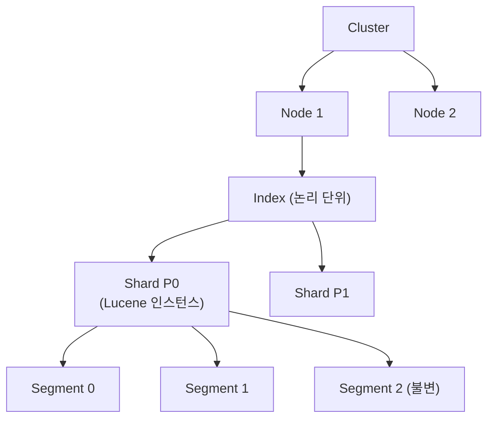
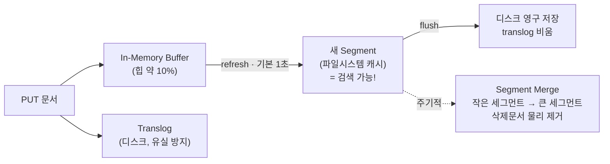
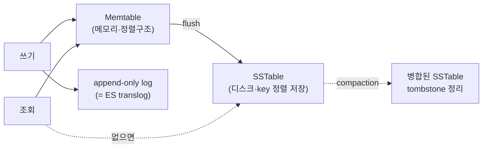
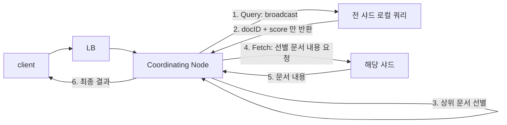

Elasticsearch는 문서를 넣으면 약 1초 뒤부터 검색되고, 수억 건에서도 검색이 수십 밀리초에 끝난다. 이 두 가지는 우연이 아니라 **버퍼-refresh-flush-merge로 이어지는 색인 파이프라인**과 **역인덱스 + 2단계 검색**이라는 구조에서 나온다.

이 글은 그 내부 동작을 도식으로 따라간다. 클러스터 계층, 색인이 디스크에 내려가는 경로, 세그먼트의 불변성, 검색이 두 단계로 나뉘는 이유, 그리고 성능을 가르는 캐시 네 종류를 다룬다. ES를 써 봤지만 "왜 이렇게 동작하는지"가 흐릿한 상태에서 성능·용량 설계를 해야 하는 엔지니어를 위한 글이다.

## 용어 정리

| 용어 | 뜻 |
|---|---|
| 샤드(Shard) | 인덱스를 나눈 물리적 조각. 하나의 샤드 = 하나의 Lucene 인스턴스 |
| 세그먼트(Segment) | 샤드를 이루는 불변(immutable) 역인덱스 파일 단위 |
| 역인덱스(Inverted Index) | "단어 → 문서 목록" 자료구조. 검색이 빠른 이유 |
| refresh | 인메모리 버퍼를 세그먼트로 만들어 **검색 가능** 상태로. 기본 1초 |
| flush | 세그먼트를 디스크에 영구 저장하고 translog를 비움 |
| translog | 장애 복구용 트랜잭션 로그. 버퍼 유실을 막는다 |
| Query then Fetch | 검색 2단계. 먼저 문서ID+점수만 모으고, 필요한 것만 내용을 가져옴 |
| doc_values | 정렬·집계용 컬럼형 자료구조(디스크). fielddata의 메모리 대안 |

## RDB와 Elasticsearch 대응

익숙한 관계형 DB 개념에 대응시키면 구조가 빠르게 잡힌다.

| RDB | Elasticsearch |
|---|---|
| Database / Table | Index |
| Row | Document(JSON) |
| Column | Field |
| Schema | Mapping |
| Partition | Shard |
| Index(B-Tree) | Inverted Index(역인덱스) |
| SQL | Query DSL |

- 계층은 **Index → Document(JSON) → Field(Value) → Term(색인·검색되는 단어 단위)** 순이다.
- 가장 큰 차이는 저장 구조다. RDB는 B+Tree, ES(Lucene)는 **역인덱스 기반 LSM tree**를 쓴다.

## 클러스터 계층 구조

- **1 Node → N Shard → N Segment**. 인덱스는 논리 단위이고, 실제 데이터는 샤드(=Lucene 인스턴스)에 담긴다.
- 하나의 샤드는 그 자체로 완결된 검색엔진이며, 여러 개의 불변 세그먼트로 구성된다.

**노드는 역할로 나뉜다.** 도식의 Node 1·Node 2는 하드웨어 단위일 뿐이고, 각 노드가 무슨 일을 하는지는 역할 설정이 정한다.

| 역할 | 하는 일 | 규모가 커지면 |
|---|---|---|
| master | 클러스터 상태·매핑·샤드 배치를 관리한다. 데이터를 담지 않아도 된다 | **전용 노드로 분리한다.** 데이터 노드가 겸하면 무거운 쿼리가 클러스터 관리를 지연시킨다 |
| data | 샤드를 담고 색인·검색을 실제로 수행한다 | 디스크·힙이 병목이 된다 |
| ingest | 색인 전 전처리 파이프라인(파싱·필드 가공)을 돌린다 | 무거운 전처리는 전용 노드로 뺀다 |
| **coordinating** | 요청을 받아 샤드에 뿌리고 결과를 취합한다. **모든 노드가 기본으로 겸한다** | 취합이 힙을 먹으므로 전용 노드를 앞에 둔다 |

마지막 행이 아래 「검색 동작 과정 — Query then Fetch」에서 일하는 주체다. 별도로 지정하지 않으면 요청을 받은 노드가 그대로 코디네이터가 되므로, **검색이 몰리는 노드가 데이터 노드이면 취합 부하와 검색 부하를 같은 힙에서 감당하게 된다.**

## Primary vs Replica 샤드

| | Primary(주 샤드) | Replica(복제본) |
|---|---|---|
| 역할 | 원본·색인 담당 | 복사본·읽기 분산 |
| 개수 변경 | **생성 후 불가** | 동적 조정 가능 |
| 장애 시 | Replica가 승격 | Primary 장애를 대비 |
| 검색 | 라운드로빈으로 P/R에 분산 | 가용성·검색 처리량↑ |

Primary 개수를 나중에 못 바꾸는 이유는 라우팅 규칙에 있다. 문서 배치가 `hash(_id) % primary_shards`로 정해지므로, 개수가 바뀌면 전 문서의 위치가 어긋난다. 바꾸려면 재색인(reindex)해야 한다.

**그래서 개수 결정이 인덱스를 만드는 순간에 몰린다.** 되돌리는 비용이 재색인이므로, 처음 잡는 값이 사실상 유일한 기회다. 실무에서 쓰는 기준은 셋이다.

| 기준 | 값 | 왜 그런가 |
|---|---|---|
| 샤드 하나의 크기 | **10~50 GB** | 너무 크면 복구·재배치가 느리고, 너무 작으면 샤드마다 붙는 고정 비용(힙·파일 핸들·세그먼트 순회)이 이득을 잡아먹는다 |
| 노드당 샤드 수 | 힙 1 GB당 **20개 이하** | 샤드는 그 자체로 Lucene 인스턴스라 메타데이터가 힙에 상주한다 |
| 총 개수 | 데이터 노드 수의 **배수** | 배수가 아니면 특정 노드에 샤드가 하나 더 얹혀 그 노드가 병목이 된다 |

세 기준이 같은 것을 다르게 말한다. **샤드는 병렬성을 주는 대신 고정 비용을 받는다.** 그래서 「많을수록 빠르다」가 성립하지 않고, 검색이 느려서 샤드를 늘렸다가 더 느려지는 일이 생긴다 — 쿼리가 모든 샤드를 순회한 뒤 코디네이터에서 취합되므로, 샤드가 늘면 취합할 조각도 는다.

시계열 데이터라면 애초에 이 문제를 피할 수 있다. **인덱스를 날짜로 쪼개면**(`logs-2026.09.05`) 개수를 못 바꾸는 제약이 한 인덱스의 수명 안으로 좁아지고, 오래된 인덱스는 통째로 지우면 된다.

## 색인 내부 동작 — 버퍼에서 디스크까지

새 문서는 디스크에 바로 쓰이지 않는다. **성능을 위해 메모리에 모았다가 단계적으로** 내려간다.

**용어 매핑이 헷갈리는 지점** — ES API 이름과 Lucene 내부 동작이 어긋난다.

| ES API | Lucene 내부 | 하는 일 |
|---|---|---|
| **refresh** | Lucene flush | 버퍼 → 세그먼트(파일시스템 캐시). 이 순간부터 **검색 가능**(NRT) |
| **flush** | Lucene commit | 세그먼트를 물리 디스크에 저장, translog 비움 |

- **왜 바로 저장하지 않나**: 디스크 I/O를 줄이고 배치로 묶어 처리하며 롤백을 쉽게 하기 위해서다.
- **NRT(Near Real Time)**: refresh가 기본 1초라, 색인 직후 약 1초 뒤부터 검색된다. `refresh_interval: -1`로 끄면 색인해도 검색 결과가 0건이 된다. 이 성질을 대량 색인에 활용하는 방법은 [ES 운영과 트러블슈팅](/blog/search-engineering/elasticsearch-operations/)에서 다룬다.
- **Translog**: 버퍼는 메모리라 장애 시 날아간다. 그래서 각 요청을 translog(디스크)에도 동시에 적어 두고, flush가 끝나면 비운다.

## 세그먼트 — 불변성이 주는 것

- 세그먼트는 한번 생성되면 **수정 불가(immutable)다**. 업데이트는 "기존 문서 삭제 플래그 + 새 세그먼트에 재색인", 삭제는 플래그로 처리한다.
- **불변성의 이점**: 멀티스레드 동시 읽기에 Lock이 필요 없고, 색인이 빠르며, 동시성 문제가 사라진다.
- **Segment Merge**: 쿼리는 모든 세그먼트를 순회하므로 파일이 많으면 느리다. 백그라운드에서 작은 세그먼트들을 큰 것으로 병합하며 **삭제 플래그가 붙은 문서를 물리적으로 제거**한다.
- **Force Merge**(`POST /idx/_forcemerge`)는 디스크 I/O가 크므로 **쓰기가 끝난 읽기전용 인덱스에만** 쓴다.

## LSM Tree — 왜 쓰기가 빠른가

- Lucene은 검색용 **역인덱스 기반 LSM(Log-Structured Merge) tree**다. RDB의 B+Tree와 대비된다.
- 핵심 아이디어는 **메모리에 먼저 순차로 쓰고(append), 나중에 디스크로 비동기 flush**하는 것이다. 무작위 쓰기보다 순차 쓰기가 훨씬 빠르다.

- **SSTable**은 key로 정렬 저장되어 range 쿼리·조회에 유리하고, **sparse index**(일부 key/offset만 유지)로 빠르게 찾는다.
- 삭제는 **tombstone**(삭제 표식)을 남겼다가 compaction 때 정리한다. ES 세그먼트의 삭제 플래그와 같은 원리다.

## Forward vs Inverted Index

검색이 빠른 근본 이유는 자료구조에 있다.

| | Forward Index(정방향) | Inverted Index(역인덱스) |
|---|---|---|
| 중심 | 문서 → 포함 단어 목록 | **단어 → 포함 문서 목록** |
| 단어로 문서 찾기 | 느림(전체 순회) | **빠름**(term → doc IDs) |
| 문서의 전체 단어 수집 | 유리 | 비효율(정렬·집계 시 전체 스캔) |

- 예를 들어 `james → [문서3, 문서109, 문서3001]` 형태다. 단어로 문서를 찾는 검색엔 최적이지만, "이 문서의 모든 필드 값"을 모으는 정렬·집계엔 약하다.
- **그 약점을 보완하는 두 구조**가 있다.

| 기능 | 저장 위치 | 특징 |
|---|---|---|
| fielddata | 힙(메모리) | text 필드 정렬·집계용. 메모리 큼 → `fielddata: true` 필요, 비권장 |
| **doc_values** | 디스크(컬럼형) | 비-text 필드 기본 활성. 메모리 절감. text는 `keyword` 서브필드로 정렬·집계 |

> 그래서 실무 규칙은 이렇게 굳는다. **정렬·집계할 필드는 `keyword`로** 잡는다(text는 doc_values를 못 써서 fielddata 메모리를 태운다).

## 검색 동작 과정 — Query then Fetch

분산 검색의 핵심 패턴이다. 한 번에 다 가져오지 않고 **2단계**로 나눈다.

- **Query Phase**: 코디네이터가 전 샤드에 broadcast → 각 샤드가 로컬에서 쿼리해 **문서ID + 점수만** 반환 → 코디네이터가 취합·정렬해 상위 N 선별.
- **Fetch Phase**: 선별된 문서의 **실제 내용만** 해당 샤드에서 가져와 합친다.
- **왜 2단계인가**: Query에서 최소 데이터(ID+점수)만 오가 네트워크·메모리를 아끼고, 정말 보여줄 문서만 Fetch하기 때문이다.

**점수는 로컬 샤드에서 계산된다.** BM25의 TF(문서 내 빈도)는 로컬에서 알 수 있지만, IDF(전체 희소성)는 원래 전역 정보가 필요하다. 전역 계산은 비싸서 하지 않고, 데이터가 잘 분산돼 있으면 로컬 IDF도 거의 같아 문제없다. 정확한 전역 점수가 필요하면 `?search_type=dfs_query_then_fetch`를 쓴다.

- **Deep pagination 함정**: `from + size`가 깊어지면 각 샤드가 `from+size`만큼 반환·정렬해야 해서 비용이 **샤드 수 × (from+size)로** 폭증한다. `search_after` + PIT로 회피한다([성능 튜닝 참고](/blog/search-engineering/elasticsearch-operations/)).
- **ARS(Adaptive Replica Selection)**: 느린 복제본(GC·네트워크·디스크 IO 지연)을 피해 응답 빠른 샤드로 라우팅한다.

## 캐시 4종

ES 성능은 캐시 이해에서 갈린다.

| 캐시 | 위치 | 대상 | 비고 |
|---|---|---|---|
| Page Cache | Off-heap(OS) | 디스크에서 읽은 raw 데이터 | ES가 메모리 절반만 쓰는 이유(나머지를 OS 캐시가 씀) |
| Node Query Cache | 힙 | filter 컨텍스트 결과(bitset) | LRU, 최대 힙 10% |
| Shard Request Cache | 힙(샤드) | 집계·suggest 결과 | **`size:0`만 캐싱**, 시계열에 유용 |
| Field Data Cache | 힙 | text 집계·정렬용 fielddata | 메모리 큼, 서킷브레이커 대상 |

그래서 **점수가 필요 없는 조건은 `filter`로** 감싸면 Node Query Cache가 걸려 빨라진다.

## 라우팅 — 문서는 어느 샤드로 가나

- 기본 규칙은 `shard = hash(_routing) % primary_shards`이고, `_routing` 기본값은 `_id`(MurmurHash3)다.
- **custom routing**(`?routing=seoul`): 같은 라우팅 값의 문서를 한 샤드에 모아, 검색 시 그 샤드만 조회한다(메일함·지역 서비스). 단 색인·수정·삭제·검색 모두 라우팅을 넣어야 하며, `_routing.required: true`로 강제할 수 있다.

**대가는 균형이다.** 기본 라우팅이 `_id` 해시인 이유는 그것이 문서를 고르게 흩기 때문이고, custom routing은 그 성질을 일부러 버린다.

| 무엇을 얻나 | 무엇을 내주나 |
|---|---|
| 검색이 샤드 하나만 본다 — 순회 비용과 취합 비용이 사라진다 | 라우팅 값의 분포가 곧 샤드 크기가 된다. 값 하나에 문서가 몰리면 **그 샤드만 비대해진다** |
| 코디네이터가 취합할 조각이 없다 | 비대한 샤드는 쪼갤 수 없다 — Primary 개수를 못 바꾸므로 **재색인 말고는 손쓸 방법이 없다** |

그래서 라우팅 키는 **값의 분포를 먼저 세어 보고** 고른다. 지역·테넌트처럼 자연스러워 보이는 키가 실제로는 한쪽에 쏠려 있는 경우가 흔하다. 위의 샤드 수 기준(하나당 10~50 GB)이 여기서 다시 걸린다 — 평균이 아니라 **가장 큰 라우팅 값**이 그 한도를 정한다.
