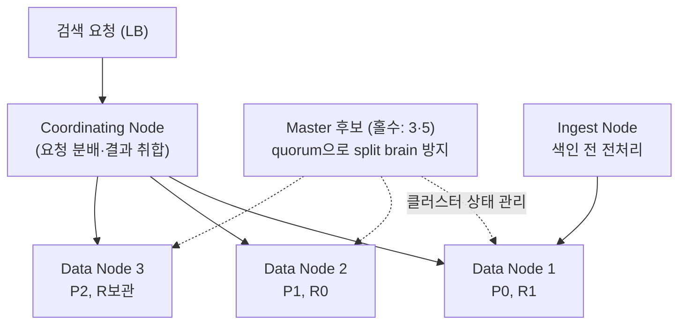
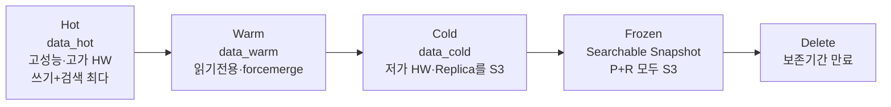
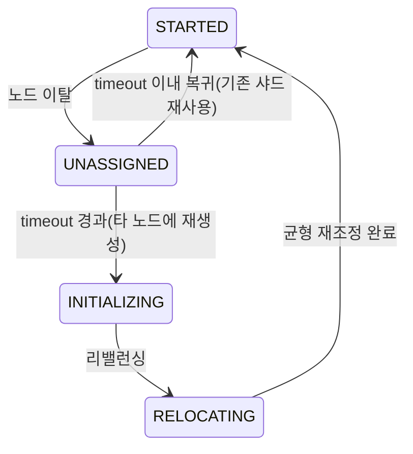
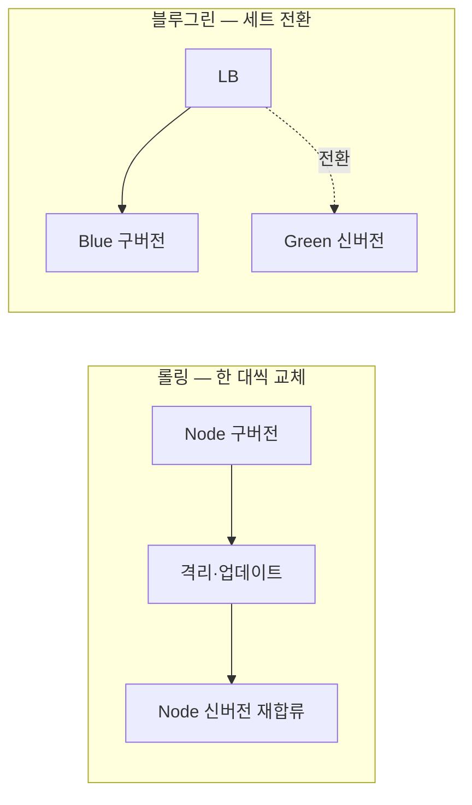
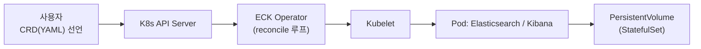
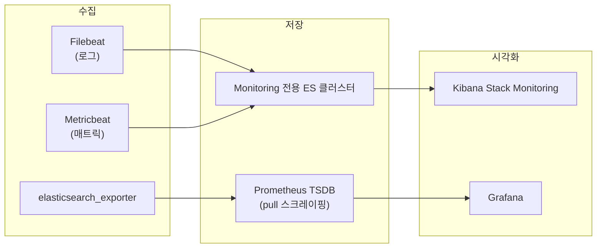

관리형 서비스가 아니라 Elasticsearch 클러스터를 직접 운영하기 시작하면, 검색 품질과 무관한 문제들이 먼저 찾아온다. 노드가 아예 뜨지 않고(`vm.max_map_count`), 어느 날 갑자기 쓰기가 막히고(디스크 flood_stage), 네트워크가 잠깐 끊겼는데 데이터가 갈라진다(split brain).

이 글은 그런 문제들의 원리와 처방을 정리한다. 클러스터 토폴로지·OS 커널 튜닝·샤드 할당·장애복구·배포·모니터링·성능튜닝을 도식과 표 중심으로 다룬다. ES를 자체 인프라에 올려 운영하거나 운영 인계를 앞둔 엔지니어를 위한 글이다. 내부 동작의 배경은 [Elasticsearch 아키텍처](/blog/search-engineering/elasticsearch-architecture/), 검색 기능은 [한글 검색 구현](/blog/search-engineering/korean-text-search/)에서 다룬다.

## 용어 정리

| 용어 | 뜻 |
|---|---|
| Quorum(정족수) | 마스터 선출에 필요한 최소 표수. `(마스터후보수 / 2) + 1` |
| Split Brain | 네트워크 분단으로 마스터가 둘 이상 선출돼 데이터가 갈라지는 장애 |
| Watermark | 디스크 사용률 임계선(low/high/flood_stage). 넘으면 샤드 할당·쓰기 제한 |
| Circuit Breaker | 메모리 과부하를 감지해 요청을 차단, OOM으로 노드 전체가 죽는 것을 방지 |
| ILM | Index Lifecycle Management. 인덱스를 hot→warm→cold→delete로 자동 전이 |
| SLM | Snapshot Lifecycle Management. 스냅샷 자동 생성·보존기간 관리 |
| ECK | Elastic Cloud on Kubernetes. 오퍼레이터 패턴으로 K8s 위에서 ES 운영 |
| CCS | Cross Cluster Search. 하나의 검색을 여러 클러스터로 fan-out |
| Coordinating Node | 검색 요청을 받아 샤드에 뿌리고 결과를 취합하는 노드 |

## 클러스터 토폴로지 — 노드 역할과 마스터 구성

### 노드 역할

Elasticsearch 클러스터는 역할이 다른 노드들의 모임이다. `_cat/nodes?v`의 `node.role` 컬럼이 한 글자씩 역할을 표시한다.

| 문자 | 역할 | 문자 | 역할 |
|---|---|---|---|
| m | master(클러스터 관리·샤드 배치 결정) | h | hot(data_hot) |
| d | data(샤드 보관·검색) | w | warm(data_warm) |
| i | ingest(색인 전 전처리) | c | cold(data_cold) |
| s | content(data_content) | f | frozen |
| l | ml(머신러닝) | r | remote_cluster_client(CCS) |
| t | transform | `*` | 현재 마스터 |

### 마스터 후보 노드 — Quorum과 Split Brain

- **Quorum(정족수)** = `(마스터후보 수 / 2) + 1`. 이 표수 이상이 모여야 마스터를 선출한다.
- **Split Brain**: 짝수 구성에서 네트워크가 분단되면 양쪽이 각각 마스터를 뽑아 데이터가 갈라진다. **홀수 구성 + quorum**으로 막는다.

| 마스터후보 수 | quorum | 네트워크 분단 시 |
|---|---|---|
| 2 (짝수) | 2 | 양쪽 다 정지 (위험) |
| 3 (홀수) | 2 | 다수파만 생존 (안전) |
| 4 (짝수) | 3 | 위험 |
| 5 (홀수) | 3 | 안전 |

**운영 3원칙**은 이렇게 정리된다. ① 마스터 후보는 **3·5 홀수**로 둔다. ② **한 번에 절반 이상 노드를 빼지 않는다**(quorum 미달 시 클러스터 unavailable). ③ 최초 구성 시 `cluster.initial_master_nodes`에 후보를 모두 넣고, **구성 완료 후 제거**한다.

## OS·커널 튜닝 — 운영 모드의 첫 관문

ES는 특정 주소로 바인딩(`network.host`)하는 순간 **운영 모드**가 되어 부트스트랩 체크가 엄격해진다. 아래 커널 설정을 통과하지 못하면 노드가 뜨지 않는다.

| 설정 항목 | 키 / 명령 | 권장값 | 파일 | 목적 |
|---|---|---|---|---|
| 파일 디스크립터 | `nofile` / `ulimit -n` | 65535 이상 | `/etc/security/limits.conf` | "Too many open files"·샤드 미할당 방지 |
| 메모리 락 | `memlock` | unlimited | limits.conf | 힙 스왑 방지(mlockall) |
| 스왑 가중치 | `vm.swappiness` | 1 | `/etc/sysctl.conf` | 스왑 회피 |
| 스왑 비활성 | `swapoff -a` + fstab 주석 | off | `/etc/fstab` | 스왑 완전 차단 |
| ES 메모리 락 | `bootstrap.memory_lock` | true | elasticsearch.yml | 힙을 물리 메모리에 고정 |
| 가상메모리 맵 | `vm.max_map_count` | 262144 | sysctl.conf | mmap 주소공간 부족 방지 |
| TCP 재전송 | `net.ipv4.tcp_retries2` | 5 | sysctl.conf | 노드 장애 빠른 감지 |

- **왜 스왑을 막나**: ES 힙 페이지가 디스크 스왑으로 내려가면 Thrashing(연속 페이지폴트)으로 검색 지연이 급증한다. 확인은 `GET _nodes?filter_path=**.mlockall` → `mlockall: true`.
- **왜 FD를 올리나**: Lucene은 세그먼트 파일을 다수 연다. 부족하면 샤드가 `ALLOCATION_FAILED`로 떨어진다(Windows는 JVM이 관리해 무관, Linux/macOS만 해당).
- **힙 설정 3원칙**: `Xms = Xmx` 동일 / **32GB 초과 금지**(compressed oops 상실) / **총 메모리의 50% 이하**(나머지는 파일시스템 캐시가 써야 검색이 빠르다).

## 샤드 할당·디스크 Watermark·서킷브레이커

### 디스크 Watermark — 용량이 차면 벌어지는 일

| 설정 | 임계 | 동작 |
|---|---|---|
| `cluster.routing.allocation.disk.watermark.low` | 85% | 새 샤드 할당 중단(신규 인덱스는 예외) |
| `...watermark.high` | 90% | 해당 노드의 샤드를 다른 노드로 재배치 |
| `...watermark.flood_stage` | 95% | 인덱스를 read-only로 잠금 |

> 실무에서 "갑자기 인덱스에 쓰기가 안 된다"는 장애의 흔한 원인이 **flood_stage(95%) 도달**이다. 디스크를 비우고 `index.blocks.read_only_allow_delete`를 해제해야 풀린다.

### 샤드 배치 인지(Awareness)

- `allocation.awareness.attributes: zone` — rack/AZ 속성을 인지해 primary와 replica를 다른 AZ에 분산한다.
- **Force Awareness**(`awareness.force.zone.values: KR,JP`): 지정 AZ가 없으면 복제본을 아예 할당하지 않아, 한 AZ가 다운돼도 잔여 AZ가 과적재되지 않게 한다.

### 서킷 브레이커 — OOM 방어선

과부하를 감지해 요청을 끊어 노드 전체가 OOM으로 죽는 것을 막는다.

| 브레이커 | 설정 키 | 한계(예) | 대상 |
|---|---|---|---|
| Parent | `indices.breaker.total.limit` | 95%(real) / 70% | 전체 합산 상한 |
| Field Data | `indices.breaker.fielddata.limit` | 40% | 필드데이터 캐시 로딩 |
| Request | `indices.breaker.request.limit` | 60% | 요청당 집계 자료구조 |
| In-flight | `network.breaker.inflight_requests.limit` | 100% | 전송/HTTP in-flight |

## Hot-Warm-Cold 아키텍처와 ILM

시계열 데이터(로그·주문 등)를 접근 빈도에 따라 다른 스토리지 계층에 나눠 담아 **성능·비용**을 동시에 잡는다.

| Phase | 특징 | node.roles | ILM 예시 |
|---|---|---|---|
| Hot | 쓰기·검색 최다 | `["data_hot"]` | `rollover{max_age:10d, max_size:20gb}` |
| Warm | 쓰기 없음, 읽기전용 | `["data_warm"]` | `min_age:20d, forcemerge{segments:1}` |
| Cold | 거의 검색 안 함 | `["data_cold"]` | `min_age:30d` |
| Delete | 삭제 | — | `min_age:40d` |

- 티어 라우팅: `index.routing.allocation.include._tier_preference: data_hot`. 폴백은 cold→warm→hot 순으로 노드 존재를 검사한다.
- 라이선스 주의: Searchable snapshot·cold/frozen은 **Enterprise**, CCR·ML은 Platinum부터다.

## 장애복구 — Green/Yellow/Red와 복구 절차

### 클러스터 상태의 의미

상태를 결정짓는 것은 대부분 **샤드**다.

| 상태 | 의미 | 흔한 원인 |
|---|---|---|
| 🟢 Green | Primary·Replica 모두 정상 할당 | — |
| 🟡 Yellow | **Replica**가 비정상(Primary는 정상) | 샤드 할당 실패 / 설정 오류 / 디스크 부족 |
| 🔴 Red | **Primary**가 비정상 | 위 3가지 + 레플리카 없는 샤드 손실 |

- **Red 복구 순서**: ① 문제 인덱스 확인 → ② 노드 종료가 원인이면 노드 재시작 → ③ 스냅샷 복구 → ④ 재색인(reindex).

### 노드 유실 시 샤드 복구

핵심 설정은 `index.unassigned.node_left.delayed_timeout`(기본 1m)이다.

- **왜 delayed_timeout이 중요한가**: 롤링 재기동처럼 잠깐 빠졌다 돌아오는 노드 때문에 매번 대량 샤드를 재할당하면 낭비다. `5m`로 늘리면 순간 재기동에서 불필요한 재할당을 억제한다.

### 스냅샷과 SLM

- **스냅샷**은 ES의 **유일한 백업 수단**이다. 외부 저장소(S3·GCS·Azure·HDFS)에 저장한다.
- 스냅샷 T1→T2→T3는 **증분·독립**이다. T1을 지워도 T1 전용 데이터만 삭제되고 T2가 참조하는 데이터는 남는다.
- **One Writer, Many Readers**: 한 저장소에 쓰는 클러스터는 하나여야 한다.
- **gotcha**: 스냅샷 생성 중에는 샤드 할당·리밸런싱이 막혀 **인덱스 생성이 실패**한다. 생성 완료 후 재개된다.
- **SLM**: 주기적 자동 생성 + retention으로 자동 삭제. 버전 호환은 **하위 버전 미지원**이라 복구 대상 클러스터 버전을 맞춰야 한다.

## 배포와 버전 업그레이드

| 방식 | 다운타임 | 자원 | 언제 |
|---|---|---|---|
| 중단(Restart) | 있음 | 1배 | Major 업그레이드, 로컬, 무중단 불필요 서비스 |
| 무중단 롤링(Rolling) | 없음 | 1배 | 점진 배포·자원 최적화, Stateless |
| 무중단 블루그린(Blue/Green) | 없음 | **2배** | 즉시 전환·빠른 롤백 필요 |

- **버전 업그레이드**: 마이너는 하위호환이 되므로 롤링과 짝이다. 메이저는 하위호환이 없어 중단 배포와 짝이고, 비호환 인덱스는 **Archive Functionality**로 대응한다.
- 롤링 시에는 앞 절의 `delayed_timeout`을 함께 조정해 노드 재기동마다 샤드가 대량 재할당되지 않게 한다.

## ECK — 쿠버네티스 위의 Elasticsearch

- **ECK = Elastic Cloud on Kubernetes**: 오퍼레이터 패턴으로 K8s 위에서 Elastic Stack을 선언적으로 운영한다.
- **동작(reconcile)**: 사용자가 CRD(YAML)로 원하는 상태를 선언 → API Server → **ECK Operator**가 감시·조정 → Kubelet이 Pod(ES/Kibana)를 생성·수렴한다.

- **왜 StatefulSet인가**: ES 데이터 노드는 상태(Stateful)를 가지므로 Pod 이름이 `-0, -1, -2`처럼 고정(Ordinal)돼야 PV와 안정적으로 연결된다. Deployment(랜덤 ID)는 Stateless용이다.
- **운영 주의(gotcha)**: `cluster-autoscaler.kubernetes.io/safe-to-evict: false` 애노테이션으로 **K8s Scale In이 ES 데이터 노드를 임의 축출하는 것을 막는다**. 그러지 않으면 스케일 인 때 샤드가 유실된다.

## 모니터링 — 무엇이 죽었는지 어떻게 아는가

- **모니터링 전용 클러스터 분리**: 운영 클러스터가 장애로 죽어도 모니터링 데이터는 별도 클러스터에 남아 조회할 수 있다.
- **Prometheus는 Pull 방식**: exporter를 주기적으로 스크레이핑한다. 구성은 Prometheus server(Retrieval+TSDB) / Alertmanager(→PagerDuty·email) / PromQL / Grafana다.
- **Slow Log**: `index.search.slowlog.threshold.query.warn` 등으로 임계를 설정하고, `X-Opaque-ID` 헤더로 느린 쿼리를 추적한다.

## 성능·색인 튜닝 핵심

### 검색 성능

| 항목 | 튜닝 |
|---|---|
| filter 활용 | 점수 불필요한 조건(range 등)은 `filter`로 → 캐싱·고속 |
| `_source` 제한 | 필요한 필드만 반환 |
| term vs match | keyword엔 `term`(match는 analyze 비용) |
| range 라운딩 | `now-1h/m`, `now/m`로 라운딩 → 캐시 적용 |
| 페이징 | from/size 대신 `search_after`(+PIT), deep pagination 회피 |
| 필드 통합 | `copy_to`로 다수 필드를 단일 필드로 → multi_match 대상 축소 |
| 부하 큰 쿼리 지양 | regexp·wildcard·parent-child·script 쿼리 |

### 색인(대량 적재) 성능

| 항목 | 튜닝 |
|---|---|
| refresh_interval | 전체 색인 시 `5m~10m`(또는 -1, 단 버퍼 가득참 주의) |
| replica | 대량 색인 동안 `number_of_replicas: 0` → 완료 후 복구 |
| Bulk API | 100→200→400 두 배씩 벤치, 요청당 수십MB 이하, 429면 동시량↓ |
| index buffer | `indices.memory.index_buffer_size`(기본 힙 10%) 상향 |
| 하드웨어 | 색인은 disk I/O 의존 → SSD/nVMe, 파일시스템 캐시에 메모리 절반 |

> 대량 색인의 정석은 **"색인 중엔 refresh를 늦추고 replica를 끄고, 끝나면 되돌린다"이다**. [Elasticsearch 아키텍처](/blog/search-engineering/elasticsearch-architecture/)의 색인 내부동작(버퍼→refresh→segment→merge)을 이해하면 자연스럽게 나오는 결론이다.

## 운영에서 실제로 겪는 어려움 (종합)

| 상황 | 증상 | 진단·처방 |
|---|---|---|
| 디스크 flood_stage | 갑자기 쓰기 불가(read-only) | 디스크 확보 + read_only 블록 해제 |
| Split brain | 마스터 둘, 데이터 갈라짐 | 마스터 후보 홀수·quorum 준수 |
| 스왑 발생 | 검색 지연 급증 | swapoff·swappiness=1·memory_lock |
| FD 부족 | 샤드 ALLOCATION_FAILED | ulimit nofile 65535+ |
| Deep pagination | 뒤 페이지 느림·힙 압박 | search_after + PIT |
| 대량 bulk 중 검색 저하 | 429·검색 지연 | bulk 크기 조정·refresh -1·replica 0 |
| Scale In 샤드 유실 | K8s가 데이터 노드 축출 | safe-to-evict: false |
| 스냅샷 중 인덱스 실패 | 인덱스 생성 에러 | 스냅샷 완료 후 재시도 |
