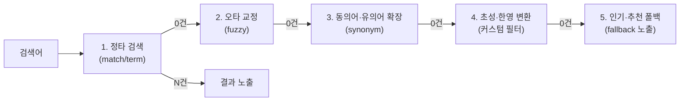

한국어 검색은 공백으로 단어를 자르는 순간부터 깨진다. "서울대학교병원에서"를 그대로 색인하면 "서울대학교"로 검색해도 잡히지 않고, "ㅅㅇㄷ"로 찾는 초성검색이나 "tjfmf"를 "설을"로 읽어주는 한영검색은 Elasticsearch에 기본 기능조차 없다.

이 글은 그 간극을 메우는 구현을 다룬다. 분석기 3단계 파이프라인에서 시작해 Nori 형태소 분석의 실무 함정, 유니코드 자소분해를 이용한 초성·한영검색, 자동완성 네 가지 방식의 트레이드오프, 그리고 "결과가 0건일 때 무엇을 보여줄 것인가"라는 정책 설계까지 이어진다. 한국어 서비스에서 검색 품질을 직접 책임져야 하는 엔지니어를 위한 글이다. 그 아래에서 도는 내부 자료구조는 [Elasticsearch 아키텍처](/blog/search-engineering/elasticsearch-architecture/)에서 다룬다.

## 용어 정리

| 용어 | 뜻 |
|---|---|
| Analyzer(분석기) | 텍스트를 검색 가능한 토큰으로 변환하는 파이프라인 |
| Tokenizer | 문장을 토큰(단어)으로 쪼개는 핵심 단계. 분석기당 **1개만** |
| Token filter | 토큰을 가공(소문자·불용어·동의어·어간 등). 여러 개 연결 |
| Nori | Elasticsearch 공식 한글 형태소 분석기(mecab-ko-dic 기반) |
| 자소분해 | 한글을 초성·중성·종성으로 분해. 초성검색·자동완성의 토대 |
| edge n-gram | 앞에서부터 부분 토큰 생성(cat→c,ca,cat). 자동완성용 |
| fuzzy | 편집거리(오타) 허용 검색 |
| BM25 | ES 기본 유사도 알고리즘. TF-IDF에 문서 길이 보정을 더함 |
| 무결과(Zero-result) | 검색 0건 상황과 그 후처리 정책 |

## 분석기 파이프라인 — 모든 것의 출발점

한글이든 영문이든 검색 품질은 **텍스트를 어떻게 토큰으로 쪼개는가**에서 갈린다. Elasticsearch의 분석기는 3단계 파이프라인이다.


- **핵심 제약**: char filter와 token filter는 여러 개를 연결할 수 있지만, **tokenizer는 딱 1개**다.
- **디버깅은 `_analyze` API**로 한다. `analyzer`/`tokenizer`/`filter`/`char_filter`/`field`/`explain`을 지정하면 각 토큰의 `token`·`start_offset`·`end_offset`·`type`·`position`을 볼 수 있다. 분석기 튜닝의 1차 도구다.

> 순서가 중요한 실무 예가 있다. **복합명사 사전은 소문자로만 등록**되므로, 대문자 입력("MUSINSA")을 분리하려면 **tokenizer 이전(char filter 단계)에서 소문자화**해야 한다. 순서가 틀리면 사전이 매칭되지 않는다.

## text vs keyword — 분석하느냐 마느냐

| | text | keyword |
|---|---|---|
| 분석기 | 적용(토큰화) | **없음**(원문 그대로 1토큰) |
| 예 | "볼보XC60" → [볼보, XC60] | "볼보XC60" → [볼보XC60] |
| 용도 | 전문검색(match) | 정확일치(term)·정렬·집계 |
| 정렬/집계 | fielddata 필요(메모리↑) | doc_values로 기본 지원 |
| 주의 | — | cafe/Cafe/Café를 별개로 인식 |

- 동적 매핑 시 문자열은 자동으로 `text + fields.keyword(ignore_above:256)` 멀티필드가 된다.
- **keyword의 대소문자 문제**는 `normalizer`(keyword 전용 간이 분석기)로 해결한다. `lowercase`·`asciifolding`(à→a)으로 Café/Cafe/cafe를 통일한다.

## 한글 형태소 분석 — Nori

한국어는 조사·복합어 때문에 공백 분리로는 검색이 안 된다. "서울대학교병원에서"를 그대로 색인하면 "서울대학교"로 검색해도 안 잡힌다. **형태소 분석기 Nori**가 이걸 푼다.

- 설치: `bin/elasticsearch-plugin install analysis-nori` (Elastic Cloud는 Extensions에서 체크).
- 구성: `nori_tokenizer` + 토큰 필터(`nori_part_of_speech`, `nori_readingform`, `nori_number`).

**decompound_mode — 복합어를 어떻게 분해할까**

| mode | "가곡" 처리 | 용도 |
|---|---|---|
| none | 가곡 (분해 안 함) | 복합어를 통째로 |
| discard | 가 + 곡 (분해만) | 분해된 형태만 검색 |
| mixed | 가곡 + 가 + 곡 (둘 다) | 원본·분해 모두 매칭 |

**주요 토큰 필터**

| 필터 | 하는 일 | 예 |
|---|---|---|
| `nori_part_of_speech` | 불필요 품사 제거(stoptags: E 어미, J 조사, MAG 부사 등) | "에서" 같은 조사 제거 |
| `nori_readingform` | 한자 → 한글 | 韓國 → 한국 |
| `nori_number` | 한글 숫자 정규화 | 삼천2백2십삼 → 3223 |
| `user_dictionary` | 사용자 사전으로 분해 규칙 지정 | "싼타페TM" → "TM" 검색되게 |

**Nori 실무 함정(gotcha)** — 상용엔진에는 없던, 직접 부딪히게 되는 문제들이다.

- **C++**: 사전에 없고 Nori는 영어 대소문자를 구분 못 해 분석에 실패한다. char filter로 소문자화가 필요하다.
- **강남콩**: 사용자 사전에 '강남'이 있으면 최우선으로 잡혀 "강남+콩"으로 오분석된다. **짧은 단어를 사전에 등록하면 문장 전체에서 우선 분석되는 부작용**이 있다.
- 근본 원인은 사전이다. Nori는 **mecab-ko-dic(1998 세종 말뭉치)** 기반이라 신조어·외래어에 취약하다. 사전을 지속 업데이트해야 한다.

## 자소분해와 초성검색 — 기본 API가 없는 영역

상용 검색엔진에서는 규격으로 주어지지만 Elasticsearch에서는 직접 구현해야 하는 대표 기능이다.

### 한글 유니코드 구조

- 한글 = **초성(19) × 중성(21) × 종성(27+1) = 11,172 음절**. 유니코드 AC00(가)~D7A3(힣).
- 분해 공식: `음절코드 = (초성×21 + 중성)×28 + 종성 + 0xAC00`.
- 역산: `종성 = v%28; 중성 = ((v-종성)/28)%21; 초성 = (((v-종성)/28)-중성)/21`.
- 예: '가' → ㄱ+ㅏ, '갈' → ㄱ+ㅏ+ㄹ.

### 왜 필요한가

- 한글은 1글자 차이로 완전히 다른 단어가 된다(경기대 ≠ 경가대 ≠ 경원대). 철자 오류 대응에 자소 단위가 유리한 이유다.
- **초성검색**: "ㅊㅅ" 입력으로 "초성"을 찾는다. 전화번호부 앱에서 "아이유 → ㅇㅇㅇ"로 찾는 그 기능이다.

### Elasticsearch에는 자소분해 기본 API가 없다

이것이 핵심이다. ES에는 자소분해·초성 추출 기능이 **기본 제공되지 않아 커스텀 플러그인(Java·jar)을 직접 만들어야** 한다. 공개 플러그인 `starstory-analyzer`가 이 필터들을 제공한다.

| 기능 | 필터명 | 입력 → 토큰 |
|---|---|---|
| 초성 추출 | `chosung_filter` | 스타벅스 → ㅅㅌㅂㅅ |
| 자소(자모) 분해 | `jamo_filter` | 스타벅스 → ㅅㅡㅌㅏㅂㅓㄱㅅㅡ |
| soundex(유사발음) | `soundex_filter` | ㅏ/ㅓ 등 통일(내셔널=네셔널) |

- **구현 단계 선택**: 자소분해는 tokenizer 단계에서도 되지만, tokenizer 단계에서 하면 동의어·불용어 필터를 얹기 어렵다('스벅'→'스타벅스' 동의어가 필요하다). 그래서 **token filter 단계가 권장**된다.
- 플러그인은 **ES·Lucene 버전에 종속**이라, `gradle.properties`의 버전(pluginVersion·elasticsearchVersion·luceneVersion)을 맞춰 빌드하고 각 노드에 설치한 뒤 재시작해야 한다.

> 상용엔진에서는 "초성검색"이 규격서 한 줄이지만, Elasticsearch에서는 **유니코드 분해식부터 Java 플러그인 빌드·배포까지** 직접 책임져야 한다. 상용에서 오픈소스로 넘어올 때 가장 크게 체감되는 지점이고, 그 전환 과정은 [상용 검색엔진에서 Elasticsearch로](/blog/search-engineering/search-engineering-in-practice/)에 정리했다.

## 한영검색 — 자판 오타 교정

"tjfmf"를 치면 "설을"을 찾아주는, 한/영 자판 전환 실수를 교정하는 기능이다. 이것도 ES 기본 기능이 아니라 커스텀 플러그인 필터로 구현한다.

| 기능 | 필터명 | 입력 → 변환 |
|---|---|---|
| 영타 → 한글 | `eng2kor_filter` | tmxkqjrtm → 스타벅스 |
| 한타 → 영문 | `kor2eng_filter` | ㄴㅅㅁㄱㅠ… → starbucks |

- 색인 시 이 필터들로 만든 서브필드를 함께 색인해 두고, 검색 시 `multi_match`로 여러 변환 필드를 동시에 질의한다(아래 자동완성 절의 멀티필드 패턴).
- 오타 대응 자체는 fuzzy·동의어·자소분해 수준까지 순수 ES 기능으로 커버되지만, **자판 한영변환은 별도 커스텀 플러그인**(starstory) 영역이다. 즉 "한영검색"은 ES 기본 기능이 아니라 직접 구현 영역이다.

## 자동완성 — 4가지 방식과 선택 기준

자동완성은 **100ms 이내 응답**이 요구되는 기능이다. Elasticsearch는 여러 방식을 제공하며 각각 트레이드오프가 있다.

| 방식 | 원리 | prefix | 중간일치 | 오타 | 비고 |
|---|---|---|---|---|---|
| **ngram** | 글자 단위 전부 분해 | O | O | △ | 토큰 폭발 주의 |
| **edge_ngram** | **앞에서부터만** 분해(cat→c,ca,cat) | O | X | △ | 색인 토큰 적음 |
| **search_as_you_type** | 전용 타입, `_2gram`/`_3gram` 자동생성 | O | O | X | `multi_match`+`bool_prefix` |
| **completion suggester** | FST를 메모리 적재 | O | X | O(fuzzy) | 최고속, weight·context |

**색인용/검색용 분석기 분리 — 자동완성의 핵심 원리**

- **색인 시에만** `edge_ngram`을 붙이고, **검색 시엔 빼는** 것이 정석이다.
- 이유는 이렇다. "커피"를 색인하면 [커, 커피]로 저장되는데, 검색어 "커"에도 `edge_ngram`을 적용하면 [커]가 되어 원하는 대로 부분 매칭된다. 검색어까지 잘게 쪼개면 오히려 오작동한다.

```json
"index_completion":  { "type":"custom", "tokenizer":"standard",
  "filter":["lowercase","trim","autocomplete_edge"] },   // edge_ngram 포함
"search_completion": { "type":"custom", "tokenizer":"standard",
  "filter":["lowercase","trim"] }                          // edge_ngram 제외
```

**멀티필드 병렬 색인 패턴** — 한글 자동완성의 실전 구조다.

하나의 필드(brand, model 등)에 `fields`로 **초성·자모·영타·한타** 서브필드를 병렬로 색인하고, 검색 시 `multi_match`(`cross_fields`, `operator:and`)로 한 번에 질의한다.

| 서브필드 | 색인 analyzer | 검색 analyzer | 목적 |
|---|---|---|---|
| `completion_chosung` | index_completion_chosung | search_completion_chosung | 초성 자동완성 |
| `completion_jamo` | index_completion_jamo | search_completion_jamo | 자소 자동완성 |
| `completion_eng2kor` | index_completion | search_completion_eng2kor | 영타 자동완성 |
| `completion_kor2eng` | index_completion | search_completion_kor2eng | 한타 자동완성 |

- **클라이언트 최적화**: "아이폰" 한 단어에도 자소 포함 최대 7회 API 호출이 발생한다. **debouncing**(입력 멈춤 후 요청)·**throttling**(빈도 제한)으로 서버 부하를 줄인다. 최근검색어는 `localStorage`로 서버 부하를 던다.

## 오타·유사도

### Fuzzy 검색 (편집거리)

ES는 **Damerau-Levenshtein distance**(변경·삭제·추가 + 인접문자 **전치**를 1연산으로) 기반으로 오타를 허용한다.

| 파라미터 | 의미 |
|---|---|
| `fuzziness: AUTO` | 텀 길이별 편집거리: 0~2자=완전매칭, 3~5자=거리1, >5자=거리2 |
| `prefix_length` | 시작 N글자는 고정(**클수록 크게 빨라짐**, 단 앞부분 오타는 못 잡음) |
| `max_expansions` | 생성 변형본 수 상한(줄일수록 빠름) |
| `transpositions` | 인접 두 문자 위치 교환 허용 |

- **gotcha**: 퍼지 대상은 **간단한 분석기**만 써야 한다(ngram·동의어와 조합하면 이상 결과가 나온다). 일반 match보다 느리다.

### BM25 vs TF-IDF (유사도 알고리즘)

| | TF-IDF | BM25 (ES 7.0+ 기본) |
|---|---|---|
| 개념 | TF × IDF | TF-IDF 확장 |
| 문서 길이 보정 | **없음**(긴 문서 유리) | **있음**(k1·b로 정규화) |
| TF 포화 | 무한 증가 | 포화(단어 도배 방어) |

- BM25 식: `IDF × ((k1+1)·TF / (k1·(1-b+b·docLen/avgLen) + TF))`.
- **커스텀 유사도**: "test"를 검색했는데 "test_test"가 먼저 뜨거나 "아이폰 아이폰 아이폰" 도배 문서가 상위에 오면, `scripted` similarity로 TF 영향을 줄인다(예: `1/sqrt(docLen)`만 사용). `explain:true`로 점수를 분해해 확인한다.

## 랭킹·스코어 제어

기본 점수(BM25)만으로 부족할 때 `function_score`로 비즈니스 로직을 얹는다.

| 함수 | 용도 |
|---|---|
| `script_score` | 스크립트로 커스텀 점수 |
| `field_value_factor` | 필드 값(평점·판매량)을 점수에 반영 |
| `random_score` | 추천 리스트 셔플(seed로 재현) |
| `decay`(gauss/exp/linear) | 거리·최신성 가중(가까울수록·최근일수록↑) |
| `rank_feature`(saturation/log/sigmoid) | 숫자 신호를 랭킹에 결합 |

- **결합 방식 2축**: `score_mode`(함수들 간: multiply/sum/avg/max...) × `boost_mode`(쿼리 점수와: multiply/replace/sum...).
- 맛집 검색 예: `geo_point` + `gauss` decay(origin=위치, scale=5km) + 카테고리 가중을 조합하면 가깝고 취향 맞는 곳이 상위로 온다.

## 무결과 처리 — "결과가 없을 때 무엇을 보여줄 것인가"

상용엔진에는 무결과 처리 규격이 있지만 Elasticsearch에서는 **정책을 직접 설계**해야 한다. 검색 0건은 이탈로 직결되므로, 단계적 폴백(fallback)으로 "뭐라도" 보여준다.



**무결과를 줄이는 ES 수단들**

| 수단 | 하는 일 |
|---|---|
| 동의어(synonym) | 오타·이표기를 정타로 매핑("횬대"→"현대"). 0건을 살리는 1차 수단 |
| significant_terms | **연관 검색어** 제안. 전경/배경 빈도 비교로 특이도 산정(단순 빈도 아님) |
| 큐레이션(Promoted) | 운영자가 특정 결과를 수동 상단 고정(관련성 무시) |
| 큐레이션(Hidden) | 특정 문서를 검색에서 제외 |
| 존재 확인 팁 | `size=0&terminate_after=1`로 첫 매칭에서 샤드 종료 → 필터 UI 활성화 판단 빠르게 |

- **선택값만 있고 검색어 없을 때**(필터 브라우징): `must`를 비우고 `filter`에 `terms`만 넣어 점수 없이 결과만 좁힌다(캐시 이득).
- **주의**: Promoted 큐레이션은 관련성 점수를 무시하고 무조건 상단이라, 남용하면 검색 품질이 왜곡된다.

## 동의어·불용어·사용자사전 — 색인 시 vs 검색 시

같은 사전이라도 **언제 적용하느냐**가 트레이드오프를 가른다.

| | 색인 시 적용 | 검색 시 적용 |
|---|---|---|
| 장점 | 검색 성능↑(확장 리소스 불필요) | **실시간 업데이트** 가능 |
| 단점 | 인덱스 커짐·term 통계 왜곡·**Reindex 필요** | 검색 시 확장 비용 |
| 권장 | 안정적 사전은 색인 시가 관리 유리 | 자주 바뀌면 검색 시 |

- **updatable synonym**: `search_analyzer`에 `synonym`(`updateable:true`, 파일 기반)을 두고, 사전 변경 시 `_reload_search_analyzers` + `_cache/clear?request=true`로 **재색인 없이 실시간 반영**한다.
- 동의어 표현 2방식: 동등관계 `"A, B"`(양방향) / 치환 `"A => B"`(단방향). `synonym_graph`가 권장된다.
- 불용어(stop): 검색 노이즈·금칙어 제거(`type:stop`, `stopwords_path`).
- 사용자사전(user_dictionary): "싼타페TM"을 등록하면 "TM" 검색에 노출되게 하는 등 도메인 어휘를 보강한다.
