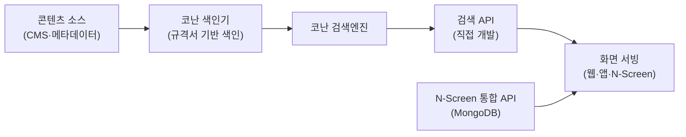
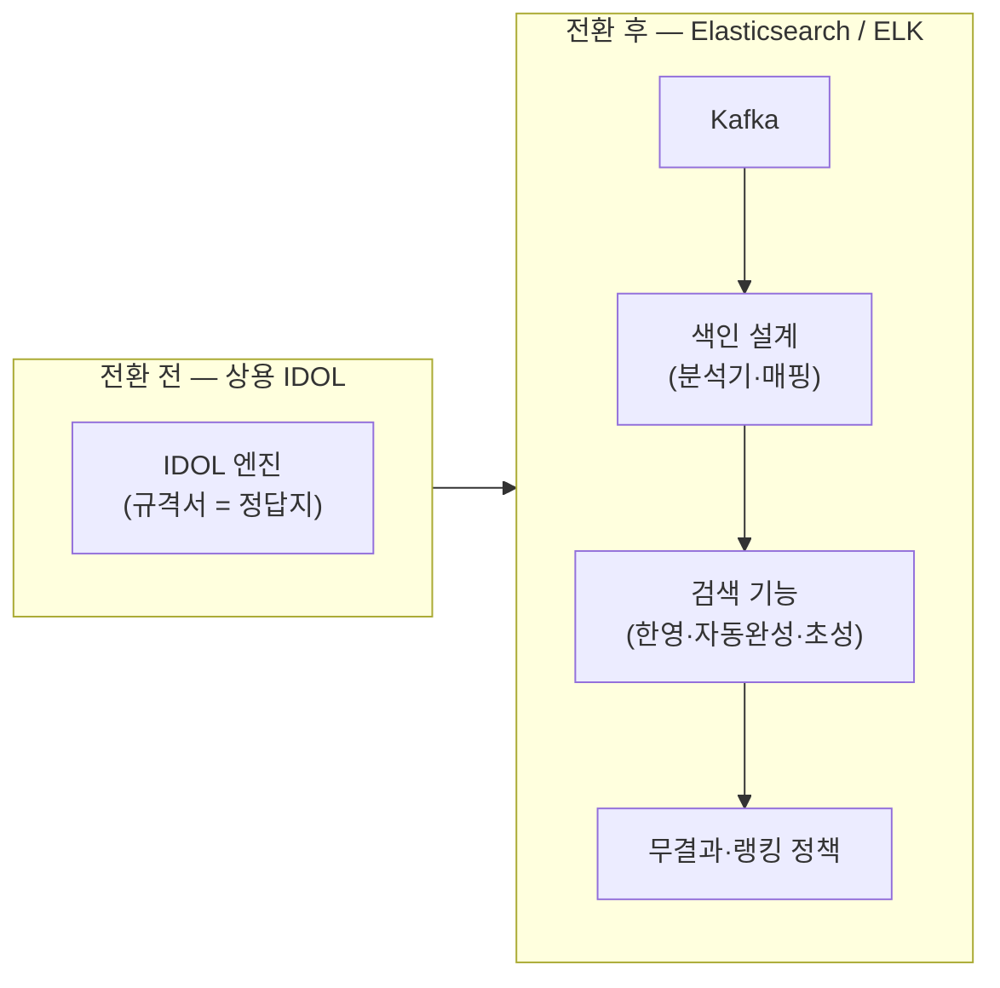

검색 시스템을 두 번 구축했다. 한 번은 상용 검색엔진의 규격서를 따라, 한 번은 Elasticsearch 위에서 규격을 직접 정의하며. 같은 "검색"이라는 이름을 달고 있지만 엔지니어가 내리는 결정의 종류가 완전히 달랐다.

이 글은 그 두 번의 궤적과, 상용에서 오픈소스로 넘어올 때 실제로 무엇이 바뀌는지를 정리한 기록이다. 검색 솔루션 도입이나 전환을 앞둔 팀, 또는 상용 엔진만 다뤄본 엔지니어가 읽으면 도움이 될 만한 내용이다.

## 용어 정리

이 글에서 반복되는 검색 도메인 용어를 먼저 정리한다.

| 용어 | 뜻 |
|---|---|
| 색인(Indexing) | 원문 문서를 검색 가능한 자료구조(역인덱스)로 변환·적재하는 과정 |
| 역인덱스(Inverted Index) | "단어 → 그 단어가 등장한 문서 목록" 형태의 검색 전용 자료구조 |
| 형태소 분석 | 한 문장을 의미 최소 단위(형태소)로 쪼개는 것. 한국어 검색 품질의 핵심 |
| 자동완성(Suggest) | 사용자가 몇 글자 입력하면 뒤를 예측해 후보를 띄우는 기능 |
| 초성검색 | "ㅊㅅ" 입력으로 "초성"을 찾는, 한글 자모 기반 검색 |
| 한영검색 | 자판 오타(한/영 전환 실수)를 교정해 검색. 예: "tjf" → "설", "tif" → "샬" |
| 무결과(Zero-result) | 검색 결과가 0건인 상황과 그 후처리(추천·오타교정·동의어 확장 등) |
| IDOL | Autonomy(→HP) 계열 상용 검색·분석 엔진 |
| 코난 | 코난테크놀러지의 상용 한국어 검색엔진 |

## 두 번의 구축

검색엔진·규격의 출처·다룬 범위·대표 산출물 네 축으로 갈라 보면 이렇게 된다.

| 구분 | 1기 — OTT 서비스 검색 | 2기 — IPTV 서비스 검색 |
|---|---|---|
| 검색엔진 | 코난테크놀러지 (상용) | IDOL (상용) → Elasticsearch (오픈소스) |
| 규격의 출처 | 벤더 규격서 | 벤더 규격서(IDOL) → 직접 정의(ES) |
| 다룬 범위 | 색인·검색 API·CMS·랭킹추천 | 색인 설계·검색 기능 구현·전환 |
| 대표 산출물 | 색인 파이프라인, 검색 API 서빙, CMS·랭킹추천 구축, N-Screen 통합 API(MongoDB) | 상용엔진에서 ELK로 전환, 한영·자동완성·초성·무결과 처리 구현 |

## 1기 — 상용 한국어 검색엔진 위에서

### 무엇을 했나

- 코난테크놀러지의 상용 검색엔진으로 콘텐츠(VOD·프로그램·인물 등)를 **색인**했다.
- 색인된 데이터를 조회하는 **검색 API를 직접 개발**해 화면에 데이터를 서빙했다.
- 검색뿐 아니라 **CMS·랭킹추천**까지 담당해, "무엇을 색인할지"부터 "어떻게 노출할지"까지 데이터 흐름 전체를 다뤘다.
- N-Screen 통합 API를 MongoDB 기반으로 구성해 다양한 단말(웹·앱·셋톱)에 동일 데이터를 공급했다.

### 색인에서 서빙까지의 데이터 흐름

### 이 시기의 특징

- 검색엔진 벤더가 제공하는 **규격서(스펙 문서)** 안에서 기능을 조립했다.
- 자동완성·한글처리·랭킹 같은 기능이 **엔진 기능으로 제공**되어, 이 시기의 일은 "규격에 맞춰 설정하고 API화"하는 쪽에 가까웠다.
- 덕분에 검색 기능의 **요구사항과 사용자 기대치**를 먼저 체득했다. 이 감각이 2기에서 직접 구현할 때 결정적으로 쓰였다.

## 2기 — 상용 IDOL에서 Elasticsearch로

### 전환의 배경

- IPTV 검색은 처음에 **상용 엔진 IDOL**로 시작했다.
- 이후 **Elasticsearch(ELK 스택)로 전환**하며 검색·추천 파이프라인을 재구축했다. Kafka로 데이터를 흘리고 ES/ELK로 색인·검색·로그분석을 통합했다.

### 상용엔진 vs 직접 구현 — 무엇이 달라졌나

가장 큰 변화는 **"규격서의 유무"**였다. 상용엔진은 한글처리·자동완성·초성 같은 기능에 **규격서가 있어** 그대로 따르면 됐지만, Elasticsearch는 이 모든 걸 **직접 설계·구현**해야 했다.

| 항목 | 상용엔진(코난·IDOL) | Elasticsearch(직접 구현) |
|---|---|---|
| 한글 형태소 처리 | 벤더 규격서·사전 제공 | 분석기(analyzer)·형태소 플러그인 직접 구성 |
| 자동완성 | 엔진 기능으로 제공 | edge n-gram·completion 등 색인 전략 직접 설계 |
| 초성검색 | 규격 내 지원 | 자모 분해 색인·매핑 직접 구현 |
| 한영검색(자판 오타) | 규격 내 지원 | 변환 로직·색인 필드 직접 구현 |
| 무결과 처리 | 벤더 가이드 | 정책(추천·오타교정·동의어)을 직접 설계 |
| 통제권 | 낮음(블랙박스) | 높음(내부까지 튜닝 가능) |

### 전환이 남긴 역량

- 검색엔진을 **블랙박스가 아니라 내부 동작까지 이해하고 튜닝**하는 엔지니어가 됐다.
- 벤더 규격서가 대신 내려주던 결정(형태소·자동완성·초성)을 **스스로 규격을 정의**해 구현했다.

## 직접 구현한 검색 기능 — 가장 공들인 것

Elasticsearch 전환기에 특히 노력을 쏟은 지점은 **"검색결과가 없을 때 어떻게 할 것인가"**와 **한글 고유 기능(자동완성·초성·한글처리)**이었다. 상용엔진에선 규격서가 답을 줬지만, 여기선 답을 직접 만들어야 했다.

| 기능 | 사용자 기대 | 핵심 난제 | ES에서의 접근(요지) |
|---|---|---|---|
| 무결과 처리 | 0건이어도 "뭐라도" 보여주기 | 언제·무엇으로 대체할지 정책 부재 | 오타교정·동의어 확장·인기/추천 폴백 단계 설계 |
| 자동완성 | 몇 글자로 후보 예측 | 부분일치 색인 비용·속도 | edge n-gram / completion suggester 색인 전략 |
| 초성검색 | "ㅊㅅ"→"초성" | 한글 자모 분해 색인 필요 | 초성 추출 필드 별도 색인·매핑 |
| 한영검색 | 자판 오타 교정 | 한↔영 키맵 변환 로직 | 변환 후 재질의·별도 분석 필드 |
| 한글 형태소 | 의미 단위 검색 | 조사·복합어 분해 | 형태소 분석기·사용자사전 구성 |

이 표의 각 기능이 Elasticsearch 내부에서 **구체적으로 어떻게 동작하는지**는 [한글 검색 구현](/blog/search-engineering/korean-text-search/)에서 도식과 함께 깊게 다룬다. 이 글은 "이 문제들을 실무에서 직접 붙잡고 풀었다"는 **경험의 맥락**만 남긴다.
