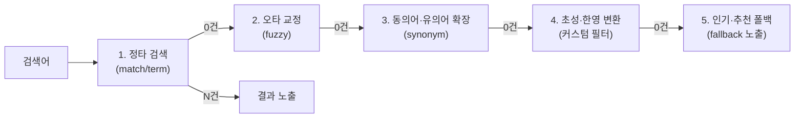

검색 시스템을 다루다 보면 같은 질문이 반복해서 돌아온다. "초성검색은 어떻게 만드나", "왜 이 문서가 위에 뜨나", "클러스터가 갑자기 쓰기를 거부하는데 어디부터 보나" 같은 것들이다. 이 글은 그 질문들을 한 곳에 모아 결론부터 답한다.

먼저 Elasticsearch의 뼈대를 세 줄로 요약해 두면 이후 답이 잘 붙는다.

- **분석기 3단계**: char filter → **tokenizer(1개만)** → token filter.
- **색인 경로**: 버퍼(+translog) → refresh(=Lucene flush, 이때부터 검색 가능) → flush(=Lucene commit, 디스크) → merge.
- **검색 2단계(Query then Fetch)**: ① 전 샤드에 broadcast해 docID+score만 취합 → ② 선별된 문서만 내용을 fetch.
- **역인덱스**: 단어 → 문서. 정렬·집계 필드는 **keyword(doc_values)** 로 잡는다(text는 fielddata로 힙을 태운다).

각 주제의 전체 맥락은 [Elasticsearch 아키텍처](/blog/search-engineering/elasticsearch-architecture/), [한글 검색 구현](/blog/search-engineering/korean-text-search/), [운영과 트러블슈팅](/blog/search-engineering/elasticsearch-operations/)에서 다룬다.

## 핵심 수치 정리

검색 설계에서 반복해 등장하는 숫자들이다. 값만 외우면 응용이 안 되므로 **왜 그 값인지**를 함께 둔다.

| 주제 | 값 | 왜 그 값인가 |
|---|---|---|
| 한글 음절 수 | 초성 19 × 중성 21 × 종성 28 = **11,172** (유니코드 AC00~D7A3) | 종성 28은 '종성 없음'을 포함한 수. 이 곱셈 구조 덕분에 음절 코드에서 초성을 역산할 수 있고, 그래서 초성검색이 성립한다 |
| refresh_interval | 기본 **1초**, 대량 색인 시 `5m~10m` 또는 `-1` | 버퍼를 검색 가능한 세그먼트로 바꾸는 주기다. 1초가 NRT의 근거이고, 대량 색인 중 잦으면 작은 세그먼트가 폭증해 머지 부담이 커진다 |
| 자동완성 응답 목표 | **100ms** 이내 | 타이핑 중 글자마다 호출되므로 왕복 지연이 그대로 체감된다. 사람이 "느리다"고 느끼기 시작하는 경계가 100ms대다 |
| edge_ngram 적용 위치 | **색인 분석기에만** | 검색어까지 n-gram으로 쪼개면 의도하지 않은 문서까지 매칭된다 |
| 기본 유사도 | **BM25** (ES 7.0+) | TF-IDF에 문서 길이 보정(k1·b)과 TF 포화를 더한 것. 같은 단어를 도배한 문서가 상위를 먹는 것을 막는다 |
| fuzziness AUTO | 0~2자 완전매칭 / 3~5자 거리 1 / 6자~ 거리 2 | 짧은 단어에 편집거리를 허용하면 전혀 다른 단어가 매칭된다. 길이에 비례해 관용도를 올리는 설계다 |
| 마스터 후보 수 | **홀수 3 또는 5**, quorum = `(n/2)+1` | 짝수면 네트워크 분단 시 양쪽 다 정족수를 못 채워 정지하거나, 각자 마스터를 뽑아 데이터가 갈라진다 |
| JVM 힙 | `Xms=Xmx`, **32GB 이하**, 총 메모리의 **50% 이하** | 32GB를 넘으면 compressed oops가 꺼져 포인터가 커진다. 나머지 절반은 OS 페이지 캐시가 세그먼트를 캐싱해야 검색이 빠르다 |
| 디스크 watermark | low **85%** / high **90%** / flood_stage **95%** | 85%에서 신규 샤드 할당을 멈추고, 90%에서 샤드를 재배치하고, 95%에서 인덱스를 read-only로 잠근다. 단계적으로 경고를 준다 |
| 샤드 크기 | 검색 **20GB** / 로깅 **50GB** per shard | 샤드 하나가 곧 복구·재배치 단위다. 너무 크면 복구가 느리고, 너무 잘게 쪼개면 머지·스레드 오버헤드가 커진다 |
| OS 커널 | nofile **65535**, `vm.max_map_count` **262144**, `vm.swappiness` **1** | 운영 모드(특정 주소 바인딩) 부트스트랩 체크 항목이다. 하나라도 미달이면 노드가 아예 뜨지 않는다 |

## Elasticsearch가 기본 제공하지 않아 직접 구현해야 하는 것

한국어 검색에서 사용자가 당연하게 기대하는 기능 중 상당수는 Elasticsearch에 **기본 기능이 없다**. 상용 검색엔진에서는 규격서 한 줄로 주어지던 것들이라, 오픈소스로 넘어올 때 가장 먼저 부딪히는 벽이다.

| 기능 | ES 기본 제공 | 직접 만들어야 하는 것 |
|---|---|---|
| 초성검색 | 없음 | 유니코드 자소분해 + 커스텀 플러그인(token filter) |
| 한영검색(자판 오타) | 없음 | 한/영 키맵 변환 필터를 색인·검색에 병행 |
| 자동완성 | 부품만(edge_ngram·completion suggester) | 색인/검색 분석기 분리 + 초성·자모·영타·한타 멀티필드 설계 |
| 무결과 처리 | 정책 없음 | 단계적 폴백을 정책으로 설계 |

**무결과 폴백 순서**: 정타 → fuzzy(오타) → 동의어 확장 → 초성/한영 변환 → 인기·추천. 여기에 `significant_terms`(연관어 제안)와 큐레이션을 얹는다.

## Q. 왜 DB의 LIKE 검색이 아니라 검색엔진을 쓰나

`LIKE '%키워드%'`는 인덱스를 타지 못해 풀스캔이 되고, 오타·동의어·형태소·랭킹을 표현할 수단이 아예 없기 때문이다.

| 요구 | DB `LIKE` | 검색엔진 |
|---|---|---|
| 부분일치·유사어·복합조건 | SQL로 표현이 어렵거나 불가 | 분석기 + Query DSL로 조합 |
| 성능 | 인덱스 미사용 → 풀스캔 | 역인덱스로 term → 문서ID 즉시 조회 |
| 사용자 의도 | 반영 수단 없음 | 형태소·동의어·오타교정·랭킹으로 반영 |
| 결과 순서 | 정렬 컬럼 기준 | BM25 점수 + `function_score` 비즈니스 로직 |

핵심은 세 가지를 **역인덱스 + 분석기 + 랭킹**으로 푼다는 점이다. DB는 "조건에 맞는 행"을 주지만 검색엔진은 "연관성 높은 순서"를 준다.

## Q. 초성검색을 어떻게 구현하나

Elasticsearch에 초성 추출 기능이 없으므로, **유니코드 자소분해를 하는 커스텀 플러그인을 token filter 단계에 넣어** 초성 필드를 따로 색인한다.

한글은 초성 19·중성 21·종성 28의 조합이라 음절 코드에서 초성을 역산할 수 있다.

```text
음절코드 = (초성×21 + 중성)×28 + 종성 + 0xAC00

종성 = v % 28
중성 = ((v - 종성) / 28) % 21
초성 = (((v - 종성) / 28) - 중성) / 21
```

| 결정 지점 | 선택 | 이유 |
|---|---|---|
| 구현 위치 | **token filter** 단계 | tokenizer 단계에서 자소분해하면 그 뒤에 동의어·불용어 필터를 얹기 어렵다('스벅'→'스타벅스' 확장이 필요하다) |
| 색인 구조 | 원본 필드 + 초성 서브필드 | 검색 시 `multi_match`로 함께 질의해 "ㅊㅅ" 입력에 "초성"이 매칭되게 한다 |
| 배포 | 각 노드에 jar 설치 후 재시작 | 플러그인은 ES·Lucene 버전에 종속이라 `gradle.properties`의 버전을 맞춰 빌드해야 한다 |

## Q. 한영검색(자판 오타 교정)은 어떻게 처리하나

한/영 키맵 변환 필터로 만든 서브필드를 **색인해 두고, 검색 시 원문 필드와 함께 `multi_match`로 질의**한다. 자판 레이아웃 매핑 문제라 ES 기본 기능이 아니라 커스텀 필터 영역이다.

| 방향 | 필터 | 입력 → 변환 |
|---|---|---|
| 영타 → 한글 | `eng2kor_filter` | `tmxkqjrtm` → 스타벅스 |
| 한타 → 영문 | `kor2eng_filter` | `ㄴㅅㅁㄱㅠ…` → starbucks |

오타 대응 자체는 fuzzy·동의어·자소분해로 상당 부분 커버되지만, **자판 전환 실수는 편집거리로 잡히지 않는다.** "dkssud"와 "안녕"은 문자열로는 완전히 다르기 때문에 별도 변환 경로가 필요하다.

## Q. 자동완성에서 색인용과 검색용 분석기를 분리하는 이유

검색어까지 `edge_ngram`으로 쪼개면 다시 n-gram으로 분해되어 의도하지 않은 문서까지 매칭되기 때문이다. `edge_ngram`은 **색인 분석기에만** 적용한다.

| 위치 | 분석기 | 이유 |
|---|---|---|
| 색인 | `edge_ngram` 포함 | "커피"를 [커, 커피]로 확장해 저장 |
| 검색 | `edge_ngram` 제외 | 입력을 그대로 매칭. 재확장하면 노이즈가 생긴다 |

```json
"index_completion":  { "type":"custom", "tokenizer":"standard",
  "filter":["lowercase","trim","autocomplete_edge"] },   // edge_ngram 포함
"search_completion": { "type":"custom", "tokenizer":"standard",
  "filter":["lowercase","trim"] }                          // edge_ngram 제외
```

`search_analyzer`를 매핑에 명시하지 않으면 색인 분석기가 검색에도 그대로 쓰인다. 멀티필드를 쓸 때는 반드시 분리해서 지정한다.

## Q. 자동완성 방식은 무엇을 기준으로 고르나

**부분일치 범위·오타 허용·속도**의 트레이드오프로 고른다. 앞부분만 매칭하면 되면 `edge_ngram`이 가장 가볍고, 중간 일치가 필요하면 색인 비용을 감수해야 한다.

| 방식 | 원리 | prefix | 중간일치 | 오타 | 비고 |
|---|---|---|---|---|---|
| **ngram** | 글자 단위 전부 분해 | O | O | △ | 토큰 폭발 주의 |
| **edge_ngram** | 앞에서부터만 분해(cat→c,ca,cat) | O | X | △ | 색인 토큰 적음 |
| **search_as_you_type** | 전용 타입, `_2gram`/`_3gram` 자동생성 | O | O | X | `multi_match`+`bool_prefix` |
| **completion suggester** | FST를 메모리 적재 | O | X | O(fuzzy) | 최고속, weight·context 지원 |

한글은 여기에 더해 **초성·자모·영타·한타 서브필드를 병렬 색인**하고 `multi_match`(`cross_fields`)로 묶는 조합을 주로 쓴다. 다만 "아이폰" 한 단어에도 자소를 포함해 최대 7회 호출이 발생하므로, 클라이언트에서 debouncing·throttling으로 호출을 줄이는 것이 함께 가야 한다.

## Q. Nori가 형태소를 이상하게 쪼갤 때 어디부터 보나

**`_analyze` API로 실제 토큰을 먼저 확인**하고, 원인에 따라 `decompound_mode`나 사용자사전을 조정한다. 추측으로 사전을 건드리면 부작용만 늘어난다.

| 증상 | 원인 | 처방 |
|---|---|---|
| 복합어가 통째로/과하게 분해됨 | `decompound_mode` 설정 | none(통째로) / discard(분해만) / mixed(둘 다) 중 선택 |
| 도메인 용어가 안 잡힘 | 사전에 없는 신조어·상품명 | `user_dictionary`에 등록("싼타페TM" → "TM" 검색 가능) |
| 영문 대문자가 분석 실패 | Nori가 대소문자를 구분 못 함(C++ 등) | char filter 단계에서 소문자화 |
| 엉뚱한 위치에서 분해됨 | 짧은 단어를 사전에 등록한 부작용 | '강남'을 등록하면 "강남콩"이 "강남+콩"으로 오분석된다. 등록어 길이를 신중히 |

근본 원인은 사전이다. Nori는 **mecab-ko-dic(1998 세종 말뭉치)** 기반이라 신조어·외래어에 취약하다. 사전을 지속 갱신하는 운영 프로세스가 설정 튜닝보다 중요하다.

## Q. 동의어를 색인 시점과 검색 시점 중 언제 적용하나

**사전이 안정적이면 색인 시(성능), 자주 바뀌면 검색 시(실시간)** 로 나눈다.

| | 색인 시 적용 | 검색 시 적용 |
|---|---|---|
| 장점 | 검색 성능↑(질의 때 확장 비용 없음) | **실시간 업데이트** 가능 |
| 단점 | 인덱스 커짐·term 통계 왜곡·**Reindex 필요** | 검색마다 확장 비용 |
| 적합 | 표준 용어·브랜드명처럼 잘 안 바뀌는 사전 | 이벤트·시즌 키워드처럼 자주 바뀌는 사전 |

검색 시 방식은 `search_analyzer`에 `synonym`(`updateable: true`, 파일 기반)을 두고 `_reload_search_analyzers` + `_cache/clear?request=true`를 호출하면 **재색인 없이 반영**된다. 동의어 표현은 동등관계 `"A, B"`(양방향)와 치환 `"A => B"`(단방향) 두 가지이며, `synonym_graph`가 권장된다.

## Q. 검색 결과가 0건일 때 무엇을 보여주나

0건은 이탈로 직결되므로 **단계적 폴백을 정책으로 설계**해 "뭐라도" 보여준다. 엔진 기능이 아니라 정책 결정이라는 점이 핵심이다.



폴백 이전에 0건 자체를 줄이는 수단도 함께 쓴다. 동의어로 이표기를 정타에 매핑하고("횬대"→"현대"), `significant_terms`로 연관 검색어를 제안하고, 큐레이션으로 특정 결과를 노출한다. 다만 Promoted 큐레이션은 관련성 점수를 무시하므로 남용하면 검색 품질이 왜곡된다.

## Q. 왜 이 문서가 검색 상위에 뜨는지 어떻게 설명하나

**BM25 기본 점수 → `function_score` 가중 → `explain`으로 실측**의 순서로 분해한다. 추정하지 않고 점수를 뜯어보는 것이 요령이다.

| 층 | 무엇이 점수를 만드나 | 확인·조정 방법 |
|---|---|---|
| 기본 유사도 | BM25 — TF(빈도) × IDF(희소성) + 문서 길이 보정 | `explain: true`로 항목별 분해 |
| 비즈니스 가중 | `function_score` — `decay`(최신·거리), `field_value_factor`(평점·판매량) | `score_mode`·`boost_mode`로 결합 방식 지정 |
| 왜곡 보정 | 단어 도배로 TF가 부풀 때 | `scripted` similarity로 TF 영향 축소(예: `1/sqrt(docLen)`) |

분산 환경에서는 점수가 **로컬 샤드에서 계산된다**는 점도 알아둘 만하다. IDF는 원래 전역 정보가 필요하지만 전역 계산은 비싸서 하지 않고, 데이터가 고르게 분산돼 있으면 로컬 IDF도 거의 같아 문제가 없다. 정확한 전역 점수가 필요하면 `?search_type=dfs_query_then_fetch`를 쓴다.

## Q. 클러스터가 갑자기 쓰기를 거부할 때 어디부터 보나

**디스크 watermark의 flood_stage(95%)를 1순위로 의심**한다. `_cat/allocation`으로 노드별 디스크 사용률부터 본다.

| 임계 | 설정 | ES가 하는 일 |
|---|---|---|
| 85% | `...disk.watermark.low` | 새 샤드 할당 중단(신규 인덱스는 예외) |
| 90% | `...disk.watermark.high` | 해당 노드의 샤드를 다른 노드로 재배치 |
| 95% | `...disk.watermark.flood_stage` | **인덱스를 read-only로 잠금** |

복구는 디스크를 확보한 뒤 `index.blocks.read_only_allow_delete`를 해제해야 풀린다. 자동으로 풀리지 않는다는 점이 함정이다. 근본 대책은 ILM으로 오래된 인덱스를 warm/cold로 내리거나 삭제해 hot 노드 용량을 관리하는 것이다.

## Q. yellow와 red는 무엇이 다르고 어떻게 대응하나

**yellow는 replica 문제라 서비스가 정상이고, red는 primary 손실이라 일부 데이터에 접근이 안 된다.** 상태를 결정하는 것은 대부분 샤드다.

| 상태 | 의미 | 서비스 영향 | 흔한 원인 |
|---|---|---|---|
| 🟢 Green | Primary·Replica 모두 정상 할당 | 없음 | — |
| 🟡 Yellow | **Replica**가 비정상(Primary는 정상) | 검색·색인 정상 | 노드 부족·디스크 부족·설정 오류 |
| 🔴 Red | **Primary**가 비정상 | 일부 데이터 접근 불가 | 위 원인 + 레플리카 없는 샤드 손실 |

red 복구는 ① 문제 인덱스 확인 → ② 노드 종료가 원인이면 재시작 → ③ 스냅샷 복구 → ④ 재색인 순으로 접근한다. 애초에 red를 막는 선제 조치는 **replica를 최소 1개 두고 SLM으로 스냅샷을 상시 걸어 두는 것**이다.

## Q. 마스터 후보 노드를 몇 대로 두나

**홀수, 최소 3대**다. quorum이 `(후보수/2)+1`이라 홀수여야 네트워크 분단 시 다수파만 생존하고 소수파는 스스로 멈춘다.

| 마스터후보 수 | quorum | 네트워크 분단 시 |
|---|---|---|
| 2 (짝수) | 2 | 양쪽 다 정족수 미달 → 전체 정지 (위험) |
| 3 (홀수) | 2 | 다수파만 생존 (안전) |
| 4 (짝수) | 3 | 위험 |
| 5 (홀수) | 3 | 안전 |

운영 중 원칙이 두 가지 더 있다. **한 번에 절반 이상 노드를 빼지 않는다**(quorum이 깨지면 클러스터 전체가 unavailable). 그리고 최초 구성 시 `cluster.initial_master_nodes`에 후보를 모두 넣되 **구성 완료 후에는 제거**한다.

## Q. 인덱스 샤드 개수는 어떻게 정하나

정답은 없고 **샤드당 용량 상한 + 노드 수 균형**으로 산정한다. 과소보다 **과다 샤드가 더 위험**하다는 것이 실무 감각이다.

| 기준 | 값·규칙 | 근거 |
|---|---|---|
| 샤드당 크기 | 검색용 20GB / 로깅용 50GB | 샤드가 복구·재배치 단위라 너무 크면 복구가 느리다 |
| primary 수 | 예상 총량 ÷ 샤드당 상한 | 생성 후 변경 불가라 초기 산정이 중요하다 |
| replica 수 | 1로 시작 | 색인이 느려지면 줄이고, 검색 처리량이 부족하면 늘린다 |
| 증가 대응 | 새 인덱스로 분리(rollover) | 샤드를 잘게 쪼개면 머지·네트워크·스레드 오버헤드로 오히려 검색이 느려진다 |

primary 개수를 나중에 못 바꾸는 이유는 라우팅 규칙(`hash(_id) % primary_shards`) 때문이다. 개수가 바뀌면 전 문서의 위치가 어긋나므로 재색인해야 한다.

## Q. 힙을 32GB 넘게 주면 안 되는 이유

**32GB를 넘으면 JVM의 compressed ordinary object pointer가 꺼져** 포인터가 커지고 오히려 효율이 떨어지기 때문이다. 메모리를 더 줬는데 성능이 나빠지는 구간이 생긴다.

| 원칙 | 값 | 이유 |
|---|---|---|
| `Xms = Xmx` | 동일하게 고정 | 힙 리사이징으로 인한 GC 변동을 없앤다 |
| 상한 | **32GB 이하** | 초과 시 compressed oops 상실 → 포인터 크기 증가 |
| 비율 | 총 메모리의 **50% 이하** | 나머지 절반은 OS 페이지 캐시가 세그먼트 파일을 캐싱해야 검색이 빠르다 |

ES 성능이 파일시스템 캐시에 크게 의존한다는 점이 세 번째 규칙의 근거다. 힙을 키우는 것이 곧 성능 향상이 아니다.

## Q. 대량 색인에는 어떤 튜닝을 하나

**색인 중에는 refresh를 늦추고 replica를 끄고, 끝나면 되돌린다.** 색인 내부 동작(버퍼 → refresh → 세그먼트 → merge)을 이해하면 자연스럽게 나오는 처방이다.

| 항목 | 색인 중 | 왜 |
|---|---|---|
| `refresh_interval` | `5m~10m` 또는 `-1` | refresh는 버퍼를 세그먼트로 만드는 작업이다. 잦으면 작은 세그먼트가 폭증해 머지 부담이 커진다 |
| `number_of_replicas` | `0` → 완료 후 복구 | replica가 있으면 같은 문서를 복제본에도 색인해 부하가 배가된다 |
| Bulk 크기 | 100→200→400 두 배씩 벤치 | 429가 나기 직전 크기가 최적점이다. 요청당 수십MB 이하로 유지한다 |
| `indices.memory.index_buffer_size` | 기본 힙 10%에서 상향 | 버퍼가 가득 차면 강제 flush가 발생한다 |
| 하드웨어 | SSD/NVMe | 색인은 disk I/O 의존도가 높다 |

`refresh_interval: -1`로 두면 색인해도 검색 결과가 0건이라는 점에 주의한다. 되돌리는 것을 잊으면 "데이터를 넣었는데 검색이 안 된다"는 장애로 나타난다.

## Q. 롤링 배포와 블루그린 배포는 언제 무엇을 고르나

**자원을 아끼며 무중단이면 롤링, 즉시 전환·빠른 롤백이 필요하고 자원이 2배 있으면 블루그린**이다. 메이저 업그레이드는 하위호환이 없어 중단 배포와 짝이 된다.

| 방식 | 다운타임 | 자원 | 언제 |
|---|---|---|---|
| 중단(Restart) | 있음 | 1배 | Major 업그레이드, 무중단이 불필요한 서비스 |
| 롤링(Rolling) | 없음 | 1배 | 점진 배포·자원 최적화, 마이너 업그레이드 |
| 블루그린(Blue/Green) | 없음 | **2배** | 즉시 전환·빠른 롤백이 필요할 때 |

롤링 시에는 `index.unassigned.node_left.delayed_timeout`(기본 1m)을 `5m` 정도로 늘린다. 그러지 않으면 노드가 잠깐 빠질 때마다 샤드가 대량으로 재할당되어 불필요한 부하가 생긴다.

## Q. 상용 검색엔진에서 Elasticsearch로 넘어오면 운영상 무엇이 달라지나

**벤더가 대신 지던 결정을 전부 직접 지게 된다.** 기능 목록은 비슷해 보여도 의사결정의 양과 종류가 완전히 달라진다.

| 영역 | 상용엔진 | Elasticsearch |
|---|---|---|
| 한글 처리 | 벤더 규격서·사전 제공 | 분석기 설계·Nori 사전 운영을 직접 |
| 초성·한영·자동완성 | 규격 내 지원 | 커스텀 플러그인 빌드·배포까지 직접 |
| 인프라 | 벤더 권장 구성 | 커널 튜닝(FD·swap·`vm.max_map_count`)부터 직접 |
| 샤드·용량 | 벤더 산정 | 샤드 크기·마스터 정족수·watermark를 직접 설계 |
| 장애 대응 | 벤더 지원 | yellow/red 판별·스냅샷 복구를 직접 |

특히 OS 설정은 놓치면 **노드가 아예 뜨지 않는** 형태로 나타나므로, 운영 체크리스트를 문서로 남겨 두는 것이 전환 초기의 실질적인 대비책이다. 부담이 커지는 만큼 검색엔진을 블랙박스가 아니라 내부까지 이해하고 튜닝할 수 있게 된다는 것이 반대급부다.

## 용어 정리

| 용어 | 뜻 |
|---|---|
| 역인덱스 | 단어 → 문서 목록. 검색이 빠른 이유 |
| 세그먼트 | 불변 색인 파일 단위. merge로 정리된다 |
| Nori | Elasticsearch 공식 한글 형태소 분석기 |
| edge n-gram | 앞에서부터 만드는 부분 토큰(자동완성용) |
| BM25 | 기본 유사도(빈도 × 희소성 + 길이 보정) |
| quorum | 마스터 선출 정족수 `(n/2)+1` |
| watermark | 디스크 사용률 임계선(85/90/95%) |
| doc_values | 정렬·집계용 컬럼형 자료구조(디스크) |
