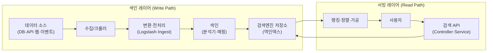

검색은 화면에서 보면 입력창 하나지만, 그 뒤에는 수집·색인·검색엔진·서빙으로 이어지는 네 단계의 파이프라인이 있다. 검색 엔지니어의 일은 이 네 단계 전체에 걸쳐 있고, 그래서 "검색이 이상하다"는 제보 하나에 크롤러부터 랭킹 식까지 어디든 원인이 있을 수 있다.

이 글은 그 전체 지도를 그린다. 검색을 처음 맡게 된 백엔드 엔지니어, 또는 DB의 `LIKE` 검색으로 버티다 한계를 만난 팀이 읽기에 알맞다. 개별 기능의 구현 방법은 이 카테고리의 다른 글에서 깊게 다룬다.

## 용어 정리

| 용어 | 뜻 |
|---|---|
| 색인(Indexing) | 원문을 검색 가능한 자료구조(역인덱스)로 변환·적재 |
| 서빙(Serving) | 검색 결과를 정렬·가공해 화면/앱에 전달하는 계층 |
| 크롤링·수집 | 검색 대상 데이터를 모으는 단계(웹/API/DB/이벤트) |
| 랭킹(Ranking) | 결과의 노출 순서를 정하는 점수 계산 |
| Re-ranking | 1차 검색 결과를 ML 등으로 재정렬 |
| Precision/Recall | 검색 정확도/재현율. 대표 품질 지표(trade-off) |
| 무결과(Zero-result) | 검색 0건과 그 후처리 정책 |

## 검색 엔지니어는 무슨 일을 하나

검색 시스템은 크게 **4단계 파이프라인**이고, 검색 엔지니어의 업무는 이 각 단계에 걸쳐 있다.

| 단계 | 하는 일 | 대표 업무 |
|---|---|---|
| ① 수집(크롤링) | 검색 대상 데이터 확보 | 웹 크롤러·API 연동·DB 변경 감지·이벤트(Kafka) 수집 |
| ② 색인(인덱싱) | 검색 가능한 형태로 변환·저장 | 분석기·매핑 설계, 형태소·자동완성 색인, 대량 bulk/reindex |
| ③ 검색엔진 | 저장소 + 쿼리 처리 | 클러스터 구축·운영, 샤드 설계, 성능·장애 대응 |
| ④ 서빙 | 결과 정렬·가공·전달 | 검색 API 개발, 랭킹 튜닝, 무결과 처리, 캐싱 |

일상 업무의 실체는 이렇다. 새 검색 요구사항을 분석기·쿼리로 번역하고, "왜 이 문서가 위에 뜨나"를 `explain`으로 파헤치고, 느린 쿼리를 `profile`로 잡고, 클러스터가 yellow/red로 떨어지면 복구한다. 즉 **색인부터 서빙, 운영까지** 데이터 흐름 전체에 책임을 진다.

상용 검색엔진에서 Elasticsearch로 넘어오는 궤적은 이 4단계를 서로 다른 스택으로 두 번 관통하는 경험이 된다. 그 과정은 [상용 검색엔진에서 Elasticsearch로](/blog/search-engineering/search-engineering-in-practice/)에서 다룬다.

## 일반 검색 시스템 아키텍처

검색 시스템은 **색인 레이어**(데이터를 쌓는 쪽)와 **서빙 레이어**(사용자에게 주는 쪽)의 두 흐름으로 나뉜다.

**데이터 수집 방법 비교**

| 방법 | 특징 |
|---|---|
| 웹 크롤링 | HTML 파싱·링크 추적. 이용약관 주의 |
| API 활용 | 정제된 데이터, 가장 효율적 |
| DB 직접 접근 | 변경 파악 쉬움 |
| 이벤트 기반 | Kafka 등 스트리밍, 실시간 |

**상용 솔루션 vs 오픈소스** — 이 선택이 이후 모든 작업의 성격을 바꾼다.

| | 상용(코난·IDOL) | 오픈소스(Elasticsearch) |
|---|---|---|
| 한글·자동완성·초성 | 규격서로 제공 | 분석기·플러그인 직접 구현 |
| 통제권 | 낮음(블랙박스) | 높음(내부까지 튜닝) |
| 서빙 API | 벤더 규격 | 직접 개발(Spring Boot 등) |

## 왜 DB가 아니라 검색엔진인가

DB의 `LIKE` 검색은 검색 시스템으로 쓸 수 없다.

- **쿼리 복잡도**: 다양한 조건·부분일치·유사어를 SQL로 표현하기 어렵다.
- **성능**: `LIKE '%키워드%'`는 인덱스를 못 타고 풀스캔한다.
- **사용자 의도 파악 불가**: 오타·동의어·형태소·랭킹을 다룰 수 없다.

이 셋을 **역인덱스 + 분석기 + 랭킹**으로 푸는 것이 검색엔진이고, 그중 Elasticsearch가 사실상 표준이다(DB-Engines 검색엔진 1위).

## 검색 품질은 어떻게 재나

검색은 "돌아간다"가 아니라 "**좋은 결과를 준다**"가 목표라, 정량 지표로 평가한다.

| 지표 | 정의 | 특징 |
|---|---|---|
| Precision(정밀도) | 결과 중 실제 연관 비율 | Recall과 trade-off |
| Recall(재현율) | 실제 연관 중 검색된 비율 | 넓게 평가 |
| MRR | 첫 정답 순위의 역수 평균 | 최상위 집중 |
| MAP | 쿼리별 평균정밀도의 평균 | 순위 반영, 계산 복잡 |
| NDCG | 관련성 등급을 상위 가중해 정규화 | 이분법 아님, 실무 표준 |
| CTR/CVR | 클릭률/전환율 | 직접 측정, 의도 반영은 약함 |
| A/B 테스트 | 알고리즘 실측 비교 | 객관적, 비용 큼 |

방문자의 상당수가 검색창으로 직행하고 검색 이용자의 전환율이 몇 배 높다는 점에서, 검색 품질은 곧 서비스 UX·매출과 직결된다.

## 검색 엔지니어가 실제로 겪는 어려움

현장에서 부딪히는 난제들을 한눈에 정리한다. 각 항목의 상세는 이 카테고리의 다른 글에서 다룬다.

| 영역 | 어려움 | 어디서 다루나 |
|---|---|---|
| 한글 처리 | 형태소 분해, 신조어·외래어, 사용자사전 부작용(강남콩) | [한글 검색 구현](/blog/search-engineering/korean-text-search/) |
| 초성·한영 | ES 기본 API 없음 → 커스텀 플러그인 직접 빌드 | [한글 검색 구현](/blog/search-engineering/korean-text-search/) |
| 자동완성 | 100ms 응답, 부분일치 색인 비용, 색인/검색 분석기 분리 | [한글 검색 구현](/blog/search-engineering/korean-text-search/) |
| 무결과 | 0건일 때 폴백 정책을 직접 설계 | [한글 검색 구현](/blog/search-engineering/korean-text-search/) |
| 랭킹 튜닝 | "왜 이게 위에 뜨나"(BM25·function_score) | [ES 아키텍처](/blog/search-engineering/elasticsearch-architecture/) |
| 대용량·성능 | deep pagination, 대량 색인, 캐시 | [ES 운영과 트러블슈팅](/blog/search-engineering/elasticsearch-operations/) |
| 운영·장애 | yellow/red 복구, split brain, 디스크 watermark | [ES 운영과 트러블슈팅](/blog/search-engineering/elasticsearch-operations/) |
| 문서 모델링 | nested vs object 오탐, 조인 부재 | [ES 아키텍처](/blog/search-engineering/elasticsearch-architecture/) |

공통점이 하나 있다. **상용엔진에선 규격서가 대신 내려주던 결정을, 오픈소스에선 엔지니어가 직접 설계·구현·운영**해야 한다는 것이다. 이 통제권이 부담이자 동시에 역량이 된다.

위 표의 영역들은 현장에서 같은 질문으로 반복해 돌아온다. 초성·한영검색 구현부터 자동완성 분석기 분리, 무결과 폴백, 샤드 개수와 힙 설계, 장애 복구까지 17문답으로 모아 둔 것이 [검색 엔지니어링 Q&A](/blog/search-engineering/search-engineering-qna/)다.

## 최신 트렌드 — 고도화된 검색 파이프라인

단순 match를 넘어, 현대 검색은 **의도 이해 + 재정렬**로 진화하고 있다.

- **Rewriting**: 오타 교정·유의어 확장·정규화.
- **Intent Prediction**: "고화질 TV"를 4K/8K 의도로 추론.
- **Re-ranking(LTR)**: 과거 클릭·구매 이력을 학습해 재정렬. 개인화 검색의 핵심이다.

이 흐름은 벡터 검색(`dense_vector`·KNN)·RAG와도 곧바로 연결된다. dense와 sparse를 어떻게 결합하고, 이 파이프라인의 LTR 자리에 **Cross-Encoder 리랭커**를 놓으면 어떤 구조가 되는지는 [RAG 임베딩·벡터스토어·검색기·리랭커](/blog/rag/rag-pipeline-retrieval/)에서 다룬다.
