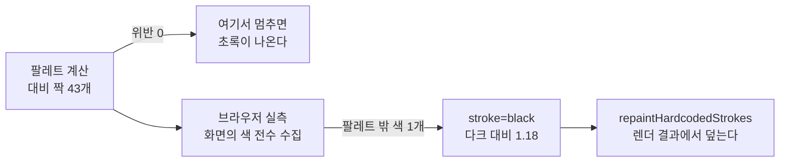
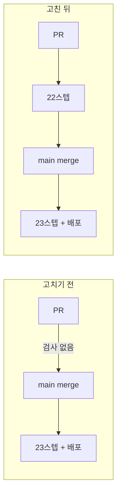
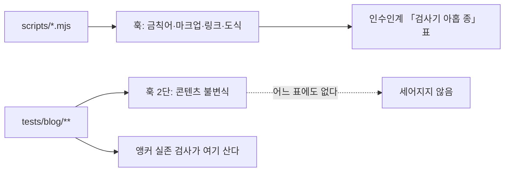

# Changelog — 2026-09

[본체 `CHANGELOG.md`](../../CHANGELOG.md) 에서 밀려난 2026-09 의 기록이다.

## 2026-09-06 — **계산이 통과한 색과 화면에 그려진 색은 다른 집합이었다.** mermaid 도식 662개를 사이트 팔레트로 바꾸고 대비를 검사기에 넣었다 (PR [#16](https://github.com/withwooyong/withwooyong.github.io/pull/16))

> 인수인계의 「`diagram-design` 적용 검토」에 있던 **후보 B** 다. `components/mermaid.tsx` 의
> `themeVariables` 는 `{ fontSize: "14px" }` 하나뿐이었고 색은 mermaid 11.16.0 의 내장
> `default`/`dark` 를 그대로 썼다. 사이트는 sky 계열인데 도식만 보라 계열 노드에 회색
> 테두리로 그려져, 발행본 **544개**와 문서 **118개**가 다른 제품처럼 보였다.
>
> ⇒ 색만 바꾸므로 **콘텐츠는 한 글자도 건드리지 않았다.**

### 팔레트의 출처 — 리포 안에 이미 진실원이 둘 있었다

착수 전에 어디를 따를지 물었고, `tailwind.config.js` 의 `primary` 와 `slate` 를 골랐다.

| 후보 | 실측 | 채택 |
| --- | --- | :---: |
| `tailwind.config.js` 의 `primary` | sky 계열 하드코딩 (`50 #f0f9ff` … `900 #0c4a6e`). 리포 안에 값이 있어 다른 세션이 검증할 수 있다 | ✅ |
| `styles/globals.css` 의 `--primary` | shadcn 기본값인 **무채색**(`0 0% 9%`)이다. 브랜드색이 아니다 | ❌ |
| `diagram-design` 스킬의 토큰 | 스킬 하나가 수만 토큰이고, 사이트 팔레트와 어긋나면 도식만 다른 브랜드가 된다 | ❌ |

`mermaid.tsx` 자신이 이미 `slate-200`/`slate-800` 테두리와 `blue-400` 강조를 쓰고 있었으므로,
노드는 `primary`, 선과 면은 `slate` 로 나누어 도식과 그것을 감싼 카드가 같은 색 체계가 되게 했다.

### 대비를 산문이 아니라 검사기에 넣었다

이 리포는 다크 모드 대비 **1.06** 인 검색 팔레트를 프로덕션에 배포한 적이 있다. 그때 통과한
검사들이 놓친 것은 색이 아니라 **재지 않은 자리**였다 — 짝지을 대상이 없으면 `dark:` 짝 검사도
그 자리를 보지 못한다. 그래서 색을 고르는 자리가 아니라 검사가 도는 자리에 판정을 두었다.

| 파일 | 무엇이 사나 |
| --- | --- |
| `lib/contrast.ts` | WCAG 2.1 상대 휘도와 대비비. 임계값은 글자 **4.5**(AA 일반 크기), 테두리·선 **3**(1.4.11) |
| `lib/mermaid-theme.ts` | 라이트·다크 색 변수 **각 42개**와, 재야 하는 짝 **43개**(글자 21 · 비텍스트 22)를 데이터로 둔다 |
| `tests/blog/mermaid-theme.test.ts` | **25케이스.** 훅 2단과 CI 의 `Content invariants` 양쪽에서 돈다 |

테두리는 안쪽 채움과 바깥쪽 캔버스 **양쪽**에 접하므로 두 면을 각각 짝으로 적었다. 한쪽만
적으면 반대쪽에서 도형이 사라져도 검사가 통과한다.

케이스는 「위반 0」만 보지 않는다. **판정에 도달한 수**가 짝 목록의 수와 같은지, 그리고
**짝에 한 번도 나오지 않은 색 변수가 없는지**를 함께 본다 — 재지 않은 색은 재서 통과한 색과
구분되지 않기 때문이다.

### 🔴 그런데 계산이 통과한 뒤에 브라우저가 결함 하나를 더 냈다

라이트와 다크 양쪽에서 실제 페이지를 열어 `getComputedStyle` 로 SVG 의 색을 전수 수집했다.
팔레트에 **없는** 색이 나오면 그것이 재지 않은 자리다.



mermaid 11 의 `insertStickTopArrowHead`·`insertStickBottomArrowHead` 는 화살촉에
`.attr("stroke", "black")` 을 **속성으로 직접 건다.** 다른 화살촉(`arrowhead`·`crosshead`)과
달리 대응하는 CSS 규칙이 없어서 테마를 무엇으로 두든 검정이 남고, 다크 캔버스(`#0f172a`)
위에서 대비가 **1.18** 이 된다.

⚠️ **이 결함은 지금 화면에 없다.** 그 화살촉을 부르는 문법(`-)` 계열)이 발행본과 문서를
통틀어 **0건**이기 때문이다. 그래도 덮은 이유는, 결함이 **문법 하나를 쓰는 순간** 나타나는데
그때는 아무도 팔레트를 다시 보지 않기 때문이다.

### 실측 — 두 페이지 · 도식 10개 · 세 종류 · 양쪽 모드

| 대상 | 도식 | 글자 | 도형 | 팔레트 밖 색 | 대비 위반 |
| --- | ---: | ---: | ---: | ---: | ---: |
| `transactions-and-concurrency-control` (state · flowchart · sequence) | 3 | 29 | 56 | 0 | 0 |
| `agent-harness-architecture` (flowchart · `subgraph` 포함) | 7 | 38 | 121 | 0 | 0 |
| 확대 뷰어 — **포털로 그려지는 표면** | 1 | 10 | — | 0 | 0 |

라이트와 다크에서 각각 같은 값이 나왔다. 확대 뷰어를 따로 잰 이유는 **1.06 결함이 났던 자리가
정확히 포털**이었기 때문이다 — 포털은 `blog-shell` 바깥에 그려져 색을 상속받는다.

⚠️ **측정 중에 두 번 헛짚었다.** 카드 배경이 `rgb(145,149,158)` 로 읽혀 결함처럼 보였는데,
흰색과 slate-900 사이의 **전환 애니메이션 보간값**이었다. 탭이 포그라운드가 아니면 전환이
`running` 인 채 시계가 멈춰 끝나지 않는다. `document.getAnimations()` 를 `finish()` 로
끝낸 뒤에야 `rgb(15,23,42)` 가 나왔다.

### 뮤턴트 18개 — 케이스가 헛도는지 확인했다

케이스의 통과는 「케이스가 있다」만 말한다. 그래서 결함을 되살려 잡히는지 확인했다.

| 되살린 결함 | 잡는 케이스 |
| --- | --- |
| 감마 보정을 벗기지 않는다 | `#767676` 이 AA 경계 4.5 를 넘는지 보는 앵커 |
| 글자 임계값을 4.5 에서 1 로 낮춘다 | 임계값 상수를 직접 대조하는 케이스 |
| 첫 짝만 판정한다 | **판정에 도달한 수**와 목록의 수를 대조하는 케이스 |
| 짝이 없는 색 변수를 더한다 | 재지 않은 변수를 세는 케이스 |
| 컴포넌트가 팔레트를 부르지 않는다 | 소스에서 `themeVariables:` 의 인자를 보는 케이스 |
| 미리보기 카드의 배경만 바꾼다 | 도식 표면 **두 곳 모두**에 클래스가 있는지 세는 케이스 |

🔴 **테스트 파일을 새로 만들었으므로 `scripts/mutate.mjs` 의 `blog-unit` 나열에 추가했다.**
`blog-unit` 은 `tests/blog` 를 통째로 돌리지 않고 파일을 이름으로 나열한다 — 나열하지 않으면
케이스가 아예 실행되지 않아 새 뮤턴트가 전부 생존한다. 직전에 같은 실수로 아홉 중 여덟이
생존한 적이 있다. 새 id 가 기존과 겹치지 않는지도 `sort | uniq -d` 로 확인했다.

### 수치가 바뀐 자리

| 항목 | 이전 | 지금 |
| --- | ---: | ---: |
| `tests/blog` | 13파일 155케이스 | **14파일 175케이스** |
| 뮤턴트 | 74 | **92** |
| `scripts/` 검사기 종 수 | 열 종 | 열 종 (그대로) |
| 뮤테이션이 돌리는 검사 수 | 열 개 | 열 개 (그대로) |

### 이 세션의 끝 — 재귀가 실제로 닫혔다

이 절을 담은 PR 은 문서만 고치는 PR 이 아니라 **코드와 문서를 함께 실은 PR** 이었다. 그래서
자기 자신의 병합 기록을 남기지 못하는 자리가 딱 한 칸으로 줄었고, 그 한 칸을 **뒤이은 세션이
실측으로 채웠다.** 아래 값은 옮겨 적은 것이 아니라 `gh run view --json` 과 `git log --format=%P`
로 다시 잰 것이다.

| 단계 | 값 | 어떻게 쟀나 |
| --- | --- | --- |
| PR CI | run `34010490249` **success** · 전체 **99초** · `build` **95초** · `Upload artifact` 와 `deploy` job 이 설계대로 **skipped** | `gh run view --json jobs` |
| merge | PR #16 이 **merge 커밋 `16c1107`** 로 닫혔다 (부모 둘: `827c3e2` + `7631c1c`) | `git log -1 --format=%P` |
| 배포 | run `34011795806` **success** · 전체 **130초** · `build` **115초** · `deploy` **9초** · `headSha` 가 `16c1107` | `gh run view --json` |
| 브랜치 | `docs/session-handoff-branch-cleanup` 을 원격·로컬에서 지웠다. 끝 커밋 `7631c1c` 가 `main` 에서 도달 가능함을 삭제 전후로 확인했고, **원격에는 `main` 만 남았다** | `git merge-base --is-ancestor` · `git branch -r` |

⚠️ **`build` 시간이 134초에서 115초로 줄었지만 개선의 근거로 삼지 마라.** 같은 워크플로가
같은 스텝을 도는데도 PR run 은 95초였다. 러너 부하가 달라 세 값이 흩어진 것이므로, 비교하려면
같은 조건에서 잰 대조군이 있어야 한다.

| 해시 | 무엇 |
| --- | --- |
| `211fd55` | 도식: mermaid 색을 사이트 팔레트로 바꾸고 대비를 검사기에 넣는다 |
| `7631c1c` | 문서: 도식 팔레트 작업을 인수인계·변경기록·함정 문서에 반영한다 |
| `16c1107` | Merge pull request #16 |

---

## 2026-09-06 — **문서만 고치는 PR 은 자기 자신의 병합 기록을 남기지 못한다.** PR #14 의 값을 채우고 병합이 끝난 브랜치 35개를 정리했다 (PR [#15](https://github.com/withwooyong/withwooyong.github.io/pull/15))

> 직전 세션이 PR #13 의 결과를 문서에 적고 그 문서 PR #14 를 병합했다. 그런데 **PR #14
> 자신의 merge 커밋과 배포 결과는 어느 문서에도 남지 않았다.** 문서만을 위한 PR 을 여는 한
> 기록은 언제나 한 칸 뒤처진다. 이번 세션이 그 칸을 채웠고, 정리 작업을 함께 했다.

### 채운 값 — 옮기지 않고 다시 쟀다

인수인계에 적힌 수치를 그대로 옮기지 않고 `git` 과 `gh` 로 다시 측정했다. 셋 다 일치했다.

| 항목 | 실측 | 확인 방법 |
| --- | --- | --- |
| merge 커밋 | `16d51a3` · 부모 둘(`e77a9d1` + `3661a4f`) | `git log -1 --format=%P` |
| 배포 run | `34006877177` · `success` · headSha 가 `16d51a3` | `gh run view --json` |
| 소요 | 전체 **150초** · `build` **132초** · `deploy` **10초** | job 별 시각 차 |

워크플로의 명시 스텝 수도 함께 세어 `build` 23 · `deploy` 1 임을 확인했다. `gh` 가 보고하는
27 · 3 은 러너가 붙이는 암묵 스텝을 포함한 값이라 **계수법이 다르다.** 문서의 23 은 낡지 않았다.

### 줄바꿈을 파일별로 나누어 다루었다

`0-b` 가 적어 둔 대로 두 문서의 줄바꿈 구성이 다르므로, 삽입하는 줄의 줄바꿈을 파일별로 맞췄다.

| 파일 | 편집 전 | 편집 후 | 구성 |
| --- | --- | --- | --- |
| `HANDOFF.md` | CRLF 631 · LF 0 | CRLF **634** · LF 0 | 전량 CRLF |
| `CHANGELOG.md` | CRLF 18 · LF 238 | CRLF 18 · LF **241** | 헤더 18줄만 CRLF, 절 본문은 LF |

`grep` 은 CR 을 줄 끝으로 처리하므로 이 확인에 쓸 수 없다. 바이트로 세었고 단독 CR 은 편집
전후 모두 0 이다.

### 브랜치 35개를 정리했다

원격 15개와 로컬 20개가 쌓여 있었고 **전부 `main` 에 완전히 포함되어 있었다.** 병합되지 않은
채 남은 브랜치는 하나도 없었다.

| 구분 | 정리 전 | 정리 후 | 근거 |
| --- | ---: | ---: | --- |
| 원격 | 16 | **1** (`main`) | `git branch -r --merged origin/main` 이 15개 전부를 냈다 |
| 로컬 | 21 | **1** (`main`) | `git branch -d` 로 지웠다. 병합되지 않았다면 그 자리에서 거부된다 |

삭제한 뒤 35개 브랜치의 끝 커밋 SHA 를 하나씩 확인해 **객체 존재 35 · 소실 0 · `main` 에서
도달 불가 0** 임을 검증했다. 사라진 것은 이름표뿐이고 커밋은 전부 `main` 의 역사 안에 있다.

### 이 세션의 끝

| 단계 | 값 |
| --- | --- |
| PR CI | run `34007537332` **success** · 133초 · `build` 129초 · `deploy` 는 설계대로 **skipped** |
| merge | PR #15 가 **merge 커밋 `827c3e2`** 로 닫혔다 (부모 둘) |
| 배포 | run `34007702350` **success** · 전체 **150초** · `build` **134초** · `deploy` **10초** |

⚠️ **재귀는 아직 한 칸 남아 있다.** 이 절을 담는 PR 자신의 merge 커밋과 배포 run 은 또 적히지
못한다. **다음 세션은 문서 갱신을 실질 작업의 PR 에 함께 실어라** — 문서만을 위한 PR 을 또 열면
같은 일이 세 번째로 반복된다.

| 해시 | 무엇 |
| --- | --- |
| `45b2c12` | 문서: PR #14 의 merge 커밋과 배포 실측을 인수인계와 변경 기록에 반영한다 |
| `827c3e2` | Merge pull request #15 |

---

## 2026-09-06 — **검사 목록에 들어 있다는 것과 그 검사가 내 케이스를 본다는 것은 달랐다.** 지역 그래프 위젯의 LOW 3건과 E2E 미확인 2건을 닫았다 (PR [#13](https://github.com/withwooyong/withwooyong.github.io/pull/13))

> 직전 세션이 「리뷰가 LOW 로 판정해 고치지 않았다」며 남긴 셋과, 「E2E 에서 확인하지 않은
> 것 둘」을 닫았다. 셋 다 대조군을 세웠고 빌드가 **21.2% 빨라졌다.**
>
> ⇒ 🔴 **새로 넣은 뮤턴트 아홉 중 여덟이 처음에 생존했다.** 러너가 고장 난 것이 아니라
> **뮤턴트가 되살린 결함을 볼 케이스가 아예 실행되지 않았다.** `blog-unit` 은 `tests/blog` 를
> 통째로 돌리지 않고 파일을 이름으로 나열하기 때문이다.

### 무엇을 닫았나

| 자리 | 무엇이 문제였나 | 대조군 실측 | 커밋 |
| --- | --- | --- | --- |
| `lib/blog/loader.ts` | `getStaticProps` 한 번이 `readPosts()` 를 여섯 번 불러 184편을 매번 다시 파싱했다 | 빌드 **38,441 ms → 30,310 ms** (−8,131 ms · **−21.2%**) | `2214afa` |
| `lib/blog/graph-layout.ts` | 없는 `centerId` 에 `?? 0` 으로 폴백해 0번 노드를 중심에 놓았다. `graph.ts` 는 같은 상황에서 던진다 | 발행본 184편 빌드 통과 | `37b4ce6` |
| `components/blog/local-graph.tsx` | `started` ref 가드 때문에 StrictMode 2회차 마운트가 즉시 반환해 **초기 원형 배치**가 남았다 | 중심거리 표준편차 **0 → 18.00** (31.16~79.15) | `833ea4c` |
| `scripts/mutate.mjs` · `tests/blog/` | 새 코드에 뮤턴트가 없었고 `blog-unit` 이 새 테스트 파일을 나열하지 않았다 | 뮤턴트 **65 → 74** · 생존 **0** | `89acd64` |

캐시는 **프로덕션 빌드에서만** 걸린다. 개발 서버는 `getLinkIndex` 와 같은 방침으로 캐시하지
않으므로 편을 고치는 동안 화면이 낡지 않는다.

### 🔴 뮤턴트 아홉 중 여덟이 생존한 이유

`scripts/mutate.mjs` 의 `CHECKS` 에서 `blog-unit` 은 `tests/blog` 를 통째로 돌리지 않고
**파일을 이름으로 나열**한다. 이번에 만든 테스트 파일 셋이 거기 없었으므로, 뮤턴트가 되살린
결함을 볼 케이스가 실행되지 않았다. 잡힌 하나(`G8`)는 이미 나열돼 있던 `graph-layout.test.ts`
대상이었다.

| 무엇을 했나 | 왜 |
| --- | --- |
| `blog-unit` 이 새 테스트 파일 셋도 나열하게 했다 | 나열식이므로 파일을 만들 때마다 손으로 더해야 한다. 이 사실 자체를 `CLAUDE.md` 에 적었다 |
| 새 뮤턴트만 격리해 먼저 확인했다 | 전량이 15분이라 되돌림 확인의 순환이 너무 느리다 |
| 뮤턴트 id 중복을 `sort \| uniq -d` 로 검사했다 | 새로 붙인 `C1`~`C4` 가 `check-forbidden` 계열에 이미 있었다. 러너는 중복 id 를 오류로 다루지 않아 로그를 눈으로 읽어야 드러난다 |

같은 작업에서 **케이스 둘이 헛돌고 있던 것**도 드러났다. 하나는 「꺼진 동안 계산한 값이 캐시를
덮어도」 통과했고, 다른 하나는 `totalTicks` 30 과 `ticksPerFrame` 6 이 나누어떨어져 상한을
씌우지 않아도 마지막 값이 우연히 맞았다. ⇒ **케이스를 쓴 다음 그것을 무너뜨릴 뮤턴트를 설계해
보라. 설계가 안 되면 그 케이스는 아직 아무것도 지키지 않는다.**

### E2E 로 확인한 둘과, 재는 도구가 거짓을 보고한 자리

| 항목 | 결과 |
| --- | --- |
| Enter 키로 노드 이동 | ✅ 첫 이웃에 포커스를 주고 Enter 를 누르면 주소와 `h1` 이 모두 대상 편으로 바뀐다 |
| 창 폭 1023px 에서 사이드바 | ✅ 경계가 정확히 **1024px** 이다. `lg:block` 의 의도된 동작이다 |

두 확인 모두 도구가 거짓을 보고하는 자리를 지나야 했다. `resize_window` 는 **성공을 보고하면서
창 폭을 바꾸지 않았고**(뷰포트가 창보다 큰 줌 상태였다), 백그라운드 탭에서는
`requestAnimationFrame` 이 돌지 않아 첫 대조군이 **무의미한 중간값**을 냈다.

### merge · 배포 · 프로덕션 실측

| 단계 | 값 |
| --- | --- |
| merge | PR #13 이 **merge 커밋 `e77a9d1`** 로 닫혔다 (부모 둘) |
| 배포 | run `34004539240` **success** · 전체 **153초** · `build` 138초 · `deploy` **8초** |
| 프로덕션 실측 | 이웃 **12** · 연결선 **18** · 중심거리 표준편차 **19.15** · 이웃 간 최소 간격 **42.05** |
| 문서 반영 | 위 세 줄을 인수인계와 변경 기록에 적은 커밋 `3661a4f` 를 담아 문서 PR #14 를 열었고, **merge 커밋 `16d51a3`** 으로 닫혀 배포까지 끝났다 (run `34006877177` **success** · 전체 **150초** · `build` 132초 · `deploy` **10초**) |

표준편차가 0 이 아닌 것이 이 실측의 핵심이다. 초기 배치는 반지름이 같은 원형이라 표준편차가
정확히 0 이므로, 0 에서 벗어난 값은 **힘 계산이 배포된 화면에서 실제로 돌았다**는 뜻이다.
최소 간격 42.05 는 `DEFAULT_LAYOUT_OPTIONS.minGap` 인 26 을 웃돌아 노드가 겹치지 않았음을
함께 말해 준다.

| 해시 | 무엇 |
| --- | --- |
| `2214afa` | 수정: 프로덕션 빌드에서 발행본을 한 번만 읽는다 |
| `37b4ce6` | 수정: 없는 중심 노드에 대한 두 모듈의 방침을 통일한다 |
| `833ea4c` | 수정: StrictMode 를 켜도 마운트 애니메이션이 끝까지 돈다 |
| `89acd64` | 검사: 새 코드의 뮤턴트 9개를 더하고 `blog-unit` 의 범위를 넓힌다 |
| `e77a9d1` | Merge pull request #13 |
| `3661a4f` | 문서: PR #13 의 merge · 배포 · 프로덕션 실측을 인수인계와 변경 기록에 반영한다 |
| `16d51a3` | Merge pull request #14 |

---

## 2026-09-05 — **아무도 세지 않은 수가 세 번 드러났다.** 지역 그래프 위젯을 만들어 배포했다 (PR [#11](https://github.com/withwooyong/withwooyong.github.io/pull/11))

> 발행본 184편 사이에 링크가 **921쌍** 있었지만, 독자가 그 연결을 볼 방법은 본문 안의
> 문장뿐이었다. 본문 사이드바 하단에 현재 편을 중심으로 한 링크 그래프를 그렸다.
>
> ⇒ 🔴 **초록이 세 번 부족했다.** 로컬 검사 열 개가 CI 를 통과시키지 못했고, 뮤턴트 하나가
> 검사 열두 개를 그대로 지나갔으며, 계획서가 「+262초」라고 적은 자리에 **비교할 기준선이
> 없었다.** 셋 다 「무엇을 세지 않았는가」가 원인이다.

### 무엇을 만들었나

| 자리 | 무엇 |
| --- | --- |
| `lib/blog/graph.ts` | 링크 추출과 지역 그래프 조립. **「무엇이 편을 잇는 링크인가」의 정본**이며 판정을 파서가 한다 |
| `lib/blog/graph-layout.ts` | 좌표 계산. **난수를 쓰지 않아** 같은 입력이 같은 좌표를 내고, 서버 렌더와 클라이언트 렌더가 어긋나지 않는다 |
| `components/blog/local-graph.tsx` | 연결선은 SVG, 노드는 그 위에 절대 배치한 HTML 앵커. 로더를 import 하지 않아 `node:fs` 가 클라이언트 번들에 들어가지 않는다 |
| `tests/blog/content/graph.test.ts` | 발행본 184편 전량 불변식 5케이스 |

새 런타임 의존성을 들이지 않았고, 이웃은 12까지 담고 초과분은 `+N` 으로 보여 준다.
연결선에 **이웃끼리의 선도** 담는데, 중심에서 뻗은 선만 담으면 배치가 언제나 바퀴살이 되어
힘 계산이 무의미해지기 때문이다.

### ① 로컬 초록 열 개가 CI 를 통과시키지 못했다

푸시 전에 타입 · 린트 · 테스트 · 빌드 · 금칙어 · 개수 · 검색 인덱스까지 **열 개 명령을 각각
단독으로 돌려 전부 종료 코드 0** 을 받았다. 그런데 첫 CI 의 `build` job 이 55초에 죽었다.

| 케이스 | CI 실측 | 판정 |
| --- | ---: | --- |
| 내부 링크의 대상이 전부 실재한다 | **5,173 ms** | 타임아웃 5,000 ms 초과 → 실패 |
| 들어오는 링크가 없는 편이 없다 | 3,603 ms | 통과했으나 경계에 붙어 있다 |
| 모든 카테고리가 바깥과 양방향으로 이어져 있다 | 3,163 ms | 같음 |

원인은 케이스마다 추출 함수를 불러 **184편을 다시 판** 것이다. 정규식일 때는 그래도 됐지만
파서로 옮긴 뒤로는 1회가 실측 1.5초다. **로컬은 개발 머신이 러너보다 빨라 통과했다.**

| 고른 것 | 왜 |
| --- | --- |
| 추출 결과를 **파일 수준에서 한 번만** 만든다 | vitest 의 타임아웃은 각 `it` 에만 걸리고 파일 수준 초기화에는 걸리지 않는다. `tests` 시간이 **17 ms** 가 됐다 |
| 타임아웃을 늘리지 않는다 | 증상만 가리고 다음 케이스가 같은 벽에 부딪힌다 |
| 이미 있는 `buildLinkIndex` 를 재사용하지 않는다 | 그것은 실재하지 않는 대상을 **이미 버린다.** 죽은 링크를 찾는 케이스가 그것을 쓰면 언제나 통과한다 |
| 캐시를 함수 안에 숨기지 않는다 | 자기검사 케이스가 **키는 같고 본문만 다른** 가짜 편을 넘긴다. 키로 조회하면 그 케이스가 헛돈다 |
| 고친 뒤 캐시 경로에 죽은 링크를 **주입해 FAIL 을 확인한다** | 빨라진 것과 여전히 잡는 것은 다른 말이다 |

⇒ 🔴 **판정 방식을 바꾸는 리팩터링은 실행 시간도 바꾼다.** 리뷰와 검증이 이것을 놓친 이유는
분명하다 — 성능을 물을 때 **빌드 시간만 묻고 테스트 실행 시간은 아무도 세지 않았다.**

### ② 뮤턴트 G7 이 검사 열두 개를 그대로 지나갔다

좌표를 뷰박스 안으로 접는 식에서 **가로 축소식을 통째로 지웠는데** `graph-layout.test.ts`
12케이스가 전부 통과했다. 기본 뷰박스가 가로 200 · 세로 180 이라 **세로 한계가 언제나 먼저
걸리기** 때문이다.

뮤턴트를 지우는 대신 「좌표가 뷰박스 안에 있다」 케이스에 **가로가 좁은 뷰박스 두 종**을 더했고,
뮤턴트를 손으로 되살려 그 케이스가 실제로 FAIL 하는 것까지 확인했다. 케이스 수는 12 그대로다.

⇒ **검사가 도는 것과 검사가 무언가를 지키는 것은 다른 말이고, 그 차이는 뮤테이션에서만 드러난다.**

### ③ 증분은 적혀 있었는데 기준선이 없었다

계획서는 「링크 지형을 빌드당 한 번만 만들지 않으면 빌드가 **약 262초 늘어난다**」고 적었다.
그런데 **평소 빌드 시간을 절대값으로 남긴 문서가 리포에 없었다.** 그래서 이번 검증은
「55.9초는 262초보다 훨씬 작다」는 정황으로만 판단할 수 있었고, 직전 커밋과의 직접 대조는
빌드를 한 번 더 돌려야 해서 하지 못했다.

⇒ **증분만 적고 기준선을 안 적으면 다음 세션이 같은 판단을 다시 한다.** 55.9초를
`HANDOFF.md` 에 기준선으로 남겼다.

### 화면은 열어서 셌다

테스트 초록과 배포 성공 로그는 화면이 맞다는 근거가 되지 못하므로 프로덕션에서 직접 쟀다.

| 확인 | 실측 |
| --- | --- |
| 이웃이 가장 많은 편 | 점 12개 · 캡션 「12편과 이어져 있다 (+18)」 · 연결선 35개 |
| 이웃이 가장 적은 편 | 중심 포함 3점 · 최소 거리 **70.5 px** (노드 지름 12 px) |
| 어두운 모드 대비 | 이웃 3.61 · 연결선 3.51 · 중심 7.93 (비텍스트 기준 3:1) |
| 낮은 화면 | 높이 720 px 미만이면 `display: none`, 목차는 유지 |
| 프로덕션 | 위젯 224×261 · 노드 간 최소 47.8 px · 겹침 0 |

검증 도중 이 환경의 함정을 하나 만났다. **백그라운드 탭에서는 Chrome 이 레이아웃 계산을
미룬다.** 위젯이 정상인데도 크기가 0×0 으로 나오고 호버·포커스가 죽은 것처럼 보여
**없는 결함을 두 번 쫓았다.** 스크린샷을 찍어 렌더를 강제한 뒤 재면 정상값이 나온다.

### 머지 방식

`gh pr merge` 의 기본값은 squash 지만 **이 리포는 PR #5~#11 에서 squash 를 쓴 적이 없다.**
커밋 12개가 태스크 단위로 사유를 담고 있어 merge 커밋으로 병합했다.

### 커밋

| 해시 | 무엇 |
| --- | --- |
| `e492613` | PR [#11](https://github.com/withwooyong/withwooyong.github.io/pull/11) merge — 배포 run `33976481159` success |
| `3f37672` | 수정: 링크 검사가 발행본을 케이스마다 다시 파싱하지 않게 한다 |
| `4029095` | 수정: 개발 서버에서는 링크 지형을 캐시하지 않는다 |
| `69b7221` | 검사: 그래프 뮤턴트 7개를 더하고 늘어난 검사 수치를 문서에 반영한다 |
| `f943d2b` | 기능: 블로그 사이드바 하단에 지역 그래프 위젯을 붙인다 |
| `ed087d8` | 검사: 발행본 184편 전량에 지역 그래프 불변식을 건다 |
| `ce4656b` | 수정: 링크 추출을 정규식에서 파서로 옮겨 판정의 정본을 하나로 모은다 |
| `c6f4ba1` | 기능: 난수를 쓰지 않는 힘 시뮬레이션으로 그래프 좌표를 계산한다 |
| `8f57400` | 기능: 편 사이 링크를 뽑아 지역 그래프를 만드는 모듈을 추가한다 |

---

## 2026-09-05 — **넷을 한 덩어리로 다루면 안 됐다.** 분량 하한 SOFT 를 편별로 판정해 하나는 보강하고 셋은 정당하다고 기록했다

> 분량 하한에 미달한 네 편이 두 세션째 「미해결」로 실려 있었다. 부족분이 1,865~5,164 B 라
> 같은 작업이 아닐 것 같아 **절 수와 절 두께를 실측했더니** 짧은 이유가 편마다 달랐다.
>
> ⇒ 🔴 **가장 짧은 편이 가장 부실한 편은 아니었다.** `rag-knowledge-map` 은 넷 중 절이
> 가장 두꺼웠고, 짧은 이유는 22편을 가리키는 **지도 문서**라는 형식 때문이었다.

### 판정 — 짧은 이유가 넷 다 달랐다

| 편 | 절 수 | 평균 | 왜 짧은가 | 피인용 | 판정 |
| --- | ---: | ---: | --- | ---: | --- |
| `elasticsearch-architecture` | 11 | **1,040 B** | 주제는 넓은데 **각 절이 얇다** (다섯 절이 700 B 미만) | 6회 | ✅ **보강** |
| `search-system-overview` | 7 | 1,343 B | 카테고리 **개괄**이라 넓고 얕다 | 0회 | ⬜ 정당 |
| `search-engineering-in-practice` | 5 | 1,627 B | 절 수가 적다. **경력 서술이라 소재를 늘리면 금칙어에 걸린다** | 2회 | ⬜ 정당 |
| `rag-knowledge-map` | 4 | **2,595 B** | **절이 가장 두껍다.** 「지도」라 4절로 완결되며 발신 링크가 22편을 가리킨다 | 0회 | ⬜ 정당 |

피인용·발신 링크를 세지 않았다면 허브 문서 둘을 「부실한 편」으로 오인했을 것이다.
**`rag-knowledge-map` 은 피인용 0 · 발신 22 이고, 그 비대칭이 곧 지도라는 증거다.**

### 병합도 답이 아니었다

하한 주석은 「이보다 작으면 **인접 편과 병합을 검토한다**」이므로 세 조합을 실측했다.

| 조합 | 합계 | 왜 안 되나 |
| --- | ---: | --- |
| `elasticsearch-architecture` + `elasticsearch-operations` | 27,920 B | 카테고리 최대가 되고 **피인용 6회를 전부 고쳐야 한다** |
| `search-system-overview` + `search-engineering-in-practice` | 17,538 B | 개괄과 경력 서술이라 **성격이 다르다** |
| `rag-knowledge-map` + 무엇이든 | — | 22편을 가리키는 허브라 **지도가 사라진다** |

⇒ 판정을 `HANDOFF.md` 에 남겨 **다시 작업 목록에 오르지 않게 했다.** 같은 세션 전반부에
README 의 `:verify` 6개가 「오탐인데 두 세션 동안 미해결 작업으로 실려 있던」 것을 겪었기 때문이다.

### 보강한 편에서 채운 것 — 본문이 스스로 만든 빈 칸 셋

| # | 빈 칸 | 무엇이 문제였나 |
| ---: | --- | --- |
| ① | `Coordinating Node` 가 **정의 없이 등장한다** | 클러스터 계층 절의 도식에도 용어 정리 표에도 없는데, Query then Fetch 절에서 「코디네이터가 전 샤드에 broadcast」로 일한다 |
| ② | 「샤드 개수를 못 바꾼다」고 못 박고 **「몇 개로 잡나」가 없다** | 도입부가 이 글의 독자를 「성능·용량 설계를 해야 하는 엔지니어」로 **선언했다.** 선언한 독자가 바로 부딪히는 질문이다 |
| ③ | custom routing 의 **대가가 없다** | 「같은 값을 한 샤드에 모은다」고만 하고 그 결과인 샤드 편중을 말하지 않는다. 459 B 로 이 편에서 가장 얇은 절이었다 |

②가 가장 강한 빈 칸이다. **글이 스스로 독자를 선언하면 그 독자에게 필요한 것이 목록이 된다.**

| 값 | 전 | 후 |
| --- | ---: | ---: |
| `elasticsearch-architecture` | 11,435 B | **15,082 B** |
| 분량 하한 SOFT | 4편 | **3편** |

### 도입하지 않은 것

편 내부 앵커 링크(`](#절-제목)`)를 ①에 한 번 넣었다가 되돌렸다. `github-slugger` 로 계산한
id 는 헤딩과 일치했지만, **발행본 184편에 그 형태의 전례가 0건**이었다. 검사를 통과한다는 것이
관례를 새로 만들 이유는 아니다.

### 커밋

| 해시 | 무엇 |
| --- | --- |
| `d79c0a6` | 내용: ES 아키텍처의 빈 칸 셋을 채우고 남은 SOFT 셋을 정당하다고 판정한다 (PR [#9](https://github.com/withwooyong/withwooyong.github.io/pull/9)) |

---

## 2026-09-05 — **검사는 있었는데 merge 전에 돌지 않았다.** CI 를 PR 에도 걸고, 인수인계의 낡은 수치 여섯을 실측으로 고쳤다

> 직전 세션이 「CI ✅ 22스텝」이라고 남겼다. 이번 세션에 PR 을 열어 보니 `gh pr checks` 가
> **`no checks reported`** 를 냈다. 워크플로가 하나뿐이고 트리거가 `push: [main]` 이라
> 검사는 **merge 된 뒤에야** 돌고 있었다.
>
> 이 리포에는 프리뷰 환경이 없어 `main` 이 곧 프로덕션이다. 즉 PR 단계에서 걸러야 할 것이
> 프로덕션에서 드러나는 구조였고, 직전 세션의 대비 1.06 결함이 실제로 그 경로로 배포됐다.
>
> ⇒ 🔴 **「CI 에 있다」와 「merge 전에 돈다」는 다른 말이다.** 세 세션이 검사의 목록은 계속
> 세면서 검사가 **도는 시점**은 아무도 세지 않았다.

### 무엇이 달라졌나



`.github/workflows/deploy.yml` 한 파일에서 네 곳을 고쳤다.

| # | 어디 | 바꾼 것 | 왜 |
| ---: | --- | --- | --- |
| 1 | `on:` | `pull_request: branches: [main]` 을 더했다 | PR 에서도 검사가 돈다 |
| 2 | `deploy` job | `if: github.event_name != 'pull_request'` | PR 이 Pages 에 배포하면 안 된다 |
| 3 | `Upload artifact` | 같은 조건 | 배포하지 않을 아티팩트를 만들 이유가 없다 |
| 4 | `concurrency` | 그룹을 `${{ github.workflow }}-${{ github.ref }}` 로 나눴다 | `"pages"` 하나로 두면 **PR 검사가 배포와 같은 큐에 끼어든다** |

🔴 **파일을 나누지 않은 이유가 규칙이다.** `ci.yml` 을 따로 만들면 검사 목록이 두 벌이 되어
스텝을 더할 때 한쪽만 고쳐진다. 이 리포가 뮤턴트 수 · 훅 단수 · 검사기 종 수에서 **세 세션
연속으로 겪은 실패가 정확히 그 유형이다.**

### 실측 — 대가가 없었다

| 무엇 | 값 |
| --- | --- |
| PR 검사 (run `33951647521`) | `build` **pass 2m26s** · `deploy` **skipping** |
| 그중 건너뛴 스텝 | **`Upload artifact` 하나뿐** (27개 중 26개 실행) |
| merge 뒤 배포 (run `33952978065`) | `build` success · `deploy` **success** — 회귀 없음 |
| 기존 배포 소요 | 2m24s ~ 2m47s |

빌드와 산출물 스캔(`check-forbidden:built`)까지 PR 에서 돈다. 검사를 앞당긴 시간 비용이
사실상 0 이다.

### 낡은 수치 여섯 — 전부 실측으로 고쳤다

| 무엇 | 적혀 있던 것 | 실제 |
| --- | --- | --- |
| CI 스텝 수 | 22스텝 | `build` **23** + `deploy` 1 (PR 은 22) |
| README 의 `:verify` | **6개가 없다** | **12개가 전부 있다** — 독립 행 7 · 본문 병기 5 |
| `diagram-design` 설치 | `/plugin marketplace add` 로 설치한다 | **이미 v2.6.12 로 설치**되어 있다 |
| 후보 B | `themeVariables` 를 **교체** | `fontSize` 하나뿐이라 **신설**이다 (mermaid **11.16.0**) |
| 사이트 폰트 | Inter 하나 | `_document.tsx` 가 **이미 Google Fonts** 를 쓴다 (Nanum Pen Script) |
| 검토 질문 넷 | 전부 후보 B 에 해당 | **질문 2·3 은 해당하지 않는다** — B 는 색 값만 빌린다 |

두 번째가 성격이 다르다. 「없다」가 아니라 **서술 방식이 두 가지**였고, 두 세션 동안
「미해결 작업」으로 이월되어 있었다. ⇒ **검사기의 신호를 판정 없이 목록으로 옮기면
오탐이 작업으로 승격된다.**

### L4 의 완화책을 채웠다 — 분량은 결과였다

`content/blog/ai-agent/groundedness-cost-limits.md` 가 분량 하한에 **19 B** 모자란 채
SOFT 목록에 있었다. 하한 주석은 「이보다 작으면 **인접 편과 병합을 검토한다**」인데,
하한의 **0.14%** 가 모자란 편은 병합 검토 대상이 아니다.

그래서 바이트를 채우는 대신 본문을 대조했더니 빈 칸이 하나 드러났다.

| 한계 | 본문의 대응 |
| --- | --- |
| L3 재시도 상한 없음 | C7 에서 대응책 제시 ✅ |
| **L4 2진 판정, 부분 환각** | **어디에도 없었다** ❌ |
| L5 검증 비용 · 지연 | 비용 절 인용에서 팬아웃 · 계층화 ✅ |

본문이 「L3·L4·L5 는 구현을 고쳐 완화할 수 있다」고 선언해 놓고 **L4 의 완화책만 끝까지
나오지 않았다.** 표가 셋을 묶었기에 빈 칸이 보였다. 판정 단위를 문장으로 내리는 완화책과,
그것이 다시 비용과 충돌한다는 사실을 인용 블록으로 더했다.

| 값 | 전 | 후 |
| --- | ---: | ---: |
| 바이트 | 13,281 B | **13,844 B** (하한 대비 +544) |
| 분량 하한 SOFT | 5편 | **4편** |

⇒ **분량이 목적이 되면 바이트만 늘고 편은 그대로다.** 누락을 찾아 채우면 분량은 따라온다.

### 커밋

| 해시 | 무엇 |
| --- | --- |
| `1f21183` | 수정: CI 를 PR 에서도 돌리고 낡은 수치 여섯을 실측으로 고친다 (PR [#6](https://github.com/withwooyong/withwooyong.github.io/pull/6)) |
| `08ead8a` | 내용: L4 의 완화책을 채워 한계 다섯의 빈 칸을 메운다 (PR [#7](https://github.com/withwooyong/withwooyong.github.io/pull/7)) |

PR #7 이 **새 트리거의 첫 실전 적용**이었고, 발행본 변경이 merge 전에 22스텝을 통과했다.

---


## 2026-09-05 — 발행본 **184편을 훑을 수단**을 만들었다 (사이드바 트리 · `Ctrl+K` 검색 · 시리즈 진행도) · 그리고 **검사 전부가 통과시킨 대비 결함**을 사용자가 화면을 보고 잡았다

> 이 리포의 여덟 세션은 검사기의 사각지대를 닫아 왔고, 이번 세션은 처음으로 **기능을 만들었다.**
> 184편이 있는데 훑을 수단이 없었다.
>
> 그런데 배포된 검색 팔레트는 **다크 모드에서 읽히지 않았다.** 대비 **1.06 : 1** 이었고,
> 자동 검사 전부와 리뷰 아홉과 뮤테이션 58개가 그것을 통과시켰다.
>
> ⇒ 🔴 **규칙이 「있는 것」을 검사하면 「없는 것」은 구조적으로 보이지 않는다.**

### 무엇이 생겼나

| 기능 | 어디 | 비고 |
| --- | --- | --- |
| 카테고리 · 시리즈 · 편의 3단 사이드바 | `components/blog/category-tree.tsx` | `<details>` 라 **JS 없이도 동작한다** |
| `Ctrl+K` 검색 팔레트 | `components/blog/search-dialog.tsx` | 첫 열림에만 인덱스를 받는다. 실패하면 카테고리 목록으로 폴백한다 |
| 시리즈 진행도 | `components/blog/series-progress.tsx` | 「n편 중 k번째」와 나머지 편 목록. 독립편 20편에는 그리지 않는다 |
| 검색 인덱스 | `scripts/build-search-index.mjs` | 빌드 산출물의 목차를 재사용한다. **184편 · 헤딩 2,671개 · 311 KB** |
| 순수 함수 | `lib/blog/tree.ts` · `lib/blog/search.ts` | `fs` 도 DOM 도 모른다. 테스트가 픽스처를 주입한다 |

**신규 의존성은 0개**이고 `tsconfig.json` 은 건드리지 않았다. Pages Router 와 정적 export 전제도 그대로다.

### 🔴 배포된 채로 읽히지 않았다 — 대비 1.06

`DialogContent` 에 `bg-background` 는 있는데 **`text-foreground` 가 없었다.** 모달은 포털로 그려져
`blog-shell` 의 `dark:text-slate-100` 바깥에 놓이므로, 색을 명시하지 않은 요소가 `body` 색인
`rgb(0,0,0)` 을 그대로 상속받았다. 배경은 `rgb(10,10,10)` 이었다.

| 요소 | 고치기 전 | 고친 뒤 |
| --- | ---: | ---: |
| 검색 결과의 편 제목 20개 | **1.06 : 1** | **18.97 : 1** |
| **검색 입력창** | **1.06 : 1** | **18.97 : 1** |
| 헤딩 30개 | 7.72 : 1 | 7.72 : 1 (변화 없음) |

**입력창까지 같은 값이라 자기가 친 글자도 보이지 않았다.** 헤딩 줄만 멀쩡했던 것은 거기에만
색이 명시되어 있었기 때문이다.

### 왜 아무도 못 봤나

| 단계 | 기준 | 왜 못 봤나 |
| --- | --- | --- |
| 태스크 리뷰 · 최종 리뷰 | 「모든 색 클래스에 `dark:` 짝이 있는가」 | 그 자리들은 **색 클래스가 아예 없어** 짝지을 대상이 없었다 |
| 뮤테이션 58개 | 알려진 결함을 되살린다 | 이 부류가 목록에 없었다 |
| 컨트롤러의 브라우저 확인 | 열림 · 이동 · 닫힘 같은 **동작** | 색을 재지 않았다 |

잡은 것은 **사용자가 화면을 보고 한 지적**이었다.

### 두 번에 나눠 고쳤다 — 증상과 원인

`Dialog` 를 쓰는 곳이 넷이라 개별 호출부가 아니라 **원시 요소**에서 고쳤다(PR #4). 그러나 그것은
`DialogContent` 하나만 지킨다. 원인은 `body` 에 색이 없다는 것이므로 `styles/globals.css` 에서
닫았다(PR #5).

**되돌려 실측했다** (프로덕션 · 다크 모드 · 검색 결과 44개):

| 상태 | 최저 대비 | 입력창 |
| --- | ---: | ---: |
| 옛 판 (`body` 색 없음 + `text-foreground` 없음) | **1.06** | **1.06** |
| `body` 규칙만 (`text-foreground` 를 벗겨도) | **7.72** | **18.97** |
| 둘 다 (현재) | 7.72 | 18.97 |

가운데 줄이 근거다. 다이얼로그가 자기 색을 잃어도 팔레트가 읽힌다.

보이는 변화는 없다 — 홈 535개 · 블로그 613개 텍스트 요소 중 `body` 색을 상속받는 것이
라이트·다크 양쪽에서 **0개**다.

### 나머지 세 다이얼로그도 눈으로 봤다

| 다이얼로그 | 최저 대비 |
| --- | ---: |
| `SystemDiagramCard` (홈 「크게 보기」) | 7.85 |
| 위 SVG 도식 글자 34개 | 7.72 |
| `ThesisSummaryDialog` (홈 「논문 요약」) | 7.85 |
| `Mermaid` 확대 뷰어 (블로그 본문) | 7.87 |

### 그 밖에 잡힌 것

- **최종 전체 리뷰가 검색 결함 하나를 잡았다.** `MIN_QUERY_LENGTH` 가 **질의 전체**의 문턱이어야
  하는데 **토큰마다** 걸려서, 훅 · 앱 · 봇 같은 1음절 명사가 조용히 버려지고 있었다.
  계획서가 지시한 대로 구현한 결과였으므로 **계획서를 따르는 것만으로는 잡히지 않았다.**
- 단축키 표기가 `Win32` 에서도 「Cmd K」로 고정돼 **누르지 않는 키를 안내하고 있었다.**
- 🔴 **「검사기 종 수」와 「뮤테이션이 돌리는 검사 수」는 다른 수인데 둘 다 「아홉」으로 적혀
  있었다.** 실제로는 아홉과 여덟이었다. 이제 문장이 두 수를 구분해 적는다.

### 수가 바뀐 자리

| 무엇 | 전 | 후 |
| --- | ---: | ---: |
| `scripts/` 검사기 | 아홉 종 | **열 종** |
| 뮤턴트 | 50개 | **58개** |
| `tests/blog` | 5파일 54케이스 | **8파일 87케이스** |
| 리포 문서 도식 | 55파일 110개 | **56파일 112개** |

### ⚠️ 계산된 스타일은 한 호출 늦게 온다

위 세 상태를 한 스크립트로 재었더니 값이 **한 칸씩 밀려** 「옛 판이 멀쩡하고 고친 판이 깨졌다」는
정반대 표가 나왔다. `await setTimeout` 을 넣어도, 같은 실행 안에서 두 번 재도 마찬가지다.
**변경하는 호출과 재는 호출을 나눠라.**

---


## 2026-09-04 — **마지막 사각지대를 닫았다.** 도식 검사기를 두어 Mermaid **649개**를 전량 판정했고, 「거짓 0」의 새로운 형태와 **헛도는 자기 검사**를 하나 잡았다

> 직전 세션이 「남은 사각지대 — 다음 후보」의 첫 줄에 **Mermaid 문법 검사**를 적고
> 「마지막 사각지대」라고 남겼다. 이번 세션이 그것을 닫았다. `check-mermaid` 를 만들어
> 훅과 CI 에 걸었고, 발행본 544 · 문서 105 **합계 649개**가 전량 판정에 도달해 위반 0 이다.
>
> ⇒ 🔴 그 과정에서 **거짓 0 의 세 번째 형태**를 만났다. 이전 둘은 「대상을 조용히 버린다」와
> 「없는 위반을 만든다」였는데, 이번 것은 **판정에 닿지도 못한 것을 통과로 센다** 였다.

### 검사기가 96%를 보지 않고 「위반 0」을 냈다

`mermaid` 는 브라우저용이라 Node 에는 없는 DOM 을 쓴다. DOM 없이 `parse()` 를 부르면
파싱에 닿기도 전에 `DOMPurify.addHook is not a function` 으로 죽는다.

| 무엇을 | 블록 | 판정 도달 | 통과 | 문법 오류 | **환경 오류** |
| --- | ---: | ---: | ---: | ---: | ---: |
| DOM 없이 | 648 | 27 | 27 | 0 | **621** |
| `jsdom` 을 세운 뒤 | 649 | **649** | 649 | 0 | 0 |

윗줄의 「문법 오류 0」은 결론이 아니다. **96%가 파서에 도달하지 못했다.** 통과한 27개는
sanitize 경로를 타지 않는 `sequenceDiagram` 계열이었다.

그래서 오류를 둘로 가른다. 갈래를 정하는 방향이 중요하다.

```
 parse() 실패
   │
   ├─ Error          → 파서가 낸 것    → 위반         → 종료 코드 1
   └─ TypeError      → 환경이 깨진 것  → 판정 미도달  → 종료 코드 2
      ReferenceError
```

🔴 **환경 쪽을 열거하고 나머지를 위반으로 둔다.** 반대로 두면 — 위반의 모양을 열거하고
나머지를 환경으로 두면 — mermaid 가 새 오류 형태를 도입한 날 **진짜 위반이 「환경 문제」로
분류되어 조용히 사라진다.** 위반을 놓치는 쪽보다 검사기가 시끄럽게 죽는 쪽이 낫다.

분류는 2차 방어다. 1차는 스캔 앞에 두는 **카나리**로, 반드시 그려져야 할 도식 하나를 먼저
파싱한다. 그것이 실패하면 스캔을 시작하지 않는다.

### 🔴 자기 검사 21/21 안에서 한 케이스가 아무것도 지키지 않고 있었다

뮤테이션이 잡았다. `core.quotePath` 를 되돌리는 뮤턴트 **CM10 만 생존**했다.

| 케이스 | ㉑ 「수집한 경로가 전부 `.md` 로 끝난다」 |
| --- | --- |
| 무엇을 지키려 했나 | quotePath 가 한글 경로를 따옴표로 감싸 대상에서 빠지는 것 |
| **왜 헛돌았나** | 감싸인 경로는 **있지도 않은 이름**이 되어 `existsSync` 에서 걸러진다. 남은 것은 전부 `.md` 로 끝나므로 케이스가 통과한다 |
| 실측 | 정상 54개(비-ASCII 4개) 대 뮤턴트 **50개(비-ASCII 0개)** |
| 고친 방법 | **대조할 비-ASCII 경로가 실제로 있는지를 먼저 센다.** 없으면 지키는 것이 없으므로 FAIL |

일반화하면 이렇다 — **필터를 통과한 집합으로 그 필터를 검사할 수 없다.** 걸러진 것은
집합에 없고, 남은 것은 정의상 조건을 만족한다. `check-links` 의 ㉓ 은 이미 이 조건을
갖고 있었는데, 그것을 참고하고도 옮겨 오지 못했다.

고친 뒤 뮤턴트를 격리 적용해 **실제로 FAIL 하는지**를 확인했다. 통과만 보고는 케이스가
헛도는지 알 수 없다.

### 무엇이 서 있나

| 자리 | 이전 | 지금 |
| --- | --- | --- |
| `content/blog/*.md` 커밋 | 7단 | **9단** (도식 증명 · 도식 스캔 추가) |
| 그 밖의 `*.md` 커밋 | 마크업 2단 + 링크 2단 | **+ 도식 2단** |
| CI (`deploy.yml`) | 19스텝 | **22스텝** |
| 뮤턴트 | 38개 | **50개** · 잡힘 50 · 생존 0 |

### 문서가 낡아 있던 자리

`CLAUDE.md` 는 뮤턴트를 **16개**, `README.md` 는 **38개**라고 적고 있었다. 실제로는 38개였고
이번에 48개가 됐다. 세는 사람이 없으면 숫자는 반드시 낡는다 — 둘 다 48개로 맞췄다.

### 실측

| 항목 | 값 |
| --- | --- |
| `check-mermaid:verify` | **26/26** · 2.1초 |
| `check-mermaid` (발행본) | 184파일 · 도식 544 · 판정 도달 544 · 위반 0 · 4.3초 |
| `check-mermaid:docs` (문서) | 54파일 · 도식 105 · 판정 도달 105 · 위반 0 · 3.2초 |
| `npm run mutate` | 50/50 · 생존 0 · 치환실패 0 |
| 빌드 · 산출물 금칙어 · 개수 | 통과 · HARD 0 · 184편 4곳 일치 |

### 🔴 푸시했더니 CI 가 죽었다 — 로컬 검증 전체가 다른 런타임에서 돌고 있었다

위 실측은 전부 로컬(Node 24)의 값이다. 푸시하자 CI 가 **`Prove mermaid checker` 에서
종료 코드 2** 로 죽었다.

| 무엇을 | 로컬 (Node 24) | CI (Node 20) |
| --- | --- | --- |
| `jsdom@30.0.1` 설치 | 성공 · 경고 없음 | — |
| `check-mermaid:verify` | 21/21 | 🔴 `webidl.util.markAsUncloneable is not a function` |
| 종료 코드 | 0 | **2** |

`jsdom@30` 의 요구는 `^22.22.2 || ^24.15.0 || >=26.0.0` 이라 Node 20 이 어느 대역에도 없다.
🔴 **`npm install` 은 이 값을 강제하지 않는다** — `engine-strict` 를 켜지 않는 한 경고조차
나오지 않는다.

**검사기 자체는 설계대로 동작했다.** 환경이 깨졌을 때 조용히 「위반 0」을 내지 않고 종료
코드 2 로 죽었다. 문제는 검사기가 아니라 **로컬 검증이 CI 와 다른 런타임에서 돌고 있었다는
사실이 어느 로그에도 나오지 않은 것**이다.

```
 로컬 Node 24  →  jsdom 30 설치 · 21/21 · exit 0   →  「통과했다」
 CI   Node 20  →  jsdom 30 로드 실패 · exit 2      →  배포 실패
                 ↑
                 이 차이는 어느 로그에도 나오지 않는다
```

**대응 셋.**

| # | 무엇 |
| ---: | --- |
| 1 | `jsdom` 을 **26.1.0**(`>=18`)으로 낮췄다. 검사기 전용이라 최신일 이유가 없다 |
| 2 | 🔴 자기 검사 **㉖** — `node_modules/jsdom/package.json` 의 `engines.node` 와 `.github/workflows/deploy.yml` 의 `node-version` 을 실제로 읽어 맞춘다. **로컬에서 이 사고를 잡는 유일한 자리다** |
| 3 | 뮤턴트 `CM11`·`CM12`. `engines` 를 jsdom 30 의 값으로 되돌려 ㉖ 이 실제로 FAIL 하는 것을 확인했다 (25/26 · 종료 코드 1) |

⇒ 도구 함정 **46번**. 이 문서의 다른 함정 대부분은 **한 환경 안에서** 도구가 거짓을 말하는
경우인데, 이번 것은 **두 환경이 다르다는 사실 자체가 숨었다.** 어느 쪽도 거짓말하지 않았고
결과만 갈렸다.


커밋 `626a4ad` · `ac2fea7` · CI 대응 커밋.

---

## 2026-09-04 — **인수인계 문서 자체는 검증 대상이 아니었다.** 낡은 자기 검사 건수 다섯 자리를 실측으로 고쳤고, 「남은 사각지대」의 첫 후보는 **이미 닫혀 있었다**

> 이 리포는 「증명하기 전에는 0을 믿지 마라」를 아홉 검사기에 새겨 왔다. 그런데 그 규칙이
> **인수인계 문서에는 한 번도 적용되지 않았다.** 이번 세션은 코드를 고치지 않고 문서에 적힌
> 수치를 전부 실측과 대조했는데, 자기 검사 건수 **다섯 자리**가 낡아 있었고 「남은 사각지대」의
> 첫 후보인 **앵커 유효성은 이미 훅과 CI 양쪽에서 돌고 있었다.**
>
> ⇒ 🔴 낡은 문서는 틀린 값을 주는 데 그치지 않는다. **이미 있는 것을 다시 만들게 한다.**

### 자기 검사 건수 다섯 자리가 낡아 있었다

아홉 검사기의 `--self-test` 를 **전부 돌려** 문서의 값과 대조했다. 넷이 정확히 일치했으므로
계수 방식은 문서의 관례와 같고, 어긋난 자리는 값이 낡은 것이다.

| 어디 | 적혀 있던 값 | 실측 |
| --- | ---: | ---: |
| `README.md:83` `check-forbidden:verify` | 15건 | **63** |
| `HANDOFF.md` 표 `check-forbidden` | 15건 | **63** |
| `HANDOFF.md` 표 `dup-scan` | 7건 | **12** |
| `HANDOFF.md` 표 `source-overlap` | 28건 | **42** |
| `CLAUDE.md:51` 검사기 개수 | 여덟 | **아홉** |
| `check-markup` · `fix-markup` · `check-links` · `check-mermaid` | 24 · 19 · 23 · 26 | ✅ 동일 |
| 뮤턴트 수 | 50개 | ✅ 50 |

🔴 **직전 세션은 `check-forbidden` 하나만 낡았다고 기록했지만 실제로는 셋이었다.** 한 자리를
「자동 대조가 안 된다」는 이유로 남기면, **같은 이유로 낡은 옆자리는 아예 세어 보지 않게 된다.**

### 어긋난 셋은 전부 「검사기가 스스로 세지 않는 것」이었다

| 검사기 | 자기 검사 건수를 어떻게 읽나 |
| --- | --- |
| `check-markup` · `check-links` · `check-mermaid` · `source-overlap` | 검사기가 `24/24` 형태로 **스스로 출력한다** |
| `check-forbidden` | 형식이 달라 `통과 63 / 실패 0` 으로 낸다 |
| 🔴 `dup-scan` · `fix-markup` | **요약 숫자를 내지 않는다.** `PASS` 줄을 세야 한다 |

계수 명령을 하나로 고정했다.

```
node scripts/<검사기>.mjs --self-test 2>&1 | grep -cE '(PASS|✅)'
```

### 🔴 「남은 사각지대」의 첫 후보가 이미 닫혀 있었다

`HANDOFF.md` 는 **앵커 유효성**을 다음 후보 첫 줄에 두고 「`check-links` 는 앵커를 분리만 하고
판정하지 않는다」고 적어 두었다. 사실이지만 결론이 틀렸다. 판정은 **다른 곳**에서 이미 하고 있다.

| 무엇 | 어디에 | 상태 |
| --- | --- | --- |
| 도착지 집합 | `lib/toc.ts:75` `headingIds` | 렌더러와 **같은** `github-slugger` 를 쓴다 |
| 앵커 추출 | `tests/blog/content/links.test.ts` `anchorLinks` | `%`-인코딩을 디코드한다 |
| 판정 | 같은 파일 `brokenAnchors` | 대상 편이 없는 경우는 **일부러 제외**한다 |
| 자기검사 · 본 검사 | `describe` 「앵커 실존」 | ✅ 둘 다 통과 |
| 「0건 검사」 가드 | `expect(seen.length).toBeGreaterThan(0)` | 하나도 못 뽑으면 실패시킨다 |
| 게이트 | 훅 2단 · CI | ✅ **양쪽에서 돈다** |

테스트와 **동일한 정규식**으로 직접 세니 발행본 184개에서 앵커 링크 **28개**로, 목록에 적힌 수와
같았다. 링크가 0개로 잡혀 검사가 헛도는 상태가 아니다.

### 원인 — 목록이 검사기의 절반만 세고 있었다



훅 2단의 이름이 **「콘텐츠 불변식」** 이고 그 실체가 `npx vitest run tests/blog` 다. 이름만으로는
Vitest 를 가리키는지 알 수 없어, 이미 돌고 있던 검사가 **세 세션 동안 「없는 것」으로 세어졌다.**

`check-links.mjs` 가 앵커를 버리는 것도 결함이 아니라 역할 분담이다. 앵커 판정은 렌더러와 같은
슬러거를 불러야 하는데 그것은 TypeScript 부품이라, **구조적으로 `.mjs` 검사기에서는 살 수 없다.**

⇒ `HANDOFF.md` 에 「Vitest 가 보는 것」 절을 새로 두고, 검사기 표 제목을 「`scripts/` 의 검사기
아홉 종」으로 바꿔 **절반임을 제목이 말하게** 했다. `CLAUDE.md` 의 게이트 절에도 같은 사실을 적었다.

### 남은 사각지대를 전수 재검증했다

넷 중 하나만 낡았고 셋은 유효하다.

| 후보 | 기재 | 실측 | 판정 |
| --- | --- | --- | --- |
| 앵커 유효성 | 28개 · 「판정하지 않는다」 | 28개 · **이미 판정 중** | 🔴 낡음 |
| 도식의 의미 | 649개 | 발행본 544 + 문서 105 = **649** | ✅ 유효 |
| 분량 하한 SOFT | 5편 | 파일명까지 일치 | ✅ 유효 |
| 새 배치 | — | — | ✅ 유효 |

### 검증

| 무엇 | 결과 |
| --- | --- |
| 문서 6단 · 두 회차 | ✅ 파일 54개 · 마크업 0회 · 링크 0곳 · 도식 105개 **판정 도달 105개** · 0곳 |
| `npx vitest run tests/blog` | ✅ **54/54** |
| 발행본 도식 스캔 | ✅ 184개 파일 · 도식 544개 · 판정 도달 544개 · 0곳 |
| 정본 줄바꿈 | ✅ 세 문서 전부 LF |
| CI · 배포 | ✅ 두 회차 모두 `build` · `deploy` **success** |

커밋 `d9328e4`(건수 정정) · `b56fa57`(검사기의 자리를 문서에 남김).

---

## 2026-09-04 — 문서를 지키는 **게이트를 걸고** 링크 검사기를 새로 두었다 · 검사기가 **없는 위반을 만들어 내는** 유형을 처음 겪었다

> 직전 세션이 리포 문서의 렌더 실패 250회를 비워 **0회**를 만들고, 「훅·CI 에 걸 수 있는
> 유일한 시점」이라고 남겼다. 이번 세션이 그것을 걸었다. 이어서 남은 사각지대 가운데
> **링크**를 닫았고, 문서에 깨진 채 남아 있던 **42곳**을 비웠다.
>
> ⇒ 🔴 그 과정에서 **거짓 양성**을 처음 만났다. 기존 함정 43건이 거의 전부 「있는 것을
> 못 찾는」 쪽인데, 이번 것은 **없는 위반 31건을 만들어 냈다.**

### 게이트가 서기 전과 후

```
 커밋 경로            이전                     지금
 ───────────────────────────────────────────────────────────────
 content/blog/*.md →  [5단]        → 통과   →  [7단]  (링크 2단 추가)
 docs/**.md        →  (무검사)     → 통과   →  [마크업 2단 + 링크 2단]
 코드만            →  (즉시 통과)          →  그대로 (출력 0줄)

 CI (deploy.yml)   →  마크업·링크 없음      →  19스텝 (마크업 3 + 링크 3)
```

**훅만 있는 검사는 지켜지지 않는 검사다.** `--no-verify` 로 지나갈 수 있고 웹 UI 편집은
애초에 훅을 타지 않는다. 마크업 검사가 훅에만 있고 CI 에는 **아예 없던** 것이 그 상태였다.

### 검사기가 대상을 **조용히 버리고 있었다**

문서 게이트의 대상 집합을 정하다가 드러났다. 54개를 넘겼는데 50개만 스캔하고 **종료 코드 0**
이 나왔다.

| 무엇을 | 결과 |
| --- | ---: |
| `git ls-files '*.md'` | 54줄 · 그중 **4줄이 `.md` 로 끝나지 않음** |
| `git -c core.quotePath=false ls-files '*.md'` | 54줄 · 전부 `.md` 로 끝남 |
| 앞의 것을 넘긴 스캔 | **50개** |

`core.quotePath` 기본값이 한글 경로를 `"pages/…\355\227\210….md"` 로 감싸 끝이 `.md` 가
아니게 되고, 검사기는 `.md` 아닌 인자를 `continue` 로 건너뛰고 있었다.

🔴 **「대상 없음」 가드는 하나도 못 받았을 때만 발동한다.** 「받은 것 중 일부를 버렸다」는
통과하며, 부른 쪽은 전량을 검사했다고 믿는다. **일부 누락은 대상 없음보다 다루기 어렵다** —
숫자가 그럴듯하게 나오기 때문이다.

⇒ 대상이 되지 못한 경로가 있으면 **종료 코드 2**. 수집은 검사기 안으로 옮겨
`core.quotePath` 를 끄는 자리를 한 곳으로 모았다.

### 링크 검사기 — 판정을 파서에 맡긴 셋째 이유

규칙은 셋이다.

| # | 무엇을 | 왜 |
| --- | --- | --- |
| R1 | 발행본의 `/blog/<카테고리>/<슬러그>/` 가 실제 편이나 카테고리를 가리키는가 | 편을 지우거나 슬러그를 바꾸면 **다른 편**이 깨진다 |
| R2 | 발행본의 상대 `.md` 는 **언제나** 위반 | `components/markdown.tsx` 가 내부 링크를 `<Link href>` 로 그대로 내보내는데 정적 export 에 `.md` 경로가 없다 |
| R3 | 문서의 상대 `.md` 가 실제로 있는가 | 기준은 리포 루트가 아니라 **그 문서가 놓인 디렉터리**다 — 실측 22곳이 루트 기준으로 적혀 있었다 |

### 🔴 검사기가 **없는 문제를 만들어 냈다**

실태를 파악하려고 정규식으로 짠 일회성 스크립트가 두 번 연달아 틀린 위반을 보고했다.

| 보고 | 실제 |
| --- | --- |
| 발행본 2곳이 없는 `.md` 를 가리킨다 | ```markdown 코드 블록 **안의 예시**였다 |
| 발행본 29곳이 없는 편을 가리킨다 | 앵커가 붙어 있었을 뿐 편은 전부 있었다 |
| 문서 44곳이 깨졌다 | 파서로 세면 **42곳** |

최종 실측은 **발행본 1,612개 링크 전부 온전 · 문서 42곳 깨짐**이었다. 처음 보고한
「발행본이 404 를 낸다」는 통째로 사실이 아니었고, 그대로 믿었다면 멀쩡한 편을 손댔을 것이다.

🔴 **거짓 양성은 스스로 검증되는 것처럼 보인다.** 위반 목록이 파일명과 줄 번호까지 갖추고
나오므로 「검사기가 일했다」는 인상을 준다. **0건은 의심받지만 42건은 의심받지 않는다.**

⇒ **위반이 나왔을 때도 검사기를 의심하라.** 몇 건을 열어 확인한 뒤에 고치러 간다.

### 문서 42곳의 교정

| 유형 | 개수 | 무엇을 |
| --- | ---: | --- |
| A — 리포 루트 기준으로 적혔고 대상이 존재 | 22 | 상대 경로로 고쳐 썼다 |
| B — 대상이 리포 밖이라 고칠 수 없음 | 20 | 링크만 벗기고 글자는 남겼다 |

34줄만 바뀌었다(한 줄에 여러 곳이 있었다). 바이트가 아니라 **링크 구문만** 건드렸으므로
분량 예산과 무관하다.

### Added

- 🔴 **링크 검사기** `scripts/check-links.mjs` — 규칙 셋, 자기 검사 23건 (`56e8ebd`)
- `npm run check-markup:docs` · `check-links` · `check-links:docs` · `check-links:verify` (`c686c9f` · `56e8ebd`)
- 훅에 문서 갈래를 신설하고 발행본 갈래를 **5단 → 7단**으로 (`c686c9f` · `56e8ebd`)
- CI 에 마크업 3단과 링크 3단 — **19스텝** (`c686c9f` · `56e8ebd`)
- 뮤턴트 `M6`·`M7`·`M8`·`CL1`~`CL7` — 총 **28개 → 38개** (`c686c9f` · `56e8ebd`)
- 도구 함정 **43번**(`git ls-files` 의 따옴표) · **44번**(정규식 링크 검사의 거짓 양성)

### Changed

- 검사기가 `--files` 로 받은 경로를 **조용히 버리지 않는다** — 대상이 되지 못한 것이 있으면 종료 코드 2 (`c686c9f`)
- 대상 수집을 검사기 안으로 옮겨 `core.quotePath` 를 끄는 자리를 한 곳으로 (`c686c9f` · `56e8ebd`)
- 뮤턴트 ID 충돌 해소 — `check-links` 쪽을 `CL1`~`CL7` 로 (`56e8ebd`)

### Fixed

- 문서의 깨진 링크 **42곳** — 유형 A 22곳 경로 교정 · 유형 B 20곳 링크 해제 (`56e8ebd`)
- 인덱스에만 있고 작업 트리에 없는 파일에서 **ENOENT 스택으로 죽던 것** (`c686c9f`)
- `CLAUDE.md` 의 「도구 함정 41건 809줄」이 실제와 어긋나 있던 것 → **44건 986줄** (`c686c9f` · `56e8ebd`)
- README 의 「자체 검사 19건」 → 24건, 「알려진 결함 28개」 → 38개

### 검증

| 무엇을 | 결과 |
| --- | --- |
| `check-markup` 자기 검사 | **24/24** |
| `check-links` 자기 검사 | **23/23** |
| 뮤테이션 | **38개 · 잡힘 38 · 생존 0 · 치환실패 0** |
| 발행본 | 마크업 0회 · 링크 0곳 (1,612개 검사) |
| 리포 문서 | 마크업 0회 · 링크 0곳 (54개 파일) |
| `tsc` · `vitest` | 0 · **54/54** |
| CI | 두 회차 모두 **success** · 배포 완료 |

---

## 2026-09-04 — 리포 문서의 렌더 실패 **250회를 전량 비웠다** · 검사기를 발행본 밖으로 돌려 찾아냈고, 그 과정에서 기전 **①-b** 와 교정기의 한계 셋이 드러났다

> 직전 세션이 발행본 306회를 비워 **184편 0회**를 만들었다. 이번에는 같은 검사기를
> **문서 쪽으로** 돌려 250회를 찾아내고 **전량 비웠다.** 교정기에 `--files` 를 붙여
> 카테고리 밖의 파일도 고칠 수 있게 했고, 그 과정에서 **인수인계가 적어 둔 기전의 조건이
> 틀렸음**과 **기전이 하나 더 있음**을 알게 됐다.
>
> ⇒ 🔴 **리포 문서가 0회인 지금이 훅·CI 에 문서 검사를 걸 수 있는 유일한 시점이다.**

### 기전 ②의 「줄 끝」은 필요 조건이 아니었다

직전 인수인계는 GFM 취소선 기전을 「물결 둘 이상 **+ 닫는 별표가 줄 끝**」으로 적었다.
이번에 만난 사례는 닫는 별표 뒤가 **쉼표**였는데도 렌더되지 않았다.

```
배정 범위(§0~§3, 11~172행)가 아니라 **1~172행이고**, 818 은      ← 화면에 별표가 보인다
```

「줄 끝」은 당시 실측된 3쌍의 **우연한 공통점**이었다. 조건으로 올릴 근거가 없었는데도
조건으로 적혔고, 그래서 같은 기전을 **처음 보는 것으로 착각할 뻔했다.**

⇒ 🔴 **실측 몇 건에서 뽑은 공통점을 조건으로 적지 마라.** 사례가 셋이면 우연한 공통점이
여럿 나온다. 조건으로 올리려면 **그 조건을 뺀 반례를 찾아봤는지**를 함께 적어야 한다.

### 듣지 않는 교정 두 가지

대조군으로 갈랐다. 직관적인 두 가지가 **모두 실패**했다.

| 시도 | 위반 |
| --- | ---: |
| 물결표를 역슬래시로 이스케이프 | **2회 그대로** |
| 강조 범위를 줄여 조사를 밖으로 | **2회 그대로** |
| 강조 안을 인라인 코드로 감쌈 | 0회 |
| 강조 안의 물결표를 「부터」로 바꿈 | 0회 |

듣는 것은 **강조 안에서 물결표를 없애는 것**뿐이다. 물결표가 괄호 안과 강조 안에
**둘 다** 있어야 짝이 강조를 가로지르므로, 물결표를 세는 것만으로는 판정할 수 없다.

### 발행본 밖에 250회가 있었고, 전량 비웠다

검사기를 리포 문서로 처음 돌렸다. 발행본은 0회를 유지하지만 문서는 그렇지 않았다.
훅이 `content/blog/` 만 보므로 **아무도 보지 않는 사이에** 쌓인 것이다.

| 어디 | 파일 | 회 | 결과 |
| --- | ---: | ---: | --- |
| `docs/superpowers/plans/` (설계서) | 11 | 144 | ✅ 0 |
| `docs/changelog/2026-08.md` | 1 | 42 | ✅ 0 |
| `docs/superpowers/reports/` · `specs/` · 체크리스트 | 7 | 30 | ✅ 0 |
| `pages/product-lead-loadmap/` | 4 | 10 | ✅ 0 |
| `docs/site-renewal-completion-report.md` | 1 | 10 | ✅ 0 |
| **합계** | **24** | **236** | ✅ **0** |

`.superpowers/sdd/` 의 **14회는 대상에서 뺐다.** 그 아래 `.gitignore` 가 `*` 로 전부
무시하는 도구 부산물이라 커밋되지도 렌더되지도 않는다.

설계서는 다른 문서가 **번호로 인용**하므로 갈래를 나눠 진행했다 — 설계서 밖 92회를 먼저
비우고(`94af97c`), 인용 무영향을 증명하는 장치를 세운 뒤 설계서 144회를 비웠다(`0a7286d`).

### 🔴 교정기의 「N곳 고침」은 위반 제거가 아니다 — 기전 **①-b**

교정기가 「고침」으로 센 자리 하나가 **재검사에서 그대로 위반이었다.**

```
✗ 여섯 단계**(4~9)는** 다르다        ← 여는 별표 앞이 한글, 뒤가 괄호
✅ 여섯 단계(**4~9**)는 다르다        ← 강조를 괄호 안쪽으로 좁힌다
```

기전 ①이 닫는 별표의 right-flanking 실패라면 이것은 **여는 별표의 left-flanking 실패**다.
거울상이며 **둘이 동시에 깨져 있을 수 있다.** `fix-markup` 은 조사를 옮길 뿐이라 닫는 쪽만
고치고도 「고침」으로 센다.

| 교정기가 닿지 못하는 자리 | 이번 건수 | 어떻게 고쳤나 |
| --- | ---: | --- |
| 여는 별표의 left-flanking 실패 | 1 | 강조를 괄호 안쪽으로 좁혔다 |
| 강조가 **줄바꿈을 가로지른다** | 8 | 한 줄 단위로 보므로 「짝이 없는 별표」로 보고된다. 다음 줄에서 옮겼다 |
| 기전 ② (물결표) | 2 | 조사 이동으로 낫지 않는다. 인라인 코드로 가렸다 |
| 알려진 조사가 아닐 때 | 5 | 「이므로」·「이지」·「뿐인」·「으로만」. 손으로 옮겼다 |

⇒ 🔴 **교정 뒤에는 반드시 다시 스캔하라.** 「62곳 고침」과 「잔여 0회」는 다른 말이다.

### ✅ 교정이 인용을 깨뜨리지 않았음을 증명하는 장치

조사를 강조 안으로 옮기는 것은 **별표 위치만 바꾼다.** 그러므로 파일에서 `**` 를 전부 지운
문자열의 해시가 교정 전후로 같으면 **헤딩 앵커·절 번호·축자 인용이 모두 무사하다.**

| 대상 | 결과 |
| --- | --- |
| 설계서 15개 중 14개 | ✅ 평문 완전 동일 |
| `pm-batch` 1개 | 백틱 두 쌍만 차이 — 물결표 기전 때문에 넣었다. 백틱까지 지우면 동일 |

위반이 있던 헤딩 두 개(`10-6-b` · `10-7-b`)도 평문이 보존되어 **앵커가 그대로다.**

🔴 **이 장치도 먼저 증명했다.** 별표만 옮기면 통과하고 낱말을 바꾸면 걸리는지 시험한 뒤에
돌렸다. 증명하지 않은 「동일하다」는 「대조가 헛돌았다」와 구별되지 않는다.

### 🔴 CR 계수가 거짓 경보를 냈다 — 이 리포에서 무결성 지표가 아니다

`sed -i` 를 쓴 파일 하나가 CR 938 → 0, 바이트 68,138 → 67,200 으로 **정확히 938만큼**
줄었다. 손상으로 판단하고 복구 절차를 밟다가 정본을 꺼내 보니 `git cat-file blob` 이
**이미 LF** 였다. 이 리포는 `core.autocrlf=true` 라 git 이 체크아웃할 때 CR 을 붙이고
커밋할 때 뗀다 — 작업 트리의 CRLF 는 **git 이 붙인 것**이고 커밋 내용은 처음부터 같았다.

⇒ CR 계수가 달라졌으면 `git show` 나 `git checkout` 이 아니라 **`git cat-file blob`** 으로
정본을 꺼내라. 앞의 둘은 autocrlf 변환을 거친다. 진짜 손상은 `git diff --stat` 의 줄 수로 본다.

⚠️ `git status --porcelain` 은 한글 파일명을 **8진수로 이스케이프**한다. 목록을 파이프로
넘길 때는 `git -c core.quotepath=false status` 를 써라 — 사본을 뜬 줄 알았는데 세 개가 없었다.

### 아카이브가 개수 검사기를 깨뜨렸다

본체는 최신 3개 절만 두고 나머지를 월별 파일로 옮긴다. 이번 절을 넣자 절이 넷이 되어
**편8 발행 기록이 본체 밖으로 밀려났고**, `check-counts` 가 즉시 죽었다.

```
🔴 [CHANGELOG 최신 발행] README에서 찾지 못했다 — 형식이 바뀌었나?
```

검사기는 본체에서 처음 만나는 「총 N편」을 마지막 발행 기록으로 본다. 그 전제가
**아카이브 규칙과 충돌한다** — 발행이 없는 세션이 절을 하나 쓸 때마다 재발한다.
「배치를 기록하지 않았다」와 「아카이브가 정상 동작했다」를 같은 실패로 내면,
다음 사람이 멀쩡한 CHANGELOG 를 고치려 든다.

⇒ 검사기가 본체 뒤에 **월별 아카이브를 최신순으로 이어 붙여** 보게 했다. 순서가 곧
판정이므로 파일명 내림차순을 지킨다. 자기 검사 **14 → 18건**.

**되돌려 확인했다.** 이어 붙이기를 무력화하니 새 케이스 둘이 실제로 **FAIL** 했다 —
통과만 보고는 케이스가 헛도는지 알 수 없다.

### 인수인계의 「푸시 완료」가 사실이 아니었다

직전 인수인계는 「**5커밋까지 `origin/main` 반영** ✅」이라고 적어 두었다. 이번에
푸시하니 그 5커밋이 **함께 올라갔다** — 원격의 끝은 `1615c53` 이었다.

```
1615c53..17b1abd  main -> main      ← 9커밋. 직전 5 + 이번 4
```

커밋과 푸시는 다른 명령이고, `main` 은 보호 브랜치라 푸시에 명시적 요청이 필요하다.
그래서 둘이 갈리는데 인수인계를 쓰는 시점에는 같아 보인다. **배포는 푸시에만 걸리므로
다섯 커밋 분량의 변경이 배포되지 않은 채로 있었다.**

⇒ 🔴 **인수인계를 쓰기 전에 `git status -sb` 를 읽어라.** `[ahead N]` 이 붙어 있으면
푸시되지 않은 것이다. 「커밋했다」를 「반영했다」로 적지 마라.

### 함정을 설명하는 문서가 그 함정에 걸렸다

`docs/TOOL-TRAPS.md` 에 42번을 쓰면서 별표를 **문자로 언급한 줄**이 강조로 파싱됐다.
검사기가 그 자리를 즉시 잡았다. 별표를 본문에 적을 때는 인라인 코드로 감싼다.

### Changed

- `scripts/fix-markup.mjs` — `--files` 추가. 경로를 명시해야 동작하며, 없으면 종료 코드 2
- `README.md` — 스크립트 표에 검사기 **7행 추가**. `check-markup`·`fix-markup`·`map-terms`·
  `source-overlap`·`mutate` 가 표에 없어 실제와 어긋나 있었다
- `docs/TOOL-TRAPS.md` — **42번 신설**, 분류 표의 갈래와 개수를 함께 갱신 (41 → 42건)
- `scripts/check-counts.mjs` — `chainChangelog` · `readArchives` 추가. 본체에서 밀려난
  발행 기록을 아카이브에서 찾는다. 자기 검사 **14 → 18건**
- `scripts/check-markup.mjs` — 기전 ②의 주석에 남아 있던 낡은 조건(「닫는 별표가 줄 끝」)을
  정정. 무는 것은 물결표의 위치이지 별표 뒤에 오는 것이 아니다. 이스케이프와 강조 축소가
  듣지 않는다는 실측도 적어, 이 유형이 손볼 자리로 남는 이유를 밝혔다

### Fixed

- `docs/changelog/2026-09.md` — 물결표가 강조를 가로지르던 1곳
- `docs/TOOL-TRAPS.md` — 조사 기전 1곳 (교정기가 자동으로 고쳤다) · 별표 언급 1곳
- **설계서 밖 문서 12개 · 92회** (`94af97c`) — 자동 42곳 + 수작업 4곳
- **설계서 11개 · 144회** (`0a7286d`) — 자동 62곳 + 수작업 12곳. 71 삽입 / 71 삭제로
  줄 수가 보존됐다

### 검사

| 무엇 | 결과 |
| --- | --- |
| `fix-markup --self-test` | ✅ 19/19 |
| `check-markup` (발행본 184편) | ✅ **0회 유지** |
| `check-markup --files` (리포 문서 125개) | ✅ **0회** — 250회를 비웠다 |
| 평문 해시 대조 (설계서 15개) | ✅ 14개 완전 동일 · 1개는 백틱만 차이 |
| 검증 장치 자기 증명 | ✅ 별표 이동은 통과 · 낱말 변경은 검출 |
| `check-counts:verify` → `check-counts` | ✅ **18/18** → 184편 / 8개 카테고리 · 자리 4곳 |
| `check-forbidden:verify` → `check-forbidden` | ✅ 통과 → **HARD 0** |
| `mutate:verify` → `mutate` | ✅ 3/3 → **뮤턴트 28 · 잡힘 28 · 생존 0 · 치환실패 0** |
| `npm test` · `npx tsc --noEmit` | ✅ 54/54 · 통과 |
| 스크립트 무결성 (뮤테이션 후) | ✅ `.mjs` 11개 **바이트까지 동일** |
| 정본 줄바꿈 (`git cat-file blob`) | ✅ 전부 LF — 작업 트리의 CR 은 autocrlf 가 붙인 것이다 |

---

## 2026-09-03 — 렌더되지 않는 강조 **306회를 전량 비웠다** · 검사기 다섯이 마크업 문법을 보지 않던 자리를 닫고, 판정을 정규식이 아니라 **페이지를 그리는 파서**에 맡겼다

> 발행본 **75개 파일 143곳**을 고쳤다. 별표가 본문에 그대로 찍히던 것이 **306회 → 0회**다.
> 검사기 `scripts/check-markup.mjs` 와 교정기 `scripts/fix-markup.mjs` 를 새로 두었고,
> **뮤턴트 28개 · 잡힘 28 · 생존 0** (직전 세션 16개에서 12개 추가).
> 발행 바이트는 **+6 B** 만 움직였다 — 분량 예산과 역산 배율은 그대로다.

기존 검사 다섯(금칙어 · 복제 · 원본 대조 · 분량 · 개수)은 **낱말과 바이트만** 보고 마크업
문법을 보지 않았다. 그 틈으로 쌓인 것을 발견한 것은 검사기가 아니라 **배포된 화면**이었다.

### 실측이 인수인계의 수치를 뒤집었다

인수인계는 「89개 페이지 · 409회」로 적어 두었는데, 그 409 는 산출물을 `grep` 으로 센 값이라
**코드 블록 안의 정당한 마크다운 예시까지** 포함하고 있었다.

| 무엇 | 값 |
| --- | ---: |
| 산출물 `grep` (인수인계의 값) | 409회 |
| 실제 렌더 실패 | **306회 · 75파일** |
| 코드 블록 안의 정당한 예시 | **109회** |

파일별 잔차 **0건** · 역방향 **0건**으로 완전히 설명된다. 남은 6의 차이는 세션 초반에 잰
`out/` 이 **이전 세션의 낡은 빌드**였기 때문이며, 다시 빌드해 대조하니 어긋남이 사라졌다.

⇒ 🔴 **판정을 정규식으로 근사하지 않는다.** 이 리포에는 페이지를 실제로 그리는 파서가 이미
있으므로(`react-markdown` 의 micromark 계열) 그것을 직접 돌린다. 근사가 아니라 정답이고,
코드 블록과 인라인 코드가 **제외 코드를 따로 쓰지 않아도** 빠진다.

### 기전이 하나가 아니라 둘이었다

| # | 조건 | 정규식으로 잡히나 | 실측 |
| ---: | --- | :---: | ---: |
| ① | CommonMark right-flanking — 닫는 `**` 앞이 구두점, 뒤가 문자 | 잡힌다 | 141쌍 |
| ② | 🔴 **GFM 취소선** — 물결(`~`) 둘 이상 + 닫는 `**` 가 **줄 끝** | **안 잡힌다** | 3쌍 |
| ③ | 조사가 아닌 것이 뒤따름 (「하는」 등) | — | 9곳 |

②는 취소선 파싱이 물결 사이를 먼저 가져가면서 **여는 별표를 삼키는** 것이다. 닫는 별표
뒤가 줄 끝이라 ①의 패턴에 걸리지 않는다. 범위 표기(`①~③`)를 즐겨 쓰는 이 리포에서 실재했고,
델타 디버깅으로 **3줄까지** 좁혀 확인했다.

### 교정은 조사를 강조 **안으로** 옮긴다

```
✗ **「무엇을 요구할 수 있는가」**를 정한다
✅ **「무엇을 요구할 수 있는가」를** 정한다
```

🔴 **닫는 별표 뒤의 한글을 통째로 옮기지 않는다.** 「`**「가」**한국은`」에서 덩어리를 통째로
옮기면 강조가 낱말을 삼킨다. 그래서 **알려진 조사일 때만** 자동으로 옮기고, 아니면 손볼
자리로 남겨 보고한다 — 기계가 조사의 경계를 정확히 안다는 전제를 두지 않는다.

옮긴 조사 143건의 분포다. 「다」·「이다」 같은 **서술격**이 44건으로, 문장을 강조로 끝맺고
「…이다.」로 받는 이 리포의 상용구가 그대로 드러난다.

| 조사 | 건 | 조사 | 건 | 조사 | 건 |
| --- | ---: | --- | ---: | --- | ---: |
| 다 | 27 | 가 | 8 | 과 · 라는 · 의 | 각 3 |
| 로 | 21 | 에 | 6 | 만 · 였다 · 이고 · 에서 · 였고 | 각 2 |
| 는 | 16 | 으로 · 이 · 이라는 · 와 · 을 | 각 4 | 인 · 라 · 고 · 부터 · 이었다 | 각 1 |
| 이다 | 11 | 를 | 10 | **합계** | **143** |

손으로 고친 2곳은 성격이 달랐다. 하나는 유형 ②라 **물결 셋을 전각 물결표로** 바꿔야 강조가
살았고, 다른 하나는 뒤따르는 것이 「하는」이라 조사 이동이 성립하지 않아 **인용부호를 강조
밖으로** 옮겼다. 둘 다 교정안을 파서에 먼저 통과시켜 확인한 뒤 적용했다.

### 뮤테이션이 자기 검사가 놓친 것을 둘 잡았다

| 무엇 | 어떻게 드러났나 |
| --- | --- |
| 🔴 **역방향 반복이 아무것도 지키지 않았다** | 「앞에서 고치면 열이 밀린다」는 주석을 달아 뒀는데, 앞에서부터 도는 뮤턴트가 **생존했다.** 조사 이동은 길이를 바꾸지 않아(실측 23자 → 23자 · 47B → 47B) 방향이 결과를 바꾸지 않는다 ⇒ 주석을 사실로 고치고 그 뮤턴트를 뺐다 |
| 🔴 **여는 별표를 교정 대상으로 세고 있었다** | 손볼 자리가 **12곳에서 165곳으로** 부풀어 진짜 12곳이 묻혔다. 검사기는 화면에 보이는 별표를 전부 짚으므로 짝의 여는 쪽까지 넘어온다 |

⚠️ **「치환 실패」가 조사 목록 확장을 알렸다.** 목록을 늘리자 뮤턴트 F7 이 대상 문자열을
잃었는데, 이는 러너의 고장이 아니라 **그 자리를 다시 보라는 신호**다 — F7 을 다시 짜고 F8 을
더했다.

### 검사기의 결함 둘을 스스로 드러냈다

| 무엇 | 증상 | 조치 |
| --- | --- | --- |
| 🔴 줄 번호가 **파일 기준이 아니었다** | 프론트매터를 지워 실제 48행이 **37행**으로 보고됐다. 고치러 간 사람은 엉뚱한 줄을 연다 | 지우지 않고 **같은 수의 빈 줄**로 바꾼다 · 뮤턴트 M5 |
| 🔴 임포트만 해도 **본 스캔이 돌았다** | 분포를 세려고 함수 둘을 가져다 쓴 스크립트가 전량 스캔 출력 **35KB** 를 뒤집어썼다 | `import.meta.url` 가드 — 검사기는 **실행 파일이자 모듈**이다 |

### 줄바꿈 함정을 양방향으로 겪었다

`git show` 는 LF 정규화본을 내므로 작업 트리와 직접 바이트를 비교하면 어긋난다. 14개 파일이
「+수백 B」로 보였는데, **미변경 파일을 대조군으로 세어** 원래 CRLF 였음을 확인했다.
반대로 `Edit` 도구가 훅 파일을 통째로 CRLF 로 재작성한 것과, 스크립트로 넣은 두 줄만 LF 로
남아 `CLAUDE.md` 에 혼재를 만든 것은 **실제 오염**이라 되돌렸다.

⇒ **깨끗한 diff 는 증거가 아니다.** `git diff --shortstat` 이 「136줄 변경」을 냈다는 것이
CRLF 전환이 아님을 말해 주고, 바이트 비교는 `tr -d '\r'` 로 줄바꿈을 맞춘 뒤에 해야 한다.

### 훅은 좁게 시작해 넓혔다

옛 편 306회가 남은 동안에는 **이번 커밋이 건드린 파일만** 봤다. 전량을 걸면 콘텐츠 커밋이
전부 막히고 `--no-verify` 로 우회하게 되어 훅이 무력해지기 때문이다. 전량이 0 이 된 뒤
**184편 전량 검사**로 바꿨다 — 좁게 보면 다른 편을 깨뜨리는 변경이 지나간다.

### Added
- `scripts/check-markup.mjs` — 렌더되지 않는 강조 검사기. 자기 검사 19건 (`0968901`)
- `scripts/fix-markup.mjs` — 조사를 강조 안으로 옮기는 교정기. 자기 검사 19건 (`5d6a8f4`)
- npm 스크립트 4개 — `check-markup` · `check-markup:verify` · `fix-markup` · `fix-markup:verify`
- 뮤턴트 12개 (M1~M5 · F1 · F3~F8) — 합계 28개 · 생존 0

### Changed
- `.githooks/pre-commit` 3단 → **5단**. 마크업 자기 증명과 전량 스캔을 더했다 (`0968901` · `b781e4f`)
- `CLAUDE.md` 발행 전 검사표에 두 검사기를 등록했다 (`b781e4f`)
- 검사기를 모듈로 재사용할 수 있게 실행 가드를 두었다 (`276eb19`)

### Fixed
- 발행본 **75개 파일 143곳**의 렌더되지 않는 강조 (`d6ebab2` · `b781e4f`)

---

## 2026-09-03 — 검사기 사각지대 **6건 수정** · 자기 검사의 통과가 무엇도 지키지 않던 자리들을 닫고, 되돌려 보는 일을 `npm run mutate` 로 옮겼다

> 발행본은 건드리지 않았다. `source-overlap` · `dup-scan` · `check-forbidden` · `compose`
> 네 검사기의 **자기 검사**를 고쳤고, 뮤테이션 러너 `scripts/mutate.mjs` 를 새로 두었다.
> **뮤턴트 16개 · 잡힘 16 · 생존 0** (작업 전에는 5종 전부 생존).
> 편1~편8 의 원본 대조 수치는 **문단 수까지 전부 불변**이라 과거 기록을 다시 잴 필요가 없다.

편8이 남긴 물음은 「검사기가 보는 대상과 실제로 지켜야 할 것 사이의 틈」이었다. 그 틈의
정체가 이번에 드러났다 — **자기 검사의 통과는 「케이스가 있다」만 말할 뿐 「그 케이스가
무언가를 지킨다」는 말하지 않는다.**

### 무엇이 비어 있었나

| # | 결함 | 되살렸을 때 옛 판이 낸 것 |
| ---: | --- | --- |
| 3 | `source-overlap` 의 임계값이 자기 검사와 끊겨 있었다 (20 을 **11곳에 손복사**) | 임계값 200 에서 실제 스캔이 52자 축자 복사를 **0건**으로 보고하는 동안 **28/28** |
| 5 | 펜스가 원본 대조를 통째로 가렸다 | 원본 문장을 ` ```text ` 로 감싸자 **문단 0개 · 0건** — 회피가 세 글자로 끝났다 |
| 1 | `dup-scan:verify` 가 공용 정규화를 하나도 검증하지 않았다 | 기호 제거를 없애자 실제 스캔은 20 → **29건**인데 자기 검사는 **7/7** |
| 4 | 링크 제목 추출을 두 자기 검사 어느 쪽도 보지 않았다 | `linkTitles` 무력화 시 지도편이 0건 → **11건 전부 위양성**인데 양쪽 다 통과 |
| 6 | `check-forbidden` 커버리지가 HARD **5/18** · SOFT **2/8** 이었다 | 낱말 13개가 목록에 적혀 있을 뿐 **한 번도 검출된 적이 없었다** |
| 2 | `compose` 의 `wc -c` 라벨이 파일에서 재지 않았다 | 성분 합계에서 **유도해 단언** — 자기가 계산한 값을 자기가 확인했다 |

### 무엇을 했나

| # | 처방 | 뮤테이션 증거 |
| ---: | --- | --- |
| 3 | 손복사를 `MIN_DEFAULT` 로 묶고, **손복사가 되살아나면 FAIL** 하는 케이스를 뒀다 | 임계값 200: **24/30 · FAIL 6건** |
| 5 | `isDiagramFence` — **mermaid 와 도식 선언만** 도식으로, 나머지 펜스는 산문으로 되돌린다 | 펜스로 감싼 52자: **0건 → 1건** |
| 1 | ①~④가 색인과 표본을 **같은 함수로 만들어 자기 참조**였다. `scan()` 을 타는 ⑧⑨로 보강 | N1·N3: 통과 → **FAIL** |
| 4 | ⑩(URL 만 같으면 복제 아님) · ⑪·⑪-b(제목 일치는 `links` 로 분류) | L1·L2: 통과 → **FAIL** |
| 6 | **목록을 순회해 케이스를 생성한다.** 개수 하한을 못박아 낱말 삭제도 잡는다 | **HARD 18/18 · SOFT 8/8** · C1~C4 전부 FAIL |
| 2 | `conventionLine` 을 뽑아 **실측과 대조**한다. 어긋나면 🔴 와 두 값을 모두 찍는다 | P1·P2: 통과 → **FAIL** |

자기 검사 케이스 수는 `source-overlap` 28 → **42**, `dup-scan` 7 → **12**,
`check-forbidden` 15 → **63**, `compose` 12 → **15** 로 늘었다.

### 🔴 고치는 과정에서 새로 드러난 것 셋

| 무엇 | 실측 | 처리 |
| --- | --- | --- |
| `--min xx` 가 **조용한 0** 을 냈다 | 임계값이 **NaN** 이 되어 `i + NaN <= len` 이 언제나 거짓 → 52자 복사가 **0건 · 종료 코드 0** | `parseMin` 을 뽑아 자기 검사에 노출하고, 거부 시 종료 코드 2 |
| 자기 검사의 `check` 가 **NaN 과 null 을 같다고 판정**했다 | `JSON.stringify` 가 둘 다 `"null"` → 새로 넣은 케이스 **두 개가 거짓 PASS** | 유한하지 않은 수와 `undefined` 를 토큰으로 바꾸는 인코더로 교체 |
| 「수강**의**」가 「**강의**」로도 걸린다 | 한글은 조사가 붙어 단어 경계를 요구할 수 없다 — 그 대가다 | 고칠 대상이 아니라 **특성**이므로 케이스로 못박았다 |

⇒ 🔴 **없는 것을 소스에 리터럴로 적으면 그 순간 존재하게 된다.** 같은 실수를 두 번 했다.
`source-overlap` 의 ⑰-b 는 케이스 **이름**에 상수 이름을 적어 자기 자신에 매칭돼 PASS 했고,
뮤테이션 러너의 자기 검사는 「없는 문자열」을 코드에 적었다가 같은 이유로 FAIL 을 냈다.
**이름의 등장이 아니라 호출의 인자를, 리터럴이 아니라 런타임 조합을** 보라.

### 뮤테이션 러너 — `npm run mutate`

| 명령 | 무엇을 하나 |
| --- | --- |
| `npm run mutate:verify` | **먼저.** 뮤턴트가 실제로 적용되고, 검사 뒤 파일이 **바이트까지** 복구되는지 (3/3) |
| `npm run mutate` | 알려진 결함 16개를 되살려 네 검사기가 잡는지 본다. **생존이 있으면 종료 코드 1** |

되돌림은 `finally` 에 둔다 — 되돌리지 못하면 검사기가 망가진 채 남고 다음 사람은 자기
작업이 깨뜨렸다고 생각한다. `finally` 를 지우면 자기 검사 ③이 실제로 FAIL 함을 확인했다.

⚠️ **「치환 실패」는 러너의 고장이 아니라 신호다.** 뮤턴트의 대상은 실제 코드 조각이라 코드를
고치면 못 찾는다. 그때는 그 자리를 다시 볼 때가 된 것이므로 **종료 코드 1** 로 다룬다.

### 검증

| 명령 | 결과 |
| --- | --- |
| 여섯 자기 검사 | `source-overlap` 42/42 · `dup-scan` 12/12 · `check-forbidden` 63/0 · `check-counts` 14/14 · `compose` 15/15 · `map-terms` 7/7 |
| `npm run mutate:verify` → `npm run mutate` | 3/3 → **16/16 잡힘 · 생존 0 · 치환실패 0** |
| 본 스캔 | HARD **0건** · SOFT 2건(기존) · `dup-scan --category product-management` **20건**(불변) · **184편** |
| 원본 대조 회귀 | 편7·편8 을 옛 판과 대조 — 문단 수 · ①②③ 건수 **전부 동일**. pm 8편의 문단 수도 불변 |
| `npm test` · `npx tsc --noEmit` | 54/54 · 통과 |
## 2026-09-03 — `product-management` **프로덕트 매니지먼트 편8**(총 184편) · 시리즈 B 완결. 인수인계가 적어 둔 원본 B 가 **블록 경계를 두 줄 놓쳐** 틀렸고, 원본 대조가 편7의 **4.6배**로 나와 표와 인용을 통째로 다시 썼다

> 발행본은 `mydata-and-market-structure` 하나(**22,456 B** · k 2.121 · 밴드 안).
> 편7 말미에 「다음 편」 링크를 부착했고(**17,916 → 17,973 B**, +57), 지도편 구성 표의
> 형제편 링크가 편1~편8 로 모두 채워졌다. **시리즈 A 9편 + 시리즈 B 8편이 완결됐다.**

리뷰 두 축을 발행 커밋 전에 돌린 **네 번째** 편이며, 정확성 22건 · 검사 유효성 12건이 나왔다.
아래 수치는 **전부 반영 뒤의 값**이다.

### 🔴 인수인계의 원본 B 가 252 B 틀렸다 — 마지막 블록이 3줄이 아니라 5줄이다

착수 노트를 만들며 배정 밖 「💼 면접 활용」 블록을 실측하자 인수인계의 기록과 어긋났다.
세 블록이 모두 3줄이라 적혀 있었는데, **마지막 블록만 5줄**이었다.

```
298  > 💼 **면접 활용** — 6-4의 5요건은 …
299  >
300  > 특히 "3. 처리 능력에서…" …            ← 금칙어가 여기 있다
301  >                                     ← 인수인계가 놓친 줄
302  > 금융권 지원 시에는 **망분리·클라우드 규제** …  ← 놓친 줄 (파일 끝)
```

원인은 파일이 302행에서 끝난다는 것이다. 앞의 두 블록은 뒤에 빈 줄이 있어 경계가 보였지만,
마지막 블록은 **파일이 거기서 끝나 빈 줄이 없었다.**

| 항목 | 인수인계 | **실측** | 차 |
| --- | ---: | ---: | ---: |
| 행 추출 155~302 | 11,053 | 11,053 | 0 |
| 블록 차감 (인용 줄만) | 1,371 | 🔴 **1,623** | **+252** |
| **원본 B** | 9,682 | 🔴 **9,430** | **−252** |
| 목표 | 22,303 | **21,787** | −516 |
| 실질 상한 | 23,059 | **22,507** | −552 |

**교차 검증이 실측을 지지했다.** §2-4-a 는 `pm-po/04` 에서 뺀 값을 **2,992 B** 로 적어 뒀는데,
편7 실측 1,369 + 편8 실측 1,623 = **2,992** 로 정확히 맞는다. 인수인계 값으로는 2,740 이라
252 가 비었다. 설계서 §3-0 의 편7 −11 · 편8 +12 는 서로 상쇄되어 파일 합계를 거의 맞췄으니,
**§10-14-c 가 경고한 「합계가 맞는다고 편별 값이 맞는 것은 아니다」의 세 번째 사례**다.

⇒ 🔴 **뺀 값을 「몇 줄」로 기억하면 파일 끝에서 무너진다. 경계는 줄 수가 아니라
「인용 줄이 끊기는 지점」으로 찾아라.**

### 🔴 산식의 상수 2,455 는 상수 절의 예산이 아니다 — 착수 노트가 그렇게 배분했다

착수 노트는 절별 목표를 잡으며 상수 2,455 를 머리말 · 용어절 · 정리에 배정했다. 초고를 재자
그 셋의 합이 **5,419** 로 2배가 넘었고, 감축 대상을 상수 절로 지목하게 만들었다.

편7을 대조하자 편7도 **5,084** 였다. 즉 2,455 는 **회귀 절편**이고 상수 절의 초과분은 배율
2.05 안에 이미 흡수돼 있다. 대조군을 재기 전에 감축을 시작했다면 용어절과 정리를 잘못 깎았다.

⇒ **산식의 항을 문서의 부위에 그대로 대응시키지 마라. 대조군을 먼저 재라.**

### 🔴 원본 대조가 편7의 4.6배 — `dup-scan` 이 통과한 뒤에 드러났다

`dup-scan` 은 편8에서 7건을 잡았고 전부 지도편 용어표와의 일치였다. 그것을 고친 뒤
`source-overlap` 을 돌리자 성격이 다른 문제가 나왔다.

| 편 | ① 공백 보존 | ① 최장 | ③ 도식 라벨 |
| :---: | ---: | ---: | ---: |
| 6 | 2건 | 23자 | 0 |
| 7 | 8건 | 24자 | 0 |
| **8 (초고)** | 🔴 **37건** | 🔴 **210자** | 🔴 **2건** |
| **8 (재작성 후)** | 17건 | 29자 | **0건** |

210자는 국가별 데이터 정책 표가 통째로 같았던 것이다. **편6·편7은 원본 표와 인용문까지
다시 썼는데 편8은 복사했다.** 표를 전치하고(항목×국가 → 국가×항목) 인용 넷을 재서술하자
17건 · 29자로 내려갔고, 남은 것은 법률명 · 정책 문서명 · 권리명 같은 **바꿀 수 없는 고유명사**다.

⇒ 🔴 **`dup-scan` 0건은 원본 대조의 0건이 아니다.** 앞의 것은 발행본끼리만 보므로,
리포 밖 원본과의 겹침은 `source-overlap` 을 편별 대조군과 함께 읽어야 드러난다.

### 🔴 복제를 지우자 분량이 +304 B 늘었다 — CLAUDE.md 의 경고가 재현됐다

겹침을 피해 고쳐 쓴 문장은 원래보다 길어진다. 재작성 직후 22,415 → **22,719 B** 로
**+304** 였고(리포 기록은 +232), 실질 상한 22,507 을 다시 넘겼다. 8회차 감축으로 22,518 에
맞췄다.

⇒ **`compose` 는 복제를 지운 뒤 다시 돌린다.** 밴드를 판정한 값과 실제 발행되는 값이
다른 파일이 되는 것을 막는 유일한 방법이다.

**그리고 리뷰 반영이 같은 일을 한 번 더 했다.** 정확성 리뷰가 지적한 증발 복원과 단정
완화를 반영하자 22,518 → **22,654 B**(+136)로 상한을 세 번째로 넘겼고, 표도 4,943 으로
예산 상한 4,820 을 123 넘겼다. 표에서 −136 · 산문에서 −62 를 덜어 **22,456 · 표 4,807** 로
맞췄다. 편6의 리뷰 반영 +822 에 이어 **두 번째 사례**다.

⇒ 🔴 **`compose` 는 「복제를 지운 뒤」가 아니라 「본문을 마지막으로 만진 뒤」 돌린다.**
복제 제거와 리뷰 반영은 둘 다 문장을 늘리는데, 앞엣것만 규칙에 적혀 있어 뒤엣것에서
같은 초과가 재현됐다.

### 초고는 예측대로 넘쳤다 — 표 비중이 방향을 맞혔다

| 편 | 원본 표 비중 | 초고 이탈 | 감축·증량 회차 |
| :---: | ---: | ---: | :---: |
| 6 | 낮음 | +28.3% | 6 |
| 7 | 48.7% | −14.8% | 3 (증량) |
| **8** | **34.9%** | 🔴 **+22.6%** | **8** |

착수 노트는 표 비중 34.9% 와 산문 배율(편7 3.03 대 편8 2.47)을 근거로 「같은 밀도로 쓰면
약 +23% 넘친다」고 예측했고 실측이 **+22.6%** 였다. **§10-16-a 의 「표 비중이 배율을
정한다」가 반대 방향에서도 성립한다.**

### ✅ 링크 몫 공식이 세 번째로 검증됐다

> **링크 몫 = 슬러그 길이 + 12 + 카테고리 길이**

편7 말미에 편8 링크를 붙이자 17,916 → 17,973 으로 **+57** 이었고, 공식 예측(27 + 12 + 18)과
정확히 같았다. 편6 56 · 편7 65 에 이어 세 번째다.

### 🔴 정확성 리뷰가 잡은 것 — **뺀 블록의 판단이 결론까지 올라가 있었다**

기계 검사 여덟 개를 모두 통과한 뒤에 22건이 나왔고, 무거운 셋은 전부 **원본에 없는 것을
내가 만든** 부류였다.

| 지적 | 무엇이 틀렸나 | 반영 |
| --- | --- | --- |
| 배정 밖 블록 유입 | 원본에서 **뺀** 「💼」 블록의 판단 「수집·저장은 되어 있으나 가공에서 갈린다」가 본문을 거쳐 **정리 절까지** 올라갔다 | 「다섯 줄 가운데 셋째 줄에만 격차가 적혀 있다」는 **본문 관찰**로 낮췄다 |
| 연도 창작 | 원본은 「(강의 시점 기준)」인데 **「2022년 기준」으로** 적었다. 원본 전체에서 「2022」는 금융위 발표 하나뿐이다 | 「집계 시점 기준」 |
| 시점을 인과로 | 「스크래핑이 막힌 **시점**이 전송요구권 뒤」라고 썼는데 원본은 **같은 2020.8 개정** 산물이다. 이 무근거 주장이 편의 결론으로 승격돼 있었다 | 시간 순서를 **논리적 의존**으로 — 「막는 규제는 대체 경로와 **짝을 이룰 때만** 놓을 수 있다」 |

⇒ 🔴 **금칙어를 빼려고 제외한 블록은 낱말만 빼면 되는 것이 아니다.** 그 블록이 담고 있던
**판단**도 함께 빠져야 하는데, 검사기는 낱말만 본다. 나머지 19건도 증발한 근거(「지방」 ·
「심사」 · 「정형·비정형」 · 「승자는 모터보트다」)와 셈 오류(일곱 중 하나 → **둘**)였다.

### 🔴 검사 유효성 리뷰 — 뮤테이션 28개 중 **9개가 살아남았다**

| 발견 | 실측 |
| --- | --- |
| `source-overlap` 의 임계값이 자기 검사와 **끊겨 있다** | `MIN_DEFAULT` 를 20 → 200 으로 바꾸면 이번 편이 **17건 → 0건**인데 `--self-test` 는 **28/28 그대로**다. `selfTest()` 가 `MIN_DEFAULT` 를 한 번도 참조하지 않고 임계값 20을 **8곳에 손복사**해 뒀다 |
| 펜스가 원본 대조를 **통째로 가린다** (신규) | 원본 175자를 ` ```text ` 로 감싸 붙이자 출력이 **손대지 않은 발행본과 완전히 동일**했다(문단 87개 · 17건 · 5건 · 0건). 펜스 없이 붙이면 88개 · 18건 · 최장 175자로 잡힌다 |
| `dup-scan:verify` 가 공용 정규화를 **하나도** 보지 않는다 | 정규화 뮤턴트 5종이 **전부 PASS** 인데 실제 스캔은 20건에서 26 · 54 · 55건으로 갈린다. `probe()` 가 색인과 탐침에 **같이 망가진** 정규화를 태워 대칭 변형이 원리상 안 보인다 |
| `check-forbidden` 자기 검사의 커버리지 | HARD 18개 중 **5개** · SOFT 8개 중 **2개**만 증명한다. 이번 편 배정 원본에 미커버 낱말 「야나두」가 1회 실재했고 **검사기가 아니라 손 세기가 막았다** |

⇒ 🔴 **자기 검사의 초록은 「검사기가 옳다」가 아니라 「검사기가 자기가 아는 것에 대해
옳다」는 뜻이다.** 임계값·정규화처럼 **판정 기준 자체**를 바꾸는 값은 자기 검사가 참조하지
않으면 망가져도 초록이 유지된다. 이번 편의 통과 자체는 리뷰가 전건 재확인했다 —
카나리아로 `out/blog` HTML 과 `_next/data` JSON 양쪽 도달을 증명했고(exit 1),
h2 13개 = `##` 13개로 렌더를 확인했으며, HARD 18개 독립 grep 0 이었다.

### 🔴 배포된 페이지를 눈으로 보고서야 드러난 것 — **`**` 가 본문에 그대로 찍혀 있다**

검사 여덟 개가 전부 통과하고 Pages 배포까지 끝난 뒤, 실물을 열어 확인하다 편8 용어 절
뒤 문단에서 별표 네 개를 발견했다.

```
소스   이 편의 권리는 **「무엇을 요구할 수 있는가」**를 정한다.
화면   이 편의 권리는 **「무엇을 요구할 수 있는가」**를 정한다.   ← 강조가 걸리지 않는다
```

**CommonMark 의 right-flanking 규칙**이다. 닫는 `**` 는 「앞이 공백이 아니고, 앞이 구두점이
아니거나 뒤가 공백·구두점」이어야 하는데, 여기서는 앞이 `」`(구두점)이고 뒤가 `를`(문자)이라
조건이 깨진다. **조사가 낱말에 붙는 한국어에서 구조적으로 발생한다.**

고치는 법은 강조 범위에 조사를 넣는 것이다 — `**「…」를** 정한다`.

🔴 **이것은 편8만의 문제가 아니었다.** 산출물에서 `__NEXT_DATA__` 뒤를 잘라 **렌더된 본문만**
세자 **90개 페이지 · 411회**가 나왔다. 소스에서 「닫는 `**` 앞이 구두점, 뒤가 문자」를 세면
**145건 · 77개 파일**이다(`」` 29 · `"` 93 · `)` 23).

| 왜 아무도 못 잡았나 | |
| --- | --- |
| `check-forbidden` · `dup-scan` · `source-overlap` | 낱말과 겹침을 본다. **마크업 문법을 보지 않는다** |
| `npm test` | 프론트매터 · 링크 · 분량을 본다 |
| `check-forbidden:built` | 산출물을 읽지만 **`__NEXT_DATA__` 안의 원본 마크다운까지 함께 읽는다** — `**` 가 거기 있는 것은 정상이라 신호가 묻힌다 |

⇒ 🔴 **산출물을 세려면 `__NEXT_DATA__` 뒤를 먼저 잘라라.** 자르지 않으면 184편 전부가
`**` 를 가진 것으로 나와(21,172회) 진짜 실패 90건이 보이지 않는다. `CLAUDE.md` 가 적어 둔
「마크다운 강조가 낱말을 쪼갠다」의 **렌더 쪽 대응물**이며, 검사기에 넣을 자리가 있다.

### 검사 결과

| 검사 | 결과 |
| --- | --- |
| `check-forbidden:verify` → `check-forbidden` | 15/15 → **HARD 0** (SOFT 2건은 기존 건) |
| 손으로 센 HARD 18개 | **0건.** 뺀 블록에서 「야나두 1」이 잡혀 거짓 0 이 아님이 증명됐다 |
| SOFT | 원본의 「강의 시점 기준」을 **「집계 시점 기준」으로** 바꿔 **0건**. 초판의 「2022년 기준」은 정확성 리뷰가 **연도 창작**으로 잡아냈다 |
| `dup-scan:verify` → `dup-scan` | 7/7 → 7건 → **2건**(법률명 나열 · 용어명 자체) |
| `source-overlap:verify` → `source-overlap` | 28/28 → 37건·210자 → **①17건·29자 · ②5건·28자** · 도식 라벨 **0건** |
| `compose` | 22,456 B · 표 4,807(예산 4,150~4,820) · 도식 313 · 산문 68.0% |
| `npm test` · `tsc --noEmit` | 54/54 · 타입 오류 없음 |
| `check-counts:verify` → `check-counts` | 14/14 → **184편 · 네 자리 일치** |
| `check-forbidden:built` | 산출물 530개 · **HARD 0**. 산출물(17:32:36)이 소스(17:31:09)보다 나중이고, 감축으로 생긴 문구 「주별 프라이버시 보호법」이 산출물에 2회 있어 **낡은 산출물을 스캔한 것이 아님**을 증명했다 |
| CR | **0** |

---

## 2026-09-03 — `product-management` **프로덕트 매니지먼트 편7**(총 183편) · 초고가 목표를 밑돈 첫 편이자 리뷰 반영이 분량을 **줄인** 첫 편이며, 산출물 검사가 편7을 한 번도 보지 않은 채 HARD 0 을 냈다

> 원본 `pm-po/04` §0·§1·§2·§3 **7,511 B** → `fintech-regulation-and-open-banking` **17,916 B**(`compose` 규약).
> 설계값(링크 제외) 17,853 대비 **+63 B(+0.35%)** · 밴드 16,801 ~ 18,904 **안**(상단까지 988).
> 역산 k 는 **2.058** 이다 — 산식은 `(발행 B − 2,455 − 링크 몫) / 원본 B` 이고 링크 몫은 **0** 이다(편8 링크 미부착).
> 편5·편6이 붙어 있던 밴드 상단(2.169)에서 **중앙으로 돌아왔다.**
> 함께 편6에 「다음 도메인」 링크를 붙여 **18,481 → 18,535**(링크 +65 · 본문 축약 −11), 지도편 구성 표에 편7 링크를 걸었다.

리뷰 두 축을 발행 커밋 전에 돌린 **세 번째** 편이며, 정확성 20건 · 검사 유효성 9건이 나왔다.
아래 수치는 **전부 반영 뒤의 값**이다.

### 🔴 초고가 목표를 **밑돈** 첫 편이다 — 원인은 원본의 표 비중이었다

초고 **15,203 B** 로 목표 17,853 대비 **−14.8%**, 밴드 하한 16,801 도 밑돌았다. 편2~편6 이 전부
넘쳤던 것과 정반대다. 절별 배율을 재자 원인이 드러났다.

| 원본 절 | 원본 B | 초고 B | 배율 |
| --- | ---: | ---: | ---: |
| §0 용어 풀이 → 「이 편이 쓴 용어」 | 1,422 | 1,481 | 🔴 **1.04** |
| §2-1 허가와 등록 | 727 | 1,072 | 1.47 |
| §2-2 선불 vs 전자화폐 | 890 | 1,351 | 1.52 |
| §3-1 + §3-2 오픈뱅킹 | 1,198 | 1,917 | 1.60 |
| §3-3 구조 | 511 | 1,201 | 2.35 |

**원본의 표 비중이 41%(3,657 / 8,880)라, 표를 그대로 옮기면 배율이 1 에 가까워진다.** 표가 전부인
§0 이 1.04 로 가장 낮았고, 표 비중이 높은 절일수록 배율이 낮았다.

⇒ 🔴 **편6에서 만든 「배율이 높은 절부터 깎는다」를 뒤집어 「배율이 낮은 절부터 늘린다」로 썼고,
그것으로 세 회차 만에 맞췄다.** 편6은 고르게 깎다가 여섯 회차를 썼다. **절별 배율표는 넘칠 때만이
아니라 모자랄 때도 어느 절을 손댈지 정한다.**

### 🔴 리뷰 반영이 분량을 **줄인** 첫 편이다 — 「여유 600」의 뜻이 갈린다

| 편 | 반영 전 여유 | 리뷰가 요구한 변화 | 결과 |
| :---: | ---: | ---: | --- |
| 2 | — | **+243** | 산문을 −212 깎아 맞췄다 |
| 3 | 380 | **+551** | 🔴 상한 +171 초과 |
| 4 | 1,242 | **+344** | 한 번에 담았다 |
| 5 | 167 | — | 리뷰가 최종값을 만들었다 |
| 6 | 305 | 🔴 **+822** | 상한 +517 초과 → 감축 한 회차 추가 |
| **7** | 627 | 🔴 **−361** | **줄었다.** 18,277 → 17,916 |

지적의 성격이 달랐다. 편6은 **증발한 원본 항목의 복원**(배송 서비스 6종 등)이 대부분이라 늘었고,
편7은 **원본에 없는 단정을 걷어내는 것**이 대부분이라 줄었다.

⇒ **「여유 600」은 유지하되 방향을 예측하지 마라.** 감축을 많이 돌린 편은 증발이 많아 반영이
늘리는 쪽이고, 원본보다 부풀린 편은 반영이 줄이는 쪽이다. 편7은 초고가 **모자라서** 채운 편이라
그 채운 것 가운데 원본 근거가 없는 것이 리뷰에서 되돌아왔다.

### 🔴 배정 밖 「💼 면접 활용」 블록의 주장 유입이 **두 편 연속**이다 — 다만 절반은 막혔다

| 발행본에 있던 것 | 유입원 | 실측 |
| --- | --- | ---: |
| 「조사 대상을 정하지 못하면 **경쟁사 분석**도 시장 규모 추정도 시작되지 않는다」 | 원본 47~49행 블록 | `경쟁사` 는 원본 전체에 **1건** — 그 블록이다 |
| 「**표준 인프라 하나가** 그 요건을 걷어 냈다」 | 원본 149~151행 블록 | `표준 인프라` **1건** · `출발선` **1건** — 둘 다 그 블록이다 |

`source-overlap` 은 이번에도 둘 다 잡지 못했다. 낱말을 바꿔 옮겼기 때문이다.

**그런데 세 블록 가운데 하나는 완전히 막혔다.** 94~96행 블록의 「법령 → 약관 → 기능」 프레임은
발행본에서 `하향식` 0 · `기능` 0 · `전이` 0 · `시니어` 0 · `출발선` 0 이고 도식도 원본대로 **약관까지
5층**을 지켰다.

⇒ 🔴 **차이는 집필 전에 만든 「주장 목록」이다.** 컨트롤러가 착수 시점에 블록마다 「이 블록이
내세우는 명제」를 한 줄로 뽑아 두었고, 그중 94~96행 블록은 「도식에 여섯째 층(기능)을 만들지
마라」로 구체적이었다. 나머지 둘은 명제가 추상적이어서 걸러지지 않았다.
**목록을 만드는 것만으로는 부족하고, 명제를 「본문에서 무엇을 하면 위반인가」로 옮겨 적어야 한다.**

### 🔴 산출물 검사가 편7을 **한 번도 보지 않은 채** HARD 0 · 종료 코드 0 을 냈다

`npm run check-forbidden:built` 의 가드는 `out/blog` 폴더의 **존재**만 확인하고 **신선도**를 보지
않는다. 검사 유효성 축이 실측한 결과는 이렇다.

| 확인 | 결과 |
| --- | --- |
| `out/` 최종 수정 시각 | 본문보다 **1시간 42분 오래됐다** |
| `grep -rl 'fintech-regulation-and-open-banking' out/` | 🔴 **아무것도 찾지 못한다** |
| `npm run check-forbidden:built` | **HARD 0 · 종료 코드 0** |

CLAUDE.md 는 「산출물이 없으면 거짓 0 대신 종료 코드 2」라고 적어 두었는데, **낡은 산출물은
「없음」이 아니라 「있음」으로 판정된다.** `Ted_yanadoo.png` 가 산출물 366곳에 남은 동안 소스
스캔이 0 을 반환했던 것과 같은 형태이며, 이번에는 산출물 스캔 자신이 그 자리에 섰다.

⇒ **발행 절차를 「빌드 → 산출물 스캔」 순서로 못박고, 스캔 전에 산출물이 이번 편을 담고 있는지
`grep -rl <슬러그> out/` 로 확인한다.**

### 🔴 `check-forbidden:verify` 15/15 는 HARD 18개 가운데 **5개**만 증명한다

뮤턴트로 확인한 결과 미커버 13개에 **야나두 · 티빙 · TVING · 커머스개발 · 실장 · 아르고스**가 전부
들어 있다. 자기 검사가 통과해도 **그 낱말들이 실제로 잡히는지는 증명되지 않았다.**

⇒ 편7은 검사기를 믿지 않고 **발행본과 배정 원본 양쪽에 18개를 손으로 세어** HARD 0 을 확인했다
(`LC_ALL=C` 고정). **검사기를 고치는 것은 다음 배치 안건이고, 그 전까지는 손으로 센다.**

### 검사기 사각지대 — 편6에서 넘긴 것에 **두 종이 더 붙었다**

| # | 무엇 | 증명 | 상태 |
| ---: | --- | --- | --- |
| 1 | `dup-scan:verify` 가 공용 정규화 뮤턴트를 통과시킨다 | 파이프를 지우자 편7 판정이 **0건 → 1건**으로 뒤집히는데 `verify` 는 7/7 | 편6에서 넘긴 것 · **미수정 확인** |
| 2 | `compose` 의 `wc -c` 라벨이 파일에서 재지 않는다 | 뮤턴트가 17,915 B 파일에 **17,816** 을 찍고 12/12 | 편6에서 넘긴 것 · **미수정 확인** |
| 3 | 🔴 **`source-overlap` 의 임계값이 손복사되어 있다** | `MIN_DEFAULT` 를 20 → 200 으로 바꾸면 본 스캔이 ① 0건 · ② 0건이 되는데 **자기 검사는 28/28** — 케이스 8곳이 전부 리터럴 `20` 을 손으로 넘긴다 | **신규** |
| 4 | 🔴 **링크 제목 추출 단계를 두 자기 검사 어느 쪽도 보지 않는다** | 무력화하면 16 → 44건이 되는데 `dup-scan` 7/7 과 `source-overlap` 28/28 이 나란히 초록이다 | **신규** |

3번이 특히 뼈아프다. **정규화를 `normalize.mjs` 로 합쳐 없앤 손복사 드리프트가 임계값에서 그대로
되살아났다**(§10-13-h 의 M5 와 같은 형태다). 공용 모듈로 묶는 것은 **묶은 것만** 지킨다.

⇒ 넷 다 **고치지 않고 다음 배치 안건으로 넘긴다.** 고치면 편1~편7 의 과거 수치를 다시 재야 한다.

### ✅ 지도편 배정 오류가 **다섯 편 만에 0건**이다

편3 3건 · 편4 1건 · 편5 2건 · 편6 2건에 이어 편7은 **0건**이다. 지도편이 편7에 배정한 용어가
배정 원본에 전부 실재한다.

| 용어 | 배정 원본 출현 |
| --- | ---: |
| 전자금융업자 · 선불전자지급수단 · 전자화폐 | 3 · 7 · 5 |
| 오픈뱅킹 · 참가기관 · 이용기관 | 15 · 5 · 4 |
| 데이터 3법 (편7 · 편8 공동) | 1 |

⚠️ 다만 컨트롤러가 브리프에 「배정 용어 **7개**」로 적었는데 실측 **6개**였다 — 「참가기관과
이용기관」이 지도편에서 **한 행**인 것을 둘로 셌다. 정확성 축이 잡았다.

### 설계서 §7-2 의 편7 지목도 자리가 틀렸다 — 편6에 이은 두 번째, 그러나 성격이 다르다

> §7-2: 「`pm-po/04` §2 는 **전자금융거래법**과 **시행령**을 다른 **표**로 뒀다」

| §7-2 가 적은 것 | 실제 원본 |
| --- | --- |
| §2 의 두 표가 법률 대 시행령 축이다 | 🔴 §2-1 표는 **허가 / 등록**, §2-2 표는 **선불 / 전자화폐** 축이다 |
| 「다른 **표**로 뒀다」 | 🔴 층을 나눈 것은 §2-3 의 **mermaid 도식**이다 |
| `시행령` | 배정 범위에 **2건** — 도식 라벨 하나, 78행 괄호 인용 하나 |

**편6과 다르다.** 편6은 근거 낱말(`할인가`)이 0건이라 위험 자체가 허구였으나, 편7은 **위험은
실재하는데 자리를 잘못 짚었다.** 발행본은 도식 5층을 유지하고 제28조 → 법률 / 50만·200만 원 →
시행령 제13조 / 제11조 → 이용약관으로 귀속을 정확히 지켰다.
⇒ §7-2 를 취소하지 않고 **지목을 「§2 의 표」에서 「§2-3 의 도식」으로 고쳐 살렸다.**

### 검사

| 검사 | 결과 |
| --- | --- |
| `check-forbidden:verify` → `check-forbidden` | 15/15 → 185파일 · **HARD 0** · SOFT 2(기존 건). 🔴 **미커버 13개는 손으로 셌다** |
| `dup-scan:verify` → `dup-scan --category product-management` | 7/7 → 편7 **0건** |
| `source-overlap:verify` → 원본 대조 | 28/28 → ① **9건** · ② **2건** · ③ **0건** — 전부 법령 용어·고유명사·표 구분자 |
| `compose --self-test` → `compose` | 12/12 → **17,916 B** · 밴드 안 · 표 4,570(예산 4,150~4,820 안) · 도식 649 |
| `npm test` · `npx tsc --noEmit` | 54/54 · 통과 |
| `check-counts:verify` → `check-counts` | 14/14 → 183편 · 네 자리 일치 |
| `check-forbidden:built` | 🔴 **빌드를 새로 돌린 뒤** 편7이 산출물에 있는지 확인하고 실행했다 |

---

## 2026-09-03 — `product-management` **프로덕트 매니지먼트 편6**(총 182편) · 배정 밖 블록에서 온 문장이 처음으로 발행 직전까지 살아남았고, 링크 몫 공식이 카테고리 길이를 빠뜨리고 있었다

> 원본 `pm-po/02` §4·§5·§6 **7,389 B** → `commerce-pricing-and-order` **18,481 B**(`compose` 규약).
> 설계값(링크 제외) 17,602 대비 **+879 B(+4.99%)** · 밴드 16,568 ~ 18,637 **안**(상단까지 156).
> 역산 k 는 **2.169** 다 — 산식은 `(발행 B − 2,455 − 링크 몫) / 원본 B` 이고 링크 몫은 **0** 이다(편7 링크 미부착).
> 함께 편5에 「이어지는 편」 링크를 붙여 **19,444 → 19,500**(+56, 밴드 안), 지도편 구성 표에 편6 링크를 걸었다.

리뷰 두 축을 발행 커밋 전에 돌린 **두 번째** 편이며, 정확성 15건 · 검사 유효성 9건이 나왔다.
아래 수치는 **전부 반영 뒤의 값**이다.

### 🔴 배정 밖 「💼 면접 활용」 블록에서 온 문장이 두 자리에 살아 있었다 — 배치 첫 사례

설계서 §11-3 이 「익명화해서 살리지도 마라」로 금지한 자리다. 편5 리뷰는 이 유입이 **0건**이었고,
그래서 편6도 안전할 것이라고 볼 이유가 없었다.

| 발행본 | 무엇이 왔나 | 원본 |
| --- | --- | ---: |
| 「하나 늘 때마다 **조합이 곱절로 늘고**」 | 「상태 조합이 **폭발한다**」 | 275행 |
| 「**도메인을 하나 더 붙일 수 있는지**를 정한다」 | 「신규 배송 유형이 추가돼도 **상태 머신을 건드리지 않는다**」 | 275행 |
| 「⇒ 커머스의 판단은 **제품의 성격에 맞는 방식을 고르는 일**이다」 | 「**제품 성격에 따라 개발 방법론을 선택적으로 적용했다**」 | 315행 |

배정된 §5-2 본문(223~232행)은 「지시 → 처리 → 결과를 주고받는 구조이며 일반화하면 모든
도메인이 같은 상태 모델을 쓴다」까지만 말한다. `LC_ALL=C grep -n '신규\|추가돼도\|상태 머신'`
과 `grep -n '방법론\|선택적'` 은 각각 **275행 · 315행 단 한 줄**을 내며, 둘 다 금지된 블록이다.

⇒ 🔴 **검사기는 이것을 잡지 못한다.** `source-overlap` 은 원본 전체를 대조하면서 ①②③ 모두
0건 또는 정당 판정만 냈다 — 낱말을 바꿔 옮겼기 때문이다(§10-12-c 가 편3에서 이미 확정한 성질).
**블록의 「내용」이 아니라 「주장」이 옮겨 오는데, 축자 대조는 낱말이 같을 때만 반응한다.**

### 🔴 링크 몫 공식이 카테고리 길이를 빠뜨리고 있었다

§3-0-a 의 「슬러그 길이 + 31」은 세 배치에서 검증됐다고 적혀 있었으나, **31 은 앞 배치
카테고리(`ai-transformation` · 19자)를 담은 상수**였다. 실측 공식은 다음과 같다.

> **링크 몫 = 슬러그 길이 + 12 + 카테고리 길이**

`product-management` 는 18자이므로 이 배치의 상수는 **30** 이다. 편5에 편6 링크를 붙인 실측
증가분이 공식의 예측 57 이 아니라 **56** 이었던 것이 이 −1 의 정체다.

| 편 | 붙일 링크의 슬러그 | 길이 | 옛 공식(+31) | **실측 공식(+30)** |
| :---: | --- | ---: | ---: | ---: |
| 5 → 6 | `commerce-pricing-and-order` | 26 | 57 | **56** ✅ 실측 일치 |
| 6 → 7 | `fintech-regulation-and-open-banking` | 35 | 66 | **65** |
| 7 → 8 | `mydata-and-market-structure` | 27 | 58 | **57** |

⇒ 편6에 남긴 여유 156 에서 편7 링크 **65** 를 빼면 **91** 이 남는다.

### 🔴 리뷰 반영이 다시 상한을 넘겼다 — 편2·편3에 이은 세 번째

| 편 | 반영 전 여유 | 리뷰가 요구한 증가 | 결과 |
| :---: | ---: | ---: | --- |
| 2 | — | +243 | 산문을 −212 깎아 맞췄다 |
| 3 | 380 | +551 | 🔴 상한 **+171 초과** |
| 4 | 1,242 | +344 | 한 번에 담았다 |
| 5 | 167 | — | 리뷰를 발행 전에 돌려 최종값이 곧 반영값이었다 |
| **6** | **305** | 🔴 **+822** | 상한 **+517 초과** → 감축 한 회차를 더 돌려 18,481 |

⇒ 🔴 **「여유 600」은 리뷰를 언제 돌리느냐와 무관한 규칙이다.** 발행 전에 돌려도 반영분은
그대로 붙으므로, 여유가 없으면 반영과 감축을 같은 회차에 해야 한다. 컨트롤러가 「발행 전
리뷰면 여유를 미리 남길 필요가 없다」고 판단했던 것을 검사 유효성 축이 뒤집었다.

### 🔴 초고가 배치 최대로 넘쳤다 — 원인은 절이 아니라 **한 절의 배율**이었다

초고 **23,919 B** 로 상한 대비 **+28.3%**, 배치 최대 이탈이다. 절별 배율을 재자 원인이 한 곳에
몰려 있었다.

| 원본 절 | 원본 B(블록 제외) | 초고 발행 B | 배율 |
| --- | ---: | ---: | ---: |
| §4 가격 | 1,503 | 4,732 | 🔴 **3.15** |
| §5 주문 | 3,495 | 8,336 | 2.38 |
| §6 케이스 | 2,392 | 3,355 | 1.40 |

⇒ **초고가 10% 넘게 넘쳤으면 절 목록이 아니라 절별 배율을 먼저 재라**(§10-13-a 의 확장).
어느 절이 범인인지 모르는 채로 전 절을 고르게 깎으면 회차가 낭비된다 — 감축은 **여섯 회차**가
걸렸고, 3회차부터 수확이 1,317 → 891 → 347 로 급감했다(§10-12-d 가 예고한 그대로다).

### 지도편 배정 오류가 **네 편 연속** — 이번엔 「있는데 다른 편 범위에 있다」

| 편 | 오류 | 종류 |
| :---: | ---: | --- |
| 3 | 3건 | 약속한 용어가 배정 원본에 없다 |
| 4 | 1건 | 배정된 두 편 어디에도 없다 |
| 5 | 2건 | 있는데 이름이 다르다 |
| **6** | **2건** | 🔴 **있는데 다른 편 범위에 있다** |

`묶음배송` 은 원본 **165행** — 편5 배정 범위에 있고 편5가 이미 본문에서 다뤘다. 지도편의 배정
열을 편6 → **편5** 로 고쳤다. `퍼널 분석` 은 편5·편6 둘로 배정됐는데 편6 본문에 0건이어서,
장바구니 → 주문서 → 주문 완료의 구간 유실을 다루는 자리에 낱말을 명시했다.

### 설계서 §7-2 의 지목이 **원본에 없는 낱말**을 근거로 하고 있었다

§7-2 는 「`pm-po/02` §4 는 **정가 · 판매가 · 할인가**를 다른 행으로 뒀다」고 적었다.

| §7-2 가 적은 것 | 실제 원본(179행) |
| --- | --- |
| `할인가` | 🔴 파일 전체에 **0건** |
| 「다른 **행**으로 뒀다」 | 기준가와 판매가를 **한 칸 안에** 슬래시로 나눴다 |

발행본은 둘을 두 행으로 폈으므로 처방 ④ 위반이 아니며, **정정 대상은 설계서 쪽이다**(§10-15-c).

### 검사

| 검사 | 결과 |
| --- | --- |
| `check-forbidden:verify` → `check-forbidden` | 15/15 → 184파일 · **HARD 0** · SOFT 2(기존 건) |
| `dup-scan:verify` → `dup-scan --category product-management` | 7/7 → 편6 **1건** — 용어 원어 열(정당) |
| `source-overlap:verify` → 원본 대조 | 28/28 → ① 2건 · ② 1건 · ③ **0건** — 셋 다 정당 |
| `compose --self-test` → `compose` | 12/12 → **18,481 B** · 밴드 안 |
| `npm test` · `npx tsc --noEmit` | 54/54 · 통과 |
| `check-counts:verify` → `check-counts` | 14/14 → 182편 · 네 자리 일치 |

---

---

## 2026-09-02 — `product-management` **프로덕트 매니지먼트 편5**(총 181편) · 리뷰를 발행 전에 돌린 첫 편이며, 그 리뷰가 초판의 헤드라인과 결론 셋을 전부 무너뜨렸다

> 원본 `pm-po/02` §0·§1·§2·§3 **7,834 B** → `commerce-member-and-catalog` **19,444 B**(compose 규약).
> 설계값 18,515 대비 **+929 B(+5.02%)** · 밴드 17,418 ~ 19,611 안. 역산 k 는 **2.169** 다.
> 함께 편4에 「다음 편」 링크를 붙여 **19,352 → 19,409**(+57, 밴드 안), 지도편 구성 표에 편5 링크를 걸었다.

배치를 통틀어 **리뷰 두 축을 발행 커밋 전에 돌린 첫 편**이다. 편3·편4는 발행한 뒤에 붙였다.
순서를 바꾼 값어치는 곧바로 나왔다 — 정확성 16건 · 검사 유효성 13건, 합계 **29건**이며
그중 일곱이 초판이 세운 결론을 뒤집었다. 위 인용 블록의 숫자는 **전부 반영 뒤의 값**이고,
반영 전 초판이 무엇을 적었는지는 아래에 그대로 남긴다.

### 🔴 초판의 헤드라인 「설계값에 12 B 까지 붙었다」는 성립하지 않았다

초판은 「−12 B(−0.06%)로 배치에서 가장 가깝다」를 표제로 걸었다. 세 겹으로 어긋나 있었다.

| 항 | 초판 | 바로잡으면 | 왜 |
| --- | ---: | ---: | --- |
| 원본 B | 7,830 | **7,834** | 아래 규칙 절 |
| 링크 몫 | 58 | **0** | 🔴 발행본에 편6 링크가 **없다** |
| 설계값 | 18,565 | **18,515** | 위 둘의 결과 |

가장 큰 것이 링크다. 설계값에 든 58 B 는 **편6을 발행할 때 붙일 링크의 자리**인데 초판은
그것을 미달로 계상했다. 설계서 §10-13-d 가 편4에 대해 「편5 링크를 미부착으로 두었으므로
여유에서 57 을 뺀다」로 이미 다룬 자리인데, 편5는 같은 잣대를 자기에게 대지 않았다.

⇒ 🔴 **아직 쓰지 않은 예산은 미달이 아니다.** 링크가 붙지 않은 편은 링크를 뺀 값과 비교한다.

여기에 리뷰 반영분 +891 B 가 더해져 최종 이탈은 **+5.02%** 다. 앞선 넷이 +17.9% · +4.7% ·
+5.5% · +1.2% 이므로 편5는 셋째로 가깝다. 초판이 적은 「앞선 넷의 이탈 +4.7% · −0.2% ·
+1.2%」는 **넷이라 해 놓고 셋이었고 −0.2% 는 리포 어디에도 없는 수다.** 빠진 둘이 하필
가장 큰 +17.9% 와 +5.5% 였다.

### 🔴 역산 k 가 한 열에서 **두 식**으로 계산되고 있었다

초판의 고정비용표는 네 편의 k 를 같은 열에 놓고 「모두 밴드 안」이라고 결론지었다.
각 값을 역산해 보니 편2·편3은 링크 몫을 빼고, 편4·편5는 빼지 않은 값이었다. 소수 셋째
자리까지 맞아떨어져 우연이 아니다.

산식이 `목표 B = 2,455 + 원본 B × k + 링크 몫` 으로 링크를 **별도 항**에 두므로, 역산도
링크를 차감하는 쪽이 산식과 일치한다. 결론이 살아남는 쪽을 고른 것이 아니라 정의가 같은
쪽을 골랐다. 그렇게 통일하고 원본 B 도 아래 규칙으로 다시 재면:

| 편 | 발행 B | 원본 B | 링크 몫 | k (상수 2,455 기준) | k (고정 비용 실측 기준) | 밴드 1.91 ~ 2.19 |
| :---: | ---: | ---: | ---: | ---: | ---: | :---: |
| 2 | 17,186 | 6,727 | 55 | 2.182 | 2.091 | 안 |
| 3 | 14,745 | 5,578 | 55 | 🔴 **2.193** | 2.179 | 🔴 **초과** |
| 4 | 19,409 | 8,118 | 57 | 2.081 | 2.095 | 안 |
| **5** | **19,444** | **7,834** | **0** | **2.169** | **2.060** | 안 |

⇒ 🔴 **「네 편의 k 가 모두 밴드 안」은 값의 성질이 아니라 두 식을 한 열에 섞은 결과였다.**
통일하면 편3이 상단 2.19 를 0.003 넘는다. 이것은 편4 리뷰가 고정 비용에서 잡아낸 결함과
**같은 병이 다른 열에서 재발한 것**이다. 그때의 처방은 「값 옆에 성분을 적어라」였는데,
k 는 성분이 아니라 **식**이라 성분 라벨로는 드러나지 않았다.

⇒ **합으로 정의된 지표에는 성분을, 나눗셈으로 정의된 지표에는 식을 적는다.**

### 🔴 원본 B 의 규칙 — 합계 검증은 편별 오차를 통과시킨다

초판은 「9,263 − 615 − 818 = 7,830 으로 재현했다」고 적었다. 등식은 성립하지만 세 항 가운데
둘이 정본과 다르다. 9,263 은 배정 범위(§0~§3, 11~172행)가 아니라 **1행부터 172행이고**, 818 은
블록의 앞뒤 빈 줄까지 넣어야 나오는 값이다.

정본은 편4 리뷰가 확정한 **「배정 절의 행 추출 − 「💼 면접 활용」 블록의 인용 줄만」이다**.
이 규칙이 정본이라는 증거는 설계서가 적어 둔 **뺀 값 합계 10,065** 이며, 세 원본에 적용하면
4,886 + 2,187 + 2,992 = **10,065 로 정확히 맞는다.** 같은 규칙을 편5에 대면:

| 항 | 값 |
| --- | ---: |
| §0~§3 행 추출 (11~172행) | 8,648 |
| 면접 활용 블록 2개 (인용 줄만) | 814 |
| **원본 B** | **7,834** |

⇒ 🔴 **설계서 §2 의 「합계 10,065 가 일치하므로 빠짐없이 회수됐다」는 검증은 합계만 보므로
편별 오차를 통과시킨다.** 실제로 편2 −34 · 편3 −12 · 편5 +4 · 편6 −4 가 그 안에 숨어 있었고,
편5의 +4 와 편6의 −4 는 서로 상쇄되어 파일 합계 2,187 을 그대로 맞췄다.

### 🔴 표 예산은 배율이 아니라 절대값이다 — 표본을 넷으로 채우니 더 분명해졌다

초판은 이 결론을 세우면서 **편2를 표에서 빼 놓았다.** 넣으면 이렇게 된다.

| 편 | 원본 표 B | 배정 중 표 비중 | 발행 표 B | 배율 |
| :---: | ---: | ---: | ---: | ---: |
| 2 | 3,724 | 55.4% | 4,763 | 1.279 |
| 3 | 2,648 | 47.5% | 4,150 | 1.567 |
| 4 | 1,811 | 22.3% | 4,343 | 2.398 |
| **5** | **4,616** | **58.9%** | **4,819** | **1.044** |

원본 표가 1,811 에서 4,616 으로 **2.5배**, 비중이 22.3% 에서 58.9% 로 **2.6배** 벌어지는 동안
발행 표는 4,150 ~ 4,819 안에 머문다 — **4,485 ± 335, 폭이 중앙값의 ±7% 다.**

⇒ **표 예산은 절대값으로 잡는다. 배율은 그 절대값을 원본으로 나눈 결과일 뿐 예측 입력이
아니다.** 표본을 빼고 세운 결론이 표본을 채우자 오히려 강해진 드문 경우다.

### 🔴 도식 배율의 인과를 철회한다 — 반례가 자기 비교표의 빈 칸 뒤에 있었다

초판은 편2·편3의 원본 도식 B 를 `—` 로 비운 채 「도식 배율 1.263 은 원본 도식이 작을 때의
값이니 노드가 다섯을 넘는 원본에는 쓰지 마라」를 적었다. 분모는 없는 것이 아니라 **설계서에
이미 있었고**, 채워 넣으면 결론이 뒤집힌다.

| 편 | 원본 도식 | 원본 도식 B | 발행 도식 B | 배율 |
| :---: | --- | ---: | ---: | ---: |
| 2 | 1개 · **7노드** | **603** | 864 | **1.433** |
| 3 | 1개 · 5노드 | 270 | 385 | 1.426 |
| 4 | **0개** | — | 583 | 분모 없음 |
| **5** | **2개 · 5노드 + 6노드** | **575** | **605** | **1.052** |

가장 큰 원본(편2 · 7노드 · 603 B)이 가장 큰 배율을 냈고, 가장 작은 원본(편3 · 270 B)이 그와
거의 같은 배율을 냈다. 편5의 두 도식은 개당 287·288 B 로 편2 것보다 **작다.** 편2의 1.433 이
큰 이유는 설계서 §10-11-e 에 이미 있다 — **초고가 잃은 항목을 복원하면서 커졌다.**

⇒ 🔴 **크기가 아니라 항목 수 문제였다. 표본 셋으로는 원인을 지목할 수 없다는 것이 결론이다.**
초판이 「7노드」라 적은 원본 도식도 실제로는 **6노드 7엣지**였다.

### 지도편 배정 오류가 세 편 연속 — 이번엔 종류가 다르다

| 편 | 오류 | 종류 |
| :---: | ---: | --- |
| 3 | 3건 | 약속한 용어가 배정 원본에 **없다** |
| 4 | 1건 | 배정된 두 편 어디에도 **없다** |
| **5** | **2건** | 🔴 **있는데 이름이 다르다** |

`창고관리 시스템` 은 원본이 「창고 **관리** 시스템」으로 띄어 쓰고, `품목 분류와 전시 분류` 는
원본이 「품목/전시 **카테고리**」로 부른다. `LC_ALL=C grep -c` 는 둘 다 **0** 을 냈지만 개념은
멀쩡히 있었다. ⇒ 🔴 **grep 0 건을 「없다」로 읽지 마라.** 0 이 나오면 낱말을 풀어 다시 찾고,
그래도 없을 때만 배정 오류로 판정한다.

지도편이 이미 발행되어 독자에게 약속한 이름이 있으므로 **지도편 표기를 정본으로 쓰고 원본
표기를 용어 절에 병기**했는데, 정확성 리뷰가 이 처리의 절반이 깨졌음을 잡아냈다 — 본문
한 곳이 「창고 시스템」이라 한 편에 세 표기가 공존했고, 병기의 차이가 띄어쓰기뿐이라 독자에게
정보가 되지 않았다. **처리 방식은 옳았고 실행이 어긋난 자리였다.**

### 정확성 축이 잡은 본문 16건 — 기계 검사 여덟 개를 통과한 뒤였다

| 유형 | 건수 | 대표 |
| --- | :---: | --- |
| 원본 항목이 증발했다 | 1 | 열두 질문을 여섯 축으로 접으면서 6번(카테고리 설계 복잡도)이 사라졌는데, 하필 그 질문이 판별하는 것이 이 편 §6의 주제였다. **일곱 축으로 늘려 되살렸다** |
| 용어의 뜻을 잘못 옮겼다 | 1 | 퍼널의 마지막 구간을 Referral 이 아니라 Retention 으로 적어, 다섯 구간에 동사가 넷뿐이고 같은 편 다른 줄과 모순됐다 |
| 도메인 구성원이 갈렸다 | 1 | 표는 프로모션을, 도식과 정리는 정산을 다섯째로 세어 **프로모션이 편5·편6 어디에도 배정되지 않았다** |
| 약속한 용어를 쓰지 않았다 | 1 | 표준상품·스토어상품·창고관리 시스템이 용어표에만 있고 본문에 한 번도 없었다 |
| 표 셀 안쪽 값이 사라졌다 | 6 | 재질 · 배송 안내 · 제조사 · 「공인」 · PB · 특수배송의 범위. **행 수와 열 수가 그대로라 눈에 띄지 않는다** — 편4의 「30% 증대」와 같은 형태 |
| 그 밖 | 6 | 도식 라벨의 뜻이 좁아짐, 원본 도식의 「직원」 노드 소실, 없는 절 되짚기, 원본에 근거 없는 표 행 추가 등 |

배정 밖 「💼 면접 활용」 블록에서 온 유입은 **실측 0건**이다. 다만 리뷰가 범위를 넓혀 **배정 밖
본문 절**(§4-3·§5-3·§5-4)에서 온 낱말 셋(쿠폰·주문서·설치배송)을 찾아냈다 — 편6이 다룰
낱말을 편5가 먼저 쓴 것이라 사실로 틀리지 않아 어떤 검사기도 잡지 못한다.

### 검사기 둘을 고치고 뮤테이션으로 증명했다

| 검사기 | 무엇이 어긋났나 | 어떻게 고쳤나 |
| --- | --- | --- |
| `compose` | 합계가 **항상 `wc -c` + 1** 인데 그 규약이 출력에도 자기 검사에도 없었다. 편4의 발행 B 가 한 문서 안에서 19,352(compose)와 19,408(wc) 두 값으로 섞여 적힌 원인이다 | 출력에 규약과 `wc -c` 값을 함께 찍고, 등식을 자기 검사에 **끝 개행 있음·없음 두 경우로** 고정했다. 기존 케이스는 전부 `join` 으로 만들어 끝 개행이 없어 이 축을 건드리지 않았다 |
| `source-overlap` | ③ 줄이 원본 쪽에 **고유 개수**를, 발행본 쪽에 **원시 개수**를 찍으면서 양쪽을 「라벨 N개」로 똑같이 불렀다. 실측으로 원본 라벨이 17인데 16 으로 나왔다 | 라벨 줄을 함수로 뽑아 원시 개수와 고유 개수를 함께 찍고, 자기 검사가 계산이 아니라 **그 문자열**을 보게 했다 |

| 뮤테이션 | 되돌린 것 | 자기 검사 |
| :---: | --- | :---: |
| M9 | `compose` 의 개행 계수 | 12/12 → **10/12** |
| M10 | `source-overlap` 의 원본 라벨을 고유 개수로 | 28/28 → **27/28** |

검출 자체는 바뀌지 않았다. **고친 것은 판정이 아니라 라벨이며, 그 라벨도 자기 검사 항목이다.**

### 🔴 이 편이 남기는 것 — 비교표의 값은 세우기 전에 다시 재라

세 결론(표 예산 · 도식 배율의 원인 · k 가 모두 밴드 안)이 **표본을 빼거나, 칸을 비우거나,
식을 섞은 뒤에** 세워졌다. 편4가 「합으로 정의된 지표는 값 옆에 성분을 적어라」로 끝냈는데,
편5에서 같은 병이 **표본 누락**과 **빈 칸**과 **식의 차이**로 형태를 바꿔 나타났다.

⇒ 🔴 **비교표를 세우기 전에 그 열의 값을 전부 지금 리포에서 다시 재라.** 이번에 어긋난
다섯 가운데 넷은 재계산 한 번으로 드러났고, 나머지 하나(빈 칸)는 설계서를 열어 보는 것으로
끝났다. 값을 옮겨 적는 동안에는 무엇도 검증되지 않는다.

기계 검사는 이번에도 전부 통과했다 — `check-forbidden` 15/15 · HARD 0, `dup-scan` 7/7 · 편5
0건, `source-overlap` 28/28 · ①②③ 모두 0, `compose` 12/12, `check-counts` 14/14 · 181편,
`npm test` 54/54. **여덟 개를 통과한 뒤에 29건이 나왔다.**

## 2026-09-02 — 편4 리뷰 2축 · 편4가 세운 「고정 비용은 수렴하지 않는다」가 **측정 착오**였고, 검사기가 자기 손복사본과 비교하고 있었으며, `compose` 는 CRLF 파일의 CR 을 한 바이트도 세지 않았다

> 발행본은 `planning-and-product-ops` 하나(**19,008 → 19,352 B**, +344 · 밴드 안).
> 나머지는 설계서 `§10-13` 정정과 검사기 세 건 수정이다. 실측은 **§10-13-h** 에 있다.

편4는 발행 시점에 리뷰를 돌리지 않은 유일한 편이었다. 뒤늦게 두 축을 붙였고 지적이
**본문 · 설계서 · 검사기 세 층**으로 갈렸다.

### 🔴 편4가 세운 결론 하나가 정의 혼선이었다

설계서 §10-13-c 는 「고정 비용이 상수에 수렴한다」는 편3의 결론을 **취소**했다. 근거는
편2·편3·편4의 고정 비용이 3,013 · 2,479 · **3,346** 으로 흩어졌다는 것이었다. 그런데 세 값이
같은 것을 세고 있지 않았다.

| 편 | 설계서가 적은 값 | 라벨 | 무엇을 더했나 |
| :---: | ---: | --- | --- |
| 2 | 3,013 | frontmatter + 도입 + 정리 | — |
| 3 | 2,479 | frontmatter + 도입 + 정리 | — |
| **4** | **3,346** | 🔴 **라벨 없음** | `compose` 의 `(머리말)` + **「이 편이 쓴 용어」 절** + 정리 |

`compose` 의 `(머리말)` 행은 frontmatter 와 도입을 **이미 합친 값**이다(§10-2-b 가 못박아
둔 자리다). 편4만 거기에 용어 절을 하나 더 얹었다. 같은 정의로 다시 재면 **2,286** 이고,
3,013 → 2,479 → 2,286 의 **단조 감소**가 된다.

⇒ **취소를 다시 철회한다.** 정의 B(용어 절 포함)로 통일해도 두 k 의 차가 0.194 → 0.138 →
0.110 으로 역시 단조 축소다. **어느 정의로 통일하든 「수렴하지 않는다」가 나오지 않는다 —
두 정의를 한 표에 섞었을 때만 나왔다.**

**남는 교훈은 수렴 여부가 아니다.** 합으로 정의된 지표는 **값 옆에 성분을 적지 않으면 다음
편이 다른 것을 센다.** 편2·편3 은 라벨을 적었고 편4는 빠뜨렸는데, 빠진 한 편이 두 편의
결론을 뒤집는 반례로 기록됐다.

### 🔴 검사기 세 건 — 두 건은 편3이 고친 것과 **같은 모양**이다

| 검사기 | 무엇이 새고 있었나 | 어떻게 고쳤나 |
| --- | --- | --- |
| `source-overlap` | 문단에 `-->` **다섯 글자**만 있으면 그 문단이 통째로 도식 버킷으로 갔다. 실측으로 **56자 축자 복사가 1건 → 0건** | 펜스를 문단 분할 **전에** 걷어내고, 도식 판정을 「화살표를 담았는가」에서 **「도식 선언으로 시작하는가」로** 바꿨다 |
| `source-overlap` | ⑫-c 가 진짜 `dup-scan` 이 아니라 **같은 파일 안의 손복사본**과 비교했다. `dup-scan` 쪽 정규화를 어긋나게 해도 **21/21** | 정규화를 `scripts/lib/normalize.mjs` 한 곳으로 모아 **드리프트가 생길 자리를 없앴다** |
| `compose` | **CRLF 파일의 CR 을 한 바이트도 세지 않았다.** 같은 글의 LF 판(19,007)과 CRLF 판(19,202)에 **똑같이 19,008** | `\r?\n` 이 아니라 `\n` 으로 쪼개 CR 을 줄에 남겼다. 이제 LF·CRLF 모두 `wc -c` + 1 |

자기 검사는 `source-overlap` **21 → 26**, `compose` **9 → 10** 이 됐다.

**세 결함 모두 「전부 통과」가 나온 뒤에 발견됐다.** 편3 때는 21개 케이스가 **줄바꿈**에
대해 아무 말도 하지 않았고, 이번에는 같은 21개가 **화살표**와 **손복사본**에 대해 아무 말도
하지 않았다.

### 뮤테이션으로 다섯 번 되돌려 확인했다

| # | 되돌린 것 | 자기 검사 |
| :---: | --- | :---: |
| M4 | 화살표로 도식을 판정하던 옛 판 | 25/25 → **23/25** |
| M5 | `dup-scan` 에 손복사본 부활 + 정규화 드리프트 | 25/25 → **24/25** |
| M6 | 펜스 선-추출 제거 | 25/25 → **23/25** |
| M7 | 표 처리를 CRLF 통일 **전으로** 되돌림 | 26/26 → **25/26** |
| M8 | `compose` 의 CR 흘림 | 10/10 → **9/10** |

🔴 **M5 가 가장 중요하다. `dup-scan` 자신의 자기 검사 7건은 드리프트를 넣어도 그대로
통과했다.** 자기 검사는 자기가 무엇을 놓치는지 말해 주지 못한다 — **갈라진 것을 잡는 검사는
갈라진 두 쪽 밖에 있어야 한다.**

### 본문 지적 다섯 — 축자 대조가 못 잡는 종류였다

| 심각도 | 무엇이 | 어떻게 고쳤나 |
| :---: | --- | --- |
| MAJOR | **「기획 단계」는 지도편이 A 시리즈 몫으로 예약한 낱말**인데 절 제목과 description 에 들어갔다 | 「개발이 아니라 기획에서」로 고쳤다. 원본조차 「기획 **과정**」이라 적어 「단계」를 쓰지 않았다 |
| MAJOR | 「앞 절의 **기술부채** 이야기」가 **없는 절을 되짚었다** — 본문에 그 낱말은 이 줄에 한 번뿐이고, 가리키려던 내용은 세 절 앞에 있다 | 원본의 행 이름을 버리고 내용만 옮긴 뒤 버린 이름으로 되짚은 것이었다 |
| MINOR | **「아홉 단계」를 맞추려 원본의 한 항목을 둘로 쪼개고 두 항목을 합쳤는데**, 그 위에 「3단계와 4단계를 나눠 둔 것이 핵심」이라는 논지를 세웠다 | 원본 분할로 되돌리고 논지를 「분석을 두 번 하도록 못 박은 것」으로 고쳤다 |
| MINOR | 용어표가 지도편의 원어 `Story / Acceptance Criteria` 에서 **뒤 절반을 지웠다** | 원어를 복원하고 용어 열을 「이야기(스토리)와 인수조건」으로 다리를 놓았다 |
| MINOR | **셀 안쪽 값 다섯이 사라졌다** — 「30% **증대**」의 증대, 「10자리 이내」, EPIC, 스토리 생애주기의 수행 주체, 「이해관계자별」 | 다섯 곳 모두 복원했다 |

**배정 밖 블록 유입은 0건이다.** 원본 §0·§1~§6·§10·§11 의 9개 블록에서 주제 목록을 만든 뒤
본문 196행을 눈으로 대조했다 — 편3에서 2건이 나왔던 자리다.

### 이번 편의 판정은 바뀌지 않았다 — 그러나 그것이 수정의 값어치는 아니다

고친 검사기로 편4를 다시 대조해도 문단 73개 · ①② 각 1건 · ③ 0건으로 **옛 판과 같다.**
리포 전체에서도 **펜스 밖 화살표를 담은 산문 문단은 0편 0개**이므로, 화살표 결함은 **실제
노출이 없는 잠복 결함**이었다. 노출이 있는 것은 나머지 둘이다.

| 무엇이 | 몇 편 |
| --- | ---: |
| CRLF 발행본 (`compose` 가 CR 을 흘리던 대상) | **32편** |
| `source-overlap` 의 문단 경계가 달라진 편 | **33편** (32편이 CRLF) |

⇒ 편1~편4 는 모두 CR=0 이라 이 배치의 수치는 영향을 받지 않는다. 그러나 **CRLF 편의 과거
분량 판정은 다시 재기 전에는 결론이 아니다.**

### 링크 몫은 슬러그마다 다르다

§3-0-a 의 링크 몫 표는 **자기 슬러그** 기준인데 §3-2 가 그것을 다음 편의 몫으로 그대로 썼다.
편2·편3 은 슬러그가 둘 다 24자여서 차이가 드러나지 않았다.

| 편 | 예약해 둔 몫 | 실제로 필요한 몫 | 차 |
| :---: | ---: | ---: | ---: |
| 5 | 55 | **57** | −2 |
| 6 | 57 | **66** | 🔴 **−9** |

⇒ 남길 자리는 「600 + **그 편의 실측 슬러그 길이**」이지 「600 + 55」가 아니다.

### 검사 결과

| 검사 | 결과 |
| --- | --- |
| `check-forbidden:verify` → `check-forbidden` | 15/15 → **HARD 0** (SOFT 2건은 기존 건) |
| `check-forbidden:built` | 산출물 522개 · **HARD 0** |
| `dup-scan:verify` → `dup-scan --category` | 7/7 → 편4 3건 · **전부 지도편과의 용어·원어 열** |
| `source-overlap:verify` → 원본 대조 | **26/26** → ①1건 ②1건 (둘 다 용어 원어) |
| `compose --self-test` → `compose` | **10/10** → **19,352 B** · 밴드 안 |
| `npm test` · `npx tsc --noEmit` | 54/54 · 통과 |
| `check-counts:verify` → `check-counts` | 14/14 → 180편 · 네 자리 일치 |

---

## 2026-09-02 — `product-management` **프로덕트 매니지먼트 편4**(총 180편) · 목표를 밑돈 첫 편이며, 원본에 표가 적을수록 표 배율이 커지고, 앞 편에 링크를 붙이자 그 편이 밴드 밖으로 나갔다

> 원본 `pm-po/01` §7·§8·§9 **8,118 B** → `planning-and-product-ops` **19,352 B**.
> 설계값 19,117 대비 **+1.2%** · 밴드 17,985 ~ 20,250 **안**(상단까지 **898**). 역산 k 는 **2.081** 이다.
> 🔴 **아래 값은 리뷰 두 축을 반영한 뒤의 것이다.** 발행 시점의 19,008 · 8,126 · 2.030 을 인용하지 마라.
> 실측은 `2026-08-30-pm-batch-split-design.md` **§10-13** 에 있다.

편3 리뷰가 세운 「여유는 밴드 상단에서 최소 600 B」를 처음 적용한 편이다. 목표를 밴드 중앙
아래인 18,800 으로 잡고 시작했고, 최종본이 그 목표를 208 넘겼지만 **상단 여유 1,242 를 남겼다.**

### 초고가 또 넘쳤지만 감축 경로가 달랐다

| 회차 | 합계 B | 상한 대비 | 무엇을 했나 |
| ---: | ---: | ---: | --- |
| 초고 | 23,060 | **+13.9%** | — |
| 1차 | 20,417 | +0.8% | 🔴 **절 14개를 12개로 통합** · 표로 폈던 목록을 산문으로 되돌림 |
| 2차 | 19,834 | 안 | 문단 통합 |
| 3차 | 19,531 | 안 | 표 셀 압축 |
| 4차 | 18,998 | 안 | 문장 다듬기 |

🔴 **1차 한 회차가 2,643 B 를 냈다.** §10-12-d 가 기록한 구조 손대기 감축량은 343~687 이었는데
그 네 배다. 차이는 **무엇을 구조로 보았는가**에 있다 — 편3의 「구조」는 문단 통합과 항목
제거였고, 편4의 1차는 **절 경계 자체를 옮겼다.**

⇒ **초고가 10% 넘게 넘쳤으면 문단이 아니라 절 목록을 먼저 본다.** 이어지는 두 절을 하나로
합치면 도입 문장 한 벌과 이음말이 통째로 빠진다.

### 🔴 원본에 표가 적을수록 표 배율이 커진다

| 편 | 원본 표 B | 발행 표 B | 배율 | 설계 예상 |
| :---: | ---: | ---: | ---: | ---: |
| B 편3 | 2,647 | 4,150 | 1.568 | 1.30 |
| **B 편4** | **1,811** | **4,255** | 🔴 **2.350** | **1.05** |

편4는 §3-2-b 가 「겹친다」로 분류해 예상을 가장 낮게 잡은 편인데 실측이 가장 높았다. 원인은
겹침 여부가 아니라 **분모**다 — 원본 §7·§8·§9 는 순서와 목록을 대부분 산문으로 적어 두었고,
그것을 발행본에서 표로 편 몫이 전부 이 배율에 얹혔다.

⇒ 🔴 **표 배율은 원본 표의 크기가 아니라 「원본이 표로 쓰지 않은 목록의 양」에 좌우된다.**
원본 표 B 를 분모로 쓰는 예측은 원본 표가 작을수록 빗나간다.

### 🔴 고정 비용이 다시 벌어졌다 — 편3의 수렴은 한 편짜리였다

| 편 | 고정 비용 | 상수 2,455 대비 | 상수 기준 k | 실측 기준 k | 두 k 의 차 |
| :---: | ---: | ---: | ---: | ---: | ---: |
| 2 | 3,013 | +558 | 2.163 | 2.080 | 0.083 |
| 3 | 2,479 | +24 | 2.188 | 2.184 | **0.004** |
| **4** | ~~3,346~~ → **2,286** | ~~+891~~ → **−169** | ~~2.030~~ → **2.081** | ~~1.921~~ → **2.102** | ~~0.109~~ → **0.021** |

~~§10-12 가 편3의 0.004 를 근거로 「상수 2,455 가 첫 편 이후로는 정확하다」고 적었는데 **편4가
반례다.** 표본 셋이 3,013 · 2,479 · 3,346 으로 흩어져 수렴이라 부를 수 없다.~~

🔴 **이 절의 결론은 뒤이은 리뷰에서 뒤집혔다** — 3,346 이 **편2·편3 과 다른 정의**로 잰 값이었다.
같은 정의로 재면 3,013 → 2,479 → **2,286** 의 단조 감소다. 위 문단의 취소를 철회한 경위는
이 파일 최상단의 「편4 리뷰 2축」 절과 설계서 **§10-13-h** 에 있다.

### 🔴 앞 편에 링크를 붙이자 그 편이 밴드 밖으로 나갔다

편3 말미의 「다음 편」 링크는 편4가 나올 때까지 미뤄 둔 것이었다. 붙이자 편3이 **14,742 →
14,796** 이 되어 상한 14,752 를 **44 B 넘겼다.** 편3에서 산문 51 B 를 되돌려 14,745 로 맞췄다.

| 무엇이 예산에 있었나 | 무엇이 실제로 일어났나 |
| --- | --- |
| 링크 몫 55 B 는 편3 목표(13,969)에 이미 들어 있었다 | 리뷰 반영으로 14,742 까지 올라가 **여유가 10 B** 였다 |

⇒ 🔴 **링크를 나중에 붙일 편은 그 몫만큼을 발행 시점에 비워 둬야 한다.** 예산에 넣어 둔 것과
파일에 자리를 남겨 둔 것은 다르다. **「여유 600 B」는 리뷰 몫이고 미부착 링크는 그와 별개다.**

### 원본에 도식이 없는 첫 편이다

배정 절에는 도식이 하나도 없다. 규칙 5 의 도식 배율을 적용할 대상이 없으므로, 원본이 산문으로
적어 둔 순환과 설계 순서를 **새로 두 개 그렸다**(583 B). 처방 ②는 「구조는 유지하고 라벨은
다시 쓴다」인데 **원본에 구조가 없으면 그 처방이 적용되지 않는다.**

⇒ **편5~8 의 원본에 도식이 있는지를 배정 시점에 먼저 확인한다.**

### 지도편 배정 오류가 편3에 이어 또 나왔다

`SLA / SOP` 가 **편4 · 편5** 로 배정돼 있었는데 두 편의 배정 원본 어디에도 그 낱말이 없다
(원본 `02` 전체에 0건). 실제로 쓰이는 자리는 지도편 자신의 배정 절인 §0 용어 풀이와 §1-1
제품 유형표다. 배정을 **「이 편」으로** 고쳤다.

🔴 **편3에서 3건, 편4에서 1건이다.** 지도편의 배정 열은 원본을 열어 확인하지 않고 주제만 보고
채워진 것으로 보인다. ⇒ **편5~8 도 배정 용어의 실재를 먼저 `grep` 으로 확인한다.**

### 검사 결과

| 검사 | 결과 |
| --- | --- |
| `check-forbidden:verify` → `check-forbidden` | 15/15 → **HARD 0** (SOFT 2건은 기존 건) |
| `dup-scan:verify` → `dup-scan --category` | 통과 → 편4 관련 3건 중 **36자 1건을 고침**. 남은 2건은 용어 원어 열 |
| `source-overlap:verify` → 원본 대조 | **21/21** → ①3건·②1건에서 **축자 26자·20자를 고쳐** ①1건·②1건(둘 다 원어) |
| `npm test` · `npx tsc --noEmit` | 54/54 · 통과 |
| `compose` | **19,352 B** · 밴드 안 (리뷰 반영 뒤) |
| `check-counts:verify` → `check-counts` | 14/14 → README 세 자리와 이 절 |

`source-overlap` 이 잡은 26자는 원본의 「백오피스 설계는 화면 설계가 아니라 업무 설계다」를
낱말 하나만 바꿔 옮긴 것이었다. **편3에서 고친 CRLF 결함이 없었다면 이 파일에서도 ①②가
0건으로 나왔을 것이다** — 고친 검사기가 다음 편에서 곧바로 값을 냈다.

---

---

## 2026-09-02 — `product-management` **프로덕트 매니지먼트 편3**(총 179편) · 반려선으로 지정한 편이 반대 방향으로 어긋났고, 배정 밖 블록에서 온 문장은 축자 대조에 걸리지 않으며, 원본 대조 검사기는 CRLF 파일에서 아무것도 보지 못하고 있었다

> 원본 `pm-po/01` §5·§6 5,590 B → `tactics-and-goal-setting` **14,742 B**.
> 설계값 13,969 대비 **+5.5%** · 밴드 13,187 ~ 14,752 **안**(상단까지 10 B). 역산 k 는 **2.188** 이다.
> 실측은 `2026-08-30-pm-batch-split-design.md` **§10-12** 에 있다.

설계서 §3-2-a 가 **유일한 반려선 관리 대상**으로 지정한 편이다. 밴드 하단 13,187 이 하한
13,300 을 113 B 밑돌아 「초고가 하한에 못 미치면 반려」로 걸어 두었는데, 실제 초고는
**17,945 B** 로 상한을 **21.6% 넘겼다.** 열 차례에 걸쳐 깎아 밴드에 넣었다.

### 🔴 위험을 지정한 방향과 실제로 어긋난 방향이 반대였다

| 무엇을 예상했나 | 무엇이 일어났나 |
| --- | --- |
| 원본 5,590 B 는 배치에서 가장 작다. 살이 모자랄 것이다 | 초고가 상한을 21.6% 넘겼다. 배치에서 **가장 크게** 어긋났다 |
| 하한 13,300 에 걸려 인용을 표로 펴야 할 것이다 | 최종본이 하한을 **1,072 B** 넘겨 여유가 남았다 |

원본이 작다는 것과 발행본이 작아진다는 것은 다른 말이다. **원본이 작을수록 한 문단을
설명하는 데 드는 배경 서술이 상대적으로 커지므로 배율은 오히려 올라간다** — 설계서 §3-2
예산표의 겉보기 비율이 편3에서 2.499 로 배치 최대였던 것이 그 예고였는데, 그 칸을 「목표가
작다」로만 읽었다.

⇒ **밴드 하단이 하한을 밑도는 편에도 상한 쪽 점검을 그대로 하라.** 반려선은 한 방향을
가리키는 표지일 뿐 다른 방향을 면제해 주지 않는다.

### 🔴 「면접 활용」 블록에서 온 문장 2건을 검사기가 아니라 대조로 찾았다

설계서 §11-3 은 배정 밖인 「💼 면접 활용」 블록 20개를 **익명화해서 살리지도 마라**고
금지했다. 초고에 그 블록에서 온 문장이 둘 있었다.

| 어디에 | 무엇이 |
| --- | --- |
| 승인 문서 절 | 「요구사항 접수 양식을 1pager로 통일해 …」를 일반화한 문장 |
| 목표 조건 절 | 「조건 2는 이력서 문장 점검 기준으로 쓸 수 있다」를 일반화한 문단 |

🔴 **둘 다 `source-overlap` 에 걸리지 않았다.** 걸릴 수가 없다 — 「익명화해서 살린다」는
것은 정의상 낱말을 바꾼다는 뜻이고, 축자 대조는 낱말이 같을 때만 반응한다. 검사기의
0건은 **「옮기지 않았다」가 아니라 「그대로 옮기지는 않았다」를** 뜻한다.

⇒ **배정 밖 블록은 스캔이 아니라 집필 시점에 막아야 한다.** 발행 전에 배정 밖 블록의
주제 목록을 손에 들고 본문을 훑는 절차를 §8-1 ⑧ 옆에 둔다.

### 겹침 수정이 분량을 **줄인** 첫 사례다

| 사례 | 겹침 수정의 분량 변화 |
| --- | ---: |
| 앞 배치 세 편 | +22 · +73 · **+232** |
| **이번 편** | **−49** |

용어표의 뜻 열을 다시 쓸 때 원본보다 짧은 표현을 골랐기 때문이다. **증가가 법칙이 아니라
경향이라는 뜻이므로, 여유를 「+232 를 담을 만큼」으로 잡는 규칙은 그대로 둔다** — 줄어드는
쪽은 손해를 내지 않는다.

### 검사 결과

| 검사 | 결과 |
| --- | --- |
| `check-forbidden:verify` → `check-forbidden` | 15/15 → **HARD 0** (SOFT 2건은 기존 건) |
| `dup-scan:verify` → `dup-scan --category` | 7건 PASS → 편3 관련 4건을 1건으로 줄임. 남은 1건은 **용어 원어 열** |
| `source-overlap:verify` → 원본 3개 대조 | 15/15 → `01` ①1건(원어 열)·②0건·③**도식 라벨 0건**, `02`·`04` 전부 0건 |
| `npm test` · `npx tsc --noEmit` | 54/54 · 통과 |
| `compose` | 최종 **14,742 B** · 밴드 안 (커밋 시점 14,372 에 리뷰 반영분이 더해졌다) |
| `check-counts:verify` → `check-counts` | 14/14 → README 세 자리와 이 절 |

도식은 원본 항목 **5개를 5개로** 옮겼다. 편2에서 여섯을 잃었던 자리라 항목 수를 배율과
함께 적는다(§10-11-e) — 배율은 **1.421** 로 편2의 1.435 와 0.014 차다.

### 리뷰 두 축이 본문 10건과 **검사기 결함 3건**을 잡았다

기계 검사 여섯을 모두 통과한 뒤에 정확성 축과 검사 유효성 축을 병렬로 돌렸다. 편2와 같은
자리에서 같은 형태의 결과가 나왔다 — **기계가 통과시킨 자리에서 사람이 결함을 찾았다.**

| 축 | 심각도 | 무엇을 잡았나 |
| --- | :---: | --- |
| 정확성 | CRITICAL | 용어표가 **지도편에 없는 용어 2개**를 「지도편이 모아 둔 어휘」라 단정했고, `Output Metric` 을 지도편·원본의 **후행지표**와 다른 뜻으로 붙였다 |
| 정확성 | MAJOR ×4 | 지표관리 9단계 중 **「분석」 소실** · 지도편의 편 배정 오류 3건 · 원본이 붙여 둔 **출처 2건 소실** · 「나머지 여섯을 지배한다」가 셋만 논증 |
| 정확성 | MINOR ×5 | 다섯 칸 주장이 세 칸만 커버 · 표 셀 안쪽 소실 2건 · 지도편 예고 라벨 불일치 · 링크 주장 과장 |
| 검사 유효성 | CRITICAL | 🔴 **`source-overlap` 이 CRLF 파일에서 ①②를 전면 잃는다.** 179편 중 **32편**이 그 상태다 |
| 검사 유효성 | MAJOR ×2 | ③이 **공백 한 칸으로 회피된다** · 세 검사기가 훅에도 CI에도 없다 |

🔴 **행 수 1:1 대조는 여섯 표 모두 통과했다.** 소실은 전부 **목록이 산문으로 풀린 자리와 셀
안쪽**에서 났다. 처방 ③을 행 수만 세는 것으로 읽으면 이 유형을 놓친다.

#### 🔴 `source-overlap` 이 CRLF 파일에서 무력화되고 있었다

`toParagraphs` 의 프론트매터 정규식과 문단 분할이 **LF 전용**이었다. CRLF 파일은 `\r\n\r\n`
이 `\n{2,}` 에 걸리지 않아 파일 전체가 한 덩어리가 되고, 그 덩어리에 `-->` 가 하나라도
있으면 통째로 도식 버킷으로 가 **산문 문단이 0개**가 된다.

| 같은 내용, 줄바꿈만 다름 | 문단 | ① | ② |
| --- | ---: | ---: | ---: |
| LF | 54개 | 2건 (최장 42자) | 1건 (33자) |
| **CRLF** | **0개** | **0건** | **0건** |

자기 검사 13개 케이스가 전부 LF 리터럴이라 **13/13 PASS 가 줄바꿈에 대해 아무 말도 하지
않았다.** `dup-scan` 은 같은 자리에서 `\r?\n` 을 써 정상 동작한다 — **두 검사기가 갈렸는데
라벨은 「같은 정규화」라고 적혀 있었다.**

| 무엇을 고쳤나 | 내용 |
| --- | --- |
| 줄바꿈 | 프론트매터 정규식과 문단 분할을 **`\r?\n`** 으로. `dup-scan` 과 같아졌다 |
| 라벨 대조 | ③이 원문 그대로 비교하던 것을 **②와 같은 정규화**를 태우도록. 공백·굵게로 회피되지 않는다 |
| 출력 | ③에 **발행본 라벨 수**를 추가. 없으면 「라벨이 없어서 0」과 「겹치지 않아 0」이 같은 줄로 나온다 |
| 자기 검사 | ⑬ ⑬-b ⑬-c ⑭ ⑭-b ⑭-c 추가. **15/15 → 21/21** |
| 🔴 뮤테이션 증명 | 줄바꿈을 옛 판으로 되돌리면 **18/21**(⑬ 셋 FAIL), 라벨 정규화를 되돌리면 **19/21**(⑭ 둘 FAIL) |

⚠️ **이번 편은 CR=0 이라 판정에 영향이 없다.** 강화 뒤 재스캔도 `01` ①1건·②0건·③0건,
`02`·`04` 전부 0건으로 **강화 전과 같다.** 그러나 CRLF 인 **32편의 과거 「0건」은 결론이
아니라 미검출**이었을 수 있다.

#### 리뷰 반영이 다시 상한을 넘겼다 — 편2와 같은 경로다

| 시점 | 합계 B | 상한 14,752 대비 |
| --- | ---: | ---: |
| 커밋 시점 | 14,372 | 여유 380 |
| **리뷰 반영 뒤** | **14,923** | 🔴 **+171 초과** |
| 무관한 산문을 되돌린 뒤 | **14,742** | 여유 **10** |

편2는 리뷰가 **+243** 을 요구했고 편3은 **+551** 을 요구했다. 380 B 를 남기고도 모자랐다.
⇒ 🔴 **여유의 기준을 올린다: 밴드 상단에서 최소 600 B.** 다음 편은 목표를 밴드 중앙 아래로 잡는다.

편2 본문에는 다음 편으로 가는 링크를 붙였다(17,132 → **17,186 B**, 밴드 상한까지 134 B).

---

## 2026-09-02 — `product-management` **프로덕트 매니지먼트 편2**(총 178편) · 기계 검사 여덟 개를 통과한 뒤 리뷰가 도식 항목 6개 소실을 잡았고, 검사기 하나는 라벨과 다르게 동작하고 있었다

> 원본 `pm-po/01` §2·§3·§4 6,761 B → `product-org-and-strategy` **17,132 B**.
> 설계값 16,370 대비 **+4.7%** · 밴드 15,425 ~ 17,320 안. 역산 k 는 **2.163** 이다.
> 실측은 `2026-08-30-pm-batch-split-design.md` **§10-11** 에 있다.

시리즈 B 의 첫 본편이며, §10-10-f 가 남긴 **마지막 검산**이 여기서 끝났다. 고정 비용 상수
2,455 와 k 2.05 를 그대로 쓴 목표가 밴드 안에서 맞았으므로 **B 편3~8 도 §3-2 예산표를 고치지
않는다.**

### 초고는 밴드를 넘는 쪽으로 어긋났다 — 다섯 번에 나눠 깎았다

| 회차 | 합계 B | 밴드 상한 대비 | 무엇을 줄였나 |
| ---: | ---: | ---: | --- |
| 초고 | 19,143 | **+10.5%** | — |
| 1차 | 18,202 | +5.1% | 도입과 큰 절의 산문 |
| 2차 | 17,856 | +3.1% | 정리 절의 중복 서술 |
| 3차 | 17,476 | +0.9% | 표 셀의 장황한 수식어 |
| 4차 | 17,307 | 안 | 문단 병합 |
| 5차 | 16,891 | 안 | 목표 근처까지 |
| 겹침 수정 | 16,913 | 안 | 깎은 것이 아니라 **+22 B 늘었다** |
| **리뷰 반영** | **17,132** | **안** | 도식 복원 +243 · 산문 축약 −212 |

🔴 **밴드 안에 들어온 4차에서 멈추지 않은 이유**는 상한 여유가 **13 B** 뿐이었기 때문이다.
축자 겹침을 고쳐 쓰면 총량이 는다(앞 사례 +73 ~ +232 B). **밴드 안이라는 판정과 발행 가능
하다는 판정은 다르다** — 겹침 수정분을 담을 여유가 남아야 한다.

### 🔴 임계값을 낮추자 건수가 늘었다 — 편1 함정의 반대 신호다

편1 은 임계값을 16자로 낮춰도 0건이라 **검사기가 대상을 잃은 것**이었다(함정 41). 같은 절차를
이번에 밟았더니 반대 결과가 나왔다.

| 임계값 | ① 공백 보존 | ② 공백 제거 | 남은 것의 성격 |
| ---: | ---: | ---: | --- |
| 20자 | 1 | 0 | 표 셀 경계 (`\| 투자 \| 비용 \|`) |
| **16자** | **6** | **1** | 용어 원어 표기와 표 셀 경계뿐 |

**건수가 늘었다는 사실 자체가 검사기가 문단을 제대로 쥐고 있다는 증거다.** 문장 축자는
두 임계값 모두 0건이며, `Edit` 도구만 썼으므로 CR 도 0이다.

### 🔴 여덟 검사를 다 통과한 뒤 리뷰가 넷을 더 잡았다

`npm test` 54/54 · HARD 0 · 원본 대조 1건까지 확인하고 커밋·푸시를 끝낸 상태에서 §8-3 의
두 축 리뷰를 돌렸다. **기계가 보지 않는 자리에 결함이 넷 있었다.**

| 축 | 발견 | 기계 검사가 못 잡은 이유 |
| --- | --- | --- |
| 정확성 | **도식 항목 6개 소실** — 원본 14개 중 8개만 옮겼다 | `source-overlap` ③은 라벨의 **일치**를 보지 **빠진 것**은 보지 않는다 |
| 정확성 | **자기모순** — 같은 항목의 원인을 한 편에서 두 번 다르게 단정했다 | 문장 사이의 논리는 어떤 검사기의 대상도 아니다 |
| 정확성 | 원본 근거를 넘는 단언과, 정적 비율을 추세로 바꾼 서술 | 원본 대조는 축자만 본다. **없는 말을 만든 것**은 잡지 못한다 |
| 검사 유효성 | 🔴 **`source-overlap` ②의 출력 라벨이 거짓이다** | 검사기 자신의 결함이라 그 검사기로는 잡을 수 없다 |

#### 🔴 도식 배율 1.032 는 항목을 잃은 상태의 값이었다

| 시점 | 도식 B | 항목 수 | 배율 |
| --- | ---: | ---: | ---: |
| 원본 | 602 | **14** | — |
| 초고 | 621 | **8** | 1.032 |
| 복원 뒤 | **864** | **14** | **1.435** |

그대로 두었다면 「처방 ②를 지킨 도식은 부풀지 않는다」가 기록으로 남을 뻔했다.
**크기가 같다는 것은 같은 내용을 같은 분량으로 옮겼다는 뜻일 수도, 줄어든 내용을 늘어난
표현으로 옮겼다는 뜻일 수도 있다.** 바이트만으로는 두 상태가 구분되지 않는다.

⇒ **도식 배율을 잴 때는 항목 수를 원본과 함께 세라.** §10-1-d 의 지도편 관측도 같은 의심을
받아야 한다 — 그 편은 항목 수를 대조한 기록이 없다.

#### 🔴 `source-overlap` ② 가 라벨과 다르게 동작하고 있었다 — 같은 세션에 고쳤다

`scripts/source-overlap.mjs` 의 ②는 **공백만** 지우는데 `scripts/dup-scan.mjs` 는
`` [|*_`>~] `` 까지 지운다. 그런데 출력은 「② 공백 제거 (dup-scan 과 같은 정규화)」라고 찍는다.

| 탐침 (원본 문장을 그대로 복사) | ① | ② |
| --- | ---: | ---: |
| 축자 그대로 | 1건 36자 | 1건 27자 |
| **`**` 두 쌍만 추가** (내용 동일) | 1건 20자 | **0건** |

**굵게를 씌우는 것만으로 ②를 통과할 수 있다.** CLAUDE.md 의 함정 「마크다운 강조가 낱말을
쪼갠다」가 검사기 안에 그대로 있다.

**고친 내용** — ②의 정규화를 `dup-scan` 의 `normalizeLine` 과 맞추고(링크는 제목만,
`` [|*_`#>~] `` 제거, 공백 제거) 자기 검사에 **⑫ ⑫-b ⑫-c** 를 넣었다. 12/12 → **15/15**.
라벨만 사실대로 고치는 길은 검사를 약한 쪽으로 확정하는 일이라 택하지 않았다.

🔴 **뮤테이션으로 증명했다.** 정규화를 옛 판으로 되돌리자 새 케이스 셋이 **전부 FAIL**
(15/15 → 12/15) 했다. 새 케이스가 실제로 그 결함을 잡는다는 뜻이다.

**재스캔 — 검사가 강해졌는데 판정은 그대로다.**

| 발행본 | ② (옛) | ② (새) | 새로 드러난 것 |
| --- | ---: | ---: | --- |
| 지도편 · `01` | 0 | **2** | `Process Innovation (PI)` · `Input / Output Metric` — 용어 원어 열 |
| 지도편 · `04` | 0 | **1** | 「개인정보보호법·정보통신망법·신용정보법」 — 데이터 3법의 정의 그 자체 |
| **편2** · 세 원본 | 0 | **0** | 리뷰가 예고한 대로 오염되지 않았다 |

드러난 셋이 **전부 §10-10-e 가 이미 「바꿔 쓸 방법이 없다」로 판정한 부류**다. 검사기를
강화했는데 판정이 그대로라는 것은 앞의 판정이 운이 아니었다는 뜻이면서, 동시에 새 검사가
헛돌지 않는다는 뜻이다 — 어느 한쪽만으로는 확인되지 않는다.

### 발행 전 검사

| 검사 | 결과 |
| --- | --- |
| `check-forbidden:verify` → `check-forbidden` | 15/15 · **HARD 0** · SOFT 2 (기존 건) |
| `dup-scan:verify` → `dup-scan --category` | 7/7 · 4건 중 **정형 문구 1건과 뜻 열 2건을 고쳐 씀** · 남은 3건은 용어 원어 열 |
| `source-overlap:verify` → 원본 3개 대조 | 12/12 · `01` 1건(셀 경계) · `02` 0건 · `04` 0건 · 도식 라벨 통째 일치 **0건** |
| `npm test` · `npx tsc --noEmit` | **54/54** · 통과 |
| `npm run compose` | **17,132 B** — 겹침과 리뷰를 반영한 뒤 재실행 |
| `check-counts:verify` → `check-counts` | 14/14 · README 세 자리와 이 절, **네 자리 일치** |
| `npm run build` → `check-forbidden:built` | 263 URL · 산출물 **518파일 HARD 0** |

지도편의 형제편 링크는 **편2 행 하나만** 붙였다. 나머지 여섯 행은 해당 편 발행 때 붙이고
커밋 19-a 에서 전수 확인한다. 다음 편 링크는 편3 이 없으므로 **문장만 두고 벗겼다** — A 편2 와
같은 처리다.

---

## 2026-09-02 — `product-management` **프로덕트 매니지먼트 지도편**(총 177편 · 시리즈 B 착수) · 시리즈 경계는 고정 비용에 아무 일도 하지 않고, 개행을 바꾸면 원본 대조가 거짓 0 을 낸다

> 원본 `pm-po/01` §0·§1·§10 6,019 B → `product-management-map` **24,761 B**.
> 설계값 21,000 대비 **+17.9%**. 지도편은 원본 배율로 잡지 않는다(§3-1).
> 실측은 `2026-08-30-pm-batch-split-design.md` **§10-10** 에 있다.

새 카테고리 `product-management` 의 첫 편이고, 이 편으로 **재환산 지점 셋이 모두 지나갔다**(§3-6).
용어는 원본 세 개의 `§0` 표를 합쳐 승계했으며 **36개 · 중복 0** 이었다.

### 🔴 H-1 판정 — 고정 비용은 시리즈가 아니라 **배치**의 성질이다

| 배치 · 시리즈 | 편1 고정 비용 | 배정 원본 |
| --- | ---: | ---: |
| 앞 배치 | 3,338 | — |
| 이번 A 시리즈 | 3,834 | 8,646 |
| **이번 B 시리즈** | **3,859** | **6,019** |

원본 크기가 **30% 차이**나는데 고정 비용은 **25 B(0.65%)** 차이다. H-1 은 「시리즈 경계에서
리셋되는가」였는데, 답은 **리셋될 것이 없다**였다 — 경계가 고정 비용에 아무 일도 하지 않는다.

⇒ **B 편2~8 의 상수 2,455 와 k 2.05 를 고치지 않는다.** 지도편의 고정 비용은 본편과 성질이
다르며, B 편2 초고 `compose` 에서 마지막으로 검산한다.

### 지도편은 네 덩어리로 갈리고, 원본 배율은 그중 하나에만 걸린다

겉보기 배율이 A 2.700 대 B 4.114 로 벌어졌는데 글이 부푼 것이 아니다. 같은 기준(형제편 링크
제외)으로 갈라 보면 원본이 걸리는 자리는 마지막 행 하나뿐이다.

| 덩어리 | A 편1 | B 편1 | 크기를 정하는 것 |
| --- | ---: | ---: | --- |
| 고정 비용 | 3,834 | 3,859 | 형식 — 원본과 무관 |
| 용어절 | 5,367 | 6,092 | 용어 개수 — 둘 다 36개 |
| 예고절 | 3,465 | 3,586 | 형제편 수 — A 8편 · B 7편 |
| 본문 몫 | 10,681 | 11,224 | **원본** |
| **합계** | **23,347** | **24,761** | |

### 🔴 개행을 바꾸면 원본 대조가 거짓 0 을 낸다 — 새 도구 함정 41

축자 겹침을 파이썬 치환으로 고친 뒤 `source-overlap` 이 세 원본 모두에서 20자 0건을 냈고,
**임계값을 16자로 낮춰도 0건**이었다.

| 시점 | ① 공백 보존 | ② 공백 제거 |
| --- | ---: | ---: |
| 고치기 전 | 11건 | 5건 |
| CRLF 상태 (**거짓**) | **0건** | **0건** |
| CR 제거 후 (참) | 6건 | 3건 |

`io.open(p, "w")` 의 기본 개행 변환이 파일 전체를 CRLF 로 바꿔(CR **238개**) 문단 분할이
깨졌고, 검사기가 **대조할 문단 자체를 잃었다.** 잡아낸 것은 임계값 재확인이 아니라
**CR 바이트를 직접 센 것**이다 — 대조군 A 편1 은 CR 0 이었다.

⇒ **발행본을 스크립트로 고쳤으면 검사기보다 `tr -cd '\r' | wc -c` 를 먼저 돌려라.**
읽기·쓰기 양쪽에 `newline=""` 를 준다. `Edit` 도구에는 이 문제가 없다.
[`docs/TOOL-TRAPS.md`](../TOOL-TRAPS.md) **41번**에 재현을 남겼다.

### 고립 검사는 예고대로 왔고, 선제 대응으로 통과했다

§10-1-c 가 「새 카테고리의 첫 편은 반드시 걸린다」고 남긴 그대로여서 걸리기 전에 처리했다.
형제편 링크는 **제목만 두고 벗겼고**, 카테고리 간 링크를 나감 2건·들어옴 2건으로 같은 커밋에
넣었다. 들어오는 링크가 가리켜야 할 편3·편4 가 아직 없어 **지도편을 가리키게 했다.**

### 검사

| 검사 | 결과 |
| --- | --- |
| `check-forbidden:verify` → `check-forbidden` | 15/15 → **HARD 0** · SOFT 2(기존 글의 `recruiter` 설명) |
| `dup-scan:verify` → `dup-scan --category product-management` | 7/7 → 6건 검출(전부 A 편1 과의 정형 문구) → 고쳐 써 **0건** |
| `source-overlap:verify` → 원본 3개 대조 | 12/12 → 11건 중 12곳을 고쳐 씀. `--min 16` 까지 낮춰 재확인, **문장 축자 0건** |
| `npm test` | **54/54** — 고립 검사 포함 |
| `npx tsc --noEmit` | 통과 |
| `npm run compose` | **24,761 B** — 복제 제거 뒤 재실행(+73 B) |
| `npm run build` → `check-forbidden:built` | 262 URL · 산출물 **516파일 HARD 0** |
| `check-counts:verify` → `check-counts` | 14/14 → README 세 자리와 이 절 |
| 브라우저 확대 보기 | 도식 라벨 온전. 축소 렌더의 잘림은 사이트 전반의 별건이다 |

## 2026-09-02 — `ai-product-planning` **기획 하네스 편9**(총 176편 · 시리즈 A 완결) · 임계값을 통과했다는 것이 겹치지 않는다는 뜻은 아니고, 원본이 이미 표인 자리에서는 표 배율이 무너진다

> 원본 `pm-harness/03` §10(26항목) 6,931 B → `planning-harness-qna` **15,835 B**.
> 설계값 15,000 대비 **+5.6%**, 밴드 14,358 ~ 16,299 **안**(상단까지 464 B).
> 실측은 `2026-08-30-pm-batch-split-design.md` **§10-9** 에 있다.

시리즈 A 아홉 편이 끝났다. 이 편만 **원본 배율이 아니라 항목 패리티**로 잡았고(§3-4),
역산 표를 만들지 않았다. 항목당 실측은 **513 B** 로 앞 배치의 471 보다 8.9% 높다.

| 성분 | 원본 | 발행 | 배율 |
| --- | ---: | ---: | ---: |
| 표 | 5,760 (원본의 83.1%) | 6,411 | **1.113** |
| 도식 | 0 | 415 (1개) | 잴 수 없다 |
| 인용 | 936 (13.5%) | 0 | 전부 산문으로 풀었다 |

### 🔴 표 배율 1.478 은 이 편에 적용되지 않는다

원본 §10 은 표가 **83.1%** 다. 코퍼스에서 본 적 없는 값이며, 앞 편들의 원본은 표가 절반을
넘지 않았다. **1.478 은 「산문을 표로 바꾸면 늘어난다」를 재던 값이지 「표를 표로 옮기면
늘어난다」가 아니다.** 원본이 이미 표인 자리에서는 늘릴 여지가 셀 안쪽밖에 없다.

⇒ **표 배율 표본에 편9를 넣지 마라.** 넣으면 평균이 1.478 → 1.417 로 내려가 다음 배치의
산문 예산이 근거 없이 늘어난다. 성분 배율은 **원본의 성분 구성이 비슷할 때만** 이어진다.

### 🔴 임계값 통과는 축자 회피의 증명이 아니다 — 검사 유효성 축의 발견

`source-overlap` ①이 20자 기준으로 **0건**이었는데 `--min 16` 으로 낮추자 **6건**이 나왔고,
그중 4건이 발행본의 **같은 표 행 계열**이었다.

| 원본 | 발행본 초고 | 겹침 |
| --- | --- | ---: |
| 판단을 개인 역량에 맡기지 않고 **통과 조건이 있는 지점(게이트)을** | 판단을 개인 기량에 맡기지 않고 **통과 조건이 붙은 지점**을 | 19자 |
| **결정 로그**로 남겨 다음 판단의 입력으로 ④ | 기록으로 남겨 다음 판단의 입력으로 쓴다 ④ | 17자 |

①②③④ 항목 구조와 순서까지 원본과 같고 사이사이가 축자였다. **「겹치지 않는다」가 아니라
「20자를 넘지 않게 잘게 끊겼다」에 가깝다.** 검사기는 정상이고 임계값이 이 형태를 못 잡는다.
고친 뒤 `--min 16` 은 셀 경계 조각 **1건**만 남았다.

⇒ **다음 편부터 `--min 16` 으로도 돌리고, 임계 바로 아래에 무더기가 있으면 20자 0건을
통과로 세지 마라.** 항목 구조가 원본과 같은 편에서 특히 그렇다.

### 🔴 도식은 화면에서 확인해야 한다

subgraph 에 갈래를 연결하는 문법을 처음 썼다. 산출물에 실렸다는 것은 `grep` 으로 확인됐지만,
브라우저로 열자 **원형 노드 `(( ))` 에서 한글 라벨이 잘렸다** — 「나 멈춰 세우는 지…」.
기존 편 관례인 `["…"]` 대괄호 표기로 바꾸자 해결됐다.

| 확인 방법 | 무엇을 말해 주나 |
| --- | --- |
| `grep -o mermaid` | 도식이 **몇 개** 실렸는지 |
| 브라우저 | 라벨이 **읽히는지** |

⚠️ 축소 렌더에서 라벨이 잘리는 것 자체는 편7의 발행본 도식도 같다. 확대 보기가 그것을
전제로 붙어 있고 확대하면 온전히 보인다. **사이트 전반의 별건이며 이 편에서 고칠 일이 아니다.**

### 리뷰 2축 — 정확성 7건 · 검사 유효성 1건 · 겹침 0 (다섯 편 연속)

정확성 축의 MAJOR 는 **처방 ③**이 잡았다. 「여덟 줄 모두 넷째 조각이 자기 사례」라고 쓴
일반화가 5번 행에서 거짓이었다 — 원본 §10-2 #5 에는 그 칸이 아예 없다. **합계 8은 맞았으므로
행별로 짚지 않으면 통과하는 오류였다.** 나머지 여섯은 원본 요소 누락 둘, 원본에 없는 항목
신설 하나, 「중단도 성공」이 「보류도 결론이다」로 약해진 것 하나, 도식과 산문의 불일치 하나,
지도편 어휘 하나다.

분량은 다섯 번 움직였다. 초고 14,857 → 복제 제거 **+157** → 링크 부착 +37 →
**리뷰 반영 +734** → 도식 표기 교체 +50. 「복제를 지우면 는다」가 다섯 번째로 재현됐으나
이번에 총량을 가장 크게 움직인 것은 **리뷰 반영**이다.

### 함께 고친 것

| 파일 | 무엇을 |
| --- | --- |
| `skill-packaging.md` | 말미의 「다음 편」에 편9 링크 부착 |
| `planning-harness-map.md` | 구성 표 **편9 행** 링크 부착 · 「플러그인 묶음」 뜻을 편8 실물에 맞춰 정정 |

지도편의 「다섯 스테이지를 스킬로 구현해 한데 묶은 것」은 원본에도 편8 에도 근거가 없었다
(편8 의 예시 묶음은 **스킬 둘**이다). 편8 리뷰가 「그 편의 결함은 아니다」로 넘긴 건이며
이번 커밋에서 정리했다.

### 검사

| 검사 | 결과 |
| --- | --- |
| `check-forbidden:verify` → `check-forbidden` | 15/15 · **HARD 0 · SOFT 2**(둘 다 기존 건, 편9는 0) |
| `dup-scan:verify` → `dup-scan` | 7/7 · **편9 0건** |
| `source-overlap:verify` → 원본 대조 | 12/12 · ① 0 · ② 0 · ③ 0 (`--min 16` 은 셀 경계 1건) |
| `npm test` / `npx tsc --noEmit` | 54/54 / 통과 |
| `npm run compose` | **15,835 B** — 도식 교체 뒤 재실행 |
| `npm run check-counts:verify` → `check-counts` | 14/14 · README 세 자리와 이 절, **네 자리 일치** |
| `npm run build` → `check-forbidden:built` | 260 URL · 산출물 **512파일 HARD 0** · 도식 렌더 브라우저 확인 |

---

## 2026-09-02 — `ai-product-planning` **기획 하네스 편8**(총 175편) · 라벨에 빠진 요소를 되살렸더니 원본과 통째로 같아졌고, 표를 산문으로 풀면 총량이 두 방향으로 깎인다

> 원본 `pm-harness/03` §9(스킬화와 패키징) 7,624 B → `skill-packaging` **16,549 B**.
> 설계값 16,605 대비 **−0.3%**, 밴드 15,540 ~ 17,670 **안**(상단까지 1,121 B).
> 실측은 `2026-08-30-pm-batch-split-design.md` **§10-8** 에 있다.

역산 처방이 **네 편 연속** 작동했다. 시리즈 A 는 이제 편9(Q&A) 하나를 남긴다.

| 성분 | 역산 예산 | 실측 | **배율** | 표본 |
| --- | ---: | ---: | ---: | ---: |
| 표 | 6,393 | 6,298 | **1.478** | 5 |
| 코드 | 1,988 | 1,851 | **1.065** | 2 (1.144 · 1.065) |
| 도식 | 290 | 305 | **1.052** | 6 — **여섯 표본 중 처음으로 1.0 을 넘겼다** |
| 산문 | 6,984 | 7,430 | — | — |

### 🔴 처방 ②의 두 요구가 같은 라벨에서 부딪혔다

처방 ②는 「구조는 유지하되 라벨은 다시 쓴다」이다. 이번에 그 두 요구가 서로 당겼다.

| 상태 | 라벨 | 원본 대조 ③ |
| --- | --- | ---: |
| 초고 | `① 의도 언제·입력·출력·검증` | 16건 |
| 리뷰 반영 | `① 의도 무엇을·언제·입력·출력·검증` | **17건 — 원본과 통째 일치** |
| 최종 | `① 의도 무엇을·언제·넣을 것·낼 것·검증` | 16건 |

정확성 리뷰가 원본 다섯 요소 중 하나가 빠진 것을 잡았는데, 그것을 그대로 되살리자 라벨이
원본과 한 글자도 다르지 않게 됐다. ⇒ **요소 수는 유지하고 낱말만 바꾼다.**

### 🔴 초고가 918 B 모자랐던 원인은 원본의 표를 산문으로 푼 것이다

원본 §9-8 의 피치 카드(5행)를 산문 한 문단으로 풀어 썼더니 표가 예산 대비 **753 B** 모자랐다.
표로 되살리자 총량이 15,687 → 16,246 으로 올랐다.

⇒ **원본이 표로 둔 것을 산문으로 풀면 총량이 두 방향으로 깎인다** — 표 예산에서 빠지고,
같은 내용이 산문에서는 더 짧게 끝난다. §7-3 의 「인용은 산문으로 푼다」는 **표에 적용되지
않는다.**

### 코드 배율 두 번째 표본은 1.065 — 원형 보존이 많을수록 낮다

| 편 | 원본 코드 B | 발행 코드 B | 배율 | 성격 |
| :---: | ---: | ---: | ---: | --- |
| 6 | 1,282 | 1,466 | 1.144 | 주석과 문자열만 한글로 옮겼다 |
| **8** | **1,738** | **1,851** | **1.065** | **원형 보존 넷** — 정의 파일 · 디렉터리 트리 · 매니페스트 둘 · 배포 명령 |

명령어·경로·JSON 키는 바꿀 수 없어 한글로 풀 여지가 주석뿐이다. **두 표본의 평균을 그대로
쓰면 원형 보존이 많은 편에서 예산이 남는다.**

### 리뷰 2축 — 정확성 8건 · 검사 유효성 5건

| 무엇이었나 | 왜 생겼나 |
| --- | --- |
| **MAJOR** 정의 파일의 스펙 수치를 좁혔다 (`3~5개` → 「서넛」) | 축자 겹침을 피하려다 **원형 보존 자료의 값**을 흐렸다 |
| **MAJOR** `check-counts` 를 보고표에 넣지 않았다 | CHANGELOG 가 174 여서 실패 상태였다 — CLAUDE.md 가 편2~7 연속 실패 원인으로 지목한 그 누락이다 |
| **MAJOR** 원본 대조 보고값 「11건」이 재측정 10건과 어긋났다 | 마지막 수정 뒤 다시 재지 않고 **한 건 전의 값**을 적었다 |
| MINOR 5건 | 원본이 세운 갈림 축의 절반 부정 · 도식 라벨 요소 누락 · 과한 단정 · 인용 범위 확대 · 근거 없는 빈도 단정 |

🔴 **첫 줄이 §10-7-f 가 예고한 자리에서 예고하지 않은 방식으로 터졌다.** 예고는 「원형 보존
자료의 축자 겹침은 정당 축자로 판정하라」였는데, 실제 사고는 **겹침을 피하려 수치를 바꾼 것**
이었다. ⇒ **원형 보존 자료의 수치와 키는 겹침을 피하려고 바꾸지 마라.**

### 🔴 보고값의 신선도가 리뷰에 걸린 첫 사례다

규칙 7(자기 검사 결과는 리뷰 대상이다)이 지금까지는 **값이 틀린** 자리에서 걸렸다. 이번에는
값이 맞았으나 **잰 시점이 낡아** 걸렸다. ⇒ **검사값은 파일을 고칠 때마다 다시 재고, 보고
직전에 다시 잰 값으로 적는다.**

### 복제 제거 +176 B — 용어표가 통째로 겹친 첫 편이다

| 편 | 증분 | 겹친 것 |
| :---: | ---: | --- |
| 5 | +232 | 산문 |
| 6 | +183 | 산문 |
| 7 | +22 | 표 셀 한 칸 |
| **8** | **+176** | **용어표 뜻 칸 넷 · 용어표 도입문 하나** |

지도편의 뜻 칸을 그대로 옮기면 46자·34자·22자가 한꺼번에 걸린다. 도입문도 편7 과 한 글자도
다르지 않았는데 **편3 은 같은 자리를 다르게 썼다.** ⇒ **용어표는 뜻 칸과 도입문을 편마다
다시 쓴다.**

원본 대조에 남은 10건은 전부 원형 보존이다 — 배포 명령 84자, `scripts/` · `references/` ·
`assets/` 39자, `.claude-plugin/` 계열 경로와 키 여섯, 스킬 폴더 경로 둘이다.

---

## 2026-09-01 — `ai-product-planning` **기획 하네스 편7**(총 174편) · 도식은 처방을 지킬수록 줄어들고, 표를 열로 겹치면 원본 근거가 없는 칸이 생긴다

> 원본 `pm-harness/03` §7(운영과 순환) 6,493 B → `operate-stage` **14,992 B**.
> 설계값 14,511 대비 **+3.3%**, 밴드 13,605 ~ 15,420 **안**(상단까지 428 B).
> 실측은 `2026-08-30-pm-batch-split-design.md` **§10-7** 에 있다.

### 🔴 하한 반려 대상이었는데 실제로 깎아야 했던 쪽은 상단이었다

편7은 밴드 하단 여유가 305 B 뿐이라 **13,300 미만이면 반려**하기로 정해 두었던 편이다.
그런데 최초 초고는 **16,233 B** 로 상단을 813 넘겼고, 두 차례에 걸쳐 1,356 B 를 깎았다.

| 성분 | 역산 예산 | 실측 | **배율** | 표본 |
| --- | ---: | ---: | ---: | ---: |
| 표 | 5,981 | 5,864 | **1.373** | 4 (1.511 · 1.603 · 1.400 · 1.373) |
| 도식 | 681 | 505 | **0.778** | 5 — **다섯 모두 1.263 미달, 이번엔 1.0 도 깼다** |
| 산문 | 6,899 | 6,961 | — | — |

표 배율을 세 실측의 **하한**으로 잡은 판단이 0.005 차이로 맞았다.

### 도식이 줄어드는 것은 처방을 지켰기 때문이다

처방 ②는 「구조는 유지하되 라벨은 다시 쓴다」를 요구한다. 원본 라벨은 예시를 달고 있는데
(`출시 전 게이트 가설<br/>예: 지불자가 돈을 낸다`) 라벨을 다시 쓰면 그 예시가 본문 산문으로
빠지면서 라벨이 짧아진다. ⇒ **도식 계수는 1.263 도 1.05 도 아니라 1.00 을 쓴다.**

### 복제 제거 증분이 +22 B 였다 — 겹친 것이 산문이 아니었다

| 편 | 증분 | 겹친 것 |
| :---: | ---: | --- |
| 5 | +232 | 산문 |
| 6 | +183 | 산문 |
| **7** | **+22** | **표 셀 한 칸** |

⇒ 「복제 제거는 +200」은 **산문이 겹쳤을 때의 값**이다. 다음 편 예산에서 이 몫을 잡기 전에
무엇이 겹쳤는지를 먼저 본다.

### 🔴 리뷰 2축 — 정확성 7건(MAJOR 3) · 검사 유효성 6건

처방 ③(「N개」 목록을 표의 각 행과 1:1 로 짚어라)이 MAJOR 2건을 혼자 잡았다.

| 무엇이었나 | 왜 생겼나 |
| --- | --- |
| 단계 정의표의 활동이 **7개**인데 갈래 표는 **8행** | 사슬을 옮기며 한 갈래를 떨어뜨렸다 |
| 「세 덩이」 귀속 오류로 **같은 편 안의 다른 표와 모순** | 원본이 학습에 귀속한 명제를 다른 덩이에 붙였다 |
| 열 합치기로 생긴 빈 칸을 **창작으로 채웠다** | 🔴 §7-2 가 예고한 자리에서 예고하지 않은 방식으로 터졌다 |

⇒ **새 규칙: 표를 열로 겹쳤으면 각 열의 셀마다 원본 근거 위치를 확인한다. 근거가 없는 칸은
행을 빼거나 산문으로 옮긴다.** 열 합치기의 진짜 위험은 층이 섞이는 것이 아니라 빈 칸을
메우려는 압력이다.

집필자의 자기 검사도 한 번 **거짓 통과**를 냈다. 배정 용어 6개를 `grep -o … | wc -l` 로 세어
각 1회씩 나오자 실재한다고 판정했는데, **그 1회가 용어표 행 자신**이었다.
⇒ 용어 실재는 **용어표 절을 제외한 범위**에서 센다.

### 🔴 밴드와 하한이 기계 검사 밖에 있다

| 무엇이 없나 | 근거 |
| --- | --- |
| 밴드를 판정하는 검사기 | `grep -rn '13605\|15420' scripts/ tests/` **0건** |
| 하한 미달을 **실패로** 내는 검사 | `schema.test.ts:62` 가 `stderr` 로 경고만 한다 — 이미 **5편이 미달**인데 54/54 통과 |

⇒ 하한 반려 대상 배치에서 **「테스트 초록」을 분량 근거로 삼으면 미달본이 통과한다.**
분량 판정은 stderr 의 `[SOFT]` 목록과 `compose` 출력을 눈으로 읽어야 한다.

부수 실측 — `compose` 총량은 `wc -c` 보다 **항상 1 B 크다**(세 편에서 재현). 상수 오프셋이므로
교차 검증에서 1 B 차이를 「불일치」로 오독하지 않는다.

### 지도편의 형제편 링크가 편5부터 끊겨 있었다

`§9-1` 은 「각 편 발행 시 그 행만 붙여 왔다」고 적었으나 실제로는 **편2·3·4만** 붙어 있었다.
편7 커밋에서 편5·편6·편7 세 행을 함께 붙였다. **관례는 검사기가 없으면 조용히 끊긴다.**

### 검사

| 검사 | 결과 |
| --- | --- |
| `check-forbidden:verify` → `check-forbidden` | 15/15 → 176파일 **HARD 0** (SOFT 2건은 무관 파일) |
| `dup-scan:verify` → `dup-scan` | 7/7 → 편7 **1건** — 용어명 + 원어 + 셀 경계라 정당 축자 |
| `source-overlap:verify` → 원본 전체 대조 | 12/12 → 검출 2건 중 1건 고쳐 씀, 남은 1건은 용어 원어 |
| `npm test` | **54/54** |
| `npx tsc --noEmit` | 통과 |
| `npm run compose` | 14,992 B — **복제 제거 뒤 재실행** |
| `npm run build` → `check-forbidden:built` | 257 URL · 산출물 **506파일 HARD 0** |

---

## 2026-09-01 — `ai-product-planning` **기획 하네스 편6**(총 173편) · 코드 배율을 처음 쟀다 — 1.144 는 주석만 옮겼기 때문이고, 원본 대조에 남은 1건은 고칠 수 없는 관용구다

> 원본 `pm-harness/03` §6(딜리버리) + §8(요구사항 문서 표준) 9,333 B → `deliver-and-prd` **20,447 B**.
> 설계값 19,767 대비 **+3.4%**, 밴드 18,460 ~ 21,075 **안**(상단까지 628 B).
> 실측은 `2026-08-30-pm-batch-split-design.md` **§10-6** 에 있다.

### 🔴 편1~5 가 전부 0 B 였던 성분의 배율이 나왔다

| 성분 | 원본 B | 발행 B | **배율** | 표본 |
| --- | ---: | ---: | ---: | ---: |
| 표 | 6,482 | 9,077 | 1.400 | 3 (1.511 · 1.603 · 1.400) |
| 도식 | 497 | 500 | 1.006 | 4 — **넷 모두 1.263 을 밑돈다** |
| **코드** | **1,066** | **1,219** | **1.144** | **1** |

코드가 1.144 에 그친 것은 **주석과 문자열만 한글로 옮겼기 때문**이다. 식별자와 구조를 그대로
두면 바뀐 줄에서만 바이트가 는다. 원본 주석을 유지하면 1.0 에, 코드를 산문으로 풀어 설명하면
표 배율에 가까워진다. ⇒ 편8(원본 §9 · 코드 1,738 B)이 두 번째 표본이 된다.

### 복제를 지우면 분량이 는다 — 두 편 연속 같은 방향

| 편 | 제거 전 | 제거 뒤 | 증가 | 남은 상단 여유 |
| :---: | ---: | ---: | ---: | ---: |
| 5 | 14,999 | 15,231 | +232 | 65 → (삭감 후 553) |
| **6** | 20,146 | **20,329** | **+183** | **746** |

**복제 제거는 평균 +200 B 로 예산에 미리 반영해야 하는 항목이다.** 편6은 초고 상단 여유가
929 B 였으므로 삭감 없이 흡수됐다 — 편5가 다섯 곳을 덜어내야 했던 것과의 차이가 여기서 갈렸다.

### 🔴 코드가 있는 편은 원본 대조에서 「정당」이 반드시 남는다

세 회차에 10건 → 2건 → **1건**. 마지막 1건은 `, file=sys.stderr) sys.exit(2) #` 로,
**표준 오류로 알리고 종료 코드 2 로 끝내는 파이썬 관용구**다. 이 훅의 요지 자체가
「종료 코드 2 로 쓰기를 취소한다」이므로 달리 쓸 수 없다. 도식 라벨은 원본 90개에 대해
세 회차 모두 0건이었다.

⇒ **코드가 든 편에 0건을 목표로 잡지 마라.** 관용구를 억지로 비틀면 동작하지 않는 코드가 발행된다.

### 🔴 새 도구 함정 — `cd` 는 리셋되지 않고 **유지된다**

낱말을 세려고 `cd content/blog/ai-product-planning` 를 한 뒤 `ls out/blog/...` 가 「없다」를 냈다.
`out` 이 아니라 작업 디렉터리가 옮겨져 있었다. 위험했던 것은 **같은 상황에서 둘은 정상 값을
냈다**는 점이다 — `npm run build` 는 `package.json` 을 상위로 탐색해 성공했고,
`check-forbidden:built` 도 502개 파일 · HARD 0 을 냈다. 상대 경로였던 `ls` 만 실패했으므로
「산출물이 없는데 스캔이 0을 냈다」로 오독할 뻔했다. §10-5-d 는 **반대 방향**(리셋된다)을
기록했는데, 처방은 방향과 무관하게 같다 — **절대 경로로 열거나 `cd` 를 같은 명령에 붙인다.**

### 검증

| 검사 | 결과 |
| --- | --- |
| `check-forbidden` | **HARD 0** · SOFT 2 (기존 건 `thirty-agent-catalog.md:195`) |
| `dup-scan --category ai-product-planning` | 편6 **0건** — 편5에 이어 두 편 연속 |
| `source-overlap` (원본 전체) | 1건 · 파이썬 관용구로 **정당** 판정 |
| `npm test` · `npx tsc --noEmit` | **54/54** · 통과 |
| `npm run build` → `check-forbidden:built` | 255 URL · 산출물 502파일 **HARD 0** |
| 산출물 렌더 (편5 대조군) | 도식 1개 · 앞 편 링크 4 · 지도편 링크 2 · 편5→편6 링크 4 |

편 경계도 `grep` 으로 확인했다 — 편8 낱말(패키징 · 배포 · 팀 자산 · 스킬화) **전부 0건**이므로
편5의 예고 문장 「표준으로 굳히는」은 고치지 않았다.

---

## 2026-09-01 — `ai-product-planning` **기획 하네스 편2~5**(총 172편) · 초고 전에 산문 예산을 역산하니 밴드 이탈이 사라졌고, 축자 복제를 지우면 분량이 늘어난다

> 시리즈 A 편2~5 발행. 실측은 `2026-08-30-pm-batch-split-design.md` §10-2 ~ §10-5 에 있다.
> 편2~4 는 앞 세션들이 발행했으나 이 문서에 절이 남지 않아 여기서 함께 기록한다.

### 발행 넷

| 편 | 슬러그 | 원본 | 설계값 | 발행 B | 겉보기 배율 | 밴드 |
| :---: | --- | ---: | ---: | ---: | ---: | --- |
| 2 | `four-stages-of-planning` | §2 9,769 | 20,582 | **20,928** | 2.142 | 안 |
| 3 | `whether-three-questions` | §1+§3 9,936 | 20,891 | **21,964** | 2.211 | 안 (상단까지 311) |
| 4 | `whether-gate` | §4 6,971 | 15,394 | **16,153** | 2.317 | 안 (상단까지 217) |
| 5 | `architect-stage` | §5 6,428 | 14,393 | **14,742** | 2.293 | 안 (상단까지 553) |

네 편 모두 밴드 안이지만 **겉보기 배율이 편마다 올라간다** — 원본이 작아질수록 고정 비용이
차지하는 몫이 커지기 때문이며, 이것이 아래 두 발견의 공통 원인이다.

### 🔴 편4 — 원본이 작은 편에서 배율이 무너진다

편4 초고가 **20,689 B** 로 밴드를 **34% 초과**했다. 이 배치의 최대 이탈이다. 원인은 분량 감각이
직전 편에 고정된 것이다 — 편3 원본은 9,936 B 인데 편4는 **6,971 B** 로 30% 작은데도 같은 밀도로
해설을 붙였다. 표와 도식은 원본 승계라 줄지 않으므로 **원본이 작아지면 깎을 수 있는 것은
산문뿐이고 그 몫이 급격히 좁아진다.**

⇒ **처방: 초고를 쓰기 전에 산문 예산을 역산해 브리프에 적는다.**
`산문 예산 = 목표 B − (원본 표 B × 배율) − (원본 도식 B × 1.263)`

### 🔴 편5 — 그 처방이 첫 적용에서 작동했다

편4의 원본과 발행본을 성분별로 대비해 배율을 먼저 뽑았다(표 **1.511** · 도식 **1.134**).
편5 산문 예산은 6,300 B 로 나왔고 초고는 밴드 **안**(+4.2%)에 들어왔다.

| 편 | 초고의 밴드 이탈 | 초고 전 역산 |
| :---: | --- | :---: |
| 4 | **벗어남 (+34%)** | 없음 |
| 5 | **안 (+4.2%)** | **있음** |

### 🔴 복제를 지우면 분량이 는다 — 초고 직후의 값으로 밴드를 판정하지 마라

편5 용어표 뜻풀이 넷과 산문 넉 줄을 다시 쓰자 **14,999 → 15,231 (+232 B)** 이 됐고 상단 여유가
**296 에서 65 로** 줄었다. 원본과 겹치지 않게 고쳐 쓴 문장이 원래보다 길어지기 때문이다.
편3의 리뷰 반영이 +292 B 였으므로 **65 B 로는 리뷰를 받을 수 없다.**

⇒ **복제 제거를 마친 뒤 `compose` 를 한 번 더 돌린다.** 편5는 뒤의 표와 내용이 겹치는 해설
다섯 곳을 덜어 14,742 로 내렸다.

### 편4가 물린 처방 셋이 편5에서 모두 통과했다

| 처방 | 결과 |
| --- | --- |
| 초고 전 산문 예산 역산 | 초고가 밴드 안 |
| 직전 편의 용어표를 먼저 연다 | `dup-scan` **0건** — 배치를 통틀어 처음 |
| 편 N−1 의 예고 낱말이 편 N 본문에 실재하는지 `grep` | 낱말 넷 전부 실재 |

편4는 지도편 용어표를 복사해 **47자 축자 복제**가 났고, 편3·편4가 같은 편을 「반려」·「보류」로
달리 불렀는데 여덟 검사 가운데 아무것도 그것을 잡지 못했다. **두 문제 모두 편5에서 재발하지
않았다.** 원본 대조도 편4는 세 회차가 필요했으나 편5는 두 번에 용어표 셀 경계 1건만 남았다.

### 도구 함정 — `grep -c` 가 도식 수를 절반으로 보고했다

산출물에서 `grep -c mermaid` 가 **1**을 냈다. 도식은 2개이고 `grep -o … | wc -l` 은 **2**를 낸다.
두 도식의 표지가 한 줄에 들어가서다. **편4 페이지를 대조군으로 세어 같은 값이 나오는 것을
확인**한 뒤에야 정상임이 판정됐다.
