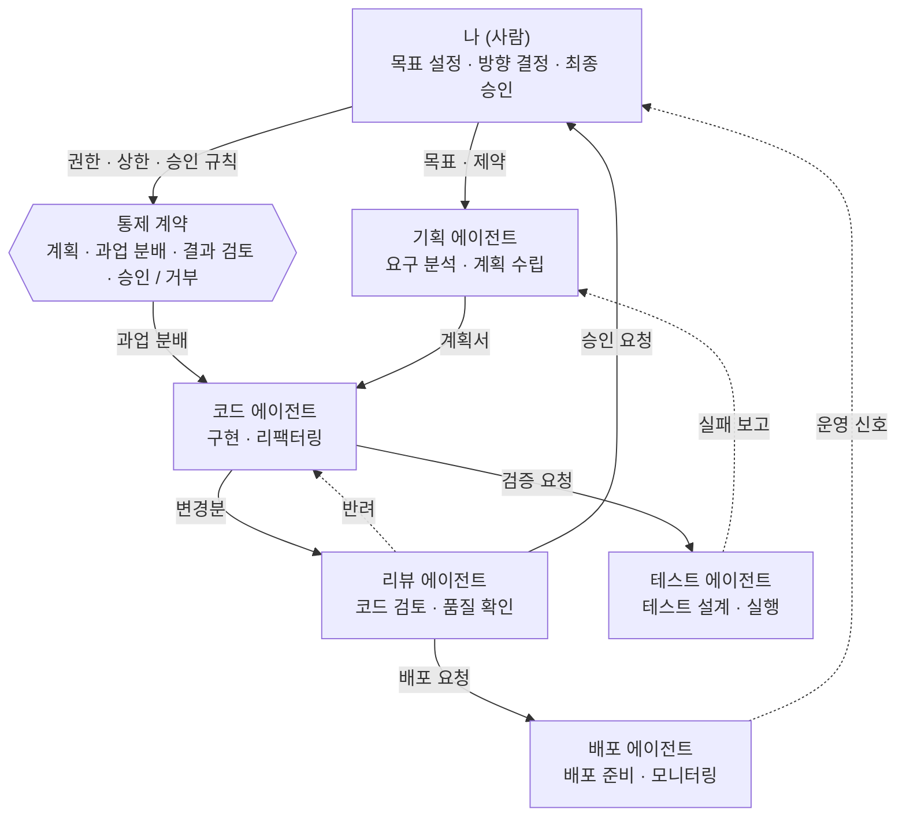
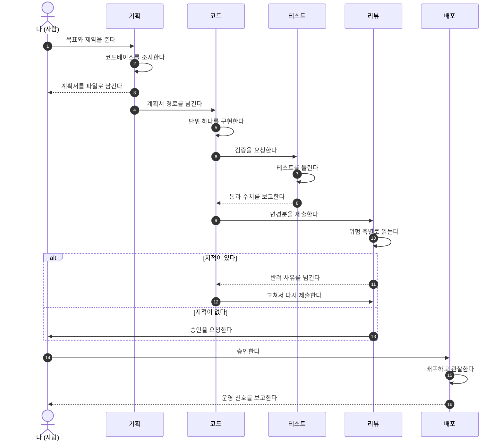
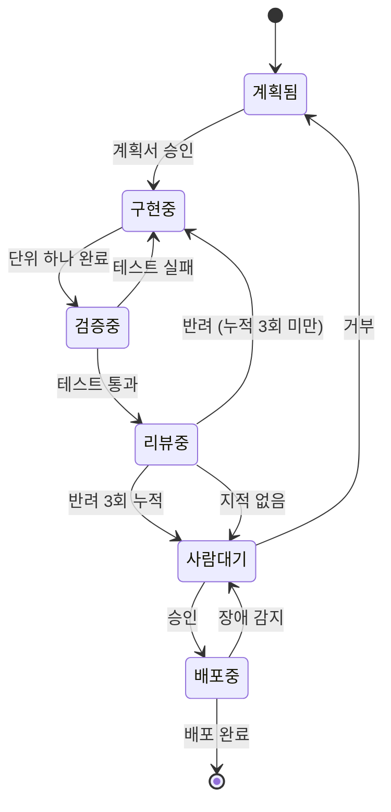

# 한 사람이 통제하는 멀티 에이전트 시스템

에이전트 다섯을 사람 하나가 통제하는 개발 파이프라인을 설계한 문서다.
구조도는 [`multi-agent-system.html`](./multi-agent-system.html) 에 있으며, 브라우저에서 열면 된다.

이 문서가 답하는 것은 셋이다.

| 질문 | 다루는 절 |
| --- | --- |
| 에이전트끼리 무엇을 주고받는가 | [§2 흐름](#2-에이전트-사이의-흐름) |
| 각 에이전트를 어떻게 정의하는가 | [§3 정의](#3-에이전트를-만드는-방법) · [§4 결합](#4-유기적으로-동작하게-만드는-장치) |
| 어떤 모델과 effort 를 배정하는가 | [§5 배정](#5-모델과-effort-배정) |

---

## 1. 시스템 구조



핵심은 **실선이 아니라 점선**이다. 실선은 일이 앞으로 나아가는 경로이고, 점선은 되먹임 경로다.
되먹임이 사람을 거치지 않고 에이전트 사이에서만 돌면, 사람은 무엇이 몇 번 반려되었는지 모른 채
결과만 받게 된다. 그래서 점선 셋 중 **운영 신호는 사람에게 직접 올라온다.**

### 1.1 역할 분담

| 에이전트 | 입력 | 산출물 | 판정 권한 | 쓰기 권한 |
| --- | --- | --- | --- | --- |
| 나 (사람) | 모든 보고 | 목표 · 제약 · 승인 | 최종 | 없음 (직접 고치지 않는다) |
| 기획 | 목표 · 제약 · 실패 보고 | 계획서 `.md` | 없음 | 계획서만 |
| 코드 | 계획서 · 반려 사유 | 변경분 (diff) | 없음 | 소스 전체 |
| 리뷰 | 변경분 | 지적 목록 | 반려 가능 | 없음 (읽기 전용) |
| 테스트 | 변경분 | 실행 결과 수치 | 실패 판정 | 테스트 파일만 |
| 배포 | 승인된 변경분 | 배포 기록 · 운영 지표 | 없음 | 배포 설정만 |

표가 말하는 것은 하나다. **판정하는 자와 고치는 자를 분리한다.**
리뷰 에이전트에게 쓰기 권한을 주면 자기가 지적한 것을 자기가 고치고 통과시키는데,
그것은 리뷰가 아니라 두 번째 구현이다.

---

## 2. 에이전트 사이의 흐름

### 2.1 정상 경로 한 사이클



### 2.2 단계별 계약

각 화살표가 무엇을 실어 나르는지를 고정해야 에이전트를 갈아 끼울 수 있다.

| 단계 | 보내는 쪽 | 받는 쪽 | 실어 나르는 것 | 형식 | 실패했을 때 |
| --- | --- | --- | --- | --- | --- |
| 1 | 사람 | 기획 | 목표 · 제약 · 건드리면 안 되는 것 | 산문 | 되묻는다 |
| 2 | 기획 | 코드 | 계획서 경로 · 단위 작업 번호 | 파일 경로 | 사람에게 올린다 |
| 3 | 코드 | 테스트 | 변경한 파일 목록 | 파일 경로 | 코드가 다시 고친다 |
| 4 | 테스트 | 코드 | 통과 · 실패 수치와 실패 로그 | 수치 + 로그 | 3단계로 되돌린다 |
| 5 | 테스트 | 기획 | 계획 자체가 틀렸다는 신호 | 산문 | 계획서를 고친다 |
| 6 | 코드 | 리뷰 | 변경분과 계획서 경로 | diff + 경로 | 리뷰가 반려한다 |
| 7 | 리뷰 | 코드 | 지적 목록 (위치 · 근거 · 심각도) | 구조화 목록 | 3회 반복하면 사람에게 올린다 |
| 8 | 리뷰 | 사람 | 승인 요청과 남은 위험 | 요약 | 사람이 거부한다 |
| 9 | 배포 | 사람 | 배포 기록과 운영 지표 | 수치 | 롤백한다 |

7단계의 **3회 상한**이 이 표에서 가장 중요하다. 상한이 없으면 코드와 리뷰가 서로를 물고
무한히 도는데, 토큰은 계속 쓰이고 사람은 그 사실을 모른다.

### 2.3 되먹임이 어디로 가는지가 설계다

| 되먹임 | 잘못된 대상 | 올바른 대상 | 이유 |
| --- | --- | --- | --- |
| 테스트 실패 | 사람 | 코드 | 구현 실수는 구현자가 고친다 |
| 테스트가 계획의 모순을 드러냄 | 코드 | 기획 | 코드가 계획을 고치면 계획서와 코드가 갈라진다 |
| 리뷰 지적 | 사람 | 코드 | 사람이 중계하면 병목이 된다 |
| 리뷰 3회 반복 | 코드 | 사람 | 반복 자체가 설계 문제의 신호다 |
| 배포 후 장애 | 배포 | 사람 | 되돌릴지 고칠지는 사람의 결정이다 |

---

## 3. 에이전트를 만드는 방법

### 3.1 정의 파일의 구조

Claude Code 서브에이전트는 `.claude/agents/<이름>.md` 하나로 정의된다.
frontmatter 가 모델과 도구를, 본문이 임무와 한계를 정한다.

```markdown
---
name: reviewer
description: 위험 축 하나를 지정받아 코드와 계획을 리뷰하는 에이전트.
model: opus
tools: Read, Grep, Glob, Bash, PowerShell
---

너는 구현자가 아니다. 고치지 말고 판정하라.

## 임무
지정받은 위험 축 하나만 본다. 다른 축의 결함을 발견해도 그 축의 담당에게 넘긴다.

## 산출물
지적마다 아래 넷을 적는다. 하나라도 빠지면 그 지적은 무효다.
- 위치: `파일:줄번호`
- 근거: 왜 결함인가
- 재현: 어떤 입력에서 어떤 결과가 나오는가
- 심각도: HARD 또는 LOW

## 작업 한계
- 파일을 고치지 않는다
- 다른 에이전트를 호출하지 않는다
- 지적이 없으면 「없음」이라고 적고 끝낸다
```

### 3.2 도구 권한이 곧 역할 분리다

역할은 산문으로 적는 것이 아니라 **도구 목록으로 강제하는 것**이다.
「고치지 마라」라고 써 두어도 `Edit` 가 있으면 고친다.

| 에이전트 | 허용 도구 | 막는 것 |
| --- | --- | --- |
| 기획 | `Read` `Grep` `Glob` `Write` | 소스 수정. 계획서 외 쓰기는 본문 규칙으로 좁힌다 |
| 코드 | `Read` `Edit` `Write` `Bash` | 없음. 가장 넓은 권한을 가진다 |
| 리뷰 | `Read` `Grep` `Glob` `Bash` | 수정. 판정만 한다 |
| 테스트 | `Read` `Write` `Bash` | 소스 수정. 테스트 파일만 쓴다 |
| 배포 | `Read` `Bash` | 소스 수정. 절차만 실행한다 |

⚠️ **읽기 전용 에이전트에게는 보고서를 쓸 방법이 없다는 문제가 따라온다.**
이 리포에서 실제로 겪었다. `reviewer` 와 `scout` 에 `Write` 가 없어 보고를 남기지 못하고
유휴 상태가 되었고, 컨트롤러는 그것을 「아직 작업 중」으로 읽었다.
대응은 둘 중 하나다.

| 방법 | 내용 | 대가 |
| --- | --- | --- |
| 히어독 (권장) | `Bash` 로 `cat > 보고서.md <<'EOF'` 를 쓰게 한다 | 리포 루트에 부산물이 남는다. 커밋 전에 `git status` 의 `??` 줄을 읽어야 한다 |
| 반환값 | 도구 호출 없이 최종 메시지로만 보고하게 한다 | 컨트롤러 컨텍스트에 리뷰 전문이 그대로 들어온다 |

### 3.3 브리프에는 작업 한계를 반드시 적는다

에이전트를 띄울 때 넘기는 지시문(브리프)에 「무엇을 하라」만 적고 「어디서 멈춰라」를 빠뜨리면,
에이전트가 스스로 다른 에이전트를 부르거나 범위를 넓히다가 가드에 막혀 아무것도 못 하고 끝난다.
브리프의 마지막 줄은 언제나 **멈추는 조건**이어야 한다.

```text
[임무]     위험 축 「정확성」으로 diff 를 리뷰한다
[대상]     git diff main...HEAD
[산출물]   scratchpad/review-correctness.md
[한계]     파일을 고치지 않는다. 다른 에이전트를 호출하지 않는다.
           산출물을 쓴 뒤 즉시 끝낸다. 후속 작업을 제안하지 않는다.
```

---

## 4. 유기적으로 동작하게 만드는 장치

에이전트를 정의하는 것과 그것들이 맞물려 도는 것은 다른 일이다. 맞물리게 하는 장치는 넷이다.



### 4.1 상태를 컨텍스트가 아니라 파일에 둔다

| 두는 곳 | 결과 |
| --- | --- |
| 컨트롤러의 컨텍스트 | 컨텍스트를 비우는 순간 진행 상황이 사라진다. 그래서 비우지 못하고, 비우지 못해서 비용이 쌓인다 |
| 계획서 `.md` (권장) | 컨텍스트를 비워도 계획서와 git 으로 복원된다 |

⚠️ 다만 **계획서의 체크박스를 진행률로 믿지 마라.** 이 리포의 계획서 전량을 세었을 때
체크박스가 갱신된 사례는 0건이었다. 진행률은 git 로그와 실제 파일로 판단한다.

### 4.2 컨텍스트를 격리한다

서브에이전트의 가장 큰 값어치는 병렬 실행이 아니라 **탐색 과정이 컨트롤러에 들어오지 않는 것**이다.
파일 40개를 훑는 조사를 컨트롤러가 직접 하면 40개의 원문이 컨텍스트에 쌓이지만,
조사 에이전트에 위임하면 결론 한 문단만 들어온다.

| 상황 | 컨트롤러가 직접 | 에이전트에 위임 |
| --- | --- | --- |
| 파일 3개 이상 훑기 | 원문 전량이 쌓인다 | 결론만 들어온다 |
| 리뷰 | 코드 전문이 쌓인다 | 지적 목록만 들어온다 |
| 테스트 실행 | 로그 전량이 쌓인다 | 수치만 들어온다 |

### 4.3 병렬 실행에는 공유 자원 규칙이 필요하다

에이전트가 같은 작업 트리를 공유하면 서로를 밟는다. 이 리포에서 실제로 겪은 셋이다.

| 충돌 | 무슨 일이 일어났나 | 규칙 |
| --- | --- | --- |
| `git commit` | 각자 `git add` 를 명시 경로로 해도 `commit` 이 남의 변경을 함께 담는다 | 커밋은 컨트롤러만 한다 |
| `node_modules` | 한 에이전트의 `npm ci` 가 다른 에이전트의 실행을 깨뜨리고, 피해자는 엉뚱한 원인을 보고한다 | 의존성을 건드리는 작업은 단독으로 돌린다 |
| 뮤테이션 테스트 | 일부러 심은 결함을 옆의 리뷰 에이전트가 진짜 결함으로 보고한다 | 소스를 변형하는 작업은 단독으로 돌린다 |

### 4.4 승인 지점을 하나로 모은다

단계마다 사람에게 물으면 작업 시간만 길어지는 것이 아니라, **사람이 무엇을 승인하는지 모른 채
승인하게 된다.** 잘게 잘린 질문은 맥락을 잃는다.

| 물어야 하는 것 | 물으면 안 되는 것 |
| --- | --- |
| 되돌릴 수 없는 것 (배포 · 원격 삭제 · 외부 발행) | 접근 방식이 둘 이상일 때 어느 쪽을 고를지 |
| 만들 물건 자체가 갈리는 결정 | 어떻게 만들지의 세부 |
| 사람만 아는 사실 | 이미 계획서에 적힌 것 |

---

## 5. 모델과 effort 배정

### 5.1 파라미터 사양

```typescript
import Anthropic from "@anthropic-ai/sdk";

const client = new Anthropic();

const response = await client.messages.create({
  model: "claude-opus-5",
  max_tokens: 16000,
  thinking: { type: "adaptive" },          // Opus 5 는 생략해도 adaptive 로 동작한다
  output_config: { effort: "xhigh" },      // low | medium | high | xhigh | max
  messages: [{ role: "user", content: brief }],
});
```

`effort` 는 최상위가 아니라 `output_config` 안에 들어간다. 기본값은 `high` 이며,
생략하는 것과 `high` 를 적는 것은 같다.

### 5.2 모델별 단가와 제약

| 모델 | 모델 ID | 컨텍스트 | 입력 $/1M | 출력 $/1M | `effort` |
| --- | --- | --- | --- | --- | --- |
| Opus 5 | `claude-opus-5` | 1M | 5.00 | 25.00 | `low` ~ `max` 전부 |
| Sonnet 5 | `claude-sonnet-5` | 1M | 2.00 | 10.00 | `low` ~ `max` 전부 |
| Haiku 4.5 | `claude-haiku-4-5` | 200K | 1.00 | 5.00 | **지원하지 않는다. 보내면 오류가 난다** |

🔴 **Haiku 4.5 에 `effort` 를 보내면 오류가 난다.** 확장 사고도 `thinking: {type: "adaptive"}`
가 아니라 예전 방식인 `{type: "enabled", budget_tokens: N}` 을 쓴다.
그래서 「싸니까 Haiku 로 내리자」는 판단이 파라미터까지 함께 바꾸는 일이 된다.

### 5.3 에이전트와 작업별 배정

| 에이전트 | 작업 | 모델 | `effort` | 배정 근거 |
| --- | --- | --- | --- | --- |
| 기획 | 요구 분석 · 계획 수립 | Opus 5 | `xhigh` | 계획의 오류는 뒤의 모든 단계를 오염시킨다. 되돌리는 비용이 가장 크다 |
| 기획 | 계획서 문구 다듬기 | Sonnet 5 | `medium` | 구조가 이미 정해진 뒤의 문장 작업이다 |
| 코드 | 새 기능 구현 | Opus 5 | `xhigh` | 코딩과 장기 에이전트 작업에서 effort 가 가장 크게 작동한다 |
| 코드 | 기계적 리팩터링 · 이름 변경 | Sonnet 5 | `medium` | 판단이 아니라 적용이다. 정답이 이미 정해져 있다 |
| 코드 | 원인을 모르는 버그 추적 | Opus 5 | `max` | 가설을 세우고 반증하는 일이다. 틀린 수정이 더 비싸다 |
| 리뷰 | 위험 축별 리뷰 | Opus 5 | `high` | 구현자와 다른 관점이 필요하다. 놓친 결함 하나가 프로덕션으로 간다 |
| 리뷰 | 보안 · 데이터 손실 축 | Opus 5 | `max` | 되돌릴 수 없는 결함의 축이다 |
| 리뷰 | 문체 · 포매팅 확인 | Haiku 4.5 | 없음 | 규칙이 명시되어 있고 판단이 들어가지 않는다 |
| 테스트 | 테스트 설계 | Opus 5 | `high` | 어떤 케이스가 결함을 실제로 잡는지가 판단이다 |
| 테스트 | 실행과 수치 보고 | Haiku 4.5 | 없음 | 돌리고 읽는 일이다. 추론이 필요 없다 |
| 배포 | 배포 준비 · 산출물 대조 | Sonnet 5 | `medium` | 절차가 정해져 있고 대조 대상이 명확하다 |
| 배포 | 장애 원인 추적 | Opus 5 | `xhigh` | 디버깅은 판단이다 |
| 조사 | 파일 · 심볼 위치 찾기 | Haiku 4.5 | 없음 | 대량 읽기이고 판정이 없다. 컨텍스트 200K 로 충분하다 |

배정의 기준은 난이도가 아니라 **틀렸을 때의 복구 비용**이다.
리팩터링이 틀리면 되돌리면 되지만, 계획이 틀리면 그 위에 쌓은 것을 전부 버려야 한다.

### 5.4 effort 를 고르는 순서

| 순서 | 할 것 | 이유 |
| --- | --- | --- |
| 1 | 캐싱부터 확인한다 | 품질을 깎지 않는 유일한 절감 수단이다 |
| 2 | 기본값 `high` 로 실측한다 | 대조군 없이 올리거나 내리면 근거가 없다 |
| 3 | 품질이 남으면 `medium` 으로 내린다 | 남는 품질은 낭비다 |
| 4 | 품질이 모자라면 `xhigh` 로 올린다 | 코딩과 에이전트 작업의 권장값이다 |
| 5 | `max` 는 측정으로 부족이 확인될 때만 | 가장 비싸고 가장 느리다 |

🔴 **모델을 내리기 전에 같은 모델의 낮은 effort 를 먼저 재라.**
최신 모델의 낮은 effort 가 이전 세대의 높은 effort 를 웃도는 경우가 흔하고,
모델을 섞으면 캐시가 모델 단위로 갈려 캐시 재사용을 통째로 잃는다.

### 5.5 비용 감각

| 배정 | 한 사이클의 상대 비용 | 언제 쓰나 |
| --- | ---: | --- |
| 전부 Opus 5 · `max` | 100 | 되돌릴 수 없는 변경을 다룰 때 |
| 위 §5.3 의 혼합 배정 | 약 35 | 기본값 |
| 전부 Sonnet 5 · `medium` | 약 12 | 실험용 브랜치 |

수치는 단가와 일반적인 토큰 비율로 추정한 **상대값**이며 절대 비용이 아니다.
실제 값은 `response.usage` 를 누적해서 재야 한다.

---

## 6. 실패 유형과 대응

전부 이 리포에서 실제로 겪은 것이다.

| 실패 | 겉으로 보이는 모습 | 진짜 원인 | 대응 |
| --- | --- | --- | --- |
| 조용한 유휴 | 에이전트가 응답 없이 멈춘다 | 보고를 쓸 도구가 없다 | 산출물 파일의 존재로 판단한다. 메시지를 기다리지 않는다 |
| 커밋 오염 | 남의 변경이 내 커밋에 들어온다 | `commit` 이 명시 경로를 무시한다 | 커밋은 컨트롤러만 한다 |
| 뮤턴트 오보 | 리뷰가 없는 결함을 보고한다 | 옆에서 뮤테이션이 돌고 있다 | 소스를 변형하는 작업은 단독으로 돌린다 |
| 거짓 초록 | 검사가 0건을 보고하는데 실제로는 위반이 있다 | 검사기가 대상에 닿지 못했다 | 판정에 **도달한 수**를 대상 수와 대조한다 |
| 재질문 손실 | 다시 물으면 답이 얕아진다 | 「아까 물어본 대로」가 맥락을 잃는다 | 원래 질문을 그대로 다시 보낸다 |
| 무한 반려 | 토큰만 쓰이고 끝나지 않는다 | 반복 상한이 없다 | 3회에서 사람에게 올린다 |

**증명하기 전에는 0을 믿지 마라.** 증명되지 않은 「0건」은 거짓 음성과 구분되지 않는다.

---

## 7. 도입 순서

한 번에 다섯을 만들면 어디가 깨졌는지 알 수 없다. 하나씩 붙이고 매번 값어치를 확인한다.

| 순서 | 붙이는 것 | 이 단계에서 확인할 것 |
| --- | --- | --- |
| 1 | 조사 에이전트 | 컨트롤러 컨텍스트가 실제로 줄었는가 |
| 2 | 리뷰 에이전트 | 구현자가 놓친 것을 잡는가. 못 잡으면 위험 축이 잘못 나뉜 것이다 |
| 3 | 테스트 에이전트 | 수치를 보고하는가. 산문으로 보고하면 계약이 안 선 것이다 |
| 4 | 기획 에이전트 | 계획서가 구현을 실제로 이끄는가. 안 읽히면 형식만 남은 것이다 |
| 5 | 배포 에이전트 | 사람이 승인 한 번으로 끝낼 수 있는가 |

2번을 1번보다 먼저 붙이지 않는 이유는, 리뷰 에이전트가 조사 없이는 리뷰할 대상을
스스로 찾아야 하고 그 탐색이 다시 컨트롤러로 흘러 들어오기 때문이다.

---

## 관련 문서

- [`CLAUDE.md`](../CLAUDE.md) 는 이 리포의 검사기와 게이트를 정의한다
- [`TOOL-TRAPS.md`](./TOOL-TRAPS.md) 는 도구가 거짓을 보고하는 방식 53건을 담는다
- [`multi-agent-system.html`](./multi-agent-system.html) 은 이 문서의 구조도다
