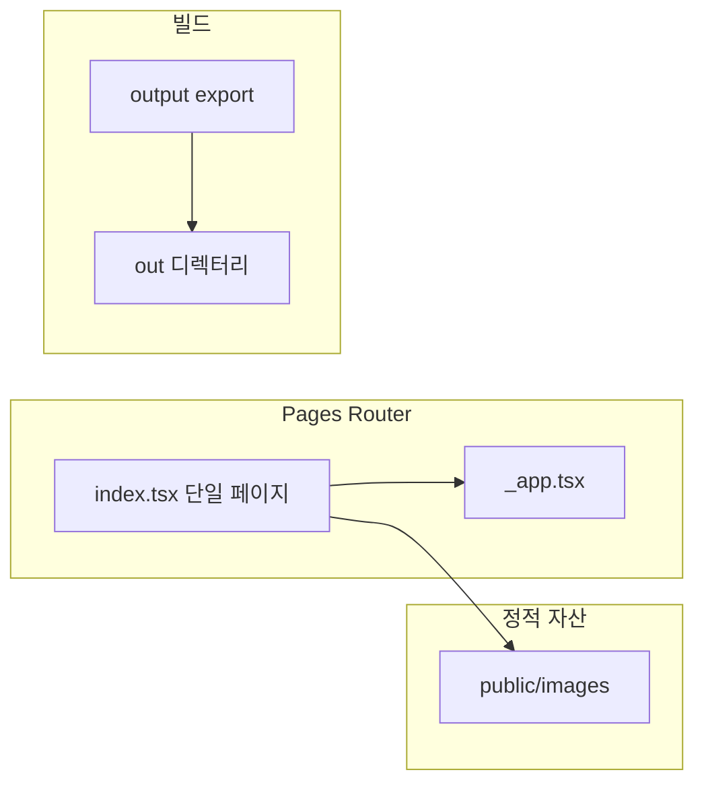

# 포트폴리오 사이트 심층 분석 및 리뉴얼·고도화 로드맵

본 문서는 저장소 [withwooyong.github.io](https://github.com/withwooyong/withwooyong.github.io) 기준 코드·설정을 검토한 결과이며, 라이브 Lighthouse 점수 등은 별도 브라우저에서 측정해야 한다. 코드에서 **추정 가능한 이슈**와 **개선 방향**을 구분해 서술한다.

---

## 1. Executive summary

**현 상태 한 줄 진단**: 한국어 중심의 단일 롱페이지 포트폴리오로 정보 밀도와 비주얼 일관성은 양호하나, **페이지 단일 파일(`pages/index.tsx`, 약 764줄)** 에 UI·콘텐츠가 집중되어 유지보수·SEO·접근성 확장에 비용이 크다.

**리뉴얼 목표 옵션**(우선순위는 본인 목적에 맞게 선택):

| 목적 | 방향성 요약 |
|------|----------------|
| 채용·네트워킹 강화 | 상단에 한 줄 가치 제안(역할·도메인·연락 CTA), 이력서 PDF·LinkedIn 링크, OG 미리보기 |
| 기술 브랜딩 | 짧은 케이스 스터디 글·블로그 링크 섹션, 오픈소스·글 목록 |
| 운영 최소화 | 콘텐츠만 YAML/MD로 분리해 수정 부담 감소, 디자인 시스템 단순 유지 |

---

## 2. 정보 구조(IA) 및 콘텐츠

### 2.1 현재 섹션 맵

상단 고정 네비 앵커(`href="#about"` 등)와 대응되는 구조는 다음과 같다. 출처: [`pages/index.tsx`](pages/index.tsx).

| 앵커 ID | 섹션 제목(화면) | 비고 |
|---------|-----------------|------|
| (히어로) | 이름·소개 문구 | Notion 경력기술서 링크 |
| `about` | 소개 | 철학·카드 3개 |
| `experience` | 경력 | 타임라인형 카드 다수 |
| `projects` | 주요 프로젝트 | 카드 + 외부 링크 |
| `systems` | 시스템 구성도 | 이미지 + Dialog 확대 패턴 반복 |
| `skills` | 기술 스택 | 4분류 카드 |
| (앵커 없음) | 학력 | 섹션에 `id` 없음 → 네비에서 바로 이동 불가 |
| `contact` | 연락하기 | 이메일·전화·GitHub |

**개선 포인트**

- **학력 섹션**: `id="education"` 등을 부여하면 IA 일관성과 스크롤 스파이 확장에 유리하다.
- **영문 페이지**: 해외 채용 대비 시 `/en` 정적 페이지 또는 동일 페이지 내 언어 토글(정적 export에서는 빌드 타임 분기 또는 별도 HTML이 현실적).
- **다운로드 이력서**: PDF 링크를 히어로 또는 연락 근처에 두면 전환율이 올라간다.
- **중복**: 경력 타임라인 이미지 카드(`systems`)와 텍스트 경력(`experience`)이 역할이 겹친다. 하나는 “요약”, 하나는 “상세 스토리”로 역할을 명시하면 읽기 부담이 줄어든다.

---

## 3. 기술 부채 및 아키텍처

### 3.1 현재 구조

- [`next.config.js`](next.config.js): `output: "export"`, `trailingSlash: true`, `images.unoptimized: true` → **서버 런타임 없음**, GitHub Pages 정적 호스팅에 적합.
- 제약: **API Routes, ISR, 서버 컴포넌트 전용 기능**은 사용 불가. 폼·조회수 등은 외부 서비스(Formspree, Beehiiv 등) 또는 클라이언트 전용으로 설계해야 한다.

### 3.2 단일 파일 집중의 한계

- 문구·링크·배지 수정 시 **동일 파일 대량 diff** → 리뷰·머지 충돌 비용 증가.
- 섹션별 테스트·스토리 분리 어려움.

### 3.3 단계적 분해 전략(권장 순서)

1. **데이터 분리**: `content/portfolio.ts` 또는 `data/*.json`에 경력·프로젝트·스킬 배열만 두고 `index.tsx`는 `map`으로 렌더.
2. **섹션 컴포넌트화**: `components/sections/Hero.tsx`, `Experience.tsx` 등으로 분리. Props는 직렬화 가능한 데이터만.
3. **선택**: MDX 또는 Markdown + gray-matter로 긴 문단만 외부화(빌드 시 import). 정적 export와 호환되도록 빌드 타임 처리 유지.

---

## 4. UX·비주얼 리뉴얼

### 4.1 디자인 토큰

[`tailwind.config.js`](tailwind.config.js)에 `primary` 스케일이 정의되어 있으나, 본문은 `blue-600`, `green-600`, `purple-*` 등 **세그먼트별 임의 색**이 많다. 리뉴얼 시:

- **시맨틱 역할**: `primary`(브랜드), `muted`, `accent` 정도로 축소하고 섹션 배경은 `primary/5` 류로 통일 검토.
- **히어로**: 한 단락 브레이크(` `) 의존을 줄이고 반응형 줄바꿈(`max-w-prose`, 문장 분리)으로 가독성 개선.

### 4.2 시스템 구성 카드 그리드

`systems` 구역은 카드·Dialog 패턴이 반복된다. 컴포넌트화 시:

- `ArchitectureCard.tsx`에 `title`, `description`, `thumbSrc`, `fullSrc`, `alt`만 넘기면 중복 제거 및 접근성 속성 일괄 관리 가능.

### 4.3 다크 모드

현재 라이트 전용. 도입 시:

- `prefers-color-scheme` 또는 토글 + `class` on `html`.
- shadcn/CSS 변수 확장 시 전역 대비 재검증 필요(수동).

---

## 5. 접근성(WCAG 관점 체크리스트)

코드 검토 기준 제안 항목이다. 실제 준수 여부는 axe DevTools 등으로 검증한다.

| 항목 | 현재 관찰 | 개선 제안 |
|------|-----------|-----------|
| 스킵 네비게이션 | 없음 | 본문 `#main` 또는 첫 섹션으로 이동하는 “본문 바로가기” 링크 |
| 모바일 내비 | `hidden md:flex`만 존재 | 햄버거 + Sheet/Drawer로 동일 앵커 제공 |
| 포커스 | 버튼·링크 혼재 | 트리거가 `div`인 경우 `button` 또는 `role="button"` + 키보드 처리 |
| 다이얼로그 | `DialogClose asChild`로 이미지 영역 전체 클릭으로 닫기 | 명시적 닫기 버튼(이미 shadcn Content에 있음)을 주 패턴으로, 트리거는 확대만 담당 |
| 제목 계층 | `h1` 히어로, `h2` 섹션 | 카드 내부 `CardTitle` 시맨틱 확인(기본 `div`일 수 있음 → 필요 시 `asChild`로 `h3`) |
| 이미지 | `next/image` + `alt` 존재 | 구성도는 긴 `alt` 또는 별도 요약 텍스트 고려 |
| 색 대비 | 파스텔 배경 + slate 텍스트 | 주요 본문 대비비율 샘플링 |

---

## 6. 성능(Core Web Vitals 관련)

### 6.1 코드에서 확인되는 이슈

- [`styles/globals.css`](styles/globals.css): `* { transition: all 0.2s ease-in-out; }` → **모든 속성 전환**은 저사양 기기·대량 DOM에서 비용이 커질 수 있다. 필요한 클래스에만 `transition` 적용 권장.
- 동일 파일: Google Fonts `@import` → **렌더 차단** 가능. `next/font`(Pages Router에서도 사용 가능) 또는 `<link rel="preconnect">` + `display=swap` 정리 검토.
- [`next.config.js`](next.config.js): `images.unoptimized: true`는 정적 배포 시 흔한 선택이나, **원본 PNG 크기**가 크면 LCP에 불리하다. 적정 해상도·WebP/AVIF 병행·중요 이미지 우선순위 등을 검토한다.

### 6.2 측정 방법(수동)

1. Chrome DevTools → Lighthouse(모바일 프리셋).
2. Network throttling으로 3G 등 재현.
3. “성능” 외 **접근성·SEO** 탭도 동일 세션에서 확인.

---

## 7. SEO·소셜 공유

### 7.1 현재

[`pages/index.tsx`](pages/index.tsx)의 `Head`:

- `title`, `description`, `viewport`, 파비콘.

### 7.2 권장 추가(정적 메타)

- `og:title`, `og:description`, `og:image`(절대 URL), `og:url`, `og:type`.
- `twitter:card`, `twitter:title`, `twitter:description`, `twitter:image`.
- `link rel="canonical"` → GitHub Pages 최종 도메인 기준 절대 URL.
- **JSON-LD** `Person` 스키마: 이름, `sameAs`(GitHub 등), `jobTitle`, `url`.

GitHub Pages 배포 URL이 고정이면 빌드 타임 환경변수나 상수로 `SITE_URL`을 두고 메타에 주입하는 패턴이 안전하다.

### 7.3 sitemap·robots

정적 사이트도 `public/sitemap.xml`, `public/robots.txt`를 커밋하면 된다. 페이지 수가 적어 수동 유지도 가능하다.

### 7.4 언어·타이틀

`title`은 영문 부제(`Agile Developer & Tech Lead`), 본문은 한국어 혼합 → 검색 스니펫 일관성을 위해 **한 줄 설명을 한국어 우선**으로 맞추거나 `lang="ko"`와 메타 `description` 정렬을 권장한다.

---

## 8. 운영·품질

| 항목 | 현재 | 제안 |
|------|------|------|
| ESLint | `next build` 시 내장 실행 | `package.json`에 `"lint": "next lint"` 추가 후 CI에서 `npm run lint` |
| 타입 검사 | 빌드에 포함 | `"typecheck": "tsc --noEmit"` 선택 |
| Node 버전 | [`.github/workflows/deploy.yml`](.github/workflows/deploy.yml)에서 `18` | LTS 정책에 맞춰 20/22 검토, 로컬와 통일 |
| README | [`README.md`](../README.md)에 `npm run export` 안내 | Next 14 정적 export는 `next build`만으로 `out/` 생성. 문서 정정 |
| 의존성 | `next@14.0.0` 고정 | 보안 패치를 위해 마이너 업데이트 주기 점검, 변경 시 `output: export` 회귀 테스트 |

---

## 9. 보안·프라이버시(선택 사항)

- 연락 섹션에 **이메일·전화번호 평문 노출**([`pages/index.tsx`](pages/index.tsx) 연락 카드). 스크래핑·스팸 리스크가 있다.
- 대안: `mailto:`만 노출, 이미지로 전화 표시(접근성 저하), Form 서비스로 우회, 또는 LinkedIn 우선 CTA .

본 문서는 법적 권고가 아니라 **트레이드오프 안내**이다.

---

## 10. 우선순위 로드맵

### P0 — 저비용·효과 큼

- README 빌드 설명 수정(`export` 제거, `out/` 설명).
- `Head`에 OG/Twitter/canonical + 절대 URL 기준 정리.
- 모바일 네비(햄버거) 또는 최소 상단에 주요 앵커 링크 노출.
- `*` 전역 `transition` 완화.
- 푸터 연도 자동화 또는 현재 연도 반영(현재 `"© 2025"` 하드코딩 — 연도 갱신 누락 방지).

### P1 — 구조·유지보수

- `systems` 다이얼로그를 데이터 배열 + 소형 컴포넌트로 통합.
- 경력·프로젝트·스킬 데이터 외부 모듈 분리.
- 학력 섹션 `id` 부여, 필요 시 네비 항목 추가.
- `next/font` 또는 폰트 로딩 최적화.

### P2 — 확장

- MDX/블로그 또는 외부 블로그 링크 섹션.
- 영문 페이지 또는 요약 버전.
- 다크 모드.
- 이미지 포맷·크기 최적화 파이프라인(빌드 스크립트 또는 수동 최적화 자산).

---

## 참고 파일 목록

| 파일 | 역할 |
|------|------|
| [`pages/index.tsx`](../pages/index.tsx) | 단일 페이지 전체 UI·콘텐츠 |
| [`pages/_app.tsx`](../pages/_app.tsx) | 글로벌 CSS 주입 |
| [`styles/globals.css`](../styles/globals.css) | 폰트·스크롤바·전역 transition |
| [`next.config.js`](../next.config.js) | 정적 export·이미지 설정 |
| [`tailwind.config.js`](../tailwind.config.js) | 테마·primary 팔레트 |
| [`.github/workflows/deploy.yml`](../.github/workflows/deploy.yml) | CI 빌드·Pages 배포 |
| [`README.md`](../README.md) | 로컬/배포 안내(일부 구식 명령 가능) |

---

*문서 버전: 저장소 분석 기준 초안. 실제 적용 시 디자인 방향과 채용 목표에 맞게 P0~P2 범위를 조정하면 된다.*
