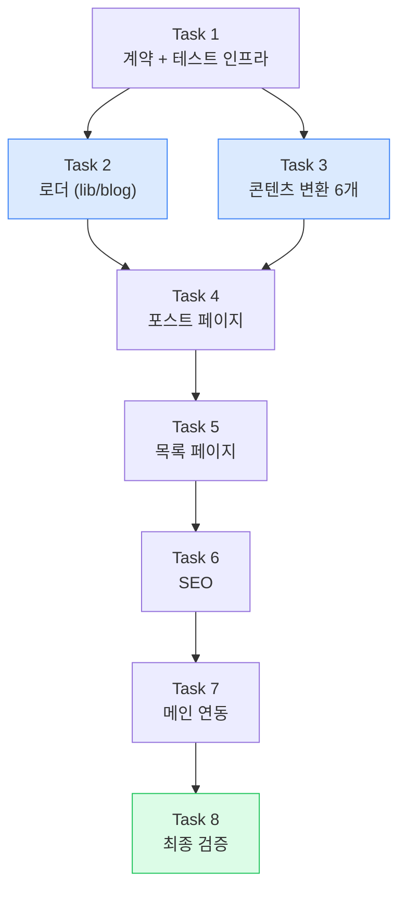

# 기술블로그 1차 구축 실행계획 (search 카테고리 수직 슬라이스)

> **For agentic workers:** REQUIRED SUB-SKILL: Use superpowers:subagent-driven-development (recommended) or superpowers:executing-plans to implement this plan task-by-task. Steps use checkbox (`- [ ]`) syntax for tracking.

**Goal:** `search` 카테고리 원본 6개를 발행 가능한 블로그 포스트로 변환하고, `withwooyong.github.io/blog/`에서 정적 export로 서비스되는 최소 완결 블로그를 구축한다.

**Architecture:** 원본 md(`yanadoo-exit`)는 읽기 전용 소스이고, 변환·검수를 거친 발행본만 `content/blog/`에 들어온다. 빌드는 `content/blog/`만 스캔하므로 민감정보 필터가 런타임에 존재하지 않는다. 렌더링은 기존 `components/markdown.tsx`·`mermaid.tsx`를 그대로 재사용하고, 문서 목록만 하드코딩 배열에서 파일시스템 스캔으로 일반화한다.

**Tech Stack:** Next.js 14 Pages Router · TypeScript · Tailwind · react-markdown(+remark-gfm, rehype-slug) · mermaid · gray-matter(신규) · Vitest(신규, devDependency)

## Global Constraints

이 절의 제약은 **모든 태스크의 요구사항에 암묵적으로 포함**된다.

| # | 제약 | 정확한 값 |
| --- | --- | --- |
| GC-1 | 정적 export만으로 동작 | `next.config.js`의 `output: "export"`를 변경하지 않는다. API 라우트·ISR·서버 액션·`next/image` 로더 금지 |
| GC-2 | 모든 경로는 슬래시로 끝난다 | `trailingSlash: true`. 내부 링크는 `/blog/search-engineering/es-architecture/` 형태 |
| GC-3 | App Router 금지 | `app/` 디렉터리 컨벤션을 도입하지 않는다. Pages Router 유지 |
| GC-4 | 경로 별칭 | `@/*` → 저장소 루트. 상대경로 대신 `@/lib/...`, `@/components/...` |
| GC-5 | `fs` 사용 위치 | `getStaticProps`/`getStaticPaths`에서 호출되는 모듈에서만. 클라이언트 번들에 `fs`가 들어가면 빌드가 깨진다 |
| GC-6 | 기존 페이지 무영향 | `pages/index.tsx`, `pages/en/`, `pages/product-lead*` 의 빌드 산출물이 변경되면 안 된다 |
| GC-7 | 한글 줄바꿈 | 본문 텍스트 요소에 `break-keep` 적용 |
| GC-8 | 다크모드 | `<html class="dark">` 토글 방식. 모든 신규 컴포넌트에 `dark:` 변형 제공 |
| GC-9 | 커밋 메시지 | 한글로 작성 |
| GC-10 | 푸시 금지 | 사용자가 명시적으로 요청하기 전까지 `git push`를 실행하지 않는다 |
| GC-11 | 발행 산출물 금칙어 | `면접`, `커닝페이퍼`, `암기용`, `화이트보드`, `이력서` 가 `content/blog/` 및 `out/blog/` 에 존재하면 안 된다 |
| GC-12 | **타입 검사는 별도 검증이다** | 코드를 만지는 모든 태스크는 `npx tsc --noEmit`을 실행하고 종료 코드를 보고한다. **Vitest는 esbuild로 타입을 지울 뿐 검사하지 않는다** — 테스트 전원 통과 상태에서 `tsc`가 오류를 잡는 일이 실제로 발생했다 |
| GC-13 | `tsconfig.json` 수정 금지 | `target: "es5"` 등을 바꾸면 전 프로젝트 컴파일 산출물이 달라져 GC-6에 저촉된다. 타입 오류는 호출부를 고쳐 해결한다 |

---

## §A. 범위

### A-1. 1차에 만드는 것

| 구분 | 내용 |
| --- | --- |
| 콘텐츠 | `search` 원본 6개 → 발행본 6개 (분할 없음, 전부 40KB 미만) |
| 카테고리 | `search-engineering` 1개만 정의. 나머지 11개는 2차 |
| 라우트 | `/blog/`, `/blog/[category]/`, `/blog/[category]/[slug]/`, `/blog/tags/`, `/blog/tags/[tag]/` |
| SEO | title·description·canonical·JSON-LD·sitemap 자동 생성 |
| 메인 연동 | 네비게이션 링크 + 대표글 노출 |

### A-2. 1차에 만들지 않는 것

| 제외 | 사유 |
| --- | --- |
| 시리즈 분할 로직 | search 6개가 전부 40KB 미만이라 분할 대상이 없다. 타입에 `series` 필드만 두고 UI는 2차 |
| 전문 검색 | 요구사항 FR-2.6에서 1차 제외 확정 |
| RSS | 요구사항 FR-5.5 선택 |
| 코드 문법 강조 | 요구사항 미결(Q6). 기존 `markdown.tsx`의 단색 `pre` 유지 |
| 나머지 11개 카테고리 | 1차 결과를 보고 규칙을 조정한 뒤 배치 변환 |

### A-3. 원본 6개의 처리 방침

| 원본 | KB | 발행 slug | 처리 |
| --- | ---: | --- | --- |
| `00-검색시스템-개요.md` | 8 | `search-system-overview` | §7 "이 문서 세트 안내"는 시리즈 네비로 대체 → 제거 |
| `01-나의-검색-경험.md` | 9 | `search-engineering-in-practice` | **경험 기반 기술 회고로 유지.** §5 "이력서·면접용 압축" 제거. 회사명(TVING·SKB)은 메인 포트폴리오에 이미 공개되어 있으므로 유지 |
| `02-ES-아키텍처.md` | 10 | `elasticsearch-architecture` | 순수 기술. §11 "이어지는 문서" 제거 |
| `03-핵심기능-한글처리.md` | 22 | `korean-text-search` | §11 "예상 꼬리질문(면접 대비)" **→ Q&A 포스트로 이관**, §12 제거 |
| `04-운영과-트러블슈팅.md` | 21 | `elasticsearch-operations` | §11 "예상 꼬리질문(면접 대비)" **→ Q&A 포스트로 이관**, §12 제거 |
| `05-면접-커닝페이퍼.md` | 5 | `search-engineering-qna` | **Q&A 포스트로 전환.** §A 개인 서사 제거, §B 수치는 확장, 03·04의 §11을 흡수 |

**핵심**: `03`·`04`의 면접 섹션은 삭제가 아니라 `05`로 **이관**한다. 좋은 기술 내용을 버리지 않으면서 본문에서 면접 맥락을 제거하는 방법이다.

---

## §B. 파일 구조

### B-1. 신규 생성

```
content/
  blog/
    categories.ts                                    # 카테고리 정의 (단일 소스)
    search-engineering/
      search-system-overview.md
      search-engineering-in-practice.md
      elasticsearch-architecture.md
      korean-text-search.md
      elasticsearch-operations.md
      search-engineering-qna.md

lib/
  toc.ts                                             # wiki.ts에서 추출한 공용 TOC 생성
  blog/
    types.ts                                         # Post·PostFrontmatter 타입
    frontmatter.ts                                   # frontmatter 검증 (순수 함수, 테스트 대상)
    loader.ts                                        # fs 스캔 (빌드 타임 전용)
    index.ts                                         # 재수출

components/
  blog/
    blog-shell.tsx                                   # 헤더 + 레이아웃
    post-card.tsx                                    # 목록 아이템
    post-meta.tsx                                    # 날짜·태그·카테고리 배지
    tag-list.tsx                                     # 태그 칩 목록
    series-nav.tsx                                   # 이전/다음 글

pages/
  blog/
    index.tsx                                        # 블로그 홈
    tags/
      index.tsx                                      # 태그 인덱스
      [tag].tsx                                      # 태그별 목록
    [category]/
      index.tsx                                      # 카테고리별 목록
      [slug].tsx                                     # 포스트 본문

scripts/
  generate-sitemap.mjs                               # 빌드 후 sitemap.xml 생성

tests/
  blog/
    frontmatter.test.ts
    loader.test.ts
    toc.test.ts

vitest.config.ts
```

### B-2. 수정

| 파일 | 변경 내용 |
| --- | --- |
| `lib/wiki.ts` | `buildToc` 정의를 `lib/toc.ts`로 이동하고 re-export. 기존 import 경로 유지 |
| `package.json` | `gray-matter` 추가, `vitest` 추가, `test`·`postbuild` 스크립트 추가 |
| `pages/index.tsx` | 네비게이션에 블로그 링크, 대표글 섹션 추가 |
| `data/portfolio.ts` | 네비 아이템에 블로그 항목 추가 |
| `.gitignore` | 필요 시 `coverage/` 추가 |

### B-3. 책임 분리 원칙

| 파일 | 단일 책임 | 의존 |
| --- | --- | --- |
| `lib/blog/types.ts` | 타입 선언만. 로직 없음 | 없음 |
| `lib/blog/frontmatter.ts` | 원시 객체 → 검증된 `PostFrontmatter`. **`fs` 의존 없음** | `types.ts` |
| `lib/blog/loader.ts` | 디스크 스캔 → `Post[]`. 빌드 타임 전용 | `frontmatter.ts`, `toc.ts`, `gray-matter` |
| `lib/toc.ts` | 마크다운 문자열 → 목차 항목. **`fs` 의존 없음** | `github-slugger` |

`frontmatter.ts`와 `toc.ts`가 `fs`에 의존하지 않는 것이 핵심이다. 순수 함수라 Vitest에서 파일 없이 테스트할 수 있다.

---

## §C. 태스크 의존 관계



**Task 2와 Task 3은 병렬 실행한다.** Task 1이 frontmatter 스키마를 확정하면, 로더 구현자와 콘텐츠 변환자가 같은 계약을 보고 독립적으로 일할 수 있다. 파란색이 병렬 구간이다.

---

## §D. 서브에이전트 배치 계획

사용자 요청에 따라 서브에이전트로 분업한다. 배치 원칙은 컨텍스트 절약이 아니라 **맹점 제거**다 — 구현자와 검증자를 분리한다.

| 태스크 | 실행 주체 | 병렬 | 리뷰 |
| --- | --- | --- | --- |
| Task 1 | 컨트롤러(직접) | — | 없음. 계약 정의라 짧다 |
| Task 2 | 구현 에이전트 A | ✅ T3과 병렬 | 리뷰 축 B(기술 정합성) |
| Task 3 | 콘텐츠 에이전트 B | ✅ T2와 병렬 | **리뷰 축 A(안전성) + 축 C(품질) — 2명** |
| Task 4 | 구현 에이전트 C | — | 리뷰 축 B |
| Task 5 | 구현 에이전트 D | — | 리뷰 축 B |
| Task 6 | 구현 에이전트 E | — | 리뷰 축 B |
| Task 7 | 컨트롤러(직접) | — | 기존 페이지 diff 확인 |
| Task 8 | **검증 에이전트 F (구현자 아님)** | — | — |

### D-1. 리뷰 축 정의

| 축 | 무엇을 보는가 | 실패 시 |
| --- | --- | --- |
| **A. 콘텐츠 안전성** | 민감정보·면접 표현·개인정보가 발행본에 남아 있는가. GC-11 금칙어 검색을 **실행해서** 확인 | 발행 차단 |
| **B. 기술 정합성** | `npm run build` 통과, 타입 오류 0, 기존 페이지 산출물 무변경(GC-6) | 머지 차단 |
| **C. 콘텐츠 품질** | 도입부가 있는가, 표·도식이 보존됐는가, 학습 기록 톤이 남아 있지 않은가 | 재작업 |

### D-2. 브리프에 반드시 넣을 것

모든 서브에이전트 브리프에 다음을 복사해 넣는다. 브리프는 이 계획서에서 잘라낸 것이라 **앞 태스크에서 배운 것을 모른다.**

1. **프로젝트 맥락** — 이 저장소는 Next.js 14 Pages Router 정적 export 포트폴리오다. `pages/product-lead-wiki/`에 동일한 md 렌더 파이프라인이 이미 있으니 먼저 읽어라.
2. **Global Constraints 전문** — 위 표를 그대로 붙인다.
3. **구체적 위험 지목 + 검증 방법** — "잘 봐 달라"가 아니라 "`npm run build`를 실행하고 종료 코드와 출력 마지막 20줄을 보고하라"까지 적는다.
4. **금지 사항** — 리뷰어에게는 "코드를 수정하지 마라". 모든 에이전트에게 "추측과 실측을 구분해 표기하라".

### D-3. 컨트롤러가 지킬 것

- 구현 에이전트가 도는 동안 **작업트리를 편집하지 않는다.** 에이전트가 `git add`로 쓸어 담는다.
- "코드를 읽어보니 괜찮다"는 검증이 아니다. **실행 기록이 없으면 미검증으로 취급한다.**
- Task 2와 Task 3을 병렬로 돌릴 때, 두 에이전트가 같은 파일을 건드리지 않는지 확인한다 (Task 2는 `lib/`, Task 3은 `content/` — 겹치지 않는다).

---

## Task 1: 콘텐츠 계약과 테스트 인프라

**Files:**
- Create: `vitest.config.ts`
- Create: `lib/blog/types.ts`
- Create: `content/blog/categories.ts`
- Modify: `package.json`

**Interfaces:**
- Produces: `PostFrontmatter`, `Post`, `BlogCategory` 타입 / `blogCategories` 배열 / `findCategory(slug)` 함수
- Consumes: 없음

- [ ] **Step 1: 의존성 설치**

```bash
npm install gray-matter
npm install --save-dev vitest
```

`gray-matter`는 런타임(빌드 타임) 의존이라 `dependencies`, `vitest`는 `devDependencies`다.

- [ ] **Step 2: package.json에 test 스크립트 추가**

`scripts` 블록을 다음으로 교체한다. `build`는 건드리지 않는다 — sitemap 생성은 Task 6에서 붙인다.

```json
  "scripts": {
    "dev": "next dev",
    "build": "next build",
    "start": "next start",
    "lint": "next lint",
    "test": "vitest run"
  },
```

- [ ] **Step 3: vitest.config.ts 작성**

```ts
import path from "node:path";
import { defineConfig } from "vitest/config";

export default defineConfig({
  resolve: {
    alias: {
      "@": path.resolve(__dirname, "."),
    },
  },
  test: {
    environment: "node",
    include: ["tests/**/*.test.ts"],
  },
});
```

`environment: "node"`인 이유는 테스트 대상이 파싱 로직뿐이고 DOM이 필요 없기 때문이다. jsdom을 넣으면 설치 용량만 늘어난다.

- [ ] **Step 4: lib/blog/types.ts 작성**

```ts
/** 발행본 md의 YAML frontmatter. 요구사항 문서 §6-3 스키마와 1:1 대응한다. */
export type PostFrontmatter = {
  title: string;
  description: string;
  category: string;
  tags: string[];
  /** YYYY-MM-DD */
  date: string;
  /** YYYY-MM-DD. 변환·수정일 */
  updated?: string;
  /** 분할된 시리즈 식별자. 1차에서는 사용하지 않는다 */
  series?: string;
  seriesOrder?: number;
  featured: boolean;
  draft: boolean;
  /** 학습 출처 표기 */
  source?: string;
};

export type TocEntry = { depth: 2 | 3; text: string; id: string };

/** frontmatter + 파일에서 유도한 값 + 본문 */
export type Post = PostFrontmatter & {
  /** 파일명(확장자 제외). URL의 마지막 조각 */
  slug: string;
  /** 디렉터리명. category 필드와 일치해야 한다 */
  categorySlug: string;
  /** frontmatter를 제외한 마크다운 본문 */
  body: string;
  toc: TocEntry[];
};

/** 목록 화면에서 쓰는 축약형. 본문을 빼서 페이지 props 크기를 줄인다. */
export type PostSummary = Omit<Post, "body" | "toc">;
```

`PostSummary`가 필요한 이유: Next.js는 `getStaticProps`가 반환한 props를 HTML에 JSON으로 직렬화해 심는다. 목록 페이지에 6개 글의 본문(총 75KB)이 들어가면 페이지 용량이 그만큼 커진다.

- [ ] **Step 5: content/blog/categories.ts 작성**

```ts
/**
 * 블로그 카테고리 정의 — 단일 소스.
 *
 * slug는 URL이 되므로 한 번 정하면 바꾸지 않는다. 소문자 영문과 하이픈만 쓴다.
 * name은 화면에 보이는 한글 표시명이다.
 *
 * 2차에서 나머지 11개 카테고리를 여기에 추가한다.
 */
export type BlogCategory = {
  slug: string;
  name: string;
  description: string;
  /** 목록에서의 정렬 순서. 작을수록 앞 */
  order: number;
};

export const blogCategories: BlogCategory[] = [
  {
    slug: "search-engineering",
    name: "검색 엔지니어링",
    description: "Elasticsearch 아키텍처와 한글 검색 구현, 클러스터 운영과 트러블슈팅",
    order: 10,
  },
];

export function findCategory(slug: string): BlogCategory | undefined {
  return blogCategories.find((c) => c.slug === slug);
}

export function sortedCategories(): BlogCategory[] {
  return [...blogCategories].sort((a, b) => a.order - b.order);
}
```

`order`를 10 단위로 두는 이유: 2차에서 카테고리를 중간에 끼워 넣을 때 기존 값을 안 고쳐도 된다.

- [ ] **Step 6: 타입 검사 통과 확인**

Run: `npx tsc --noEmit`
Expected: 오류 없이 종료 (exit code 0)

- [ ] **Step 7: 커밋**

```bash
git add package.json package-lock.json vitest.config.ts lib/blog/types.ts content/blog/categories.ts
git commit -m "feat: 블로그 콘텐츠 계약과 테스트 인프라 추가

- PostFrontmatter/Post/PostSummary 타입 정의 (요구사항 §6-3 스키마 대응)
- 카테고리 단일 소스 content/blog/categories.ts 신설
- gray-matter(빌드 타임 frontmatter 파싱), vitest(단위 테스트) 도입"
```

---

## Task 2: 블로그 로더 (frontmatter 검증 · TOC · 파일 스캔)

> **병렬**: Task 3과 동시에 진행할 수 있다. 이 태스크는 `lib/`만 건드린다.

**Files:**
- Create: `lib/toc.ts`
- Create: `lib/blog/frontmatter.ts`
- Create: `lib/blog/loader.ts`
- Create: `lib/blog/index.ts`
- Create: `tests/blog/toc.test.ts`
- Create: `tests/blog/frontmatter.test.ts`
- Create: `tests/blog/loader.test.ts`
- Modify: `lib/wiki.ts:170-191` (buildToc 정의 제거 후 re-export)

**Interfaces:**
- Consumes: `PostFrontmatter`, `Post`, `PostSummary`, `TocEntry` (Task 1) / `blogCategories`, `findCategory` (Task 1)
- Produces:
  - `buildToc(md: string): TocEntry[]`
  - `validateFrontmatter(data: unknown, file: string): PostFrontmatter` — 위반 시 throw
  - `getAllPosts(): Post[]` — draft 제외, date 내림차순
  - `getPost(categorySlug: string, slug: string): Post`
  - `getPostSummaries(): PostSummary[]`
  - `getPostsByCategory(categorySlug: string): PostSummary[]`
  - `getAllTags(): { tag: string; count: number }[]`
  - `getPostsByTag(tag: string): PostSummary[]`

### 2-1. 공용 TOC 모듈 추출

- [ ] **Step 1: tests/blog/toc.test.ts 작성 (실패하는 테스트)**

```ts
import { describe, expect, it } from "vitest";
import { buildToc } from "@/lib/toc";

describe("buildToc", () => {
  it("H2와 H3만 뽑는다", () => {
    const md = ["# 제목", "## 첫 절", "### 하위", "#### 더 하위", "본문"].join("\n");
    expect(buildToc(md)).toEqual([
      { depth: 2, text: "첫 절", id: "첫-절" },
      { depth: 3, text: "하위", id: "하위" },
    ]);
  });

  it("코드펜스 안의 #은 헤딩으로 보지 않는다", () => {
    const md = ["## 진짜 헤딩", "```bash", "# 이건 주석이다", "```", "## 두번째"].join("\n");
    expect(buildToc(md).map((t) => t.text)).toEqual(["진짜 헤딩", "두번째"]);
  });

  it("강조 기호를 제거한 텍스트로 id를 만든다", () => {
    const md = "## **굵은** 제목과 `코드`";
    expect(buildToc(md)).toEqual([{ depth: 2, text: "굵은 제목과 코드", id: "굵은-제목과-코드" }]);
  });

  it("같은 제목이 반복되면 id에 번호가 붙는다", () => {
    const md = ["## 요약", "## 요약"].join("\n");
    expect(buildToc(md).map((t) => t.id)).toEqual(["요약", "요약-1"]);
  });
});
```

세 번째·네 번째 테스트가 중요하다. `rehype-slug`가 실제로 붙이는 id와 목차 링크의 `href`가 어긋나면 목차를 눌러도 스크롤이 안 된다. 같은 슬러거(`github-slugger`)를 쓰고 같은 전처리를 해야 일치한다.

- [ ] **Step 2: 테스트 실패 확인**

Run: `npx vitest run tests/blog/toc.test.ts`
Expected: FAIL — `Failed to resolve import "@/lib/toc"`

- [ ] **Step 3: lib/toc.ts 작성**

`lib/wiki.ts:170-191`의 `buildToc`을 그대로 옮긴다. 동작을 바꾸지 않는다.

```ts
import GithubSlugger from "github-slugger";
import type { TocEntry } from "@/lib/blog/types";

export type { TocEntry };

const FENCE = /^\s*```/;

/**
 * 마크다운에서 H2·H3 목차를 만든다.
 *
 * 렌더링될 헤딩과 동일한 id를 만들기 위해 rehype-slug와 같은 슬러거를 쓴다.
 * 코드펜스 안의 `#`을 헤딩으로 오인하지 않도록 펜스 상태를 추적한다.
 *
 * 위키(lib/wiki.ts)와 블로그(lib/blog)가 공유한다. `fs`에 의존하지 않는다.
 */
export function buildToc(md: string): TocEntry[] {
  const slugger = new GithubSlugger();
  const toc: TocEntry[] = [];
  let inFence = false;

  for (const line of md.split("\n")) {
    if (FENCE.test(line)) {
      inFence = !inFence;
      continue;
    }
    if (inFence) continue;

    const m = /^(##|###)\s+(.*)$/.exec(line);
    if (!m) continue;

    // 마크다운 강조 기호를 제거한 텍스트가 실제로 렌더링되는 값이다.
    const text = m[2].replace(/[*`]/g, "").trim();
    toc.push({ depth: m[1].length as 2 | 3, text, id: slugger.slug(text) });
  }

  return toc;
}
```

- [ ] **Step 4: lib/wiki.ts 수정 — 중복 제거**

`lib/wiki.ts`에서 다음 두 곳을 고친다.

1. 기존 `GithubSlugger` import를 다음으로 교체:

```ts
import { buildToc, type TocEntry } from "@/lib/toc";
```

> **`type TocEntry`를 반드시 함께 import해야 한다.** 아래의 `export type { TocEntry } from "..."` 는 **지역 바인딩을 만들지 않는 순수 재수출**이라, 같은 파일의 `getDoc()` 반환 타입 주석에서 `TocEntry`가 미해결 이름이 된다. 이 저장소는 `isolatedModules: true`이므로 `type` 수식어도 필수다. (실측으로 확인된 함정 — 재수출만 하면 `tsc`가 실패한다.)

2. `buildToc` 함수 정의(170~191행)와 `TocEntry` 타입 정의(92행)를 제거하고 re-export로 대체:

```ts
// 목차 생성은 블로그와 공유하므로 lib/toc.ts가 단일 구현이다.
// 기존 import 경로(`@/lib/wiki`)를 유지하기 위해 여기서 re-export한다.
export type { TocEntry } from "@/lib/toc";
export { buildToc } from "@/lib/toc";
```

지역 import와 재수출이 공존해도 이름 충돌은 없다.

기존에 `import { ..., type TocEntry } from "@/lib/wiki"` 하던 `pages/product-lead-wiki/[slug].tsx`와 `components/wiki-shell.tsx`가 그대로 동작해야 한다. **이것이 GC-6(기존 페이지 무영향)의 핵심 검증 지점이다.**

- [ ] **Step 5: 테스트 통과 확인**

Run: `npx vitest run tests/blog/toc.test.ts`
Expected: PASS (4 tests)

- [ ] **Step 6: 기존 위키가 안 깨졌는지 확인**

Run: `npx tsc --noEmit`
Expected: 오류 0

Run: `npm run build`
Expected: 빌드 성공. 출력에 `/product-lead-wiki/[slug]` 경로 5개가 생성되어야 한다.

- [ ] **Step 7: 커밋**

```bash
git add lib/toc.ts lib/wiki.ts tests/blog/toc.test.ts
git commit -m "refactor: TOC 생성 로직을 lib/toc.ts로 추출해 위키·블로그가 공유

- lib/wiki.ts의 buildToc을 lib/toc.ts로 이동하고 re-export로 기존 import 경로 유지
- 코드펜스·강조기호·중복 제목 처리에 대한 단위 테스트 추가"
```

### 2-2. frontmatter 검증

- [ ] **Step 8: tests/blog/frontmatter.test.ts 작성 (실패하는 테스트)**

```ts
import { describe, expect, it } from "vitest";
import { validateFrontmatter } from "@/lib/blog/frontmatter";

const valid = {
  title: "Elasticsearch 아키텍처",
  description: "클러스터 계층부터 색인 내부 동작까지 정리한다.",
  category: "search-engineering",
  tags: ["elasticsearch", "search"],
  date: "2026-07-25",
  featured: false,
  draft: false,
};

describe("validateFrontmatter", () => {
  it("올바른 frontmatter를 통과시킨다", () => {
    expect(validateFrontmatter(valid, "a.md")).toMatchObject(valid);
  });

  it("필수 필드가 없으면 파일명을 포함한 오류를 던진다", () => {
    const { title, ...rest } = valid;
    expect(() => validateFrontmatter(rest, "posts/a.md")).toThrow(/posts\/a\.md.*title/);
  });

  it("존재하지 않는 카테고리면 오류를 던진다", () => {
    expect(() => validateFrontmatter({ ...valid, category: "nope" }, "a.md")).toThrow(/카테고리/);
  });

  it("date가 YYYY-MM-DD 형식이 아니면 오류를 던진다", () => {
    expect(() => validateFrontmatter({ ...valid, date: "2026/07/25" }, "a.md")).toThrow(/date/);
  });

  it("tags가 비어 있으면 오류를 던진다", () => {
    expect(() => validateFrontmatter({ ...valid, tags: [] }, "a.md")).toThrow(/tags/);
  });

  it("tags가 7개 이상이면 오류를 던진다", () => {
    const tags = ["a", "b", "c", "d", "e", "f", "g"];
    expect(() => validateFrontmatter({ ...valid, tags }, "a.md")).toThrow(/tags/);
  });

  it("series가 있는데 seriesOrder가 없으면 오류를 던진다", () => {
    expect(() => validateFrontmatter({ ...valid, series: "s" }, "a.md")).toThrow(/seriesOrder/);
  });

  it("featured/draft 기본값을 채우지 않는다 — 명시를 강제한다", () => {
    const { featured, ...rest } = valid;
    expect(() => validateFrontmatter(rest, "a.md")).toThrow(/featured/);
  });
});
```

마지막 테스트의 의도: `featured`에 기본값을 주면 "대표글로 올릴지"를 생각하지 않고 넘어가게 된다. 명시를 강제해 판단을 남긴다.

- [ ] **Step 9: 테스트 실패 확인**

Run: `npx vitest run tests/blog/frontmatter.test.ts`
Expected: FAIL — 모듈을 찾을 수 없음

- [ ] **Step 10: lib/blog/frontmatter.ts 작성**

```ts
import { findCategory } from "@/content/blog/categories";
import type { PostFrontmatter } from "@/lib/blog/types";

const DATE = /^\d{4}-\d{2}-\d{2}$/;
const MAX_TAGS = 6;

/**
 * frontmatter를 검증한다. 위반하면 던진다 — 빌드가 실패해야 잘못된 글이 발행되지 않는다.
 *
 * 조용히 기본값을 채우지 않는 것이 이 함수의 방침이다. 기본값은 실수를 감추고,
 * 감춰진 실수는 발행된 뒤에 발견된다.
 */
export function validateFrontmatter(data: unknown, file: string): PostFrontmatter {
  const fail = (msg: string): never => {
    throw new Error(`[frontmatter] ${file}: ${msg}`);
  };

  if (typeof data !== "object" || data === null) return fail("frontmatter가 객체가 아닙니다");
  const d = data as Record<string, unknown>;

  const str = (key: string): string => {
    const v = d[key];
    if (typeof v !== "string" || v.trim() === "") fail(`${key}는 비어 있지 않은 문자열이어야 합니다`);
    return v as string;
  };

  const bool = (key: string): boolean => {
    const v = d[key];
    if (typeof v !== "boolean") fail(`${key}는 true 또는 false로 명시해야 합니다`);
    return v as boolean;
  };

  const title = str("title");
  const description = str("description");
  const category = str("category");
  const date = str("date");

  if (!DATE.test(date)) fail(`date는 YYYY-MM-DD 형식이어야 합니다 (받은 값: ${date})`);
  if (!findCategory(category)) fail(`알 수 없는 카테고리입니다: ${category}`);

  const tags = d.tags;
  if (!Array.isArray(tags) || tags.length === 0) fail("tags는 1개 이상이어야 합니다");
  if ((tags as unknown[]).length > MAX_TAGS) fail(`tags는 ${MAX_TAGS}개 이하여야 합니다`);
  if ((tags as unknown[]).some((t) => typeof t !== "string" || t.trim() === "")) {
    fail("tags의 각 항목은 비어 있지 않은 문자열이어야 합니다");
  }

  const featured = bool("featured");
  const draft = bool("draft");

  const updated = d.updated === undefined ? undefined : str("updated");
  if (updated !== undefined && !DATE.test(updated)) fail("updated는 YYYY-MM-DD 형식이어야 합니다");

  const series = d.series === undefined ? undefined : str("series");
  let seriesOrder: number | undefined;
  if (series !== undefined) {
    if (typeof d.seriesOrder !== "number") fail("series가 있으면 seriesOrder(숫자)가 필요합니다");
    seriesOrder = d.seriesOrder as number;
  }

  const source = d.source === undefined ? undefined : str("source");

  return {
    title,
    description,
    category,
    tags: tags as string[],
    date,
    updated,
    series,
    seriesOrder,
    featured,
    draft,
    source,
  };
}
```

- [ ] **Step 11: 테스트 통과 확인**

Run: `npx vitest run tests/blog/frontmatter.test.ts`
Expected: PASS (8 tests)

- [ ] **Step 12: 커밋**

```bash
git add lib/blog/frontmatter.ts tests/blog/frontmatter.test.ts
git commit -m "feat: 블로그 frontmatter 검증 추가

스키마 위반 시 파일명과 함께 throw해 빌드를 실패시킨다.
기본값을 채우지 않아 featured/draft 판단을 명시하도록 강제한다."
```

### 2-3. 파일 스캔 로더

- [ ] **Step 13: 테스트용 픽스처 디렉터리 생성**

`tests/blog/fixtures/search-engineering/ok.md`:

```markdown
---
title: "테스트 글"
description: "로더 테스트용"
category: "search-engineering"
tags: ["elasticsearch"]
date: "2026-07-25"
featured: false
draft: false
---

## 첫 절

본문이다.
```

`tests/blog/fixtures/search-engineering/draft.md`:

```markdown
---
title: "초안"
description: "발행되면 안 되는 글"
category: "search-engineering"
tags: ["elasticsearch"]
date: "2026-07-26"
featured: false
draft: true
---

## 초안 본문
```

`tests/blog/fixtures/search-engineering/older.md`:

```markdown
---
title: "예전 글"
description: "정렬 확인용"
category: "search-engineering"
tags: ["elasticsearch", "nori"]
date: "2026-06-01"
featured: true
draft: false
---

## 예전 본문
```

- [ ] **Step 14: tests/blog/loader.test.ts 작성 (실패하는 테스트)**

```ts
import path from "node:path";
import { describe, expect, it } from "vitest";
import { readPosts } from "@/lib/blog/loader";

const FIXTURES = path.join(__dirname, "fixtures");

describe("readPosts", () => {
  it("draft:true인 글을 제외한다", () => {
    const posts = readPosts(FIXTURES);
    expect(posts.map((p) => p.slug)).not.toContain("draft");
  });

  it("date 내림차순으로 정렬한다", () => {
    const posts = readPosts(FIXTURES);
    expect(posts.map((p) => p.slug)).toEqual(["ok", "older"]);
  });

  it("디렉터리명을 categorySlug로 쓴다", () => {
    const posts = readPosts(FIXTURES);
    expect(posts.every((p) => p.categorySlug === "search-engineering")).toBe(true);
  });

  it("frontmatter를 제외한 본문만 body에 담는다", () => {
    const post = readPosts(FIXTURES).find((p) => p.slug === "ok")!;
    expect(post.body).toContain("## 첫 절");
    expect(post.body).not.toContain("title:");
  });

  it("본문에서 목차를 만든다", () => {
    const post = readPosts(FIXTURES).find((p) => p.slug === "ok")!;
    expect(post.toc).toEqual([{ depth: 2, text: "첫 절", id: "첫-절" }]);
  });

  it("잘못된 frontmatter는 파일명과 함께 던진다", () => {
    expect(() => readPosts(path.join(__dirname, "fixtures-invalid"))).toThrow(/bad\.md/);
  });
});
```

마지막 테스트가 확인하는 것은 **오류 메시지에 파일명이 들어가는가**다. 135개 파일을 다루게 되면 "frontmatter가 잘못됐다"는 메시지만으로는 어느 파일인지 찾을 수 없다.

> **디렉터리-category 불일치 검사는 구현에는 넣되 테스트하지 않는다.** 1차에는 등록된 카테고리가 `search-engineering` 하나뿐이라, 디렉터리와 다른 값을 넣으면 `validateFrontmatter`의 "알 수 없는 카테고리"에서 먼저 걸려 불일치 분기에 도달하지 못한다. 카테고리가 2개 이상이 되는 2차에서 테스트를 추가한다. 이 판단을 `loader.ts` 주석에 남긴다.

- [ ] **Step 15: 잘못된 frontmatter 픽스처 생성**

`tests/blog/fixtures-invalid/search-engineering/bad.md`:

```markdown
---
title: "필수 필드 누락"
description: "featured와 draft가 없다"
category: "search-engineering"
tags: ["elasticsearch"]
date: "2026-07-25"
---

## 본문
```

- [ ] **Step 16: 테스트 실패 확인**

Run: `npx vitest run tests/blog/loader.test.ts`
Expected: FAIL — 모듈을 찾을 수 없음

- [ ] **Step 17: lib/blog/loader.ts 작성**

```ts
import fs from "node:fs";
import path from "node:path";
import matter from "gray-matter";
import { validateFrontmatter } from "@/lib/blog/frontmatter";
import { buildToc } from "@/lib/toc";
import type { Post, PostSummary } from "@/lib/blog/types";

/**
 * 발행본 마크다운 로더 — 빌드 타임 전용.
 *
 * getStaticProps/getStaticPaths에서만 호출할 것. 클라이언트 번들에 fs가 들어가면 안 된다.
 *
 * content/blog/<category>/<slug>.md 구조를 스캔한다. 디렉터리명이 곧 카테고리 슬러그이며,
 * frontmatter의 category 필드와 일치해야 한다.
 */
const CONTENT_DIR = path.join(process.cwd(), "content", "blog");

/** 테스트에서 다른 루트를 넘길 수 있도록 인자로 받는다. */
export function readPosts(root: string = CONTENT_DIR): Post[] {
  if (!fs.existsSync(root)) return [];

  const posts: Post[] = [];

  for (const categorySlug of fs.readdirSync(root)) {
    const categoryDir = path.join(root, categorySlug);
    if (!fs.statSync(categoryDir).isDirectory()) continue;

    for (const fileName of fs.readdirSync(categoryDir)) {
      if (!fileName.endsWith(".md")) continue;

      const filePath = path.join(categoryDir, fileName);
      const rel = `${categorySlug}/${fileName}`;
      const raw = fs.readFileSync(filePath, "utf8");
      const { data, content } = matter(raw);

      const fm = validateFrontmatter(data, rel);

      // 디렉터리와 필드가 어긋나면 URL과 메타데이터가 불일치한다.
      // 카테고리가 하나뿐인 1차에서는 이 경로를 테스트로 태울 수 없다 — 2차에서 추가한다.
      if (fm.category !== categorySlug) {
        throw new Error(`[blog] ${rel}: 디렉터리(${categorySlug})와 category 필드(${fm.category})가 다릅니다`);
      }

      if (fm.draft) continue;

      const body = content.trim();
      posts.push({
        ...fm,
        slug: fileName.replace(/\.md$/, ""),
        categorySlug,
        body,
        toc: buildToc(body),
      });
    }
  }

  // 날짜 내림차순. 같은 날이면 제목순으로 안정 정렬한다.
  return posts.sort((a, b) => (a.date === b.date ? a.title.localeCompare(b.title, "ko") : b.date.localeCompare(a.date)));
}

function toSummary(post: Post): PostSummary {
  const { body, toc, ...summary } = post;
  return summary;
}

export function getAllPosts(): Post[] {
  return readPosts();
}

export function getPostSummaries(): PostSummary[] {
  return readPosts().map(toSummary);
}

export function getPost(categorySlug: string, slug: string): Post {
  const post = readPosts().find((p) => p.categorySlug === categorySlug && p.slug === slug);
  if (!post) throw new Error(`[blog] 없는 글입니다: ${categorySlug}/${slug}`);
  return post;
}

export function getPostsByCategory(categorySlug: string): PostSummary[] {
  return readPosts().filter((p) => p.categorySlug === categorySlug).map(toSummary);
}

export function getAllTags(): { tag: string; count: number }[] {
  const counts = new Map<string, number>();
  for (const post of readPosts()) {
    for (const tag of post.tags) counts.set(tag, (counts.get(tag) ?? 0) + 1);
  }
  // 이 저장소의 tsconfig target이 es5라 Map 이터레이터 전개(`[...counts.entries()]`)가
  // TS2802로 실패한다. tsconfig를 고치면 전 프로젝트 산출물이 바뀌므로(GC-6) 호출부를 맞춘다.
  return Array.from(counts.entries())
    .map(([tag, count]) => ({ tag, count }))
    .sort((a, b) => (a.count === b.count ? a.tag.localeCompare(b.tag) : b.count - a.count));
}

export function getPostsByTag(tag: string): PostSummary[] {
  return readPosts().filter((p) => p.tags.includes(tag)).map(toSummary);
}

/** 같은 카테고리 안에서 이전/다음 글. 목록과 같은 정렬을 쓴다. */
export function getAdjacentPosts(categorySlug: string, slug: string): { prev: PostSummary | null; next: PostSummary | null } {
  const list = getPostsByCategory(categorySlug);
  const i = list.findIndex((p) => p.slug === slug);
  if (i === -1) return { prev: null, next: null };
  return {
    prev: i > 0 ? list[i - 1] : null,
    next: i < list.length - 1 ? list[i + 1] : null,
  };
}
```

- [ ] **Step 18: lib/blog/index.ts 작성**

```ts
export * from "@/lib/blog/types";
export * from "@/lib/blog/loader";
export { validateFrontmatter } from "@/lib/blog/frontmatter";
```

- [ ] **Step 19: 테스트 통과 확인**

Run: `npx vitest run`
Expected: PASS — toc 4개 + frontmatter 8개 + loader 6개 = 18 tests

- [ ] **Step 20: 커밋**

```bash
git add lib/blog/loader.ts lib/blog/index.ts tests/blog/loader.test.ts tests/blog/fixtures tests/blog/fixtures-invalid
git commit -m "feat: 블로그 파일 스캔 로더 추가

content/blog/<category>/<slug>.md 구조를 스캔해 Post[]를 만든다.
draft 제외, date 내림차순 정렬, 디렉터리-category 필드 일치 검사를 수행한다."
```

---

## Task 3: 콘텐츠 변환 — search 원본 6개 → 발행본

> **병렬**: Task 2와 동시에 진행할 수 있다. 이 태스크는 `content/`만 건드린다.
>
> **이 태스크는 코드가 아니라 글을 쓴다.** TDD 대신 산출물 검사로 검증한다.

**Files:**
- Read (수정 금지): `C:\Users\aeby\vscode\yanadoo-exit\shared\knowledge\search\*.md` 6개
- Create: `content/blog/search-engineering/*.md` 6개

**Interfaces:**
- Consumes: `PostFrontmatter` 스키마 (Task 1), `blogCategories`의 `search-engineering` 슬러그
- Produces: 발행본 md 6개. Task 4·5가 이 파일들을 렌더한다

### 3-1. 변환 규칙 (요구사항 §6-2, §6-4에서 발췌)

| # | 규칙 |
| --- | --- |
| R1 | 1인칭 학습 기록 톤 → 설명체. "~를 학습했다" → "~는 ~하게 동작한다" |
| R2 | 원본 첫머리의 `> **작성 기준일** / **목적** / **원본**` 인용문 블록 전체를 본문에서 제거하고 frontmatter로 옮긴다 |
| R3 | "이 문서는 학습한 지식이며 본인 실적이 아니다" 류 주의문 제거. 필요하면 글 맨 끝에 `> 출처: ...` 한 줄로 대체 |
| R4 | 면접 관련 표현 전면 제거 — `면접`, `커닝페이퍼`, `암기용`, `화이트보드`, `예상 꼬리질문`, `이력서` |
| R5 | 원본 H1 제거(페이지가 자체 제목을 그린다). 도입부 2~3문장을 **새로 쓴다** — 이 글이 다루는 문제와 독자 |
| R6 | 표와 mermaid 도식은 **보존한다**. 산문으로 풀지 않는다 |
| R7 | "이어지는 문서" / "이 문서 세트 안내" 섹션 제거 — 이전/다음 글 UI가 대신한다 |
| R8 | 원본의 상대경로 링크(`01-나의-검색-경험.md` 등)는 발행 경로(`/blog/search-engineering/<slug>/`)로 교체. 저장소 밖 문서 링크는 링크를 풀고 텍스트만 남긴다 |
| R9 | 헤딩은 H2(`##`)부터 시작한다. 원본의 `## 0. 용어 풀이` 같은 번호는 유지해도 되고 빼도 되지만 **6개 문서에서 일관되게** 처리한다 |

### 3-2. 발행본 매핑

| # | 원본 | 발행 파일 | 특별 지시 |
| --- | --- | --- | --- |
| 1 | `00-검색시스템-개요.md` | `search-system-overview.md` | §7 "이 문서 세트 안내" 제거(R7) |
| 2 | `01-나의-검색-경험.md` | `search-engineering-in-practice.md` | **§5 "이 경험의 셀링포인트 (이력서·면접용 압축)" 섹션 통째로 제거.** 회사명(TVING·SKB·CJ헬로비전)은 유지 — 메인 포트폴리오에 이미 공개돼 있다. 1인칭은 유지하되 "면접에서 어필할" 류 표현은 제거 |
| 3 | `02-ES-아키텍처.md` | `elasticsearch-architecture.md` | §11 "이어지는 문서" 제거 |
| 4 | `03-핵심기능-한글처리.md` | `korean-text-search.md` | **§11 "예상 꼬리질문 + 모범답변 (면접 대비)"의 내용을 6번 Q&A 파일로 옮기고 본문에서는 제거.** §12 제거 |
| 5 | `04-운영과-트러블슈팅.md` | `elasticsearch-operations.md` | **§11 동일 처리.** §12 제거 |
| 6 | `05-면접-커닝페이퍼.md` | `search-engineering-qna.md` | §3-3 참조 |

### 3-3. Q&A 포스트 변환 상세 (`search-engineering-qna.md`)

원본 `05-면접-커닝페이퍼.md`의 섹션별 처리:

| 원본 섹션 | 처리 |
| --- | --- |
| A. 나의 한 줄 서사 | **제거.** 2번 글(경험 회고)의 역할이다 |
| B. 반드시 기억할 숫자·키워드 | **보존·확장.** "핵심 수치 정리" H2 섹션으로. 각 수치에 왜 그 값인지 한 줄 근거를 덧붙인다 |
| C. 내가 직접 구현한 것 (강점 4종) | **일반화.** "Elasticsearch가 기본 제공하지 않아 직접 구현해야 하는 것" 관점으로 전환 |
| D. 아키텍처 3줄 요약 | 도입부로 흡수 |
| E. 자주 나오는 질문 → 한 줄 답 | **Q&A 본문의 뼈대.** 각 항목을 `## Q. ...` 형식으로 확장 |
| F. 답변 태도 (30초 리마인드) | **제거.** 면접 태도 조언이다 |
| G. 핵심 용어 30초 복습 | "용어 정리" 섹션으로. "30초 복습" 표현 제거 |

여기에 `03`·`04`의 §11 "예상 꼬리질문 + 모범답변"을 흡수한다.

**Q&A 형식 (이대로 쓴다):**

```markdown
## Q. 자동완성에 edge_ngram을 검색 분석기에도 적용하면 어떻게 되나

검색어가 다시 n-gram으로 쪼개져 의도하지 않은 문서까지 매칭된다.
`edge_ngram`은 **색인 분석기에만** 적용하고, 검색 분석기는 `standard`나 `keyword`를 쓴다.

| 위치 | 분석기 | 이유 |
| --- | --- | --- |
| 색인 | `edge_ngram` | "검색어"를 "검", "검색", "검색어"로 확장해 저장 |
| 검색 | `standard` | 입력을 그대로 매칭. 재확장하면 노이즈가 생긴다 |

`search_analyzer`를 매핑에 명시하지 않으면 색인 분석기가 검색에도 쓰이므로,
멀티필드를 쓸 때는 반드시 분리해서 지정한다.
```

| # | Q&A 규칙 |
| --- | --- |
| QR1 | 질문은 **기술 질문 형태**로 쓴다. "면접에서 자주 나오는" 같은 수식을 붙이지 않는다 |
| QR2 | 질문 제목에 물음표를 붙이지 않는다 (목차 id가 지저분해진다). `## Q. ~하면 어떻게 되나` 형태 |
| QR3 | 답변은 **결론 먼저, 근거 다음** |
| QR4 | 답변마다 표·코드·도식 중 최소 1개 |
| QR5 | 질문 수가 20개를 넘으면 컨트롤러에게 보고하고 분할 여부를 확인받는다 |

### 3-4. frontmatter 작성 지침

| 필드 | 값을 어디서 얻는가 |
| --- | --- |
| `title` | 원본 H1에서 번호와 "학습정리" 류 접미사를 뺀 뒤 다듬는다 |
| `description` | 원본 `> **목적**:` 문장을 1문장으로 압축. 마침표로 끝낸다 |
| `category` | 항상 `"search-engineering"` |
| `tags` | 본문을 읽고 1~6개. 소문자 영문 슬러그 (`elasticsearch`, `nori`, `autocomplete`, `korean-nlp`, `cluster-ops`) |
| `date` | 원본 `> **작성 기준일**:` 값 그대로 |
| `updated` | `"2026-08-07"` (변환일) |
| `featured` | 2번·4번 글만 `true`, 나머지 `false` (§3-5 근거) |
| `draft` | 전부 `false` |
| `source` | 원본에 `> **원본**:` 이 있으면 그 값. 없으면 필드 자체를 생략 |

### 3-5. 대표글 선정

| 글 | featured | 근거 |
| --- | --- | --- |
| `search-engineering-in-practice` | `true` | 실제 구축 경험 기반이라 브랜딩 가치가 가장 높다 |
| `korean-text-search` | `true` | 초성검색·한영검색은 직접 구현한 차별점이고 검색 유입도 기대된다 |
| 나머지 4개 | `false` | — |

### 3-6. 작업 단계

- [ ] **Step 1: 원본 6개를 모두 읽는다**

`C:\Users\aeby\vscode\yanadoo-exit\shared\knowledge\search\` 의 6개 파일. **원본을 절대 수정하지 않는다.**

- [ ] **Step 2: 기술 문서 4개를 먼저 변환한다**

`search-system-overview.md`, `search-engineering-in-practice.md`, `elasticsearch-architecture.md` 세 개를 §3-1 규칙으로 변환한다. 이 셋은 면접 섹션 이관이 없어 독립적이다.

- [ ] **Step 3: 면접 섹션이 있는 2개를 변환하며 Q&A 소재를 모은다**

`korean-text-search.md`, `elasticsearch-operations.md`를 변환한다. 각 원본의 §11 "예상 꼬리질문 + 모범답변" 내용을 별도로 보관해 둔다 — 다음 단계에서 쓴다.

- [ ] **Step 4: Q&A 포스트를 작성한다**

`search-engineering-qna.md`. 원본 `05` + Step 3에서 모은 §11 두 개를 합쳐 §3-3 형식으로 쓴다.

- [ ] **Step 5: 금칙어 검사 (실행해서 확인)**

Run:
```powershell
Select-String -Path "content\blog\search-engineering\*.md" -Pattern "면접|커닝페이퍼|암기용|화이트보드|예상 꼬리질문|이력서"
```
Expected: **출력 없음.** 하나라도 나오면 해당 파일을 고치고 다시 실행한다.

- [ ] **Step 6: frontmatter 필수 필드 육안 검사**

Run:
```powershell
Get-ChildItem content\blog\search-engineering\*.md | ForEach-Object {
  "=== $($_.Name) ==="
  Get-Content $_.FullName -TotalCount 14
}
```

Expected: 6개 파일 모두 `---`로 시작하고 아래 7개 필수 필드를 갖는다.

| 필드 | 확인할 것 |
| --- | --- |
| `title` | 큰따옴표로 감쌌는가 (콜론이 들어가면 YAML이 깨진다) |
| `description` | 1문장, 마침표로 끝나는가 |
| `category` | 정확히 `"search-engineering"` |
| `tags` | 1~6개, 소문자 영문 슬러그만 |
| `date` | `YYYY-MM-DD` |
| `featured` | `true`/`false` 명시 |
| `draft` | `false` |

> **스키마의 기계 검증은 Task 4의 `npm run build`가 수행한다.** `validateFrontmatter`가 빌드 타임에 6개 전부를 태우므로, 빌드가 통과하면 스키마를 만족한 것이다. 이 단계에서 TypeScript 모듈을 직접 실행하려 하지 말 것 — Node는 `.ts`를 그대로 실행하지 못한다.

- [ ] **Step 7: 커밋**

```bash
git add content/blog/search-engineering
git commit -m "content: 검색 엔지니어링 카테고리 6편 발행본 작성

원본 shared/knowledge/search 6개를 블로그 발행본으로 변환.
- 학습 기록 톤을 설명체로 전환하고 도입부를 새로 작성
- 03·04의 면접 대비 섹션을 Q&A 포스트로 이관
- 05 커닝페이퍼를 기술 Q&A 형식으로 재구성
- 표·mermaid 도식은 원본 그대로 보존"
```

---

## Task 4: 포스트 상세 페이지

**Files:**
- Create: `components/blog/blog-shell.tsx`
- Create: `components/blog/post-meta.tsx`
- Create: `components/blog/tag-list.tsx`
- Create: `components/blog/series-nav.tsx`
- Create: `pages/blog/[category]/[slug].tsx`

**Interfaces:**
- Consumes: `getAllPosts`, `getPost`, `getAdjacentPosts` (Task 2) / `findCategory`, `sortedCategories` (Task 1) / 발행본 6개 (Task 3) / 기존 `Markdown`, `SiteHead`, `ThemeToggle`
- Produces:
  - `<BlogShell activeCategory?: string toc?: TocEntry[]>` — 헤더 + 3단 레이아웃
  - `<PostMeta post: PostSummary>` — 날짜·카테고리·출처
  - `<TagList tags: string[] size?: "sm" | "md">` — 태그 칩
  - `<SeriesNav prev: PostSummary | null next: PostSummary | null>` — 이전/다음

- [ ] **Step 1: components/blog/tag-list.tsx 작성**

```tsx
import Link from "next/link";
import { cn } from "@/lib/utils";

export function TagList({ tags, size = "md" }: { tags: string[]; size?: "sm" | "md" }) {
  if (tags.length === 0) return null;

  return (
    <ul className="flex flex-wrap gap-1.5">
      {tags.map((tag) => (
        <li key={tag}>
          <Link
            href={`/blog/tags/${encodeURIComponent(tag)}/`}
            className={cn(
              "inline-block rounded-md bg-slate-100 font-medium text-slate-600 transition-colors hover:bg-blue-100 hover:text-blue-700",
              "dark:bg-slate-800 dark:text-slate-300 dark:hover:bg-blue-950 dark:hover:text-blue-300",
              size === "sm" ? "px-1.5 py-0.5 text-[11px]" : "px-2 py-1 text-xs"
            )}
          >
            {tag}
          </Link>
        </li>
      ))}
    </ul>
  );
}
```

- [ ] **Step 2: components/blog/post-meta.tsx 작성**

```tsx
import { findCategory } from "@/content/blog/categories";
import type { PostSummary } from "@/lib/blog/types";
import Link from "next/link";

/**
 * Pick으로 필요한 필드만 요구한다. 그러면 Post도 PostSummary도 그대로 넘길 수 있다 —
 * 구조적 타이핑 덕분에 호출부에서 캐스팅할 일이 없다.
 */
type PostMetaProps = { post: Pick<PostSummary, "categorySlug" | "date" | "updated"> };

export function PostMeta({ post }: PostMetaProps) {
  const category = findCategory(post.categorySlug);

  return (
    <div className="flex flex-wrap items-center gap-x-3 gap-y-1 text-xs text-slate-500 dark:text-slate-400">
      {category ? (
        <Link
          href={`/blog/${category.slug}/`}
          className="font-semibold text-blue-600 hover:underline dark:text-blue-400"
        >
          {category.name}
        </Link>
      ) : null}
      <time dateTime={post.date} className="tabular-nums">
        {post.date}
      </time>
      {post.updated && post.updated !== post.date ? (
        <span className="tabular-nums">수정 {post.updated}</span>
      ) : null}
    </div>
  );
}
```

- [ ] **Step 3: components/blog/series-nav.tsx 작성**

```tsx
import type { PostSummary } from "@/lib/blog/types";
import { ArrowLeft, ArrowRight } from "lucide-react";
import Link from "next/link";

export function SeriesNav({ prev, next }: { prev: PostSummary | null; next: PostSummary | null }) {
  if (!prev && !next) return null;

  return (
    <nav
      className="mt-14 flex flex-col gap-3 border-t border-slate-200 pt-6 sm:flex-row sm:justify-between dark:border-slate-800"
      aria-label="이전 다음 글"
    >
      {prev ? (
        <Link
          href={`/blog/${prev.categorySlug}/${prev.slug}/`}
          className="flex items-center gap-2 text-sm text-slate-600 hover:text-blue-600 dark:text-slate-300 dark:hover:text-blue-400"
        >
          <ArrowLeft className="h-4 w-4 shrink-0" aria-hidden />
          <span className="break-keep">{prev.title}</span>
        </Link>
      ) : (
        <span />
      )}
      {next ? (
        <Link
          href={`/blog/${next.categorySlug}/${next.slug}/`}
          className="flex items-center gap-2 text-sm text-slate-600 hover:text-blue-600 sm:justify-end dark:text-slate-300 dark:hover:text-blue-400"
        >
          <span className="break-keep">{next.title}</span>
          <ArrowRight className="h-4 w-4 shrink-0" aria-hidden />
        </Link>
      ) : (
        <span />
      )}
    </nav>
  );
}
```

- [ ] **Step 4: components/blog/blog-shell.tsx 작성**

`components/wiki-shell.tsx`와 같은 3단 구조지만, 좌측이 문서 목록이 아니라 **카테고리 목록**이다.

```tsx
import { ThemeToggle } from "@/components/theme-toggle";
import { sortedCategories } from "@/content/blog/categories";
import type { TocEntry } from "@/lib/blog/types";
import { cn } from "@/lib/utils";
import { Menu, PenLine, X } from "lucide-react";
import Link from "next/link";
import { useState, type ReactNode } from "react";

type BlogShellProps = {
  activeCategory?: string;
  toc?: TocEntry[];
  children: ReactNode;
};

function CategoryList({ activeCategory, onNavigate }: { activeCategory?: string; onNavigate?: () => void }) {
  return (
    <ul className="space-y-1">
      {sortedCategories().map((c) => {
        const active = c.slug === activeCategory;
        return (
          <li key={c.slug}>
            <Link
              href={`/blog/${c.slug}/`}
              onClick={onNavigate}
              aria-current={active ? "page" : undefined}
              className={cn(
                "block rounded-md px-3 py-2 text-sm transition-colors break-keep",
                active
                  ? "bg-blue-50 font-semibold text-blue-700 dark:bg-blue-950/50 dark:text-blue-300"
                  : "text-slate-600 hover:bg-slate-100 dark:text-slate-300 dark:hover:bg-slate-800"
              )}
            >
              {c.name}
            </Link>
          </li>
        );
      })}
      <li>
        <Link
          href="/blog/tags/"
          onClick={onNavigate}
          className="block rounded-md px-3 py-2 text-sm text-slate-600 transition-colors hover:bg-slate-100 dark:text-slate-300 dark:hover:bg-slate-800"
        >
          태그 전체
        </Link>
      </li>
    </ul>
  );
}

export function BlogShell({ activeCategory, toc, children }: BlogShellProps) {
  const [open, setOpen] = useState(false);

  return (
    <div className="min-h-screen bg-white text-slate-900 dark:bg-slate-950 dark:text-slate-100">
      <header className="sticky top-0 z-40 border-b border-slate-200 bg-white/90 backdrop-blur-md dark:border-slate-800 dark:bg-slate-950/90">
        <div className="mx-auto flex max-w-[90rem] items-center justify-between gap-2 px-3 py-3 sm:px-4">
          <div className="flex min-w-0 items-center gap-2 sm:gap-3">
            <button
              type="button"
              onClick={() => setOpen((v) => !v)}
              className="shrink-0 rounded-md border border-slate-200 p-2 lg:hidden dark:border-slate-700"
              aria-expanded={open}
              aria-label={open ? "카테고리 닫기" : "카테고리 열기"}
            >
              {open ? <X className="h-4 w-4" /> : <Menu className="h-4 w-4" />}
            </button>
            <Link href="/blog/" className="flex min-w-0 items-center gap-2 font-semibold">
              <PenLine className="h-4 w-4 shrink-0 text-blue-600 dark:text-blue-400" aria-hidden />
              <span className="truncate text-sm">기술 노트</span>
            </Link>
          </div>
          <div className="flex items-center gap-3">
            <Link
              href="/"
              className="hidden text-sm text-slate-600 hover:text-blue-600 sm:block dark:text-slate-300 dark:hover:text-blue-400"
            >
              포트폴리오
            </Link>
            <ThemeToggle />
          </div>
        </div>
      </header>

      {open ? (
        <div className="border-b border-slate-200 bg-white px-3 py-3 lg:hidden sm:px-4 dark:border-slate-800 dark:bg-slate-950">
          <CategoryList activeCategory={activeCategory} onNavigate={() => setOpen(false)} />
        </div>
      ) : null}

      <div className="mx-auto flex max-w-[90rem] gap-8 px-3 sm:px-4">
        <aside className="hidden w-56 shrink-0 lg:block">
          <nav className="sticky top-20 py-8" aria-label="카테고리">
            <p className="mb-3 px-3 text-xs font-bold uppercase tracking-wider text-slate-400 dark:text-slate-500">
              카테고리
            </p>
            <CategoryList activeCategory={activeCategory} />
          </nav>
        </aside>

        <main id="main" className="min-w-0 flex-1 py-6 sm:py-8">
          {children}
        </main>

        {toc && toc.length > 0 ? (
          <aside className="hidden w-56 shrink-0 xl:block">
            <nav className="sticky top-20 max-h-[calc(100vh-6rem)] overflow-y-auto py-8" aria-label="이 글의 목차">
              <p className="mb-3 text-xs font-bold uppercase tracking-wider text-slate-400 dark:text-slate-500">목차</p>
              <ul className="space-y-1.5 border-l border-slate-200 dark:border-slate-800">
                {toc.map((t) => (
                  <li key={t.id}>
                    <a
                      href={`#${t.id}`}
                      className={cn(
                        "-ml-px block border-l border-transparent py-0.5 text-sm leading-snug break-keep text-slate-500 transition-colors hover:border-blue-500 hover:text-blue-600 dark:text-slate-400 dark:hover:text-blue-400",
                        t.depth === 2 ? "pl-3 font-medium" : "pl-6"
                      )}
                    >
                      {t.text}
                    </a>
                  </li>
                ))}
              </ul>
            </nav>
          </aside>
        ) : null}
      </div>
    </div>
  );
}
```

- [ ] **Step 5: pages/blog/[category]/[slug].tsx 작성**

```tsx
import { BlogShell } from "@/components/blog/blog-shell";
import { PostMeta } from "@/components/blog/post-meta";
import { SeriesNav } from "@/components/blog/series-nav";
import { TagList } from "@/components/blog/tag-list";
import { Markdown } from "@/components/markdown";
import { SiteHead } from "@/components/site-head";
import { findCategory } from "@/content/blog/categories";
import { getAdjacentPosts, getAllPosts, getPost } from "@/lib/blog/loader";
import { absoluteUrl } from "@/lib/site";
import type { Post, PostSummary } from "@/lib/blog/types";
import type { GetStaticPaths, GetStaticProps } from "next";

type Props = {
  post: Post;
  prev: PostSummary | null;
  next: PostSummary | null;
};

export const getStaticPaths: GetStaticPaths = () => ({
  paths: getAllPosts().map((p) => ({ params: { category: p.categorySlug, slug: p.slug } })),
  fallback: false,
});

export const getStaticProps: GetStaticProps<Props> = ({ params }) => {
  const category = String(params?.category);
  const slug = String(params?.slug);
  const post = getPost(category, slug);
  const { prev, next } = getAdjacentPosts(category, slug);

  return { props: { post, prev, next } };
};

export default function BlogPostPage({ post, prev, next }: Props) {
  const category = findCategory(post.categorySlug);
  const path = `/blog/${post.categorySlug}/${post.slug}/`;

  const jsonLd = {
    "@context": "https://schema.org",
    "@type": "TechArticle",
    headline: post.title,
    description: post.description,
    datePublished: post.date,
    dateModified: post.updated ?? post.date,
    author: { "@type": "Person", name: "허우용" },
    url: absoluteUrl(path),
    keywords: post.tags.join(", "),
  };

  return (
    <>
      <SiteHead
        title={`${post.title} | 기술 노트`}
        description={post.description}
        path={path}
        jsonLd={jsonLd}
      />

      <BlogShell activeCategory={post.categorySlug} toc={post.toc}>
        <article className="max-w-4xl">
          <header className="space-y-3 border-b border-slate-200 pb-6 dark:border-slate-800">
            <PostMeta post={post} />
            <h1 className="text-2xl font-bold leading-[1.3] break-keep sm:text-3xl md:text-4xl">{post.title}</h1>
            <p className="text-sm text-slate-500 break-keep sm:text-base dark:text-slate-400">{post.description}</p>
            <TagList tags={post.tags} />
          </header>

          <Markdown>{post.body}</Markdown>

          {post.source ? (
            <p className="mt-10 border-t border-slate-200 pt-4 text-xs text-slate-400 break-keep dark:border-slate-800 dark:text-slate-500">
              학습 출처: {post.source}
            </p>
          ) : null}

          <SeriesNav prev={prev} next={next} />
        </article>
      </BlogShell>
    </>
  );
}
```

`PostSummary` import가 `prev`/`next` 타입에만 쓰이는 점에 유의한다. `PostMeta`에는 `post`(타입 `Post`)를 그대로 넘긴다 — Step 2에서 prop 타입을 `Pick`으로 정의했기 때문에 캐스팅이 필요 없다.

- [ ] **Step 6: 빌드 검증**

Run: `npm run build`
Expected: 성공. 출력의 Route 목록에 `/blog/[category]/[slug]`가 있고, 아래에 6개 경로가 나열된다.

Run: `Get-ChildItem out\blog\search-engineering -Recurse -Directory | Select-Object Name`
Expected: 6개 디렉터리 (`search-system-overview`, `search-engineering-in-practice`, `elasticsearch-architecture`, `korean-text-search`, `elasticsearch-operations`, `search-engineering-qna`)

- [ ] **Step 7: 브라우저 확인**

Run: `npm run dev`

`http://localhost:3000/blog/search-engineering/elasticsearch-architecture/` 를 열어 확인:
1. 제목·설명·태그가 보인다
2. 우측 목차가 보이고 항목을 누르면 해당 헤딩으로 스크롤된다
3. mermaid 도식이 그려진다 (원본에 있는 경우)
4. 다크모드 토글이 동작한다
5. 360px 폭에서 가로 스크롤이 없다

- [ ] **Step 8: 커밋**

```bash
git add components/blog pages/blog
git commit -m "feat: 블로그 포스트 상세 페이지 추가

- BlogShell: 카테고리 사이드바 + 본문 + 목차 3단 레이아웃
- 기존 Markdown/Mermaid 컴포넌트를 그대로 재사용
- TechArticle JSON-LD 삽입, 이전/다음 글 네비게이션"
```

---

## Task 5: 목록 페이지 (홈 · 카테고리 · 태그)

**Files:**
- Create: `components/blog/post-card.tsx`
- Create: `pages/blog/index.tsx`
- Create: `pages/blog/[category]/index.tsx`
- Create: `pages/blog/tags/index.tsx`
- Create: `pages/blog/tags/[tag].tsx`

**Interfaces:**
- Consumes: `getPostSummaries`, `getPostsByCategory`, `getAllTags`, `getPostsByTag` (Task 2) / `sortedCategories`, `findCategory` (Task 1) / `BlogShell`, `PostMeta`, `TagList` (Task 4)
- Produces: `<PostCard post: PostSummary>`

- [ ] **Step 1: components/blog/post-card.tsx 작성**

```tsx
import { PostMeta } from "@/components/blog/post-meta";
import { TagList } from "@/components/blog/tag-list";
import type { PostSummary } from "@/lib/blog/types";
import Link from "next/link";

export function PostCard({ post }: { post: PostSummary }) {
  return (
    <article className="border-b border-slate-200 py-6 last:border-0 dark:border-slate-800">
      <PostMeta post={post} />
      <h2 className="mt-2 text-lg font-bold leading-snug break-keep sm:text-xl">
        <Link
          href={`/blog/${post.categorySlug}/${post.slug}/`}
          className="hover:text-blue-600 dark:hover:text-blue-400"
        >
          {post.title}
        </Link>
      </h2>
      <p className="mt-2 text-sm leading-relaxed break-keep text-slate-600 dark:text-slate-300">{post.description}</p>
      <div className="mt-3">
        <TagList tags={post.tags} size="sm" />
      </div>
    </article>
  );
}
```

- [ ] **Step 2: pages/blog/index.tsx 작성 (블로그 홈)**

```tsx
import { BlogShell } from "@/components/blog/blog-shell";
import { PostCard } from "@/components/blog/post-card";
import { SiteHead } from "@/components/site-head";
import { sortedCategories, type BlogCategory } from "@/content/blog/categories";
import { getPostSummaries } from "@/lib/blog/loader";
import type { PostSummary } from "@/lib/blog/types";
import Link from "next/link";
import type { GetStaticProps } from "next";

type CategoryWithCount = BlogCategory & { count: number };

type Props = {
  categories: CategoryWithCount[];
  featured: PostSummary[];
  recent: PostSummary[];
};

export const getStaticProps: GetStaticProps<Props> = () => {
  const posts = getPostSummaries();

  return {
    props: {
      categories: sortedCategories().map((c) => ({
        ...c,
        count: posts.filter((p) => p.categorySlug === c.slug).length,
      })),
      featured: posts.filter((p) => p.featured),
      recent: posts.slice(0, 10),
    },
  };
};

export default function BlogHomePage({ categories, featured, recent }: Props) {
  return (
    <>
      <SiteHead
        title="기술 노트 | 허우용"
        description="검색 엔지니어링, 대용량 트래픽, AI 에이전트 등 플랫폼 기술을 주제별로 정리한 기술 노트."
        path="/blog/"
      />

      <BlogShell>
        <div className="max-w-4xl space-y-12">
          <header className="space-y-2">
            <h1 className="text-2xl font-bold break-keep sm:text-3xl">기술 노트</h1>
            <p className="text-sm leading-relaxed break-keep text-slate-600 sm:text-base dark:text-slate-300">
              직접 구축하고 운영하며 정리한 플랫폼 기술 기록입니다. 주제별로 묶어 두었습니다.
            </p>
          </header>

          <section aria-labelledby="categories-heading">
            <h2 id="categories-heading" className="mb-4 text-lg font-bold break-keep">
              주제
            </h2>
            <ul className="grid gap-3 sm:grid-cols-2">
              {categories.map((c) => (
                <li key={c.slug}>
                  <Link
                    href={`/blog/${c.slug}/`}
                    className="block rounded-lg border border-slate-200 p-4 transition-colors hover:border-blue-400 dark:border-slate-800 dark:hover:border-blue-600"
                  >
                    <div className="flex items-baseline justify-between gap-2">
                      <span className="font-semibold break-keep">{c.name}</span>
                      <span className="shrink-0 text-xs tabular-nums text-slate-400 dark:text-slate-500">
                        {c.count}편
                      </span>
                    </div>
                    <p className="mt-1.5 text-xs leading-relaxed break-keep text-slate-500 dark:text-slate-400">
                      {c.description}
                    </p>
                  </Link>
                </li>
              ))}
            </ul>
          </section>

          {featured.length > 0 ? (
            <section aria-labelledby="featured-heading">
              <h2 id="featured-heading" className="mb-2 text-lg font-bold break-keep">
                먼저 읽어볼 글
              </h2>
              <div>
                {featured.map((p) => (
                  <PostCard key={`${p.categorySlug}/${p.slug}`} post={p} />
                ))}
              </div>
            </section>
          ) : null}

          <section aria-labelledby="recent-heading">
            <h2 id="recent-heading" className="mb-2 text-lg font-bold break-keep">
              최근 글
            </h2>
            <div>
              {recent.map((p) => (
                <PostCard key={`${p.categorySlug}/${p.slug}`} post={p} />
              ))}
            </div>
          </section>
        </div>
      </BlogShell>
    </>
  );
}
```

카테고리를 최상단에 두고 최근 글을 아래에 둔 이유는 요구사항 FR-2.1이다 — 날짜가 두 달에 몰려 있어 시간순 정렬이 정보를 주지 못한다.

- [ ] **Step 3: pages/blog/[category]/index.tsx 작성**

```tsx
import { BlogShell } from "@/components/blog/blog-shell";
import { PostCard } from "@/components/blog/post-card";
import { SiteHead } from "@/components/site-head";
import { blogCategories, findCategory, type BlogCategory } from "@/content/blog/categories";
import { getPostsByCategory } from "@/lib/blog/loader";
import type { PostSummary } from "@/lib/blog/types";
import type { GetStaticPaths, GetStaticProps } from "next";

type Props = { category: BlogCategory; posts: PostSummary[] };

export const getStaticPaths: GetStaticPaths = () => ({
  paths: blogCategories.map((c) => ({ params: { category: c.slug } })),
  fallback: false,
});

export const getStaticProps: GetStaticProps<Props> = ({ params }) => {
  const slug = String(params?.category);
  const category = findCategory(slug);
  if (!category) throw new Error(`[blog] 없는 카테고리입니다: ${slug}`);

  return { props: { category, posts: getPostsByCategory(slug) } };
};

export default function BlogCategoryPage({ category, posts }: Props) {
  return (
    <>
      <SiteHead
        title={`${category.name} | 기술 노트`}
        description={category.description}
        path={`/blog/${category.slug}/`}
      />

      <BlogShell activeCategory={category.slug}>
        <div className="max-w-4xl">
          <header className="border-b border-slate-200 pb-5 dark:border-slate-800">
            <h1 className="text-2xl font-bold break-keep sm:text-3xl">{category.name}</h1>
            <p className="mt-2 text-sm leading-relaxed break-keep text-slate-600 dark:text-slate-300">
              {category.description}
            </p>
            <p className="mt-2 text-xs tabular-nums text-slate-400 dark:text-slate-500">{posts.length}편</p>
          </header>

          <div>
            {posts.map((p) => (
              <PostCard key={p.slug} post={p} />
            ))}
          </div>
        </div>
      </BlogShell>
    </>
  );
}
```

- [ ] **Step 4: pages/blog/tags/index.tsx 작성**

```tsx
import { BlogShell } from "@/components/blog/blog-shell";
import { SiteHead } from "@/components/site-head";
import { getAllTags } from "@/lib/blog/loader";
import Link from "next/link";
import type { GetStaticProps } from "next";

type Props = { tags: { tag: string; count: number }[] };

export const getStaticProps: GetStaticProps<Props> = () => ({
  props: { tags: getAllTags() },
});

export default function BlogTagIndexPage({ tags }: Props) {
  return (
    <>
      <SiteHead title="태그 | 기술 노트" description="기술 노트의 전체 태그 목록." path="/blog/tags/" />

      <BlogShell>
        <div className="max-w-4xl">
          <h1 className="text-2xl font-bold break-keep sm:text-3xl">태그</h1>
          <ul className="mt-6 flex flex-wrap gap-2">
            {tags.map(({ tag, count }) => (
              <li key={tag}>
                <Link
                  href={`/blog/tags/${encodeURIComponent(tag)}/`}
                  className="inline-flex items-center gap-1.5 rounded-md border border-slate-200 px-3 py-1.5 text-sm transition-colors hover:border-blue-400 hover:text-blue-600 dark:border-slate-800 dark:hover:border-blue-600 dark:hover:text-blue-400"
                >
                  <span>{tag}</span>
                  <span className="tabular-nums text-xs text-slate-400 dark:text-slate-500">{count}</span>
                </Link>
              </li>
            ))}
          </ul>
        </div>
      </BlogShell>
    </>
  );
}
```

- [ ] **Step 5: pages/blog/tags/[tag].tsx 작성**

```tsx
import { BlogShell } from "@/components/blog/blog-shell";
import { PostCard } from "@/components/blog/post-card";
import { SiteHead } from "@/components/site-head";
import { getAllTags, getPostsByTag } from "@/lib/blog/loader";
import type { PostSummary } from "@/lib/blog/types";
import type { GetStaticPaths, GetStaticProps } from "next";

type Props = { tag: string; posts: PostSummary[] };

export const getStaticPaths: GetStaticPaths = () => ({
  paths: getAllTags().map(({ tag }) => ({ params: { tag } })),
  fallback: false,
});

export const getStaticProps: GetStaticProps<Props> = ({ params }) => {
  const tag = String(params?.tag);
  return { props: { tag, posts: getPostsByTag(tag) } };
};

export default function BlogTagPage({ tag, posts }: Props) {
  return (
    <>
      <SiteHead
        title={`${tag} | 기술 노트`}
        description={`${tag} 태그가 붙은 글 ${posts.length}편.`}
        path={`/blog/tags/${encodeURIComponent(tag)}/`}
      />

      <BlogShell>
        <div className="max-w-4xl">
          <header className="border-b border-slate-200 pb-5 dark:border-slate-800">
            <p className="text-xs font-semibold uppercase tracking-widest text-blue-600 dark:text-blue-400">태그</p>
            <h1 className="mt-1 text-2xl font-bold break-keep sm:text-3xl">{tag}</h1>
            <p className="mt-2 text-xs tabular-nums text-slate-400 dark:text-slate-500">{posts.length}편</p>
          </header>

          <div>
            {posts.map((p) => (
              <PostCard key={`${p.categorySlug}/${p.slug}`} post={p} />
            ))}
          </div>
        </div>
      </BlogShell>
    </>
  );
}
```

- [ ] **Step 6: 빌드 검증**

Run: `npm run build`
Expected: 성공. Route 목록에 `/blog`, `/blog/[category]`, `/blog/tags`, `/blog/tags/[tag]` 가 모두 있다.

Run: `Test-Path out\blog\index.html, out\blog\tags\index.html, out\blog\search-engineering\index.html`
Expected: `True True True`

- [ ] **Step 7: 브라우저 확인**

`npm run dev` 후:
- `/blog/` — 카테고리 카드 1개(6편), 대표글 2개, 최근 글 6개
- `/blog/search-engineering/` — 6편 목록
- `/blog/tags/` — 태그 목록과 개수
- 태그 하나를 눌러 해당 목록으로 이동하는지

- [ ] **Step 8: 커밋**

```bash
git add components/blog/post-card.tsx pages/blog
git commit -m "feat: 블로그 목록 페이지 추가 (홈·카테고리·태그)

주제 기반 탐색을 1차 네비게이션으로 둔다. 원본 작성일이 두 달에 몰려 있어
시간역순 정렬만으로는 탐색이 되지 않기 때문이다."
```

---

## Task 6: SEO — sitemap 자동 생성

**Files:**
- Create: `scripts/generate-sitemap.mjs`
- Modify: `package.json` (build 스크립트)
- Modify: `public/sitemap.xml` (생성물로 대체되므로 기존 내용은 스크립트에 이관)

**Interfaces:**
- Consumes: `out/` 디렉터리 (빌드 산출물)
- Produces: `out/sitemap.xml`

- [ ] **Step 1: scripts/generate-sitemap.mjs 작성**

블로그 글이 6개에서 135개로 늘어날 것이므로 손으로 관리하지 않는다. **빌드 산출물을 스캔해 만든다** — 라우팅 로직을 두 번 구현하지 않아도 되고, 실제로 생성된 페이지만 들어간다.

```js
// 빌드 후 out/ 을 스캔해 sitemap.xml을 만든다.
// public/sitemap.xml을 손으로 관리하면 글이 늘어날 때마다 빠뜨린다.
import fs from "node:fs";
import path from "node:path";

const OUT = path.join(process.cwd(), "out");
const ORIGIN = process.env.NEXT_PUBLIC_SITE_URL?.replace(/\/$/, "") ?? "https://withwooyong.github.io";

/**
 * 색인에서 뺄 경로. 위키·로드맵은 noindex, /notion/은 meta refresh 리다이렉트라 넣지 않는다.
 *
 * `(\/|$)`가 필요하다. `/^product-lead-wiki\//` 처럼 슬래시를 강제하면 하위 문서
 * (product-lead-wiki/cms)만 걸러지고 인덱스 라우트(product-lead-wiki) 자체는 통과해
 * noindex 페이지가 sitemap에 실린다.
 */
const EXCLUDE = [/^product-lead-wiki(\/|$)/, /^product-lead-loadmap(\/|$)/, /^notion(\/|$)/, /^404$/];

/**
 * 경로별 우선순위. 앞에서 매칭되는 첫 규칙을 쓴다.
 *
 * 그래서 좁은 규칙(blog/tags)을 넓은 규칙(blog/<무엇이든>)보다 먼저 둬야 한다.
 * 뒤에 두면 blog/tags는 카테고리 규칙에, blog/tags/<태그>는 포스트 규칙에 먼저 걸려
 * 목록 페이지가 실제 글과 같은 우선순위를 갖는다.
 */
const PRIORITY = [
  [/^$/, "1.0"],
  [/^blog$/, "0.9"],
  [/^blog\/tags(\/|$)/, "0.4"],
  [/^blog\/[^/]+$/, "0.7"],
  [/^blog\/[^/]+\/[^/]+$/, "0.8"],
];

function collect(dir, prefix = "") {
  const urls = [];
  for (const entry of fs.readdirSync(dir, { withFileTypes: true })) {
    if (!entry.isDirectory()) continue;
    if (entry.name.startsWith("_")) continue;

    const rel = prefix ? `${prefix}/${entry.name}` : entry.name;
    const child = path.join(dir, entry.name);

    if (fs.existsSync(path.join(child, "index.html"))) urls.push(rel);
    urls.push(...collect(child, rel));
  }
  return urls;
}

function priorityOf(route) {
  for (const [pattern, value] of PRIORITY) {
    if (pattern.test(route)) return value;
  }
  return "0.6";
}

const routes = ["", ...collect(OUT)]
  .filter((r) => !EXCLUDE.some((p) => p.test(r)))
  .sort();

const today = new Date().toISOString().slice(0, 10);

const body = routes
  .map((r) => {
    const loc = r ? `${ORIGIN}/${r}/` : `${ORIGIN}/`;
    return [
      "  <url>",
      `    <loc>${loc}</loc>`,
      "    <changefreq>monthly</changefreq>",
      `    <priority>${priorityOf(r)}</priority>`,
      `    <lastmod>${today}</lastmod>`,
      "  </url>",
    ].join("\n");
  })
  .join("\n");

fs.writeFileSync(
  path.join(OUT, "sitemap.xml"),
  `<?xml version="1.0" encoding="UTF-8"?>\n<urlset xmlns="http://www.sitemaps.org/schemas/sitemap/0.9">\n${body}\n</urlset>\n`,
  "utf8"
);

console.log(`[sitemap] ${routes.length}개 URL 생성`);
```

- [ ] **Step 2: public/sitemap.xml 제거**

`out/sitemap.xml`을 스크립트가 덮어쓰므로 `public/sitemap.xml`은 불필요하다. 남겨 두면 "어느 쪽이 진짜인가"가 헷갈린다.

```bash
git rm public/sitemap.xml
```

- [ ] **Step 3: package.json의 build 스크립트 수정**

```json
    "build": "next build && node scripts/generate-sitemap.mjs",
```

- [ ] **Step 4: 빌드하고 결과 확인**

Run: `npm run build`
Expected: 마지막 줄에 `[sitemap] N개 URL 생성`

Run: `Get-Content out\sitemap.xml`
Expected 확인 항목:
1. `/blog/`, `/blog/search-engineering/`, `/blog/tags/` 가 있다
2. 포스트 6개 URL이 모두 있다
3. `/product-lead-wiki/`, `/product-lead-loadmap/`, `/notion/` 이 **없다** — 인덱스 라우트까지 전부
4. 기존 `/`, `/en/`, `/product-lead/`, `/product-lead-v2/` 가 있다
5. 우선순위가 의도대로인가 — `/blog/` 0.9, `/blog/<카테고리>/` 0.7, 포스트 0.8, `/blog/tags*` 0.4

> **3번을 확인할 때 "디렉터리가 없어서 안 나온 것"과 "제외돼서 안 나온 것"을 구분하라.** `out/product-lead-wiki/index.html`이 실제로 존재하는지 먼저 확인한 뒤, 그런데도 sitemap에 없으면 제외가 동작한 것이다.
>
> **5번은 `/blog/tags/`가 빌드된 뒤에야 관측할 수 있다.** Task 5 완료 전에는 정규식만 보고 판단하지 말고 미검증으로 남겨라.

- [ ] **Step 5: robots.txt 확인 (변경 불필요 예상)**

Run: `Get-Content public\robots.txt`

Expected — 현재 내용이 이미 다음과 같으므로 **수정할 것이 없다.** 다른 내용이면 `Sitemap:` 줄을 맞춘다.

```
User-agent: *
Allow: /

Sitemap: https://withwooyong.github.io/sitemap.xml
```

- [ ] **Step 6: 커밋**

```bash
git add scripts/generate-sitemap.mjs package.json
git rm --cached public/sitemap.xml
git commit -m "feat: 빌드 산출물 기반 sitemap 자동 생성

out/을 스캔해 만들므로 라우팅 로직을 두 번 구현하지 않는다.
noindex인 위키 경로는 제외한다. 수동 관리하던 public/sitemap.xml 삭제."
```

---

## Task 7: 메인 사이트 연동

**Files:**
- Modify: `data/portfolio.ts` (네비게이션 항목)
- Modify: `pages/index.tsx` (블로그 링크)

**Interfaces:**
- Consumes: `NavItem` 타입 (기존), `getPostSummaries` (Task 2)
- Produces: 없음

**기존 구조 (`data/portfolio.ts:3-15`, `:153-166`):**

```ts
export type NavItem = { href: string; label: string };

export const navItems: NavItem[] = [
  { href: "#about", label: "소개" },
  // ... 중략 ...
  { href: "#writing", label: "글·링크" },
  { href: "#education", label: "학력" },
  { href: "#contact", label: "연락" },
];

export type WritingLink = { label: string; href: string; description?: string };

export const writingLinks: WritingLink[] = [
  { label: "경력기술서 (Notion)", href: NOTION_RESUME_URL, description: "상세 경력 및 프로젝트 정리" },
  { label: "GitHub", href: "https://github.com/withwooyong", description: "저장소 및 활동" },
];
```

`#writing`("글·링크") 섹션이 이미 있고 `writingLinks`가 그 내용이다. **블로그는 여기에 넣는 것이 가장 자연스럽다** — 새 섹션을 만들 필요가 없다. 네비게이션에도 별도 항목을 추가해 직접 진입할 수 있게 한다.

- [ ] **Step 1: writingLinks에 블로그 추가**

`data/portfolio.ts`의 `writingLinks` 배열 **맨 앞**에 추가한다. 자체 콘텐츠가 외부 링크보다 앞에 오는 게 맞다.

```ts
export const writingLinks: WritingLink[] = [
  {
    label: "기술 노트",
    href: "/blog/",
    description: "검색·플랫폼·AI 기술 정리",
  },
  {
    label: "경력기술서 (Notion)",
    href: NOTION_RESUME_URL,
    description: "상세 경력 및 프로젝트 정리",
  },
  {
    label: "GitHub",
    href: "https://github.com/withwooyong",
    description: "저장소 및 활동",
  },
];
```

- [ ] **Step 2: 링크 렌더 방식 확인**

`pages/index.tsx`에서 `writingLinks`를 렌더하는 부분을 찾는다.

Run: `Select-String -Path pages\index.tsx -Pattern "writingLinks" -Context 0,20`

기존 두 항목이 모두 외부 URL(`https://`)이라 `target="_blank"`가 하드코딩되어 있을 가능성이 높다. **`/blog/`에 `target="_blank"`가 붙으면 안 된다** — 같은 사이트 안의 이동이다.

하드코딩되어 있다면 외부 링크만 새 탭으로 열도록 고친다. `components/markdown.tsx:55`가 이미 같은 판별을 하고 있으니 같은 방식을 쓴다.

```tsx
const external = /^https?:\/\//.test(link.href);
```

`external`이 `true`일 때만 `target="_blank" rel="noopener noreferrer"`를 붙인다.

- [ ] **Step 3: 네비게이션에 블로그 항목 추가**

`navItems` 배열의 `#writing` 다음에 추가한다.

```ts
export const navItems: NavItem[] = [
  { href: "#about", label: "소개" },
  { href: "#product", label: "프로덕트 리더십" },
  { href: "#experience", label: "경력" },
  { href: "#projects", label: "프로젝트" },
  { href: "#systems", label: "시스템 구성" },
  { href: "#skills", label: "기술" },
  { href: "#writing", label: "글·링크" },
  { href: "/blog/", label: "기술 노트" },
  { href: "#education", label: "학력" },
  { href: "#contact", label: "연락" },
];
```

`components/portfolio-nav.tsx:52`가 `<a href={item.href}>`로 렌더하므로 절대경로도 동작한다. 앵커가 아니라 다른 페이지로 가므로 클라이언트 라우팅이 아닌 전체 페이지 로드가 되는데, 정적 사이트에서는 문제되지 않는다.

- [ ] **Step 4: 빌드 후 기존 페이지 산출물 무변경 확인 (GC-6)**

이 단계가 이 태스크의 핵심 검증이다.

```powershell
# 변경 전 산출물 보관
Copy-Item -Recurse out out-before -Force
# (Step 2 적용 후)
npm run build
# index.html은 네비가 바뀌므로 달라진다. 나머지가 그대로인지 본다
Compare-Object (Get-Content out-before\en\index.html) (Get-Content out\en\index.html)
Compare-Object (Get-Content out-before\product-lead-v2\index.html) (Get-Content out\product-lead-v2\index.html)
```

Expected: `out/en/`, `out/product-lead-v2/`, `out/product-lead-wiki/` 는 **차이가 없어야 한다.** `out/index.html`만 네비 항목과 글·링크 섹션 추가분이 달라진다.

차이가 나면 원인을 찾아 해결한다. 특히 Task 2의 `lib/wiki.ts` 수정이 위키 산출물을 바꿨는지 확인한다.

- [ ] **Step 5: 브라우저에서 진입 경로 확인**

`npm run dev` 후 `http://localhost:3000/` 에서:
1. 상단 네비의 "기술 노트"를 눌러 `/blog/`로 이동하는가
2. "글·링크" 섹션의 "기술 노트" 카드가 **같은 탭에서** 열리는가 (새 탭이면 Step 2를 다시 본다)
3. 블로그에서 헤더의 "포트폴리오"를 눌러 `/`로 돌아오는가

- [ ] **Step 6: 임시 디렉터리 정리**

```powershell
Remove-Item -Recurse -Force out-before
```

- [ ] **Step 7: 커밋**

```bash
git add data/portfolio.ts pages/index.tsx
git commit -m "feat: 메인 사이트에 기술 노트 진입점 추가

- 글·링크 섹션 맨 앞에 블로그 배치 (자체 콘텐츠를 외부 링크보다 앞에)
- 네비게이션에 기술 노트 항목 추가
- 내부 링크에 target=_blank가 붙지 않도록 외부 URL 판별 적용"
```

---

## Task 8: 최종 검증 (구현자가 아닌 에이전트가 수행)

> 이 태스크는 **Task 2~7을 구현하지 않은 에이전트**가 수행한다. 구현자가 자기 작업을 검증하면 같은 맹점을 그대로 통과시킨다.
>
> **금지**: 이 태스크에서는 코드를 수정하지 않는다. 문제를 발견하면 보고만 한다.

**Files:** 없음 (검증만)

- [ ] **Step 1: 깨끗한 빌드**

```powershell
Remove-Item -Recurse -Force out, .next -ErrorAction SilentlyContinue
npm run build
```
Expected: 종료 코드 0. 출력 마지막 20줄을 보고에 포함한다.

- [ ] **Step 2: 단위 테스트**

Run: `npm test`
Expected: 전체 통과. 통과/실패 개수를 보고한다.

- [ ] **Step 3: 타입 검사**

Run: `npx tsc --noEmit`
Expected: 오류 0

- [ ] **Step 4: SC-4 — 발행 제외 대상이 산출물에 없는지**

1차 범위(`search`)에는 제외 대상이 없다. 대신 다른 카테고리 콘텐츠가 섞여 들어가지 않았는지 본다.

```powershell
Get-ChildItem out\blog -Directory | Select-Object Name
```
Expected: `search-engineering`, `tags` 두 개만

- [ ] **Step 5: SC-5 — 금칙어 검사 (GC-11)**

```powershell
Select-String -Path "content\blog\**\*.md" -Pattern "면접|커닝페이퍼|암기용|화이트보드|이력서" -AllMatches
Select-String -Path "out\blog\**\*.html" -Pattern "커닝페이퍼|암기용|화이트보드" -AllMatches
```
Expected: **양쪽 모두 출력 없음.** 하나라도 나오면 파일명과 줄을 보고한다.

> `out/*.html` 검사에서 `면접`·`이력서`는 메인 포트폴리오 페이지에 정상적으로 등장할 수 있으므로 `out\blog\` 하위로 범위를 한정했다.

- [ ] **Step 6: SC-2 — frontmatter 스키마**

빌드가 통과했다면 `validateFrontmatter`를 6개 모두 통과한 것이다. 추가로 육안 확인:

```powershell
Get-ChildItem content\blog\search-engineering\*.md | ForEach-Object {
  "=== $($_.Name) ==="
  Get-Content $_.FullName -TotalCount 14
}
```
Expected: 6개 모두 `title`·`description`·`category`·`tags`·`date`·`featured`·`draft` 보유

- [ ] **Step 7: SC-3 — mermaid 렌더**

```powershell
Select-String -Path "content\blog\search-engineering\*.md" -Pattern '```mermaid' | Select-Object Filename -Unique
```

도식이 있는 파일을 찾아 `npm run dev` 후 브라우저에서 실제로 SVG가 그려지는지 확인한다. **"코드가 있으니 될 것"은 검증이 아니다.** 스크린샷 또는 확인한 URL을 보고에 남긴다.

- [ ] **Step 8: SC-6 — 모바일 폭**

브라우저 개발자도구에서 폭 360px로 다음 4개 페이지를 확인한다.
- `/blog/`
- `/blog/search-engineering/`
- `/blog/search-engineering/korean-text-search/` (표가 많은 글)
- `/blog/tags/`

Expected: 페이지 본문에 가로 스크롤이 없다. 표는 자체 컨테이너 안에서만 스크롤된다.

- [ ] **Step 9: SC-7 — 기존 페이지 무변경**

Task 7 Step 4에서 이미 확인했다면 그 결과를 인용한다. 안 했다면 블로그 작업 이전 커밋을 별도 워크트리에 체크아웃해 빌드하고 `out/en/`, `out/product-lead-v2/`, `out/product-lead-wiki/` 를 비교한다.

> `git stash`로 되돌리지 말 것 — 커밋된 변경은 stash 대상이 아니라 아무것도 되돌아가지 않는다.

- [ ] **Step 10: SC-8 — 메인에서 접근 가능**

`/` 를 열어 네비게이션의 "기술 노트"를 눌러 `/blog/`로 이동하는지 확인한다.

- [ ] **Step 11: 검증 보고서 작성**

다음 형식으로 보고한다. **추측과 실측을 구분해 표기한다.**

```markdown
## 검증 결과

| 성공기준 | 결과 | 근거 |
| --- | --- | --- |
| SC-1 빌드 통과 | ✅/❌ | 실행: `npm run build` → 종료코드 N |
| SC-2 frontmatter | ✅/❌ | ... |
| SC-3 mermaid 렌더 | ✅/❌ | 확인 URL: ... |
| SC-4 제외 대상 부재 | ✅/❌ | ... |
| SC-5 금칙어 0 | ✅/❌ | 실행: Select-String → 매치 N건 |
| SC-6 360px | ✅/❌ | ... |
| SC-7 기존 무변경 | ✅/❌ | ... |
| SC-8 메인 접근 | ✅/❌ | ... |

## 발견한 문제
(없으면 "없음")

## 미검증 항목
(실행하지 못한 것을 숨기지 말고 여기 적는다)
```

---

## §E. 2차 착수 전 확정할 것

**1차 실측 결과가 요구사항 문서 §12에 반영되었다.** 상세 내용은 그쪽을 볼 것 — 여기서는 목록만 유지한다.

`docs/superpowers/specs/2026-08-07-tech-blog-requirements.md` §12

| # | 항목 | 1차에서 얻은 결론 |
| --- | --- | --- |
| §12-1 ① | **태그 통제 어휘** | 배치 변환 전 카테고리별 허용 태그 목록 확정 필수. 문서별 독립 태깅 시 싱글톤 태그 수백 개 발생 |
| §12-1 ② | 1인칭 유지 판정 기준 | "경험 회고 성격이면 유지" 규칙 필요 |
| §12-1 ③ | 문서 내부 `§N` 자기 참조 | 헤딩 번호 제거의 필연적 후속. 섹션 이름 참조로 전환 |
| §12-1 ④ | 금칙어 제거 vs 도식 보존 충돌 | **결정: 금칙어 제거가 우선. 도식은 라벨 수정해 보존** |
| §12-1 ⑤ | 참조 전용 열 처리 | 표 전체가 네비면 제거, 한 열만 네비면 링크 교체 |
| §12-2 | **분할 규칙 보강** | H2 경계만으로는 정반대 실패. 목표 분량 15~25KB로 인접 H2 병합 |
| §12-3 | 면접 섹션 이관 목적지 | 비-면접 문서 89개에 130개 섹션. 목적지 없는 카테고리는 Q&A 신설 |
| §12-4 | Q&A 매핑표 적용 범위 | `search/05` 전용. 나머지 8개는 구조가 달라 신규 유형 4종 규칙 추가 |
| §12-5 | 플레이스홀더 검사 | `[사례]` 미기입 빈칸이 실존. SC-9 추가 |
| Q1 | 카테고리 슬러그·표시명 12개 | `search-engineering` 하나로 명명 규칙 검증됨 |
| Q4 | 대표글 선정 기준 | 1차는 카테고리당 2개. 노출 결과 보고 조정 |
| Q6 | 코드 문법 강조 도입 여부 | 1차 글의 코드블록 가독성을 보고 판단 |
| 신규 | 시리즈 분할 UI 필요 여부 | 2차에 80KB 초과 7개 포함. `series`/`seriesOrder` 필드는 이미 타입에 있음 |

---

## §F. 자체 점검 결과

**요구사항 대비 커버리지:**

| 요구사항 | 태스크 | 비고 |
| --- | --- | --- |
| FR-1.1~1.7 렌더링 | Task 4 | 기존 `markdown.tsx` 재사용. FR-1.3(문법 강조)은 1차 제외 |
| FR-2.1~2.4 탐색 | Task 5 | FR-2.5(관련 글)는 1차 제외, FR-2.6(검색)은 요구사항에서 제외 확정 |
| FR-3.1~3.4 메타데이터 | Task 1·2·3 | FR-3.3(빌드 실패)은 `validateFrontmatter` throw로 구현 |
| FR-4.1~4.3 메인 연동 | Task 7 | FR-4.2(대표글)는 Task 5의 블로그 홈 + Task 7 |
| FR-5.1~5.6 SEO | Task 4·6 | FR-5.4(OG 이미지)는 `SiteHead` 기본값 사용. FR-5.5(RSS) 1차 제외 |
| CR-1.1~1.8 변환 | Task 3 §3-1 | |
| CR-2.1~2.5 Q&A | Task 3 §3-3 | |
| CR-3.1~3.5 민감정보 | Task 3 Step 5 + Task 8 Step 5 | 1차 범위에 제외 대상은 없으나 검사는 실행 |
| CR-4.1~4.4 분할 | 해당 없음 | search 6개가 전부 40KB 미만 |
| NFR-1~8 | Task 8 | |

**1차에서 다루지 않는 요구사항** — FR-1.3, FR-2.5, FR-2.6, FR-5.5, CR-4.\*, CR-5.2의 12개 카테고리 확장. 전부 §A-2 또는 §E에 명시했다.

**미해결 위험:**

| 위험 | 완화 |
| --- | --- |
| Task 2의 `lib/wiki.ts` 수정이 기존 위키를 깨뜨림 | Task 2 Step 6과 Task 7 Step 3에서 산출물 diff로 확인 |
| Task 2·3 병렬 실행 시 충돌 | 건드리는 디렉터리가 다르다 (`lib/` vs `content/`). 컨트롤러가 확인 |
| Task 3의 변환 품질이 주관적 | 리뷰 축 A(안전성)·C(품질) 2명이 별도로 본다 |
| `encodeURIComponent(tag)` 와 Next.js 정적 export 경로 생성의 상호작용 | 태그를 소문자 영문 슬러그로만 쓰기로 Task 3 §3-4에서 강제. 한글 태그를 쓰지 않는다 |
